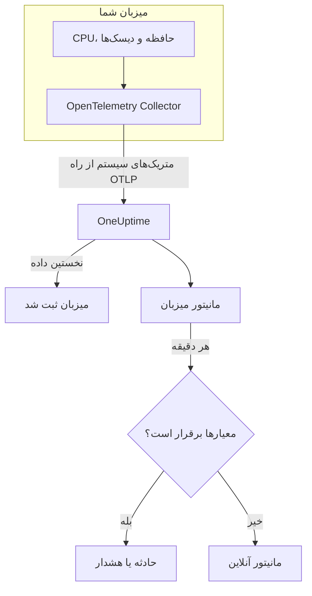

# مانیتور میزبان

مانیتور میزبان یک ماشین – CPU، حافظه، دیسک‌ها، بار و فرایندهای آن – را زیر نظر می‌گیرد و وقتی اشباع شده یا در حال پر شدن است به شما خبر می‌دهد. این مانیتور متریک‌های `system.*` در OpenTelemetry را می‌خواند که یک OpenTelemetry Collector از میزبان می‌فرستد، همان داده‌ای که محصول **میزبان‌ها** نشان می‌دهد، پس هیچ چیز از بیرون کاوش نمی‌شود.

:::cards
- [ساخت مانیتور](#ساخت-یک-مانیتور-میزبان): شش گام در داشبورد.
- [الگوها](#الگوهای-هشدار-آماده): پنج هشدار آماده برای CPU، حافظه، دیسک، بار و فرایندها.
- [متریک‌ها](#متریکهای-جمعآوریشده): متریک‌های میزبان که می‌توانید بر پایه‌شان هشدار دهید، و یکاهای آن‌ها.
- [میزبان یا Server / VM؟](#مانیتور-میزبان-یا-مانیتور-server-vm): کدام یک از دو مانیتور ماشین را به کار ببرید.
:::

## چگونه کار می‌کند

یک OpenTelemetry Collector با گیرنده `hostmetrics` روی میزبان اجرا می‌شود. هر ۳۰ ثانیه ارقام CPU، حافظه، دیسک، شبکه، بار و فرایندهای میزبان را می‌خواند و از راه OTLP به OneUptime می‌فرستد. نخستین داده از یک میزبان آن را زیر **میزبان‌ها** ثبت می‌کند.

مانیتور میزبان به یک میزبان وابسته است. هر دقیقه پرس‌وجوی خود را روی متریک‌های آن میزبان اجرا می‌کند و نتیجه را با معیارهایش مقایسه می‌کند.

### مانیتور میزبان یا مانیتور Server / VM؟

OneUptime دو مانیتور برای ماشین‌ها دارد. هر دو می‌توانند روی یک میزبان اجرا شوند.

| | مانیتور میزبان | مانیتور Server / VM |
| --- | --- | --- |
| **عامل** | یک OpenTelemetry Collector با گیرنده `hostmetrics` | عامل زیرساخت OneUptime |
| **داده** | متریک‌های `system.*` و `process.*` در OpenTelemetry، همان‌هایی که صفحه‌های **میزبان‌ها** نمودارشان را رسم می‌کنند | گزارش وضعیتی که عامل به مانیتور می‌فرستد |
| **معیارها** | آستانه‌ها یا تشخیص ناهنجاری روی هر پرس‌وجو یا فرمول متریک | بررسی‌های داخلی مانند مصرف CPU، حافظه و دیسک |
| **راه‌اندازی** | Collector را نصب کنید؛ میزبان خودش را ثبت می‌کند | مانیتور را بسازید، سپس کلید محرمانه‌اش را به عامل بدهید |

وقتی میزبان از قبل داده OpenTelemetry می‌فرستد، یا وقتی لاگ‌ها و متریک‌های غنی‌تر را از همان Collector می‌خواهید، از مانیتور میزبان استفاده کنید. برای دیگری، [مانیتور سرور / ماشین مجازی](/docs/monitor/server-monitor) را ببینید.

## پیش از شروع

- **یک OpenTelemetry Collector روی میزبان اجرا کنید**، با گیرنده `hostmetrics`. [کالکتور OpenTelemetry روی میزبان](/docs/telemetry/host-otel-collector) Linux، macOS و Windows را پوشش می‌دهد، و **محصولات → زیرساخت → میزبان‌ها → مستندات** یک پیکربندی آماده ارائه می‌دهد.
- **متریک‌های بهره‌برداری را روشن کنید.** `system.cpu.utilization`، `system.memory.utilization` و `system.filesystem.utilization` در گیرنده اختیاری‌اند، و الگوهای CPU، حافظه و سامانه فایل به آن‌ها نیاز دارند. پیکربندی داشبورد آن‌ها را روشن می‌کند.
- **بررسی کنید میزبان ثبت شده باشد.** به محض رسیدن نخستین داده، با نام `host.name` خود زیر **محصولات → زیرساخت → میزبان‌ها → همه میزبان‌ها** پدیدار می‌شود.

## ساخت یک مانیتور میزبان

:::steps
### یک مانیتور تازه شروع کنید

به **مانیتورها** بروید و روی **ساخت مانیتور** کلیک کنید.

### نوع میزبان را برگزینید

زیر **نوع مانیتور**، روی **انواع دیگر مانیتور** کلیک کنید و **میزبان** را زیر **زیرساخت** برگزینید. یک **نام** وارد کنید – در عنوان حادثه‌ها و هشدارها به کار می‌رود – و روی **بعدی** کلیک کنید.

### میزبان مورد نظر را برگزینید

زیر **Host Monitor Configuration**، ماشین را از **میزبان** برگزینید. هر میزبانی که داده فرستاده در فهرست است.

### برگزینید چه چیزی پایش شود

یکی از سه زبانه را برگزینید:

- **Quick Setup** – روی یک [الگو](#الگوهای-هشدار-آماده) کلیک کنید. متریک، تجمیع، بازه زمانی و آستانه‌ها را تعیین می‌کند و معیارهای زیر را با معیارهای خودش جایگزین می‌کند. همچنان می‌توانید **بازه زمانی** را تغییر دهید.
- **Custom Metric** – یک متریک از **Host Metric** برگزینید، سپس **تجمیع** و **بازه زمانی** را تعیین کنید.
- **پیشرفته** – پرس‌وجوها و فرمول‌ها را خودتان زیر **انتخاب متریک‌ها** بسازید، برای نمونه یک فیلتر روی `state` یا گروه‌بندی بر پایه `mountpoint`.

### معیارها را بررسی کنید

هر معیار را زیر **معیارهای مانیتور** باز کنید و **متریک**، **تجمیع**، **شرط** و **Threshold** آن را بررسی کنید. الگو این‌ها را پر می‌کند. با **Custom Metric** یا **پیشرفته**، مانیتور با [معیارهای پیش‌فرض](#معیارهای-پیشفرض) شروع می‌شود که فقط افت متریک به صفر را می‌بینند، پس آستانه خودتان را تعیین کنید.

### مانیتور را بسازید

روی **ساخت مانیتور** کلیک کنید. OneUptime صفحه مانیتور را باز می‌کند و آن را هر دقیقه ارزیابی می‌کند. حادثه‌ها و هشدارهایی که باز می‌کند در صفحه‌های **حوادث** و **هشدارها**ی میزبان هم فهرست می‌شوند.
:::

> [!TIP]
> برای راه‌اندازی هم‌زمان چند الگو، میزبان را از **محصولات → زیرساخت → میزبان‌ها** باز کنید و به **Recommendations** بروید. الگوهای دلخواه و کسانی را که باید خبر داده شوند برگزینید، و OneUptime به ازای هر الگو یک مانیتور می‌سازد.

## تنظیمات مانیتور

| فیلد | زبانه | چه می‌کند |
| --- | --- | --- |
| **میزبان** | همه | الزامی. هر پرس‌وجو را به `resource.host.name` میزبان محدود می‌کند. |
| **Host Metric** | Custom Metric | یک متریک از [فهرست](#متریکهای-جمعآوریشده)، گروه‌بندی‌شده به‌صورت CPU، حافظه، دیسک، شبکه، بار و فرایندها. |
| **تجمیع** | Custom Metric | شیوه ترکیب نمونه‌ها: **میانگین**، **بیشینه**، **کمینه**، **جمع** یا **تعداد**. از تجمیع معمول متریک شروع می‌شود. |
| **بازه زمانی** | همه | پنجره غلتانی که پرس‌وجو می‌خواند، از **Past 1 Minute** تا **Past 365 Days**. مانیتور تازه از **Past 1 Minute** شروع می‌شود؛ الگوها پنجره خودشان را تعیین می‌کنند. |
| **انتخاب متریک‌ها** | پیشرفته | سازنده پرس‌وجو: **متریک**، **Aggregate by**، **Filter by attributes**، **Group by**، به همراه **افزودن متریک** و **افزودن فرمول** برای ترکیب پرس‌وجوها. |

## الگوهای هشدار آماده

**Quick Setup** پنج الگو ارائه می‌دهد. هر کدام یک مانیتور کامل می‌سازد: یک پرس‌وجو، یک معیار که فعال می‌شود و یکی که بهبود می‌یابد. آستانه‌ها نقطه شروع‌اند و می‌توانید ویرایششان کنید.

یک معیار فقط وقتی فعال می‌شود که شرط در همه دقیقه‌های پنجره‌اش برقرار باشد، و ۱۰٪ آن‌سوی آستانه بهبود می‌یابد تا مقداری که حول مرز نوسان دارد مدام جابه‌جا نشود.

| الگو | شدت | چه چیزی را پایش می‌کند | چه وقت فعال می‌شود | چه وقت بهبود می‌یابد |
| --- | --- | --- | --- | --- |
| High CPU Utilization | Warning | `system.cpu.utilization` برای وضعیت‌های `user` و `system`، جمع‌شده و به‌صورت درصد، ۵ دقیقه گذشته | بیش از ۸۰٪ | ۷۲٪ یا کمتر |
| High Memory Utilization | Warning | `system.memory.utilization` برای وضعیت `used`، به‌صورت درصد، ۵ دقیقه گذشته | بیش از ۸۵٪ | ۷۶٫۵٪ یا کمتر |
| High Filesystem Usage | بحرانی | `system.filesystem.utilization`، Max به ازای هر `mountpoint` و `device`، به‌صورت درصد، ۵ دقیقه گذشته | بیش از ۹۰٪ | ۸۱٪ یا کمتر |
| High Load Average (1m) | Warning | `system.cpu.load_average.1m`، Avg، ۵ دقیقه گذشته | بیش از ۴ | ۳٫۶ یا کمتر |
| High Process Count | Warning | `system.processes.count`، Max، ۵ دقیقه گذشته | بیش از ۲۰۰۰ | ۱۸۰۰ یا کمتر |

**شدت** برچسبی است که فهرست انتخاب نشان می‌دهد. حادثه و هشداری که یک الگو می‌سازد از شدیدترین شدت حادثه و هشدار پروژه شما شروع می‌شوند؛ آن‌ها را در معیارها تغییر دهید.

- **CPU** زمان مشغولی است (`user` به اضافه `system`)، همان رقمی که **نمای کلی** میزبان در نمودار نشان می‌دهد. iowait و steal در آن نیستند.
- **حافظه** بافرها و کش صفحه را کنار می‌گذارد، پس میزبانی که بیشترش کش است آن را فعال نمی‌کند.
- **سامانه فایل** به ازای هر نقطه سوارکردن یک حادثه باز می‌کند. سامانه‌های فایل مجازی فقط‌خواندنی، مانند سوارکردن‌های `squashfs` در snap یا `devfs` در macOS، همیشه ۱۰۰٪ پرند؛ آن‌ها را در خراشنده `filesystem` در Collector کنار بگذارید.
- **میانگین بار** طول خام صف اجراست و بر تعداد هسته‌ها تقسیم نشده است: ۴ روی یک میزبان ۲ هسته‌ای یعنی اشباع و روی یک میزبان ۳۲ هسته‌ای عادی است، پس روی میزبان‌های بزرگ آن را بالا ببرید.
- **تعداد فرایندها** بزرگ‌ترین وضعیت تکی فرایند (`running`، `sleeping`، …) را مقایسه می‌کند، نه کل میزبان را، پس با فهرست فرایندها جور نخواهد بود. خراشنده فرایندها فقط روی Linux گزارش می‌دهد.

## متریک‌های جمع‌آوری‌شده

فهرست **Host Metric** این متریک‌ها را ارائه می‌دهد. هر کدام `resource.host.name` را با خود دارد که مانیتور با آن پرس‌وجوهایش را به یک میزبان محدود می‌کند.

> [!IMPORTANT]
> متریک‌های بهره‌برداری نسبتی از ۰ تا ۱ هستند، نه درصد: در آستانه‌ای روی متریک خام، برای ۸۰٪ از `0.8` استفاده کنید. الگوها با یک فرمول به درصد تبدیل می‌کنند، پس آستانه‌هایشان ۸۰، ۸۵ و ۹۰ است.

### CPU

| متریک | یکا | توضیح |
| --- | --- | --- |
| `system.cpu.utilization` | نسبت | سهم زمان CPU در هر `state` (`user`، `system`، `idle`، …). روی `state` فیلتر کنید: میانگین همه وضعیت‌ها هرگز به آستانه سودمندی نمی‌رسد. |
| `process.cpu.utilization` | نسبت | مصرف CPU هر فرایند روی میزبان. |

### حافظه

| متریک | یکا | توضیح |
| --- | --- | --- |
| `system.memory.utilization` | نسبت | سهم حافظه فیزیکی در هر `state` (`used`، `free`، `cached`، …). برای حافظه در حال استفاده روی `state = used` فیلتر کنید. |
| `system.memory.usage` | بایت | مصرف حافظه بر حسب بایت. |

### دیسک

| متریک | یکا | توضیح |
| --- | --- | --- |
| `system.filesystem.utilization` | نسبت | سهم ظرفیت هر سامانه فایل که در حال استفاده است، به ازای هر `mountpoint` و `device`. |
| `system.filesystem.usage` | بایت | مصرف سامانه فایل بر حسب بایت. |

### شبکه

| متریک | یکا | توضیح |
| --- | --- | --- |
| `system.network.io` | بایت | بایت‌های دریافتی و ارسالی. شمارنده‌ای در طول عمر. |

### بار

| متریک | یکا | توضیح |
| --- | --- | --- |
| `system.cpu.load_average.1m` | تعداد | میانگین بار در دقیقه گذشته. |
| `system.cpu.load_average.5m` | تعداد | میانگین بار در ۵ دقیقه گذشته. |
| `system.cpu.load_average.15m` | تعداد | میانگین بار در ۱۵ دقیقه گذشته. |

### فرایندها

| متریک | یکا | توضیح |
| --- | --- | --- |
| `system.processes.count` | تعداد | فرایندهای روی میزبان، یک سری به ازای هر `status` فرایند. |

سازنده پرس‌وجو در **پیشرفته** همه متریک‌هایی را که میزبان می‌فرستد فهرست می‌کند، نه فقط این‌ها را.

## معیارهای مانیتورینگ

یک معیار یکی از پرس‌وجوها یا فرمول‌های مانیتور را با یک آستانه مقایسه می‌کند. معیارهای مانیتور میزبان **نوع فیلتر** ندارند: هر قاعده مقدار متریک را با این فیلدها بررسی می‌کند.

| فیلد | چه می‌کند |
| --- | --- |
| **متریک** | پرس‌وجو یا فرمولی که بررسی می‌شود، بر پایه نام متغیرش. |
| **تجمیع** | اینکه مقدارهای پنجره چطور به یک پاسخ تبدیل می‌شوند: **میانگین**، **جمع**، **Maximum Value**، **Minimum Value**، **All Values** (همه مقدارها باید جور باشند) یا **Any Value** (یکی کافی است). |
| **شرط** | **Greater Than**، **Less Than**، **Greater Than Or Equal To**، **Less Than Or Equal To** یا **Equal To** – یا یک شرط ناهنجاری: **Anomalously High**، **Anomalously Low** یا **Anomalous**. |
| **Threshold** | مقداری که با آن مقایسه می‌شود. وقتی متریک یکا دارد، فهرستی از یکاها کنارش هست. برای شرط‌های ناهنجاری نشان داده نمی‌شود. |
| **حساسیت** | فقط شرط‌های ناهنجاری. **پایین** (۴σ)، **متوسط** (۳σ، پیش‌فرض) یا **بالا** (۲σ). |
| **پنجره مبنا** | فقط شرط‌های ناهنجاری. ۱۴ روز (پیش‌فرض)، ۲۸، ۶۰ یا ۹۰ روز سابقه. |
| **اگر داده‌ای نبود** | زیر **فیلدهای بیشتر**. وقتی پنجره هیچ نمونه‌ای ندارد چه شود: **Ignore** (پیش‌فرض)، **Treat As Zero** یا **تریگر**. |

شرط‌های ناهنجاری هر مقدار را با همان ساعت از هفته در خط مبنا مقایسه می‌کنند. تا وقتی پنجره مبنا سابقه کافی نداشته باشد، در وضعیت «Learning» می‌مانند و چیزی پدید نمی‌آورند.

هر معیار همچنین می‌گوید وقتی برقرار شد چه باید کرد: تغییر وضعیت مانیتور، ساختن یک هشدار یا اعلام یک حادثه. معیارها از بالا به پایین بررسی می‌شوند و نخستین معیاری که برقرار شود تصمیم می‌گیرد.

### معیارهای پیش‌فرض

مانیتوری که از الگو نمی‌سازید با دو معیار شروع می‌شود:

| ترتیب | معیار | وقتی برقرار است که | سپس |
| --- | --- | --- | --- |
| ۱ | Check if _monitor name_ is offline | هر مقداری از نخستین پرس‌وجو `0` باشد | مانیتور را **آفلاین** علامت می‌زند و حادثه «_monitor name_ is offline» را اعلام می‌کند، که با بهبود مانیتور خودش برطرف می‌شود. |
| ۲ | Check if _monitor name_ is online | هر مقداری بیش از `0` باشد | مانیتور را **عملیاتی** علامت می‌زند. |

> [!IMPORTANT]
> سکوت با هیچ‌یک از دو معیار جور نیست: میزبانی که دیگر داده نمی‌فرستد مانیتور را همان‌طور که بود رها می‌کند. برای اینکه وقتی میزبان ساکت شد خبردار شوید، **اگر داده‌ای نبود** را در یک معیار روی **تریگر** بگذارید. زمانی که خود OneUptime داده دریافت نمی‌کرد هرگز «بدون داده» به حساب نمی‌آید: بررسی‌ای که پنجره‌اش چنین زمانی را در بر دارد به جای آن صبر می‌کند، همان‌طور که [وقتی OneUptime داده دریافت نمی‌کند](/docs/monitor/when-oneuptime-is-not-receiving) توضیح می‌دهد.

## رفع اشکال

:::details میزبان در فهرست میزبان نیست
میزبان‌ها خودشان از روی داده‌های Collector ثبت می‌شوند، که به یک `host.name` و نوع سیستم‌عامل میزبان نیاز دارد – هر دو از پردازنده `resourcedetection` در Collector می‌آیند. بررسی کنید Collector در حال اجرا باشد و میزبان زیر **محصولات → زیرساخت → میزبان‌ها → همه میزبان‌ها** فهرست شده باشد. [کالکتور OpenTelemetry روی میزبان](/docs/telemetry/host-otel-collector) پیکربندی را پوشش می‌دهد.
:::

:::details یک آستانه CPU یا حافظه هرگز فعال نمی‌شود
متریک‌های بهره‌برداری نسبت‌هایی‌اند که بیشینه‌شان `1.0` است، پس آستانه‌ای که دستی `80` نوشته شود هرگز رد نمی‌شود: از `0.8` استفاده کنید، یا از یک الگو شروع کنید که به درصد تبدیل می‌کند. همچنین روی `state` فیلتر کنید – `user` و `system` برای CPU، `used` برای حافظه. میانگین همه وضعیت‌ها نزدیک ۱ تقسیم بر تعداد وضعیت‌ها می‌ماند.
:::

:::details حادثه‌ها برای میزبان نادرست فعال می‌شوند
مانیتور هر پرس‌وجو را با `resource.host.name` برابر با میزبانی که برگزیده‌اید محدود می‌کند. میزبان‌هایی که `host.name` یکسانی گزارش می‌دهند در یک سری ادغام می‌شوند، پس به هر میزبان نامی یکتا بدهید.
:::

:::details High Filesystem Usage برای نقطه سوارکردنی فعال می‌شود که همیشه پر است
سامانه‌های فایل مجازی فقط‌خواندنی، مانند سوارکردن‌های حلقه‌ای `squashfs` در snap زیر `/snap` یا `devfs` در macOS، طبق طراحی ۱۰۰٪ پرند و هرگز بهبود نمی‌یابند. آن‌ها را از خراشنده `filesystem` در Collector کنار بگذارید.
:::

## گام‌های بعدی

:::cards
- [کالکتور OpenTelemetry روی میزبان](/docs/telemetry/host-otel-collector): Collectorی را که این مانیتور می‌خواند نصب و پیکربندی کنید.
- [مانیتور سرور / ماشین مجازی](/docs/monitor/server-monitor): مانیتور ماشین‌هایی که عامل داده را به آن می‌فرستد.
- [مانیتور متریک‌ها](/docs/monitor/metrics-monitor): بر پایه هر متریکی، در سراسر میزبان‌ها و سرویس‌ها هشدار دهید.
- [نمای کلی حوادث](/docs/incidents/index): پس از آنکه یک معیار حادثه‌ای اعلام کرد چه اتفاقی می‌افتد.
:::
