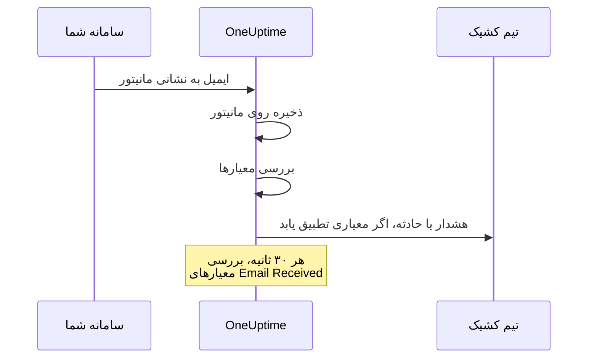

# مانیتور ایمیل ورودی

مانیتور ایمیل ورودی یک نشانی ایمیل به شما می‌دهد که فقط به یک مانیتور تعلق دارد. هر چیزی که بتواند ایمیل بفرستد — یک کار پشتیبان‌گیری، یک سامانه قدیمی، هشدارهای یک ارائه‌دهنده ابری — نتیجه‌هایش را به آنجا می‌فرستد، و OneUptime هر ایمیل را بر پایه معیارهای شما بررسی می‌کند تا مانیتور را از کار افتاده علامت بزند، حادثه‌ای باز کند یا هشداری بسازد، و وقتی خبر رفع مشکل رسید آن‌ها را رفع کند.

:::cards
- [مانیتور را بسازید](#ساخت-مانیتور-ایمیل-ورودی): یک نشانی بگیرید و فرستنده خود را به آن هدایت کنید.
- [نشانی را تأیید کنید](#تأیید-نشانی-نزد-فرستنده): ایمیل تأیید فرستنده را روی مانیتور بخوانید.
- [معیار بنویسید](#نوعهای-فیلتر-در-دسترس): موضوع، فرستنده یا متن را تطبیق دهید، یا وقتی ایمیل‌ها دیگر نمی‌رسند هشدار دهید.
- [ایمیل را در هشدارها به کار ببرید](#متغیرهای-قالب): موضوع و متن را در عنوان‌ها و توضیح‌ها بگذارید.
:::

## چگونه کار می‌کند

ایمیل یک مدل push است: سامانه شما می‌فرستد، و OneUptime گوش می‌دهد. هر ایمیل هنگام رسیدن بر پایه معیارهای مانیتور بررسی می‌شود. معیارهایی که دنبال ایمیلی می‌گردند که *باید* می‌رسید، افزون بر این بر پایه زمان‌بندی، هر ۳۰ ثانیه، بررسی می‌شوند.



1. وقتی یک مانیتور ایمیل ورودی می‌سازید، OneUptime یک نشانی ایمیل یکتا به آن می‌دهد.
2. هر ایمیلی که به آن نشانی فرستاده شود روی مانیتور ذخیره می‌شود و از بالا بر پایه معیارهای آن ارزیابی می‌شود؛ نخستین معیاری که تطبیق یابد تصمیم می‌گیرد.
3. معیار تطبیق‌یافته می‌تواند وضعیت مانیتور را تغییر دهد، هشداری بسازد و حادثه‌ای اعلام کند. حادثه‌ای که **رفع خودکار حادثه** آن روشن است، یا هشداری که **رفع خودکار هشدار** آن روشن است، وقتی بعداً معیار دیگری تطبیق یابد رفع می‌شود — برای نمونه همان معیاری که مانیتور را آنلاین علامت می‌زند.

## ساخت مانیتور ایمیل ورودی

:::steps
### یک مانیتور تازه آغاز کنید

به **مانیتورها** بروید و روی **ساخت مانیتور** کلیک کنید.

### Incoming Email را برگزینید

در **نوع مانیتور** روی **انواع دیگر مانیتور** کلیک کنید و **Incoming Email** را زیر **Inbound Monitoring** برگزینید، یا در جعبه جست‌وجو `email` را تایپ کنید. یک **نام** وارد کنید و سپس روی **بعدی** کلیک کنید.

### معیارها را بازبینی کنید

گام **معیارها** با [معیارهای پیش‌فرض](#آنچه-از-ابتدا-دارید) آغاز می‌شود، که وقتی ایمیلی `error` را نام ببرد مانیتور را آفلاین علامت می‌زنند. برای تغییر یک معیار روی آن کلیک کنید، یا برای افزودن یکی روی **افزودن معیار** کلیک کنید. برای راه‌اندازی‌های رایج [نمونه پیکربندی‌ها](#نمونه-پیکربندیها) را ببینید.

### مانیتور را بسازید

روی **ساخت مانیتور** کلیک کنید. مانیتور در صفحه **نمای کلی** خود باز می‌شود، که در آن کارت **Incoming Email Address** نشانی را با دکمه رونوشت نشان می‌دهد تا نخستین ایمیل برسد.

### به نشانی ایمیل بفرستید

سامانه خود را طوری پیکربندی کنید که اعلان‌هایش را به این نشانی بفرستد. اگر فرستنده از شما بخواهد نخست نشانی را تأیید کنید، [تأیید نشانی نزد فرستنده](#تأیید-نشانی-نزد-فرستنده) را ببینید.
:::

> [!NOTE]
> نشانی شامل کلید محرمانه مانیتور است، پس فقط کسانی که می‌توانند مانیتورها را ویرایش کنند آن را می‌بینند. دیگران می‌بینند که جزئیات راه‌اندازی پنهان است.

## قالب نشانی ایمیل

هر مانیتور ایمیل ورودی نشانی یکتایی با این قالب می‌گیرد:

```text
monitor-{secret-key}@{inbound-domain}
```

کلید محرمانه یک UUID است، برای نمونه `monitor-3f2b8c1e-5d4a-4f6b-9a7c-2e1d0b9f8a6c@inbound.yourdomain.com`. پس از رسیدن نخستین ایمیل، نشانی در صفحه **نمای کلی** مانیتور در کارت **Inbound email address**، کنار زمان رسیدن واپسین ایمیل، می‌ماند. صفحه **مستندات** مانیتور هم آن را نشان می‌دهد.

## بازنشانی یا سفارشی کردن نشانی ایمیل

به زبانه **تنظیمات** مانیتور بروید. کارت **Incoming Email Address** نشانی کنونی را نشان می‌دهد و دو راه برای جایگزینی آن پیش می‌گذارد:

| کار | چه می‌کند | چه زمانی به کار ببرید |
| --- | --- | --- |
| **Reset Address** | یک نشانی تازه و تصادفی `monitor-{secret-key}@{inbound-domain}` به مانیتور می‌دهد. اگر مانیتور نشانی سفارشی داشته باشد، بازنشانی آن را برمی‌دارد. پیش از انجام، تأیید می‌خواهد. | نشانی فاش شده است، یا می‌خواهید هر چه را به آن می‌فرستد قطع کنید. |
| **Customize Address** | به شما اجازه می‌دهد بخش پیش از @ را برگزینید، برای نمونه `nightly-backups@{inbound-domain}`. آن را در **Address name** وارد کنید — می‌توانید نام را تایپ کنید یا کل نشانی را بچسبانید — و روی **Save Address** کلیک کنید. | نشانی‌ای می‌خواهید که مردم آن را بشناسند. |

هر دو کار با نمایش نشانی تازه همراه دکمه رونوشت پایان می‌یابند.

> [!WARNING]
> **نشانی قدیمی بی‌درنگ از کار می‌افتد**: ایمیلی که به آن فرستاده شود نادیده گرفته می‌شود، پس همه سامانه‌هایی را که به این مانیتور ایمیل می‌فرستند به‌روز کنید.

قاعده‌های نشانی سفارشی:

- ۳ تا ۶۴ نویسه: حروف کوچک، رقم‌ها، نقطه (`.`)، خط تیره (`-`) و زیرخط (`_`)، بدون دو نقطه پشت سر هم. باید با یک حرف یا رقم آغاز و پایان یابد. ورودی با حروف بزرگ برای شما به حروف کوچک تبدیل می‌شود.
- دامنه همیشه دامنه ایمیل ورودی سرور است.
- نام نباید پیش‌تر توسط مانیتور دیگری به کار رفته باشد. همه پروژه‌های سرور دامنه ورودی را با هم به اشتراک می‌گذارند، پس نام باید در میان همه آن‌ها یکتا باشد.
- نام‌هایی به شکل `monitor-{id}` و `workflow-{id}` برای نشانی‌های ساخته‌شده رزرو شده‌اند. نام صندوق‌هایی که به خود دامنه تعلق دارند هم رزرو شده‌اند: `abuse`، `admin`، `administrator`، `hostmaster`، `mailer-daemon`، `noc`، `postmaster`، `root`، `security` و `webmaster`.

نشانی سفارشی هم درست مانند نشانی ساخته‌شده یک اعتبارنامه است: هر کسی که آن را بداند می‌تواند ایمیلی بفرستد که این مانیتور ارزیابی می‌کند. حدس زدن نشانی‌های ساخته‌شده عملاً ناممکن است، اما نامی کوتاه و آشکار را می‌توان حدس زد. اگر این برایتان مهم است، نامی برگزینید که حدس زدنش دشوار باشد.

کاربران API می‌توانند همین کار را از راه Monitor API روی یک مانیتور موجود انجام دهند: برای استفاده از نشانی سفارشی، `incomingEmailCustomLocalPart` را روی نام تنظیم کنید، یا برای بازگشت به نشانی ساخته‌شده آن را روی `null` بگذارید. بازنشانی یعنی نوشتن یک `incomingEmailSecretKey` تازه و تنظیم `incomingEmailCustomLocalPart` روی `null` در همان به‌روزرسانی.

## تأیید نشانی نزد فرستنده

برخی سرویس‌ها تا وقتی کسی ثابت نکند که می‌تواند ایمیل‌های یک نشانی تازه را بخواند، به آن هشدار نمی‌فرستند. آن‌ها نخست یک ایمیل تأیید می‌فرستند، و آن ایمیل مانند هر ایمیل دیگری به مانیتور می‌رسد. برای خواندن آن:

:::steps
### نشانی را به سرویس بیفزایید

نشانی مانیتور را به سرویس بیفزایید و ذخیره کنید. سرویس ایمیل تأیید خود را می‌فرستد.

### تازه‌ترین ایمیل را باز کنید

در OneUptime مانیتور را باز کنید. در صفحه **نمای کلی** آن، کارت **خلاصه مانیتور** تازه‌ترین ایمیل را نشان می‌دهد. بررسی کنید که **از** (فرستنده) و **موضوع** به ایمیل تأیید تعلق دارند، سپس روی **نمایش جزئیات بیشتر** کلیک کنید.

### کد یا پیوند را رونوشت کنید

کد یا پیوند در **متن ایمیل (متنی)** است. **متن ایمیل (HTML)** منبع HTML را نشان می‌دهد، پس اگر پیوندی را از آنجا رونوشت می‌کنید، هر `&amp;` درون آن را به `&` تبدیل کنید.

### تأیید را به پایان برسانید

تأیید را همان‌طور که ایمیل می‌گوید به پایان برسانید.
:::

اگر از آن زمان ایمیل دیگری رسیده باشد، کارت دیگر ایمیل تأیید را نشان نمی‌دهد. **گزارش‌های پایش** را باز کنید، ایمیل تأیید را از روی موضوعش در ستون **ایمیل** پیدا کنید، و در همان ردیف روی **مشاهده خلاصه** کلیک کنید.

> [!IMPORTANT]
> **معیارهای شما هم آن را می‌بینند.** ایمیل تأیید مانند هر ایمیل دیگری ارزیابی می‌شود. عبارتی مانند "if you received this in error" با معیار پیش‌فرض `error` تطبیق می‌یابد و مانیتور را آفلاین علامت می‌زند. برای پرهیز از این، هنگام تأیید، **بررسی این مانیتور** را در کارت **پایش** در صفحه **تنظیمات** مانیتور خاموش کنید (تأیید می‌خواهد). مانیتوری که پایشش خاموش است همچنان ایمیل را ثبت می‌کند، و کارت **خلاصه مانیتور** هنوز آن را نشان می‌دهد. اما چیزی را ارزیابی نمی‌کند، پس ایمیل ردیفی در **گزارش‌های پایش** نمی‌گیرد: پیش از رسیدن ایمیل دیگری آن را بخوانید. وقتی کارتان تمام شد، در نوار بالای صفحه‌های مانیتور روی **روشن کردن پایش** بزنید، یا کلید را دوباره روشن کنید.

**تأیید به نشانی تعلق دارد.** اگر [نشانی را بازنشانی یا سفارشی کنید](#بازنشانی-یا-سفارشی-کردن-نشانی-ایمیل)، سرویس گیرنده‌ای تازه می‌بیند، و باید دوباره تأیید کنید.

### گروه‌های اقدام Azure Monitor

از ژوئیه ۲۰۲۶، ‏Azure به‌تدریج این الزام را اعمال می‌کند که هر گیرنده تازه از نوع **Email** در یک گروه اقدام با یک رمز یک‌بارمصرف تأیید شود. تا وقتی این کار انجام نشود، گروه اقدام نه هشداری و نه اعلان آزمایشی به آن نشانی می‌فرستد.

:::steps
1. یک اعلان از نوع **Email** با نشانی مانیتور به گروه اقدام بیفزایید، و گروه اقدام را ذخیره کنید. ‏Azure ایمیل تأیید را از یک نشانی Microsoft مانند `azure-noreply@microsoft.com` می‌فرستد.
2. آن را همان‌طور که در بالا آمد روی مانیتور بخوانید، و دستورهای آن را تا ۳۰ دقیقه پس از ذخیره گروه اقدام انجام دهید. اگر رمز منقضی شد، گروه اقدام را باز کنید و **Resend** را برگزینید.
3. گروه اقدام را باز کنید و برای فرستادن یک اعلان آزمایشی **Test** را برگزینید. این اعلان مانند یک هشدار واقعی به مانیتور می‌رسد، پس نشان می‌دهد آیا معیارهای شما با ایمیل‌های Azure تطبیق می‌یابند.
:::

تأیید برای همه گروه‌های اقدام در همان tenant ‏Azure معتبر است، پس هر نشانی فقط یک بار باید تأیید شود.

### Amazon SNS

اشتراک ایمیلی یک topic در SNS تا وقتی تأیید نشود هیچ چیز دریافت نمی‌کند. وقتی اشتراک را می‌سازید، Amazon SNS یک ایمیل تأیید به نشانی می‌فرستد. آن را همان‌طور که در بالا آمد روی مانیتور بخوانید، و پیوند **Confirm subscription** آن را در مرورگر خود باز کنید. SNS اشتراکی را که ظرف ۴۸ ساعت تأیید نشود حذف می‌کند؛ اگر چنین شد، اشتراک را دوباره بسازید.

## آنچه از ابتدا دارید

مانیتور ایمیل ورودی تازه با دو معیار ساخته می‌شود که متن ایمیل را می‌خوانند:

| معیار | نوع فیلتر | شرط فیلتر | مقدار | اثر |
| -------- | ----------- | ---------------- | ------- | -------------------------------------------- |
| Offline  | Email Body  | شامل است | `error` | مانیتور را آفلاین علامت می‌زند، حادثه‌ای باز می‌کند |
| Online   | Email Body  | Not Contains | `error` | مانیتور را آنلاین علامت می‌زند |

این برای حالت رایجی مناسب است که یک کار یا ابزار شخص ثالث نتیجه خودش را ایمیل می‌کند: پیامی که متنش `error` را نام ببرد مانیتور را پایین می‌آورد، و پیام بعدی بدون آن واژه مانیتور را بالا می‌آورد و حادثه را رفع می‌کند. تطبیق متن به بزرگی و کوچکی حروف حساس نیست، پس `Error` و `ERROR` هم تطبیق می‌یابند.

مقدار را به آنچه فرستنده‌تان واقعاً می‌نویسد تغییر دهید (`FAILED`، `exit code 1` و مانند این‌ها).

> [!NOTE]
> این پیش‌فرض‌ها کلید مرد مرده **نیستند**: وقتی ایمیل‌ها دیگر نرسند، هیچ چیز اینجا فعال نمی‌شود. معیارهایی که فقط موضوع، فرستنده، متن یا گیرنده را می‌خوانند هنگام رسیدن ایمیل ارزیابی می‌شوند و در هیچ زمان دیگری نه. برای هشدار هنگام سکوت، معیاری از نوع **Email Received** / **Not Recieved In Minutes** بیفزایید — [نمونه ۳](#نمونه-۳-مانیتور-ضربان-قلب-بدون-ایمیل-هشدار) را ببینید.

## نوع‌های فیلتر در دسترس

می‌توانید بر پایه این فیلدهای ایمیل معیار بسازید:

| نوع فیلتر | توضیح |
| ------------------------- | ----------------------------------------------------------------------------------- |
| **موضوع ایمیل** | خط موضوع ایمیل ورودی |
| **Email From Address** | نشانی ایمیل فرستنده: خود نشانی، با حروف کوچک، بدون نام نمایشی |
| **Email Body** | بخش متن ساده متن ایمیل |
| **Email To Address** | نشانی ایمیل گیرنده |
| **Email Received** | معیارهای زمانی برای اینکه ایمیل‌ها چه زمانی دریافت می‌شوند |
| **JavaScript Expression** | یک عبارت JavaScript سفارشی که باید درست ارزیابی شود |

نشانی خود مانیتور پیش از اینکه هر معیاری ایمیل را بخواند پوشانده می‌شود، پس در **Email To Address**، ‏**موضوع ایمیل** و **Email Body** به‌صورت `[REDACTED]` خوانده می‌شود.

## شرط‌های فیلتر

### فیلترهای رشته‌ای (موضوع، فرستنده، متن، گیرنده)

| شرط فیلتر | توضیح | نمونه |
| ---------------- | ----------------------------------------- | ---------------------------------- |
| **شامل است** | فیلد متن داده‌شده را دارد | موضوع "CRITICAL" را دارد |
| **Not Contains** | فیلد متن داده‌شده را ندارد | موضوع "TEST" را ندارد |
| **Equal To** | فیلد دقیقاً با متن داده‌شده یکی است | فرستنده برابر با "alerts@service.com" است |
| **Not Equal To** | فیلد با متن داده‌شده یکی نیست | موضوع برابر با "OK" نیست |
| **Starts With** | فیلد با متن داده‌شده آغاز می‌شود | موضوع با "[ALERT]" آغاز می‌شود |
| **Ends With** | فیلد با متن داده‌شده پایان می‌یابد | موضوع با "- Production" پایان می‌یابد |
| **Is Empty** | فیلد خالی است | متن خالی است |
| **Is Not Empty** | فیلد محتوا دارد | موضوع خالی نیست |

همه این مقایسه‌ها به بزرگی و کوچکی حروف حساس نیستند. فیلتری با مقدار خالی هرگز تطبیق نمی‌یابد.

### فیلترهای زمانی (Email Received)

داشبورد این شرط‌ها را "Recieved" می‌نویسد.

| شرط فیلتر | توضیح | نمونه |
| --------------------------- | ----------------------------------- | -------------------------------- |
| **Recieved In Minutes** | ایمیلی در X دقیقه دریافت شده است | ایمیل در ۳۰ دقیقه دریافت شده |
| **Not Recieved In Minutes** | در X دقیقه هیچ ایمیلی دریافت نشده است | ایمیلی در ۶۰ دقیقه دریافت نشده |

مانیتوری که هرگز ایمیلی دریافت نکرده، زمان ساخت خود را واپسین ایمیل به شمار می‌آورد.

### JavaScript Expression

| شرط فیلتر | توضیح |
| --------------------- | ------------------------------------- |
| **Evaluates To True** | عبارت مقداری درست‌انگار برمی‌گرداند |

عبارت در sandboxی اجرا می‌شود که هیچ فیلد ایمیلی به آن بسته نشده، پس نمی‌تواند موضوع، فرستنده، متن یا گیرنده پیامی را که بررسی را برانگیخته بخواند. برای تطبیق بر پایه محتوای ایمیل، از نوع‌های فیلتر **موضوع ایمیل**، **Email From Address**، **Email Body** و **Email To Address** استفاده کنید.

## نمونه پیکربندی‌ها

هر نمونه یک جفت معیار است. یک معیار فیلترها، یک **شرط تطابق** (**همه** یا **هر** یک از فیلترهایش)، و اقدام‌هایی دارد: تغییر وضعیت مانیتور، ساخت هشدار، اعلام حادثه. ‏**رفع خودکار هشدار** (یا **رفع خودکار حادثه**) را زیر **فیلدهای بیشتر** در هشدار یا حادثه روشن کنید، تا معیار دوم آنچه را معیار نخست باز کرده رفع کند.

### نمونه ۱: ساخت هشدار برای ایمیل‌های بحرانی

| معیار | فیلترها | شرط تطابق | اقدام‌ها |
| --- | --- | --- | --- |
| ایمیل بحرانی | **موضوع ایمیل** شامل است `CRITICAL`؛ **موضوع ایمیل** شامل است `ALERT`؛ **موضوع ایمیل** شامل است `ERROR` | **هر** | تغییر وضعیت به آفلاین؛ ساخت هشدار |
| ایمیل بهبود | **موضوع ایمیل** شامل است `RESOLVED`؛ **موضوع ایمیل** شامل است `RECOVERED` | **هر** | تغییر وضعیت به آنلاین |

معیار بحرانی را نخست بگذارید: معیارها از بالا بررسی می‌شوند، و نخستین معیاری که تطبیق یابد تصمیم می‌گیرد.

### نمونه ۲: پایش یک فرستنده مشخص

| معیار | فیلترها | شرط تطابق | اقدام‌ها |
| --- | --- | --- | --- |
| کار ناموفق | **Email From Address** Equal To `monitoring@legacy-system.com`؛ **موضوع ایمیل** شامل است `Failed` | **همه** | تغییر وضعیت به آفلاین؛ اعلام حادثه |
| کار موفق | **Email From Address** Equal To `monitoring@legacy-system.com`؛ **موضوع ایمیل** شامل است `Success` | **همه** | تغییر وضعیت به آنلاین |

### نمونه ۳: مانیتور ضربان قلب (بدون ایمیل = هشدار)

| معیار | فیلترها | اقدام‌ها |
| --- | --- | --- |
| ایمیل دیر کرده | **Email Received** Not Recieved In Minutes `60` | تغییر وضعیت به آفلاین؛ ساخت هشدار |
| ایمیل رسید | **Email Received** Recieved In Minutes `60` | تغییر وضعیت به آنلاین |

معیار نخست وقتی فعال می‌شود که ۶۰ دقیقه هیچ ایمیلی نرسیده باشد — برای کارهای زمان‌بندی‌شده یا فرایندهای دسته‌ای که ایمیل پایان کار می‌فرستند سودمند است. دومی به محض رسیدن یک ایمیل هشدار را رفع می‌کند. دقیقه‌هایی که خود OneUptime ایمیلی دریافت نمی‌کرد در این ۶۰ شمرده نمی‌شوند، همان‌طور که [وقتی OneUptime داده دریافت نمی‌کند](/docs/monitor/when-oneuptime-is-not-receiving) توضیح می‌دهد.

## کاربردها

| کاربرد | مانیتور چه می‌کند |
| --- | --- |
| یکپارچه‌سازی سامانه‌های قدیمی | هشدارهایی را که سامانه‌های قدیمی فقط با ایمیل می‌فرستند به حادثه‌های OneUptime تبدیل می‌کند، و وقتی ایمیل بهبود برسد آن‌ها را رفع می‌کند. |
| سرویس‌های شخص ثالث | اعلان‌های ارائه‌دهندگان ابری (AWS، ‏GCP، ‏Azure)، اسکنرهای امنیتی، ابزارهای پشتیبان‌گیری و هشدارهای انقضای گواهی را دریافت می‌کند. |
| کارهای زمان‌بندی‌شده | وقتی ایمیل پایان کار دیر کند، یا وقتی یک کار شکستی را ایمیل کند، هشدار می‌دهد. |
| گردآوری هشدارها | هشدارهای ایمیلی Nagios، ‏Zabbix یا ابزارهای دیگر را گرد می‌آورد، تا OneUptime تنها جایی باشد که آن‌ها را مدیریت می‌کنید. |

## متغیرهای قالب

عنوان‌ها، توضیح‌ها و یادداشت‌های رفع مشکل هشدارها و حادثه‌هایی که این مانیتور می‌سازد می‌توانند این متغیرها را به کار ببرند. فرم‌های هشدار و حادثه معیار آن‌ها را زیر **متغیرهای قالب** فهرست می‌کنند، و [قالب‌بندی حادثه و هشدار](/docs/monitor/incident-alert-templating) نحو آن را توضیح می‌دهد.

| متغیر | توضیح |
| --------------------- | ----------------------------------------------------------------- |
| `{{emailSubject}}`    | موضوع ایمیل دریافت‌شده |
| `{{emailFrom}}`       | نشانی ایمیل فرستنده |
| `{{emailTo}}`         | ایمیل به چه کسی فرستاده شده، با نشانی خود این مانیتور پوشانده‌شده |
| `{{emailBody}}`       | متن ساده ایمیل |
| `{{emailReceivedAt}}` | زمان دریافت ایمیل، به‌صورت مُهر زمانی ISO 8601 به وقت UTC |

- **عنوان از هرکدام یک خط می‌گیرد.** در عنوان، هر متغیر به یک خط با حداکثر ۱۵۰ نویسه بریده می‌شود، و اگر بلندتر بوده با `...` پایان می‌یابد. عنوان نمی‌تواند بلندتر از ۵۰۰ نویسه باشد، و هشدار یا حادثه‌ای با عنوان بیش از اندازه بلند اصلاً ساخته نمی‌شود، پس نقل کل یک ایمیل جلوی هشدار دادن مانیتور برای ایمیل‌های بلند را می‌گیرد. توضیح‌ها و یادداشت‌های رفع مشکل مقدار کامل را می‌گیرند.
- **نشانی این مانیتور پوشانده می‌شود.** نشانی مانند گذرواژه عمل می‌کند، پس پیش از ذخیره ایمیل پوشانده می‌شود، و `{{emailTo}}` به‌صورت `monitor-[REDACTED]@{inbound-domain}` خوانده می‌شود (یا `[REDACTED]@{inbound-domain}` برای نشانی سفارشی).
- **بررسی ایمیل نرسیده از واپسین ایمیل استفاده می‌کند.** وقتی یک معیار **Email Received** به این دلیل که ایمیلی به‌موقع نرسیده هشداری باز می‌کند، متغیرها واپسین ایمیلی را که مانیتور دریافت کرده توصیف می‌کنند. اگر هنوز ایمیلی نرسیده باشد، خالی‌اند.

## نمای خلاصه مانیتور

وقتی مانیتور ایمیلی دریافت کرده باشد، کارت **خلاصه مانیتور** در صفحه **نمای کلی** آن تازه‌ترین ایمیل را نشان می‌دهد:

- **آخرین ایمیل دریافت‌شده در**: زمان دریافت تازه‌ترین ایمیل
- **از**: فرستنده واپسین ایمیل
- **موضوع**: خط موضوع واپسین ایمیل

برای دیدن بقیه روی **نمایش جزئیات بیشتر** کلیک کنید:

- **هدرهای ایمیل**: هدرهای کامل واپسین ایمیل
- **متن ایمیل (متنی)**: متن ساده
- **متن ایمیل (HTML)**: متن HTML، که به‌صورت منبع HTML نمایش داده می‌شود نه رندرشده

### ایمیل‌های پیشین

کارت فقط تازه‌ترین ایمیل را نشان می‌دهد. هر ایمیلی که مانیتور ارزیابی می‌کند در **گزارش‌های پایش** هم نوشته می‌شود: ستون **ایمیل** موضوع و فرستنده آن را نشان می‌دهد، و **مشاهده خلاصه** در ردیف آن کل ایمیل را به همان شکل کارت نشان می‌دهد. مانیتوری که پایشش خاموش است چیزی را ارزیابی نمی‌کند، پس ایمیل‌هایی که دریافت می‌کند ردیفی نمی‌گیرند. اگر یکی از معیارهای شما **Email Received** را بررسی کند، مانیتور هر بار که ایمیل نرسیده را بررسی می‌کند نیز یک ردیف می‌نویسد. ستون **ایمیل** در این ردیف‌ها "Scheduled check" می‌گوید، و **مشاهده خلاصه** آن‌ها تازه‌ترین ایمیل در زمان بررسی را نشان می‌دهد، یا اگر ایمیلی نرسیده بود "No email yet" را. گزارش‌های پایش به‌طور پیش‌فرض یک روز نگه داشته می‌شوند. روی سرور خودمیزبان، مدیر می‌تواند آن را با **نگهداری لاگ مانیتور (روز)** در تنظیمات Admin Dashboard تغییر دهد.

## راه‌اندازی خودمیزبان

اگر OneUptime را خودمیزبانی می‌کنید، باید یک ارائه‌دهنده ایمیل ورودی پیکربندی کنید. اکنون پشتیبانی می‌شود:

- **SendGrid Inbound Parse** - برای دستورهای راه‌اندازی، [ایمیل ورودی SendGrid](/docs/self-hosted/sendgrid-inbound-email) را ببینید

تا وقتی راه‌اندازی نشده، کارت نشانی مانیتور می‌گوید که ایمیل ورودی پیکربندی نشده است.

## نکته‌هایی که باید در نظر گرفت

- **امنیت نشانی ایمیل**: نشانی ایمیل مانیتور مانند گذرواژه عمل می‌کند: هر کسی که آن را بداند می‌تواند به مانیتور ایمیل بفرستد. آن را به‌طور عمومی هم‌رسانی نکنید، و اگر فاش شد از زبانه **تنظیمات** مانیتور بازنشانی‌اش کنید.
- **اندازه ایمیل**: ‏OneUptime ایمیل ورودی تا ۵۰ MB، با پیوست‌ها، را می‌پذیرد. پیوست‌ها ذخیره نمی‌شوند — فقط نام، نوع و اندازه آن‌ها.
- **زمان پردازش**: ایمیل‌ها به‌صورت ناهمگام پردازش می‌شوند. ممکن است میان فرستادن ایمیل و ساخته شدن هشدار چند ثانیه فاصله باشد.
- **حساس نبودن به بزرگی و کوچکی حروف**: همه مقایسه‌های رشته‌ای (شامل است، Equal To و غیره) به بزرگی و کوچکی حروف حساس نیستند.
- **متن ساده**: معیارهای متن ایمیل بخش متن ساده ایمیل را می‌خوانند. ایمیلی که فقط به‌صورت HTML فرستاده شده برای معیارها متن خالی دارد — پس `error` را ندارد، و معیارهای پیش‌فرض مانیتور را آنلاین علامت می‌زنند.

## عیب‌یابی

### ایمیل‌ها دریافت نمی‌شوند

1. بررسی کنید نشانی ایمیل درست است (غلط تایپی را بررسی کنید).
2. بررسی کنید آیا فرستنده منتظر است شما نشانی را تأیید کنید. گروه‌های اقدام Azure Monitor و Amazon SNS تا وقتی نشانی تازه تأیید نشود چیزی به آن نمی‌فرستند. [تأیید نشانی نزد فرستنده](#تأیید-نشانی-نزد-فرستنده) را ببینید.
3. بررسی کنید آیا فیلترهای هرزنامه جلوی ایمیل را گرفته‌اند.
4. بررسی کنید ارائه‌دهنده ایمیل ورودی شما درست پیکربندی شده است.
5. لاگ‌های OneUptime را برای پیام‌های خطا بررسی کنید.

### هشدارها ساخته نمی‌شوند

1. بررسی کنید معیارهای شما با محتوای ایمیل تطبیق می‌یابند. به یاد داشته باشید که نشانی خود مانیتور به‌صورت `[REDACTED]` خوانده می‌شود، و ایمیلی که فقط HTML دارد متن خالی دارد.
2. بررسی کنید پایش روشن است: صفحه **تنظیمات** مانیتور، کارت **پایش**.
3. ‏**گزارش‌های پایش** را باز کنید و در ردیف ایمیل روی **مشاهده خلاصه** کلیک کنید تا ببینید معیارها چه خوانده‌اند.
4. ترتیب معیارهای خود را بررسی کنید: نخستین معیاری که تطبیق یابد تصمیم می‌گیرد.

### هشدارها رفع نمی‌شوند

1. بررسی کنید معیارهای رفع شما با ایمیل بهبود تطبیق می‌یابند.
2. بررسی کنید **رفع خودکار هشدار** (یا **رفع خودکار حادثه**) در معیاری که آن را باز کرده روشن است.
3. بررسی کنید ایمیل بهبود به همان نشانی مانیتور فرستاده می‌شود.

## گام‌های بعدی

:::cards
- [قالب‌بندی حادثه و هشدار](/docs/monitor/incident-alert-templating): موضوع و متن ایمیل را در هشدارها بگذارید.
- [مانیتور درخواست ورودی](/docs/monitor/incoming-request-monitor): به‌جای آن، ضربان قلب و وب‌هوک‌ها را از راه HTTP دریافت کنید.
- [ایمیل ورودی SendGrid](/docs/self-hosted/sendgrid-inbound-email): ایمیل ورودی را روی سرور خودمیزبان راه‌اندازی کنید.
:::
