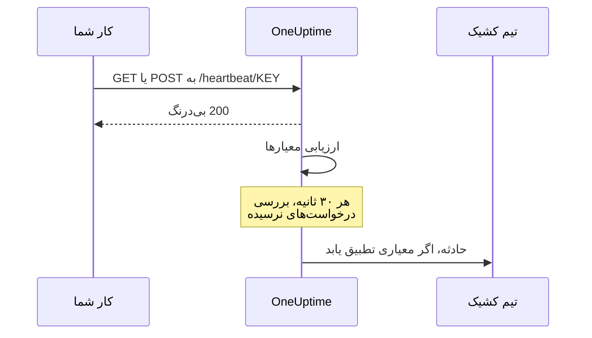
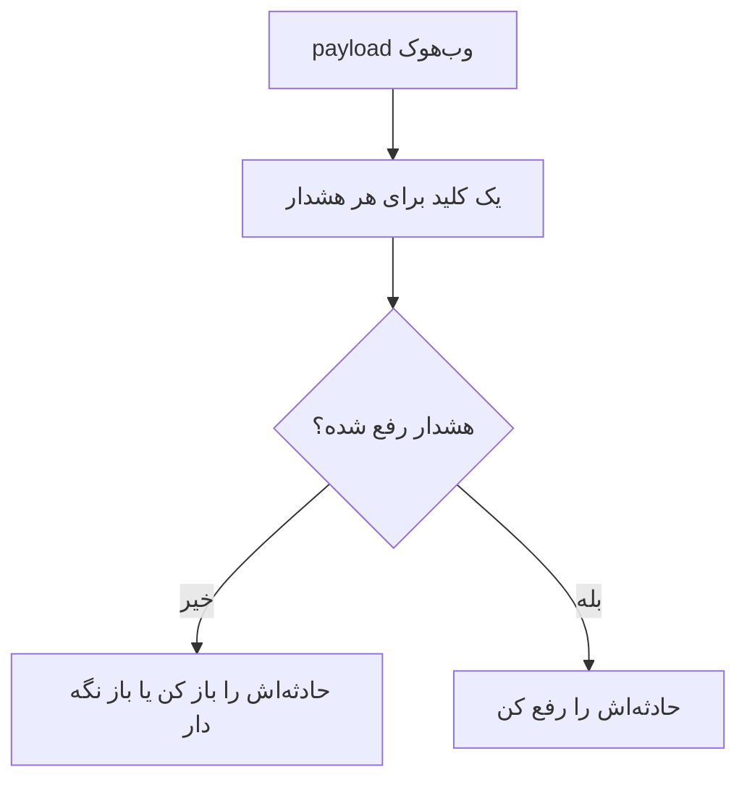

# مانیتور درخواست ورودی

مانیتور درخواست ورودی نشانی‌ای به شما می‌دهد که سامانه‌های دیگر درخواست‌های HTTP را به آن می‌فرستند. OneUptime هر درخواست را بر پایه معیارهای شما می‌سنجد، و می‌تواند وضعیت مانیتور را تغییر دهد، حادثه اعلام کند، و افراد کشیک را فرا بخواند.

دو کار متفاوت را پوشش می‌دهد:

- **مانیتورینگ ضربان قلب** — یک کار زمان‌بندی‌شده cron، یک worker یا یک دستگاه بر پایه زمان‌بندی نشانی را پینگ می‌کند، و OneUptime وقتی پینگ‌ها دیگر نرسند حادثه‌ای باز می‌کند.
- **دریافت هشدار از سامانه‌ای دیگر** — ‏Prometheus Alertmanager، ‏Grafana، یا هر چیز دیگری که بتواند JSON را POST کند هشدارها را به درون می‌فرستد، و OneUptime هرکدام را به حادثه‌ای با تشدید کشیک و رفع خودکار هنگام بهبود تبدیل می‌کند.

هر دو همان نوع مانیتور را به کار می‌برند. آنچه آن‌ها را از هم جدا می‌کند معیارهایی است که پیکربندی می‌کنید.

:::cards
- [مانیتور را بسازید](#ساخت-مانیتور-درخواست-ورودی): در چند گام یک نشانی ضربان قلب بگیرید.
- [ضربان قلب بفرستید](#ضربان-قلب-بفرستید): از curl، ‏cron، ‏Node.js، ‏Python یا Go.
- [هشدار وقتی پینگ‌ها بند می‌آیند](#اگر-۱۰-دقیقه-ضربان-قلبی-نرسید-آفلاین-علامت-بزن-یک-کلید-مرد-مرده): مانیتور را به کلید مرد مرده تبدیل کنید.
- [هشدار دریافت کنید](#دریافت-هشدار-از-سامانهای-دیگر): یک حادثه برای هر هشدار Alertmanager یا Grafana.
:::

## چگونه کار می‌کند

هیچ چیز سامانه شما را از بیرون بررسی نمی‌کند: سامانه شما نشانی مانیتور را فرا می‌خواند، OneUptime بی‌درنگ پاسخ می‌دهد، و سپس درخواست را بر پایه معیارهای مانیتور می‌سنجد. معیاری که درخواست‌هایی را می‌پاید که *دیگر* نمی‌رسند، افزون بر این هر ۳۰ ثانیه در پس‌زمینه دوباره بررسی می‌شود، تا سکوت هم بتواند حادثه‌ای باز کند.



از آن برای این کارها استفاده کنید:

- پایش کارهای cron و وظیفه‌های زمان‌بندی‌شده
- اطمینان از اجرای workerهای پس‌زمینه
- پایش سرویس‌های پشت دیوار آتش که از بیرون در دسترس نیستند
- دریافت هشدار از Prometheus Alertmanager، ‏Grafana و دیگر سامانه‌های هشداردهی
- ردیابی سیگنال‌های ضربان قلب از هر سامانه‌ای که HTTP بلد است

## ساخت مانیتور درخواست ورودی

:::steps
### یک مانیتور تازه آغاز کنید

به **مانیتورها** بروید و روی **ساخت مانیتور** کلیک کنید.

### Incoming Request را برگزینید

در **نوع مانیتور**، ‏**Incoming Request** را برگزینید — یکی از نوع‌های رایج در بالای فهرست است. یک **نام** وارد کنید و سپس روی **بعدی** کلیک کنید.

### معیارها را بازبینی کنید

گام **معیارها** با [معیارهای پیش‌فرض](#آنچه-از-ابتدا-دارید) آغاز می‌شود. برای ضربان قلب، روی **افزودن معیار** کلیک کنید و به معیار تازه فیلتری از نوع **Incoming Request** / **Not Recieved In Minutes** بدهید که وضعیت را آفلاین کند و حادثه‌ای اعلام کند، با **رفع خودکار حادثه** روشن. سپس آن را به بالای فهرست بکشید — دلیلش را در [نمونه معیارها](#نمونه-معیارها) ببینید.

### مانیتور را بسازید

روی **ساخت مانیتور** کلیک کنید. مانیتور در صفحه **نمای کلی** خود باز می‌شود، که در آن کارت **Send the first heartbeat** ‏**Heartbeat URL** را با دکمه رونوشت و یک فرمان نمونه `curl` نشان می‌دهد.

### نخستین درخواست را بفرستید

سرویس خود را طوری پیکربندی کنید که به آن نشانی درخواست بفرستد ([ضربان قلب بفرستید](#ضربان-قلب-بفرستید) را ببینید). وقتی نخستین درخواست برسد، کارت جای خود را به تاریخچه مانیتور می‌دهد، و یک کارت **Heartbeat URL** نشانی و زمان رسیدن واپسین درخواست را نشان می‌دهد.
:::

> [!NOTE]
> نشانی شامل کلید محرمانه مانیتور است، پس فقط کسانی که می‌توانند مانیتورها را ویرایش کنند آن را می‌بینند. هر زمان می‌توانید آن را دوباره در صفحه **مستندات** مانیتور، در بخش **پیکربندی** منوی کناری آن، پیدا کنید.

## نشانی درخواست

مانیتور شما نشانی یکتایی با این قالب دارد:

```text
https://oneuptime.com/heartbeat/YOUR_SECRET_KEY
```

اگر خودمیزبان هستید، `https://oneuptime.com` را با نشانی نمونه OneUptime خود جایگزین کنید.

درخواست‌های **GET** یا **POST** را به این نشانی بفرستید. ‏HEAD پذیرفته می‌شود و مانند GET با آن رفتار می‌شود؛ ‏PUT، ‏PATCH و DELETE پاسخ ۴۰۴ برمی‌گردانند. کلید محرمانه در مسیر تنها اعتبارنامه است — هیچ هدر یا توکنی لازم نیست. رشته‌های کوئری نادیده گرفته می‌شوند: آنچه را معیارها باید بخوانند در بدنه یا هدرها بفرستید.

> [!WARNING]
> هر کسی که این نشانی را بداند می‌تواند مانیتور را سالم علامت بزند، پس آن را مانند یک راز نگه دارید. اگر فاش شد، صفحه **تنظیمات** مانیتور را باز کنید و روی **بازنشانی کلید محرمانه درخواست ورودی** کلیک کنید، سپس همه فرستنده‌ها را به‌روز کنید. هر هدری که می‌فرستید روی مانیتور ذخیره می‌شود و برای هر کسی که بتواند آن را بخواند پیداست — کلیدهای API یا توکن‌ها را در هدرهای این endpoint نفرستید.

> [!IMPORTANT]
> ‏OneUptime بی‌درنگ با `200` و یک شیء JSON خالی (`{}`) پاسخ می‌دهد و درخواست را در یک صف پردازش می‌کند. این پاسخ پیش از هر اعتبارسنجی نوشته می‌شود، پس `200` تأییدی بر پذیرفته شدن درخواست **نیست** — کلید محرمانه نادرست، مانیتور حذف‌شده و مانیتور غیرفعال همگی `200` برمی‌گردانند. برای اطمینان از رسیدن درخواست‌ها، خط زمانی خود مانیتور را ببینید.

### فرستادن بدنه درخواست

اگر می‌خواهید به فیلدهای درون بدنه دسترسی داشته باشید — `{{requestBody.status}}` در عنوان حادثه، یک مسیر JSON در گروه‌بندی حادثه‌ها، یا معیاری با عبارت JavaScript — ‏`Content-Type: application/json` را بفرستید. این مستندات همه‌جا همین قالب را فرض می‌کنند. بدنه باید یک شیء یا آرایه JSON باشد: JSON نادرست، یا مقداری تنها مانند `"error"`، با `500` رد می‌شود.

| نوع محتوا | آنچه معیارها و قالب‌ها می‌بینند |
| --- | --- |
| `application/json` | ‏JSON تجزیه‌شده. |
| `application/x-www-form-urlencoded` | فرم تجزیه‌شده. کلیدهای کروشه‌دار تودرتو می‌شوند (`alerts[0][status]=firing`)، و هر مقدار یک رشته است. |
| هر چیز دیگر، یا هیچ | بدنه‌ای خالی (`{}`)، پس هر ارجاع به `requestBody` به هیچ می‌رسد. |

بدنه‌های تا ۵۰ MB پذیرفته می‌شوند؛ بدنه بزرگ‌تر با `413` رد می‌شود. بدنه را با `Content-Encoding: gzip` فشرده نکنید: در این صورت به‌صورت JSON ذخیره نمی‌شود، و مسیرهای درون آن یافت نمی‌شوند.

### ضربان قلب بفرستید

هر نمونه یک درخواست می‌فرستد. ‏`YOUR_SECRET_KEY` را با کلید موجود در نشانی مانیتور خود جایگزین کنید.

:::tabs
@tab curl
```bash
# Simple GET request
curl https://oneuptime.com/heartbeat/YOUR_SECRET_KEY

# POST request with a JSON body
curl -X POST https://oneuptime.com/heartbeat/YOUR_SECRET_KEY \
  -H "Content-Type: application/json" \
  -d '{"status": "healthy", "version": "1.2.3"}'
```
@tab Cron
```bash
# Send a heartbeat every 5 minutes
*/5 * * * * curl -fsS https://oneuptime.com/heartbeat/YOUR_SECRET_KEY > /dev/null

# Or ping only when the job succeeds, so a failed run counts as a missed heartbeat
0 2 * * * /usr/local/bin/backup.sh && curl -fsS https://oneuptime.com/heartbeat/YOUR_SECRET_KEY > /dev/null
```
@tab Node.js
```javascript title="heartbeat.mjs"
// Node.js 18 or later: fetch is built in. Run with `node heartbeat.mjs`.
const response = await fetch(
  "https://oneuptime.com/heartbeat/YOUR_SECRET_KEY",
  {
    method: "POST",
    headers: { "Content-Type": "application/json" },
    body: JSON.stringify({ status: "healthy", version: "1.2.3" }),
  },
);

console.log(response.status); // 200
```
@tab Python
```python title="heartbeat.py"
# Python 3, standard library only. Run with `python3 heartbeat.py`.
import json
import urllib.request

request = urllib.request.Request(
    "https://oneuptime.com/heartbeat/YOUR_SECRET_KEY",
    data=json.dumps({"status": "healthy", "version": "1.2.3"}).encode(),
    headers={"Content-Type": "application/json"},
    method="POST",
)

with urllib.request.urlopen(request, timeout=10) as response:
    print(response.status)  # 200
```
@tab Go
```go title="heartbeat.go"
// Run with `go run heartbeat.go`.
package main

import (
	"bytes"
	"fmt"
	"net/http"
)

func main() {
	body := []byte(`{"status": "healthy", "version": "1.2.3"}`)

	resp, err := http.Post(
		"https://oneuptime.com/heartbeat/YOUR_SECRET_KEY",
		"application/json",
		bytes.NewReader(body),
	)
	if err != nil {
		panic(err)
	}
	defer resp.Body.Close()

	fmt.Println(resp.StatusCode) // 200
}
```
@tab PowerShell
```powershell
# Windows PowerShell 5.1 or PowerShell 7
Invoke-RestMethod -Method Post `
  -Uri "https://oneuptime.com/heartbeat/YOUR_SECRET_KEY" `
  -ContentType "application/json" `
  -Body '{"status": "healthy", "version": "1.2.3"}'
```
:::

## معیارهای پایش

می‌توانید معیارهایی پیکربندی کنید تا تعیین شود سرویس شما چه زمانی آنلاین، دچار کاهش کارایی یا آفلاین به شمار می‌آید. هر فیلتر معیار یک **نوع فیلتر** (به چه نگاه شود)، یک **شرط فیلتر** (چگونه مقایسه شود) و یک **مقدار** دارد.

### آنچه از ابتدا دارید

مانیتور درخواست ورودی تازه با دو معیار ساخته می‌شود که بدنه درخواست را می‌خوانند:

| معیار | نوع فیلتر | شرط فیلتر | مقدار | اثر |
| -------- | ------------ | ---------------- | ------- | -------------------------------------------- |
| Offline  | بدنه درخواست | شامل است | `error` | مانیتور را آفلاین علامت می‌زند، حادثه‌ای باز می‌کند |
| Online   | بدنه درخواست | Not Contains | `error` | مانیتور را آنلاین علامت می‌زند |

این برای حالت رایجی مناسب است که فرستنده سلامت خودش را در payload گزارش می‌دهد: درخواستی که بدنه‌اش `error` را نام ببرد مانیتور را پایین می‌آورد، و درخواست بعدی بدون آن واژه مانیتور را بالا می‌آورد و حادثه را رفع می‌کند. درخواستی که اصلاً بدنه ندارد «شامل `error` نیست» به شمار می‌آید، پس یک پینگ ساده ضربان قلب مانیتور را آنلاین نگه می‌دارد.

مقدار را به آنچه فرستنده‌تان واقعاً می‌فرستد تغییر دهید (`"status":"firing"`، `FAILED` و مانند این‌ها) — تطبیق، جست‌وجوی زیررشته با حساسیت به بزرگی و کوچکی حروف در کل بدنه، از جمله کلیدها، است، پس `{"error":null}` هم با `error` تطبیق می‌یابد.

> [!NOTE]
> این پیش‌فرض‌ها کلید مرد مرده **نیستند**: وقتی درخواست‌ها دیگر نرسند، هیچ چیز اینجا فعال نمی‌شود. اگر می‌خواهید هنگام سکوت هشدار بگیرید، معیاری از نوع **Incoming Request** / **Not Recieved In Minutes** را همان‌طور که در ادامه آمده بیفزایید.

### نوع‌های فیلتر در دسترس

| نوع فیلتر | بررسی می‌کند | یادداشت |
| --------------------- | ------------------------------------------------------ | -------------------------------------------------------------------------------------------- |
| Incoming Request | آیا درخواستی در یک بازه زمانی رسیده است | تنها بررسی‌ای که وقتی هیچ چیز نمی‌رسد می‌تواند فعال شود |
| بدنه درخواست | بدنه درخواست | تطبیق زیررشته. بدنه‌های شیء به‌صورت JSON فشرده مقایسه می‌شوند |
| Request Header | نام هدرهای درخواست | تطبیق دقیق با نام کامل هدر، بدون توجه به بزرگی و کوچکی حروف |
| Request Header Value | مقدار هدرهای درخواست | تطبیق دقیق با مقدار کامل هدر، بدون توجه به بزرگی و کوچکی حروف |
| JavaScript Expression | هر عبارتی روی `requestBody` و `requestHeaders` | انعطاف‌پذیرترین گزینه — [عبارت‌های JavaScript](/docs/monitor/javascript-expression) را ببینید |

### شرط‌های فیلتر

هر نوع فیلتر مجموعه شرط‌های خودش را دارد:

| نوع فیلتر | شرط‌ها |
| --- | --- |
| **Incoming Request** | **Recieved In Minutes** — درخواستی در شمار دقیقه‌های تعیین‌شده رسیده است. **Not Recieved In Minutes** — هیچ درخواستی در شمار دقیقه‌های تعیین‌شده نرسیده است. (داشبورد آن‌ها را این‌گونه می‌نویسد.) |
| **بدنه درخواست**، **Request Header**، **Request Header Value** | **شامل است** و **Not Contains** |
| **JavaScript Expression** | **Evaluates To True** |

> [!NOTE]
> نام‌ها و مقدارهای هدر با حروف کوچک و با کل نام یا مقدار مقایسه می‌شوند، نه به‌صورت زیررشته: `application/json` با `application/json; charset=utf-8` تطبیق نمی‌یابد. فقط **بدنه درخواست** تطبیق زیررشته انجام می‌دهد. هدرهایی که پراکسی شما یا متعادل‌کننده بار خود OneUptime می‌افزایند (`x-forwarded-for`، `x-real-ip`) هم ذخیره می‌شوند.

بدنه‌های شیء به‌صورت JSON فشرده و بدون فاصله مقایسه می‌شوند، پس فیلتر **بدنه درخواست** / **شامل است** باید `"status":"firing"` نوشته شود — رونوشت گرفتن `"status": "firing"` از یک payload قالب‌بندی‌شده هرگز تطبیق نمی‌یابد.

### نمونه معیارها

#### اگر ۱۰ دقیقه ضربان قلبی نرسید، آفلاین علامت بزن (یک کلید مرد مرده)

| فیلد | مقدار |
| --- | --- |
| **نوع فیلتر** | Incoming Request |
| **شرط فیلتر** | Not Recieved In Minutes |
| **مقدار** | `10` |

#### بر پایه محتوای بدنه درخواست، کاهش کارایی علامت بزن

| فیلد | مقدار |
| --- | --- |
| **نوع فیلتر** | بدنه درخواست |
| **شرط فیلتر** | شامل است |
| **مقدار** | `"status":"degraded"` |

> [!IMPORTANT]
> کلید مرد مرده را **بالای** معیارهای پیش‌فرض بگذارید. معیارها از بالا بررسی می‌شوند، و نخستین معیاری که تطبیق یابد تصمیم می‌گیرد. بررسی پس‌زمینه واپسین درخواست را دوباره می‌خواند، پس معیار آنلاین پیش‌فرض — "Request Body Not Contains `error`" — همچنان با آن تطبیق می‌یابد، و معیاری که زیر آن است هرگز نوبت نمی‌گیرد. **افزودن معیار** یک معیار در پایین می‌افزاید: آن را بالا بکشید.

> [!WARNING]
> یک مانیتور فقط وقتی در پس‌زمینه دوباره ارزیابی می‌شود که دست‌کم یکی از معیارهایش **Incoming Request** را بررسی کند. مانیتوری که معیارهایش فقط بدنه درخواست، Request Header یا یک عبارت JavaScript را بررسی می‌کنند، فقط هنگام رسیدن درخواست ارزیابی می‌شود و در هیچ زمان دیگری نه — پس هرگز نمی‌تواند خودبه‌خود آفلاین شود. اگر هشداری برای ضربان قلب نرسیده می‌خواهید، به معیاری از نوع **Incoming Request** نیاز دارید.

بررسی پس‌زمینه دقیقه‌های کامل را می‌شمارد و همین که *بیش* از مقدار گذشته باشد فعال می‌شود: "Not Recieved In Minutes: 10" حدود ۱۱ دقیقه پس از واپسین درخواست فعال می‌شود (بررسی هر ۳۰ ثانیه اجرا می‌شود). با مانیتوری که هرگز درخواستی نگرفته طوری رفتار می‌شود که انگار زمان ساخت آن واپسین درخواست بوده، پس همان معیار روی یک مانیتور کاملاً تازه حدود ۱۱ دقیقه پس از ساخت آن فعال می‌شود، حتی اگر فرستنده هرگز وصل نشده باشد. فقط دقیقه‌هایی که OneUptime در حال دریافت بوده در مقدار شمرده می‌شوند: دقیقه‌هایی که خود OneUptime در حال راه‌اندازی دوباره، ارتقا یا جبران عقب‌افتادگی است شمرده نمی‌شوند، همان‌طور که [وقتی OneUptime داده دریافت نمی‌کند](/docs/monitor/when-oneuptime-is-not-receiving) توضیح می‌دهد.

## دریافت هشدار از سامانه‌ای دیگر

‏Alertmanager، ‏Grafana و ابزارهای مشابه یک سند JSON را POST می‌کنند که یک یا چند هشدار را توصیف می‌کند. به‌طور پیش‌فرض یک معیار **یک** حادثه باز می‌کند، پس payloadی که پنج هشدار دارد یک حادثه تنها می‌سازد. گروه‌بندی حادثه‌ها این را تغییر می‌دهد: مقداری را از payload بیرون می‌کشد و **برای هر مقدار متمایز یک حادثه جداگانه** باز می‌کند، که همه می‌توانند همزمان باز باشند.



### روشن کردن گروه‌بندی حادثه‌ها

:::steps
1. معیار را باز کنید و **تنظیمات** را بگسترانید.
2. ‏**Group incidents and alerts by a payload field** را روشن کنید.
3. ‏**Open a separate incident for each…** را پر کنید. برای اینکه هر حادثه خودبه‌خود رفع شود، فیلد و مقدار زیر **Auto-resolve each incident when…** را هم پر کنید (در ادامه). سپس مانیتور را ذخیره کنید.
:::

| فیلد | نمونه | چه می‌کند |
| ---------------------------------- | ---------------------------------------- | ---------------------------------------------------------------------- |
| Open a separate incident for each… | `requestBody.alerts[*].labels.alertname` | مسیری که مقدارهای متمایزش حادثه‌ها را از هم جدا می‌کنند |
| Field that signals recovery | `requestBody.alerts[*].status` | مسیری که برای تصمیم به بهبود یک هشدار بررسی می‌شود |
| Value that means recovered | `resolved` | مقدار دقیقی که بهبود را نشان می‌دهد |
| Max incidents per request | `100` (پیش‌فرض) | سقف ایمنی، تا فیلدی با مقدارهای فراوان نتواند حادثه‌های بی‌شمار باز کند |

### نحو مسیر

مسیرها باید با پیشوند لفظی `requestBody.` آغاز شوند. مسیری بدون آن — `alerts[*].labels.alertname` — بی‌صدا با هیچ چیز تطبیق نمی‌یابد. پوشش `{{ }}` اختیاری است: ‏`requestBody.status` و `{{requestBody.status}}` یکسان رفتار می‌کنند.

- ‏`[*]` روی یک آرایه گسترش می‌یابد — یک حادثه برای هر مقدار **متمایز**. دو عضو که یک مقدار می‌دهند در یک حادثه یکی می‌شوند، و وضعیت آن حادثه (فعال/رفع‌شده) از **نخستین** عضو تطبیق‌یافته گرفته می‌شود. **فقط نخستین `[*]` در یک مسیر نویسه عام است**؛ ‏`requestBody.groups[*].alerts[*].name` با هیچ چیز تطبیق نمی‌یابد.
- ‏`[0]` و `[last]` یک عضو را برمی‌گزینند، و می‌توانند پس از یک `[*]` بیایند.
- مقدارهای شیء و آرایه، رشته‌های خالی و nullها نادیده گرفته می‌شوند. ‏`0` و `false` کلیدهای معتبرند.
- بدنه باید یک شیء JSON باشد؛ payloadی که سطح بالایش آرایه است گروه‌بندی نمی‌شود.

### رفع بر پایه رویداد است

یک وب‌هوک فقط آنچه را در همان payload است توصیف می‌کند، پس OneUptime هرگز حادثه‌ای را به این دلیل که کلیدش دیگر پیدا نمی‌شود رفع نمی‌کند. حادثه فقط وقتی رفع می‌شود که payloadی صریحاً بگوید آن کلید بهبود یافته است. دو چیز باید هر دو برقرار باشند:

1. ‏**Field that signals recovery** و **Value that means recovered** تنظیم شده باشند و با payload تطبیق یابند. مقایسه دقیق و حساس به بزرگی و کوچکی حروف است — `Resolved` با `resolved` تطبیق نمی‌یابد.
2. حادثه معیار، **رفع خودکار حادثه** را روشن داشته باشد، زیر **فیلدهای بیشتر** در فرم حادثه. بدون آن، رویدادهای بهبود تطبیق‌یافته نادیده گرفته می‌شوند و حادثه‌ها باز می‌مانند. (همین برای هشدارها و **رفع خودکار هشدار** هم صدق می‌کند.) معیار آفلاین پیش‌فرض با این گزینه روشن آغاز می‌شود؛ حادثه‌ای که خودتان به یک معیار می‌افزایید با این گزینه خاموش آغاز می‌شود.

‏**Max incidents per request** بیرون‌کشیدن را محدود می‌کند، نه فقط ساختن را. کلیدهای فراتر از سقف برای بهبود هم دیده نمی‌شوند، پس در payloadی که کلیدهای متمایزش از سقف بیشتر است، هشداری که فراتر از سقف `resolved` گزارش دهد حادثه‌اش را نمی‌بندد.

> [!NOTE]
> وقتی یک مانیتور درخواست‌ها را سریع‌تر از ارزیابی OneUptime دریافت کند، OneUptime تازه‌ترین را ارزیابی می‌کند و میانی‌ها را رد می‌کند، پس هجوم وب‌هوک‌ها می‌تواند یک هشدار فعال یا رفع‌شده را ارزیابی‌نشده بگذارد. روی سرور خودمیزبان، تنظیم `INCOMING_REQUEST_INGEST_COALESCE_ENABLED=false` در محیط برنامه OneUptime باعث می‌شود هر درخواست جداگانه ارزیابی شود.

> [!WARNING]
> اگر **Field that signals recovery** شامل `[*]` باشد اما **Open a separate incident for each…** نباشد، هیچ چیز هرگز رفع نمی‌شود. یا در هر دو از `[*]` استفاده کنید، یا در هیچ‌کدام. مسیر بهبود بدون `[*]` در برابر کل payload ارزیابی می‌شود، پس یک `status: resolved` در سطح payload همه کلیدهای آن payload را رفع می‌کند — از جمله هشدارهایی که وضعیت خودشان هنوز فعال است.

### نام‌گذاری حادثه‌ها

کلید گروه‌بندی به‌صورت متغیری به نام **واپسین بخش مسیر** در اختیار قالب‌های حادثه و هشدار قرار می‌گیرد:

| مسیر | متغیر |
| ---------------------------------------- | ----------------- |
| `requestBody.alerts[*].labels.alertname` | `{{alertname}}`   |
| `requestBody.alerts[*].fingerprint`      | `{{fingerprint}}` |
| `requestBody.commonLabels.severity`      | `{{severity}}`    |

کل payload هم در کنار آن در دسترس است، پس هم عنوان حادثه `{{alertname}}` و هم توضیحی که به `{{requestBody.commonAnnotations.summary}}` ارجاع می‌دهد کار می‌کنند. [قالب‌بندی حادثه و هشدار](/docs/monitor/incident-alert-templating) را ببینید.

> [!WARNING]
> نام متغیر بخشی از هویتی است که OneUptime برای تطبیق یک رویداد بهبود با حادثه‌ای باز به کار می‌برد. تغییر مسیر گروه‌بندی به مسیری با واپسین بخش متفاوت، همه حادثه‌هایی را که اکنون زیر مسیر قدیمی باز هستند یتیم می‌کند — دیگر نمی‌توان آن‌ها را خودکار رفع کرد و باید دستی بسته شوند.

‏`[*]` **فقط** در دو فیلد مسیر گروه‌بندی کار می‌کند. جاهای دیگر جای‌گذاری نمی‌شود، و جای‌نگهداری که جای‌گذاری نشود **همان‌طور که هست** چاپ می‌شود، نه خالی — عنوانی مانند `{{requestBody.alerts[*].labels.alertname}}` با آکولادها نمایش داده می‌شود. عنوان `{{requestBody.alerts[0].annotations.summary}}` جای‌گذاری می‌شود، اما همیشه نخستین هشدار payload را می‌خواند، نه هشداری را که این حادثه برایش باز شده. متغیر گروه‌بندی را همراه فیلدهای مشترک `commonAnnotations` در payload ترجیح دهید.

### نمونه کامل

برای پیکربندی کامل Alertmanager، [Prometheus Alertmanager](/docs/integrations/prometheus-alertmanager) را ببینید. برای Grafana، [Grafana](/docs/integrations/grafana) را ببینید.

## بهترین روش‌ها

1. **بازه زمانی را مناسب تنظیم کنید** — اگر کار cron شما هر ۵ دقیقه اجرا می‌شود، آستانه "Not Recieved In Minutes" را ۱۰ تا ۱۵ دقیقه بگذارید تا تأخیرهای گاه‌به‌گاه را تاب بیاورد، و آن معیار را در آغاز بگذارید.
2. **داده معنادار بفرستید** — اطلاعات وضعیت را در بدنه درخواست بفرستید تا بتوانید معیارهای دقیق‌تری تنظیم کنید.
3. **از POST با `Content-Type: application/json` استفاده کنید** — هر چیزی که درون بدنه را می‌خواند به آن وابسته است.
4. **دو کار را روی یک مانیتور با هم نیامیزید** — مانیتوری که هشدارهای رویدادمحور دریافت می‌کند آهنگ منظمی ندارد، پس معیار "Not Recieved In Minutes" روی آن مدام بالا و پایین می‌شود. برای کلید مرد مرده مانیتوری جداگانه به کار ببرید.
5. **پایشگر را پایش کنید** — مطمئن شوید سرویسی که درخواست‌ها را می‌فرستد خطاها را درست مدیریت می‌کند، تا درخواست‌های ناموفق از چشم نیفتند.

## عیب‌یابی

:::details فرستنده من ۲۰۰ می‌گیرد، اما چیزی روی مانیتور نمایش داده نمی‌شود
‏`200` پیش از اعتبارسنجی درخواست فرستاده می‌شود، پس ثابت نمی‌کند که درخواست پذیرفته شده است. بررسی کنید کلید محرمانه در نشانی با **Heartbeat URL** مانیتور یکی باشد، و مانیتور غیرفعال نباشد. سپس در خط زمانی مانیتور ببینید آیا درخواست‌ها می‌رسند.
:::

:::details مانیتور وقتی ضربان‌های قلب بند می‌آیند هرگز آفلاین نمی‌شود
فقط معیاری از نوع **Incoming Request** ‏(**Not Recieved In Minutes**) می‌تواند سکوت را تشخیص دهد. اگر نیست یکی بیفزایید، و آن را بالای معیارهای پیش‌فرض بکشید: معیار آنلاین پیش‌فرض در هر بررسی پس‌زمینه با واپسین درخواست تطبیق می‌یابد، و نخستین معیاری که تطبیق یابد تصمیم می‌گیرد.
:::

:::details فیلتر بدنه درخواست هرگز تطبیق نمی‌یابد
‏`Content-Type: application/json` را بفرستید، و مقدار را به‌صورت JSON فشرده بنویسید — `"status":"firing"`، بدون فاصله پس از دونقطه. بدون نوع محتوای JSON یا فرم، بدنه تجزیه نمی‌شود.
:::

:::details فیلتر Request Header هرگز تطبیق نمی‌یابد
نام‌ها و مقدارهای هدر به‌طور کامل مقایسه می‌شوند. به‌جای بخشی از مقدار، مقدار کامل را بدهید، مانند `application/json; charset=utf-8`.
:::

:::details فرستنده ۵۰۰ می‌گیرد
درخواست می‌گوید `Content-Type: application/json` اما بدنه‌اش یک شیء یا آرایه JSON نیست. JSON معتبر بفرستید، یا نوع محتوای دیگری.
:::

## گام‌های بعدی

:::cards
- [Prometheus Alertmanager](/docs/integrations/prometheus-alertmanager): یک راه‌اندازی کامل برای هشدارهای ورودی.
- [Grafana](/docs/integrations/grafana): همین کار، برای هشدارهای Grafana.
- [قالب‌بندی حادثه و هشدار](/docs/monitor/incident-alert-templating): همه متغیرهای در دسترس در عنوان‌ها و توضیح‌ها.
- [عبارت‌های JavaScript](/docs/monitor/javascript-expression): نحو عبارت و قاعده‌های گیومه‌گذاری.
:::
