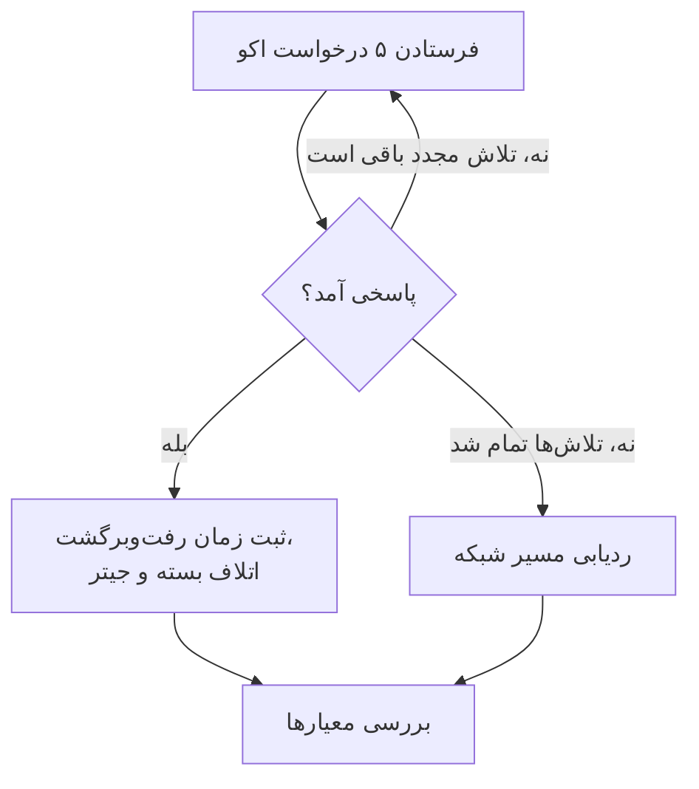

# مانیتور IP

مانیتور IP بررسی می‌کند که یک آدرس IPv4 یا IPv6 به ping (درخواست‌های اکوی ICMP) پاسخ می‌دهد و زمان رفت‌وبرگشت، اتلاف بسته و جیتر را اندازه می‌گیرد. از آن برای زیرساختی که با آدرسش می‌شناسید استفاده کنید، مثل یک دروازه، IP مجازی یک متعادل‌کنندهٔ بار یا سروری با آدرس ثابت.

:::cards
- [ساخت مانیتور](#ساخت-یک-مانیتور-ip): شش گام در داشبورد.
- [گزینه‌های پیکربندی](#گزینههای-پیکربندی): آدرس، وقفه و تلاش‌های مجدد.
- [معیارهای پایش](#معیارهای-پایش): دسترس‌پذیری، تأخیر، اتلاف بسته و جیتر.
- [رفع اشکال](#رفع-اشکال): وقتی آدرس بالاست اما مانیتور آفلاین نشان می‌دهد.
:::

## چگونه کار می‌کند

مانیتور IP همان بررسی [مانیتور Ping](/docs/monitor/ping-monitor) را اجرا می‌کند. در هر بررسی، یک پراب پنج درخواست اکو به آدرس می‌فرستد. اگر دست‌کم یک پاسخ برگردد، آدرس آنلاین است و پراب میانگین زمان رفت‌وبرگشت را به‌عنوان زمان پاسخ ثبت می‌کند، همراه با اتلاف بسته، جیتر و سریع‌ترین و کندترین پاسخ‌ها. اگر هیچ پاسخی برنگردد، پراب تا تعداد تلاش‌های مجددی که اجازه می‌دهید دوباره امتحان می‌کند. سپس OneUptime نتیجه را از معیارهای مانیتور عبور می‌دهد.

وقتی یک بررسی شکست می‌خورد، پراب مسیر رسیدن به آدرس را هم ردیابی می‌کند و آنچه را یافته به‌عنوان **Network Path at Time of Failure** به نتیجه پیوست می‌کند، تا ببینید مسیر کجا قطع شد.

کدام را به کار ببرید:

| مانیتور | چه می‌گیرد | چه وقت به کار ببرید |
| --- | --- | --- |
| **IP** | فقط یک آدرس IP | خود آدرس همان چیزی است که پایش می‌کنید و تغییر نمی‌کند. |
| [Ping](/docs/monitor/ping-monitor) | یک نام میزبان یا یک آدرس IP | میزبان را با نامش می‌شناسید؛ نام در هر بررسی resolve می‌شود، پس مانیتور تغییرات DNS را دنبال می‌کند. |

> [!NOTE]
> برخی ارائه‌دهندگان میزبانی ICMP را روی ماشین‌هایی که پراب روی آن‌ها اجرا می‌شود مسدود می‌کنند. پرابی که اصلاً نمی‌تواند ping بفرستد به‌جای آن پورت TCP شمارهٔ `80` را روی آدرس بررسی می‌کند، تا مانیتور همچنان بگوید در دسترس است یا نه. در این حالت اتلاف بسته و جیتر اندازه گرفته نمی‌شوند.

پرابی که اتصال شبکهٔ خودش را از دست داده هیچ نتیجه‌ای گزارش نمی‌کند، پس نمی‌تواند آدرس شما را آفلاین علامت بزند.

## پیش از شروع

- **نقشی که بتواند مانیتور بسازد**: Project Owner، Project Admin، Project Member، Monitor Admin یا Monitor Member، یا یک نقش سفارشی با مجوز Create Monitor.
- **پرابی که به آدرس برسد**، و ICMP در مسیر مجاز باشد. پراب‌های پیش‌فرض پروژهٔ شما برای هر مانیتور تازه انتخاب می‌شوند. اگر دیوارهٔ آتشی جلوی آن است، به درخواست‌های اکوی ICMP از [آدرس‌های IP پراب‌های OneUptime Cloud](/docs/configuration/ip-addresses) اجازه دهید. یک آدرس خصوصی به یک [پراب سفارشی](/docs/probe/custom-probe) در همان شبکه نیاز دارد، و یک آدرس IPv6 به پرابی با اتصال IPv6.

## ساخت یک مانیتور IP

:::steps
### شروع یک مانیتور تازه

به **مانیتورها** بروید و روی **ساخت مانیتور** کلیک کنید. در **نوع مانیتور**، روی **انواع دیگر مانیتور** کلیک کنید و **IP** را زیر **Basic Monitoring** انتخاب کنید.

### نام‌گذاری

یک **نام** وارد کنید، مثل `Office gateway`، و روی **بعدی** کلیک کنید.

### وارد کردن آدرس

در **آدرس IP**، آدرس IPv4 یا IPv6 را که باید بررسی شود وارد کنید، مثل `192.168.1.1` یا `2001:db8::1`. نام میزبان پذیرفته نمی‌شود: فیلد خطا نشان می‌دهد. برای ping کردن یک میزبان با نامش، از [مانیتور Ping](/docs/monitor/ping-monitor) استفاده کنید.

### آزمایش

روی **آزمایش مانیتور** کلیک کنید، در **انتخاب پراب** یک پراب انتخاب کنید و روی **اجرای آزمایش** کلیک کنید. **نتیجه آزمایش مانیتور** زمان‌های رفت‌وبرگشت و اتلاف بسته‌ای را که پراب دید نشان می‌دهد.

### بازبینی معیارها

**معیارهای مانیتور** با [معیارهای پیش‌فرض](#معیارهای-پیشفرض) شروع می‌شود: آفلاین وقتی آدرس پاسخ نمی‌دهد، آنلاین وقتی پاسخ می‌دهد. در صورت نیاز آن‌ها را تغییر دهید و روی **بعدی** کلیک کنید.

### انتخاب پراب‌ها و ساخت

**پراب‌ها** و **بازه پایش** (که از **هر ۵ دقیقه** شروع می‌شود) را نگه دارید یا تغییر دهید و روی **ساخت مانیتور** کلیک کنید. صفحهٔ مانیتور باز می‌شود.
:::

## گزینه‌های پیکربندی

| فیلد | پیش‌فرض | چه وارد کنید |
| --- | --- | --- |
| **آدرس IP** | هیچ | یک آدرس IPv4، مثل `192.168.1.1`، یا یک آدرس IPv6، مثل `2001:db8::1`. کروشه‌های دور یک آدرس IPv6 حذف می‌شوند. |
| **وقفه درخواست (ثانیه)** (زیر **فیلدهای بیشتر**) | `60` | مدت انتظار برای پاسخ در هر تلاش. بیشینه ۶۰ ثانیه است. |
| **تلاش‌های مجدد در صورت شکست** (زیر **فیلدهای بیشتر**) | پیش‌فرض پراب، معمولاً `3` | چند بار یک تلاش ناموفق تکرار شود. بیشینه ۳ است. |

**تلاش‌های مجدد در صورت شکست** تکرارهای _پس از_ تلاش اول را می‌شمارد، پس `0` بررسی را یک بار و `2` تا سه بار اجرا می‌کند. اگر خالی بماند، پیش‌فرض پراب به کار می‌رود: ۳، مگر اینکه `PROBE_MONITOR_RETRY_LIMIT` پراب چیز دیگری بگوید. هر شکستی، از جمله وقفه‌ها، با یک ثانیه مکث بین تلاش‌ها دوباره امتحان می‌شود. بررسی موفقی که پاسخ‌هایش بیش از ۱۰ ثانیه طول کشید هم دوباره بررسی می‌شود.

## معیارهای پایش

معیارها تعیین می‌کنند آدرس چه زمانی آنلاین، کاهش کارایی یا آفلاین به حساب بیاید، و آیا این وضعیت حادثه اعلام کند یا هشدار بسازد. هر معیار یک یا چند فیلتر را بررسی می‌کند:

| فیلتر | شرط‌ها | چه چیزی را بررسی می‌کند |
| --- | --- | --- |
| **Is Online** | **درست**، **نادرست** | اینکه دست‌کم یک درخواست اکو پاسخ گرفت یا نه. |
| **زمان پاسخ (به میلی‌ثانیه)** | **Greater Than**، **Less Than**، **Greater Than Or Equal To**، **Less Than Or Equal To** | میانگین زمان رفت‌وبرگشت پاسخ‌ها. |
| **Packet Loss (in %)** | **Greater Than**، **Less Than**، **Greater Than Or Equal To**، **Less Than Or Equal To** | سهمی از پنج درخواست اکو که پاسخی نگرفتند. |
| **Jitter (in ms)** | **Greater Than**، **Less Than**، **Greater Than Or Equal To**، **Less Than Or Equal To** | انحراف معیار زمان‌های رفت‌وبرگشت بسته‌هایی که در یک بررسی فرستاده شدند. |
| **Is Request Timeout** | **درست**، **نادرست** | اینکه ping در همهٔ تلاش‌ها به وقفه خورد یا نه. |

با دو فیلتر یا بیشتر، **شرط تطابق** تعیین می‌کند که **همه** باید مطابقت کنند یا **هر** کدام کافی است. **اقدام‌ها**ی یک معیار تعیین می‌کنند چه کاری انجام دهد: تغییر وضعیت مانیتور، ساخت هشدار، اعلام حادثه، یا هر ترکیبی از این‌ها.

### معیارهای پیش‌فرض

مانیتور IP تازه با دو معیار شروع می‌شود:

- **آفلاین** — آدرس پس از همهٔ تلاش‌های مجدد به هیچ درخواست اکویی پاسخ نمی‌دهد، یا اصلاً در دسترس نیست. مانیتور **آفلاین** علامت می‌خورد و حادثه‌ای با نام «_monitor name_ is offline» ساخته می‌شود. وقتی آدرس دوباره پاسخ دهد، حادثه خودش حل می‌شود.
- **آنلاین** — آدرس پاسخ می‌دهد. مانیتور **عملیاتی** علامت می‌خورد.

معیارها از بالا به پایین بررسی می‌شوند و نخستین معیاری که مطابقت کند تعیین می‌کند چه اتفاقی بیفتد. وقتی هیچ‌کدام مطابقت نکند، مانیتور وضعیت پیش‌فرضش را نشان می‌دهد: **عملیاتی**، مگر اینکه زیر **فیلدهای بیشتر** در پایین معیارها وضعیت دیگری انتخاب کنید.

### ارزیابی در یک بازهٔ زمانی

**این معیار را در یک بازه زمانی ارزیابی کن** یک چک‌باکس زیر یک فیلتر است که برای **Is Online**، **زمان پاسخ (به میلی‌ثانیه)**، **Packet Loss (in %)** و **Jitter (in ms)** ارائه می‌شود. آن را روشن کنید تا به‌جای آخرین بررسی، دربارهٔ بازه‌ای از بررسی‌های گذشته داوری شود: در **ارزیابی** یک تجمیع و در **در (دقیقه) گذشته** بازه‌ای از ۲ تا ۶۰ دقیقه انتخاب کنید.

| تجمیع | چه زمانی مطابقت می‌کند |
| --- | --- |
| **میانگین**، **جمع**، **Maximum Value**، **Minimum Value** | آن عدد، در طول بازه، شرط را برآورده کند. فقط فیلترهای عددی. |
| **All Values** | همهٔ بررسی‌های بازه شرط را برآورده کنند. |
| **Any Value** | دست‌کم یک بررسی در بازه شرط را برآورده کند. |

**All Values** فقط وقتی مطابقت می‌کند که بازه واقعاً با داده پوشش داده شده باشد. مانیتوری که تازه ساخته شده، یا مانیتوری که ثبت بررسی‌هایش متوقف شده، سابقهٔ کافی برای گفتن چیزی دربارهٔ N دقیقهٔ گذشته ندارد، پس معیار به‌جای مطابقت با تنها خوانشی که دارد منتظر می‌ماند. **Any Value** تنظیم «همان لحظه که یک بررسی از آستانه گذشت خبرم کن» است و همچنان فوراً فعال می‌شود.

**اگر داده‌ای نبود** تعیین می‌کند وقتی بازه نمی‌تواند پشتوانهٔ معیار باشد چه اتفاقی بیفتد:

| گزینه | چه اتفاقی می‌افتد | برای چه |
| --- | --- | --- |
| **Ignore** (پیش‌فرض) | معیار مطابقت نمی‌کند. | هشدارهای معمولی مبتنی بر آستانه. |
| **تریگر** | نبود داده خودش مشکل به حساب می‌آید. | بررسی‌هایی که در آن‌ها سکوت خودش خرابی است. |
| **Treat As Zero** | بازه به‌صورت یک صفر واحد مقایسه می‌شود. | شمارنده‌هایی که در آن‌ها نبود رویداد واقعاً یعنی صفر. |

### نمونهٔ معیارها

| هدف | فیلتر | شرط | مقدار |
| --- | --- | --- | --- |
| آفلاین وقتی آدرس در دسترس نیست | **Is Online** | **نادرست** | — |
| هشدار وقتی تأخیر زیاد است | **زمان پاسخ (به میلی‌ثانیه)** | **Greater Than** | `100` |
| علامت کاهش کارایی برای آدرس روی پیوندی پراتلاف | **Packet Loss (in %)** | **Greater Than** | `20` |
| هشدار برای اتصال ناپایدار | **Jitter (in ms)** | **Greater Than** | `30` |

## رفع اشکال

:::details آدرس بالاست، اما مانیتور آفلاین نشان می‌دهد
آدرس، یا دیوارهٔ آتشی جلوی آن، به درخواست‌های اکوی ICMP از پراب پاسخ نمی‌دهد. به درخواست‌های اکوی ICMP از پراب‌ها اجازه دهید، یا به‌جای آن یک سرویس روی همان آدرس را با یک [مانیتور پورت](/docs/monitor/port-monitor) پایش کنید. **Network Path at Time of Failure**، روی بررسی ناموفق، نشان می‌دهد مسیر تا کجا رفت.
:::

:::details یک آدرس IPv6 همیشه شکست می‌خورد
پرابی که بررسی را اجرا کرد اتصال IPv6 ندارد؛ پیام شکست همین را می‌گوید. مانیتور را روی پرابی با IPv6 اجرا کنید: [پراب‌های سفارشی](/docs/probe/custom-probe) را ببینید.
:::

:::details اتلاف بسته و جیتر خالی‌اند
پرابی که بررسی را اجرا کرد نمی‌تواند ping بفرستد، پس به‌جای آن پورت TCP شمارهٔ `80` را بررسی کرد که هیچ‌کدام را اندازه نمی‌گیرد. مانیتور را روی پرابی اجرا کنید که اجازهٔ فرستادن ICMP دارد.
:::

## گام‌های بعدی

:::cards
- [مانیتور Ping](/docs/monitor/ping-monitor): یک میزبان را با نامش ping کنید و تغییرات DNS را دنبال کنید.
- [مانیتور پورت](/docs/monitor/port-monitor): یک سرویس روی آدرس را بررسی کنید، نه فقط خود آدرس را.
- [پراب‌های سفارشی](/docs/probe/custom-probe): آدرس‌های خصوصی و IPv6 را از شبکهٔ خودتان بررسی کنید.
- [حوادث](/docs/incidents/index): پس از اینکه مانیتور حادثه اعلام می‌کند چه اتفاقی می‌افتد.
:::
