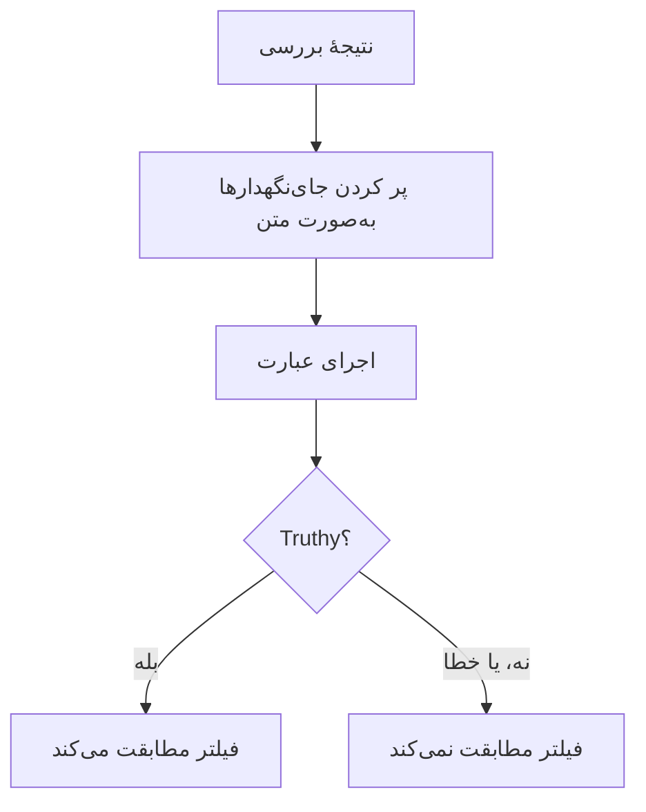

# عبارت‌های JavaScript

فیلتر معیار **JavaScript Expression** به‌جای یک مقایسهٔ ثابت، با یک خط JavaScript تعیین می‌کند که آیا معیار یک مانیتور برآورده شده است. از آن وقتی استفاده کنید که فیلترهای داخلی نمی‌توانند شرط را بیان کنند — فیلدی در عمق یک پاسخ JSON، دو مقدار که با هم مقایسه می‌شوند، یا چند بررسی که با `&&` و `||` ترکیب شده‌اند.

:::cards
- [چگونه کار می‌کند](#چگونه-کار-میکند): جای‌نگهدارها پر می‌شوند، سپس عبارت اجرا می‌شود.
- [متغیرها](#متغیرها-بر-اساس-نوع-مانیتور): آنچه هر نوع مانیتور در اختیارتان می‌گذارد.
- [نمونه‌ها](#نمونهها): عبارت‌هایی برای APIها، درخواست‌های ورودی و پایگاه‌های داده.
- [قواعد نقل‌قول](#قواعد-نقلقول): اشتباهی که تقریباً همه می‌کنند.
:::

## چگونه کار می‌کند

پیش از اجرای عبارت، هر جای‌نگهدار `{{variable}}` در آن با مقدار آخرین بررسی مانیتور جایگزین می‌شود — به‌صورت متن ساده. سپس نتیجه به‌عنوان JavaScript اجرا می‌شود. اگر به یک مقدار truthy برسد، فیلتر مطابقت می‌کند؛ هر چیز دیگری، از جمله یک خطا، یعنی مطابقت نمی‌کند.



چون جای‌نگهدارها به‌صورت متن جایگزین می‌شوند، `{{responseBody.item}}` به مقدار خام تبدیل می‌شود. یک رشته باید در علامت نقل‌قول باشد تا یک رشتهٔ JavaScript به حساب بیاید؛ یک عدد یا مقدار بولی نه — [قواعد نقل‌قول](#قواعد-نقلقول) را ببینید. عبارت‌ها روی سرور OneUptime، در یک sandbox جداشده، اجرا می‌شوند.

## افزودن یک فیلتر JavaScript Expression

:::steps
### باز کردن معیارها

روی مانیتور، **پیکربندی → معیارها** را باز کنید و روی **ویرایش معیارهای پایش** کلیک کنید، یا از گام **معیارها** در **ساخت مانیتور** استفاده کنید. در معیاری که می‌خواهید تغییر دهید کار کنید، یا برای یک معیار تازه روی **افزودن معیار** کلیک کنید.

### افزودن یک فیلتر

زیر **فیلترها** روی **افزودن فیلتر** کلیک کنید و **نوع فیلتر** آن را روی **JavaScript Expression** بگذارید. **شرط فیلتر** برابر **Evaluates To True** است.

### نوشتن عبارت

عبارت را در **مقدار** وارد کنید، با استفاده از [متغیرهای نوع مانیتور](#متغیرها-بر-اساس-نوع-مانیتور). پیوند زیر فیلتر، **Read documentation for using JavaScript expressions here.**، همین صفحه را باز می‌کند.

### ذخیره

مانیتور را ذخیره کنید. فیلتر در بررسی بعدی مانیتور ارزیابی می‌شود.
:::

## متغیرها بر اساس نوع مانیتور

عبارت‌های JavaScript برای مانیتورهای Website، API، Incoming Request، Incoming Email، SQL Query و Database Health ارائه می‌شوند.

### مانیتورهای وب‌سایت و API

| متغیر | توضیح | نوع |
| --- | --- | --- |
| `responseBody` | بدنهٔ پاسخ. اگر بدنهٔ پاسخ JSON باشد، تجزیه می‌شود؛ در غیر این صورت، مثلاً برای HTML یا XML، یک رشته است. | `string` یا `JSON` |
| `responseHeaders` | هدرهای پاسخ، با نام‌هایی با حروف کوچک. | `Dictionary<string>` |
| `responseStatusCode` | کد وضعیت پاسخ. | `number` |
| `responseTimeInMs` | زمان پاسخ به میلی‌ثانیه. | `number` |
| `isOnline` | اینکه مانیتور پاسخ را آنلاین به حساب می‌آورد یا نه. | `boolean` |

### مانیتورهای درخواست ورودی

| متغیر | توضیح | نوع |
| --- | --- | --- |
| `requestBody` | بدنهٔ درخواست. | `string` یا `JSON` |
| `requestHeaders` | هدرهای درخواست، با نام‌هایی با حروف کوچک. | `Dictionary<string>` |

### مانیتورهای کوئری SQL

| متغیر | توضیح | نوع |
| --- | --- | --- |
| `rowCount` | تعداد ردیف‌هایی که کوئری برگرداند. | `number` |
| `scalarValue` | ستون نخست از ردیف نخست. | هر نوعی |
| `firstRow` | ردیف نخست، به‌صورت جفت‌های ستون/مقدار. | `JSON` |
| `executionTimeInMs` | مدتی که کوئری طول کشید، به میلی‌ثانیه. | `number` |
| `queryError` | خطای کوئری، اگر خطایی بود. | `string` |
| `isOnline` | اینکه پایگاه داده در دسترس بود و کوئری موفق شد یا نه. | `boolean` |

### مانیتورهای سلامت پایگاه داده

`isOnline`، `engineVersion`، `connectionError`، `collectedGroups`، `unavailableGroups` و `metrics`. [متغیرهای عبارت JavaScript](/docs/monitor/database-health-monitor#متغیرهای-عبارت-javascript) را در صفحهٔ مانیتور سلامت پایگاه داده ببینید.

### مانیتورهای ایمیل ورودی

این فیلتر ارائه می‌شود، اما هیچ فیلد ایمیلی به آن متصل نیست: یک عبارت نمی‌تواند موضوع، فرستنده، بدنه یا گیرنده را بخواند. به‌جای آن از نوع‌های فیلتر ایمیل استفاده کنید — [مانیتور ایمیل ورودی](/docs/monitor/incoming-email-monitor#نوعهای-پالایه-در-دسترس) را ببینید.

## نمونه‌ها

هر خط زیر یک عبارت کامل است. برای بدنهٔ پاسخ JSONی مانند این:

```json
{
  "item": "hello",
  "count": 3,
  "items": [{ "name": "hello" }]
}
```

| عبارت | چه زمانی مطابقت می‌کند |
| --- | --- |
| `"{{responseBody.item}}" === "hello"` | فیلد `item` برابر `hello` است. |
| `{{responseBody.count}} > 2` | فیلد `count` بیشتر از ۲ است. |
| `"{{responseBody.items[0].name}}" === "hello"` | نخستین عنصر `items` نام `hello` دارد. |
| `{{responseStatusCode}} === 200 && {{responseTimeInMs}} < 500` | وضعیت ۲۰۰ است و پاسخ کمتر از نیم ثانیه طول کشید. |
| `/hel+o/.test("{{responseBody.item}}")` | فیلد `item` با یک عبارت باقاعده مطابقت می‌کند. |
| `"{{responseHeaders.content-type}}".startsWith("application/json")` | پاسخ JSON است. نام هدرها با حروف کوچک است. |

شرط‌ها را با `&&` و `||` ترکیب کنید و با پرانتز گروه‌بندی کنید:

```javascript
({{responseStatusCode}} === 200 || {{responseStatusCode}} === 204) && {{responseTimeInMs}} < 1000
```

برای مانیتور درخواست ورودی‌ای که `{"status": "degraded", "region": "eu"}` را به‌صورت `Content-Type: application/json` دریافت می‌کند:

```javascript
"{{requestBody.status}}" === "degraded" && "{{requestBody.region}}" === "eu"
```

برای مانیتور کوئری SQLی که کوئری‌اش یک شمارش برمی‌گرداند، هشدار دادن روی شمارش بالا یا کوئری کند:

```javascript
{{scalarValue}} > 50 || {{executionTimeInMs}} > 2000
```

برای مانیتور سلامت پایگاه داده، یک معیار را با اندیس‌گذاری روی کل شیء `metrics` بخوانید — نام سری‌ها نقطه دارند، پس نمی‌توانند داخل آکولادها بیایند:

```javascript
{{metrics}}['oneuptime.monitor.database.connections.used.percent'] > 90
```

## قواعد نقل‌قول

`{{var}}` با مقدار، به‌صورت متن، جایگزین می‌شود. برای مقایسهٔ یک رشته، آن را در علامت نقل‌قول بگذارید، مانند `"{{responseBody.item}}" === "hello"`؛ برای مقایسهٔ یک عدد، آن را بدون علامت نقل‌قول بنویسید، مانند `{{responseStatusCode}} === 200`.

| نوع مقدار | چگونه بنویسید | نمونه |
| --- | --- | --- |
| رشته | در علامت نقل‌قول | `"{{responseBody.status}}" === "ok"` |
| عدد | بدون علامت نقل‌قول | `{{responseTimeInMs}} < 500` |
| بولی | بدون علامت نقل‌قول | `{{isOnline}} === true` |
| شیء یا آرایه | بدون علامت نقل‌قول، سپس اندیس‌گذاری | `{{responseHeaders}}['content-type']` |

سه نکته که باید مراقبشان باشید:

- **یک جای‌نگهدار در علامت نقل‌قول به‌تنهایی همیشه درست است.** وقتی فیلد `false` باشد، `"{{responseBody.healthy}}"` رشتهٔ غیرخالی `"false"` است. آن را مقایسه کنید: `"{{responseBody.healthy}}" === "true"`، یا بدون علامت نقل‌قول بنویسید: `{{responseBody.healthy}} === true`.
- **مقدارها escape نمی‌شوند.** مقداری که یک نقل‌قول دوتایی یا یک شکست خط داشته باشد رشته را زودتر به پایان می‌رساند، و عبارت شکست می‌خورد. برای جستجوی متن در یک صفحهٔ HTML، به‌جای آن از فیلتر **بدنه پاسخ** استفاده کنید.
- **مسیری که وجود ندارد همان‌طور که نوشته شده می‌ماند.** اگر بررسی چنین فیلدی نداشته باشد، `{{responseBody.item}}` همان‌طور که هست در عبارت باقی می‌ماند، که معمولاً یک خطای نحوی است — پس فیلتر مطابقت نمی‌کند.

## محدودیت‌ها

یک عبارت ۵ ثانیه برای اجرا فرصت دارد. عبارتی که بیشتر طول بکشد، یا خطایی پرتاب کند، مطابقت نمی‌کند، و خطا در لاگ سرور OneUptime نوشته می‌شود.

## رفع اشکال

:::details عبارت هرگز مطابقت نمی‌کند
اول علامت‌های نقل‌قول را بررسی کنید: یک جای‌نگهدار رشته‌ای بدون علامت نقل‌قول به یک کلمهٔ تنها تبدیل می‌شود، که یک خطای نحوی است، و یک خطا هرگز مطابقت نمی‌کند. سپس بررسی کنید که مسیر در نتیجهٔ بررسی وجود دارد — جای‌نگهدار مسیری که وجود ندارد پر نمی‌شود.
:::

:::details عبارت همیشه مطابقت می‌کند
یک جای‌نگهدار در علامت نقل‌قول به‌تنهایی یک رشتهٔ غیرخالی است، که همیشه truthy است. آن را با یک مقدار مقایسه کنید.
:::

## گام‌های بعدی

:::cards
- [قالب‌بندی حادثه و هشدار](/docs/monitor/incident-alert-templating): همین جای‌نگهدارها را در عنوان‌ها و توضیحات حادثه به کار ببرید.
- [مانیتور API](/docs/monitor/api-monitor): یک endpoint ‏HTTP و پاسخ آن را بررسی کنید.
- [مانیتور درخواست ورودی](/docs/monitor/incoming-request-monitor): درخواست‌هایی را که سامانه‌های دیگر برایتان می‌فرستند ارزیابی کنید.
:::
