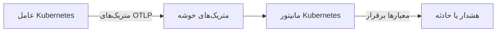

# مانیتور Kubernetes

مانیتور Kubernetes بر پایه متریک‌هایی هشدار می‌دهد که عامل Kubernetes در OneUptime از یک خوشه می‌فرستد: گره‌ها، پادها، کانتینرها، بارهای کاری، مقیاس‌دهنده‌های خودکار و Control Plane. از یک الگوی هشدار آماده شروع کنید، یک متریک را برگزینید یا پرس‌وجوی خودتان را بنویسید، و سپس آستانه‌ای را تعیین کنید که هشدار یا حادثه باز می‌کند.

:::cards
- [نصب عامل](/docs/monitor/kubernetes-agent): یک فرمان Helm خوشه را به OneUptime می‌آورد.
- [ساخت مانیتور](#ساخت-یک-مانیتور-kubernetes): خوشه را برگزینید، سپس یک الگو، یک متریک یا یک پرس‌وجو.
- [الگوهای هشدار](#الگوهای-هشدار-آماده): هفده هشدار آماده، از CrashLoopBackOff تا etcd.
- [معیارها](#معیارهای-مانیتورینگ): آستانه‌های ایستا و تشخیص ناهنجاری.
:::

## چگونه کار می‌کند

عامل متریک‌های خوشه را از راه OTLP به OneUptime می‌فرستد و روی هر کدام نام خوشه (`k8s.cluster.name`، همان `clusterName` در چارت) را می‌زند. نخستین داده از یک نام تازه خوشه را زیر **Kubernetes** ثبت می‌کند و از آن پس می‌توان خوشه را در یک مانیتور Kubernetes برگزید. مانیتور هر دقیقه آن متریک‌ها را در **بازه زمانی** خود پرس‌وجو می‌کند، تجمیعشان می‌کند و نتیجه را با معیارهایش مقایسه می‌کند.

## پیش از شروع

- عامل Kubernetes در OneUptime در خوشه اجرا شود. [عامل Kubernetes (نصب با Helm)](/docs/monitor/kubernetes-agent) را ببینید؛ چند دقیقه پس از نصب، خوشه زیر **Kubernetes** پدیدار می‌شود.
- برای الگوهای Control Plane (**etcd No Leader**، **API Server Request Saturation**، **Scheduler Backlog**): جمع‌آوری Control Plane توسط عامل، یعنی `controlPlane.enabled`. خوشه‌های مدیریت‌شده (EKS، GKE، AKS) این نقطه‌های پایانی را در دسترس نمی‌گذارند، پس آنجا این مانیتورها هرگز داده‌ای نمی‌گیرند.

## ساخت یک مانیتور Kubernetes

:::steps
### یک مانیتور تازه شروع کنید

به **مانیتورها** بروید و روی **ساخت مانیتور** کلیک کنید. زیر **انواع دیگر مانیتور**، گزینه **Kubernetes** را برگزینید – یا در کادر جست‌وجو `k8s` را تایپ کنید.

### خوشه را برگزینید

آن را در **خوشه Kubernetes** انتخاب کنید. فهرست هر خوشه‌ای را که عامل از آن گزارش داده در بر دارد.

### برگزینید چه چیزی پایش شود

از یکی از سه زبانه استفاده کنید:

| زبانه | آنچه برمی‌گزینید |
| --- | --- |
| **Quick Setup** | یک [الگوی هشدار آماده](#الگوهای-هشدار-آماده). متریک، دامنه، بازه زمانی و معیارها را پر می‌کند؛ همچنان می‌توانید **بازه زمانی** را تغییر دهید. |
| **Custom Metric** | یک متریک از [فهرست متریک‌ها](#فهرست-متریکها)، سپس **دامنه منبع**، فیلترها، **تجمیع** (میانگین، بیشینه، کمینه، جمع یا تعداد) و **بازه زمانی** آن. |
| **پیشرفته** | **دامنه منبع**، فیلترها و **بازه زمانی**، به همراه پرس‌وجوها و فرمول‌های متریک خودتان زیر **انتخاب متریک‌ها**، با نمودار زنده‌ای از نتیجه. |

### معیارها را تعیین کنید

تعیین کنید مانیتور کی وضعیتش را تغییر می‌دهد و کی هشدار یا حادثه باز می‌کند – [معیارهای مانیتورینگ](#معیارهای-مانیتورینگ) را ببینید. یک الگو از قبل آن‌ها را پر کرده است: آستانه‌ها، شدت‌ها و سیاست‌های آنکال را بازبینی کنید.

### مانیتور را ذخیره کنید

فرم را کامل کنید و ذخیره کنید. مانیتور زیر **مانیتورها** پدیدار می‌شود و وضعیتش از نخستین ارزیابی از معیارهای شما پیروی می‌کند.
:::

## گزینه‌های پیکربندی

### دامنه منبع و فیلترها

**دامنه منبع** سطحی را تعیین می‌کند که متریک در آن ارزیابی می‌شود و مشخص می‌کند فرم کدام فیلترها را نشان دهد. همه فیلترها اختیاری‌اند.

| دامنه | چه چیزی را پایش می‌کند | فیلترها |
| --- | --- | --- |
| خوشه | کل خوشه | — |
| Namespace | منابع درون یک Namespace | **Namespace** |
| بار کاری | یک deployment، statefulset، daemonset، job یا cronjob | **Namespace**، **نام بار کاری** |
| گره | یک گره خوشه | **نام گره** |
| پاد | یک پاد | **Namespace**، **نام پاد** |

### بازه زمانی

**بازه زمانی** پنجره‌ای است که پرس‌وجوی متریک در هر بار ارزیابی مانیتور پوشش می‌دهد، از **Past 1 Minute** تا **Past 365 Days**. پنجره‌های کوتاه (۱ تا ۱۵ دقیقه) برای هشداردهی مناسب‌اند؛ پنجره‌های بلندتر متریک‌های پرنوسان را هموار می‌کنند.

### پرس‌وجوها و فرمول‌های متریک

در زبانه **پیشرفته**، هر پرس‌وجو یک متریک، شیوه تجمیع مقدارهای آن و فیلترهای ویژگی اختیاری را مشخص می‌کند. یک **فرمول** پرس‌وجوها را با حساب ترکیب می‌کند – برای نمونه، الگوهای بهره‌برداری گره مصرف را بر ظرفیت قابل‌تخصیص تقسیم می‌کنند.

## فهرست متریک‌ها

زبانه **Custom Metric** این متریک‌ها را، گروه‌بندی‌شده بر پایه نوع منبع، ارائه می‌دهد:

| دسته | متریک‌ها |
| --- | --- |
| پاد | Pod CPU Usage, Pod Memory Usage, Pod Phase (Code), Pod Filesystem Usage, Pod Memory Limit Utilization, Pod CPU Limit Utilization, Pod Network I/O (Cumulative, Both Directions) |
| گره | Node CPU Usage, Node Allocatable CPU, Node Memory Usage, Node Filesystem Usage, Node Allocatable Memory, Node Ready Condition, Node Filesystem Available |
| کانتینر | Container Restarts, Container CPU Limit, Container CPU Request, Container Memory Limit, Container Memory Request, Container Ready |
| بار کاری | Deployment Available Replicas, Deployment Desired Replicas, DaemonSet Misscheduled Nodes, DaemonSet Ready Nodes, StatefulSet Ready Replicas, Job Failed Pods, Job Successful Pods |
| HPA | HPA Current Replicas, HPA Desired Replicas, HPA Max Replicas, HPA Min Replicas |
| Control Plane | etcd Has Leader, API Server In-Flight Requests, Scheduler Pending Pods |

> [!NOTE]
> **Pod CPU Usage** و **Node CPU Usage** بر حسب هسته‌اند، نه درصد: `0.18` یعنی ۰٫۱۸ هسته. **Pod Phase (Code)** یک کد است (۱ Pending، ۲ Running، ۳ Succeeded، ۴ Failed، ۵ Unknown) – آن را با بیشینه یا کمینه تجمیع کنید، هرگز با جمع. متریک‌های Control Plane فقط وقتی می‌رسند که جمع‌آوری Control Plane توسط عامل روشن باشد.

## معیارهای مانیتورینگ

### چه چیزی ارزیابی می‌شود

این مانیتورها همیشه **Metric Value** را ارزیابی می‌کنند – مقدار پرس‌وجو یا فرمول متریک پیکربندی‌شده. فرم معیار انتخابگری برای نوع فیلتر ندارد؛ **متریک**، **تجمیع**، **شرط** و **Threshold** را نشان می‌دهد.

### انواع تجمیع

| تجمیع | توضیح |
| --- | --- |
| میانگین | مقدار میانگین در پنجره زمانی |
| جمع | جمع همه مقدارها |
| Maximum Value | بالاترین مقدار در پنجره زمانی |
| Minimum Value | پایین‌ترین مقدار در پنجره زمانی |
| All Values | همه مقدارها باید با معیار جور باشند |
| Any Value | دست‌کم یک مقدار باید جور باشد |

### شرط‌ها

آستانه‌های ایستا با **Threshold** واردشده مقایسه می‌شوند: **Greater Than**، **Less Than**، **Greater Than Or Equal To**، **Less Than Or Equal To** و **Equal To**.

تشخیص ناهنجاری بر پایه خط مبنا به آستانه نیازی ندارد. یکی از این شرط‌ها را برگزینید تا فرم به جای آن **حساسیت** و **پنجره مبنا** را نشان دهد:

| شرط | وقتی برقرار است که مقدار |
| --- | --- |
| **Anomalously High** | از بازه مورد انتظار بالاتر برود |
| **Anomalously Low** | از بازه مورد انتظار پایین‌تر بیاید |
| **Anomalous** | در هر جهتی از بازه مورد انتظار بیرون برود |

هر نمونه با یک خط مبنا برای همان ساعت از هفته مقایسه می‌شود که از **پنجره مبنا** ساخته شده است (به‌طور پیش‌فرض ۱۴ روز؛ ۲۸، ۶۰ یا ۹۰ روز). **حساسیت** پهنای بازه مورد انتظار را تعیین می‌کند: **پایین (۴σ — فقط انحراف‌های بسیار بزرگ)**، **متوسط (۳σ — توصیه‌شده)** که پیش‌فرض است، یا **بالا (۲σ — پرنوفه‌تر، سرویس‌های بسیار پایدار)**. شرط‌های ناهنجاری در وضعیت «Learning» می‌مانند و هیچ هشداری نمی‌دهند تا وقتی که دست‌کم به اندازه پنجره مبنای انتخاب‌شده سابقه متریک وجود داشته باشد.

**اگر داده‌ای نبود**، زیر **فیلدهای بیشتر**، تعیین می‌کند وقتی پرس‌وجو در پنجره چیزی برنمی‌گرداند چه شود: **Ignore** (پیش‌فرض) برقرار نمی‌شود، **تریگر** سکوت را خود مشکل می‌داند، و **Treat As Zero** یک صفر را مقایسه می‌کند. زمانی که خود OneUptime داده دریافت نمی‌کرد هرگز «بدون داده» به حساب نمی‌آید: بررسی‌ای که پنجره‌اش چنین زمانی را در بر دارد به جای آن صبر می‌کند، همان‌طور که [وقتی OneUptime داده دریافت نمی‌کند](/docs/monitor/when-oneuptime-is-not-receiving) توضیح می‌دهد.

## الگوهای هشدار آماده

زبانه **Quick Setup** این الگوها را بر پایه دسته فهرست می‌کند. هر کدام دو معیار را پر می‌کند: یکی که تا وقتی شرط برقرار است مانیتور را آفلاین علامت می‌زند و یک حادثه و یک هشدار باز می‌کند، و دیگری که وقتی شرط برطرف شد آن را دوباره آنلاین می‌کند.

| الگو | دسته | چه وقت فعال می‌شود | شدت |
| --- | --- | --- | --- |
| CrashLoopBackOff Detection | بار کاری | یک کانتینر از زمان ساخت پادش بیش از ۵ بار دوباره راه‌اندازی شده است | بحرانی |
| Pod Stuck in Pending | در حال زمان‌بندی | در هر نمونه از یک پنجره ۱۵ دقیقه‌ای، پادی در مرحله Pending است | Warning |
| Node Not Ready | گره | یک گره NotReady گزارش می‌دهد | بحرانی |
| High Node CPU Utilization | گره | میانگین مصرف CPU یک گره بیش از ۹۰٪ CPU قابل‌تخصیص آن است | Warning |
| High Node Memory Utilization | گره | میانگین مصرف حافظه یک گره بیش از ۸۵٪ حافظه قابل‌تخصیص آن است | Warning |
| Deployment Replica Mismatch | بار کاری | یک deployment به مدت ۱۵ دقیقه کمتر از تعداد مطلوب، رپلیکای در دسترس دارد | Warning |
| Job Failures | بار کاری | یک job پادهای ناموفق دارد | Warning |
| etcd No Leader | Control Plane | etcd رهبر برگزیده‌ای ندارد | بحرانی |
| API Server Request Saturation | Control Plane | سرور API در تمام پنجره ۲۰۰ درخواست در جریان یا بیشتر دارد | بحرانی |
| Scheduler Backlog | در حال زمان‌بندی | صف پادهای در انتظار زمان‌بند به مدت ۵ دقیقه خالی نمی‌شود | Warning |
| High Node Disk Usage | ذخیره‌سازی | سامانه فایل یک گره بیش از ۹۰٪ پر است | Warning |
| DaemonSet Misscheduled Nodes | بار کاری | یک DaemonSet پادهایی را روی گره‌هایی اجرا می‌کند که دیگر با انتخابگر گره، affinity یا tolerationهای آن جور نیستند | Warning |
| High Node CPU Request Commitment | گره | جمع درخواست‌های CPU کانتینرهای یک گره از ۹۰٪ CPU قابل‌تخصیص آن بیشتر است | Warning |
| High Node Memory Request Commitment | گره | جمع درخواست‌های حافظه کانتینرهای یک گره از ۹۰٪ حافظه قابل‌تخصیص آن بیشتر است | Warning |
| HPA Saturated at Max Replicas | بار کاری | یک HPA روی ۹۰٪ یا بیشتر از `maxReplicas` خود کار می‌کند | بحرانی |
| Pod Memory Saturating Container Limit | بار کاری | یک پاد بیش از ۹۰٪ محدودیت حافظه کانتینرهایش را مصرف می‌کند | بحرانی |
| Pod CPU Saturating Container Limit | بار کاری | یک پاد بیش از ۹۰٪ محدودیت CPU کانتینرهایش را مصرف می‌کند | Warning |

الگوهایی که روی متریک‌های هر شیء کار می‌کنند، هر گره، پاد، deployment، job، DaemonSet یا HPA را جداگانه ارزیابی می‌کنند، پس خوشه‌ای با چند پاد ناسالم به ازای هر پاد یک حادثه می‌گیرد، نه یک حادثه برای کل خوشه.

> [!NOTE]
> **CrashLoopBackOff Detection** تعداد کل راه‌اندازی‌های دوباره کانتینر را برای پاد فعلی‌اش می‌خواند، نه یک نرخ. کانتینری که در حلقه خرابی افتاده و سپس بهبود یافته، هشدار را تا وقتی پادش جایگزین شود باز نگه می‌دارد.

### علت‌ها را بگیرید، نه فقط نشانه‌ها را

الگوهای سطح گره (High Node CPU Utilization، High Node Memory Utilization، Node Not Ready، Pod Stuck in Pending) در *انتهای* زنجیره تمام‌شدن منابع فعال می‌شوند، وقتی خوشه از قبل دچار افت شده است. سه الگو در *آغاز* این زنجیره فعال می‌شوند، جایی که معمولاً راه‌حل همان‌جاست:

- **Pod Memory Saturating Container Limit** و **Pod CPU Saturating Container Limit** بار کاری‌ای را می‌گیرند که به محدودیت‌های خودش چسبیده است. گذشتن از محدودیت حافظه یعنی OOMKill فوری؛ گذشتن از محدودیت CPU باعث می‌شود هسته سیستم‌عامل پاد را محدود کند، پس پاد بی‌آنکه خطایی بدهد کند می‌شود. هر دو علت رایج CrashLoopBackOff و تأخیرهای بی‌توضیح‌اند.
- **HPA Saturated at Max Replicas** مقیاس‌دهنده خودکاری را می‌گیرد که دیگر جایی برای رشد ندارد. بار کاری‌ای که محدودیت‌های هر پادش خیلی پایین است، محدود یا کشته می‌شود و همین، متریکی را که HPA بر پایه‌اش مقیاس می‌دهد بالا می‌برد – پس مقیاس‌دهنده خودکار مدام رپلیکاهایی اضافه می‌کند که هر کدام به همان اندازه کم‌منبع‌اند، تا به سقفش برسد. راه‌حل بالا بردن محدودیت‌هاست؛ بالا بردن `maxReplicas` اوضاع را بدتر می‌کند.

آن‌ها را با هم در هر Namespaceی که یک بار کاری با مقیاس خودکار اجرا می‌کند روشن کنید: این ترکیب «واقعاً به ظرفیت بیشتر نیاز دارد» را از «منابع هر پاد کم است» جدا می‌کند.

> [!NOTE]
> دو الگوی محدودیت پاد مصرف پاد را بر **جمع** محدودیت‌های کانتینرهایش تقسیم می‌کنند، پس پادهای دارای sidecar درست سنجیده می‌شوند. عدد حافظه پاد در kubelet شامل کش صفحه قابل‌بازپس‌گیری است، پس بار کاری‌ای که با فایل زیاد کار می‌کند ممکن است روی الگوی حافظه بالا بماند بی‌آنکه هرگز OOMKill شود: آن را «در حال نزدیک شدن به محدودیت» بخوانید، نه «در آستانه کشته شدن».

## رفع اشکال

:::details خوشه در فهرست خوشه Kubernetes نیست
خوشه‌ها خودشان از روی داده‌های عامل ثبت می‌شوند، با همان `clusterName`ی که عامل با آن نصب شده است. بررسی کنید پادهای عامل در حال اجرا باشند و خوشه زیر **محصولات → زیرساخت → Kubernetes → همه خوشه‌ها** فهرست شده باشد. [عامل Kubernetes (نصب با Helm)](/docs/monitor/kubernetes-agent) نصب و آنچه را هنگام نرسیدن داده باید بررسی کرد توضیح می‌دهد.
:::

:::details یک الگوی Control Plane هرگز فعال نمی‌شود
**etcd No Leader**، **API Server Request Saturation** و **Scheduler Backlog** متریک‌هایی را می‌خوانند که فقط جمع‌آوری Control Plane توسط عامل گرد می‌آورد. `controlPlane.enabled` را در مقدارهای Helm عامل روشن کنید؛ به‌طور پیش‌فرض خاموش است. خوشه‌های مدیریت‌شده (EKS، GKE، AKS) این نقطه‌های پایانی را در دسترس نمی‌گذارند، پس روی آن‌ها این مانیتورها هرگز داده‌ای نمی‌گیرند.
:::

:::details یک آستانه CPU هرگز فعال نمی‌شود
**Pod CPU Usage** و **Node CPU Usage** بر حسب هسته‌اند، نه درصد، پس آستانه `80` یعنی ۸۰ هسته. آستانه را بر حسب هسته تعیین کنید، یا از **High Node CPU Utilization** یا **Pod CPU Saturating Container Limit** شروع کنید که درصد را مقایسه می‌کنند.
:::

:::details پس از بهبود پاد، CrashLoopBackOff Detection باز می‌ماند
الگو تعداد کل راه‌اندازی‌های دوباره کانتینر را برای پاد فعلی‌اش می‌خواند، پس وقتی این عدد از ۵ گذشت دیگر پایین نمی‌آید. هشدار وقتی برطرف می‌شود که پاد جایگزین شود، برای نمونه با استقرار دوباره، بیرون‌راندن یا تخلیه گره.
:::

## گام‌های بعدی

:::cards
- [عامل Kubernetes (نصب با Helm)](/docs/monitor/kubernetes-agent): عامل را با Helm نصب، ارتقا و تنظیم کنید.
- [عامل Kubernetes](/docs/telemetry/kubernetes-agent): فیلترهای Namespace، متریک‌های Control Plane، فیلترهای شدت لاگ و عامل هوش مصنوعی.
- [مانیتور متریک‌ها](/docs/monitor/metrics-monitor): بر پایه هر متریکی هشدار دهید، از جمله متریک‌های سفارشی و eBPF عامل.
- [قالب‌بندی حادثه و هشدار](/docs/monitor/incident-alert-templating): پاد یا گره‌ای را که از حد گذشته در عنوان حادثه‌ها بیاورید.
:::
