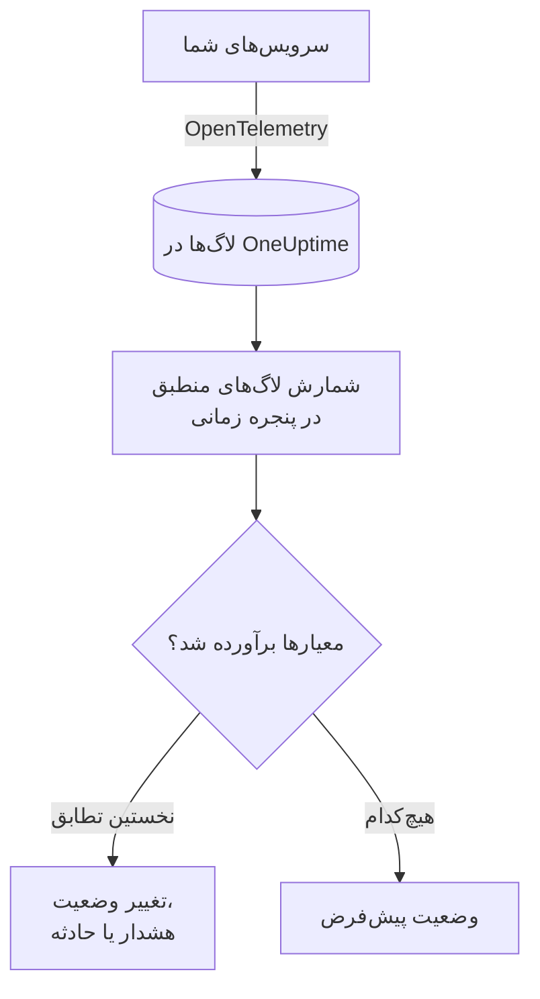
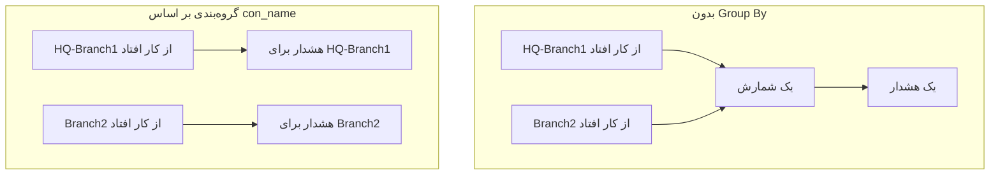

# مانیتور لاگ‌ها

مانیتور لاگ‌ها لاگ‌هایی را که سرویس‌های شما به OneUptime می‌فرستند و با فیلترهای شما (متن، شدت، سرویس، ویژگی‌ها) منطبق‌اند، در یک پنجره زمانی می‌شمارد. وقتی این شمارش معیارهای شما را برآورده کند، وضعیت مانیتور را تغییر می‌دهد، هشدار می‌سازد یا حادثه اعلام می‌کند. از آن برای تشخیص جهش خطاها، یک پیام خطای مشخص یا سرویسی که دیگر لاگ نمی‌نویسد استفاده کنید.

:::cards
- [ساخت مانیتور](#ساخت-یک-مانیتور-لاگها): لاگ‌هایی که شمرده می‌شوند و زمان هشدار را انتخاب کنید.
- [چگونه ارزیابی می‌شود](#چگونه-ارزیابی-میشود): پنجره زمانی، شمارش و چرخهٔ یک‌دقیقه‌ای.
- [معیارها](#معیارها): آستانه‌ها، تشخیص ناهنجاری و پیش‌فرض‌ها.
- [هشدار به تفکیک گروه](#هشدار-به-تفکیک-گروه-group-by): یک هشدار برای هر تونل، کاربر یا اینترفیس.
:::

## چگونه کار می‌کند



هر دقیقه، OneUptime لاگ‌هایی را که با فیلترهای مانیتور منطبق‌اند و در پنجره زمانی آن رسیده‌اند می‌شمارد. سپس این شمارش را از بالا به پایین با معیارهای مانیتور می‌سنجد و نخستین معیاری که منطبق شود تعیین می‌کند چه اتفاقی بیفتد. وقتی هیچ‌کدام منطبق نشود، مانیتور به وضعیت پیش‌فرض خود برمی‌گردد.

## پیش از شروع

- سرویس‌های شما لاگ‌ها را از طریق OpenTelemetry (یا منبع لاگ دیگری که OneUptime دریافت می‌کند) به OneUptime می‌فرستند. [OpenTelemetry](/docs/telemetry/open-telemetry) را ببینید.
- برای فیلتر یا گروه‌بندی بر اساس مقداری درون خط لاگ، مثل نام یک تونل یا کاربر، ابتدا آن را با یک [خط لوله لاگ](/docs/telemetry/log-pipelines) به یک ویژگی تبدیل کنید.

## ساخت یک مانیتور لاگ‌ها

:::steps
### شروع یک مانیتور تازه

به **مانیتورها** بروید و روی **ساخت مانیتور** کلیک کنید.

### انتخاب نوع لاگ‌ها

در **نوع مانیتور**، روی **انواع دیگر مانیتور** کلیک کنید و **لاگ‌ها** را زیر **تله‌متری** انتخاب کنید، یا در کادر جستجو `logs` را تایپ کنید. یک **نام** وارد کنید و روی **بعدی** کلیک کنید.

### انتخاب لاگ‌هایی که شمرده می‌شوند

در **پیکربندی مانیتور لاگ**، **پایش لاگ‌هایی که این متن را دارند**، **پایش لاگ‌ها به مدت (زمان)** و **شدت لاگ** را تنظیم کنید. فیلتری که خالی بگذارید با همهٔ لاگ‌ها منطبق است. **پیش‌نمایش لاگ‌ها**، زیر فیلترها، لاگ‌هایی را نشان می‌دهد که همین حالا با آن‌ها منطبق‌اند.

### محدودتر کردن آن‌ها (اختیاری)

برای فیلتر بر اساس سرویس تله‌متری، موجودیت زیرساخت یا ویژگی، **فیلدهای بیشتر** را باز کنید. برای اینکه به‌جای یک هشدار برای کل مانیتور، برای هر تونل، کاربر یا اینترفیس یک هشدار بگیرید، ویژگی را به **Group by Attributes** اضافه کنید ([هشدار به تفکیک گروه](#هشدار-به-تفکیک-گروه-group-by) را ببینید).

### تعیین معیارها

کارت **معیارهای مانیتور** با دو معیار شروع می‌شود: آفلاین همراه با یک حادثه، وقتی هیچ لاگی منطبق نباشد؛ آنلاین، وقتی دست‌کم یکی منطبق باشد. آن‌ها را به آنچه می‌خواهید روی آن هشدار بگیرید تغییر دهید ([معیارها](#معیارها) را ببینید).

### ساخت مانیتور

روی **ساخت مانیتور** کلیک کنید. مانیتور در صفحهٔ **نمای کلی** خود باز می‌شود و نخستین ارزیابی آن ظرف یک دقیقه اجرا می‌شود.
:::

## چه چیزی را پرس‌وجو می‌کند

| فیلد | با چه چیزی منطبق است | پیش‌فرض |
| --- | --- | --- |
| **پایش لاگ‌هایی که این متن را دارند** | لاگ‌هایی که بدنهٔ آن‌ها این متن را دارد، بدون توجه به بزرگی و کوچکی حروف. | خالی: همهٔ لاگ‌ها |
| **پایش لاگ‌ها به مدت (زمان)** | لاگ‌های ۵ ثانیهٔ گذشته تا ۲۴ ساعت گذشته. | **۱ دقیقه گذشته** |
| **شدت لاگ** | لاگ‌هایی با هر یک از شدت‌های انتخاب‌شده. | خالی: همهٔ شدت‌ها |
| **Group by Attributes** | فیلتر نیست: هر ترکیب از مقادیر این ویژگی‌ها را جداگانه می‌شمارد. | خالی: یک شمارش |
| **فیلتر بر اساس سرویس تله‌متری** (زیر **فیلدهای بیشتر**) | لاگ‌های هر یک از سرویس‌های انتخاب‌شده. | خالی: همهٔ سرویس‌ها |
| **Filter by Infrastructure Entity** (زیر **فیلدهای بیشتر**) | لاگ‌های هر یک از میزبان‌ها، پادها، کانتینرها و دیگر موجودیت‌های انتخاب‌شده. | خالی: همهٔ موجودیت‌ها |
| **فیلتر بر اساس ویژگی‌ها** (زیر **فیلدهای بیشتر**) | لاگ‌هایی که ویژگی‌هایشان همهٔ شرط‌ها را برآورده می‌کنند. هر شرط عملگر خودش را دارد، مثل «برابر است» یا «شامل است». | خالی: بدون شرط |

برای اینکه یک لاگ شمرده شود، باید با همهٔ فیلترهایی که تنظیم کرده‌اید منطبق باشد.

### شدت لاگ

هر لاگ با یکی از هفت شدت ذخیره می‌شود. برای لاگ‌های OpenTelemetry، شدت از عدد شدت لاگ می‌آید، پس شدت را انتخاب کنید، نه متنی که لاگر شما چاپ کرده است:

| شدت | اعداد شدت OpenTelemetry |
| --- | --- |
| **ترِیس** | ۱–۴ |
| **Debug** | ۵–۸ |
| **Information** | ۹–۱۲ |
| **Warning** | ۱۳–۱۶ |
| **خطا** | ۱۷–۲۰ |
| **Fatal** | ۲۱–۲۴ |
| **مشخص‌نشده** | هر مقدار دیگر |

## چگونه ارزیابی می‌شود

- **هر دقیقه.** مانیتور لاگ‌ها را پراب‌ها بررسی نمی‌کنند، پس بازه‌ای برای تنظیم ندارد و صفحهٔ **پراب‌ها و بازه** هم ندارد.
- **یک عدد در هر ارزیابی.** مانیتور لاگ‌هایی را می‌شمارد که با همهٔ فیلترها منطبق‌اند و در **پایش لاگ‌ها به مدت (زمان)** پیش از ارزیابی رسیده‌اند. با **۵ دقیقه گذشته**، هر ارزیابی پنج دقیقه به عقب نگاه می‌کند، پس پنجره‌های ارزیابی‌های پیاپی روی هم می‌افتند.
- **نبود لاگ یعنی شمارش ۰.** سرویسی که دیگر لاگ نمی‌نویسد ۰ تولید می‌کند، و معیار آفلاین پیش‌فرض دقیقاً به دنبال همین است.
- **قطعی خود OneUptime سکوت نیست.** تا وقتی پنجره زمانی شامل زمانی است که خود OneUptime داده دریافت نمی‌کرد (در حال راه‌اندازی دوباره، ارتقا یا جبران عقب‌ماندگی بود)، بررسی صبر می‌کند: وضعیت تغییر نمی‌کند و هیچ حادثه یا هشداری باز یا رفع نمی‌شود. [وقتی OneUptime داده دریافت نمی‌کند](/docs/monitor/when-oneuptime-is-not-receiving) را ببینید.
- **معیارها از بالا به پایین.** نخستین معیاری که منطبق شود تصمیم می‌گیرد، پس شدیدترین را اول بگذارید. مانیتور گروه‌بندی‌شده طور دیگری کار می‌کند: هر معیار را برای هر گروه بررسی می‌کند ([ارزیابی معیارها فرق می‌کند](#ارزیابی-معیارها-فرق-میکند) را ببینید).

هر تغییر وضعیت، همراه با دلیل آن، در **خط زمانی وضعیت** مانیتور ثبت می‌شود.

## معیارها

معیارهای مانیتور لاگ‌ها یک **نوع فیلتر** دارند: **Log Count**، یعنی تعداد لاگ‌هایی که در پنجره منطبق شدند. یک **شرط فیلتر** و، برای شرط آستانه‌ای، یک **مقدار** انتخاب کنید.

| شرط فیلتر | منطبق است وقتی شمارش لاگ… |
| --- | --- |
| **Greater Than** | بیشتر از مقدار باشد |
| **Greater Than Or Equal To** | برابر مقدار یا بیشتر از آن باشد |
| **Less Than** | کمتر از مقدار باشد |
| **Less Than Or Equal To** | برابر مقدار یا کمتر از آن باشد |
| **Equal To** | دقیقاً برابر مقدار باشد |
| **Anomalously High** | بالاتر از بازهٔ مورد انتظار برای این ساعت از هفته باشد |
| **Anomalously Low** | پایین‌تر از آن بازه باشد |
| **Anomalous** | در هر جهت بیرون از آن بازه باشد |

شرط‌های ناهنجاری **مقدار** نمی‌گیرند. یک **حساسیت** (Low، Medium که پیش‌فرض است، یا High) و یک **پنجره مبنا** از ۱۴ (پیش‌فرض)، ۲۸، ۶۰ یا ۹۰ روز انتخاب کنید. OneUptime شمارش را به نرخ در دقیقه تبدیل می‌کند و آن را با همان ساعت از هفته در طول آن پنجره مقایسه می‌کند. مبنا فقط سرویس‌ها و شدت‌های مانیتور را پوشش می‌دهد: فیلترهای متن و ویژگی آن بخشی از مبنا نیستند. تا وقتی آن ساعت از هفته تاریخچهٔ کافی نداشته باشد، معیار هنوز در حال یادگیری است و فعال نمی‌شود.

مانیتور لاگ‌های تازه با این معیارها شروع می‌شود:

| معیار | فیلتر | اثر |
| --- | --- | --- |
| Check if … is offline | **Log Count** **Equal To** `0` | مانیتور را آفلاین علامت می‌زند و حادثه‌ای اعلام می‌کند که خودکار رفع می‌شود |
| Check if … is online | **Log Count** **Greater Than** `0` | مانیتور را آنلاین علامت می‌زند |

> [!TIP]
> برای هشدار روی خطاها به‌جای سکوت، **شدت لاگ** را روی **خطا** بگذارید و معیار آفلاین را به **Log Count** **Greater Than** تعداد خطاهایی تغییر دهید که در پنجره قابل تحمل است.

## مثال کاربردی: جهش خطاها

می‌خواهید وقتی سرویس checkout در پنج دقیقه بیش از ۵۰ خطا لاگ می‌کند، حادثه‌ای اعلام شود:

- **شدت لاگ**: **خطا**
- **پایش لاگ‌ها به مدت (زمان)**: **۵ دقیقه گذشته**
- **فیلتر بر اساس سرویس تله‌متری**: `checkout`
- معیار ۱: **Log Count** **Greater Than** `50`: مانیتور را آفلاین علامت بزن و حادثه اعلام کن
- معیار ۲: **Log Count** **Less Than Or Equal To** `50`: مانیتور را آنلاین علامت بزن

چهار ارزیابی پیاپی:

| زمان | لاگ‌های خطا در ۵ دقیقهٔ گذشته | معیار منطبق | چه اتفاقی می‌افتد |
| --- | --- | --- | --- |
| ۱۰:۰۰ | ۱۲ | ۲ | مانیتور آنلاین است. |
| ۱۰:۰۱ | ۶۴ | ۱ | مانیتور آفلاین می‌شود و حادثه‌ای اعلام می‌شود. |
| ۱۰:۰۲ | ۸۱ | ۱ | همچنان آفلاین. حادثه از قبل باز است، پس حادثهٔ دومی اعلام نمی‌شود. |
| ۱۰:۰۶ | ۹ | ۲ | مانیتور دوباره آنلاین می‌شود و حادثه خودبه‌خود رفع می‌شود، چون **رفع خودکار حادثه** روشن است. |

چون پنجره‌ها روی هم می‌افتند، یک موج خطا تا پنج دقیقه پس از پایانش شمارش را بالا نگه می‌دارد. برای مانیتوری که باید زودتر بهبود یابد، از پنجرهٔ کوتاه‌تری استفاده کنید.

## هشدار به تفکیک گروه (Group By)

**Group by Attributes** شمارش مانیتور لاگ‌ها را به یک شمارش برای هر ترکیب متمایز از مقادیر ویژگی‌ها تقسیم می‌کند (یکی برای هر تونل IPsec، هر کاربر VPN، هر اینترفیس فایروال) و معیارها را برای هر گروه جداگانه ارزیابی می‌کند. این همتای لاگیِ [Group By](/docs/monitor/metrics-monitor#هشدار-به-تفکیک-سری-group-by) در مانیتور متریک‌ها است.

### یک هشدار برای هر گروه

بدون Group By، مانیتوری که تونل‌های IPsec قطع‌شده را زیر نظر دارد یک شمارش واحد برای کل مانیتور است و **یک هشدار برای کل مانیتور** می‌دهد. تا وقتی آن هشدار باز است، از کار افتادن تونل دوم چیز تازه‌ای پدید نمی‌آورد: مانیتور از قبل در حال هشدار است.

با Group By روی نام تونل، قطع شدن تونل `HQ-Branch1` هشدار خودش را باز می‌کند و قطع شدن تونل `Branch2` ده دقیقه بعد، **هشدار دوم و جداگانه‌ای** در کنار آن باز می‌کند.



### رفع مستقل

هشدار یا حادثهٔ هر گروه جداگانه رفع می‌شود. همین که گروهی دیگر معیارها را برآورده نکند (`HQ-Branch1` در پنجره زمانی دیگر قطعی‌ای لاگ نکند)، هشدار آن رفع می‌شود، در حالی که هشدار `Branch2` تا وقتی `Branch2` هم متوقف شود باز می‌ماند. بهبود یک گروه هرگز هشدار گروه دیگری را نمی‌بندد.

مانیتور لاگ‌ها رویدادها را می‌بیند، نه وضعیت را: هشدار یک گروه وقتی رفع می‌شود که آن گروه در طول یک پنجره زمانی کامل چیزی لاگ نکرده باشد که معیارها را برآورده کند، چه تونل برگشته باشد چه نه.

### مثال: یک هشدار برای هر تونل IPsec در Sophos

این مثال فرض می‌کند خط‌های syslog فایروال با یک [Key=Value Parser](/docs/telemetry/log-pipelines#keyvalue-parser) و بدون پیشوند مقصد به ویژگی‌ها تجزیه شده‌اند، پس نام تونل ویژگی `con_name` است:

```text
log_component="IPSec" con_name="HQ-Branch1" status="Terminated" message="IPSec Connection HQ-Branch1 between 10.171.4.117 and 10.171.4.118 for Child HQ-Branch1 terminated."
```

:::steps
1. یک مانیتور **لاگ‌ها** بسازید.
2. **پایش لاگ‌هایی که این متن را دارند** را روی `terminated` و **پایش لاگ‌ها به مدت (زمان)** را روی **۵ دقیقه گذشته** بگذارید.
3. زیر **فیلدهای بیشتر**، فیلتر ویژگی `log_component` = `IPSec` را اضافه کنید.
4. در **Group by Attributes**، `con_name` را اضافه کنید.
5. معیاری با فیلتر **Log Count** **Greater Than** `0` اضافه کنید که هشدار یا حادثه‌ای با عنوان `IPsec tunnel {{con_name}} terminated` بسازد.
:::

اکنون هر تونلی که قطعی‌ای لاگ کند هشدار خودش را می‌گیرد (`IPsec tunnel HQ-Branch1 terminated`، `IPsec tunnel Branch2 terminated`) و هر کدام جداگانه رفع می‌شود.

### مقادیر گروه در عنوان‌ها و توضیحات

مقدار هر ویژگی Group By در عنوان، توضیحات و یادداشت‌های رفع مشکل هشدار یا حادثه یک [متغیر قالب](/docs/monitor/incident-alert-templating) است، همان‌طور که برچسب‌های یک سری متریک هستند: گروه‌بندی بر اساس `con_name` به شما `{{con_name}}` می‌دهد. کلیدی که نقطه دارد به‌صورت مسیر خوانده می‌شود، پس `sophos.con_name` همان `{{sophos.con_name}}` است. وقتی عنوان از قبل نام گروه را ندارد، گروه به آن افزوده می‌شود (`IPsec tunnel terminated - Con Name: HQ-Branch1`) و `{{seriesResourceSuffix}}` و `{{seriesResourceSummary}}` همان‌طور کار می‌کنند که در مانیتورهای متریک.

### گروه‌ها چگونه شمرده می‌شوند

- حداکثر ۱۰ ویژگی. هر ترکیب متمایز از مقادیر آن‌ها یک گروه است.
- لاگی که یک ویژگی Group By را ندارد، با یک **مقدار خالی** برای آن شمرده می‌شود، پس لاگ‌هایی که آن ویژگی را ندارند گروه جداگانه‌ای می‌سازند که هشدارش هیچ مقداری برای آن نام نمی‌برد. اگر همهٔ هشدارها بدون مقدار گروه می‌رسند، کلید ویژگی را بررسی کنید: خط لوله لاگی که پیشوند مقصد دارد `con_name` را به‌صورت `sophos.con_name` ذخیره می‌کند.
- مقادیر گروه بلندتر از ۲۵۶ نویسه به ۲۵۶ نویسه کوتاه می‌شوند.
- در هر بررسی حداکثر **۱۰۰ گروه** ارزیابی می‌شوند: ۱۰۰ گروهی که بیشترین لاگ را دارند. وقتی گروه‌های بیشتری منطبق شوند، بقیه در آن بررسی کنار گذاشته می‌شوند و یک اخطار (warning) در لاگ ثبت می‌شود؛ برای پوشش آن‌ها فیلترهای مانیتور را محدودتر کنید.

### ارزیابی معیارها فرق می‌کند

- **همهٔ معیارها ارزیابی می‌شوند**، مثل مانیتور متریک‌های گروه‌بندی‌شده، پس گروه‌های مختلف می‌توانند هم‌زمان معیارهای متفاوتی را برآورده کنند. گروهی که دو معیار را برآورده کند باز هم یک هشدار می‌گیرد، از اولی؛ پس معیارها را از شدیدترین به خفیف‌ترین مرتب کنید.
- **یک گروه فقط وقتی وجود دارد که در پنجره زمانی چیزی لاگ کرده باشد.** بنابراین معیارهای **Equal To 0** و **Less Than** فقط برای گروه‌هایی فعال می‌شوند که دست‌کم یک بار لاگ کرده‌اند؛ برای هشدار وقتی رسیدن لاگ‌ها به‌کلی متوقف می‌شود، از مانیتوری بدون Group By استفاده کنید.
- **تشخیص ناهنجاری** (**Anomalously High**، **Anomalously Low**، **Anomalous**) به تفکیک گروه ارزیابی نمی‌شود (مبنای آن کل مانیتور را پوشش می‌دهد)، پس این فیلترها روی مانیتور گروه‌بندی‌شده هرگز منطبق نمی‌شوند.
- وضعیت مانیتور از نخستین معیاری پیروی می‌کند که هر گروهی برآورده کند. وقتی هیچ گروهی هیچ معیاری را برآورده نکند، مانیتور به وضعیت پیش‌فرض خود برمی‌گردد.

## رفع اشکال

:::details مانیتور آفلاین است، اما سرویس من لاگ می‌نویسد
شمارش ۰ بود، پس فیلترها با هیچ‌یک از لاگ‌هایی که سرویس می‌فرستد منطبق نیستند. صفحهٔ **معیارها** را در مانیتور (زیر **پیکربندی**) باز کنید و روی **Edit Monitoring Criteria** کلیک کنید: **پیش‌نمایش لاگ‌ها** نشان می‌دهد فیلترها همین حالا با چه چیزی منطبق‌اند. علت‌های رایج این‌ها هستند: شدتی که بر اساس متن چاپ‌شدهٔ لاگر انتخاب شده نه عدد شدت آن ([شدت لاگ](#شدت-لاگ) را ببینید)، فیلتر سرویس یا ویژگی‌ای که منطبق نیست، و پنجره زمانی‌ای کوتاه‌تر از فاصلهٔ میان لاگ‌های سرویس.
:::

:::details جهشی رخ داد، اما هیچ هشداری داده نشد
معیارها از بالا به پایین بررسی می‌شوند و نخستین تطابق تصمیم می‌گیرد. معیار گسترده‌ای بالای معیاری که انتظارش را داشتید، مثل **Log Count** **Greater Than** `0`، زودتر منطبق می‌شود و بقیه را متوقف می‌کند. شدیدترین معیار را در بالا بگذارید.
:::

:::details معیار ناهنجاری هرگز فعال نمی‌شود
هنوز در حال یادگیری است: ساعتی از هفته که با آن مقایسه می‌کند هنوز تاریخچهٔ کافی ندارد. روی مانیتوری که **Group by Attributes** دارد، شرط‌های ناهنجاری هرگز منطبق نمی‌شوند؛ آنجا از آستانه استفاده کنید.
:::

:::details هشدارهای گروه بدون مقدار گروه می‌رسند
لاگ‌هایی که ویژگی Group By را ندارند با مقدار خالی شمرده می‌شوند. نام دقیق کلید را در کاوشگر لاگ بررسی کنید: خط لوله لاگی که پیشوند مقصد دارد `con_name` را به‌صورت `sophos.con_name` ذخیره می‌کند.
:::

## گام‌های بعدی

:::cards
- [خط‌های لوله لاگ](/docs/telemetry/log-pipelines): خط‌های لاگ را به ویژگی‌هایی تجزیه کنید که بتوانید بر اساس آن‌ها فیلتر و گروه‌بندی کنید.
- [قالب‌بندی حادثه و هشدار](/docs/monitor/incident-alert-templating): مقادیر گروه و شمارش‌ها را در عنوان‌ها و توضیحات بگذارید.
- [مانیتور متریک‌ها](/docs/monitor/metrics-monitor): روی یک متریک، به تفکیک میزبان یا کانتینر هشدار بگیرید.
- [مانیتور ترِیس‌ها](/docs/monitor/traces-monitor): به همین شکل روی اسپن‌های ناموفق هشدار بگیرید.
:::
