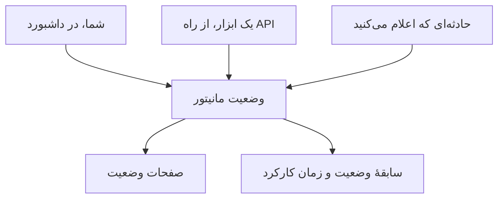

# مانیتور دستی

مانیتور دستی هیچ بررسی خودکاری ندارد: وضعیت آن همان چیزی است که شما در داشبورد یا از راه API تعیین می‌کنید. از آن برای نمایش چیزی در صفحات وضعیت و حوادث خود استفاده کنید که OneUptime خودش نمی‌تواند بررسی کند — یک وابستگی شخص ثالث، یک سامانهٔ فیزیکی، یک فرایند کسب‌وکار.

:::cards
- [ساختن یکی](#ساخت-یک-مانیتور-دستی): یک گام در داشبورد.
- [تغییر وضعیت آن](#بهروزرسانی-وضعیت): در داشبورد، یا از ابزارهای خودتان از راه API.
- [حوادث و هشدارها](#حوادث-و-هشدارها): در یک گام حادثه اعلام کنید و وضعیت را تعیین کنید.
:::

## چه زمانی از مانیتور دستی استفاده کنیم

| مورد استفاده | توضیح |
| --- | --- |
| سرویس‌های شخص ثالث | وضعیت سرویس‌های بیرونی را که به آن‌ها وابسته‌اید اما نمی‌توانید مستقیماً پایش کنید دنبال کنید. |
| زیرساخت فیزیکی | سخت‌افزار یا سامانه‌های فیزیکی بدون پایش شبکه را نمایش دهید. |
| فرایندهای کسب‌وکار | فرایندهای غیرفنی را که بر وضعیت سرویس اثر می‌گذارند دنبال کنید. |
| وضعیت مبتنی بر API | بگذارید ابزارهای خودتان وضعیت را از راه API مربوط به OneUptime تعیین کنند. |
| جای‌نگهدارهای صفحهٔ وضعیت | مؤلفه‌هایی را در صفحهٔ وضعیت خود نشان دهید که بیرون از OneUptime مدیریت می‌شوند. |

ارائه‌دهنده‌ای که صفحهٔ وضعیت منتشر می‌کند به آن نیازی ندارد: یک [مانیتور صفحه وضعیت خارجی](/docs/monitor/external-status-page-monitor) آن صفحه را برای شما دنبال می‌کند.

## چگونه کار می‌کند

مانیتور دستی هیچ بازهٔ پایش، پراب یا معیاری ندارد. وضعیت آن همان‌طور که تعیین کرده‌اید می‌ماند تا وقتی شما، ابزاری که از API استفاده می‌کند، یا حادثه‌ای که اعلام می‌کنید آن را تغییر دهد — و وضعیت تازه هر جا که مانیتور نشان داده می‌شود دیده می‌شود.



هر تغییر یک مدخل در **خط زمانی وضعیت** مانیتور است، پس زمان کارکرد و سابقهٔ وضعیت آن مانند هر مانیتور دیگری نگه‌داری می‌شود. مانیتور دستی یک مانیتور فعال نیست، پس در OneUptime Cloud چیزی به صورت‌حساب شما اضافه نمی‌کند.

## ساخت یک مانیتور دستی

:::steps
### شروع یک مانیتور تازه

به **مانیتورها** بروید و روی **ساخت مانیتور** کلیک کنید.

### انتخاب Manual

در **نوع مانیتور** روی **انواع دیگر مانیتور** کلیک کنید و زیر **سایر** گزینهٔ **Manual** را انتخاب کنید.

### نام‌گذاری و ساخت

یک **نام** وارد کنید — و اگر خواستید، زیر **فیلدهای بیشتر** یک **توضیحات** — و سپس روی **ساخت مانیتور** کلیک کنید. مانیتور دستی به چیز دیگری نیاز ندارد، پس از همین گام نخست ساخته می‌شود.
:::

## به‌روزرسانی وضعیت

### در داشبورد

:::steps
1. مانیتور را باز کنید و در منوی کناری آن روی **خط زمانی وضعیت** کلیک کنید.
2. روی **ساخت رویداد وضعیت مانیتور** کلیک کنید.
3. **وضعیت مانیتور** را انتخاب کنید. **شروع در** اکنون است؛ اگر تغییر زودتر رخ داده، زمان زودتری تعیین کنید.
4. روی **ساخت رویداد وضعیت مانیتور** کلیک کنید. وضعیت تازه بی‌درنگ روی مانیتور، و روی هر صفحهٔ وضعیتی که آن را فهرست می‌کند، نشان داده می‌شود.
:::

### از راه API

وضعیت تازه را به‌صورت یک رویداد وضعیت مانیتور بفرستید، با یک [کلید API](/docs/api-reference/api-reference) از پروژهٔ خود در سرآیند `ApiKey`:

```bash
curl -X POST https://oneuptime.com/api/monitor-status-timeline \
  -H "ApiKey: $ONEUPTIME_API_KEY" \
  -H "Content-Type: application/json" \
  -d '{"data": {"monitorId": "<monitor id>", "monitorStatusId": "<monitor status id>"}}'
```

- `monitorId` شناسهٔ مانیتور است: برای کپی کردن آن روی خط **ID** در صفحهٔ آن کلیک کنید.
- `monitorStatusId` وضعیتی است که تعیین می‌شود: در **مانیتورها → تنظیمات → وضعیت مانیتور**، در ردیف آن وضعیت **نمایش شناسه** را انتخاب کنید.
- `startsAt` اختیاری است. اگر حذف شود، تغییر از اکنون آغاز می‌شود.
- در نصب خودمیزبان، درخواست را به‌جای `oneuptime.com` به میزبان خودتان بفرستید.

فرستادن وضعیتی که مانیتور از قبل دارد با `Monitor Status cannot be same as previous status.` رد می‌شود و چیزی ثبت نمی‌کند، پس ابزاری که در هر اجرا گزارش می‌دهد می‌تواند این پاسخ را نادیده بگیرد.

## حوادث و هشدارها

مانیتور دستی هر جا که مانیتورها انتخاب می‌شوند، مثل هر مانیتور دیگری انتخاب می‌شود:

- یک حادثه اعلام کنید و مانیتور را زیر **مانیتورها** انتخاب کنید. با **تغییر وضعیت مانیتور به**، اعلام حادثه وضعیت مانیتور را هم تعیین می‌کند، و حل کردن آن مانیتور را به حالت عملیاتی برمی‌گرداند، مگر اینکه حادثهٔ دیگری روی آن هنوز باز باشد. [اعلام یک حادثه](/docs/incidents/declaring-incidents#گام-۲-resources-affected) را ببینید.
- برای آن یک هشدار بسازید، برای مشکلی که تیم شما باید بدون خبر دادن به مشتریان به آن رسیدگی کند.
- آن را به یک صفحهٔ وضعیت اضافه کنید، تا وابستگی‌ای را که به‌صورت دستی زیر نظر دارید به مشتریان نشان دهید.

## گام‌های بعدی

:::cards
- [ساخت مانیتور](/docs/monitor/create-monitor): نوع‌های مانیتوری که چیزها را برای شما بررسی می‌کنند.
- [مانیتور صفحه وضعیت خارجی](/docs/monitor/external-status-page-monitor): به‌جای آن، صفحهٔ وضعیت یک ارائه‌دهنده را خودکار دنبال کنید.
- [نمای کلی صفحات وضعیت](/docs/status-pages/index): وضعیت مانیتور را به مشتریان خود نشان دهید.
:::
