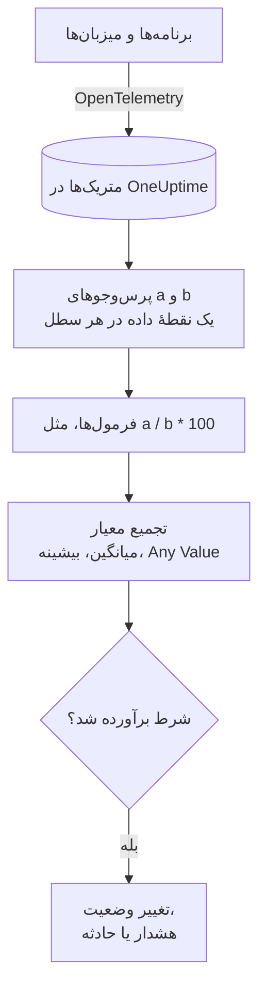

# مانیتور متریک‌ها

مانیتور متریک‌ها متریک‌هایی را که برنامه‌ها و زیرساخت شما به OneUptime می‌فرستند پرس‌وجو می‌کند، وقتی به یک نسبت یا یک جمع نیاز دارید آن‌ها را با فرمول‌ها ترکیب می‌کند و نتیجه را در یک بازه زمانی غلتان با معیارهای شما می‌سنجد. از آن برای نرخ درخواست‌ها، نسبت خطاها، عمق صف‌ها، CPU، حافظه و دیسک (هر سری عددی) استفاده کنید؛ وقتی گروه‌بندی‌اش کنید، برای هر میزبان یا کانتینر یک هشدار می‌گیرید.

:::cards
- [ساخت مانیتور](#ساخت-یک-مانیتور-متریکها): پرس‌وجوها، فرمول‌ها، یک بازه زمانی و معیارها.
- [چگونه ارزیابی می‌شود](#چگونه-ارزیابی-میشود): نقطه‌های داده، فرمول‌ها و تجمیع معیار.
- [مثال کاربردی](#مثال-کاربردی-صفی-که-بزرگ-میشود): همان داده‌ها زیر هر تجمیع.
- [هشدار به تفکیک سری](#هشدار-به-تفکیک-سری-group-by): یک هشدار برای هر میزبان، کانتینر یا نقطهٔ اتصال.
:::

## چگونه کار می‌کند

هر دقیقه، OneUptime هر یک از پرس‌وجوهای متریک مانیتور را روی بازه زمانی آن اجرا می‌کند. هر پرس‌وجو برای هر سطل زمانی یک نقطهٔ داده برمی‌گرداند و فرمول‌ها پرس‌وجوها را سطل به سطل ترکیب می‌کنند. سپس هر معیار نقطه‌های دادهٔ پرس‌وجو یا فرمولی را که بررسی می‌کند به یک نتیجه کاهش می‌دهد (میانگین آن‌ها، بیشینهٔ آن‌ها یا آزمودن تک‌تک نقطه‌ها) و نتیجه را با آستانهٔ خود مقایسه می‌کند.

## پیش از شروع

- برنامه‌ها یا زیرساخت شما متریک‌ها را از طریق OpenTelemetry به OneUptime می‌فرستند. [OpenTelemetry](/docs/telemetry/open-telemetry) را ببینید.
- نام متریک و ویژگی‌هایی را که می‌خواهید بر اساس آن‌ها فیلتر یا گروه‌بندی کنید بدانید. فهرست‌های **متریک** و **Group by** فقط نام‌ها و ویژگی‌هایی را پیشنهاد می‌کنند که OneUptime دریافت کرده است.

## ساخت یک مانیتور متریک‌ها

:::steps
### شروع یک مانیتور تازه

به **مانیتورها** بروید و روی **ساخت مانیتور** کلیک کنید.

### انتخاب نوع متریک‌ها

در **نوع مانیتور**، روی **انواع دیگر مانیتور** کلیک کنید و **متریک‌ها** را زیر **تله‌متری** انتخاب کنید، یا در کادر جستجو `metrics` را تایپ کنید. یک **نام** وارد کنید و روی **بعدی** کلیک کنید.

### انتخاب بازه زمانی

در **پیکربندی مانیتور متریک**، یک **بازه زمانی** انتخاب کنید: اینکه هر ارزیابی تا چه اندازه به عقب نگاه می‌کند. مقدار آغازین آن **Past 1 Minute** است.

### افزودن پرس‌وجوهای متریک

زیر **انتخاب متریک‌ها**، یک **متریک** و شیوهٔ تجمیع آن را در **Aggregate by** انتخاب کنید. برای فیلتر بر اساس ویژگی‌ها یا گروه‌بندی با **Group by**، بخش **Filters & grouping** را باز کنید. برای پرس‌وجوی دیگر روی **افزودن متریک** و برای ترکیب آن‌ها روی **افزودن فرمول** کلیک کنید. نمودار زیر پرس‌وجوها پیش‌نمایشی از بازه زمانی نشان می‌دهد تا مقادیری را که معیارها بررسی خواهند کرد ببینید.

### تعیین معیارها

در **معیارهای مانیتور**، هر معیار **متریک** مورد بررسی (یک پرس‌وجو یا یک فرمول)، **تجمیع** آن، یک **شرط** و یک **Threshold** را انتخاب می‌کند. برای معیارهایی که مانیتور تازه با آن‌ها شروع می‌شود، [معیارها](#معیارها) را ببینید.

### ساخت مانیتور

روی **ساخت مانیتور** کلیک کنید. مانیتور در صفحهٔ **نمای کلی** خود باز می‌شود و نخستین ارزیابی آن ظرف یک دقیقه اجرا می‌شود.
:::

## چه چیزی را پرس‌وجو می‌کند

### پرس‌وجوهای متریک

| فیلد | چه می‌کند | پیش‌فرض |
| --- | --- | --- |
| **متریک** | متریکی که پرس‌وجو می‌شود. | الزامی |
| **Aggregate by** | اینکه مقادیر هر سطل زمانی چگونه در یک نقطهٔ داده ترکیب شوند: میانگین، جمع، Min، Max، تعداد، یا یک صدک (P50، P75، P90، P95 یا P99). | میانگین |
| **Filter by attributes** (زیر **Filters & grouping**) | فقط سری‌هایی که ویژگی‌هایشان با این شرط‌ها منطبق است. | بدون فیلتر |
| **Group by** (زیر **Filters & grouping**) | یک سری برای هر مقدار یکتای این ویژگی‌ها ([هشدار به تفکیک سری](#هشدار-به-تفکیک-سری-group-by) را ببینید). | یک سری |

هر پرس‌وجو و فرمول، به ترتیبی که اضافه‌شان می‌کنید، یک متغیر می‌گیرد: `a`، `b`، `c` و غیره.

### فرمول‌ها

فرمول متغیرهای پرس‌وجو را با `+`، `-`، `*`، `/`، `%`، `^` و پرانتز، سطل به سطل ترکیب می‌کند. می‌توانید متغیرها را با `$` در ابتدایشان یا بدون آن بنویسید:

- `a / b * 100`: سهم `a` از `b`، به‌صورت درصد
- `a + b`: مجموع دو متریک
- `a - b`: تفاوت میان آن دو

### پنجره زمانی غلتان

**بازه زمانی** تعیین می‌کند هر ارزیابی تا چه اندازه به عقب نگاه کند: **Past 1 Minute**، **Past 5 Minutes**، **Past 10 Minutes**، **Past 15 Minutes**، **Past 30 Minutes**، **Past 1 Hour**، **Past 2 Hours**، **Past 3 Hours**، **Past 6 Hours**، **Past 12 Hours**، **Past 1 Day**، **Past 2 Days**، **Past 3 Days**، **Past 7 Days**، **Past 14 Days**، **Past 30 Days**، **Past 60 Days**، **Past 90 Days**، **Past 180 Days** یا **Past 365 Days**.

هرچه بازه بلندتر باشد، هر سطل زمانی پهن‌تر است، پس هر نقطهٔ داده نمایندهٔ زمان بیشتری است:

| بازه زمانی | یک نقطهٔ داده برای هر |
| --- | --- |
| Past 1 Minute تا Past 3 Hours | دقیقه |
| Past 6 Hours، Past 12 Hours | ۵ دقیقه |
| Past 1 Day | ۱۵ دقیقه |
| Past 2 Days، Past 3 Days | ۳۰ دقیقه |
| Past 7 Days | ساعت |
| Past 14 Days، Past 30 Days | روز |
| Past 60 Days تا Past 180 Days | هفته |
| Past 365 Days | ماه |

## چگونه ارزیابی می‌شود

- **هر دقیقه.** مانیتور متریک‌ها را پراب‌ها بررسی نمی‌کنند، پس بازه‌ای برای تنظیم ندارد و صفحهٔ **پراب‌ها و بازه** هم ندارد.
- **اول پرس‌وجوها، سپس فرمول‌ها.** هر پرس‌وجو با **Aggregate by** خود برای هر سطل زمانیِ بازه زمانی یک نقطهٔ داده برمی‌گرداند. فرمول‌ها برای هر سطل از نقطه‌های دادهٔ پرس‌وجوها محاسبه می‌شوند.
- **سپس تجمیعِ معیار.** هر معیار نقطه‌های دادهٔ **متریک** خود را به چیزی کاهش می‌دهد که با آستانه مقایسه می‌کند:

| تجمیع | شرط با این سنجیده می‌شود… |
| --- | --- |
| میانگین | میانگین نقطه‌های داده |
| جمع | جمع نقطه‌های داده |
| Maximum Value | بالاترین نقطهٔ داده |
| Minimum Value | پایین‌ترین نقطهٔ داده |
| All Values | تک‌تک نقطه‌های داده: همه باید شرط را برآورده کنند |
| Any Value | تک‌تک نقطه‌های داده: برآورده شدن شرط با یکی از آن‌ها کافی است |

- **معیارها از بالا به پایین.** در مانیتور بدون Group By، نخستین معیاری که منطبق شود تصمیم می‌گیرد، پس شدیدترین را اول بگذارید. مانیتور گروه‌بندی‌شده هر معیار را برای هر سری بررسی می‌کند ([ارزیابی معیارها فرق می‌کند](#ارزیابی-معیارها-فرق-میکند) را ببینید).
- **نبود داده صفر نیست.** وقتی پرس‌وجو در بازه زمانی هیچ نقطهٔ داده‌ای برنگرداند، معیار همان کاری را می‌کند که تنظیم **اگر داده‌ای نبود** آن، زیر **فیلدهای بیشتر**، می‌گوید: **Ignore** (پیش‌فرض: معیار منطبق نمی‌شود)، **Treat As Zero** یا **تریگر**.
- **قطعی خود OneUptime سکوت نیست.** تا وقتی بازه زمانی شامل زمانی است که خود OneUptime داده دریافت نمی‌کرد (در حال راه‌اندازی دوباره، ارتقا یا جبران عقب‌ماندگی بود)، بررسی صبر می‌کند: هر چه **اگر داده‌ای نبود** بگوید، وضعیت تغییر نمی‌کند و هیچ حادثه یا هشداری باز یا رفع نمی‌شود. [وقتی OneUptime داده دریافت نمی‌کند](/docs/monitor/when-oneuptime-is-not-receiving) را ببینید.

## معیارها

این مانیتورها همیشه **Metric Value** را ارزیابی می‌کنند: مقدار تجمیع‌شدهٔ پرس‌وجو یا فرمول متریکِ پیکربندی‌شده. فرم معیار انتخابگر نوع فیلتر ندارد؛ **متریک**، **تجمیع**، **شرط** و **Threshold** را نشان می‌دهد. وقتی متریک واحد دارد، واحد آستانه را کنار آن انتخاب کنید.

| شرط | منطبق است وقتی مقدار… |
| --- | --- |
| **Greater Than** | بیشتر از آستانه باشد |
| **Greater Than Or Equal To** | برابر آستانه یا بیشتر از آن باشد |
| **Less Than** | کمتر از آستانه باشد |
| **Less Than Or Equal To** | برابر آستانه یا کمتر از آن باشد |
| **Equal To** | دقیقاً برابر آستانه باشد |
| **Anomalously High** | بالاتر از بازهٔ مورد انتظار برای این ساعت از هفته باشد |
| **Anomalously Low** | پایین‌تر از آن بازه باشد |
| **Anomalous** | در هر جهت بیرون از آن بازه باشد |

شرط‌های ناهنجاری آستانه ندارند. به‌جای آن، فرم **حساسیت** (Low، Medium که پیش‌فرض است، یا High) و **پنجره مبنا** (۱۴ روز که پیش‌فرض است، ۲۸، ۶۰ یا ۹۰) را نشان می‌دهد و هر نقطهٔ داده را با مبنای همان ساعت از هفته که از آن پنجره ساخته شده مقایسه می‌کند. تا وقتی آن ساعت از هفته تاریخچهٔ کافی نداشته باشد، معیار هنوز در حال یادگیری است و هیچ هشداری نمی‌سازد.

مانیتور متریک‌های تازه با دو معیار روی نخستین پرس‌وجوی خود شروع می‌شود که هر دو تجمیع **Any Value** دارند:

| معیار | شرط | اثر |
| --- | --- | --- |
| Check if … is offline | **Equal To** `0` | مانیتور را آفلاین علامت می‌زند و حادثه‌ای اعلام می‌کند که خودکار رفع می‌شود |
| Check if … is online | **Greater Than** `0` | مانیتور را آنلاین علامت می‌زند |

> [!NOTE]
> معیار آفلاین با مقدار گزارش‌شدهٔ ۰ فعال می‌شود، نه با سکوت. برای هشدار وقتی متریکی دیگر نمی‌رسد، **اگر داده‌ای نبود** آن را روی **تریگر** بگذارید.

## مثال کاربردی: صفی که بزرگ می‌شود

می‌خواهید وقتی صف checkout عمیق می‌ماند، حادثه‌ای اعلام شود. پرس‌وجوی `a` گیج `checkout.queue.depth` است با **Aggregate by** روی Max، و **بازه زمانی** روی **Past 5 Minutes** است. یک ارزیابی این پنج نقطهٔ دادهٔ یک‌دقیقه‌ای را می‌بیند:

| دقیقه | ۱۰:۰۱ | ۱۰:۰۲ | ۱۰:۰۳ | ۱۰:۰۴ | ۱۰:۰۵ |
| --- | --- | --- | --- | --- | --- |
| `a` | ۶۴۰ | ۹۸۰ | ۱٬۵۰۰ | ۱٬۶۲۰ | ۱٬۱۰۰ |

معیاری با **متریک** `a`، **شرط** **Greater Than** و **Threshold** `1000` برای هر **تجمیع** پاسخ متفاوتی می‌دهد:

| تجمیع | مقایسه با ۱٬۰۰۰ | منطبق است؟ |
| --- | --- | --- |
| میانگین | ۱٬۱۶۸ | بله |
| جمع | ۵٬۸۴۰ | بله |
| Maximum Value | ۱٬۶۲۰ | بله |
| Minimum Value | ۶۴۰ | نه |
| All Values | ۶۴۰، ۹۸۰، ۱٬۵۰۰، ۱٬۶۲۰، ۱٬۱۰۰ | نه: دو نقطه بالای ۱٬۰۰۰ نیستند |
| Any Value | ۶۴۰، ۹۸۰، ۱٬۵۰۰، ۱٬۶۲۰، ۱٬۱۰۰ | بله: ۱٬۵۰۰ هست |

**میانگین** روی صف انباشتهٔ پایدار هشدار می‌دهد و یک دقیقهٔ عمیقِ تنها را نادیده می‌گیرد؛ **All Values** صبر می‌کند تا همهٔ دقیقه‌های بازه عمیق شوند؛ **Any Value** با نخستین دقیقهٔ عمیق هشدار می‌دهد.

## هشدار به تفکیک سری (Group By)

**Group by** روی یک پرس‌وجوی متریک، آن پرس‌وجو را به یک سری برای هر مقدار یکتای ویژگی تقسیم می‌کند (یکی برای هر میزبان، یکی برای هر کانتینر، یکی برای هر نقطهٔ اتصال)، و مانیتوری که Group By دارد هر سری را مستقل ارزیابی می‌کند. همین یک تنظیم فرق میان «ناوگان سالم نیست» و «`prod-db-01` سالم نیست» است.

### یک هشدار برای هر گروه

با Group By روی `host.name`، مانیتور مصرف دیسکی که پنجاه میزبان را زیر نظر دارد **برای هر میزبانی که از آستانه بگذرد یک هشدار (یا حادثه)** می‌سازد. پر شدن میزبان A هشدار خودش را باز می‌کند؛ پر شدن میزبان B ده دقیقه بعد، هشدار دوم و جداگانه‌ای در کنار آن باز می‌کند.

بدون Group By، همین مانیتور یک عدد واحد است: پرس‌وجو همهٔ میزبان‌ها را در یک عدد خلاصه می‌کند و مانیتور **یک هشدار برای کل مانیتور** می‌سازد. تا وقتی آن هشدار باز است، عبور میزبان دوم از آستانه چیزی پدید نمی‌آورد (مانیتور از قبل در حال هشدار است، پس چیز تازه‌ای برای اعلام نیست) و مهندس کشیک هرگز از میزبان B باخبر نمی‌شود. **تنظیم Group By راهِ گرفتن هشدار برای هر میزبان است.** اگر می‌خواهید برای هر میزبان، هر کانتینر یا هر نقطهٔ اتصال خبر شوید، آن را تنظیم کنید.

### رفع مستقل

هشدار هر گروه، گروه خودش را دنبال می‌کند. وقتی میزبان A دوباره به زیر آستانه برمی‌گردد، هشدارش خودبه‌خود رفع می‌شود و هشدار میزبان B تا بهبود میزبان B باز می‌ماند. بهبود یک گروه هرگز هشدار گروه دیگری را نمی‌بندد.

### ارزیابی معیارها فرق می‌کند

- **مانیتورهای گروه‌بندی‌شده همهٔ معیارها را ارزیابی می‌کنند.** بنابراین سطح‌های شدت می‌توانند هم‌زمان روی گروه‌های مختلف فعال شوند: با «Critical: بیشتر از ۹۵» بالای «Warning: بیشتر از ۸۰»، در یک بررسی میزبانی با ۹۶٪ هشدار Critical و میزبانی با ۸۵٪ هشدار Warning باز می‌کند. میزبانی که از هر دو سطح بگذرد باز هم دقیقاً یک هشدار می‌گیرد، از نخستین معیار منطبق، پس **معیارها را از شدیدترین به خفیف‌ترین مرتب کنید**.
- **مانیتورهای گروه‌بندی‌نشده در نخستین معیار منطبق می‌ایستند.** فقط همان یک معیار فعال می‌شود، و این دلیل دیگری است که معیار هشدار را بالای معیار سالم بگذارید: معیار سالمِ گسترده‌ای که اول قرار گیرد تقریباً در هر بررسی منطبق می‌شود و نمی‌گذارد معیار هشدارِ زیر آن هرگز ارزیابی شود.

| میزبان | دیسک مصرف‌شده | Critical (> 95) | Warning (> 80) | هشدار ایجادشده |
| --- | --- | --- | --- | --- |
| `prod-db-01` | ۹۶٪ | بله | بله | Critical |
| `prod-db-02` | ۸۵٪ | نه | بله | Warning |
| `prod-db-03` | ۴۰٪ | نه | نه | هیچ |

### انتخاب ویژگی برای گروه‌بندی

بر اساس ویژگی‌ای گروه‌بندی کنید که واقعاً چیز متمایزی را مشخص می‌کند که برای آن کسی را خبر می‌کنید: ویژگی میزبان برای متریک میزبانِ سراسر ناوگان، ویژگی کانتینر یا پاد برای متریک کانتینر، ویژگی نقطهٔ اتصال یا دستگاه برای متریک فایل‌سیستم یا I/O دیسک، و ویژگی اینترفیس برای متریک شبکه. فهرست کشویی **Group by** از ویژگی‌هایی پر می‌شود که کلکتور شما واقعاً می‌فرستد، پس به‌جای تایپ دستی کلید، از فهرست انتخاب کنید.

متریکی را که از قبل یک عدد واحد برای کل سیستم است گروه‌بندی نکنید (پرچم رهبر در سطح کل کلاستر، صف انباشتهٔ زمان‌بند، یا CPU یک میزبان در مانیتوری با یک میزبان). گروه‌بندی چنین متریک‌هایی دقیقاً یک سری می‌سازد و جز عنوان هشدارها چیزی را تغییر نمی‌دهد.

مقادیر ویژگی گروه‌بندی همچنین به‌صورت [متغیرهای قالب](/docs/monitor/incident-alert-templating) در عنوان، توضیحات و یادداشت‌های رفع مشکل هشدار یا حادثه در دسترس‌اند: گروه‌بندی بر اساس `host.name` باعث می‌شود عنوان `Disk almost full on {{host.name}}` باشد.

## رفع اشکال

:::details نمودار عبور از آستانه را نشان می‌دهد، اما مانیتور هشدار نداد
اول **تجمیع** معیار را بررسی کنید: **All Values** فقط وقتی منطبق می‌شود که همهٔ نقطه‌های داده در بازه زمانی از آستانه بگذرند، و **میانگین** یک جهش کوتاه را هموار می‌کند. سپس بررسی کنید که **متریک** معیار همان پرس‌وجو یا فرمولی باشد که منظورتان است (`a` همان فرمول `c` نیست) و آستانه در همان واحدی باشد که فکر می‌کنید.
:::

:::details متریک دیگر نرسید و هیچ اتفاقی نیفتاد
بازه زمانی‌ای که هیچ نقطهٔ داده‌ای ندارد مقدار ۰ نیست. وقتی **اگر داده‌ای نبود** روی پیش‌فرض خود، **Ignore**، است، معیار منطبق نمی‌شود. برای هشدار روی سکوت، آن را زیر **فیلدهای بیشتر** معیار روی **تریگر** بگذارید.
:::

:::details برای کل ناوگان یک هشدار می‌گیرم
پرس‌وجو **Group by** ندارد، پس همهٔ میزبان‌ها در یک عدد خلاصه می‌شوند. پرس‌وجو را بر اساس ویژگی میزبان، کانتینر یا نقطهٔ اتصال گروه‌بندی کنید ([هشدار به تفکیک سری](#هشدار-به-تفکیک-سری-group-by) را ببینید).
:::

:::details معیار ناهنجاری هرگز فعال نمی‌شود
هنوز در حال یادگیری است: ساعتی از هفته که با آن مقایسه می‌کند هنوز در **پنجره مبنا** تاریخچهٔ کافی ندارد.
:::

## گام‌های بعدی

:::cards
- [قالب‌بندی حادثه و هشدار](/docs/monitor/incident-alert-templating): میزبان و مقدار را در عنوان هشدارها بگذارید.
- [مانیتور لاگ‌ها](/docs/monitor/logs-monitor): روی حجم و محتوای لاگ، به تفکیک گروه، هشدار بگیرید.
- [مانیتور میزبان](/docs/monitor/host-monitor): بررسی‌های آمادهٔ CPU، حافظه و دیسک برای میزبان‌های شما.
- [OpenTelemetry](/docs/telemetry/open-telemetry): متریک‌ها را به OneUptime بفرستید.
:::
