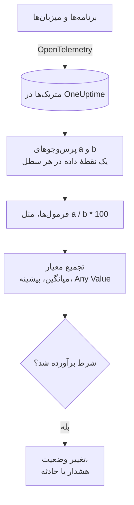

# مانیتور متریک‌ها

مانیتور متریک‌ها متریک‌هایی را که برنامه‌ها و زیرساخت شما به OneUptime می‌فرستند پرس‌وجو می‌کند، وقتی به یک نسبت یا یک جمع نیاز دارید آن‌ها را با فرمول‌ها ترکیب می‌کند و نتیجه را در یک بازه زمانی غلتان با معیارهای شما می‌سنجد. از آن برای نرخ درخواست‌ها، نسبت خطاها، عمق صف‌ها، CPU، حافظه و دیسک (هر سری عددی) استفاده کنید؛ وقتی گروه‌بندی‌اش کنید، برای هر میزبان یا کانتینر یک هشدار می‌گیرید.

:::cards
- [ساخت مانیتور](#ساخت-یک-مانیتور-متریکها): پرس‌وجوها، فرمول‌ها، یک بازه زمانی و معیارها.
- [چگونه ارزیابی می‌شود](#چگونه-ارزیابی-میشود): نقطه‌های داده، فرمول‌ها و تجمیع معیار.
- [مثال کاربردی](#مثال-کاربردی-صفی-که-بزرگ-میشود): همان داده‌ها زیر هر تجمیع.
- [هشدار به تفکیک سری](#هشدار-به-تفکیک-سری-group-by): یک هشدار برای هر میزبان، کانتینر یا نقطهٔ اتصال.
:::

## چگونه کار می‌کند

```mermaid title="از پرس‌وجوهای متریک تا یک وضعیت، هر دقیقه"
flowchart TB
    Src["برنامه‌ها و میزبان‌ها"] -->|OpenTelemetry| Store[("متریک‌ها در OneUptime")]
    Store --> Query["پرس‌وجوهای a و b<br/>یک نقطهٔ داده در هر سطل"]
    Query --> Formula["فرمول‌ها، مثل a / b * 100"]
    Formula --> Reduce["تجمیع معیار<br/>میانگین، بیشینه، Any Value"]
    Reduce --> Check{"شرط برآورده شد؟"}
    Check -->|"بله"| Act["تغییر وضعیت،<br/>هشدار یا حادثه"]
```

هر دقیقه، OneUptime هر یک از پرس‌وجوهای متریک مانیتور را روی بازه زمانی آن اجرا می‌کند. هر پرس‌وجو برای هر سطل زمانی یک نقطهٔ داده برمی‌گرداند و فرمول‌ها پرس‌وجوها را سطل به سطل ترکیب می‌کنند. سپس هر معیار نقطه‌های دادهٔ پرس‌وجو یا فرمولی را که بررسی می‌کند به یک نتیجه کاهش می‌دهد (میانگین آن‌ها، بیشینهٔ آن‌ها یا آزمودن تک‌تک نقطه‌ها) و نتیجه را با آستانهٔ خود مقایسه می‌کند.

## پیش از شروع

- برنامه‌ها یا زیرساخت شما متریک‌ها را از طریق OpenTelemetry به OneUptime می‌فرستند. [OpenTelemetry](/docs/telemetry/open-telemetry) را ببینید.
- نام متریک و ویژگی‌هایی را که می‌خواهید بر اساس آن‌ها فیلتر یا گروه‌بندی کنید بدانید. فهرست‌های **متریک** و **گروه‌بندی بر اساس** فقط نام‌ها و ویژگی‌هایی را پیشنهاد می‌کنند که OneUptime دریافت کرده است.

## ساخت یک مانیتور متریک‌ها

:::steps
### شروع یک مانیتور تازه

به **مانیتورها** بروید و روی **ساخت مانیتور** کلیک کنید. یا در کاوشگر متریک‌ها، نموداری را که می‌خواهید پایش کنید بسازید و روی **ساخت مانیتور از این نما** کلیک کنید: مانیتور تازه با پرس‌وجوهای آن شروع می‌شود.

### انتخاب نوع متریک‌ها

در **نوع مانیتور**، روی **انواع دیگر مانیتور** کلیک کنید و **متریک‌ها** را زیر **تله‌متری** انتخاب کنید، یا در کادر جستجو `metrics` را تایپ کنید. یک **نام** وارد کنید و روی **بعدی** کلیک کنید.

### افزودن پرس‌وجوهای متریک

در **متریک مورد پایش**، یک **متریک** و شیوهٔ تجمیع آن را در **Aggregate by** انتخاب کنید. برای فیلتر بر اساس ویژگی‌ها یا گروه‌بندی با **گروه‌بندی بر اساس**، بخش **Filters & grouping** را باز کنید. برای پرس‌وجوی دیگر روی **افزودن متریک** و برای ترکیب آن‌ها روی **افزودن فرمول** کلیک کنید. نمودار زیر پرس‌وجوها چند ساعت گذشته را نشان می‌دهد و مقدار قاعده را به‌صورت یک خط قرمز می‌کشد تا مقادیری را که قاعده بررسی خواهد کرد ببینید.

### تعیین اینکه چه وقت هشدار داده شود

در **چه وقت هشدار داده شود**، **نحوهٔ سنجش** متریک، یک **بازه زمانی**، یک **شرط** و یک **مقدار** انتخاب کنید. وقتی گام بیش از یک پرس‌وجو یا فرمول دارد، **متریک** که قاعده می‌خواند را هم انتخاب کنید. جملهٔ زیر آن‌ها قاعده را با زبانی ساده بازگو می‌کند.

### انتخاب اینکه چه اتفاقی می‌افتد

در **چه اتفاقی می‌افتد**، یکی از **ساخت هشدار**، **اعلام حادثه** یا **هر دو** را انتخاب کنید و به آن عنوان و شدت بدهید. تا وقتی قاعده منطبق است، مانیتور وضعیتی را که زیر **فیلدهای بیشتر** آمده نشان می‌دهد؛ وقتی دیگر منطبق نباشد، مانیتور به وضعیت پیش‌فرض خود برمی‌گردد و هشدار یا حادثه خودبه‌خود رفع می‌شود.

### ساخت مانیتور

روی **ساخت مانیتور** کلیک کنید. مانیتور در صفحهٔ **نمای کلی** خود باز می‌شود و نخستین ارزیابی آن ظرف یک دقیقه اجرا می‌شود.
:::

## چه چیزی را پرس‌وجو می‌کند

### پرس‌وجوهای متریک

| فیلد | چه می‌کند | پیش‌فرض |
| --- | --- | --- |
| **متریک** | متریکی که پرس‌وجو می‌شود. | الزامی |
| **Aggregate by** | اینکه مقادیر هر سطل زمانی چگونه در یک نقطهٔ داده ترکیب شوند: میانگین، جمع، Min، Max، تعداد، یا یک صدک (P50، P75، P90، P95 یا P99). | میانگین |
| **Filter by attributes** (زیر **Filters & grouping**) | فقط سری‌هایی که ویژگی‌هایشان با این شرط‌ها منطبق است. | بدون فیلتر |
| **گروه‌بندی بر اساس** (زیر **Filters & grouping**) | یک سری برای هر مقدار یکتای این ویژگی‌ها ([هشدار به تفکیک سری](#هشدار-به-تفکیک-سری-group-by) را ببینید). | یک سری |

هر پرس‌وجو و فرمول، به ترتیبی که اضافه‌شان می‌کنید، یک متغیر می‌گیرد: `a`، `b`، `c` و غیره.

### فرمول‌ها

فرمول متغیرهای پرس‌وجو را با `+`، `-`، `*`، `/`، `%`، `^` و پرانتز، سطل به سطل ترکیب می‌کند. می‌توانید متغیرها را با `$` در ابتدایشان یا بدون آن بنویسید:

- `a / b * 100`: سهم `a` از `b`، به‌صورت درصد
- `a + b`: مجموع دو متریک
- `a - b`: تفاوت میان آن دو

### پنجره زمانی غلتان

**بازه زمانی** در **چه وقت هشدار داده شود** تعیین می‌کند هر ارزیابی تا چه اندازه به عقب نگاه کند: **۱ دقیقه گذشته**، **۵ دقیقه گذشته**، **۱۰ دقیقه گذشته**، **۱۵ دقیقه گذشته**، **۳۰ دقیقه گذشته**، **۱ ساعت گذشته**، **۲ ساعت گذشته**، **۳ ساعت گذشته**، **۶ ساعت گذشته**، **۱۲ ساعت گذشته**، **۲۴ ساعت گذشته**، **۲ روز گذشته**، **۳ روز گذشته**، **۷ روز گذشته**، **۱۴ روز گذشته**، **۳۰ روز گذشته**، **۶۰ روز گذشته**، **۹۰ روز گذشته**، **۱۸۰ روز گذشته** یا **۳۶۵ روز گذشته**.

هرچه بازه بلندتر باشد، هر سطل زمانی پهن‌تر است، پس هر نقطهٔ داده نمایندهٔ زمان بیشتری است:

| بازه زمانی | یک نقطهٔ داده برای هر |
| --- | --- |
| ۱ دقیقه گذشته تا ۳ ساعت گذشته | دقیقه |
| ۶ ساعت گذشته، ۱۲ ساعت گذشته | ۵ دقیقه |
| ۲۴ ساعت گذشته | ۱۵ دقیقه |
| ۲ روز گذشته، ۳ روز گذشته | ۳۰ دقیقه |
| ۷ روز گذشته | ساعت |
| ۱۴ روز گذشته، ۳۰ روز گذشته | روز |
| ۶۰ روز گذشته تا ۱۸۰ روز گذشته | هفته |
| ۳۶۵ روز گذشته | ماه |

## چگونه ارزیابی می‌شود

- **هر دقیقه.** مانیتور متریک‌ها را پراب‌ها بررسی نمی‌کنند، پس بازه‌ای برای تنظیم ندارد و صفحهٔ **پراب‌ها و بازه** هم ندارد.
- **اول پرس‌وجوها، سپس فرمول‌ها.** هر پرس‌وجو با **Aggregate by** خود برای هر سطل زمانیِ بازه زمانی یک نقطهٔ داده برمی‌گرداند. فرمول‌ها برای هر سطل از نقطه‌های دادهٔ پرس‌وجوها محاسبه می‌شوند.
- **سپس سنجهٔ قاعده.** قاعده نقطه‌های دادهٔ متریک خود را، همان‌طور که **نحوهٔ سنجش** می‌گوید، به چیزی کاهش می‌دهد که با مقدارش مقایسه می‌کند:

| نحوهٔ سنجش | در معیارهای سفارشی | شرط با این سنجیده می‌شود… |
| --- | --- | --- |
| میانگین | میانگین | میانگین نقطه‌های داده |
| مجموع | جمع | جمع نقطه‌های داده |
| بیشترین مقدار | Maximum Value | بالاترین نقطهٔ داده |
| کمترین مقدار | Minimum Value | پایین‌ترین نقطهٔ داده |
| همهٔ مقادیر (کل بازه) | All Values | تک‌تک نقطه‌های داده: همه باید شرط را برآورده کنند و کل بازه زمانی را پوشش دهند |
| هر مقداری (در هر لحظه) | Any Value | تک‌تک نقطه‌های داده: برآورده شدن شرط با یکی از آن‌ها کافی است |

- **معیارها از بالا به پایین.** در مانیتور بدون Group By، نخستین معیاری که منطبق شود تصمیم می‌گیرد، پس شدیدترین را اول بگذارید. مانیتور گروه‌بندی‌شده هر معیار را برای هر سری بررسی می‌کند ([ارزیابی معیارها فرق می‌کند](#ارزیابی-معیارها-فرق-میکند) را ببینید).
- **نبود داده صفر نیست.** وقتی پرس‌وجو در بازه زمانی هیچ نقطهٔ داده‌ای برنگرداند، قاعده همان کاری را می‌کند که **اگر داده‌ای نباشد**، زیر **فیلدهای بیشتر** در **چه وقت هشدار داده شود**، می‌گوید: **هیچ** (پیش‌فرض: قاعده منطبق نمی‌شود)، **صفر حساب شود** یا **هشدار، گویی منطبق بوده است**.
- **همهٔ مقادیر به کل بازه زمانی نیاز دارد.** یک سری فقط وقتی قاعده‌ای را که با **همهٔ مقادیر (کل بازه)** سنجیده می‌شود برآورده می‌کند که نقطه‌های داده‌اش بازه زمانی را از آغاز آن تا اکنون پوشش دهند، بدون فاصله‌ای بیش از یک نقطهٔ دادهٔ جاافتاده. وقتی همهٔ داده‌های مانیتور با تأخیر می‌رسند، مانند داده‌های CloudWatch، جدیدترین نقطهٔ داده‌اش جای اکنون را می‌گیرد. میزبان، کانتینر یا deployment که تازه فرستادن داده را آغاز کرده یا مدتی ساکت بوده، صبر می‌کند تا برای یک بازه زمانی کامل داده داشته باشد، و گزارش ارزیابی نشان می‌دهد تا کجا پیش رفته است: `Waiting for 15 minutes of data: 2 of 15 minutes so far`. سری‌ای که هشدار یا حادثه‌اش از قبل باز است فقط بر پایهٔ نقطه‌های داده‌اش سنجیده می‌شود، پس یک فاصلهٔ کوتاه در داده‌هایش آن را رفع نمی‌کند. اگر فاصلهٔ گزارش‌دهی متریک از طول بازه زمانی بیشتر باشد، یک نقطهٔ دادهٔ تنها وقتی چند دقیقه از آن بگذرد برای کل بازه حساب می‌شود؛ برای سنجیدن اینکه یک مقدار چقدر دوام دارد، بازه زمانی را دست‌کم به اندازهٔ دو فاصلهٔ گزارش‌دهی بگیرید.
- **قطعی خود OneUptime سکوت نیست.** تا وقتی بازه زمانی شامل زمانی است که خود OneUptime داده دریافت نمی‌کرد (در حال راه‌اندازی دوباره، ارتقا یا جبران عقب‌ماندگی بود)، بررسی صبر می‌کند: هر چه **اگر داده‌ای نباشد** بگوید، وضعیت تغییر نمی‌کند و هیچ حادثه یا هشداری باز یا رفع نمی‌شود. [وقتی OneUptime داده دریافت نمی‌کند](/docs/monitor/when-oneuptime-is-not-receiving) را ببینید.

## معیارها

این مانیتورها همیشه **Metric Value** را ارزیابی می‌کنند: مقدار تجمیع‌شدهٔ پرس‌وجو یا فرمول متریکِ پیکربندی‌شده. **چه وقت هشدار داده شود** از **نحوهٔ سنجش**، **بازه زمانی**، **شرط** و **مقدار** یک معیار تنظیم می‌کند. وقتی متریک واحد دارد، واحد مقدار را کنار آن انتخاب کنید. **شرط** آن یکی از **بالاتر از**، **برابر یا بالاتر از**، **پایین‌تر از**، **برابر یا پایین‌تر از**، **دقیقاً**، **به‌طور غیرعادی بالا**، **به‌طور غیرعادی پایین** یا **به‌طور غیرعادی بالا یا پایین** است. برای چند معیار، مانند پله‌های شدت، زیر **فیلدهای بیشتر** در **چه اتفاقی می‌افتد** روی **ویرایش به‌عنوان معیارهای سفارشی** کلیک کنید: هر معیار در آنجا یک **متریک**، یک **تجمیع**، یک **شرط** و یک **آستانه** دارد.

| شرط | منطبق است وقتی مقدار… |
| --- | --- |
| **بزرگ‌تر از** | بیشتر از آستانه باشد |
| **بزرگ‌تر یا برابر با** | برابر آستانه یا بیشتر از آن باشد |
| **کوچک‌تر از** | کمتر از آستانه باشد |
| **کوچک‌تر یا برابر با** | برابر آستانه یا کمتر از آن باشد |
| **برابر با** | دقیقاً برابر آستانه باشد |
| **Anomalously High** | بالاتر از بازهٔ مورد انتظار برای این ساعت از هفته باشد |
| **Anomalously Low** | پایین‌تر از آن بازه باشد |
| **Anomalous** | در هر جهت بیرون از آن بازه باشد |
| **بدون داده** | وجود نداشته باشد: کوئری در این بازه چیزی نفرستاده است |
| **دارای داده** | وجود داشته باشد: کوئری در این بازه چیزی فرستاده است |

شرط‌های ناهنجاری آستانه ندارند. به‌جای آن، **چه وقت هشدار داده شود** **حساسیت** (کم، متوسط که پیش‌فرض است، یا زیاد) را نشان می‌دهد و معیارهای سفارشی **پنجره مبنا** (۱۴ روز که پیش‌فرض است، ۲۸، ۶۰ یا ۹۰) را هم، و هر نقطهٔ داده با مبنای همان ساعت از هفته که از آن پنجره ساخته شده مقایسه می‌شود. تا وقتی آن ساعت از هفته تاریخچهٔ کافی نداشته باشد، معیار هنوز در حال یادگیری است و هیچ هشداری نمی‌سازد.

مانیتور متریک‌هایی که در «ساخت مانیتور» ساخته شود، با یک قاعده روی نخستین پرس‌وجوی خود شروع می‌شود: **میانگین** در **۵ دقیقه گذشته**، **بالاتر از** **مقدار** که وارد می‌کنید، و **ساخت هشدار**.

مانیتور متریک‌های تازه‌ای که از راه API یا Terraform بدون معیار ساخته شود، با دو معیار روی نخستین پرس‌وجوی خود شروع می‌شود که هر دو تجمیع **Any Value** دارند:

| معیار | شرط | اثر |
| --- | --- | --- |
| Check if … is offline | **برابر با** `0` | مانیتور را آفلاین علامت می‌زند و حادثه‌ای اعلام می‌کند که خودکار رفع می‌شود |
| Check if … is online | **بزرگ‌تر از** `0` | مانیتور را آنلاین علامت می‌زند |

> [!NOTE]
> معیار آفلاین با مقدار گزارش‌شدهٔ ۰ فعال می‌شود، نه با سکوت. برای هشدار وقتی متریکی دیگر نمی‌رسد، **اگر داده‌ای نبود** آن را روی **تریگر** بگذارید.

## مثال کاربردی: صفی که بزرگ می‌شود

می‌خواهید وقتی صف checkout عمیق می‌ماند، حادثه‌ای اعلام شود. پرس‌وجوی `a` گیج `checkout.queue.depth` است با **Aggregate by** روی Max، و **بازه زمانی** روی **۵ دقیقه گذشته** است. یک ارزیابی این پنج نقطهٔ دادهٔ یک‌دقیقه‌ای را می‌بیند:

| دقیقه | ۱۰:۰۱ | ۱۰:۰۲ | ۱۰:۰۳ | ۱۰:۰۴ | ۱۰:۰۵ |
| --- | --- | --- | --- | --- | --- |
| `a` | ۶۴۰ | ۹۸۰ | ۱٬۵۰۰ | ۱٬۶۲۰ | ۱٬۱۰۰ |

قاعدهٔ **بالاتر از** `1000` برای هر گزینهٔ **نحوهٔ سنجش** پاسخ متفاوتی می‌دهد:

| نحوهٔ سنجش | مقایسه با ۱٬۰۰۰ | منطبق است؟ |
| --- | --- | --- |
| میانگین | ۱٬۱۶۸ | بله |
| مجموع | ۵٬۸۴۰ | بله |
| بیشترین مقدار | ۱٬۶۲۰ | بله |
| کمترین مقدار | ۶۴۰ | نه |
| همهٔ مقادیر (کل بازه) | ۶۴۰، ۹۸۰، ۱٬۵۰۰، ۱٬۶۲۰، ۱٬۱۰۰ | نه: دو نقطه بالای ۱٬۰۰۰ نیستند |
| هر مقداری (در هر لحظه) | ۶۴۰، ۹۸۰، ۱٬۵۰۰، ۱٬۶۲۰، ۱٬۱۰۰ | بله: ۱٬۵۰۰ هست |

**میانگین** روی صف انباشتهٔ پایدار هشدار می‌دهد و یک دقیقهٔ عمیقِ تنها را نادیده می‌گیرد؛ **همهٔ مقادیر (کل بازه)** صبر می‌کند تا همهٔ دقیقه‌های بازه عمیق شوند؛ **هر مقداری (در هر لحظه)** با نخستین دقیقهٔ عمیق هشدار می‌دهد.

## هشدار به تفکیک سری (Group By)

**گروه‌بندی بر اساس** روی یک پرس‌وجوی متریک، آن پرس‌وجو را به یک سری برای هر مقدار یکتای ویژگی تقسیم می‌کند (یکی برای هر میزبان، یکی برای هر کانتینر، یکی برای هر نقطهٔ اتصال)، و مانیتوری که Group By دارد هر سری را مستقل ارزیابی می‌کند. همین یک تنظیم فرق میان «ناوگان سالم نیست» و «`prod-db-01` سالم نیست» است.

### یک هشدار برای هر گروه

با Group By روی `host.name`، مانیتور مصرف دیسکی که پنجاه میزبان را زیر نظر دارد **برای هر میزبانی که از آستانه بگذرد یک هشدار (یا حادثه)** می‌سازد. پر شدن میزبان A هشدار خودش را باز می‌کند؛ پر شدن میزبان B ده دقیقه بعد، هشدار دوم و جداگانه‌ای در کنار آن باز می‌کند.

بدون Group By، همین مانیتور یک عدد واحد است: پرس‌وجو همهٔ میزبان‌ها را در یک عدد خلاصه می‌کند و مانیتور **یک هشدار برای کل مانیتور** می‌سازد. تا وقتی آن هشدار باز است، عبور میزبان دوم از آستانه چیزی پدید نمی‌آورد (مانیتور از قبل در حال هشدار است، پس چیز تازه‌ای برای اعلام نیست) و مهندس کشیک هرگز از میزبان B باخبر نمی‌شود. **تنظیم Group By راهِ گرفتن هشدار برای هر میزبان است.** اگر می‌خواهید برای هر میزبان، هر کانتینر یا هر نقطهٔ اتصال خبر شوید، آن را تنظیم کنید.

### رفع مستقل

هشدار هر گروه، گروه خودش را دنبال می‌کند. وقتی میزبان A دوباره به زیر آستانه برمی‌گردد، هشدارش خودبه‌خود رفع می‌شود و هشدار میزبان B تا بهبود میزبان B باز می‌ماند. بهبود یک گروه هرگز هشدار گروه دیگری را نمی‌بندد.

### ارزیابی معیارها فرق می‌کند

- **مانیتورهای گروه‌بندی‌شده همهٔ معیارها را ارزیابی می‌کنند.** بنابراین سطح‌های شدت می‌توانند هم‌زمان روی گروه‌های مختلف فعال شوند: با «Critical: بیشتر از ۹۵» بالای «Warning: بیشتر از ۸۰»، در یک بررسی میزبانی با ۹۶٪ هشدار Critical و میزبانی با ۸۵٪ هشدار Warning باز می‌کند. میزبانی که از هر دو سطح بگذرد باز هم دقیقاً یک هشدار می‌گیرد، از نخستین معیار منطبق، پس **معیارها را از شدیدترین به خفیف‌ترین مرتب کنید**.
- **مانیتورهای گروه‌بندی‌نشده در نخستین معیار منطبق می‌ایستند.** فقط همان یک معیار فعال می‌شود، و این دلیل دیگری است که معیار هشدار را بالای معیار سالم بگذارید: معیار سالمِ گسترده‌ای که اول قرار گیرد تقریباً در هر بررسی منطبق می‌شود و نمی‌گذارد معیار هشدارِ زیر آن هرگز ارزیابی شود.

| میزبان | دیسک مصرف‌شده | Critical (> 95) | Warning (> 80) | هشدار ایجادشده |
| --- | --- | --- | --- | --- |
| `prod-db-01` | ۹۶٪ | بله | بله | Critical |
| `prod-db-02` | ۸۵٪ | نه | بله | Warning |
| `prod-db-03` | ۴۰٪ | نه | نه | هیچ |

### انتخاب ویژگی برای گروه‌بندی

بر اساس ویژگی‌ای گروه‌بندی کنید که واقعاً چیز متمایزی را مشخص می‌کند که برای آن کسی را خبر می‌کنید: ویژگی میزبان برای متریک میزبانِ سراسر ناوگان، ویژگی کانتینر یا پاد برای متریک کانتینر، ویژگی نقطهٔ اتصال یا دستگاه برای متریک فایل‌سیستم یا I/O دیسک، و ویژگی اینترفیس برای متریک شبکه. فهرست کشویی **گروه‌بندی بر اساس** از ویژگی‌هایی پر می‌شود که کلکتور شما واقعاً می‌فرستد، پس به‌جای تایپ دستی کلید، از فهرست انتخاب کنید.

متریکی را که از قبل یک عدد واحد برای کل سیستم است گروه‌بندی نکنید (پرچم رهبر در سطح کل کلاستر، صف انباشتهٔ زمان‌بند، یا CPU یک میزبان در مانیتوری با یک میزبان). گروه‌بندی چنین متریک‌هایی دقیقاً یک سری می‌سازد و جز عنوان هشدارها چیزی را تغییر نمی‌دهد.

مقادیر ویژگی گروه‌بندی همچنین به‌صورت [متغیرهای قالب](/docs/monitor/incident-alert-templating) در عنوان، توضیحات و یادداشت‌های رفع مشکل هشدار یا حادثه در دسترس‌اند: گروه‌بندی بر اساس `host.name` باعث می‌شود عنوان `Disk almost full on {{host.name}}` باشد.

## رفع اشکال

:::details نمودار عبور از آستانه را نشان می‌دهد، اما مانیتور هشدار نداد
اول **نحوهٔ سنجش** را بررسی کنید: **همهٔ مقادیر (کل بازه)** فقط وقتی منطبق می‌شود که همهٔ نقطه‌های داده در بازه زمانی از مقدار بگذرند، و **میانگین** یک جهش کوتاه را هموار می‌کند. **همهٔ مقادیر (کل بازه)** همچنین صبر می‌کند تا یک سری برای کل بازه زمانی داده داشته باشد، پس میزبان یا deployment که تازه فرستادن داده را آغاز کرده هنوز سنجیده نمی‌شود. سپس بررسی کنید که قاعده همان پرس‌وجو یا فرمولی را بخواند که منظورتان است (`a` همان فرمول `c` نیست) و **مقدار** در همان واحدی باشد که فکر می‌کنید.
:::

:::details متریک دیگر نرسید و هیچ اتفاقی نیفتاد
بازه زمانی‌ای که هیچ نقطهٔ داده‌ای ندارد مقدار ۰ نیست. وقتی **اگر داده‌ای نباشد** روی پیش‌فرض خود، **هیچ**، است، قاعده منطبق نمی‌شود. برای هشدار روی سکوت، آن را زیر **فیلدهای بیشتر** در **چه وقت هشدار داده شود** روی **هشدار، گویی منطبق بوده است** بگذارید.
:::

:::details برای کل ناوگان یک هشدار می‌گیرم
پرس‌وجو **گروه‌بندی بر اساس** ندارد، پس همهٔ میزبان‌ها در یک عدد خلاصه می‌شوند. پرس‌وجو را بر اساس ویژگی میزبان، کانتینر یا نقطهٔ اتصال گروه‌بندی کنید ([هشدار به تفکیک سری](#هشدار-به-تفکیک-سری-group-by) را ببینید).
:::

:::details معیار ناهنجاری هرگز فعال نمی‌شود
هنوز در حال یادگیری است: ساعتی از هفته که با آن مقایسه می‌کند هنوز در **پنجره مبنا** تاریخچهٔ کافی ندارد.
:::

## گام‌های بعدی

:::cards
- [قالب‌بندی حادثه و هشدار](/docs/monitor/incident-alert-templating): میزبان و مقدار را در عنوان هشدارها بگذارید.
- [مانیتور لاگ‌ها](/docs/monitor/logs-monitor): روی حجم و محتوای لاگ، به تفکیک گروه، هشدار بگیرید.
- [مانیتور میزبان](/docs/monitor/host-monitor): بررسی‌های آمادهٔ CPU، حافظه و دیسک برای میزبان‌های شما.
- [OpenTelemetry](/docs/telemetry/open-telemetry): متریک‌ها را به OneUptime بفرستید.
:::
