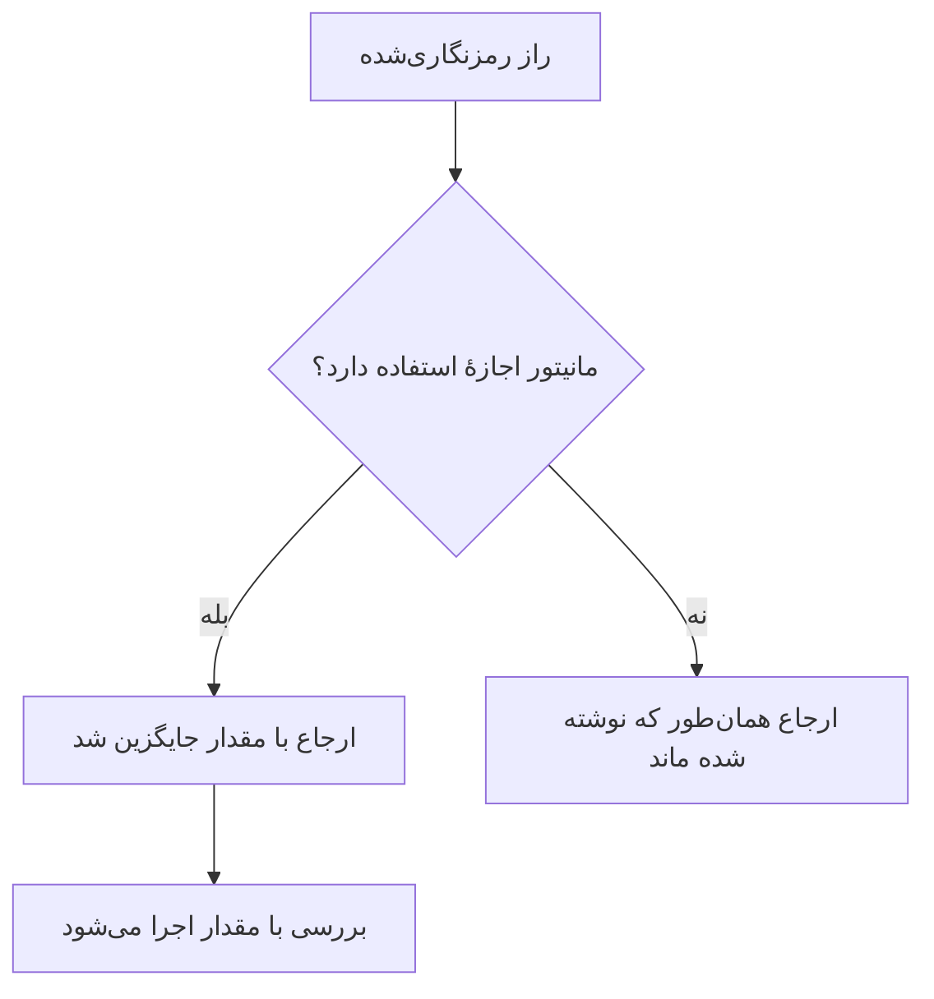

# اسرار مانیتور

رازهای مانیتور گذرواژه‌ها، کلیدهای API و توکن‌هایی را که مانیتورهای شما نیاز دارند بیرون از خود مانیتور نگه می‌دارند. یک مقدار را یک بار، رمزنگاری‌شده، ذخیره می‌کنید، انتخاب می‌کنید کدام مانیتورها می‌توانند از آن استفاده کنند، و هر جا مانیتور به آن نیاز داشت آن را به‌صورت `{{monitorSecrets.NAME}}` ارجاع می‌دهید.

:::cards
- [افزودن یک راز](#افزودن-یک-راز): یک مقدار را ذخیره کنید و انتخاب کنید چه کسی می‌تواند از آن استفاده کند.
- [انتخاب دسترسی](#انتخاب-اینکه-کدام-مانیتورها-میتوانند-از-یک-راز-استفاده-کنند): همهٔ مانیتورها، مانیتورهای مشخص، یا مانیتورهای دارای برچسب.
- [استفاده از یک راز](#استفاده-از-یک-راز): `{{monitorSecrets.NAME}}` کجا کار می‌کند.
:::

## رازها چگونه به یک مانیتور می‌رسند

یک راز رمزنگاری‌شده ذخیره می‌شود و پس از ذخیره دیگر هرگز نشان داده نمی‌شود. پیش از آنکه OneUptime یک مانیتور را به یک پراب بسپارد، هر ارجاعی را که مانیتور اجازهٔ استفاده از آن را دارد با مقدار رمزگشایی‌شده جایگزین می‌کند؛ ارجاعی که مانیتور اجازهٔ استفاده از آن را ندارد همان‌طور که نوشته شده می‌ماند.

پرابی که بررسی را اجرا می‌کند مقدار را دریافت می‌کند، پس مانیتوری که از یک راز استفاده می‌کند باید روی پراب‌هایی اجرا شود که به آن‌ها اعتماد دارید: پراب‌های خود OneUptime، یا یک [پراب سفارشی](/docs/probe/custom-probe) که خودتان اجرا می‌کنید.

## پیش از شروع

- **طرح Growth یا بالاتر**، در OneUptime Cloud. نصب‌های خودمیزبان طرحی ندارند.
- **نقشی که بتواند رازها را مدیریت کند**: Project Owner، Project Admin، یا یک نقش سفارشی با مجوز Create Monitor Secret.

## کار با رازها

### افزودن یک راز

:::steps
1. به **مانیتورها → تنظیمات → اسرار** بروید و روی **ساخت راز مانیتور** کلیک کنید.
2. یک **نام** و **مقدار راز** را وارد کنید. نام همان چیزی است که ارجاع می‌دهید، برای نمونه `ApiKey`. فقط می‌تواند حروف، اعداد، خط تیره (`-`) و زیرخط (`_`) داشته باشد، و دو راز در یک پروژه نمی‌توانند نام یکسان داشته باشند.
3. در گام **دسترسی**، انتخاب کنید کدام مانیتورها می‌توانند از آن استفاده کنند (بخش بعدی را ببینید)، سپس روی **ساخت راز مانیتور** کلیک کنید.
:::

> [!IMPORTANT]
> رازها رمزنگاری و به‌طور امن ذخیره می‌شوند. مقدار راز پس از ذخیره دیگر هرگز نشان داده نمی‌شود — نه در جدول، نه در فرم ویرایش، و نه از راه API. اگر مقدار را گم کنید، باید آن را از همان جایی که آمده دوباره بگیرید و دوباره تعیین کنید. برای چرخاندن یک راز، از دکمهٔ **به‌روزرسانی مقدار راز** در ردیف آن استفاده کنید؛ لازم نیست آن را حذف و دوباره بسازید.

### انتخاب اینکه کدام مانیتورها می‌توانند از یک راز استفاده کنند

هر راز یکی از سه گزینهٔ دسترسی را دارد:

| گزینه | کدام مانیتورها می‌توانند از راز استفاده کنند | برای چه |
| --- | --- | --- |
| **همه مانیتورها** | همهٔ مانیتورهای پروژه، از جمله مانیتورهایی که بعداً می‌سازید. | اعتبارنامه‌ای که بسیاری از مانیتورها در آن شریک‌اند. |
| **مانیتورهای مشخص** | فقط مانیتورهایی که انتخاب می‌کنید. این پیش‌فرض است، و رازهایی که پیش از وجود این گزینه‌ها ساخته شده‌اند به همین شکل کار می‌کنند. | اعتبارنامه‌ای برای یک یا چند مانیتور محدود. |
| **مانیتورهای دارای برچسب** | مانیتورهایی که دست‌کم یکی از برچسب‌های انتخابی شما را دارند. افزودن یکی از آن برچسب‌ها به یک مانیتور به آن دسترسی می‌دهد، و برداشتن برچسب دسترسی را در اجرای بعدی مانیتور می‌گیرد. | اعتبارنامه‌ای برای گروهی از مانیتورها که با گذشت زمان تغییر می‌کند. |

می‌توانید هر زمان با **ویرایش** در ردیف راز، گزینه را تغییر دهید. فقط فهرست گزینهٔ انتخاب‌شده نگه داشته می‌شود: رفتن به **همه مانیتورها** فهرست‌های مانیتور و برچسب راز را پاک می‌کند، و جابه‌جایی میان **مانیتورهای مشخص** و **مانیتورهای دارای برچسب** فهرستی را که از آن جابه‌جا شدید پاک می‌کند.

یک راز هرگز در دسترس مانیتورهای پروژهٔ دیگری نیست.

> [!WARNING]
> هر کسی که بتواند مانیتوری را ویرایش کند که اجازهٔ استفاده از یک راز را دارد، می‌تواند آن راز را به هر جایی که مانیتور به آن وصل می‌شود بفرستد. با **همه مانیتورها**، این یعنی هر کسی که بتواند در پروژه مانیتور بسازد یا ویرایش کند. با **مانیتورهای دارای برچسب**، هر کسی را هم که بتواند یکی از آن برچسب‌ها را به یک مانیتور اضافه کند در بر می‌گیرد.

در API، گزینهٔ دسترسی فیلد `monitorAccess` است: `All Monitors`، `Specific Monitors` یا `Monitors With Labels`. فیلدهای `monitors` و `labels` فهرست‌ها را نگه می‌دارند. رازی که بدون `monitorAccess` ساخته شود `Specific Monitors` می‌گیرد.

### استفاده از یک راز

برای استفاده از یک راز، `{{monitorSecrets.SECRET_NAME}}` را در فیلدی بنویسید که راز می‌پذیرد. برای نمونه، سرآیند درخواست `Authorization: Bearer {{monitorSecrets.ApiKey}}` مقدار راز `ApiKey` را می‌فرستد.

این نوع‌های مانیتور و فیلدها راز می‌پذیرند:

| نوع مانیتور | فیلدها |
| --- | --- |
| API | نشانی، سرآیندها و بدنهٔ درخواست، و گواهی کلاینت، کلید خصوصی و عبارت عبور (mTLS) |
| وب‌سایت | نشانی، و گواهی کلاینت، کلید خصوصی و عبارت عبور (mTLS) |
| Ping, IP, پورت, NTP, SSL Certificate | میزبان یا نشانی‌ای که بررسی می‌شود |
| DNS | نام دامنه و سرور DNS |
| DNSSEC, دامنه | نام دامنه |
| SQL Query | میزبان، نام پایگاه داده، نام کاربری، گذرواژه و کوئری |
| Database Health | میزبان، نام پایگاه داده، نام کاربری و گذرواژه |
| External Status Page | نشانی صفحهٔ وضعیت |
| Synthetic Monitor, Custom JavaScript Code | اسکریپت |
| Network Device | رشتهٔ community در SNMP، و کلیدهای احراز هویت و حریم خصوصی SNMPv3 |

رازها پیش از اجرای اسکریپت یک مانیتور Synthetic Monitor یا Custom JavaScript Code پر می‌شوند، پس ارجاعی مانند `{{monitorSecrets.ApiKey}}` داخل اسکریپت هنگام اجرا همان مقدار رمزگشایی‌شده است.

اگر مانیتوری به رازی ارجاع دهد که اجازهٔ استفاده از آن را ندارد، ارجاع همان‌طور که هست می‌ماند و با مقدار جایگزین نمی‌شود.

وقتی یک مانیتور را پیش از ذخیره آزمایش می‌کنید، فقط رازهایی که برای **همه مانیتورها** در دسترس‌اند پر می‌شوند، چون یک مانیتور تازه هنوز در هیچ فهرستی نیست و برچسبی ندارد. پس از ذخیرهٔ مانیتور، آزمایش‌ها از هر رازی که مانیتور اجازهٔ استفاده از آن را دارد استفاده می‌کنند.

## رفع اشکال

:::details `{{monitorSecrets.NAME}}` عیناً فرستاده می‌شود
مانیتور اجازهٔ استفاده از راز را ندارد، یا نام مطابقت ندارد. گزینهٔ دسترسی راز را با **ویرایش** در ردیف آن بررسی کنید، و اینکه نام در ارجاع دقیقاً نام راز باشد.
:::

:::details آزمایش یک مانیتور تازه راز را پر نمی‌کند
پیش از ذخیرهٔ مانیتور، فقط رازهایی که برای **همه مانیتورها** در دسترس‌اند پر می‌شوند. مانیتور را ذخیره کنید، سپس دوباره آزمایش کنید.
:::

:::details یک فیلد راز را نادیده می‌گیرد
فقط فیلدهای جدول بالا راز می‌پذیرند. در هر فیلد دیگری، `{{monitorSecrets.NAME}}` همان‌طور که نوشته شده فرستاده می‌شود.
:::

## گام‌های بعدی

:::cards
- [مانیتور API](/docs/monitor/api-monitor): یک راز را در سرآیند درخواست بفرستید.
- [مانیتور سینتتیک](/docs/monitor/synthetic-monitor): از یک راز داخل یک اسکریپت مرورگر استفاده کنید.
- [مانیتور کوئری SQL](/docs/monitor/sql-monitor): گذرواژهٔ پایگاه داده را رمزنگاری‌شده نگه دارید.
:::
