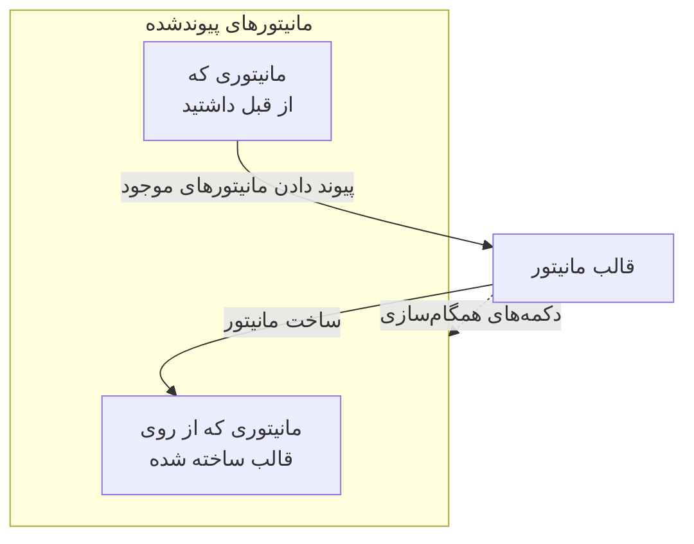

# قالب‌های مانیتور

قالب مانیتور یک پیکربندی ذخیره‌شدهٔ مانیتور است (یک نوع، معیارها، یک بازه، برچسب‌ها و مقادیر پیش‌فرض فیلدهای سفارشی) که با یک کلیک از روی آن مانیتور می‌سازید. مانیتورهایی که از روی آن ساخته شده‌اند یا به آن پیوند داده شده‌اند به آن متصل می‌مانند: قالب را تغییر دهید، سپس تغییر را با همهٔ آن‌ها همگام کنید. وقتی مانیتورهای زیادی باید یکسان رفتار کنند از قالب‌ها استفاده کنید، مثل یک بررسی سلامت یکسان روی هر سرویس، یا بررسی‌های یکسان API در محیط‌های production و staging.

:::cards
- [ساخت یک قالب](#ساخت-یک-قالب): چهار گام، مثل ساخت مانیتور.
- [ساخت مانیتور از روی آن](#ساخت-مانیتور-از-روی-یک-قالب): با یک کلیک، یا پیوند دادن مانیتورهایی که از قبل دارید.
- [همگام‌سازی تغییرات](#همگامسازی-تغییرات-با-مانیتورهای-پیوندشده): هر دکمهٔ همگام‌سازی چه چیزی را کپی می‌کند.
- [نگه داشتن مقادیر خاص هر مانیتور](#نگه-داشتن-مقادیر-خاص-هر-مانیتور): یک مقصد یا هدرها را از همگام‌سازی محافظت کنید.
:::

## قالب‌ها چگونه کار می‌کنند

قالب خودش چیزی را پایش نمی‌کند. مانیتورها از روی آن ساخته می‌شوند یا به آن پیوند داده می‌شوند و صفحهٔ قالب آن‌ها را به‌عنوان **مانیتورهای پیوندشده** فهرست می‌کند. وقتی قالب را تغییر می‌دهید، تا همگام‌سازی نکنید چیزی در آن مانیتورها تغییر نمی‌کند: هر دکمهٔ همگام‌سازی یک بخش از قالب را روی همهٔ مانیتورهای پیوندشده کپی می‌کند و فیلدهایی که محافظت می‌کنید مقدار خود هر مانیتور را نگه می‌دارند.



## پیش از شروع

- **نقشی که بتواند قالب بسازد**: Project Owner، Project Admin، Project Member، Monitor Admin یا Monitor Member، یا یک نقش سفارشی با مجوز Create Monitor Template. تغییر یک قالب به همین نقش‌ها یا مجوز Edit Monitor Template نیاز دارد.
- **مجوز به‌روزرسانی مانیتورهای پیوندشده.** همگام‌سازی به نام شما در هر مانیتور پیوندشده می‌نویسد و از مانیتورهایی که مجوزهای شما شاملشان نمی‌شود می‌گذرد.

## ساخت یک قالب

:::steps
### باز کردن فهرست قالب‌ها

به **مانیتورها → تنظیمات → قالب‌ها** بروید و روی **ساخت قالب مانیتور** کلیک کنید.

### نام‌گذاری قالب

در **اطلاعات قالب**، یک **نام قالب** مثل `Production API Health` و یک **توضیحات قالب** وارد کنید و روی **بعدی** کلیک کنید.

### تنظیم پیش‌فرض‌های مانیتور

در **پیش‌فرض‌های مانیتور**، **نوع مانیتور** را با همان انتخاب‌گر ساخت مانیتور انتخاب کنید. در صورت تمایل یک **نام پیش‌فرض مانیتور** وارد کنید؛ اگر خالی بماند، هر مانیتور به نام منبعی که پایش می‌کند نام‌گذاری می‌شود. **توضیحات پیش‌فرض مانیتور** و **برچسب‌ها** زیر **فیلدهای بیشتر** هستند. روی **بعدی** کلیک کنید.

### تنظیم معیارها و بازه

در **معیارها**، آنچه بررسی می‌شود و معیارها را مثل [ساخت مانیتور](/docs/monitor/create-monitor#معیارها) پر کنید. کارت **Template sync settings** در بالا به شما اجازه می‌دهد فیلدها را از همگام‌سازی محافظت کنید ([نگه داشتن مقادیر خاص هر مانیتور](#نگه-داشتن-مقادیر-خاص-هر-مانیتور) را ببینید). برای نوع مانیتوری که پراب‌ها بررسی‌اش می‌کنند، مرحلهٔ آخر، **بازه**، **بازه پایش** را می‌پرسد. در مرحلهٔ آخر روی **ساخت قالب مانیتور** کلیک کنید.
:::

قالب به فهرست اضافه می‌شود. آن را باز کنید تا صفحه‌اش را ببینید، با یک کارت برای هر بخش: **اطلاعات قالب**، **پیش‌فرض‌های مانیتور**، **معیارهای پایش**، **بازه پایش** (همراه با **کمینه توافق پراب‌ها**)، **برچسب‌ها**، **Custom Field Defaults** (وقتی پروژه فیلدهای سفارشی مانیتور دارد) و **مانیتورهای پیوندشده**. هر بخش را روی کارت خودش تغییر می‌دهید، برای نمونه با **ویرایش معیارها** یا **ویرایش بازه**.

## ساخت مانیتور از روی یک قالب

- **مانیتور تازه.** روی **ساخت مانیتور** در ردیف قالب در فهرست، یا روی **ساخت مانیتور از روی قالب** در صفحهٔ آن کلیک کنید. **ساخت مانیتور** با نوع و تنظیمات قالب پرشده باز می‌شود؛ هر چه لازم است تغییر دهید و آن را بسازید. مانیتور تازه به قالب پیوند داده می‌شود.
- **مانیتورهایی که از قبل دارید.** در **مانیتورهای پیوندشده**، روی **پیوند دادن مانیتورهای موجود** کلیک کنید و آن‌ها را انتخاب کنید. تا همگام‌سازی نکنید تنظیمات خودشان را نگه می‌دارند.

مقادیر فیلدهای سفارشی که زیر **Custom Field Defaults** تنظیم شده‌اند روی هر مانیتوری که از روی قالب ساخته می‌شود نوشته می‌شوند، از جمله مانیتورهایی که قواعد ورود خودکار و سیاست‌های هشدار از روی آن می‌سازند.

## همگام‌سازی تغییرات با مانیتورهای پیوندشده

ویرایش یک قالب فقط خود قالب را تغییر می‌دهد. برای کپی یک تغییر روی مانیتورهای پیوندشده، از دکمهٔ همگام‌سازی روی کارتی که تغییر داده‌اید استفاده کنید. هر دکمه می‌گوید به چند مانیتور می‌رسد، مثل **Sync Criteria to 3 Linked Monitors**، و تا وقتی چیزی پیوند داده نشده خاکستری است. همگام‌سازی برگشت‌پذیر نیست.

| دکمه | آنچه روی هر مانیتور پیوندشده کپی می‌کند | آنچه دست‌نخورده می‌ماند |
| --- | --- | --- |
| **همگام‌سازی معیارها با مانیتورهای پیوندشده** | معیارها و تنظیمات گام، مثل مقصدها و گزینه‌های درخواست، به‌جز فیلدهای محافظت‌شده | بازه پایش، کمینه توافق پراب‌ها، نام، توضیحات، برچسب‌ها و مقادیر فیلدهای سفارشی |
| **همگام‌سازی بازه با مانیتورهای پیوندشده** | بازه پایش و کمینه توافق پراب‌ها | معیارها، نام، توضیحات، برچسب‌ها و مقادیر فیلدهای سفارشی |
| **همگام‌سازی برچسب‌ها با مانیتورهای پیوندشده** | فقط برچسب‌ها | همه چیز دیگر |
| **Sync Custom Fields to Linked Monitors** | فیلدهای سفارشی که قالب برایشان مقدار پیش‌فرض دارد، به‌جای آنچه هر مانیتور داشت | فیلدهای سفارشی که قالب خالی می‌گذارد، و همه چیز دیگر |

برای همگام‌سازی یک مانیتور، روی **همگام‌سازی از روی قالب** در ردیف آن در **مانیتورهای پیوندشده** کلیک کنید. این کار معیارها و تنظیمات گام (به‌جز فیلدهای محافظت‌شده)، بازه پایش، کمینه توافق پراب‌ها و برچسب‌ها را کپی می‌کند و نام، توضیحات و مقادیر فیلدهای سفارشی مانیتور را دست‌نخورده می‌گذارد. **لغو پیوند از قالب** اتصال مانیتور را قطع می‌کند؛ مانیتور تنظیماتش را نگه می‌دارد.

پس از همگام‌سازی، خلاصه‌ای می‌گوید چند مانیتور به‌روز شدند. **تا حدی همگام‌سازی شد** یعنی برخی مانیتورهای پیوندشده هنوز پیکربندی قبلی را دارند، معمولاً چون مجوزهای شما شاملشان نمی‌شود.

## نگه داشتن مقادیر خاص هر مانیتور

همگام‌سازی معیارها تنظیمات گام، مثل مقصدها، هدرهای درخواست و وقفه‌ها را هم کپی می‌کند، مگر اینکه آن فیلدها را محافظت کنید. یک فیلد را محافظت کنید تا هر مانیتور پیوندشده مقدار خودش را برای آن نگه دارد.

:::steps
### باز کردن قالب

به **مانیتورها → تنظیمات → قالب‌ها** بروید و قالب را باز کنید.

### ویرایش معیارهای آن

روی کارت **معیارهای پایش**، روی **ویرایش معیارها** کلیک کنید.

### محافظت از فیلدها

در **Template sync settings**، کنار هر فیلدی که می‌خواهید روی مانیتورهای پیوندشده بماند، **Do not sync this field** را علامت بزنید.

### ذخیره

تغییراتتان را ذخیره کنید. کارت **معیارهای پایش** و تأییدیهٔ هر دو همگام‌سازی زیر فیلدهای محافظت‌شده را فهرست می‌کنند.

### همگام‌سازی

از **همگام‌سازی معیارها با مانیتورهای پیوندشده**، یا از **همگام‌سازی از روی قالب** روی یک مانیتور پیوندشدهٔ مشخص استفاده کنید.
:::

برای نمونه، **Monitor destination** و **Request headers** را روی یک قالب API محافظت کنید. مانیتورهای production و staging نشانی‌ها و هدرهای خودشان را نگه می‌دارند، در حالی که هر دو معیارهای به‌روزشدهٔ قالب و دیگر تنظیمات محافظت‌نشده را دریافت می‌کنند.

گزینه‌های موجود به نوع مانیتور بستگی دارند. از جملهٔ آن‌ها مقصدها و پورت‌ها، گزینه‌های درخواست HTTP، اتصال‌های پایگاه داده، تنظیمات DNS، انتخاب‌گرهای زیرساخت و کوئری‌های تله‌متری‌اند. اعتبارنامه‌های مرتبط، مثل یک گواهی کلاینت و کلید خصوصی آن، با هم نگه داشته می‌شوند.

### رفتار استثناها

- فیلدهای علامت‌خورده مقدار فعلی هر مانیتور موجود را نگه می‌دارند، از جمله مقدار خالی یا تنظیم‌نشده. هدرهای درخواست و دیگر مجموعه‌ها به‌طور کامل حفظ می‌شوند.
- فیلدهای بدون علامت همچنان از قالب همگام می‌شوند. علامت یک فیلد محافظت‌شده را بردارید و ذخیره کنید تا در همگام‌سازی بعدی مقدار قالبش کپی شود.
- استثناها روی همگام‌سازی گروهی و تکی هر دو اعمال می‌شوند. آن‌ها روی قالب ذخیره می‌شوند و برای هر همگام‌سازی جداگانه انتخاب نمی‌شوند.
- مانیتورهای تازه همچنان با مقادیر فیلدهای قالب شروع می‌شوند. استثناها فقط روی همگام‌سازی با مانیتورهای موجود اثر دارند.
- معیارها همیشه همگام می‌شوند. همگام‌سازی فقط معیارها بازه پایش، برچسب‌ها و دیگر تنظیمات سطح مانیتور را دست‌نخورده می‌گذارد.
- قالب‌های موجود تا وقتی پیکربندی‌شان نکنید هیچ استثنای فیلدی ندارند. مانیتورهای Network Device همچنان اتصال دستگاه خودشان را به‌طور خودکار نگه می‌دارند.

در قالب‌هایی با چند گام، مقادیر محافظت‌شده با شناسهٔ گام‌ها تطبیق داده می‌شوند. مانیتورهای تک‌گامی که جداگانه ساخته شده‌اند هم می‌توانند یک قالب تک‌گام دریافت کنند. اگر یک گام محافظت‌شده تطبیق داده نشود، همگام‌سازی پیش از به‌روزرسانی هر مانیتوری رد می‌شود، تا یک گام تازه یا جابه‌جاشده تصادفاً مقصد یا اعتبارنامه‌های گامی دیگر را کپی نکند.

> [!IMPORTANT]
> پیش از تغییر نوع مانیتور یک قالب ذخیره‌شده (با **ویرایش پیش‌فرض‌های مانیتور**)، استثناهایی را که برای نوع تازه کاربرد ندارند در **ویرایش معیارها** پاک کنید. همهٔ استثناهای یک قالب باید برای نوع مانیتورش وجود داشته باشند.

## پیکربندی از راه API

هر گام قالب یک آرایهٔ `doNotSyncFields` را در شیء `MonitorStep.value` خود می‌پذیرد. برای یک مانیتور API، مقصد و کل مجموعهٔ هدرهایش را این‌گونه محافظت کنید:

```json title="monitorSteps (excerpt)"
{
  "_type": "MonitorSteps",
  "value": {
    "monitorStepsInstanceArray": [
      {
        "_type": "MonitorStep",
        "value": {
          "id": "<step id>",
          "doNotSyncFields": ["monitorDestination", "requestHeaders"]
        }
      }
    ]
  }
}
```

آرایه را حذف کنید یا آن را `[]` قرار دهید تا همهٔ تنظیمات پشتیبانی‌شدهٔ گام همگام شوند. نام‌های فیلد پشتیبانی‌نشده و فیلدهایی که برای نوع مانیتور قالب کاربرد ندارند رد می‌شوند. همگام‌سازی را آرایهٔ قالب کنترل می‌کند؛ چنین فراداده‌ای روی یک مانیتور پیوندشده آن را تغییر نمی‌دهد.

:::details نام فیلدهای doNotSyncFields، بر اساس نوع مانیتور
| نوع مانیتور | نام فیلدها |
| --- | --- |
| وب‌سایت، API، Ping، IP، پورت، SSL Certificate، NTP | `monitorDestination`, `requestTimeoutInMs`, `retryCount` |
| فقط API | `requestHeaders`, `requestType`, `requestBody` |
| وب‌سایت و API | `doNotFollowRedirects`, `allowSelfSignedCertificates`, `tlsClientAuthentication` (گواهی کلاینت، کلید و عبارت عبور با هم) |
| پورت، NTP | `monitorDestinationPort` |
| Synthetic Monitor، Custom JavaScript Code | `customCode` |
| Synthetic Monitor | `browserTypes`, `screenSizeTypes`, `retryCountOnError` |
| DNS | `dnsMonitor.queryName`, `dnsMonitor.recordType`, `dnsMonitor.resolver` (سرور DNS و پورت با هم), `dnsMonitor.timeout`, `dnsMonitor.retries` |
| دامنه | `domainMonitor.domainName`, `domainMonitor.lookupMethod`, `domainMonitor.timeout`, `domainMonitor.retries` |
| DNSSEC | `dnssecMonitor.domainName`, `dnssecMonitor.resolvers`, `dnssecMonitor.checkNameserverConsistency`, `dnssecMonitor.signatureExpiryWarningDays`, `dnssecMonitor.timeout`, `dnssecMonitor.retries` |
| SQL Query | `sqlMonitor.connection`, `sqlMonitor.connectionTimeoutInMs`, `sqlMonitor.statementTimeoutInMs`, `sqlMonitor.query`, `sqlMonitor.maxRows` |
| Database Health | `databaseMonitor.connection`, `databaseMonitor.connectionTimeoutInMs`, `databaseMonitor.statementTimeoutInMs`, `databaseMonitor.enabledMetricGroups` |
| External Status Page | `externalStatusPageMonitor.statusPageUrl`, `externalStatusPageMonitor.provider`, `externalStatusPageMonitor.components`, `externalStatusPageMonitor.timeout`, `externalStatusPageMonitor.retries` |
| لاگ‌ها، Security Events، ترِیس‌ها، هوش مصنوعی / LLM، متریک‌ها، استثناها | `logMonitor`, `securityEventsMonitor`, `traceMonitor`, `llmMonitor`, `metricMonitor`, `exceptionMonitor` (کل پیکربندی مانیتور) |

مانیتورهای زیرساخت (Kubernetes، Docker Container، میزبان، Podman Container، Proxmox، Docker Swarm، Ceph، آرایه ذخیره‌سازی، IoT Device) انتخاب‌گر منبع، فیلترها (همه جز میزبان)، کوئری‌های متریک و بازهٔ زمانی کوئری خود را برای محافظت ارائه می‌کنند. نام آن‌ها در **Template sync settings** روی قالبی از همان نوع فهرست شده است.
:::

## رفع اشکال

:::details همگام‌سازی «تا حدی همگام‌سازی شد» را نشان می‌دهد
برخی مانیتورهای پیوندشده به‌روز نشدند، معمولاً چون مجوزهای شما شاملشان نمی‌شود. از کسی که می‌تواند همهٔ مانیتورهای پیوندشده را به‌روز کند بخواهید همگام‌سازی را دوباره اجرا کند.
:::

:::details همگام‌سازی با "a template step cannot be matched to an existing monitor step" شکست می‌خورد
یک فیلد محافظت‌شده با گامی در یکی از مانیتورها تطبیق داده نشد، پس همگام‌سازی پیش از تغییر هر مانیتوری متوقف شد. به گام‌های قالب همان شناسه‌های گام‌های مانیتورها را بدهید، یا برای مانیتورهای تک‌گام از یک قالب تک‌گام استفاده کنید.
:::

:::details دکمه‌های همگام‌سازی خاکستری‌اند
هنوز هیچ مانیتوری به قالب پیوند داده نشده است. از روی آن یک مانیتور بسازید، یا در **مانیتورهای پیوندشده** روی **پیوند دادن مانیتورهای موجود** کلیک کنید.
:::

:::details ذخیره با "Unsupported do not sync field" شکست می‌خورد
یک نام در `doNotSyncFields` فیلدی از نوع مانیتور قالب نیست. آن را با نام فیلدهای بالا مقایسه کنید.
:::

## گام‌های بعدی

:::cards
- [ساخت مانیتور](/docs/monitor/create-monitor): فرمی که یک قالب پر می‌کند.
- [مانیتور API](/docs/monitor/api-monitor): تنظیماتی که یک قالب API همراه دارد.
- [اسرار مانیتور](/docs/monitor/monitor-secrets): اعتبارنامه‌ها را بدون کپی کردن بین مانیتورها به اشتراک بگذارید.
- [مراحل مانیتور در Terraform](/docs/terraform/monitor-steps): مانیتورها و گام‌هایشان را به‌صورت کد مدیریت کنید.
:::
