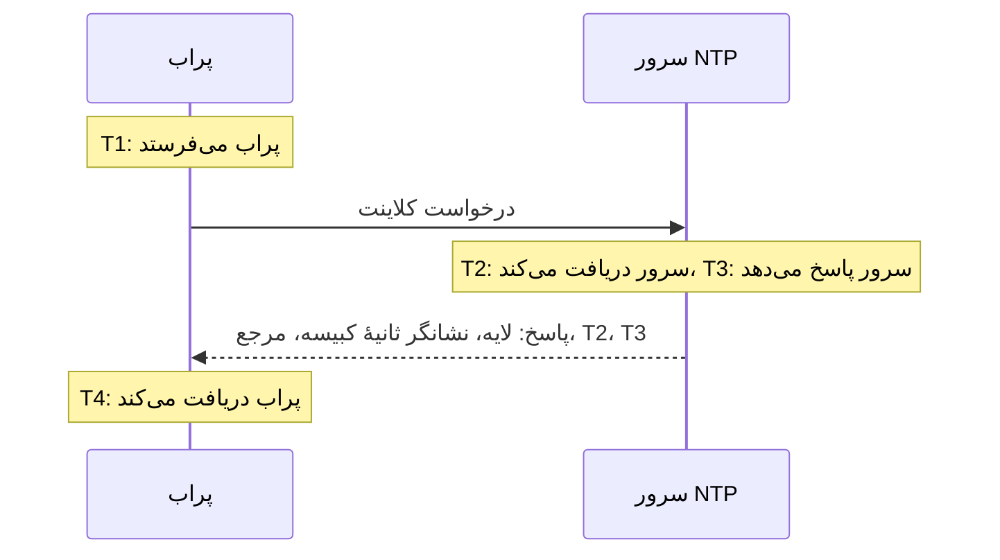

# مانیتور NTP

مانیتور NTP بررسی می‌کند که یک سرور زمان روی پورت UDP شماره 123 پاسخ می‌دهد و زمان درست ارائه می‌کند: اینکه همگام است، در لایه‌ای معقول قرار دارد و ساعتش با ساعت پراب یکی است. از آن برای سرورهای زمانی که خودتان اداره می‌کنید، مثل یک ساعت GPS در مرکز داده یا سرورهای داخلی که ماشین‌هایتان با آن‌ها همگام می‌شوند، و برای سرورهای عمومی که به آن‌ها وابسته‌اید استفاده کنید.

:::cards
- [ساخت مانیتور](#ساخت-یک-مانیتور-ntp): شش گام در داشبورد.
- [آنچه بررسی می‌خواند](#آنچه-بررسی-میخواند): لایه، اختلاف ساعت، نشانگر ثانیهٔ کبیسه و بقیهٔ پاسخ.
- [معیارهای پایش](#معیارهای-پایش): دسترس‌پذیری، همگامی، لایه و اختلاف.
- [رفع اشکال](#رفع-اشکال): وقتی سرور کار می‌کند اما مانیتور چیز دیگری می‌گوید.
:::

## چگونه کار می‌کند

در هر بررسی، یک پراب یک درخواست کلاینت SNTP (نسخهٔ 4 از NTP، حالت کلاینت) را از یک پورت محلی تصادفی به پورت UDP سرور می‌فرستد و منتظر پاسخ می‌ماند. فقط پاسخ واقعی به همان درخواست حساب می‌شود: پراب 64 بیت تصادفی در مهر زمانی ارسال درخواست می‌گذارد و هر بسته‌ای را که آن‌ها را برنگرداند، کوتاه‌تر از یک بستهٔ NTP باشد یا در حالت سرور نباشد نادیده می‌گیرد. یک پاسخ قدیمی به بررسی قبلی، یا یک پاسخ جعلی، هرگز نمی‌تواند سروری از کار افتاده را زنده نشان دهد.

پراب از روی چهار مهر زمانی، **اختلاف ساعت** را محاسبه می‌کند، ((T2 − T1) + (T3 − T4)) / 2: اینکه ساعت سرور چقدر با ساعت پراب فاصله دارد. اختلاف مثبت یعنی سرور جلوتر است. این فرمول فرض می‌کند رفتن درخواست و برگشتن پاسخ به یک اندازه طول می‌کشد، پس مسیری که در یک جهت بسیار کندتر است می‌تواند اختلاف را تا نصف زمان رفت‌وبرگشت منحرف کند.

> [!NOTE]
> اختلاف نسبت به ساعت خود پراب اندازه‌گیری می‌شود. پراب‌های OneUptime Cloud ساعت‌هایشان را همگام نگه می‌دارند. روی یک [پراب سفارشی](/docs/probe/custom-probe)، ساعت میزبان را هم با chrony یا systemd-timesyncd همگام نگه دارید، وگرنه ممکن است هشدار اختلاف به پراب مربوط باشد نه به سرور.

از سروری که پاسخ می‌دهد دوباره پرسیده نمی‌شود، حتی وقتی بدون زمان درست پاسخ می‌دهد. بی‌پاسخی، پورت ردشده و جست‌وجوی DNS ناموفق با یک درخواست تازه دوباره امتحان می‌شوند. وقتی سرور اصلاً پاسخ نمی‌دهد، پراب مسیر رسیدن به آن را هم ردیابی می‌کند و آنچه را یافته به‌عنوان **Network Path at Time of Failure** پیوست می‌کند. پرابی که اتصال شبکهٔ خودش را از دست داده هیچ نتیجه‌ای گزارش نمی‌کند، پس نمی‌تواند سرور شما را آفلاین علامت بزند.

## پیش از شروع

- **نقشی که بتواند مانیتور بسازد**: Project Owner، Project Admin، Project Member، Monitor Admin یا Monitor Member، یا یک نقش سفارشی با مجوز Create Monitor.
- **پرابی که به پورت UDP شماره 123 روی سرور برسد.** هر پرابی می‌تواند یک سرور زمان عمومی را بررسی کند. برای سروری در یک شبکهٔ خصوصی، از یک [پراب سفارشی](/docs/probe/custom-probe) داخل همان شبکه استفاده کنید. دیوارهٔ آتش جلوی سرور باید از [آدرس‌های IP پراب‌های OneUptime Cloud](/docs/configuration/ip-addresses) یا از پراب سفارشی شما، نه فقط TCP، بلکه UDP را هم عبور دهد.

## ساخت یک مانیتور NTP

:::steps
### شروع یک مانیتور تازه

به **مانیتورها** بروید و روی **ساخت مانیتور** کلیک کنید. در **نوع مانیتور**، عبارت `ntp` را در کادر جست‌وجو بنویسید و **NTP** را انتخاب کنید. این نوع در **انواع دیگر مانیتور**، در گروه شبکه، هم فهرست شده است.

### نام‌گذاری

یک **نام** وارد کنید، مثل `GPS time server`، و روی **بعدی** کلیک کنید.

### وارد کردن سرور

در **سرور NTP**، نام میزبان یا آدرس IP سرور را وارد کنید، مثل `time.example.com` یا `192.168.1.10`. درخواست به پورت 123 می‌رود. برای استفاده از پورت دیگری، **فیلدهای بیشتر** را باز کنید و **پورت** را تنظیم کنید.

### آزمایش

روی **آزمایش مانیتور** کلیک کنید، در **انتخاب پراب** یک پراب انتخاب کنید و روی **اجرای آزمایش** کلیک کنید. **نتیجه آزمایش مانیتور** نشان می‌دهد که سرور پاسخ داد یا نه، همگام است یا نه، لایه‌اش چیست و ساعتش چقدر اختلاف دارد.

### بازبینی معیارها

**معیارهای مانیتور** با [معیارهای پیش‌فرض](#معیارهای-پیشفرض) شروع می‌شود: آفلاین وقتی سرور زمان درست ارائه نمی‌کند، آنلاین وقتی ارائه می‌کند. در صورت نیاز آن‌ها را تغییر دهید و روی **بعدی** کلیک کنید.

### انتخاب پراب‌ها و ساخت

**پراب‌ها** و **بازه پایش** (که از **هر ۵ دقیقه** شروع می‌شود) را نگه دارید یا تغییر دهید و روی **ساخت مانیتور** کلیک کنید. صفحهٔ مانیتور باز می‌شود.
:::

## گزینه‌های پیکربندی

| فیلد | پیش‌فرض | چه وارد کنید |
| --- | --- | --- |
| **سرور NTP** | هیچ | سرور، مثل `time.example.com`، `192.168.1.10` یا `2001:db8::123`. فقط میزبان را وارد کنید، بدون `udp://`. پورتی که پس از میزبان نوشته شود، مثل `time.example.com:1123`، به‌جای **پورت** به کار می‌رود. |
| **پورت** (در **فیلدهای بیشتر**) | `123` | پورت UDP که سرور روی آن به NTP پاسخ می‌دهد، از `1` تا `65535`. برای `123` خالی بگذارید. |
| **وقفه درخواست (ثانیه)** (در **فیلدهای بیشتر**) | `5` | مدتی که یک تلاش، با احتساب جست‌وجوی DNS، منتظر پاسخ می‌ماند. بیشینه 60 ثانیه است. |
| **تلاش‌های مجدد در صورت شکست** (در **فیلدهای بیشتر**) | پیش‌فرض پراب، معمولاً `3` | چند بار تلاشی که پاسخی نگرفته تکرار شود. بیشینه 3 است. |

**تلاش‌های مجدد در صورت شکست** تکرارهای _پس از_ تلاش اول را می‌شمارد، پس `0` بررسی را یک بار و `2` تا سه بار اجرا می‌کند، با یک ثانیه مکث بین تلاش‌ها. اگر خالی بماند، پیش‌فرض پراب به کار می‌رود: 3، مگر اینکه `PROBE_MONITOR_RETRY_LIMIT` پراب چیز دیگری بگوید.

## آنچه بررسی می‌خواند

صفحهٔ مانیتور آخرین بررسی هر پراب را نشان می‌دهد:

| فیلد | معنی |
| --- | --- |
| **همگام‌شده** | اینکه سرور با لایهٔ 1 تا 15، بدون هشدار در نشانگر ثانیهٔ کبیسه، و با مهرهای زمانی واقعی در پاسخش جواب داد یا نه. |
| **اختلاف ساعت** | ساعت سرور چقدر و در کدام جهت با ساعت پراب فاصله دارد. یک سرور سالم در محدودهٔ چند میلی‌ثانیه است. |
| **لایه** | سرور چند گام با یک ساعت مرجع فاصله دارد: 1 برای سروری با منبع GPS یا اتمی خودش، 2 برای سروری که با یک سرور لایهٔ 1 همگام می‌شود، و به همین ترتیب. 16 یعنی همگام نیست. |
| **مرجع** | سرور با چه چیزی همگام می‌شود: نام یک منبع مثل `GPS`، `PPS` یا `NIST` در لایهٔ 1، و نشانی سرور بالادستی از لایهٔ 2 به بعد. |
| **نشانگر ثانیهٔ کبیسه** | 0 وقتی ثانیهٔ کبیسه‌ای در راه نیست، 1 یا 2 وقتی در پایان روز یک ثانیه اضافه یا کم می‌شود، 3 وقتی سرور می‌گوید ساعتش همگام نیست. |
| **پراکندگی ریشه** | برآورد خود سرور از اینکه زمانش چقدر ممکن است از زمان واقعی فاصله داشته باشد. تا وقتی سرور به منبعش نرسد، این مقدار بزرگ‌تر می‌شود. ntpd وقتی نصف تأخیر ریشهٔ یک سرور به‌علاوهٔ این مقدار از 1.5 ثانیه بگذرد، دیگر به آن سرور اعتماد نمی‌کند. |
| **تأخیر ریشه** | رفت‌وبرگشت از سرور تا ساعت مرجعش. |
| **زمان پاسخ** | از ارسال درخواست توسط پراب تا دریافت پاسخ، بدون جست‌وجوی DNS. |
| **زمان سرور** | ساعت سرور در لحظه‌ای که پاسخ را فرستاد. |

سروری که از دادن زمان خودداری می‌کند، به‌جای آن یک **kiss-o'-death** می‌فرستد: پاسخی در لایهٔ 0 با یک کد چهارحرفی. رایج‌ترین کدها `RATE` (سرور نرخ پراب را محدود می‌کند)، `DENY` و `RSTR` (قوانین دسترسی سرور پراب را رد می‌کنند) و `INIT` (سرور هنوز همگام نشده) هستند. بررسی کد را نشان می‌دهد و سرور را پاسخ‌دهنده اما ناهمگام حساب می‌کند.

## معیارهای پایش

معیارها تعیین می‌کنند سرور چه زمانی آنلاین، کاهش‌یافته یا آفلاین حساب شود، و اینکه آیا این وضعیت یک حادثه اعلام می‌کند یا هشداری می‌سازد. هر معیار یک یا چند فیلتر را بررسی می‌کند:

| فیلتر | شرط‌ها | چه چیزی را بررسی می‌کند |
| --- | --- | --- |
| **NTP Is Online** | **درست**، **نادرست** | اینکه سرور به درخواست پراب با یک پاسخ NTP جواب داد یا نه. kiss-o'-death هم پاسخ است. |
| **NTP Is Synchronized** | **درست**، **نادرست** | اینکه سروری که پاسخ داد زمان همگام ارائه می‌کند یا نه. وقتی سرور پاسخ نمی‌دهد این فیلتر بررسی نمی‌شود؛ برای آن از **NTP Is Online** استفاده کنید. |
| **NTP Stratum** | **Greater Than**، **Greater Than Or Equal To**، **Less Than**، **Less Than Or Equal To**، **Equal To**، **Not Equal To** | لایهٔ سرور. مقدار 0 در kiss-o'-death به‌صورت 16، یعنی ناهمگام، حساب می‌شود. |
| **NTP Clock Offset (in ms)** | **Greater Than**، **Less Than**، **Greater Than Or Equal To**، **Less Than Or Equal To** | ساعت سرور چقدر با ساعت پراب فاصله دارد، در هر دو جهت. |
| **NTP Response Time (in ms)** | **Greater Than**، **Less Than**، **Greater Than Or Equal To**، **Less Than Or Equal To** | از درخواست تا پاسخ. |
| **NTP Root Dispersion (in ms)** | **Greater Than**، **Less Than**، **Greater Than Or Equal To**، **Less Than Or Equal To** | برآورد خود سرور از بیشینهٔ خطایش. |

با دو فیلتر یا بیشتر، **شرط تطابق** تعیین می‌کند که **همه** باید منطبق باشند یا **هر** یک کافی است. **اقدام‌ها**ی یک معیار تعیین می‌کنند که چه کند: تغییر وضعیت مانیتور، ساختن هشدار، اعلام حادثه، یا هر ترکیبی از این‌ها.

### معیارهای پیش‌فرض

یک مانیتور NTP تازه با دو معیار شروع می‌شود:

- **آفلاین** — سرور پاسخ نمی‌دهد، همگام نیست، یا ساعتش `1000` ms یا بیشتر با ساعت پراب فاصله دارد. مانیتور **آفلاین** علامت می‌خورد و حادثه‌ای با نام "_نام مانیتور_ is not serving good time" ساخته می‌شود. وقتی سرور دوباره زمان درست ارائه کند، خودبه‌خود برطرف می‌شود.
- **آنلاین** — سرور پاسخ می‌دهد، همگام است و ساعتش کمتر از `1000` ms با ساعت پراب فاصله دارد. مانیتور **عملیاتی** علامت می‌خورد.

معیارها از بالا به پایین بررسی می‌شوند و اولین معیاری که منطبق شود تعیین می‌کند چه رخ دهد. سروری که با زمان نادرست پاسخ می‌دهد عمداً از کار افتاده حساب می‌شود: هر کلاینتی که از آن پیروی می‌کند همان زمان را می‌گیرد.

### ارزیابی در یک بازهٔ زمانی

**این معیار را در یک بازه زمانی ارزیابی کن** یک کادر انتخاب زیر هر فیلتر NTP است. آن را روشن کنید تا به‌جای آخرین بررسی، پنجره‌ای از بررسی‌های گذشته داوری شود: یک تجمیع در **ارزیابی** و یک پنجره، از 2 تا 60 دقیقه، در **در (دقیقه) گذشته** انتخاب کنید. فقط بررسی‌هایی که سرور به آن‌ها پاسخ داده لایه، اختلاف و پراکندگی ریشه دارند، پس پنجره‌ای از بی‌پاسخی برای این فیلترها داده‌ای ندارد و **اگر داده‌ای نبود** تعیین می‌کند چه رخ دهد.

### نمونهٔ معیارها

| هدف | فیلتر | شرط | مقدار |
| --- | --- | --- | --- |
| هشدار وقتی یک سرور GPS به منبع شبکه برمی‌گردد | **NTP Stratum** | **Greater Than** | `1` |
| هشدار وقتی ساعت منحرف می‌شود | **NTP Clock Offset (in ms)** | **Greater Than** | `100` |
| هشدار وقتی حد خطای سرور بزرگ می‌شود | **NTP Root Dispersion (in ms)** | **Greater Than** | `500` |
| هشدار وقتی پاسخ‌ها کند می‌شوند | **NTP Response Time (in ms)** | **Greater Than** | `1000` |

## رفع اشکال

:::details سرور کار می‌کند، اما مانیتور می‌گوید پاسخ نداده است
درخواست یا پاسخ در مسیر از دست رفته است. دیوارهٔ آتشی که TCP را اجازه می‌دهد اما UDP را نه، یک قانون `restrict` در ntpd یا `allow` در chrony که نشانی پراب را شامل نمی‌شود، یا سروری که فقط روی یک رابط داخلی گوش می‌دهد، همه همین‌طور به نظر می‌رسند. **Network Path at Time of Failure** نشان می‌دهد مسیر تا کجا رسیده است. اجازهٔ عبور پراب را بدهید، یا سرور را از یک [پراب سفارشی](/docs/probe/custom-probe) داخل شبکه بررسی کنید.
:::

:::details مانیتور می‌گوید سرور درخواست را رد کرده است
میزبان پاسخ داده که چیزی روی آن پورت UDP گوش نمی‌دهد (ICMP port unreachable): سرویس NTP متوقف شده یا روی پورت دیگری گوش می‌دهد. سرویس را راه‌اندازی کنید، یا **پورت** را روی پورتی بگذارید که سرویس از آن استفاده می‌کند.
:::

:::details سرور با kiss-o'-death پاسخ می‌دهد
`RATE` یعنی سرور نرخ پراب را محدود می‌کند. پراب در هر بررسی یک بار می‌پرسد، پس یک **بازه پایش** طولانی‌تر، یا معاف کردن نشانی‌های پراب از محدودیت سرور، آن را متوقف می‌کند. `DENY` و `RSTR` یعنی قوانین دسترسی سرور پراب را رد می‌کنند. `INIT` و `STEP` یعنی سرور هنوز همگام نشده است، که تا چند دقیقه پس از راه‌اندازی عادی است.
:::

:::details همهٔ مانیتورهای NTP روی یک پراب اختلاف مشابهی نشان می‌دهند
ساعت پراب منحرف است، نه ساعت سرورها. بررسی کنید که میزبان پراب ساعتش را همگام نگه می‌دارد، یا مانیتورها را روی پراب دیگری اجرا کنید.
:::

:::details اختلاف بین بررسی‌ها جهش می‌کند
پراب از سرور دور است، یا مسیر در یک جهت کندتر از جهت دیگر است. از پرابی نزدیک‌تر به سرور استفاده کنید، یا اختلاف را در طول چند دقیقه با **این معیار را در یک بازه زمانی ارزیابی کن** و **میانگین** داوری کنید.
:::

## گام‌های بعدی

:::cards
- [مانیتور Ping](/docs/monitor/ping-monitor): بررسی کنید که خود میزبان در دسترس است.
- [مانیتور پورت](/docs/monitor/port-monitor): سرویس‌های TCP روی همان میزبان را بررسی کنید.
- [پراب‌های سفارشی](/docs/probe/custom-probe): سرورهای زمان را در شبکهٔ خودتان بررسی کنید.
- [قالب‌بندی حادثه و هشدار](/docs/monitor/incident-alert-templating): لایه و اختلاف را در عنوان یک حادثه بگذارید.
:::
