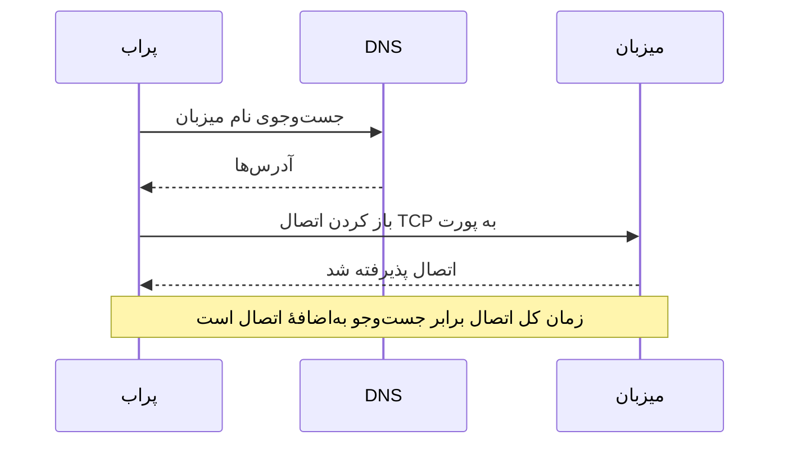

# مانیتور پورت

مانیتور پورت بررسی می‌کند که یک میزبان روی یک پورت اتصال TCP می‌پذیرد و اندازه می‌گیرد اتصال چقدر طول می‌کشد. از آن برای سرویس‌هایی استفاده کنید که HTTP صحبت نمی‌کنند، یا نمی‌خواهید HTTP آن‌ها را بررسی کنید: پایگاه‌های داده، سرورهای ایمیل، SSH، کارگزاران پیام و مانند آن‌ها.

:::cards
- [ساخت مانیتور](#ساخت-یک-مانیتور-پورت): شش گام در داشبورد.
- [زمان‌بندی اتصال](#زمانبندی-اتصال): زمان‌های DNS، TCP و کل چه چیزی را اندازه می‌گیرند.
- [معیارهای پایش](#معیارهای-پایش): دسترس‌پذیری و زمان‌های اتصال.
- [رفع اشکال](#رفع-اشکال): وقتی سرویس بالاست اما مانیتور آفلاین نشان می‌دهد.
:::

## چگونه کار می‌کند

در هر بررسی، پراب اگر نام میزبانی داده باشید آن را جست‌وجو می‌کند و یک اتصال TCP به پورت باز می‌کند. پورت به محض پذیرفته شدن اتصال آنلاین است؛ سپس پراب بدون فرستادن چیزی اتصال را می‌بندد. اتصالی که رد شود یا به وقفه بخورد، تا تعداد تلاش‌های مجددی که اجازه می‌دهید دوباره امتحان می‌شود. سپس OneUptime نتیجه را از معیارهای مانیتور عبور می‌دهد.

پراب فقط اتصال‌های TCP باز می‌کند: سرویسی که فقط روی UDP گوش می‌دهد، مثل یک عامل SNMP، با مانیتور پورت بررسی‌پذیر نیست.

وقتی یک بررسی شکست می‌خورد، پراب مسیر رسیدن به میزبان را هم ردیابی می‌کند و نامش را جست‌وجو می‌کند و آنچه را یافته به‌عنوان **Network Path at Time of Failure** به نتیجه پیوست می‌کند، تا ببینید مسیر کجا قطع شد. پرابی که اتصال شبکهٔ خودش را از دست داده هیچ نتیجه‌ای گزارش نمی‌کند، پس نمی‌تواند سرویس شما را آفلاین علامت بزند.

## پیش از شروع

- **نقشی که بتواند مانیتور بسازد**: Project Owner، Project Admin، Project Member، Monitor Admin یا Monitor Member، یا یک نقش سفارشی با مجوز Create Monitor.
- **پرابی که به پورت برسد.** پراب‌های پیش‌فرض پروژهٔ شما برای هر مانیتور تازه انتخاب می‌شوند. اگر دیوارهٔ آتشی جلوی سرویس است، به [آدرس‌های IP پراب‌های OneUptime Cloud](/docs/configuration/ip-addresses) اجازه دهید به پورت وصل شوند. سرویسی در یک شبکهٔ خصوصی، مثل یک پایگاه داده، به یک [پراب سفارشی](/docs/probe/custom-probe) داخل همان شبکه نیاز دارد.

## ساخت یک مانیتور پورت

:::steps
### شروع یک مانیتور تازه

به **مانیتورها** بروید و روی **ساخت مانیتور** کلیک کنید. در **نوع مانیتور**، **پورت** را انتخاب کنید.

### نام‌گذاری

یک **نام** وارد کنید، مثل `Orders database`، و روی **بعدی** کلیک کنید.

### وارد کردن میزبان و پورت

در **نام میزبان یا آدرس IP**، میزبانی را که پورت روی آن است وارد کنید، مثل `db.example.com` یا `10.0.0.12`. در **پورت**، شمارهٔ پورت را وارد کنید، مثل `5432`.

### آزمایش

روی **آزمایش مانیتور** کلیک کنید، در **انتخاب پراب** یک پراب انتخاب کنید و روی **اجرای آزمایش** کلیک کنید. **نتیجه آزمایش مانیتور** نشان می‌دهد اتصال باز شد یا نه، و هر بخش چقدر طول کشید.

### بازبینی معیارها

**معیارهای مانیتور** با [معیارهای پیش‌فرض](#معیارهای-پیشفرض) شروع می‌شود: آفلاین وقتی پورت اتصال نمی‌پذیرد، آنلاین وقتی می‌پذیرد. در صورت نیاز آن‌ها را تغییر دهید و روی **بعدی** کلیک کنید.

### انتخاب پراب‌ها و ساخت

**پراب‌ها** و **بازه پایش** (که از **هر ۵ دقیقه** شروع می‌شود) را نگه دارید یا تغییر دهید و روی **ساخت مانیتور** کلیک کنید. صفحهٔ مانیتور باز می‌شود.
:::

## گزینه‌های پیکربندی

| فیلد | پیش‌فرض | چه وارد کنید |
| --- | --- | --- |
| **نام میزبان یا آدرس IP** | هیچ | میزبان، مثل `example.com`، `192.168.1.1` یا `2001:db8::1`. فقط میزبان را وارد کنید، بدون `http://`. |
| **پورت** | هیچ | پورت TCP که باید به آن وصل شد، از `1` تا `65535`. |
| **وقفه درخواست (ثانیه)** (زیر **فیلدهای بیشتر**) | `60` | مدتی که یک تلاش می‌تواند طول بکشد، جست‌وجوی DNS و اتصال TCP با هم. بیشینه ۶۰ ثانیه است. |
| **تلاش‌های مجدد در صورت شکست** (زیر **فیلدهای بیشتر**) | پیش‌فرض پراب، معمولاً `3` | چند بار یک تلاش ناموفق تکرار شود. بیشینه ۳ است. |

**تلاش‌های مجدد در صورت شکست** تکرارهای _پس از_ تلاش اول را می‌شمارد، پس `0` بررسی را یک بار و `2` تا سه بار اجرا می‌کند. اگر خالی بماند، پیش‌فرض پراب به کار می‌رود: ۳، مگر اینکه `PROBE_MONITOR_RETRY_LIMIT` پراب چیز دیگری بگوید. هر شکستی، از جمله وقفه‌ها، با یک ثانیه مکث بین تلاش‌ها دوباره امتحان می‌شود. اتصال موفقی که بیش از ۱۰ ثانیه طول کشید هم دوباره بررسی می‌شود.

پورت‌های رایج:

| پورت | سرویس |
| --- | --- |
| `22` | SSH |
| `25` | SMTP |
| `80` | HTTP |
| `443` | HTTPS |
| `3306` | MySQL |
| `5432` | PostgreSQL |
| `6379` | Redis |
| `27017` | MongoDB |

> [!NOTE]
> بسیاری از ارائه‌دهندگان میزبانی SMTP خروجی را مسدود می‌کنند. روی پرابی که نمی‌تواند ping بفرستد، که پراب از همین راه می‌فهمد روی چنین ارائه‌دهنده‌ای اجرا می‌شود، بررسی پورت `25` که به وقفه بخورد آنلاین به حساب می‌آید. برای بررسی مطمئن پورت `25` یک سرور ایمیل، مانیتور را روی یک [پراب سفارشی](/docs/probe/custom-probe) اجرا کنید که اجازهٔ اتصال به آن را دارد.

## زمان‌بندی اتصال

برای یک نام میزبان، پراب بررسی را در دو مرحله اندازه می‌گیرد:

| مرحله | از | تا |
| --- | --- | --- |
| **جست‌وجوی DNS** | آغاز بررسی | نخستین تلاش اتصال TCP |
| **اتصال TCP** | نخستین تلاش اتصال TCP | پذیرفته شدن اتصال، با احتساب هر زمانی که صرف جابه‌جایی بین آدرس‌های IPv6 و IPv4 شود |

**Total Connection Time (DNS + TCP)** از آغاز بررسی تا پذیرفته شدن اتصال است. این زمان، زمان پاسخ مانیتور پورت هم هست، پس معیارها، هشدارها و نمودارهای موجودی که از زمان پاسخ استفاده می‌کنند همچنان کار می‌کنند.

وقتی هدف یک آدرس IP است، جست‌وجوی DNS وجود ندارد، پس آن مرحله کنار گذاشته می‌شود. نتیجه‌های بررسی از پیش از زمان‌بندی مرحله‌ای فقط زمان کل اتصال را نشان می‌دهند.

## معیارهای پایش

معیارها تعیین می‌کنند پورت چه زمانی آنلاین، کاهش کارایی یا آفلاین به حساب بیاید، و آیا این وضعیت حادثه اعلام کند یا هشدار بسازد. هر معیار یک یا چند فیلتر را بررسی می‌کند:

| فیلتر | شرط‌ها | چه چیزی را بررسی می‌کند |
| --- | --- | --- |
| **Is Online** | **درست**، **نادرست** | اینکه پورت اتصالی را پذیرفت یا نه. |
| **Total Connection Time (DNS + TCP) (in ms)** | **Greater Than**، **Less Than**، **Greater Than Or Equal To**، **Less Than Or Equal To** | کل زمان اتصال، با احتساب جست‌وجوی DNS برای یک نام میزبان. |
| **Port DNS Lookup Time (in ms)** | **Greater Than**، **Less Than**، **Greater Than Or Equal To**، **Less Than Or Equal To** | جست‌وجوی DNS پیش از نخستین تلاش TCP. وقتی هدف یک آدرس IP است مقداری ندارد. |
| **Port TCP Connect Time (in ms)** | **Greater Than**، **Less Than**، **Greater Than Or Equal To**، **Less Than Or Equal To** | از نخستین تلاش TCP تا پذیرفته شدن اتصال، با احتساب جابه‌جایی بین IPv6 و IPv4. |
| **Is Request Timeout** | **درست**، **نادرست** | اینکه جست‌وجوی DNS یا اتصال TCP در همهٔ تلاش‌ها از وقفه گذشت یا نه. |

وقتی هدف یک آدرس IP است، معیار جست‌وجوی DNS چیزی برای ارزیابی ندارد. برای معیارهایی که باید هم با نام میزبان و هم با آدرس IP کار کنند، از زمان کل یا زمان اتصال TCP استفاده کنید.

با دو فیلتر یا بیشتر، **شرط تطابق** تعیین می‌کند که **همه** باید مطابقت کنند یا **هر** کدام کافی است. **اقدام‌ها**ی یک معیار تعیین می‌کنند چه کاری انجام دهد: تغییر وضعیت مانیتور، ساخت هشدار، اعلام حادثه، یا هر ترکیبی از این‌ها.

### معیارهای پیش‌فرض

مانیتور پورت تازه با دو معیار شروع می‌شود:

- **آفلاین** — پورت پس از همهٔ تلاش‌های مجدد اتصالی نمی‌پذیرد. مانیتور **آفلاین** علامت می‌خورد و حادثه‌ای با نام «_monitor name_ is offline» ساخته می‌شود. وقتی پورت دوباره اتصال بپذیرد، حادثه خودش حل می‌شود.
- **آنلاین** — پورت اتصال می‌پذیرد. مانیتور **عملیاتی** علامت می‌خورد.

معیارها از بالا به پایین بررسی می‌شوند و نخستین معیاری که مطابقت کند تعیین می‌کند چه اتفاقی بیفتد. وقتی هیچ‌کدام مطابقت نکند، مانیتور وضعیت پیش‌فرضش را نشان می‌دهد: **عملیاتی**، مگر اینکه زیر **فیلدهای بیشتر** در پایین معیارها وضعیت دیگری انتخاب کنید.

### ارزیابی در یک بازهٔ زمانی

**این معیار را در یک بازه زمانی ارزیابی کن** یک چک‌باکس زیر یک فیلتر است که برای **Is Online**، **Total Connection Time (DNS + TCP) (in ms)**، **Port DNS Lookup Time (in ms)** و **Port TCP Connect Time (in ms)** ارائه می‌شود. آن را روشن کنید تا به‌جای آخرین بررسی، دربارهٔ بازه‌ای از بررسی‌های گذشته داوری شود: در **ارزیابی** یک تجمیع و در **در (دقیقه) گذشته** بازه‌ای از ۲ تا ۶۰ دقیقه انتخاب کنید.

| تجمیع | چه زمانی مطابقت می‌کند |
| --- | --- |
| **میانگین**، **جمع**، **Maximum Value**، **Minimum Value** | آن عدد، در طول بازه، شرط را برآورده کند. فقط فیلترهای عددی. |
| **All Values** | همهٔ بررسی‌های بازه شرط را برآورده کنند. |
| **Any Value** | دست‌کم یک بررسی در بازه شرط را برآورده کند. |

**All Values** فقط وقتی مطابقت می‌کند که بازه واقعاً با داده پوشش داده شده باشد. مانیتوری که تازه ساخته شده، یا مانیتوری که ثبت بررسی‌هایش متوقف شده، سابقهٔ کافی برای گفتن چیزی دربارهٔ N دقیقهٔ گذشته ندارد، پس معیار به‌جای مطابقت با تنها خوانشی که دارد منتظر می‌ماند. **Any Value** تنظیم «همان لحظه که یک بررسی از آستانه گذشت خبرم کن» است و همچنان فوراً فعال می‌شود.

**اگر داده‌ای نبود** تعیین می‌کند وقتی بازه نمی‌تواند پشتوانهٔ معیار باشد چه اتفاقی بیفتد:

| گزینه | چه اتفاقی می‌افتد | برای چه |
| --- | --- | --- |
| **Ignore** (پیش‌فرض) | معیار مطابقت نمی‌کند. | هشدارهای معمولی مبتنی بر آستانه. |
| **تریگر** | نبود داده خودش مشکل به حساب می‌آید. | بررسی‌هایی که در آن‌ها سکوت خودش خرابی است. |
| **Treat As Zero** | بازه به‌صورت یک صفر واحد مقایسه می‌شود. | شمارنده‌هایی که در آن‌ها نبود رویداد واقعاً یعنی صفر. |

### نمونهٔ معیارها

| هدف | فیلتر | شرط | مقدار |
| --- | --- | --- | --- |
| آفلاین وقتی پورت بسته است | **Is Online** | **نادرست** | — |
| هشدار وقتی اتصال کند است | **Total Connection Time (DNS + TCP) (in ms)** | **Greater Than** | `500` |
| علامت کاهش کارایی برای سرویسی که دیر وصل می‌شود | **Total Connection Time (DNS + TCP) (in ms)** | **Greater Than** | `200` |
| هشدار وقتی DNS کند است | **Port DNS Lookup Time (in ms)** | **Greater Than** | `100` |
| هشدار وقتی دست‌دهی TCP کند است | **Port TCP Connect Time (in ms)** | **Greater Than** | `250` |

## رفع اشکال

:::details سرویس بالاست، اما مانیتور آفلاین نشان می‌دهد
پراب نتوانست اتصالی باز کند: یک دیوارهٔ آتش آن را دور می‌ریزد، سرویس فقط روی یک رابط خصوصی گوش می‌دهد، یا پورت اشتباه است. علت ریشه‌ای حادثه، و **گزارش‌های پایش** روی مانیتور، خطا را نشان می‌دهند و **Network Path at Time of Failure** نشان می‌دهد مسیر تا کجا رفت. به پراب‌ها اجازهٔ عبور از دیوارهٔ آتش بدهید، یا از یک [پراب سفارشی](/docs/probe/custom-probe) داخل شبکه استفاده کنید.
:::

:::details زمان جست‌وجوی DNS همیشه خالی است
هدف یک آدرس IP است، پس چیزی برای جست‌وجو وجود ندارد. به‌جای آن از **Total Connection Time (DNS + TCP) (in ms)** یا **Port TCP Connect Time (in ms)** استفاده کنید.
:::

:::details باید یک سرویس UDP را بررسی کنم
مانیتورهای پورت فقط اتصال‌های TCP باز می‌کنند. برای یک سرور DNS از یک [مانیتور DNS](/docs/monitor/dns-monitor) و برای یک سرور زمان روی پورت UDP شمارهٔ ۱۲۳ از یک [مانیتور NTP](/docs/monitor/ntp-monitor) استفاده کنید. هر دو پرس‌وجوهای واقعی می‌فرستند.
:::

## گام‌های بعدی

:::cards
- [مانیتور Ping](/docs/monitor/ping-monitor): بررسی کنید که خود میزبان در دسترس است.
- [مانیتور گواهی SSL](/docs/monitor/ssl-certificate-monitor): گواهی روی یک پورت TLS را بررسی کنید.
- [مانیتور سلامت پایگاه داده](/docs/monitor/database-health-monitor): از یک پورت باز فراتر بروید و سلامت پایگاه داده را پایش کنید.
- [پراب‌های سفارشی](/docs/probe/custom-probe): پورت‌های شبکهٔ خودتان را بررسی کنید.
:::
