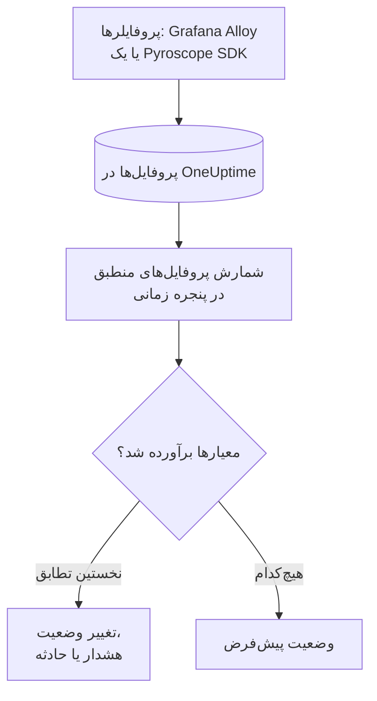

# مانیتور پروفایل‌ها

مانیتور پروفایل‌ها پروفایل‌های پیوسته‌ای را که سرویس‌های شما به OneUptime می‌فرستند و با فیلترهای شما (نوع پروفایل، سرویس، ویژگی‌ها) منطبق‌اند، در یک پنجره زمانی می‌شمارد. وقتی این شمارش معیارهای شما را برآورده کند، وضعیت مانیتور را تغییر می‌دهد، هشدار می‌سازد یا حادثه اعلام می‌کند. کاربرد اصلی آن این است که بفهمید چه وقت دادهٔ پروفایل‌گیری دیگر از یک سرویس نمی‌رسد.

> [!IMPORTANT]
> **ساخت مانیتور** در داشبورد گزینهٔ پروفایل‌ها را ندارد: هنوز فرمی برای فیلترهای آن وجود ندارد. مانیتور پروفایل‌ها را همان‌طور که در ادامه آمده از طریق [API](/docs/api-reference/api-reference) یا [Terraform](/docs/terraform/monitor-steps) بسازید. پس از ساخته شدن، معیارهای آن را می‌توانید در داشبورد، در صفحهٔ **معیارها** از همان مانیتور، ببینید و ویرایش کنید؛ فیلترهای آن فقط از طریق API یا Terraform تغییر می‌کنند.

:::cards
- [ساخت مانیتور](#ساخت-یک-مانیتور-پروفایلها): پیکربندی‌ای که از طریق API یا Terraform می‌فرستید.
- [چه چیزی را پرس‌وجو می‌کند](#چه-چیزی-را-پرسوجو-میکند): نوع‌های پروفایل، سرویس‌ها، ویژگی‌ها و پنجره.
- [معیارها](#معیارها): شرط‌هایی که می‌توانید به کار ببرید.
- [مثال کاربردی](#مثال-کاربردی-پروفایلها-دیگر-نمیرسند): بفهمید چه وقت یک سرویس دیگر پروفایل نمی‌فرستد.
:::

## چگونه کار می‌کند



هر دقیقه، OneUptime پروفایل‌هایی را که با فیلترهای مانیتور منطبق‌اند و در پنجره زمانی آن آغاز شده‌اند می‌شمارد. سپس این شمارش را از بالا به پایین با معیارهای مانیتور می‌سنجد و نخستین معیاری که منطبق شود تعیین می‌کند چه اتفاقی بیفتد. وقتی هیچ‌کدام منطبق نشود، مانیتور به وضعیت پیش‌فرض خود برمی‌گردد.

## پیش از شروع

- سرویس‌های شما دادهٔ پروفایل‌گیری پیوسته را از طریق Grafana Alloy (eBPF) یا یک Pyroscope SDK به OneUptime می‌فرستند. [پروفایل‌گیری پیوسته](/docs/telemetry/profiles) را ببینید.
- یا یک کلید API دارید که می‌تواند مانیتور بسازد، یا Terraform provider مربوط به OneUptime را راه‌اندازی کرده‌اید.
- شناسهٔ هر سرویس تله‌متری‌ای را که باید زیر نظر بگیرید، و نوع‌های پروفایلی را که می‌فرستد، می‌دانید؛ مثل `cpu`، `wall`، `alloc_objects`، `alloc_space` یا `goroutine`.

## ساخت یک مانیتور پروفایل‌ها

:::steps
### انتخاب آنچه شمرده می‌شود

پیکربندی `profileMonitor` مرحله را بنویسید. این نمونه پروفایل‌های CPU یک سرویس را در پنج دقیقهٔ گذشته می‌شمارد:

```json
{
  "profileMonitor": {
    "telemetryServiceIds": [],
    "profileTypes": ["cpu"],
    "profileType": "",
    "attributes": {},
    "lastXSecondsOfProfiles": 300
  }
}
```

شناسهٔ سرویس را در `telemetryServiceIds` بگذارید، یا برای شمردن پروفایل‌های همهٔ سرویس‌ها فهرست را خالی بگذارید. [چه چیزی را پرس‌وجو می‌کند](#چه-چیزی-را-پرسوجو-میکند) هر فیلد را توضیح می‌دهد.

### ساخت مانیتور

از طریق [API](/docs/api-reference/api-reference) یا [Terraform](/docs/terraform/monitor-steps) مانیتوری با نوع مانیتور `Profiles` و مرحله‌ای بسازید که این پیکربندی و دست‌کم یک معیار را در خود دارد. در Terraform، پیکربندی را به‌صورت ویژگی `profile_monitor` مرحله بدهید که با `jsonencode()` نوشته شده است.

### بررسی آن در داشبورد

مانیتور را از **مانیتورها** باز کنید. نخستین ارزیابی آن ظرف یک دقیقه اجرا می‌شود و وضعیتش به محض منطبق شدن یک معیار تغییر می‌کند.
:::

## چه چیزی را پرس‌وجو می‌کند

| فیلد | با چه چیزی منطبق است | پیش‌فرض |
| --- | --- | --- |
| `profileTypes` | پروفایل‌هایی از هر یک از این نوع‌ها، با تطابق دقیق، مثل `cpu`. | خالی: همهٔ نوع‌ها |
| `profileType` | پروفایل‌هایی که نوعشان این متن را دارد، بدون توجه به بزرگی و کوچکی حروف. وقتی تنظیم شده باشد، `profileTypes` نادیده گرفته می‌شود. | خالی |
| `telemetryServiceIds` | پروفایل‌های هر یک از این سرویس‌های تله‌متری. | خالی: همهٔ سرویس‌ها |
| `entityKeys` | پروفایل‌های هر یک از این میزبان‌ها، پادها، کانتینرها و دیگر موجودیت‌های زیرساخت. | خالی: همهٔ موجودیت‌ها |
| `attributes` | پروفایل‌هایی که ویژگی‌هایشان این مقادیر را دارند. | خالی: بدون شرط |
| `lastXSecondsOfProfiles` | پروفایل‌هایی که در این تعداد ثانیه پیش از ارزیابی آغاز شده‌اند. | ندارد: همیشه تنظیمش کنید، وگرنه همهٔ پروفایل‌های ذخیره‌شده شمرده می‌شوند و شمارش هرگز به ۰ نمی‌رسد |

برای اینکه یک پروفایل شمرده شود، باید با همهٔ فیلترهایی که تنظیم کرده‌اید منطبق باشد.

## چگونه ارزیابی می‌شود

- **هر دقیقه.** مانیتور پروفایل‌ها را پراب‌ها بررسی نمی‌کنند، پس بازه‌ای برای تنظیم ندارد و صفحهٔ **پراب‌ها و بازه** هم ندارد.
- **یک عدد در هر ارزیابی.** مانیتور پروفایل‌هایی را می‌شمارد که با همهٔ فیلترها منطبق‌اند و در `lastXSecondsOfProfiles` آغاز شده‌اند. پروفایلر در فاصله‌های منظم بارگذاری می‌کند، پس پنجره را آن‌قدر بزرگ بگیرید که چند بارگذاری در آن جا شود.
- **نبود پروفایل یعنی شمارش ۰.** سرویسی که پروفایلرش دیگر بارگذاری نمی‌کند ۰ تولید می‌کند.
- **قطعی خود OneUptime سکوت نیست.** تا وقتی پنجره زمانی شامل زمانی است که خود OneUptime داده دریافت نمی‌کرد (در حال راه‌اندازی دوباره، ارتقا یا جبران عقب‌ماندگی بود)، بررسی صبر می‌کند: وضعیت تغییر نمی‌کند و هیچ حادثه یا هشداری باز یا رفع نمی‌شود. [وقتی OneUptime داده دریافت نمی‌کند](/docs/monitor/when-oneuptime-is-not-receiving) را ببینید.
- **معیارها از بالا به پایین.** نخستین معیاری که منطبق شود تصمیم می‌گیرد، پس شدیدترین را اول بگذارید.

هر تغییر وضعیت، همراه با دلیل آن، در **خط زمانی وضعیت** مانیتور ثبت می‌شود.

## معیارها

معیارهای مانیتور پروفایل‌ها یک فیلتر دارند، **Profile Count**: تعداد پروفایل‌هایی که در پنجره منطبق شدند. آن را با یک مقدار مقایسه کنید:

| شرط فیلتر | منطبق است وقتی شمارش پروفایل… |
| --- | --- |
| **Greater Than** | بیشتر از مقدار باشد |
| **Greater Than Or Equal To** | برابر مقدار یا بیشتر از آن باشد |
| **Less Than** | کمتر از مقدار باشد |
| **Less Than Or Equal To** | برابر مقدار یا کمتر از آن باشد |
| **Equal To** | دقیقاً برابر مقدار باشد |
| **Not Equal To** | هر چیزی جز مقدار باشد |

شمارش پروفایل‌ها شرط ناهنجاری ندارد: مبنایی برای مقایسه با آن‌ها وجود ندارد.

## مثال کاربردی: پروفایل‌ها دیگر نمی‌رسند

سرویس checkout یک Pyroscope SDK اجرا می‌کند که پروفایل‌های CPU را بارگذاری می‌کند. می‌خواهید وقتی بارگذاری‌ها پنج دقیقه متوقف شوند، حادثه‌ای اعلام شود:

- `profileTypes`: `["cpu"]`، `telemetryServiceIds`: سرویس checkout، `lastXSecondsOfProfiles`: `300`
- معیار ۱: **Profile Count** **Equal To** `0`: مانیتور را آفلاین علامت بزن و حادثه اعلام کن
- معیار ۲: **Profile Count** **Greater Than** `0`: مانیتور را آنلاین علامت بزن

تا وقتی SDK بارگذاری می‌کند، هر ارزیابی چند پروفایل می‌شمارد و معیار ۲ مانیتور را آنلاین نگه می‌دارد. وقتی سرویس بدون SDK مستقر شود، شمارش پنج دقیقه پس از آخرین بارگذاری به ۰ می‌رسد، معیار ۱ منطبق می‌شود و حادثه اعلام می‌شود. نخستین بارگذاری پس از رفع مشکل شمارش را دوباره به بالای ۰ می‌برد، و اگر **رفع خودکار حادثه** برای آن روشن باشد، حادثه خودبه‌خود رفع می‌شود.

## رفع اشکال

:::details مانیتور ۰ می‌شمارد، اما پروفایل‌ها در OneUptime دیده می‌شوند
فیلترها را با پروفایل‌هایی که می‌بینید مقایسه کنید: `profileTypes` باید دقیقاً با نوع منطبق باشد و `telemetryServiceIds` باید شناسه‌های درست سرویس‌ها را داشته باشد. یک `lastXSecondsOfProfiles` کوتاه هم ممکن است میان دو بارگذاری بیفتد.
:::

:::details پروفایل‌ها در ساخت مانیتور نیست
این رفتار مورد انتظار است: داشبورد هنوز فرمی برای فیلترهای مانیتور پروفایل‌ها ندارد. آن را همان‌طور که در [ساخت یک مانیتور پروفایل‌ها](#ساخت-یک-مانیتور-پروفایلها) آمده از طریق API یا Terraform بسازید.
:::

## گام‌های بعدی

:::cards
- [پروفایل‌گیری پیوسته](/docs/telemetry/profiles): پروفایل‌ها را از Grafana Alloy یا یک Pyroscope SDK بفرستید.
- [مراحل مانیتور](/docs/terraform/monitor-steps): پیکربندی مرحله را از Terraform بدهید.
- [مانیتور ترِیس‌ها](/docs/monitor/traces-monitor): روی اسپن‌های ناموفق هشدار بگیرید.
- [مانیتور متریک‌ها](/docs/monitor/metrics-monitor): روی CPU، حافظه و متریک‌های دیگر هشدار بگیرید.
:::
