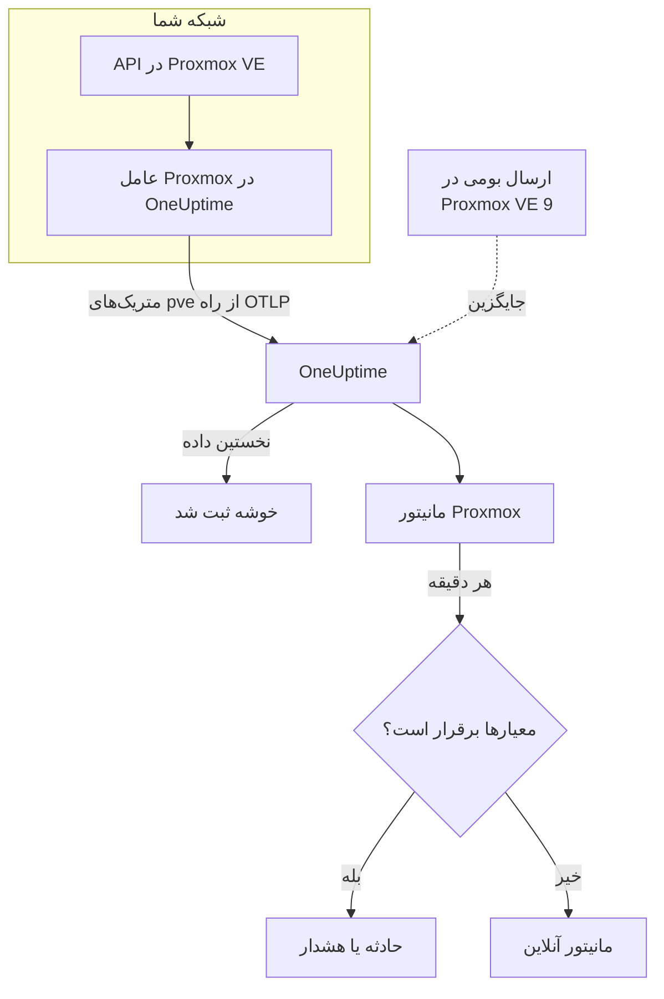

# مانیتور Proxmox

مانیتور Proxmox یک خوشه Proxmox VE را زیر نظر می‌گیرد – گره‌ها، ماشین‌های مجازی و کانتینرهای LXC، ذخیره‌سازی، وضعیت HA، پوشش کارهای پشتیبان‌گیری و همتاسازی ذخیره‌سازی آن – و وقتی گره‌ای آفلاین می‌شود، مهمانی متوقف می‌شود یا ذخیره‌سازی در حال پر شدن است به شما خبر می‌دهد. این مانیتور متریک‌های `pve_*` را می‌خواند که عامل Proxmox در OneUptime جمع می‌کند، پس هیچ چیز از بیرون کاوش نمی‌شود.

:::cards
- [ساخت مانیتور](#ساخت-یک-مانیتور-proxmox): شش گام در داشبورد.
- [الگوها](#الگوهای-هشدار-آماده): یازده هشدار آماده، یک حادثه به ازای هر گره، مهمان یا حجم.
- [هویت منبع](#هویت-منبع): چگونه یک گره، مهمان یا حجم ذخیره‌سازی را هدف بگیرید.
- [متریک‌ها](#متریکهای-جمعآوریشده): هر سری `pve_*` که مانیتور می‌تواند بر پایه‌اش هشدار دهد.
:::

## چگونه کار می‌کند

عامل Proxmox در OneUptime روی ماشینی اجرا می‌شود که به API در Proxmox VE دسترسی دارد. هر ۳۰ ثانیه prometheus-pve-exporter را با گردآورنده‌های خوشه و گره می‌خراشد، روی هر سری برچسب منبعی را که توصیف می‌کند می‌زند، و متریک‌ها را از راه OTLP با نام خوشه، `proxmox.cluster.name`، به OneUptime می‌فرستد. نخستین داده خوشه را ثبت می‌کند. Proxmox VE 9 و نسخه‌های بعدی می‌توانند به جای آن، بی‌آنکه چیزی نصب شود، متریک‌ها را به‌صورت بومی بفرستند؛ [ارسال بومی](#ارسال-بومی-در-proxmox-ve) را ببینید.

مانیتور Proxmox به یک خوشه وابسته است. هر دقیقه پرس‌وجوی خود را روی متریک‌های آن خوشه اجرا می‌کند و نتیجه را با معیارهایش مقایسه می‌کند.

## پیش از شروع

- **عامل Proxmox را نصب کنید**، جایی که به API در Proxmox VE دسترسی دارد، با یک توکن API فقط‌خواندنی. [راهنمای عامل Proxmox](/docs/telemetry/proxmox) توکن، نصب و ارسال بومی را پوشش می‌دهد.
- **بررسی کنید خوشه ثبت شده باشد.** حدود یک دقیقه پس از نخستین خراش، با نام `PROXMOX_CLUSTER_NAME` عامل زیر **محصولات → زیرساخت → Proxmox → همه خوشه‌ها** پدیدار می‌شود.

## ساخت یک مانیتور Proxmox

:::steps
### یک مانیتور تازه شروع کنید

به **مانیتورها** بروید و روی **ساخت مانیتور** کلیک کنید.

### Proxmox را برگزینید

زیر **نوع مانیتور**، روی **انواع دیگر مانیتور** کلیک کنید و **Proxmox** را زیر **زیرساخت** برگزینید، یا در کادر جست‌وجو `proxmox` را تایپ کنید. یک **نام** وارد کنید – در عنوان حادثه‌ها و هشدارها به کار می‌رود – و روی **بعدی** کلیک کنید.

### خوشه را برگزینید

زیر **Proxmox Monitor Configuration**، خوشه را از **Proxmox Cluster** برگزینید. هر خوشه‌ای که داده فرستاده در فهرست است.

### برگزینید چه چیزی پایش شود

یکی از سه زبانه را برگزینید:

- **Quick Setup** – روی یک [الگو](#الگوهای-هشدار-آماده) کلیک کنید. متریک‌ها، فیلترها، تجمیع، بازه زمانی و آستانه‌ها را تعیین می‌کند و معیارهای زیر را با معیارهای خودش جایگزین می‌کند. همچنان می‌توانید **بازه زمانی** را تغییر دهید.
- **Custom Metric** – یک متریک از **Proxmox Metric** برگزینید، سپس **تجمیع** و **بازه زمانی** را تعیین کنید. [فیلترها](#تنظیمات-مانیتور) آن را به یک نوع منبع یا یک منبع محدود می‌کنند.
- **پیشرفته** – پرس‌وجوها و فرمول‌ها را خودتان زیر **انتخاب متریک‌ها** بسازید، برای نمونه درصد حافظه از `pve_memory_usage_bytes / pve_memory_size_bytes`. برای سنجش جداگانه هر منبع از **Group by** `id` استفاده کنید.

### معیارها را بررسی کنید

هر معیار را زیر **معیارهای مانیتور** باز کنید و **متریک**، **تجمیع**، **شرط** و **Threshold** آن را بررسی کنید. الگو این‌ها را پر می‌کند. با **Custom Metric** یا **پیشرفته**، مانیتور با [معیارهای پیش‌فرض](#معیارهای-پیشفرض) شروع می‌شود که فقط افت متریک به صفر را می‌بینند، پس آستانه خودتان را تعیین کنید.

### مانیتور را بسازید

روی **ساخت مانیتور** کلیک کنید. OneUptime صفحه مانیتور را باز می‌کند و آن را هر دقیقه ارزیابی می‌کند. حادثه‌ها و هشدارهایی که باز می‌کند در صفحه‌های **حوادث** و **هشدارها**ی خوشه هم فهرست می‌شوند.
:::

> [!TIP]
> برای راه‌اندازی هم‌زمان چند الگو، خوشه را از **محصولات → زیرساخت → Proxmox** باز کنید و به **Recommendations** بروید. الگوهای دلخواه و کسانی را که باید خبر داده شوند برگزینید، و OneUptime به ازای هر الگو یک مانیتور می‌سازد.

## تنظیمات مانیتور

| فیلد | زبانه | چه می‌کند |
| --- | --- | --- |
| **Proxmox Cluster** | همه | الزامی. هر پرس‌وجو را به `resource.proxmox.cluster.name` محدود می‌کند. |
| **دامنه منبع** | Custom Metric، پیشرفته | اختیاری. **گره**، **Guest (VM / container)**، **ذخیره‌سازی** یا **خوشه** – تطابق دقیق با `pve.scope`. |
| **PVE ID** | Custom Metric، پیشرفته | اختیاری. تطابق دقیق با `pve.id`: نام یک گره (`pve1`)، یک VMID (`100`) یا `<node>/<storage>` (`pve1/local`). برای هدف گرفتن یک منبع، آن را با یک دامنه همراه کنید. |
| **نام گره** | Custom Metric، پیشرفته | اختیاری. فقط سری‌های خود گره (`pve.scope = node` و `pve.id`). نمی‌تواند مهمان‌ها یا ذخیره‌سازی روی آن گره را برگزیند. |
| **Guest ID** | Custom Metric، پیشرفته | اختیاری. تطابق دقیق با برچسب خام `id`، مانند `qemu/100` یا `lxc/101`. وقتی تعیین شود، فیلترهای دیگر نادیده گرفته می‌شوند. |
| **Proxmox Metric** | Custom Metric | یک متریک از [فهرست](#متریکهای-جمعآوریشده). |
| **تجمیع** | Custom Metric | شیوه ترکیب نمونه‌ها: **میانگین**، **بیشینه**، **کمینه**، **جمع** یا **تعداد**. از تجمیع معمول متریک شروع می‌شود. |
| **بازه زمانی** | همه | پنجره غلتانی که پرس‌وجو می‌خواند، از **Past 1 Minute** تا **Past 365 Days**. مانیتور تازه از **Past 1 Minute** شروع می‌شود؛ الگوها پنجره خودشان را تعیین می‌کنند. |
| **انتخاب متریک‌ها** | پیشرفته | سازنده پرس‌وجو: **متریک**، **Aggregate by**، **Filter by attributes**، **Group by**، به همراه **افزودن متریک** و **افزودن فرمول** برای ترکیب پرس‌وجوها. |

## هویت منبع

هر سری یک برچسب نقطه‌داده `id` دارد که منبع Proxmox مربوط به آن را نام می‌برد:

| مقدار `id` | منبع |
| --- | --- |
| `node/<name>` | یک گره خوشه، برای نمونه `node/pve1`. |
| `qemu/<vmid>` | یک ماشین مجازی QEMU، برای نمونه `qemu/100`. |
| `lxc/<vmid>` | یک کانتینر LXC، برای نمونه `lxc/101`. |
| `storage/<node>/<storage>` | یک حجم ذخیره‌سازی روی یک گره، برای نمونه `storage/pve1/local`. |

دو استثنا: سری‌های همتاسازی (`pve_replication_*`) شناسه **کار** همتاسازی را در `id` دارند (برای نمونه `100-0`)، و `pve_not_backed_up_total` که برای کل خوشه است اصلاً `id` ندارد.

فیلترها بر پایه برابری تطبیق می‌دهند، نه پیشوند، پس عامل `id` را به سه ویژگی هم تقسیم می‌کند که می‌توانید رویشان فیلتر کنید. الگوها به آن‌ها تکیه دارند:

| ویژگی | مقدارها | برای `qemu/100` |
| --- | --- | --- |
| `pve.scope` | `node`، `guest`، `storage`، `cluster` (`qemu` و `lxc` هر دو `guest` هستند) | `guest` |
| `pve.type` | `node`، `qemu`، `lxc`، `storage` | `qemu` |
| `pve.id` | هر چه پس از نخستین `/` در `id` می‌آید (`pve1`، `100`، `pve1/local`) | `100` |

برای یک نوع منبع روی `pve.scope` یا `pve.type` فیلتر کنید، برای یک منبع روی `pve.id` یا `id`، و برای سنجش جداگانه هر منبع بر پایه `id` گروه‌بندی کنید.

## الگوهای هشدار آماده

**Quick Setup** ۱۱ الگو ارائه می‌دهد. هر کدام یک مانیتور کامل می‌سازد – پرس‌وجوها، فیلترهای ویژگی، یک گروه‌بندی، یک معیار که فعال می‌شود و یکی که بهبود می‌یابد. بیشترشان بر پایه `id` گروه‌بندی می‌کنند، پس هر گره، مهمان، حجم یا کار حادثه و هشدار خودش را می‌گیرد. آستانه‌ها نقطه شروع‌اند و می‌توانید ویرایششان کنید.

مگر جدول چیز دیگری بگوید، الگوها ۵ دقیقه گذشته را می‌خوانند. یک معیار فقط وقتی فعال می‌شود که شرط در همه دقیقه‌های پنجره‌اش برقرار باشد، و یک معیار آستانه‌ای ۱۰٪ آن‌سوی آستانه‌اش بهبود می‌یابد تا مقداری که حول مرز نوسان دارد مدام جابه‌جا نشود.

| الگو | شدت | چه چیزی را پایش می‌کند | چه وقت فعال می‌شود | چه وقت بهبود می‌یابد |
| --- | --- | --- | --- | --- |
| Node Offline | بحرانی | `pve_up` برای `pve.scope = node`، Min به ازای هر `id` | کمتر از ۱ | برابر ۱ |
| Guest Down | Warning | `pve_up` و `pve_onboot_status` برای `pve.scope = guest`، Min به ازای هر `id` | `pve_up` کمتر از ۱ است در حالی که `pve_onboot_status` برابر ۱ است | `pve_up` دوباره ۱ شود، یا اجرا هنگام راه‌اندازی خاموش شود |
| Cluster Quorum at Risk | بحرانی | `pve_up` ÷ `pve_node_info` × ۱۰۰ برای `pve.scope = node` (هر دو جمع): سهم گره‌های آنلاین | ۵۰٪ یا کمتر | بیش از ۵۵٪ |
| High Node CPU Usage | Warning | `pve_cpu_usage_ratio` برای `pve.scope = node`، Avg به ازای هر `id` | بیش از ۰٫۹ (۹۰٪ هسته‌های گره) | ۰٫۸۱ یا کمتر |
| High Node Memory Usage | Warning | `pve_memory_usage_bytes` ÷ `pve_memory_size_bytes` × ۱۰۰ برای `pve.scope = node`، به ازای هر `id` | بیش از ۸۵٪ | ۷۶٫۵٪ یا کمتر |
| High Guest CPU Usage | Warning | `pve_cpu_usage_ratio` برای `pve.scope = guest`، Avg به ازای هر `id`، ۱۵ دقیقه گذشته | بیش از ۰٫۹۵ (۹۵٪ vCPUهای آن) در تمام ۱۵ دقیقه | ۰٫۸۵۵ یا کمتر |
| Storage Near Full | Warning | `pve_disk_usage_bytes` ÷ `pve_disk_size_bytes` × ۱۰۰ برای `pve.scope = storage`، به ازای هر `id` | بیش از ۸۵٪ | ۷۶٫۵٪ یا کمتر |
| Container Root Disk Near Full | Warning | همان نسبت دیسک برای `pve.type = lxc`، به ازای هر `id` | بیش از ۹۰٪ | ۸۱٪ یا کمتر |
| HA Resource in Error State | بحرانی | `pve_ha_state` برای `state = error`، Max به ازای هر `id` | بیش از ۰ | برابر ۰ |
| Guest Not Backed Up | Warning | `pve_not_backed_up_total`، Max (یک سری برای کل خوشه) | بیش از ۰ | برابر ۰ |
| Replication Failing | بحرانی | `pve_replication_failed_syncs`، Max به ازای هر `id` (شناسه کار) | بیش از ۰ | برابر ۰ |

**شدت** برچسبی است که فهرست انتخاب نشان می‌دهد. حادثه و هشداری که یک الگو می‌سازد از شدیدترین شدت حادثه و هشدار پروژه شما شروع می‌شوند؛ آن‌ها را در معیارها تغییر دهید.

- **الگوهای از کار افتادن از کمینه استفاده می‌کنند**، پس یک خراش که در آن منبع از کار افتاده بود آن‌ها را فعال می‌کند، به جای اینکه پشت خراش‌هایی که منبع در آن‌ها روشن بود پنهان شود.
- **Guest Down** فقط مهمان‌هایی را می‌بیند که قرار است هنگام راه‌اندازی اجرا شوند، پس مهمانی که عمداً متوقفش کرده‌اید هرگز کسی را خبر نمی‌کند.
- **Cluster Quorum at Risk** یک تقریب است: pve-exporter متریکی از corosync ندارد، پس گره‌های آنلاین را می‌شمارد.
- **High Guest CPU Usage** از الگوی گره بالاتر و کندتر است: مهمان قرار است vCPUهایش را مصرف کند، پس فقط مهمانی که هرگز پایین نمی‌آید کسی را خبر می‌کند.
- **فرمول‌های نسبت** از هر دو طرف **جمع** می‌گیرند. هر دو از یک خراش می‌آیند، پس نتیجه یک درصد واقعی است.
- **Container Root Disk Near Full** ماشین‌های مجازی QEMU را کنار می‌گذارد: بدون عامل مهمان QEMU، مصرف دیسک آن‌ها ۰ خوانده می‌شود.
- **Guest Not Backed Up** فقط عضویت در کارهای پشتیبان‌گیری را پوشش می‌دهد. pve-exporter نمی‌گوید پشتیبان‌گیری اجرا شده یا موفق بوده است؛ برای فهرست کردن مهمان‌ها، `pve_not_backed_up_info` را بر پایه `id` گروه‌بندی کنید.
- **کهنگی همتاسازی** (اکنون منهای آخرین همگام‌سازی) را نمی‌توان مبنای هشدار قرار داد، چون معیارها حساب زمانی ندارند. صفحه **نمای کلی** خوشه آن را نشان می‌دهد؛ به جای آن با **Replication Failing** هشدار دهید.

### ارسال بومی در Proxmox VE

Proxmox VE 9 و نسخه‌های بعدی می‌توانند از راه سرور متریک OpenTelemetry داخلی خود، بی‌آنکه چیزی نصب شود، متریک‌ها را بفرستند – [راهنمای عامل Proxmox](/docs/telemetry/proxmox) را ببینید. OneUptime این ارسال را به همان سری‌های `pve_*` تبدیل می‌کند، پس فهرست متریک‌ها و الگوهای CPU، حافظه و ذخیره‌سازی با آن کار می‌کنند.

**Node Offline** و **Cluster Quorum at Risk** هم کار می‌کنند: هر گره فقط وضعیت خودش را می‌فرستد، پس گره‌ای که دیگر گزارش نمی‌دهد از سوی گره‌هایی که هنوز زنده‌اند از کار افتاده (`pve_up` = 0) گزارش می‌شود – [گره‌ای که دیگر گزارش نمی‌دهد](/docs/telemetry/proxmox#گرهای-که-دیگر-گزارش-نمیدهد) را ببینید. **Guest Down**، **HA Resource in Error State**، **Guest Not Backed Up** و **Replication Failing** به داده‌هایی نیاز دارند که فقط عامل جمع می‌کند.

## متریک‌های جمع‌آوری‌شده

عامل هر ۳۰ ثانیه prometheus-pve-exporter را با هر دو گردآورنده خوشه و گره می‌خراشد، که گردآورنده‌های `backup-info` و `replication` در صادرکننده را هم پوشش می‌دهد (هر دو به‌طور پیش‌فرض روشن‌اند).

### در دسترس بودن

| متریک | یکا | توضیح |
| --- | --- | --- |
| `pve_up` | — | وقتی گره یا مهمان روشن یا در حال اجراست ۱، وگرنه ۰. |
| `pve_uptime_seconds` | ثانیه | مدت روشن‌بودن گره یا مهمان. |
| `pve_version_info` | تعداد | انتشار Proxmox VE، در برچسب‌هایش. همیشه ۱. |

### گره

| متریک | یکا | توضیح |
| --- | --- | --- |
| `pve_node_info` | تعداد | فراداده گره، همیشه ۱. برای شمردن گره‌هایی که گزارش می‌دهند جمعش بزنید. |
| `pve_cpu_usage_ratio` | نسبت | CPU در حال استفاده به‌صورت نسبتی ۰ تا ۱ از CPU در دسترس. |
| `pve_cpu_usage_limit` | هسته | CPU در دسترس، بر حسب هسته. برای یک مهمان، vCPUهای آن. |
| `pve_memory_usage_bytes` | بایت | حافظه در حال استفاده. |
| `pve_memory_size_bytes` | بایت | کل حافظه. |

سری‌های CPU و حافظه برای هر مهمان هم، روی شناسه‌های `qemu/*` و `lxc/*`، گزارش می‌شوند.

### مهمان

| متریک | یکا | توضیح |
| --- | --- | --- |
| `pve_guest_info` | تعداد | فراداده مهمان (نام، گره، نوع `qemu` یا `lxc`) در برچسب‌ها. همیشه ۱. |
| `pve_network_receive_bytes` | بایت | بایت‌های دریافتی مهمان. شمارنده‌ای در طول عمر. |
| `pve_network_transmit_bytes` | بایت | بایت‌های ارسالی مهمان. شمارنده‌ای در طول عمر. |
| `pve_disk_read_bytes` | بایت | بایت‌هایی که مهمان از دیسک خوانده است. شمارنده‌ای در طول عمر. |
| `pve_disk_write_bytes` | بایت | بایت‌هایی که مهمان روی دیسک نوشته است. شمارنده‌ای در طول عمر. |
| `pve_onboot_status` | تعداد | وقتی مهمان هنگام راه‌اندازی گره اجرا می‌شود ۱. مهمان متوقفی که این گزینه را دارد معمولاً یک از کار افتادگی برنامه‌ریزی‌نشده است. |

### ذخیره‌سازی

| متریک | یکا | توضیح |
| --- | --- | --- |
| `pve_disk_usage_bytes` | بایت | بایت‌های مصرف‌شده روی دیسک یا ذخیره‌سازی. برای مهمان QEMU، مگر عامل مهمان QEMU نصب باشد، ۰ خوانده می‌شود. |
| `pve_disk_size_bytes` | بایت | اندازه کل دیسک یا ذخیره‌سازی. |
| `pve_storage_info` | تعداد | فراداده ذخیره‌سازی، همیشه ۱. برای شمردن حجم‌های ذخیره‌سازی جمعش بزنید. |

### HA

| متریک | یکا | توضیح |
| --- | --- | --- |
| `pve_ha_state` | — | یک سری به ازای هر وضعیت HA (`started`، `stopped`، `error`، …) برای هر منبع HA، که روی وضعیت فعلی‌اش ۱ است. برای هشدار بر پایه یک وضعیت، روی برچسب `state` فیلتر کنید. |

### پشتیبان‌گیری

از گردآورنده `backup-info` در صادرکننده، در سطح خوشه. این‌ها فقط پوشش **کار**های پشتیبان‌گیری را گزارش می‌دهند:

| متریک | یکا | توضیح |
| --- | --- | --- |
| `pve_not_backed_up_total` | تعداد | مهمان‌هایی که در هیچ کار پشتیبان‌گیری نیستند. یک سری برای کل خوشه بدون `id`. |
| `pve_not_backed_up_info` | تعداد | یک سری به ازای هر مهمان بی‌پوشش، همیشه ۱، با برچسب `id` مهمان. به محض اینکه مهمان به یک کار پشتیبان‌گیری بپیوندد ناپدید می‌شود. |

### همتاسازی

از گردآورنده `replication` در صادرکننده، در سطح گره. این سری‌ها فقط وقتی وجود دارند که خوشه کارهای همتاسازی داشته باشد، و شناسه کار را در `id` دارند:

| متریک | یکا | توضیح |
| --- | --- | --- |
| `pve_replication_failed_syncs` | تعداد | تلاش‌های همگام‌سازی ناموفق پشت سر هم. بیش از ۰ یعنی همتا در حال کهنه شدن است. |
| `pve_replication_duration_seconds` | ثانیه | مدت زمانی که آخرین همگام‌سازی طول کشید. |
| `pve_replication_last_sync_timestamp_seconds` | ثانیه | زمان Unix آخرین همگام‌سازی **موفق**. |
| `pve_replication_last_try_timestamp_seconds` | ثانیه | زمان Unix آخرین **تلاش**. جدیدتر بودن از آخرین همگام‌سازی یعنی تازه‌ترین تلاش ناموفق بوده است. |
| `pve_replication_next_sync_timestamp_seconds` | ثانیه | زمان Unix همگام‌سازی برنامه‌ریزی‌شده بعدی. |
| `pve_replication_info` | تعداد | فراداده کار – نوع، مبدأ، مقصد، مهمان – در برچسب‌ها. همیشه ۱. |

## معیارهای مانیتورینگ

یک معیار یکی از پرس‌وجوها یا فرمول‌های مانیتور را با یک آستانه مقایسه می‌کند. معیارهای مانیتور Proxmox **نوع فیلتر** ندارند: هر قاعده مقدار متریک را با این فیلدها بررسی می‌کند.

| فیلد | چه می‌کند |
| --- | --- |
| **متریک** | پرس‌وجو یا فرمولی که بررسی می‌شود، بر پایه نام متغیرش. |
| **تجمیع** | اینکه مقدارهای پنجره چطور به یک پاسخ تبدیل می‌شوند: **میانگین**، **جمع**، **Maximum Value**، **Minimum Value**، **All Values** (همه مقدارها باید جور باشند) یا **Any Value** (یکی کافی است). |
| **شرط** | **Greater Than**، **Less Than**، **Greater Than Or Equal To**، **Less Than Or Equal To** یا **Equal To** – یا یک شرط ناهنجاری: **Anomalously High**، **Anomalously Low** یا **Anomalous**. |
| **Threshold** | مقداری که با آن مقایسه می‌شود. وقتی متریک یکا دارد، فهرستی از یکاها کنارش هست. برای شرط‌های ناهنجاری نشان داده نمی‌شود. |
| **حساسیت** | فقط شرط‌های ناهنجاری. **پایین** (۴σ)، **متوسط** (۳σ، پیش‌فرض) یا **بالا** (۲σ). |
| **پنجره مبنا** | فقط شرط‌های ناهنجاری. ۱۴ روز (پیش‌فرض)، ۲۸، ۶۰ یا ۹۰ روز سابقه. |
| **اگر داده‌ای نبود** | زیر **فیلدهای بیشتر**. وقتی پنجره هیچ نمونه‌ای ندارد چه شود: **Ignore** (پیش‌فرض)، **Treat As Zero** یا **تریگر**. |

شرط‌های ناهنجاری هر مقدار را با همان ساعت از هفته در خط مبنا مقایسه می‌کنند. تا وقتی پنجره مبنا سابقه کافی نداشته باشد، در وضعیت «Learning» می‌مانند و چیزی پدید نمی‌آورند.

هر معیار همچنین می‌گوید وقتی برقرار شد چه باید کرد: تغییر وضعیت مانیتور، ساختن یک هشدار یا اعلام یک حادثه. معیارها از بالا به پایین بررسی می‌شوند و نخستین معیاری که برقرار شود تصمیم می‌گیرد.

### معیارهای پیش‌فرض

مانیتوری که از الگو نمی‌سازید با دو معیار شروع می‌شود:

| ترتیب | معیار | وقتی برقرار است که | سپس |
| --- | --- | --- | --- |
| ۱ | Check if _monitor name_ is offline | هر مقداری از نخستین پرس‌وجو `0` باشد | مانیتور را **آفلاین** علامت می‌زند و حادثه «_monitor name_ is offline» را اعلام می‌کند، که با بهبود مانیتور خودش برطرف می‌شود. |
| ۲ | Check if _monitor name_ is online | هر مقداری بیش از `0` باشد | مانیتور را **عملیاتی** علامت می‌زند. |

> [!IMPORTANT]
> سکوت با هیچ‌یک از دو معیار جور نیست: خوشه‌ای که دیگر داده نمی‌فرستد مانیتور را همان‌طور که بود رها می‌کند. برای اینکه وقتی داده قطع شد خبردار شوید، **اگر داده‌ای نبود** را در یک معیار روی **تریگر** بگذارید. زمانی که خود OneUptime داده دریافت نمی‌کرد هرگز «بدون داده» به حساب نمی‌آید: بررسی‌ای که پنجره‌اش چنین زمانی را در بر دارد به جای آن صبر می‌کند، همان‌طور که [وقتی OneUptime داده دریافت نمی‌کند](/docs/monitor/when-oneuptime-is-not-receiving) توضیح می‌دهد.

## رفع اشکال

:::details خوشه در فهرست Proxmox Cluster نیست
خوشه‌ها خودشان از روی داده‌های عامل ثبت می‌شوند. بررسی کنید عامل در حال اجرا باشد و داده بفرستد ([راهنمای عامل Proxmox](/docs/telemetry/proxmox) را ببینید)، و `PROXMOX_CLUSTER_NAME` تعیین شده باشد.
:::

:::details متریک‌های مهمان وجود ندارند
سری‌های مهمان از گردآورنده خوشه در صادرکننده می‌آیند که پیکربندی همراه آن را با پارامتر خراش `cluster=1` روشن می‌کند. اگر پیکربندی گردآورنده را تغییر داده‌اید، آن را برگردانید.
:::

:::details High Node CPU Usage هرگز فعال نمی‌شود
الگو `pve_cpu_usage_ratio` را به ازای هر `id` میانگین می‌گیرد، پس هر گره جداگانه بررسی می‌شود. اگر پرس‌وجوی خودتان را ساخته‌اید، آن را بر پایه `id` گروه‌بندی کنید: میانگین همه گره‌ها را گره‌های بیکار پایین می‌کشند.
:::

:::details Node Offline برای گره‌ای که از خوشه برداشته‌اید مدام فعال می‌شود
با ارسال بومی در Proxmox VE، گره‌ای که از خوشه بیرون آورده شده درست مانند گره‌ای به نظر می‌رسد که از کار افتاده است: دیگر گزارش نمی‌دهد، پس گره‌هایی که هنوز زنده‌اند مدام آن را از کار افتاده گزارش می‌کنند. صفحه گره را باز کنید و روی **Remove Node** کلیک کنید – گره حذف می‌شود و هشدارش برطرف می‌شود. وگرنه تا ۷ روز آفلاین می‌ماند. عامل این مشکل را ندارد: از خوشه می‌پرسد و خوشه دیگر آن گره را فهرست نمی‌کند.
:::

:::details متریک‌های پشتیبان‌گیری یا همتاسازی وجود ندارند
`pve_not_backed_up_*` از گردآورنده `backup-info` در صادرکننده و `pve_replication_*` از گردآورنده `replication` آن می‌آیند. هر دو به‌طور پیش‌فرض روشن‌اند و با پارامترهای خراش `cluster=1` و `node=1` در پیکربندی همراه پوشش داده می‌شوند. اگر صادرکننده خودتان را اجرا می‌کنید، بررسی کنید آن‌ها را خاموش نکرده باشید. `pve_replication_*` فقط وقتی وجود دارد که خوشه کارهای همتاسازی ذخیره‌سازی داشته باشد.
:::

:::details شمارنده‌هایی مانند pve_network_receive_bytes فقط افزایش می‌یابند
سری‌های I/O شبکه و دیسک شمارنده‌هایی در طول عمرند، و معیارها مقدارهای خام را مقایسه می‌کنند: عملگر نرخ وجود ندارد، و **Convert to per-second rate** در سازنده پرس‌وجو فقط نمودار را تغییر می‌دهد. آن‌ها را به‌صورت نرخ در نمودار نشان دهید، یا با یک فرمول بر پایه رشدشان هشدار دهید، مانند یک پرس‌وجوی **بیشینه** منهای یک پرس‌وجوی **کمینه** از همان شمارنده.
:::

## گام‌های بعدی

:::cards
- [عامل Proxmox](/docs/telemetry/proxmox): عامل را نصب کنید، یا ارسال بومی را راه‌اندازی کنید.
- [مانیتور Ceph](/docs/monitor/ceph-monitor): ذخیره‌سازی Ceph پشت یک خوشه Proxmox را پایش کنید.
- [مانیتور VMware](/docs/monitor/vmware-monitor): همین نوع مانیتور برای vSphere.
- [نمای کلی حوادث](/docs/incidents/index): پس از آنکه یک معیار حادثه‌ای اعلام کرد چه اتفاقی می‌افتد.
:::
