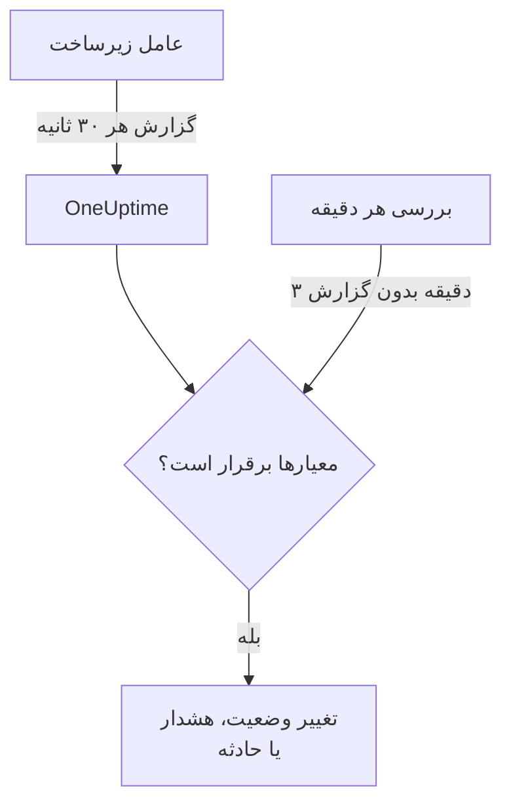

# مانیتور سرور / ماشین مجازی

مانیتور Server / VM یک ماشین را از راه عامل زیرساخت OneUptime (`oneuptime-infrastructure-agent`) زیر نظر می‌گیرد؛ سرویس کوچکی که هر ۳۰ ثانیه CPU، حافظه، دیسک‌ها، بار، شبکه و فرایندهای در حال اجرا را به OneUptime گزارش می‌دهد. این صفحه نشان می‌دهد چطور عامل را به یک مانیتور Server / VM وصل کنید، عامل چه چیزهایی گزارش می‌دهد، و چطور معیارهایی بنویسید که تعیین می‌کنند سرور کی آنلاین و کی آفلاین است.

> [!IMPORTANT]
> **ساخت مانیتور** دیگر گزینه **Server / VM** را ارائه نمی‌دهد. مانیتورهای Server / VM که از قبل دارید همچنان کار می‌کنند و همه مطالب این صفحه درباره آن‌ها صدق می‌کند. برای پایش یک سرور تازه، به جای آن یک [مانیتور میزبان](/docs/monitor/host-monitor) بسازید: این مانیتور بر پایه متریک‌های میزبان که [کالکتور OpenTelemetry روی میزبان](/docs/telemetry/host-otel-collector) می‌فرستد هشدار می‌دهد.

:::cards
- [اتصال عامل](#اتصال-عامل): نصبش کنید، کلید محرمانه مانیتور را به آن بدهید و اجرایش کنید.
- [آنچه عامل گزارش می‌دهد](#آنچه-عامل-گزارش-میدهد): CPU، حافظه، دیسک‌ها، بار، شبکه و فرایندها.
- [معیارهای مانیتورینگ](#معیارهای-مانیتورینگ): تعیین کنید سرور کی آنلاین یا آفلاین به حساب بیاید.
- [رفع اشکال](#رفع-اشکال): عامل گزارش نمی‌دهد، یا مانیتور هرگز آفلاین نمی‌شود.
:::

## چگونه کار می‌کند

عامل به‌عنوان یک سرویس سیستمی اجرا می‌شود. هر ۳۰ ثانیه گزارشی جمع می‌کند و آن را، امضاشده با کلید محرمانه مانیتور، به نشانی OneUptime شما می‌فرستد. OneUptime اعداد را به‌عنوان متریک‌های مانیتور ذخیره می‌کند و گزارش را با معیارهای مانیتور می‌سنجد.

سکوت جداگانه بررسی می‌شود. OneUptime هر دقیقه معیارهای **Is Online** هر مانیتور Server / VM را که ۳ دقیقه یا بیشتر گزارشی نفرستاده دوباره ارزیابی می‌کند، و سروری که بیش از مقدار مجاز معیارهایش (به‌طور پیش‌فرض ۳ دقیقه) ساکت بماند آفلاین به حساب می‌آید. مانیتوری که معیار **Is Online** ندارد، فقط به این دلیل که عامل ساکت شده، آفلاین علامت‌گذاری نمی‌شود. در این سکوت فقط زمانی شمرده می‌شود که OneUptime در حال دریافت بوده است: زمانی که خود OneUptime در حال راه‌اندازی دوباره، ارتقا یا جبران عقب‌ماندگی بوده شمرده نمی‌شود، همان‌طور که [وقتی OneUptime داده دریافت نمی‌کند](/docs/monitor/when-oneuptime-is-not-receiving) توضیح می‌دهد.



## پیش از شروع

- یک مانیتور Server / VM در پروژه شما.
- مجوز ویرایش مانیتورها. کلید محرمانه، و فرمان‌های راه‌اندازی که آن را در خود دارند، فقط به کسانی نشان داده می‌شوند که می‌توانند مانیتورها را ویرایش کنند.
- دسترسی root (Linux، macOS) یا Administrator (Windows) روی سرور. عامل خودش را به‌عنوان یک سرویس سیستمی نصب می‌کند.
- اتصال HTTPS خروجی از سرور به نشانی OneUptime شما، مستقیم یا از راه یک پراکسی HTTP.

## اتصال عامل

فرمان‌های زیر از `https://oneuptime.com` و `YOUR_SECRET_KEY` استفاده می‌کنند. در فرمان‌های راه‌اندازی خود مانیتور، نشانی OneUptime شما و کلید محرمانه مانیتور از قبل پر شده‌اند، پس هر وقت می‌توانید آن‌ها را از مانیتور کپی کنید.

:::steps
### فرمان‌های راه‌اندازی مانیتور را باز کنید

به **مانیتورها** بروید، مانیتور Server / VM را باز کنید و **مستندات** را برگزینید. کارت‌های **Set up your Server Monitor (Linux/Mac)** و **Set up your Server Monitor (Windows)** فرمان‌های این مانیتور را دارند. تا وقتی عامل نخستین گزارشش را نفرستاده، **نمای کلی** مانیتور هم آن‌ها را نشان می‌دهد.

### عامل را نصب کنید

:::tabs
@tab Linux
```bash
curl -sSL https://oneuptime.com/docs/static/scripts/infrastructure-agent/install.sh | sudo bash
```
@tab macOS
```bash
curl -sSL https://oneuptime.com/docs/static/scripts/infrastructure-agent/install.sh | sudo bash
```
@tab Windows
1. عامل را از [آخرین انتشار GitHub](https://github.com/OneUptime/oneuptime/releases/latest) دانلود کنید: `oneuptime-infrastructure-agent_windows_amd64.zip` برای x64، یا `oneuptime-infrastructure-agent_windows_arm64.zip` برای ARM64.
2. فایل zip را از حالت فشرده خارج کنید. درون آن `oneuptime-infrastructure-agent.exe` است.
3. در پوشه‌ای که فایل را در آن باز کرده‌اید، **خط فرمان** را به‌عنوان Administrator باز کنید.
:::

اسکریپت نصب آخرین انتشار را برای سیستم‌عامل و پردازنده شما (x86-64 یا ARM64) دانلود می‌کند و فایل اجرایی `oneuptime-infrastructure-agent` را در `$HOME/bin` قرار می‌دهد. در نصب خودمیزبان، اسکریپت از نشانی OneUptime خود شما ارائه می‌شود.

### آن را به مانیتور وصل کنید

:::tabs
@tab Linux
```bash
sudo oneuptime-infrastructure-agent configure --secret-key=YOUR_SECRET_KEY --oneuptime-url=https://oneuptime.com
```
@tab macOS
```bash
sudo oneuptime-infrastructure-agent configure --secret-key=YOUR_SECRET_KEY --oneuptime-url=https://oneuptime.com
```
@tab Windows
```shell
oneuptime-infrastructure-agent configure --secret-key=YOUR_SECRET_KEY --oneuptime-url=https://oneuptime.com
```
:::

`configure` کلید محرمانه و نشانی را در فایل پیکربندی عامل ذخیره می‌کند و عامل را به‌عنوان یک سرویس سیستمی نصب می‌کند. هر دو پرچم الزامی‌اند. در نصب خودمیزبان، `https://oneuptime.com` را با نشانی خودتان جایگزین کنید.

اگر سرور از راه یک پراکسی به اینترنت دسترسی دارد، `--proxy-url` را اضافه کنید:

```bash
sudo oneuptime-infrastructure-agent configure --proxy-url=http://proxy.example.com:8080 --secret-key=YOUR_SECRET_KEY --oneuptime-url=https://oneuptime.com
```

### عامل را اجرا کنید

:::tabs
@tab Linux
```bash
sudo oneuptime-infrastructure-agent start
```
@tab macOS
```bash
sudo oneuptime-infrastructure-agent start
```
@tab Windows
```shell
oneuptime-infrastructure-agent start
```
:::

عامل هنگام اجرا کلید محرمانه را با OneUptime بررسی می‌کند و بی‌درنگ نخستین گزارشش را می‌فرستد.

### بررسی کنید که گزارش می‌دهد

`sudo oneuptime-infrastructure-agent status` را اجرا کنید (در Windows بدون `sudo`): خروجی آن `Service is running` است. در OneUptime، به محض رسیدن نخستین گزارش، **نمای کلی** مانیتور دیگر فرمان‌های راه‌اندازی را نشان نمی‌دهد و زبانه **متریک‌ها** شروع به رسم نمودارهای سرور می‌کند.
:::

## مرجع عامل

### فرمان‌ها

| فرمان | چه می‌کند |
| --- | --- |
| `configure --secret-key=<key> --oneuptime-url=<url>` | تنظیمات را ذخیره می‌کند و عامل را به‌عنوان یک سرویس سیستمی نصب می‌کند. برای فرستادن گزارش‌ها از راه پراکسی، `--proxy-url=<url>` را اضافه کنید. |
| `start` | سرویس را اجرا می‌کند. تا `configure` اجرا نشده باشد، از اجرا خودداری می‌کند. |
| `stop` | سرویس را متوقف می‌کند. |
| `restart` | سرویس را دوباره راه‌اندازی می‌کند. |
| `status` | نشان می‌دهد سرویس در حال اجراست یا متوقف شده است. |
| `logs` | ۱۰۰ خط آخر لاگ عامل را نشان می‌دهد. `-n <lines>` تعداد دیگری از خطوط را نشان می‌دهد و `-f` خطوط تازه را دنبال می‌کند. |
| `uninstall` | سرویس را حذف می‌کند و فایل پیکربندی عامل را پاک می‌کند. |
| `help` | فهرست فرمان‌ها را نشان می‌دهد. |

آن‌ها را در Linux و macOS با `sudo` و در Windows از یک **خط فرمان** با دسترسی Administrator اجرا کنید. برای تغییر کلید محرمانه، نشانی یا پراکسی یک عامل پیکربندی‌شده، `stop` و `uninstall` را اجرا کنید و سپس دوباره `configure` و `start` را اجرا کنید.

### فایل‌ها

| فایل | Linux و macOS | Windows |
| --- | --- | --- |
| پیکربندی | `/etc/oneuptime-infrastructure-agent/config.json` | `%PROGRAMDATA%\oneuptime-infrastructure-agent\config.json` |
| لاگ | `/var/log/oneuptime-infrastructure-agent/oneuptime-infrastructure-agent.log` | `%PROGRAMDATA%\oneuptime-infrastructure-agent\oneuptime-infrastructure-agent.log` |

وقتی عامل نتواند در این پوشه‌ها بنویسد، به جای آن از `~/.oneuptime-infrastructure-agent/` استفاده می‌کند. متغیرهای محیطی `ONEUPTIME_AGENT_CONFIG_PATH` و `ONEUPTIME_AGENT_LOG_PATH` هر یک از این مسیرها را صریحاً تعیین می‌کنند.

## آنچه عامل گزارش می‌دهد

هر گزارش نام میزبان سرور را به همراه این موارد دارد:

| حوزه | آنچه گزارش می‌شود |
| --- | --- |
| CPU | درصد استفاده، تعداد هسته‌ها، استفاده به ازای هر هسته، و زمان صرف‌شده در user، system، idle، انتظار I/O، steal، nice، IRQ و soft IRQ |
| حافظه | حافظه کل، مصرف‌شده، آزاد و در دسترس، بافرها و کش، درصد استفاده، و swap کل، مصرف‌شده، آزاد و درصد استفاده |
| دیسک‌ها | برای هر دیسک سوارشده: مسیر سوارکردن، دستگاه، سامانه فایل، فضای کل، مصرف‌شده و آزاد، درصد استفاده، بایت‌ها و عملیات خوانده و نوشته‌شده، و زمان I/O |
| بار | میانگین بار ۱، ۵ و ۱۵ دقیقه‌ای |
| شبکه | برای هر رابط: بایت‌ها و بسته‌های ارسالی و دریافتی، خطاها و بسته‌های دورریخته در ورود و خروج؛ به همراه اتصال‌های برقرار و در حال گوش‌دادن |
| میزبان | سیستم‌عامل، سکو و نسخه، نسخه و معماری هسته، مدت روشن‌بودن، زمان راه‌اندازی، مجازی‌سازی و تعداد فرایندها |
| فرایندها | هر فرایند در حال اجرا: نام، PID، فرمان، درصد CPU، حافظه، وضعیت، رشته‌ها، کاربر و زمان شروع |

مقدارهایی که سیستم‌عامل فراهم نمی‌کند حذف می‌شوند. زبانه **متریک‌ها** مانیتور نمودار در دسترس بودن، CPU، حافظه، مصرف و I/O دیسک، میانگین‌های بار، swap، ترافیک و خطاهای شبکه، اتصال‌ها، مدت روشن‌بودن و تعداد فرایندها را رسم می‌کند.

## معیارهای مانیتورینگ

معیارها تعیین می‌کنند مانیتور کی آنلاین، دچار افت یا آفلاین است و کی هشدار یا حادثه باز می‌کند. هر فیلتر در یک معیار یک **نوع فیلتر**، یک **شرط فیلتر** و در بیشتر انواع یک مقدار دارد.

| نوع فیلتر | چه چیزی را بررسی می‌کند | شرط‌های فیلتر |
| --- | --- | --- |
| Is Online | اینکه عامل اخیراً گزارش داده است یا نه (به‌طور پیش‌فرض در ۳ دقیقه گذشته) | درست، نادرست |
| CPU Usage (in %) | مصرف کلی CPU | Greater Than, Less Than, Greater Than Or Equal To, Less Than Or Equal To |
| Memory Usage (in %) | حافظه در حال استفاده | مانند CPU |
| Disk Usage (in %) | مصرف دیسکی که در **مسیر دیسک** آمده است | مانند CPU |
| Swap Usage (in %) | swap در حال استفاده | مانند CPU |
| CPU IO Wait (in %) | سهمی از زمان CPU که در انتظار I/O گذشته است | مانند CPU |
| Load Average (1 minute) | میانگین بار در دقیقه گذشته | مانند CPU |
| Load Average (5 minute) | میانگین بار در ۵ دقیقه گذشته | مانند CPU |
| Load Average (15 minute) | میانگین بار در ۱۵ دقیقه گذشته | مانند CPU |
| Server Process Name | اینکه فرایندی با این نام در حال اجراست یا نه (بدون حساسیت به حروف بزرگ و کوچک) | Is Executing, Is Not Executing |
| Server Process Command | اینکه فرایندی دقیقاً با این خط فرمان در حال اجراست یا نه (بدون حساسیت به حروف بزرگ و کوچک) | Is Executing, Is Not Executing |
| Server Process PID | اینکه فرایندی با این PID در حال اجراست یا نه | Is Executing, Is Not Executing |

**مسیر دیسک** یک نقطه سوارکردن یا دستگاه می‌گیرد، مانند `/`، `/mnt/data`، `C:\` یا `/dev/sda1`؛ اگر خالی بماند `/` است. برای بررسی همه دیسک‌هایی که عامل گزارش می‌دهد `*` را وارد کنید: هر دیسکی که از آستانه بگذرد هشدار جداگانه خودش را می‌گیرد، پس پرشدن دیسک دوم پشت هشدار باز دیسک اول پنهان نمی‌ماند.

### ارزیابی در یک بازه زمانی

**این معیار را در یک بازه زمانی ارزیابی کن** یک کادر انتخاب جداگانه در فرم معیار است، نه یک شرط فیلتر. این گزینه برای **Is Online** و هر نوع فیلتر عددی در دسترس است. با روشن کردنش، به جای مقدار آخرین بررسی، یک مقدار تجمیعی مقایسه می‌شود که در **ارزیابی** انتخاب می‌شود (میانگین، جمع، Maximum Value، Minimum Value، All Values، Any Value) و روی پنجره‌ای که **در (دقیقه) گذشته** تعیین می‌کند اعمال می‌شود. در فیلتر **Is Online**، این پنجره مدتی است که عامل می‌تواند ساکت بماند پیش از آنکه سرور آفلاین به حساب بیاید.

**All Values** فقط وقتی برقرار می‌شود که پنجره واقعاً با داده پوشانده شده باشد. مانیتوری که تازه ساخته شده، یا مانیتوری که بررسی‌هایش دیگر ثبت نمی‌شوند، سابقه کافی برای گفتن چیزی درباره N دقیقه گذشته ندارد، پس معیار به جای برقرار شدن بر پایه تنها خوانشی که دارد، صبر می‌کند. **Any Value** تنظیمی برای «به محض اینکه یک بررسی از حد گذشت خبرم کن» است و همچنان بی‌درنگ فعال می‌شود.

**اگر داده‌ای نبود** تعیین می‌کند وقتی پنجره نمی‌تواند پشتوانه معیار باشد چه اتفاقی بیفتد:

| اگر داده‌ای نبود | رفتار | کاربرد |
| --- | --- | --- |
| **Ignore** (پیش‌فرض) | معیار برقرار نمی‌شود. | هشدارهای معمولی آستانه‌ای. |
| **تریگر** | نبودِ داده خودش مشکل به حساب می‌آید. | بررسی‌های شبیه ضربان قلب، که سکوت خودش یک خرابی است. |
| **Treat As Zero** | پنجره به‌صورت یک صفر تنها مقایسه می‌شود. | شمارنده‌هایی که در آن‌ها «هیچ رویدادی» واقعاً یعنی صفر. |

> [!TIP]
> CPU و بار همیشه جهش‌های کوتاه دارند. به جای هشدار بر پایه یک گزارش تنها، آن‌ها را در چند دقیقه با **میانگین** یا **All Values** ارزیابی کنید.

### نمونه معیارها

| هدف | نوع فیلتر | شرط فیلتر | مقدار |
| --- | --- | --- | --- |
| وقتی عامل گزارش‌دادن را متوقف می‌کند، سرور را آفلاین علامت بزنید | Is Online | نادرست | — |
| وقتی مصرف CPU از ۹۰٪ بیشتر است هشدار دهید | CPU Usage (in %) | Greater Than | `90` |
| وقتی دیسک ریشه بیش از ۸۵٪ پر است هشدار دهید | Disk Usage (in %)، **مسیر دیسک** `/` | Greater Than | `85` |
| برای هر دیسکی که بیش از ۸۵٪ پر است هشدار دهید، یک هشدار به ازای هر دیسک | Disk Usage (in %)، **مسیر دیسک** `*` | Greater Than | `85` |
| وقتی مصرف حافظه از ۸۰٪ بیشتر است هشدار دهید | Memory Usage (in %) | Greater Than | `80` |
| وقتی nginx از کار می‌افتد هشدار دهید | Server Process Name | Is Not Executing | `nginx` |

## رفع اشکال

:::details عامل گزارش نمی‌دهد
- بررسی کنید سرویس در حال اجرا باشد: `sudo oneuptime-infrastructure-agent status`.
- لاگ آن را بخوانید: `sudo oneuptime-infrastructure-agent logs -n 50`. خطی با `Metrics successfully pushed to OneUptime server` یعنی گزارش‌ها می‌رسند.
- عامل هنگام اجرا کلید محرمانه را بررسی می‌کند و اگر OneUptime آن را رد کند، با ثبت `Secret key is invalid` در لاگ خارج می‌شود. کلید را با کلیدی مقایسه کنید که در صفحه **تنظیمات** مانیتور، زیر **بازنشانی کلید محرمانه مانیتور سرور** آمده است.
- مطمئن شوید سرور می‌تواند از راه HTTPS به نشانی OneUptime شما برسد و هیچ دیواره آتشی اتصال‌های خروجی را مسدود نمی‌کند.
:::

:::details `sudo` می‌گوید فرمان پیدا نشد
اسکریپت نصب فایل اجرایی را در `$HOME/bin` کاربری که اسکریپت با آن اجرا شده قرار می‌دهد و پوشه‌ای را که استفاده کرده نشان می‌دهد. عامل را با مسیر کاملش اجرا کنید، برای نمونه `sudo /root/bin/oneuptime-infrastructure-agent configure ...`. برای اینکه به جای آن در پوشه‌ای روی مسیر سیستم نصب شود، `-b` را به اسکریپت بدهید:

```bash
curl -sSL https://oneuptime.com/docs/static/scripts/infrastructure-agent/install.sh | sudo bash -s -- -b /usr/local/bin
```
:::

:::details `start` می‌گوید پیکربندی سرویس پیدا نشد
`configure` اجرا نشده است، یا `uninstall` پیکربندی آن را حذف کرده است. `configure` را با کلید محرمانه و نشانی اجرا کنید، سپس `start` را.
:::

:::details وقتی سرور از کار افتاده، مانیتور هرگز آفلاین نمی‌شود
فقط یک معیار **Is Online** سرور ساکت را آفلاین علامت می‌زند. معیاری اضافه کنید که **شرط فیلتر** آن روی **نادرست** باشد، و وضعیت مانیتوری را که به آن تغییر می‌کند تعیین کنید.
:::

:::details گزارش‌ها از پراکسی عبور نمی‌کنند
- نشانی و درگاه پراکسی‌ای را که به `--proxy-url` داده‌اید بررسی کنید.
- مطمئن شوید پراکسی اجازه اتصال به نشانی OneUptime شما را می‌دهد.
- برای تغییر پراکسی، `stop` و `uninstall` را اجرا کنید، سپس `configure` را با `--proxy-url` تازه و بعد `start` را اجرا کنید.
:::

## گام‌های بعدی

:::cards
- [مانیتور میزبان](/docs/monitor/host-monitor): مانیتور مناسب سرورهای تازه، ساخته‌شده بر پایه متریک‌های میزبان OpenTelemetry.
- [کالکتور OpenTelemetry روی میزبان](/docs/telemetry/host-otel-collector): متریک‌ها و لاگ‌های میزبان را از Linux، macOS و Windows بفرستید.
- [قالب‌بندی حادثه و هشدار](/docs/monitor/incident-alert-templating): جزئیات CPU، حافظه، دیسک و فرایند را در عنوان حادثه‌ها بیاورید.
:::
