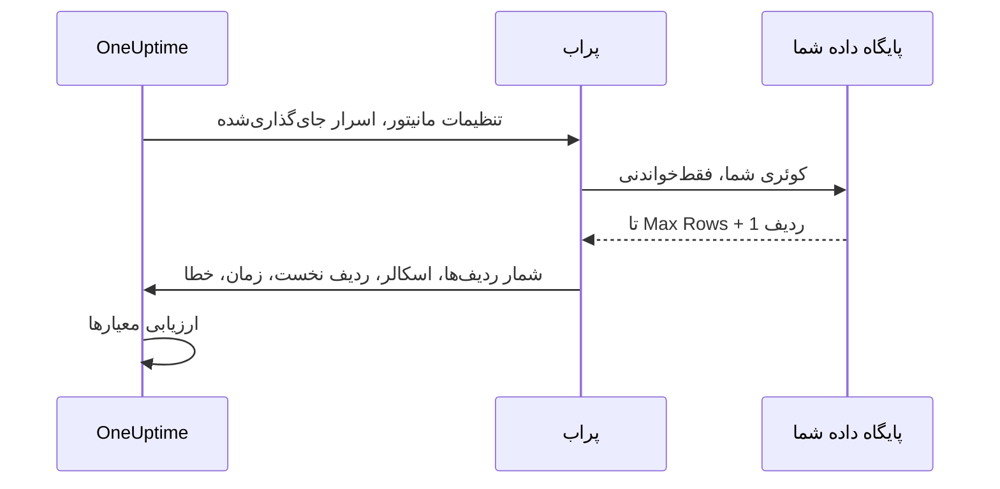

# مانیتور کوئری SQL

مانیتور کوئری SQL یک کوئری SQL فقط‌خواندنی را بر پایه زمان‌بندی از یک پراب اجرا می‌کند و بر پایه نتیجه آن هشدار می‌دهد — شمار ردیف‌های برگشتی، یک مقدار اسکالر، مدت زمان کوئری، یا خطای کوئری. این مانیتور برای کاربرد «یک کوئری اجرا کن و حادثه باز کن» ساخته شده است، برای نمونه هشدار وقتی شمار سفارش‌های لغوشده در پنج دقیقه گذشته ناگهان بالا می‌رود، وقتی یک جدول صف بیش از حد بزرگ می‌شود، یا وقتی یک ردیف حیاتی ناپدید می‌شود.

:::cards
- [یک کاربر فقط‌خواندنی بسازید](#یک-کاربر-فقطخواندنی-بسازید): ورود پایگاه داده‌ای که مانیتور باید به کار ببرد.
- [مانیتور را بسازید](#ساخت-مانیتور-کوئری-sql): یک پراب را وصل کنید و کوئری را وارد کنید.
- [کوئری را بنویسید](#نوشتن-کوئری): مقداری را که روی آن هشدار می‌دهید در ستون نخست بگذارید.
- [معیارها را تنظیم کنید](#تنظیم-معیارها): روی یک شمارش، یک مقدار، یک کوئری کند یا یک خطا هشدار دهید.
:::

## چگونه کار می‌کند

در هر بررسی، پراب به پایگاه داده شما وصل می‌شود، کوئری را در بافتاری فقط‌خواندنی اجرا می‌کند، حداکثر شمار محدودی از ردیف‌ها را بازمی‌خواند، و خلاصه‌ای فشرده را به OneUptime گزارش می‌دهد. سپس معیارهای مانیتور بر پایه همین خلاصه ارزیابی می‌شوند.

چون کوئری از پرابی درون شبکه شما اجرا می‌شود، OneUptime هرگز به اتصال مستقیم به پایگاه داده شما نیاز ندارد، و مجموعه کامل نتیجه هرگز از پراب بیرون نمی‌رود — فقط خلاصه‌ای کوچک و محدود از نتیجه گزارش می‌شود.



پراب فقط این‌ها را گزارش می‌دهد:

| مقدار | چیست |
|---|---|
| **Row Count** | شمار ردیف‌هایی که کوئری برگرداند (محدود به سقف Max Rows). |
| **مقدار اسکالر** | ستون نخست از ردیف نخست. این مقدار طبیعی برای کوئری‌ای از نوع `SELECT COUNT(*)` است. |
| **First Row** | ردیف نخست به‌صورت جفت‌های ستون/مقدار، که برای زمینه در خلاصه بررسی نمایش داده می‌شود. |
| **Execution Time** | مدت زمان بررسی به میلی‌ثانیه — با احتساب اتصال، نه فقط خود کوئری. |
| **خطای کوئری** | پیام خطای پاک‌سازی‌شده، اگر کوئری شکست بخورد. |

مجموعه کامل نتیجه هرگز به OneUptime فرستاده نمی‌شود، پس داده‌های مشتری در ذخیره‌سازی OneUptime تکثیر نمی‌شوند.

## پایگاه‌های داده پشتیبانی‌شده

| پایگاه داده | پورت پیش‌فرض |
|---|---|
| **PostgreSQL** | `5432` |
| **MySQL** | `3306` |
| **Microsoft SQL Server** | `1433` |

موتورهای سازگار با MySQL و PostgreSQL که همان پروتکل ارتباطی و گویش SQL را به کار می‌برند معمولاً کار می‌کنند، اما فقط سه موتور بالا به‌طور رسمی آزمایش شده‌اند.

وقتی میزبان و پورتی که مانیتور به آن وصل می‌شود یکی از endpointهای پایگاه داده‌ای در صفحه [پایگاه‌های داده](/docs/telemetry/databases) باشد، هشدارها و حادثه‌های آن در صفحه همان پایگاه داده هم نمایش داده می‌شوند ([هشدارهای یک پایگاه داده](/docs/telemetry/databases#alerts-on-a-database) را ببینید). میزبانی که به‌صورت ارجاع به راز مانیتور داده شده باشد تطبیق داده نمی‌شود.

## مدل امنیتی

اجرای کوئری‌ای که مشتری فراهم کرده روی پایگاه داده تولیدی حساس است، پس مانیتور کوئری SQL از پایه فقط‌خواندنی است و چند لایه کنترل دارد:

| کنترل | چه می‌کند |
|---|---|
| **کاربر پایگاه داده با کمترین دسترسی** (کنترل اصلی) | همیشه با یک کاربر اختصاصی و فقط‌خواندنی پایگاه داده وصل شوید که فقط به جدول‌هایی دسترسی دارد که کوئری لازم دارد. این مهم‌ترین کنترل است — [یک کاربر فقط‌خواندنی بسازید](#یک-کاربر-فقطخواندنی-بسازید) را ببینید. |
| **اجرای فقط‌خواندنی** | در PostgreSQL و MySQL پراب یک تراکنش `READ ONLY` باز می‌کند که هر نوشتنی (از جمله CTEهای نویسنده) را، صرف‌نظر از متن کوئری، رد می‌کند. در Microsoft SQL Server که تراکنش فقط‌خواندنی ندارد، پراب درون تراکنشی اجرا می‌شود که همیشه بازگردانده می‌شود. |
| **کوئری تک‌دستوری و فهرست مجاز** | کوئری باید یک دستور واحد باشد که با `SELECT`، `WITH`، `VALUES` یا `TABLE` آغاز شود. دستورهای پشت‌سرهم (`SELECT 1; DROP TABLE …`) و کلیدواژه‌های نوشتن یا DDL مانند `INSERT`، `UPDATE`، `DELETE`، `DROP`، `EXEC` و `INTO` پیش از اتصال، توسط پراب رد می‌شوند. این بررسی یک تور ایمنی است، نه مرز: مرز همان کاربر فقط‌خواندنی است. |
| **مهلت دستور** | هر کوئری محدودیت زمانی سختی دارد. کوئری‌ای که بیش از اندازه طول بکشد لغو می‌شود. |
| **ردیف‌های محدود** | هرگز بیش از Max Rows ردیف بازخوانده نمی‌شود (به‌علاوه یک ردیف برای تشخیص بریدگی)، که حافظه پراب و حجم داده را محدود می‌کند. |
| **پنهان‌سازی اعتبارنامه** | خطاهای پایگاه داده پیش از ذخیره پاک‌سازی می‌شوند — گذرواژه، میزبان، نام کاربری، نام پایگاه داده و هر رشته اتصالی پنهان می‌شوند، تا اعتبارنامه‌ها هرگز به پیام‌های خطا راه نیابند. |

## پیش از شروع

- یک **پراب** با دسترسی شبکه به میزبان و پورت پایگاه داده شما. می‌تواند پرابی باشد که OneUptime میزبانی می‌کند (اگر پایگاه داده شما از اینترنت در دسترس است) یا یک [پراب سفارشی](/docs/probe/custom-probe) که درون شبکه شما اجرا می‌شود.
- یک **کاربر فقط‌خواندنی پایگاه داده** و جزئیات اتصال (میزبان، پورت، نام پایگاه داده، نام کاربری، گذرواژه)، یا هنگام استفاده از احراز هویت یکپارچه SQL Server، یک هویت فقط‌خواندنی Windows یا دامنه.

## یک کاربر فقط‌خواندنی بسازید

همیشه با یک کاربر اختصاصی فقط‌خواندنی وصل شوید. دستورهای موتور خود را به‌عنوان مدیر اجرا کنید و `orders` را با پایگاه داده خود جایگزین کنید:

:::tabs
@tab PostgreSQL
```sql
-- PostgreSQL
CREATE USER oneuptime_ro WITH PASSWORD 'a-strong-password';
GRANT CONNECT ON DATABASE orders TO oneuptime_ro;
GRANT USAGE ON SCHEMA public TO oneuptime_ro;
GRANT SELECT ON ALL TABLES IN SCHEMA public TO oneuptime_ro;
-- Include tables created in the future:
ALTER DEFAULT PRIVILEGES IN SCHEMA public GRANT SELECT ON TABLES TO oneuptime_ro;
```
@tab MySQL
```sql
-- MySQL
CREATE USER 'oneuptime_ro'@'%' IDENTIFIED BY 'a-strong-password';
GRANT SELECT ON orders.* TO 'oneuptime_ro'@'%';
FLUSH PRIVILEGES;
```
@tab Microsoft SQL Server
```sql
-- Microsoft SQL Server
CREATE LOGIN oneuptime_ro WITH PASSWORD = 'a-strong-password';
USE orders;
CREATE USER oneuptime_ro FOR LOGIN oneuptime_ro;
ALTER ROLE db_datareader ADD MEMBER oneuptime_ro;
```
:::

برای دسترسی تنگ‌تر، به کاربر فقط روی جدول‌هایی که کوئری شما می‌خواند `SELECT` بدهید.

## ساخت مانیتور کوئری SQL

:::steps
### یک مانیتور تازه آغاز کنید

به **مانیتورها** بروید و روی **ساخت مانیتور** کلیک کنید. در **نوع مانیتور** روی **انواع دیگر مانیتور** کلیک کنید و **SQL Query** را زیر **Database Monitoring** برگزینید، یا در جعبه جست‌وجو `query` را تایپ کنید. یک **نام** وارد کنید و سپس روی **بعدی** کلیک کنید.

### جزئیات اتصال را وارد کنید

‏**Database Type** را برگزینید — پورت به پیش‌فرض آن موتور تغییر می‌کند — سپس میزبان، نام پایگاه داده و اعتبارنامه‌های کاربر فقط‌خواندنی را پر کنید. به‌جای تایپ گذرواژه، به آن به‌صورت [راز مانیتور](#استفاده-از-راز-مانیتور-برای-گذرواژه) ارجاع دهید. هر فیلد در [پیکربندی](#پیکربندی) شرح داده شده است.

### کوئری را وارد کنید

یک دستور فقط‌خواندنی را در **SQL Query** تایپ کنید ([نوشتن کوئری](#نوشتن-کوئری) را ببینید).

### آن را بیازمایید

روی **آزمایش مانیتور** کلیک کنید تا کوئری پیش از ذخیره یک بار از یک پراب اجرا شود.

### معیارها را تنظیم کنید

معیارهایی را که مانیتور با آن‌ها آغاز می‌شود بازبینی کنید و معیارهای خودتان را بیفزایید — [تنظیم معیارها](#تنظیم-معیارها) را ببینید. سپس روی **بعدی** کلیک کنید.

### پراب‌ها را برگزینید و بسازید

**پراب‌ها**یی را که به پایگاه داده دسترسی دارند و یک **بازه پایش** برگزینید، و سپس روی **ساخت مانیتور** کلیک کنید.
:::

## پیکربندی

| فیلد | چه وارد کنید |
|---|---|
| **Database Type** | ‏PostgreSQL، ‏MySQL یا Microsoft SQL Server. انتخاب یک نوع، پورت پیش‌فرض را تنظیم می‌کند. |
| **میزبان** | میزبان پایگاه داده که پراب به آن دسترسی دارد (برای نمونه `db.internal`). |
| **پورت** | پورت پایگاه داده. |
| **نام پایگاه داده** | پایگاه داده‌ای که کوئری روی آن اجرا می‌شود. |
| **Use Windows Integrated Authentication** | فقط Microsoft SQL Server. به‌جای نام کاربری و گذرواژه SQL، با حسابی که پراب با آن اجرا می‌شود احراز هویت می‌کند. [احراز هویت یکپارچه Windows](#احراز-هویت-یکپارچه-windows) را ببینید. |
| **نام کاربری** | یک کاربر فقط‌خواندنی پایگاه داده با کمترین دسترسی. |
| **رمز عبور** | گذرواژه پایگاه داده. اکیداً توصیه می‌کنیم به‌جای تایپ گذرواژه به‌صورت متن ساده، با `{{monitorSecrets.name}}` به یک [راز مانیتور](/docs/monitor/monitor-secrets) ارجاع دهید ([استفاده از راز مانیتور برای گذرواژه](#استفاده-از-راز-مانیتور-برای-گذرواژه) را ببینید). |
| **SQL Query** | کوئری فقط‌خواندنی‌ای که اجرا می‌شود ([نوشتن کوئری](#نوشتن-کوئری) را ببینید). |
| **Use SSL/TLS** | برای اتصال از راه TLS روشنش کنید. وقتی روشن باشد، اگر پایگاه داده گواهی خودامضا به کار می‌برد، می‌توانید **Verify server certificate** را خاموش کنید. |

### فیلدهای بیشتر

| فیلد | پیش‌فرض | بیشینه | آنچه محدود می‌کند |
|---|---|---|---|
| **Connection Timeout (ms)** | `10000` | `30000` | مدت انتظار برای برقراری اتصال. |
| **Statement Timeout (ms)** | `15000` | `60000` | سقف سخت مدت اجرای کوئری. |
| **Max Rows** | `100` | `1000` | سقف ردیف‌هایی که از پایگاه داده بازخوانده می‌شوند. |

مقداری بالاتر از بیشینه، تا بیشینه پایین آورده می‌شود.

### احراز هویت یکپارچه Windows

برای Microsoft SQL Server، ‏**Use Windows Integrated Authentication** را روشن کنید تا اتصالی مورد اعتماد با هویت فرایند پراب باز شود. در این حالت فیلدهای نام کاربری و رمز عبور نادیده گرفته می‌شوند و به درایور فرستاده نمی‌شوند. چون پراب به هویتی نیاز دارد که دامنه شما به آن اعتماد کند، برای این حالت احراز هویت از پراب خودمیزبان استفاده کنید.

| پراب روی | چه چیزی را تنظیم کنید |
|---|---|
| **Windows** | سرویس پراب را با یک حساب دامنه اجرا کنید که یک ورود فقط‌خواندنی SQL Server دارد. |
| **Linux یا macOS** | ‏Kerberos را برای دامنه SQL Server پیکربندی کنید و به فرایند پراب یک بلیت معتبر بدهید (برای نمونه از راه یک keytab). ایمیج رسمی Linux پراب شامل Microsoft ODBC Driver 18، ‏unixODBC و کلاینت Kerberos است. پیکربندی Kerberos و حافظه پنهان بلیت را در کانتینر mount کنید، آن‌ها را برای فرایند پراب خواندنی کنید، و اگر در جای پیش‌فرض نیستند `KRB5_CONFIG` یا `KRB5CCNAME` را تنظیم کنید. |

پراب به یک Microsoft ODBC Driver for SQL Server نیاز دارد که روی میزبانی که آن را اجرا می‌کند نصب شده باشد. ایمیج رسمی پراب **ODBC Driver 18** را در خود دارد. وقتی یک پراب خودمیزبان یا سفارشی اجرا می‌کنید، پراب به‌طور خودکار تازه‌ترین `ODBC Driver N for SQL Server` ثبت‌شده روی میزبان را پیدا و استفاده می‌کند (برای نمونه Driver 17 اگر همان نصب باشد) — لازم نیست دقیقاً Driver 18 داشته باشید. برای ثابت کردن یک درایور مشخص، متغیر محیطی `SQL_SERVER_ODBC_DRIVER` را روی پراب به نام دقیق درایور تنظیم کنید (برای نمونه `ODBC Driver 17 for SQL Server`).

‏SQL Server باید یک service principal name مناسب `MSSQLSvc` داشته باشد، ساعت‌های پراب و کنترل‌کننده دامنه باید هماهنگ باشند، و پراب باید SQL Server را با نام میزبانی که آن service principal پوشش می‌دهد resolve کند و به آن برسد. به هویت مورد اعتماد فقط دسترسی‌های پایگاه داده‌ای را بدهید که کوئری پایش لازم دارد.

## نوشتن کوئری

کوئری باید **یک دستور فقط‌خواندنی واحد** باشد. باید با یکی از `SELECT`، `WITH`، `VALUES` یا `TABLE` آغاز شود. نقطه‌ویرگول پایانی مجاز است؛ چند دستور نه. کلیدواژه‌های نوشتن و DDL در هر جای کوئری رد می‌شوند — از جمله `INTO`، پس `SELECT … INTO` هم رد می‌شود.

پراب کوئری را در هر بررسی وارسی می‌کند، نه هنگام ذخیره. کوئری‌ای که این قاعده‌ها را بشکند ذخیره می‌شود، و سپس هر بررسی با "Only read-only queries are allowed (must start with SELECT, WITH, VALUES, or TABLE)." شکست می‌خورد — معیارهای پیش‌فرض مانیتور را آفلاین می‌کنند.

کوئری‌ها را سبک و محدود نگه دارید — در هر بررسی اجرا می‌شوند، پس ستون‌های نمایه‌دار و بازه‌های زمانی باریک را ترجیح دهید. این کوئری سفارش‌هایی را که در پنج دقیقه گذشته لغو شده‌اند می‌شمارد:

:::tabs
@tab PostgreSQL
```sql
-- Count recent cancellations (PostgreSQL)
SELECT COUNT(*) AS cancelled
FROM orders
WHERE status = 'CANCELLED'
  AND created_at > NOW() - INTERVAL '5 minutes';
```
@tab MySQL
```sql
-- The same idea on MySQL
SELECT COUNT(*) AS cancelled
FROM orders
WHERE status = 'CANCELLED'
  AND created_at > NOW() - INTERVAL 5 MINUTE;
```
@tab Microsoft SQL Server
```sql
-- The same idea on Microsoft SQL Server
SELECT COUNT(*) AS cancelled
FROM orders
WHERE status = 'CANCELLED'
  AND created_at > DATEADD(minute, -5, GETDATE());
```
:::

> [!TIP]
> برای کوئری‌ای از نوع `COUNT(*)`، شمارش هم به‌صورت **Row Count** (که `1` است، چون یک ردیف برمی‌گردد) و هم به‌صورت **مقدار اسکالر** (خود شمارش، از ستون نخست) در دسترس است. برای هشدار بر پایه «چندتا»، با **مقدار اسکالر** مقایسه کنید.

## استفاده از راز مانیتور برای گذرواژه

برای اینکه گذرواژه پایگاه داده هرگز به‌صورت متن ساده روی مانیتور ذخیره نشود، یک [راز مانیتور](/docs/monitor/monitor-secrets) بسازید و از فیلد رمز عبور به آن ارجاع دهید:

:::steps
1. به **مانیتورها → تنظیمات → اسرار** بروید و یک راز مانیتور بسازید.
2. برایش نامی بگذارید (برای نمونه `dbPassword`) و به این مانیتور دسترسی به آن را بدهید.
3. در فیلد **رمز عبور** مانیتور، `{{monitorSecrets.dbPassword}}` را وارد کنید.
:::

‏OneUptime پیش از سپردن پیکربندی به پراب، راز را در سمت سرور جای‌گذاری می‌کند. OneUptime هرگز این اسرار را برای شما نمی‌سازد — ارجاع دادن به یکی از آن‌ها انتخاب شماست. فیلدهای **نام کاربری**، **میزبان**، **نام پایگاه داده** و **SQL Query** هم ارجاع به راز را می‌پذیرند؛ **پورت** نه.

## تنظیم معیارها

معیارهایی بیفزایید تا تعیین کنید مانیتور چه زمانی آنلاین، دچار کاهش کارایی یا آفلاین به شمار می‌آید. این بررسی‌ها برای مانیتور کوئری SQL در دسترس‌اند:

| نوع فیلتر | آنچه بررسی می‌کند |
|---|---|
| **SQL Is Online** | آیا پایگاه داده در دسترس بود و کوئری موفق شد. |
| **SQL Query Row Count** | شمار ردیف‌های برگشتی. با عملگرهایی مانند بزرگ‌تر از، کوچک‌تر از یا برابر با مقایسه کنید. |
| **SQL Query Scalar Value** | ستون نخست از ردیف نخست. اگر مقداری که وارد می‌کنید عدد باشد به‌صورت عدد، وگرنه به‌صورت رشته مقایسه می‌شود. این همان بررسی‌ای است که برای کوئری‌های از نوع `COUNT(*)` باید به کار ببرید. |
| **SQL Query Execution Time (in ms)** | کوئری چه مدت طول کشید. برای شناسایی پایگاه داده کند سودمند است. |
| **SQL Query Error** | پیام خطای کوئری. وقتی خالی است (یا نیست)، یا با رشته‌ای مشخص تطبیق می‌یابد، هشدار دهید. |
| **JavaScript Expression** | یک عبارت JavaScript سفارشی را روی `rowCount`، `scalarValue`، `firstRow`، `executionTimeInMs`، `queryError` و `isOnline` ارزیابی کنید. [عبارت‌های JavaScript](/docs/monitor/javascript-expression#مانیتورهای-کوئری-sql) را ببینید. |

آستانه‌های عددی عدد صحیح‌اند: `10` بنویسید، نه `10.5`. فیلترهای SQL Query را نمی‌توان در یک بازه زمانی ارزیابی کرد؛ هر بررسی مستقل است.

یک مانیتور کوئری SQL تازه با دو معیار آغاز می‌شود: **SQL Is Online** نادرست است — مانیتور آفلاین می‌شود و حادثه‌ای اعلام می‌کند که خودبه‌خود رفع می‌شود — و **SQL Is Online** درست است، که آن را آنلاین علامت می‌زند. **افزودن معیار** یک معیار در پایین می‌افزاید؛ آن را بالای معیار آنلاین بکشید، چون معیارها از بالا بررسی می‌شوند و نخستین معیاری که تطبیق یابد تصمیم می‌گیرد.

### نمونه: هشدار وقتی لغوها ناگهان زیاد می‌شوند

با کوئری بالا:

| معیار | فیلتر |
|---|---|
| **کاهش کارایی** | `SQL Query Scalar Value` بزرگ‌تر از `10` است. |
| **آفلاین** | `SQL Query Scalar Value` بزرگ‌تر از `50` است، یا `SQL Is Online` برابر `false` است. |

یک سیاست کشیک به معیار پیوند دهید تا افراد درست فرا خوانده شوند. مانیتور کوئری SQL متغیر قالب ویژه خودش را ندارد: عنوان حادثه می‌تواند با `{{monitorName}}` نام مانیتور را بیاورد، اما نمی‌تواند نتیجه کوئری را نقل کند.

## نکته‌هایی که باید در نظر گرفت

- کوئری در هر بررسی اجرا می‌شود، پس سبکش نگه دارید. از نمایه‌ها و بازه‌های زمانی باریک استفاده کنید، و به Statement Timeout به‌عنوان پشتوانه تکیه کنید.
- فقط شمار ردیف‌ها، نخستین خانه (اسکالر) و ردیف نخست گزارش می‌شوند — کوئری را طوری طراحی کنید که مقداری که می‌خواهید روی آن هشدار دهید ستون نخست باشد.
- اگر نتیجه به این دلیل که از Max Rows فراتر رفته بریده شود، خلاصه بررسی **Rows Truncated**: "Yes (result capped)" را نشان می‌دهد. Max Rows را فقط در صورت نیاز افزایش دهید؛ مجموعه‌های نتیجه بزرگ‌تر حافظه بیشتری از پراب می‌گیرند.
- نوشتن و DDL همیشه رد می‌شوند. اگر باید یک مسیر نوشتن را آزمایش کنید، این مانیتور برای آن نیست.
- راز مانیتور را به گذرواژه متن ساده ترجیح دهید تا اعتبارنامه در حالت ذخیره رمزگذاری‌شده بماند.
- بررسی‌ای که کوئری‌اش شکست بخورد، پیش از گزارش خطا یک ثانیه بعد و تا سه بار دیگر دوباره امتحان می‌شود، تا قطع کوتاه اتصال مانیتور را آفلاین نکند. روی پراب خودمیزبان، ‏`PROBE_MONITOR_RETRY_LIMIT` شمار دفعات را تعیین می‌کند.

## عیب‌یابی

:::details هر بررسی با "Only read-only queries are allowed" شکست می‌خورد
کوئری با `SELECT`، `WITH`، `VALUES` یا `TABLE` آغاز نمی‌شود. یک توضیح پیش از آن اشکالی ندارد؛ ‏`SET` یا `DECLARE` نه. آن را به‌صورت یک دستور فقط‌خواندنی واحد بازنویسی کنید.
:::

:::details یک بررسی با "Disallowed SQL keyword" شکست می‌خورد
یک کلیدواژه نوشتن، DDL یا اجرا جایی در کوئری آمده است، حتی درون یک `SELECT`، مانند `INTO` یا `EXEC`. واژه‌های درون رشته‌های گیومه‌دار و توضیح‌ها به شمار نمی‌آیند. کلیدواژه را بردارید، یا منطق را در یک view بگذارید که کاربر فقط‌خواندنی بتواند بخواند.
:::

:::details مهلت بررسی به پایان می‌رسد
پراب نتوانست در **Connection Timeout (ms)** وصل شود، یا کوئری بیش از **Statement Timeout (ms)** طول کشید. بررسی کنید که پراب به میزبان و پورت دسترسی دارد، سپس کوئری را سبک‌تر کنید: روی ستون‌های نمایه‌دار و در بازه زمانی کوتاه فیلتر کنید.
:::

:::details اتصال با خطای گواهی شکست می‌خورد
گواهی پایگاه داده خودامضا است، یا پراب به آن اعتماد ندارد. ‏**Verify server certificate** را که با روشن شدن **Use SSL/TLS** نمایان می‌شود خاموش کنید، یا به پایگاه داده گواهی‌ای بدهید که پراب به آن اعتماد کند.
:::

:::details احراز هویت یکپارچه Windows شکست می‌خورد
پراب به یک Microsoft ODBC Driver for SQL Server و هویتی نیاز دارد که دامنه شما به آن اعتماد کند. ایمیج رسمی پراب را اجرا کنید، یا درایور را نصب کنید، سپس تنظیمات را در [احراز هویت یکپارچه Windows](#احراز-هویت-یکپارچه-windows) بررسی کنید.
:::

## گام‌های بعدی

:::cards
- [مانیتور سلامت پایگاه داده](/docs/monitor/database-health-monitor): بدون نوشتن SQL، اتصال‌ها، قفل‌ها و تکثیر را زیر نظر بگیرید.
- [اسرار مانیتور](/docs/monitor/monitor-secrets): گذرواژه پایگاه داده را رمزگذاری‌شده نگه دارید.
- [عبارت‌های JavaScript](/docs/monitor/javascript-expression): معیارهایی بنویسید که چند مقدار را با هم ترکیب می‌کنند.
- [پراب‌های سفارشی](/docs/probe/custom-probe): بررسی‌ها را از درون شبکه خود اجرا کنید.
:::
