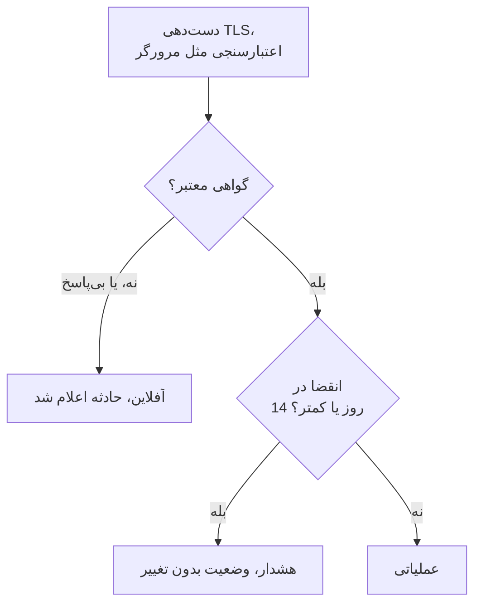

# مانیتور گواهی SSL

مانیتور گواهی SSL گواهی‌های TLSای را که سایت‌ها و سرویس‌های شما ارائه می‌کنند، همان‌طور که یک مرورگر بررسی می‌کند، بررسی می‌کند و پیش از انقضای آن‌ها به شما هشدار می‌دهد. همچنین وقتی یک گواهی دیگر معتبر نباشد، یعنی منقضی شده، خودامضا باشد، برای نام میزبان دیگری صادر شده باشد، یا از مرجعی باشد که مرورگرها به آن اعتماد ندارند، مانیتور را آفلاین می‌کند.

:::cards
- [ساخت مانیتور](#ساخت-یک-مانیتور-گواهی-ssl): شش گام در داشبورد.
- [معیارهای پیش‌فرض](#معیارهای-پیشفرض): هشدار انقضا ۱۴ روز زودتر، بدون هیچ تنظیمی.
- [معیارهای پایش](#معیارهای-پایش): اعتبار، انقضا و گواهی‌های خودامضا.
- [رفع اشکال](#رفع-اشکال): گواهی‌های خودامضا و داخلی.
:::

## چگونه کار می‌کند

در هر بررسی، پراب یک اتصال TLS به میزبان و پورت موجود در نشانی باز می‌کند، پورت `443` مگر اینکه نشانی پورت دیگری بگوید، و گواهی را همان‌طور که یک مرورگر می‌کند اعتبارسنجی می‌کند: صادرکننده‌ای مورد اعتماد، نام میزبانی که مطابقت دارد، و تاریخ‌هایی که امروز را در بر می‌گیرند. اگر گواهی در اعتبارسنجی رد شود، پراب باز هم آن را می‌خواند، پس تاریخ انقضا، صادرکننده و اثرانگشت‌های آن در هر حال ثبت می‌شوند. اتصالی که شکست بخورد، به وقفه بخورد یا گواهی نامعتبری ارائه کند، تا تعداد تلاش‌های مجددی که اجازه می‌دهید دوباره امتحان می‌شود. سپس OneUptime نتیجه را از معیارهای مانیتور عبور می‌دهد.

پرابی که اتصال شبکهٔ خودش را از دست داده هیچ نتیجه‌ای گزارش نمی‌کند، پس نمی‌تواند گواهی شما را نامعتبر علامت بزند.

## پیش از شروع

- **نقشی که بتواند مانیتور بسازد**: Project Owner، Project Admin، Project Member، Monitor Admin یا Monitor Member، یا یک نقش سفارشی با مجوز Create Monitor.
- **پرابی که به میزبان و پورت برسد.** پراب‌های پیش‌فرض پروژهٔ شما برای هر مانیتور تازه انتخاب می‌شوند. سرویسی در یک شبکهٔ خصوصی به یک [پراب سفارشی](/docs/probe/custom-probe) داخل همان شبکه نیاز دارد.

## ساخت یک مانیتور گواهی SSL

:::steps
### شروع یک مانیتور تازه

به **مانیتورها** بروید و روی **ساخت مانیتور** کلیک کنید. در **نوع مانیتور**، **SSL Certificate** را انتخاب کنید.

### نام‌گذاری

یک **نام** وارد کنید، مثل `example.com certificate`، و روی **بعدی** کلیک کنید.

### وارد کردن نشانی

در **نشانی وب‌سایت** سایتی را که گواهی‌اش باید بررسی شود وارد کنید، مثل `https://example.com`. برای سرویسی روی پورت دیگر، پورت را هم بیاورید: `https://example.com:8443`.

### آزمایش

روی **آزمایش مانیتور** کلیک کنید، در **انتخاب پراب** یک پراب انتخاب کنید و روی **اجرای آزمایش** کلیک کنید. **نتیجه آزمایش مانیتور** گواهی‌ای را که پراب گرفت، همراه با صادرکننده و تاریخ انقضای آن نشان می‌دهد.

### بازبینی معیارها

**معیارهای مانیتور** با [معیارهای پیش‌فرض](#معیارهای-پیشفرض) شروع می‌شود: آفلاین وقتی گواهی معتبر نیست، هشدار وقتی در ۱۴ روز یا کمتر منقضی می‌شود. در صورت نیاز آن‌ها را تغییر دهید و روی **بعدی** کلیک کنید.

### انتخاب پراب‌ها و ساخت

**پراب‌ها** و **بازه پایش** (که از **هر ۵ دقیقه** شروع می‌شود؛ برای مانیتورهای گواهی SSL بازه‌های ۵ دقیقه یا بیشتر ارائه می‌شود) را نگه دارید یا تغییر دهید و روی **ساخت مانیتور** کلیک کنید. صفحهٔ مانیتور باز می‌شود.
:::

## گزینه‌های پیکربندی

| فیلد | پیش‌فرض | چه وارد کنید |
| --- | --- | --- |
| **نشانی وب‌سایت** | هیچ | سایتی که گواهی‌اش بررسی می‌شود، مثل `https://example.com` یا `https://example.com:8443`. فقط میزبان و پورت استفاده می‌شوند؛ مسیر نادیده گرفته می‌شود. |
| **وقفه درخواست (ثانیه)** (زیر **فیلدهای بیشتر**) | `60` | مدت انتظار برای دست‌دهی TLS در هر تلاش. بیشینه ۶۰ ثانیه است. |
| **تلاش‌های مجدد در صورت شکست** (زیر **فیلدهای بیشتر**) | پیش‌فرض پراب، معمولاً `3` | چند بار یک تلاش ناموفق تکرار شود. بیشینه ۳ است. |

**تلاش‌های مجدد در صورت شکست** تلاش‌های مجدد _پس از_ نخستین تلاش را می‌شمارد، پس `0` بررسی را یک بار اجرا می‌کند و `2` تا سه بار. اگر خالی بماند، از پیش‌فرض پراب استفاده می‌شود: ۳، مگر اینکه `PROBE_MONITOR_RETRY_LIMIT` پراب چیز دیگری بگوید. خطاهای اتصال، شکست‌های اعتبارسنجی گواهی و وقفه‌ها همگی دوباره امتحان می‌شوند، با یک ثانیه مکث میان تلاش‌ها.

## معیارهای پایش

معیارها تعیین می‌کنند گواهی چه زمانی سالم، کاهش کارایی یا خراب به حساب بیاید، و آیا این وضعیت حادثه اعلام کند یا هشدار بسازد. هر معیار یک یا چند فیلتر را بررسی می‌کند:

| فیلتر | شرط‌ها | چه چیزی را بررسی می‌کند |
| --- | --- | --- |
| **Is Valid Certificate** | **درست**، **نادرست** | گواهی از بررسی‌های یک مرورگر می‌گذرد: صادرکننده‌ای مورد اعتماد، نام میزبانی که مطابقت دارد، و تاریخ‌هایی که امروز را در بر می‌گیرند. وقتی endpoint پاسخ نداد **نادرست** است. |
| **Is Not A Valid Certificate** | **درست**، **نادرست** | عکس **Is Valid Certificate**: وقتی گواهی از آن بررسی‌ها رد شود یا قابل بررسی نباشد **درست** است. |
| **Is Expired Certificate** | **درست**، **نادرست** | تاریخ انقضای گواهی گذشته است. |
| **Is Self Signed Certificate** | **درست**، **نادرست** | گواهی، یا یکی از گواهی‌های زنجیرهٔ آن، خودامضاست. |
| **Expires In Days** | **Greater Than**، **Less Than**، **Greater Than Or Equal To**، **Less Than Or Equal To** | روزهای باقی‌مانده تا انقضای گواهی. |
| **Expires In Hours** | **Greater Than**، **Less Than**، **Greater Than Or Equal To**، **Less Than Or Equal To** | ساعت‌های باقی‌مانده تا انقضای گواهی. |

**Expires In Days** روزهای کامل را می‌شمارد: گواهی‌ای که ۱۴ روز و ۲۰ ساعت دیگر منقضی می‌شود ۱۴ روز باقی‌مانده دارد. **Expires In Hours** هم به همین شکل ساعت‌های کامل را می‌شمارد.

با دو فیلتر یا بیشتر، **شرط تطابق** تعیین می‌کند که **همه** باید مطابقت کنند یا **هر** کدام کافی است. **اقدام‌ها**ی یک معیار تعیین می‌کنند چه کاری انجام دهد: تغییر وضعیت مانیتور، ساخت هشدار، اعلام حادثه، یا هر ترکیبی از این‌ها.

### معیارهای پیش‌فرض

مانیتور گواهی SSL تازه با سه معیار شروع می‌شود، پس بدون هیچ تنظیمی پیش از انقضای گواهی به شما هشدار می‌دهد:

1. **گواهی معتبر نیست** — گواهی منقضی شده، خودامضاست، برای نام میزبان دیگری یا توسط مرجعی نامعتبر صادر شده، یا چون endpoint پاسخ نداد قابل بررسی نبود. مانیتور **آفلاین** علامت می‌خورد و حادثه‌ای با نام «_monitor name_ certificate is not valid» ساخته می‌شود. علت ریشه‌ای آن می‌گوید کدام‌یک از این حالت‌ها بوده است. وقتی گواهی دوباره معتبر شود، حادثه خودش حل می‌شود.
2. **گواهی به‌زودی منقضی می‌شود** — گواهی معتبر است اما در ۱۴ روز یا کمتر منقضی می‌شود. یک **هشدار** با نام «_monitor name_ certificate expires soon» ساخته می‌شود.
3. **گواهی معتبر است** — مانیتور **عملیاتی** علامت می‌خورد.

هشدار «به‌زودی منقضی می‌شود» یک هشدار است، نه حادثه: در صفحات وضعیت شما نشان داده نمی‌شود، تا وقتی یک سیاست آنکال به آن اضافه نکنید کسی را فرا نمی‌خواند، و وضعیت مانیتور را تغییر نمی‌دهد. از دومین شدت هشدار پروژهٔ شما استفاده می‌کند، که در یک پروژهٔ تازه **Low** است. وقتی گواهی تمدیدشده دریافت شود، مانیتور به «گواهی معتبر است» برمی‌گردد و هشدار خودش حل می‌شود.

معیارها از بالا به پایین بررسی می‌شوند و نخستین معیاری که مطابقت کند تعیین می‌کند چه اتفاقی بیفتد. به همین دلیل «به‌زودی منقضی می‌شود» بالای «معتبر است» قرار دارد: گواهی‌ای که در آستانهٔ انقضاست هنوز معتبر است، پس با هر دو مطابقت می‌کرد.

برای اینکه زودتر هشدار بگیرید، مقدار فیلتر **Expires In Days** را در معیار «به‌زودی منقضی می‌شود» تغییر دهید، برای نمونه به `30`. برای اینکه به‌جای آن کسی فرا خوانده شود، **اقدام‌ها**ی آن معیار را باز کنید: **وقتی فیلترها مطابقت پیدا کردند، یک حادثه اعلام کن.** را روشن کنید، یا هشدار را نگه دارید و زیر **سیاست‌های آنکال** یک سیاست آنکال به آن اضافه کنید.

:::details افزودن هشدار به مانیتوری که پیش از وجود آن ساخته شده
مانیتورهایی که پیش از افزوده شدن این هشدار به OneUptime ساخته شده‌اند معیار «به‌زودی منقضی می‌شود» را ندارند. برای افزودن آن:

1. روی مانیتور، **پیکربندی → معیارها** را باز کنید و روی **ویرایش معیارهای پایش** کلیک کنید.
2. روی **افزودن معیار** کلیک کنید. فیلتر آن را روی **Is Valid Certificate** / **درست** بگذارید، روی **افزودن فیلتر** کلیک کنید و دومی را روی **Expires In Days** / **Less Than Or Equal To** / `14` بگذارید. **شرط تطابق** را روی **همه** بگذارید (وقتی دو فیلتر باشد، زیر فیلترها ظاهر می‌شود).
3. زیر **اقدام‌ها**، **وقتی فیلترها مطابقت پیدا کردند، یک هشدار بساز.** را روشن کنید و **وقتی فیلترها مطابقت پیدا کردند، وضعیت مانیتور را تغییر بده.** را خاموش بگذارید، تا هشدار بسازد و وضعیت مانیتور را تغییر ندهد.
4. معیار تازه را بالای معیاری که مانیتور را آنلاین علامت می‌زند بکشید و سپس ذخیره کنید.
:::

### نمونهٔ معیارها

| هدف | فیلتر | شرط | مقدار |
| --- | --- | --- | --- |
| یک ماه زودتر هشدار بده | **Expires In Days** | **Less Than Or Equal To** | `30` |
| در روز آخر کسی را فرا بخوان | **Expires In Hours** | **Less Than** | `24` |
| آفلاین فقط پس از منقضی شدن گواهی | **Is Expired Certificate** | **درست** | — |
| علامت‌گذاری گواهی خودامضا | **Is Self Signed Certificate** | **درست** | — |

معیار مربوط به انقضا باید بالای معیاری باشد که گواهی را معتبر علامت می‌زند: گواهی‌ای که به‌زودی منقضی می‌شود هنوز معتبر است، و نخستین معیاری که مطابقت کند برنده است.

## بهترین شیوه‌ها

1. **به خودتان برای تمدید فرصت بدهید** — هشدار پیش‌فرض ۱۴ روز پیش از انقضا می‌آید، که برای گواهی‌هایی که خودشان تمدید می‌شوند مناسب است. اگر تمدید برای شما بیشتر طول می‌کشد (گواهی‌ای که می‌خرید، یا یک فرایند تغییر)، آن را به ۳۰ روز افزایش دهید.
2. **هر endpoint را پایش کنید** — اگر چند دامنه یا زیردامنه دارید، برای هر کدام یک مانیتور بسازید. هر کدام ممکن است گواهی خودش را داشته باشد.
3. **پورت‌های دیگر را هم در نظر بگیرید** — سرویس‌هایی که TLS را روی پورتی غیر از `443` ارائه می‌کنند، مثل `8443`، هم گواهی دارند. پورت را در نشانی بگذارید.
4. **پس از تمدید بررسی کنید** — پس از تمدید یک گواهی، نتیجهٔ بعدی مانیتور را بررسی کنید: تاریخ انقضایی که نشان می‌دهد باید تاریخ تازه باشد.

## رفع اشکال

:::details گواهی در مرورگر من درست است، اما مانیتور می‌گوید معتبر نیست
علت ریشه‌ای حادثه می‌گوید چرا. یک علت رایج سروری است که گواهی‌اش را بدون گواهی‌های میانی می‌فرستد: مرورگرها اغلب این کمبود را خودشان پر می‌کنند، پراب نه. سرور را طوری پیکربندی کنید که زنجیرهٔ کامل را بفرستد. علت دیگر نشانی‌ای است که نام میزبانش روی گواهی نیست.
:::

:::details یک سرویس داخلی با گواهی خودامضا را پایش می‌کنم
گواهی خودامضا هرگز معتبر نیست، پس معیارهای پیش‌فرض مانیتور را آفلاین نگه می‌دارند. **Is Self Signed Certificate**، **Is Expired Certificate** و **Expires In Days** همچنان برای آن کار می‌کنند، پس معیارها را بر پایهٔ آن‌ها بسازید. در **پیکربندی → معیارها**:

1. در معیار «معتبر نیست»، روی **افزودن فیلتر** کلیک کنید، فیلتر تازه را روی **Is Self Signed Certificate** / **نادرست** بگذارید و **شرط تطابق** را روی **همه** بگذارید. این معیار همچنان وقتی endpoint پاسخ ندهد، یا گواهی از جهت دیگری نادرست باشد، مانیتور را آفلاین می‌کند.
2. معیاری با **Is Expired Certificate** / **درست** اضافه کنید که مانیتور را **آفلاین** علامت بزند و حادثه اعلام کند، و آن را به بالای فهرست بکشید.
3. در معیار «به‌زودی منقضی می‌شود»، **Is Valid Certificate** / **درست** را با **Is Expired Certificate** / **نادرست** جایگزین کنید، تا هشدار گواهی خودامضا را هم پوشش دهد.

تا وقتی گواهی معتبر است، هیچ معیاری مطابقت نمی‌کند و مانیتور وضعیت پیش‌فرض خود، **عملیاتی**، را نشان می‌دهد.
:::

:::details مانیتور با «could not be checked because the endpoint is not reachable» آفلاین است
پراب نتوانست یک اتصال TLS به میزبان و پورت باز کند. پورت موجود در نشانی را بررسی کنید، و اینکه دیوارهٔ آتش اجازهٔ عبور پراب‌ها را می‌دهد. میزبانی در یک شبکهٔ خصوصی به یک [پراب سفارشی](/docs/probe/custom-probe) نیاز دارد.
:::

## گام‌های بعدی

:::cards
- [مانیتور وب‌سایت](/docs/monitor/website-monitor): بررسی کنید که خود سایت پاسخ می‌دهد.
- [مانیتور دامنه](/docs/monitor/domain-monitor): پیش از انقضای ثبت دامنه هشدار بگیرید.
- [قواعد تشدید](/docs/on-call/escalation-rules): تعیین کنید هشدارها و حوادث چه کسی را فرا بخوانند.
- [نمای کلی حوادث](/docs/incidents/index): پس از آنکه مانیتور حادثه‌ای اعلام کرد چه اتفاقی می‌افتد.
:::
