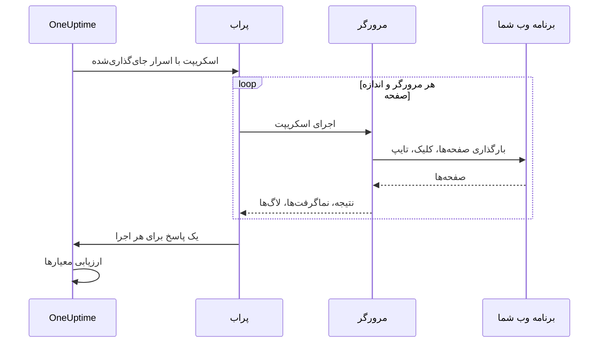

# مانیتور سینتتیک

مانیتور سینتتیک برنامه وب شما را در یک مرورگر واقعی، بر پایه زمان‌بندی و با یک اسکریپت Playwright که خودتان می‌نویسید، هدایت می‌کند: صفحه‌ها را باز می‌کند، فرم‌ها را پر می‌کند و در یک مسیر کاربری کلیک‌کنان پیش می‌رود، و وقتی آن مسیر شکست بخورد شکست می‌خورد. از آن برای گرفتن خرابی‌هایی استفاده کنید که بررسی uptime نمی‌تواند ببیند — ورودی که دیگر کار نمی‌کند، دکمه پرداختی که کاری نمی‌کند، داشبوردی که بارگذاری‌اش هرگز تمام نمی‌شود.

:::cards
- [مانیتور را بسازید](#ساخت-مانیتور-سینتتیک): اسکریپتی بنویسید، مرورگرها و اندازه‌های صفحه را برگزینید.
- [اسکریپت را بنویسید](#اسکریپت-را-بنویسید): یک مسیر ورود آماده اجرا برای شروع.
- [نماگرفت‌ها](#نماگرفتها): ببینید وقتی اجرایی شکست خورد صفحه چگونه بود.
- [آنچه اسکریپت می‌تواند به کار ببرد](#ماژولهای-در-دسترس-در-اسکریپت): ‏Playwright، ‏HTTP، رمزنگاری و متریک‌ها.
:::

## چگونه کار می‌کند

در هر بررسی، یک پراب اسکریپت شما را برای هر مرورگر و اندازه صفحه‌ای که برگزیده‌اید، یکی پس از دیگری، یک بار اجرا می‌کند. هر اجرا یک مرورگر تازه را بدون کوکی یا ذخیره‌سازی اجراهای پیشین آغاز می‌کند؛ اسکریپت صفحه خودش را هدایت می‌کند، نماگرفت می‌گیرد، و نتیجه‌ای برمی‌گرداند یا خطایی پرتاب می‌کند. پراب هر اجرا را گزارش می‌دهد، و OneUptime معیارهای شما را بر پایه آن‌ها ارزیابی می‌کند.



| نوع صفحه | Viewport |
| --- | --- |
| Mobile | ۳۶۰ × ۶۴۰ |
| Tablet | ۱۰۲۴ × ۷۶۸ |
| Desktop | ۱۹۲۰ × ۱۰۸۰ |

مرورگرها Chromium و Firefox هستند.

## پیش از شروع

- یک **پراب** که به برنامه وب شما دسترسی داشته باشد. برای برنامه‌ای درون شبکه خودتان از [پراب سفارشی](/docs/probe/custom-probe) استفاده کنید. ایمیج Docker پراب شامل Chromium و Firefox است؛ پرابی که بیرون از Docker اجرا می‌شود باید آن‌ها را نصب‌شده داشته باشد.
- هر گذرواژه یا توکنی که مسیر لازم دارد، به‌صورت [راز مانیتور](/docs/monitor/monitor-secrets) ذخیره شده باشد.

## ساخت مانیتور سینتتیک

:::steps
### یک مانیتور تازه آغاز کنید

به **مانیتورها** بروید و روی **ساخت مانیتور** کلیک کنید. در **نوع مانیتور** روی **انواع دیگر مانیتور** کلیک کنید و **Synthetic Monitor** را زیر **Synthetic Monitoring** برگزینید، یا در جعبه جست‌وجو `playwright` را تایپ کنید. یک **نام** وارد کنید و سپس روی **بعدی** کلیک کنید.

### اسکریپت را اضافه کنید

اسکریپت خود را در ویرایشگر **Playwright Code** بنویسید. از [نمونه زیر](#اسکریپت-را-بنویسید) شروع کنید.

### مرورگرها و اندازه‌های صفحه را برگزینید

مرورگرها را زیر **نوع مرورگر** و اندازه‌ها را زیر **نوع صفحه** علامت بزنید. اسکریپت برای هر ترکیب یک بار اجرا می‌شود، پس دو مرورگر و سه اندازه یعنی شش اجرا در هر بررسی. زیر **فیلدهای بیشتر**، ‏**تعداد تلاش مجدد در صورت خطا** اجرای ناموفق را تا ۵ بار دوباره امتحان می‌کند.

### آن را بیازمایید

روی **آزمایش مانیتور** کلیک کنید تا اسکریپت یک بار از یک پراب اجرا شود، و نتیجه، لاگ‌ها و نماگرفت‌های هر اجرا را بررسی کنید.

### معیارها را بازبینی کنید

مانیتور با دو معیار آغاز می‌شود: وقتی اجرایی شکست بخورد آفلاین می‌شود و حادثه‌ای اعلام می‌کند، و وقتی هیچ اجرایی شکست نخورد آنلاین است. آن‌ها را تغییر دهید یا معیارهای خودتان را بیفزایید — [معیارها](#معیارها) را ببینید — و سپس روی **بعدی** کلیک کنید.

### پراب‌ها را برگزینید و بسازید

**پراب‌ها** و یک **بازه پایش** برگزینید — برای مانیتورهای سینتتیک بازه‌های ۵ دقیقه یا بیشتر پیشنهاد می‌شود — و سپس روی **ساخت مانیتور** کلیک کنید.
:::

## اسکریپت را بنویسید

اسکریپت بدنه یک تابع `async` است. ‏`page` صفحه‌ای سازگار با Playwright است که از پیش باز شده است؛ آن را هدایت کنید، با `return` نتیجه‌ای برگردانید، و با `throw` (یا گذاشتن اینکه مهلت یک فراخوانی Playwright سر برسد) اجرا را شکست دهید. این نمونه وارد سیستم می‌شود و بررسی می‌کند که داشبورد بارگذاری شود:

```javascript title="Synthetic monitor script"
await page.goto("https://app.example.com/login");
screenshots["login-page"] = await page.screenshot();

await page.fill("#email", "monitoring@example.com");
await page.fill("#password", "{{monitorSecrets.AppPassword}}");
await page.click("button[type=submit]");

// Fails the run if the dashboard does not appear within 10 seconds.
await page.waitForSelector(".dashboard", { timeout: 10000 });
screenshots["dashboard"] = await page.screenshot();

console.log(`Signed in on ${browserType}, ${screenSizeType}`);

return {
  data: { title: await page.title() },
};
```

| برای | این کار را بکنید | آنچه OneUptime ثبت می‌کند |
| --- | --- | --- |
| گزارش یک نتیجه | `return { data: ... }` | **نتیجه** اجرا. فقط `data` نگه داشته می‌شود. |
| شکست دادن اجرا | `throw new Error("...")`، یا گذاشتن اینکه مهلت یک انتظار سر برسد | **خطای اسکریپت** اجرا. |
| نگه داشتن مدرک | `screenshots["name"] = await page.screenshot()` | نماگرفتی که حتی وقتی اجرا شکست بخورد نگه داشته می‌شود. |
| به جا گذاشتن ردپا | `console.log(...)` | پیام‌های لاگ اجرا. |

برای دیدن اجراها، **نمای کلی** مانیتور را باز کنید: کارت **خلاصه مانیتور** برای هر مرورگر و اندازه صفحه یک بخش دارد، و **نمایش جزئیات بیشتر** نماگرفت‌های هر اجرا را نشان می‌دهد.

### استفاده از Playwright

ما برای شبیه‌سازی تعامل‌های کاربر از Playwright استفاده می‌کنیم. مقدار `page` نمای امن و سازگار با Playwright برای صفحه‌ای است که برای این اجرا ساخته شده است. متدهای رایج `Page`، `Locator`، `Frame`، `ElementHandle`، `JSHandle`، `Request`، `Response`، صفحه‌کلید، موس و browser context در دسترس‌اند. این شامل پیمایش، locatorها، کلیک‌ها، ورودی فرم، ارزیابی در صفحه، پنجره‌های بازشو، صفحه‌های بیشتر، بررسی پاسخ و نماگرفت است. می‌توانید از راه `page.context()` به browser context این اجرا برسید، برای نمونه برای باز کردن صفحه‌ای تازه یا رسیدگی به یک پنجره بازشو.

اسکریپت‌های سینتتیک در فرایند Node.js پراب اجرا نمی‌شوند. مقدارها به‌صورت داده رونوشت‌شده یا قابلیت‌های مات و وابسته به اجرا از مرز runtime عبور می‌کنند، پس برخی APIهای Playwright به شکل دیگری کار می‌کنند یا اصلاً کار نمی‌کنند:

| در دسترس نیست | به‌جای آن به کار ببرید |
| --- | --- |
| متدهای راه‌اندازی یا اتصال مرورگر، نشست‌های CDP، مسیریابی درخواست، bindingهای آشکارشده، فیلدهای خصوصی Playwright، و هر گزینه‌ای که مسیری از سامانه فایل میزبان را بخواند یا بنویسد. بنابراین `page.context().browser()` در دسترس نیست. | صفحه و browser context ای که به شما داده شده. |
| شنونده‌های رویداد (`page.on(...)`، `page.once(...)`) — فراخوانی آن‌ها با خطایی روشن شکست می‌خورد. | ‏`page.waitForEvent(...)` برای دیالوگ‌ها و پنجره‌های بازشو، یا انتظار برای پاسخ و درخواست با تطبیق‌دهنده رشته یا عبارت باقاعده. |
| گزاره‌های تابعی برای متدهای انتظار رویداد، درخواست، پاسخ و URL. | تطبیق‌دهنده‌های رشته یا عبارت باقاعده، locatorها، یا polling صریح. |
| دسترسی‌گرهای همگام frame ‏(`page.frames()`، `page.mainFrame()`، `page.frame(...)`). | ‏`page.frameLocator(...)` برای iframeها. |
| `page.request.*` | ‏`axios` سراسری برای درخواست‌های HTTP. |
| نماگرفت کل صفحه و خروجی PDF. | نماگرفت‌های viewport، که رفتار نگه داشتن مدرک شکست را که در ادامه آمده حفظ می‌کنند. |

‏`page.waitForNavigation(...)`، ‏`page.setDefaultTimeout(...)` و `page.setDefaultNavigationTimeout(...)` پشتیبانی می‌شوند. ‏`page.waitForEvent(...)` منتظر `dialog`، `domcontentloaded`، `load`، `popup`، `request`، `requestfailed`، `requestfinished` و `response` می‌ماند. تابع‌های ارزیابی که به متدهایی مانند `page.evaluate()` داده می‌شوند در صفحه مرورگر پایش‌شده اجرا می‌شوند، هرگز در فرایند پراب. هر اجرا می‌تواند تا هشت صفحه به کار ببرد.

مجوزهای مرورگر به موقعیت جغرافیایی و اعلان‌ها محدود است. کلیپ‌بورد، دوربین، میکروفون، MIDI، قلم‌های محلی و دیگر مجوزهای دستگاه میزبان برای اسکریپت‌های مانیتور در دسترس نیستند.

### آنچه اسکریپت برمی‌گرداند

داده‌ای که از اسکریپت برگردانده می‌شود پیش از ذخیره به JSON سریال می‌شود: در شیءها و آرایه‌های ساده، `NaN` و `Infinity` به `null` تبدیل می‌شوند، ویژگی‌های `undefined` و تابع‌ها کنار گذاشته می‌شوند، و شیءهای `Date` به رشته‌های ISO تبدیل می‌شوند — درست همان‌طور که `JSON.stringify` با آن‌ها رفتار می‌کند. نمونه‌های کلاس و دیگر شیءهای غیرساده به‌طور کامل کنار گذاشته می‌شوند. ‏`BigInt` به رشته تبدیل می‌شود. نتیجه‌ای که دوری باشد، بیش از ۳۰ سطح تودرتو باشد، یا بزرگ‌تر از ۵ MB باشد، به‌جای آن اجرا را شکست می‌دهد.

### هشدار روی داده بازگشتی

هرچه اسکریپت به‌عنوان `data` برمی‌گرداند، **Result Value** مانیتور است که یک معیار می‌تواند آن را مقایسه کند. وقتی `data` یک شیء یا آرایه باشد، **مسیر فیلد (اختیاری)** را روی فیلتر Result Value پر کنید تا یک فیلد آن مقایسه شود — برای نمونه `status`، `timings.loadTime` یا `errors[0].message`. فیلتر در برابر داده هر مرورگر و اندازه صفحه‌ای که مانیتور روی آن اجرا می‌شود بررسی می‌شود، و وقتی هر یک از آن‌ها تطبیق یابد تطبیق می‌یابد. برای اینکه مسیرها و شرط‌ها چگونه کار می‌کنند، [هشدار روی داده بازگشتی](/docs/monitor/custom-code-monitor#هشدار-روی-داده-بازگشتی) را ببینید.

## نماگرفت‌ها

یک شیء `screenshots` از پیش اعلام‌شده در بافتار اسکریپت در دسترس است. در هر نقطه از اسکریپت نماگرفت‌ها را به آن نسبت دهید — این نماگرفت‌ها **حتی اگر اسکریپت خطا پرتاب کند** (از جمله شکست assertionها، پایان مهلت‌ها یا خطاهای پیش‌بینی‌نشده) نگه داشته می‌شوند، تا بتوانید دقیقاً ببینید وقتی اجرا شکست خورد صفحه چگونه بود. نماگرفت‌های گرفته‌شده در داشبورد OneUptime برای همان اجرای مشخص مانیتور نمایش داده می‌شوند.

```javascript
// Capture screenshots via the `screenshots` side-channel — they are preserved on both success and failure.

await page.goto("https://app.example.com/login");
screenshots["login-page"] = await page.screenshot();

await page.fill("#email", "user@example.com");
await page.fill("#password", "wrong");
await page.click("button[type=submit]");

// If the next assertion throws, the `login-page` screenshot above is still captured.
await page.waitForSelector(".dashboard", { timeout: 5000 });

screenshots["dashboard"] = await page.screenshot();

return {
  data: "Login succeeded",
};
```

هر اجرا تا ۲۰ نماگرفت نگه می‌دارد، هرکدام تا ۱۰ MB و در مجموع ۵۰ MB. یک نماگرفت می‌تواند در حادثه یا هشداری که یک اجرای ناموفق باز می‌کند هم نمایش داده شود — در صفحه آن و در ایمیل‌هایی که درباره آن فرستاده می‌شوند — کافی است آن را در توضیح حادثه یا هشدار مانیتور بگذارید. [نمایش نماگرفت](/docs/monitor/incident-alert-templating#مانیتورهای-مصنوعی) را ببینید.

:::details برگرداندن نماگرفت‌ها (روش قدیمی)
برای سازگاری با گذشته، می‌توانید نماگرفت‌ها را به‌عنوان بخشی از مقدار بازگشتی هم از اسکریپت برگردانید. نماگرفت‌هایی که این‌گونه برگردانده شوند **فقط** وقتی اسکریپت به‌طور عادی پایان یابد نگه داشته می‌شوند — اگر اسکریپت خطا پرتاب کند از دست می‌روند. وقتی مدرکی از شکست‌ها می‌خواهید، الگوی side-channel بالا را ترجیح دهید.

```javascript
// Legacy pattern — screenshots only captured on successful return.
const screenshots = {};
screenshots["screenshot-name"] = await page.screenshot();

return {
  data: "Hello World",
  screenshots: screenshots,
};
```
:::

## استفاده از اسرار مانیتور

در هر جای اسکریپت به یک راز با `{{monitorSecrets.NAME}}` ارجاع دهید. OneUptime پیش از رسیدن اسکریپت به پراب، این ارجاع را با مقدار راز، به‌صورت متن ساده، جایگزین می‌کند. پس برای استفاده از یک راز به‌عنوان رشته آن را در گیومه بگذارید، و برای استفاده از آن به‌عنوان عدد یا مقدار بولی بدون گیومه رهایش کنید:

```javascript
// Used as a string: wrap it in quotes.
const password = "{{monitorSecrets.AppPassword}}";

// Used as a number or a boolean: leave it bare.
const retryLimit = {{monitorSecrets.RetryLimit}};
const verbose = {{monitorSecrets.Verbose}};
```

برای ساخت یک راز و انتخاب مانیتورهایی که می‌توانند از آن استفاده کنند، [اسرار مانیتور](/docs/monitor/monitor-secrets) را ببینید.

## متریک‌های سفارشی

می‌توانید با تابع `oneuptime.captureMetric()` از اسکریپت خود متریک‌های سفارشی ثبت کنید. این متریک‌ها در OneUptime ذخیره می‌شوند و می‌توان آن‌ها را با Metric Explorer در داشبوردها به نمودار درآورد.

```javascript
oneuptime.captureMetric(name, value, attributes);
```

| پارامتر | نوع | توضیح |
| --- | --- | --- |
| `name` | string، الزامی | نام متریک (برای نمونه `"dashboard.load.time"`). به‌طور خودکار با پیشوند `custom.monitor.` ذخیره می‌شود. |
| `value` | number، الزامی | مقدار عددی متریک. |
| `attributes` | object، اختیاری | جفت‌های کلید-مقدار برای زمینه بیشتر. |

### نمونه

```javascript
await page.goto("https://app.example.com");

const startTime = Date.now();
await page.waitForSelector("#dashboard-loaded");
const loadTime = Date.now() - startTime;

// Capture page load time, tagged with this run's browser and screen size
oneuptime.captureMetric("dashboard.load.time", loadTime, {
  page: "dashboard",
  browser: browserType,
  screen: screenSizeType,
});

screenshots["dashboard"] = await page.screenshot();

return {
  data: { loadTime },
};
```

پس از ثبت، این متریک‌ها در Metric Explorer با نام‌هایی مانند `custom.monitor.dashboard.load.time` و در صفحه **متریک‌ها**ی مانیتور زیر **متریک‌های سفارشی** نمایش داده می‌شوند. OneUptime مانیتور و پراب را به هر نقطه داده می‌افزاید؛ برای فیلتر کردن بر پایه مرورگر یا اندازه صفحه، آن‌ها را مانند نمونه به‌عنوان ویژگی بفرستید.

هر اجرا حداکثر ۱۰۰ متریک، فقط با مقدار عددی، ثبت می‌کند، و OneUptime برای هر بررسی، روی همه اجراهای آن، حداکثر ۱۰۰ متریک نگه می‌دارد. مانند مانیتور کد سفارشی، برخی نام‌های ویژگی [رزروشده](/docs/monitor/custom-code-monitor#کلیدهای-ویژگی-رزروشده) هستند و اگر اسکریپت آن‌ها را تنظیم کند کنار گذاشته می‌شوند.

## معیارها

| نوع فیلتر | آنچه بررسی می‌کند |
| --- | --- |
| **خطا** | خطایی که یک اجرا پرتاب کرده، اگر باشد. |
| **Result Value** | ‏`data` ای که یک اجرا برگردانده. |
| **زمان اجرا (به میلی‌ثانیه)** | یک اجرا چه مدت طول کشید. |
| **نوع مرورگر** | مرورگری که یک اجرا به کار برده: **Equal To** یا **Not Equal To**. |
| **Screen Size** | اندازه صفحه‌ای که یک اجرا به کار برده: **Equal To** یا **Not Equal To**. |

هر فیلتر در برابر همه اجراها بررسی می‌شود و وقتی هر یک از اجراها با آن تطبیق یابد تطبیق می‌یابد. فیلترها جداگانه بررسی می‌شوند، نه اجرا به اجرا: **خطا** Is Not Empty همراه با **نوع مرورگر** Equal To `Firefox` وقتی تطبیق می‌یابد که اجرایی شکست خورده و یکی از اجراها Firefox را به کار برده باشد — نه فقط وقتی اجرای Firefox شکست خورده باشد. برای زیر نظر گرفتن یک مرورگر به‌تنهایی، مانیتوری جداگانه برایش بسازید.

در قالب‌های حادثه و هشدار، همه اجراها در `{{syntheticResponses}}` هستند: [قالب‌بندی حادثه و هشدار](/docs/monitor/incident-alert-templating#مانیتورهای-مصنوعی) را ببینید.

## ماژول‌های در دسترس در اسکریپت

| نام | چیست |
| --- | --- |
| `page` | نمای امن و سازگار با Playwright برای تعامل با مرورگر. می‌توانید از راه `page.context()` به browser context این اجرا برسید تا صفحه بسازید یا به پنجره‌های بازشو رسیدگی کنید، اما راه‌اندازی/اتصال مرورگر، CDP، مسیریابی، bindingها، فیلدهای خصوصی و گزینه‌های مسیر میزبان در دسترس نیستند. |
| `screenshots` | شیئی از پیش اعلام‌شده که نماگرفت‌ها را به آن نسبت می‌دهید (برای نمونه `screenshots['login-page'] = await page.screenshot()`). نماگرفت‌هایی که اینجا نسبت داده شوند حتی اگر اسکریپت بعداً خطا پرتاب کند نگه داشته می‌شوند. |
| `browserType` | مرورگری که این اجرا به کار می‌برد: `Chromium` یا `Firefox`. |
| `screenSizeType` | اندازه صفحه‌ای که این اجرا به کار می‌برد: `Mobile`، `Tablet` یا `Desktop`. |
| `axios` | یک کلاینت HTTP مبتنی بر Promise که Axios فراخوانی‌پذیر و نیز `request`، `get`، `head`، `options`، `post`، `put`، `patch`، `delete` و `create` را پشتیبانی می‌کند. بدنه درخواست می‌تواند تا ۱ MB و پاسخ تا ۵ MB باشد؛ تا ۵ تغییر مسیر را دنبال می‌کند و حداکثر پس از ۳۰ ثانیه مهلتش سر می‌رسد. transportهای سفارشی، adapterها، socketها، agentها و بازنویسی پراکسی در دسترس نیستند. |
| `crypto` | پیاده‌سازی در browser worker از hashهای SHA-256، ‏HMAC-SHA-256، ‏`randomBytes`، `randomInt` و `randomUUID`. |
| `console` | ‏`console.log`، `info`، `warn` و `error`. پیام‌ها همراه هر اجرا نگه داشته می‌شوند. |
| `oneuptime.captureMetric` | یک متریک سفارشی ثبت می‌کند. [متریک‌های سفارشی](#متریکهای-سفارشی) را ببینید. |
| `http` | یک نمای سازگاری بافرشده و فقط سمت کلاینت که `request`، `get` و `Agent` را پشتیبانی می‌کند. |
| `https` | معادل HTTPS نمای `http` فقط سمت کلاینت. |
| `Buffer`، `setTimeout`، `setInterval` | و تابع‌های `clear` آن‌ها. |

اسکریپت در یک browser worker اجرا می‌شود، نه در Node.js، و نمی‌تواند اتصال‌های شبکه خودش را باز کند: ‏`fetch`، `XMLHttpRequest` و `WebSocket` مسدودند. برای درخواست‌های HTTP از `axios` استفاده کنید.

## محدودیت‌ها

| محدودیت | پیش‌فرض | تنظیم پراب |
| --- | --- | --- |
| مهلت اسکریپت | ۶۰ ثانیه. workerهایی که مهلتشان سر رسیده و همه فرایندهای فرزند مرورگر پایان داده می‌شوند. | `PROBE_SYNTHETIC_MONITOR_SCRIPT_TIMEOUT_IN_MS` |
| حافظه برای کل درخت فرایند یک اجرا | ۱٫۵ GiB | `PROBE_SYNTHETIC_MONITOR_MAX_PROCESS_TREE_RSS_BYTES` |
| ذخیره‌سازی نوشتنی مرورگر | ۲۵۶ MiB | `PROBE_SYNTHETIC_MONITOR_MAX_DISK_BYTES` |
| اجراهای همزمان روی یک پراب | ۴ | `PROBE_SYNTHETIC_MONITOR_MAX_CONCURRENCY` |
| صفحه در هر اجرا | ۸ | — |

فراتر رفتن از محدودیت حافظه یا ذخیره‌سازی، آن اجرا را پایان می‌دهد و پروفایل موقت آن را پاک می‌کند. تنظیمات پراب برای پراب‌های خودمیزبان اعمال می‌شوند؛ نمودار Helm همین مقدارها را برای هر پراب تنظیم می‌کند (برای نمونه `syntheticMonitorScriptTimeoutInMs`).

مرورگرها درون ایمیج Docker پراب ارائه می‌شوند، پس پراب خودمیزبان با به‌روزرسانی ایمیجش مرورگرهای تازه‌تر می‌گیرد.

## عیب‌یابی

:::details یک اجرا شکست می‌خورد، اما نمی‌فهمم چرا
پیش از هر گام پرخطر، نماگرفت‌ها را به شیء `screenshots` نسبت دهید. حتی وقتی اجرا شکست بخورد نگه داشته می‌شوند، و نشان می‌دهند صفحه در آن لحظه چگونه بود.
:::

:::details `page.on(...)` خطا پرتاب می‌کند
شنونده‌های رویداد نمی‌توانند از مرز جداسازی عبور کنند. برای دیالوگ‌ها و پنجره‌های بازشو از `page.waitForEvent(...)` استفاده کنید، یا از انتظار برای پاسخ یا درخواست با تطبیق‌دهنده رشته یا عبارت باقاعده.
:::

:::details مهلت اجرا سر می‌رسد
با `page.waitForSelector(...)` و `timeout` ای کوتاه‌تر از محدودیت خود اسکریپت منتظر عنصرهای مشخص بمانید، تا اجرا در همان گامی که کند است با خطایی روشن شکست بخورد.
:::

:::details پراب خودمیزبان می‌گوید فایل اجرایی مرورگر پیدا نشد
پراب بیرون از ایمیج Docker خود و بدون نصب Chromium یا Firefox اجرا می‌شود. ایمیج پراب را اجرا کنید، یا مرورگرها را روی آن ماشین نصب کنید.
:::

## گام‌های بعدی

:::cards
- [مانیتور کد سفارشی](/docs/monitor/custom-code-monitor): بدون مرورگر، APIها را با اسکریپت بررسی کنید.
- [نمایش نماگرفت](/docs/monitor/incident-alert-templating#مانیتورهای-مصنوعی): نماگرفت اجرای ناموفق را در حادثه بگذارید.
- [اسرار مانیتور](/docs/monitor/monitor-secrets): اعتبارنامه‌ها را بیرون از اسکریپت نگه دارید.
:::
