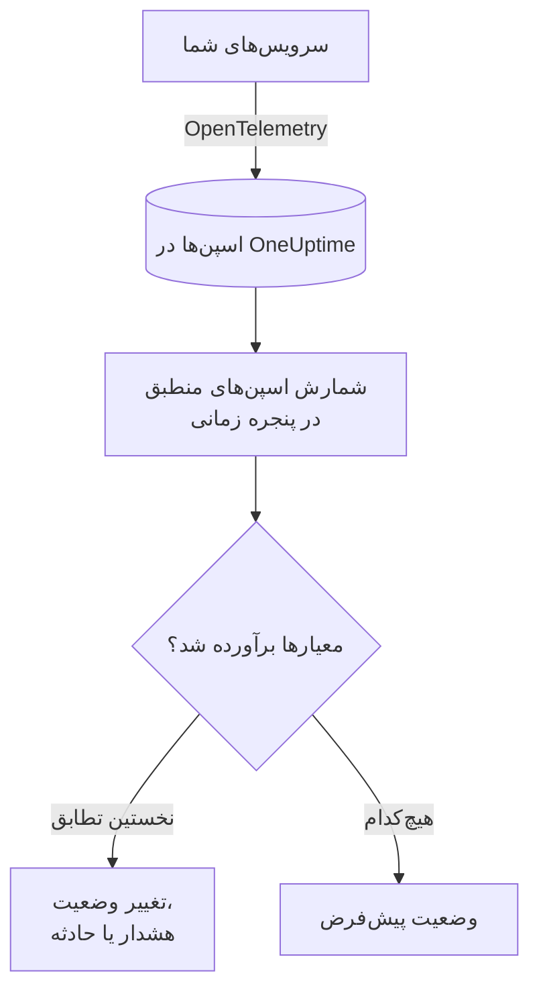

# مانیتور ترِیس‌ها

مانیتور ترِیس‌ها اسپن‌هایی را که سرویس‌های شما به OneUptime می‌فرستند و با فیلترهای شما (نام اسپن، وضعیت، سرویس، ویژگی‌ها) منطبق‌اند، در یک پنجره زمانی می‌شمارد. وقتی این شمارش معیارهای شما را برآورده کند، وضعیت مانیتور را تغییر می‌دهد، هشدار می‌سازد یا حادثه اعلام می‌کند. از آن برای هشدار روی درخواست‌های ناموفق به یک endpoint، جهش اسپن‌های خطا یا سرویسی که دیگر ترِیس نمی‌فرستد استفاده کنید.

:::cards
- [ساخت مانیتور](#ساخت-یک-مانیتور-ترِیسها): اسپن‌هایی که شمرده می‌شوند و زمان هشدار را انتخاب کنید.
- [کدهای وضعیت اسپن](#کدهای-وضعیت-اسپن): معنای OK، ERROR و UNSET، و اینکه بر اساس کدام فیلتر کنید.
- [چگونه ارزیابی می‌شود](#چگونه-ارزیابی-میشود): پنجره زمانی، شمارش و چرخهٔ یک‌دقیقه‌ای.
- [معیارها](#معیارها): آستانه‌ها، تشخیص ناهنجاری و پیش‌فرض‌ها.
:::

## چگونه کار می‌کند

هر دقیقه، OneUptime اسپن‌هایی را که با فیلترهای مانیتور منطبق‌اند و در پنجره زمانی آن آغاز شده‌اند می‌شمارد. سپس این شمارش را از بالا به پایین با معیارهای مانیتور می‌سنجد و نخستین معیاری که منطبق شود تعیین می‌کند چه اتفاقی بیفتد. وقتی هیچ‌کدام منطبق نشود، مانیتور به وضعیت پیش‌فرض خود برمی‌گردد.

## پیش از شروع

- سرویس‌های شما ترِیس‌ها را از طریق OpenTelemetry به OneUptime می‌فرستند. [OpenTelemetry](/docs/telemetry/open-telemetry) را ببینید.
- نام دقیق اسپنی را که می‌خواهید زیر نظر بگیرید در کاوشگر ترِیس پیدا کنید: نام اسپن‌ها را ابزارگذاری شما تعیین می‌کند، برای نمونه `POST /api/checkout` یا `GET`.

## ساخت یک مانیتور ترِیس‌ها

:::steps
### شروع یک مانیتور تازه

به **مانیتورها** بروید و روی **ساخت مانیتور** کلیک کنید.

### انتخاب نوع ترِیس‌ها

در **نوع مانیتور**، روی **انواع دیگر مانیتور** کلیک کنید و **ترِیس‌ها** را زیر **تله‌متری** انتخاب کنید، یا در کادر جستجو `traces` را تایپ کنید. یک **نام** وارد کنید و روی **بعدی** کلیک کنید.

### انتخاب اسپن‌هایی که شمرده می‌شوند

در **پیکربندی مانیتور ترِیس**، **نام اسپن**، **پایش ترِیس‌ها به مدت (زمان)** و **فیلتر بر اساس وضعیت اسپن** را تنظیم کنید. فیلتری که خالی بگذارید با همهٔ اسپن‌ها منطبق است. **پیش‌نمایش اسپن‌ها**، زیر فیلترها، اسپن‌هایی را نشان می‌دهد که همین حالا با آن‌ها منطبق‌اند.

### محدودتر کردن آن‌ها (اختیاری)

برای فیلتر بر اساس سرویس تله‌متری، موجودیت زیرساخت یا ویژگی، **فیلدهای بیشتر** را باز کنید.

### تعیین معیارها

کارت **معیارهای مانیتور** با دو معیار شروع می‌شود: آفلاین همراه با یک حادثه، وقتی هیچ اسپنی منطبق نباشد؛ آنلاین، وقتی دست‌کم یکی منطبق باشد. آن‌ها را به آنچه می‌خواهید روی آن هشدار بگیرید تغییر دهید ([معیارها](#معیارها) را ببینید).

### ساخت مانیتور

روی **ساخت مانیتور** کلیک کنید. مانیتور در صفحهٔ **نمای کلی** خود باز می‌شود و نخستین ارزیابی آن ظرف یک دقیقه اجرا می‌شود.
:::

> [!TIP]
> برای اینکه وقتی یک قابلیت هوش مصنوعی بد پاسخ می‌دهد باخبر شوید (پاسخ‌های ناموفق، ردشده، نیمه‌تمام، خالی، علامت‌خورده یا کند)، به‌جای آن **هوش مصنوعی / LLM** را زیر **تله‌متری** انتخاب کنید. این مانیتور فراخوان‌های هوش مصنوعی را در ترِیس‌های شما برایتان می‌خواند، بی‌آنکه فیلتر اسپنی بنویسید. [مشاهده‌پذیری هوش مصنوعی / LLM](/docs/telemetry/ai-llm-observability#وقتی-هوش-مصنوعی-بد-پاسخ-میدهد-باخبر-شوید) را ببینید.

## چه چیزی را پرس‌وجو می‌کند

| فیلد | با چه چیزی منطبق است | پیش‌فرض |
| --- | --- | --- |
| **نام اسپن** | اسپن‌هایی که نامشان این متن را دارد، بدون توجه به بزرگی و کوچکی حروف. | خالی: همهٔ اسپن‌ها |
| **پایش ترِیس‌ها به مدت (زمان)** | اسپن‌هایی که از ۵ ثانیهٔ گذشته تا ۲۴ ساعت گذشته آغاز شده‌اند. | **۱ دقیقه گذشته** |
| **فیلتر بر اساس وضعیت اسپن** | اسپن‌هایی با هر یک از وضعیت‌های انتخاب‌شده: **تنظیم‌نشده**، **موفق** یا **خطا**. | خالی: همهٔ وضعیت‌ها |
| **فیلتر بر اساس سرویس تله‌متری** (زیر **فیلدهای بیشتر**) | اسپن‌های هر یک از سرویس‌های انتخاب‌شده. | خالی: همهٔ سرویس‌ها |
| **Filter by Infrastructure Entity** (زیر **فیلدهای بیشتر**) | اسپن‌های هر یک از میزبان‌ها، پادها، کانتینرها و دیگر موجودیت‌های انتخاب‌شده. | خالی: همهٔ موجودیت‌ها |
| **فیلتر بر اساس ویژگی‌ها** (زیر **فیلدهای بیشتر**) | اسپن‌هایی که ویژگی‌هایشان همهٔ شرط‌ها را برآورده می‌کنند. هر شرط عملگر خودش را دارد، مثل «برابر است» یا «شامل است». | خالی: بدون شرط |

برای اینکه یک اسپن شمرده شود، باید با همهٔ فیلترهایی که تنظیم کرده‌اید منطبق باشد.

### کدهای وضعیت اسپن

- **OK** — عملیات از سوی کد برنامه یا یک خط لوله ترِیس به‌صورت صریح موفق علامت‌گذاری شد
- **ERROR** — عملیات با خطا مواجه شد
- **UNSET** — هیچ وضعیت خطایی تنظیم نشد. این وضعیت پیش‌فرض OpenTelemetry است

UNSET به معنای نبود داده نیست. ابزارگذاری OpenTelemetry وقتی عملیاتی شکست می‌خورد وضعیت را روی ERROR تنظیم می‌کند و اسپن‌های موفق را UNSET باقی می‌گذارد، بنابراین در یک سرویس سالم بیشتر اسپن‌ها UNSET هستند. OneUptime آن‌ها را به رنگ سبز و به‌صورت «Unset (no error)» نشان می‌دهد. ثبت یک استثنا وضعیت اسپن را تغییر نمی‌دهد، بنابراین اسپنی با وضعیت UNSET همچنان می‌تواند استثنا داشته باشد؛ این استثناها همراه با اسپن فهرست می‌شوند. برای هشدار دادن روی شکست‌ها، بر اساس ERROR فیلتر کنید. برای شمارش همه اسپن‌هایی که شکست نخورده‌اند، هر دو وضعیت OK و UNSET را انتخاب کنید.

اگر می‌خواهید درخواست‌های موفق به‌صورت OK نمایش داده شوند، زیر **ترِیس‌ها > تنظیمات > خطوط لوله** یک خط لوله ترِیس با شرط فیلتر **وضعیت = تنظیم‌نشده** و یک **Status Remapper** بیفزایید که مقادیر `http.response.status_code` مانند `200` را به «موفق (۱)» نگاشت کند.

## چگونه ارزیابی می‌شود

- **هر دقیقه.** مانیتور ترِیس‌ها را پراب‌ها بررسی نمی‌کنند، پس بازه‌ای برای تنظیم ندارد و صفحهٔ **پراب‌ها و بازه** هم ندارد.
- **یک عدد در هر ارزیابی.** مانیتور اسپن‌هایی را می‌شمارد که با همهٔ فیلترها منطبق‌اند و در **پایش ترِیس‌ها به مدت (زمان)** پیش از ارزیابی آغاز شده‌اند. با **۵ دقیقه گذشته**، هر ارزیابی پنج دقیقه به عقب نگاه می‌کند، پس پنجره‌های ارزیابی‌های پیاپی روی هم می‌افتند.
- **نبود اسپن یعنی شمارش ۰.** سرویسی که دیگر ترِیس نمی‌فرستد ۰ تولید می‌کند، و معیار آفلاین پیش‌فرض دقیقاً به دنبال همین است.
- **قطعی خود OneUptime سکوت نیست.** تا وقتی پنجره زمانی شامل زمانی است که خود OneUptime داده دریافت نمی‌کرد (در حال راه‌اندازی دوباره، ارتقا یا جبران عقب‌ماندگی بود)، بررسی صبر می‌کند: وضعیت تغییر نمی‌کند و هیچ حادثه یا هشداری باز یا رفع نمی‌شود. [وقتی OneUptime داده دریافت نمی‌کند](/docs/monitor/when-oneuptime-is-not-receiving) را ببینید.
- **معیارها از بالا به پایین.** نخستین معیاری که منطبق شود تصمیم می‌گیرد، پس شدیدترین را اول بگذارید.

هر تغییر وضعیت، همراه با دلیل آن، در **خط زمانی وضعیت** مانیتور ثبت می‌شود.

## معیارها

معیارهای مانیتور ترِیس‌ها یک **نوع فیلتر** دارند: **Span Count**، یعنی تعداد اسپن‌هایی که در پنجره منطبق شدند. یک **شرط فیلتر** و، برای شرط آستانه‌ای، یک **مقدار** انتخاب کنید.

| شرط فیلتر | منطبق است وقتی شمارش اسپن… |
| --- | --- |
| **Greater Than** | بیشتر از مقدار باشد |
| **Greater Than Or Equal To** | برابر مقدار یا بیشتر از آن باشد |
| **Less Than** | کمتر از مقدار باشد |
| **Less Than Or Equal To** | برابر مقدار یا کمتر از آن باشد |
| **Equal To** | دقیقاً برابر مقدار باشد |
| **Anomalously High** | بالاتر از بازهٔ مورد انتظار برای این ساعت از هفته باشد |
| **Anomalously Low** | پایین‌تر از آن بازه باشد |
| **Anomalous** | در هر جهت بیرون از آن بازه باشد |

شرط‌های ناهنجاری **مقدار** نمی‌گیرند. یک **حساسیت** (Low، Medium که پیش‌فرض است، یا High) و یک **پنجره مبنا** از ۱۴ (پیش‌فرض)، ۲۸، ۶۰ یا ۹۰ روز انتخاب کنید. OneUptime شمارش را به نرخ در دقیقه تبدیل می‌کند و آن را با همان ساعت از هفته در طول آن پنجره مقایسه می‌کند. مبنا فقط سرویس‌ها و وضعیت‌های اسپنِ مانیتور را پوشش می‌دهد: فیلترهای نام اسپن و ویژگی آن بخشی از مبنا نیستند. تا وقتی آن ساعت از هفته تاریخچهٔ کافی نداشته باشد، معیار هنوز در حال یادگیری است و فعال نمی‌شود.

مانیتور ترِیس‌های تازه با این معیارها شروع می‌شود:

| معیار | فیلتر | اثر |
| --- | --- | --- |
| Check if … is offline | **Span Count** **Equal To** `0` | مانیتور را آفلاین علامت می‌زند و حادثه‌ای اعلام می‌کند که خودکار رفع می‌شود |
| Check if … is online | **Span Count** **Greater Than** `0` | مانیتور را آنلاین علامت می‌زند |

## مثال کاربردی: درخواست‌های ناموفق checkout

در پنج دقیقه، سرویس checkout تعداد ۱٬۲۰۰ اسپن با نام `POST /api/checkout` ثبت می‌کند: ۱٬۱۵۰ با وضعیت UNSET، ۲۰ با OK و ۳۰ با ERROR. همین مانیتور بسته به **فیلتر بر اساس وضعیت اسپن** عددهای بسیار متفاوتی می‌شمارد:

| فیلتر بر اساس وضعیت اسپن | Span Count | آنچه می‌سنجد |
| --- | --- | --- |
| **خطا** | ۳۰ | درخواست‌هایی که شکست خوردند |
| **موفق** | ۲۰ | فقط درخواست‌هایی که کد شما موفق علامت زده است |
| **تنظیم‌نشده** و **موفق** | ۱٬۱۷۰ | همهٔ درخواست‌هایی که شکست نخوردند |
| خالی | ۱٬۲۰۰ | همهٔ درخواست‌ها |

برای اینکه وقتی بیش از ۱۰ درخواست checkout در پنج دقیقه شکست می‌خورند خبردار شوید:

- **نام اسپن**: `POST /api/checkout`
- **پایش ترِیس‌ها به مدت (زمان)**: **۵ دقیقه گذشته**
- **فیلتر بر اساس وضعیت اسپن**: **خطا**
- معیار ۱: **Span Count** **Greater Than** `10`: مانیتور را آفلاین علامت بزن و حادثه اعلام کن
- معیار ۲: **Span Count** **Less Than Or Equal To** `10`: مانیتور را آنلاین علامت بزن

با ۳۰ درخواست ناموفق، معیار ۱ منطبق می‌شود و حادثه اعلام می‌شود. وقتی پنج دقیقه با ۱۰ شکست یا کمتر بگذرد، معیار ۲ منطبق می‌شود، مانیتور دوباره آنلاین می‌شود و حادثه خودبه‌خود رفع می‌شود.

## رفع اشکال

:::details مانیتور هیچ اسپنی برای endpoint من نمی‌شمارد
**نام اسپن** با نام اسپن مقایسه می‌شود، و ابزارگذاری اغلب اسپن‌های سمت سرور را به نام مسیر (`POST /api/checkout`) یا فقط متد (`GET`) نام‌گذاری می‌کند. نام دقیق را در کاوشگر ترِیس پیدا کنید. سپس صفحهٔ **معیارها** را در مانیتور (زیر **پیکربندی**) باز کنید و روی **Edit Monitoring Criteria** کلیک کنید: **پیش‌نمایش اسپن‌ها** نشان می‌دهد فیلترها همین حالا با چه چیزی منطبق‌اند.
:::

:::details وقتی بر اساس «موفق» فیلتر می‌کنم، درخواست‌های موفق شمرده نمی‌شوند
بیشتر ابزارگذاری‌ها اسپن‌های موفق را UNSET باقی می‌گذارند، نه OK ([کدهای وضعیت اسپن](#کدهای-وضعیت-اسپن) را ببینید). هم **تنظیم‌نشده** و هم **موفق** را انتخاب کنید، یا خط لوله ترِیسی را که آنجا توضیح داده شده اضافه کنید.
:::

:::details یک اسپن استثنا دارد اما خطا شمرده نمی‌شود
ثبت یک استثنا وضعیت اسپن را تغییر نمی‌دهد. بر اساس **خطا** فیلتر کنید، یا برای هشدار روی خود استثناها از یک [مانیتور استثناها](/docs/monitor/exceptions-monitor) استفاده کنید.
:::

:::details معیار ناهنجاری هرگز فعال نمی‌شود
هنوز در حال یادگیری است: ساعتی از هفته که با آن مقایسه می‌کند هنوز در **پنجره مبنا** تاریخچهٔ کافی ندارد.
:::

## گام‌های بعدی

:::cards
- [مانیتور استثناها](/docs/monitor/exceptions-monitor): روی استثناهایی که سرویس‌هایتان ثبت می‌کنند هشدار بگیرید.
- [مانیتور لاگ‌ها](/docs/monitor/logs-monitor): روی حجم و محتوای لاگ هشدار بگیرید.
- [نحو جستجو](/docs/telemetry/search-syntax): نام و وضعیت اسپن‌ها را در کاوشگر ترِیس پیدا کنید.
- [قالب‌بندی حادثه و هشدار](/docs/monitor/incident-alert-templating): عنوان و توضیحات مفیدی برای هشدارها بنویسید.
:::
