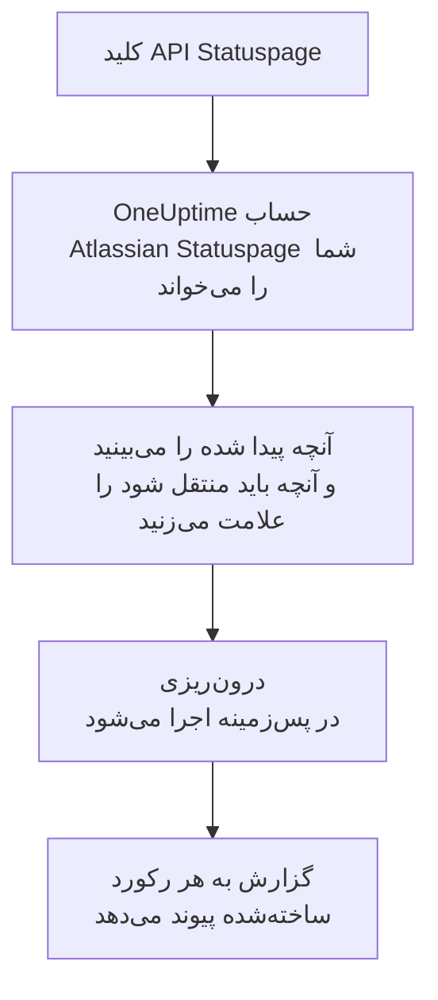

# انتقال از Atlassian Statuspage

**درون‌ریزی از ابزاری دیگر** صفحه‌های Atlassian Statuspage شما را در چند دقیقه به OneUptime می‌آورد. با یک کلید API ‏Statuspage، ‏OneUptime صفحه‌های شما، اجزا و گروه‌هایشان و مشترکان ایمیلی‌شان را می‌خواند، آنچه پیدا کرده را نشان می‌دهد و آنچه را علامت بزنید می‌سازد. در Statuspage هیچ چیزی تغییر نمی‌کند.

:::cards
- [درون‌ریزی حساب شما](#درونریزی-حساب-atlassian-statuspage): یک کلید بسازید، حسابتان را بخوانید و آنچه باید منتقل شود را علامت بزنید.
- [چه چیزی منتقل می‌شود](#چه-چیزی-منتقل-میشود): هر صفحه، جزء و مشترک Statuspage در OneUptime به چه تبدیل می‌شود.
- [جابه‌جایی را کامل کنید](#جابهجایی-را-کامل-کنید): کارهایی که پس از درون‌ریزی باید انجام دهید.
:::

## چگونه کار می‌کند

- **کلید فقط یک بار استفاده می‌شود.** تا وقتی OneUptime حساب شما را می‌خواند، کلید رمزنگاری‌شده نگه داشته می‌شود و به محض پایان خواندن، چه موفق بوده باشد چه نه، حذف می‌شود. دیگر هرگز نمایش داده نمی‌شود و در هیچ لاگی نوشته نمی‌شود.
- **OneUptime فقط می‌خواند.** فقط API خود Atlassian Statuspage را فراخوانی می‌کند: `api.statuspage.io`. در هر ثانیه یک درخواست می‌فرستد، یعنی بیشترین تعدادی که Statuspage به یک کلید می‌دهد. وقتی Atlassian Statuspage بخواهد آهسته‌تر پیش برود، صبر می‌کند و دوباره تلاش می‌کند.
- **تا درون‌ریزی را شروع نکنید چیزی ساخته نمی‌شود.** پیش‌نمایش برای هر مورد نشان می‌دهد که جدید است، از قبل در OneUptime هست (و همان‌طور که هست استفاده می‌شود)، یک درون‌ریزی قبلی آن را آورده است، یا چرا نمی‌تواند منتقل شود.
- **اجرای دوباره هرگز چیزی را دو بار نمی‌سازد.** OneUptime به یاد می‌سپارد هر درون‌ریزی بر اساس شناسه Atlassian Statuspage چه چیزی آورده است. پس از افزودن صفحه یا جزء در Atlassian Statuspage آن را دوباره اجرا کنید تا فقط موارد جدید ساخته شوند.

## پیش از شروع

- **یک پروژه OneUptime و اجازه ساختن آنچه منتقل می‌کنید.** مالکان و مدیران پروژه می‌توانند همه چیز را منتقل کنند. نقش‌های دیگر هم می‌توانند درون‌ریزی را اجرا کنند و انواع رکوردهایی را که اجازه ساختنشان را دارند منتقل کنند. بقیه همراه با دلیل، منتقل‌نشده نمایش داده می‌شود.
- **یک کلید API ‏Statuspage.** فقط مالک حساب می‌تواند آن را بسازد. درون‌ریزی هرگز در Statuspage چیزی نمی‌نویسد و هر صفحه‌ای را که کلید ببیند می‌خواند.
- **جا برای صفحه‌های شما، در OneUptime Cloud.** طرح شما برای تعداد مشخصی صفحه وضعیت و مشترک جا دارد. آنچه جا نشود منتقل‌نشده نمایش داده می‌شود. اجزا به مانیتورهای دستی تبدیل می‌شوند که رایگان‌اند.

## درون‌ریزی حساب Atlassian Statuspage

:::steps
### ساختن کلید API در Statuspage
در Statuspage آواتار خود را در پایین سمت چپ و سپس **API info** را انتخاب کنید. **Create key** را انتخاب کنید، نام آن را `OneUptime import` بگذارید و آن را کپی کنید.

### باز کردن صفحه درون‌ریزی
در OneUptime به **تنظیمات پروژه** > **درون‌ریزی از ابزاری دیگر** بروید و **Atlassian Statuspage** را انتخاب کنید.

### اتصال Atlassian Statuspage
کلید را در **کلید API ‏Atlassian Statuspage** جای‌گذاری کنید و **خواندن حساب Atlassian Statuspage من** را انتخاب کنید. خواندن یک حساب بزرگ چند دقیقه طول می‌کشد و در این مدت می‌توانید صفحه را ترک کنید.

### علامت زدن آنچه باید منتقل شود
پیش‌نمایش آنچه پیدا شده را، برای هر نوع در یک بخش، فهرست می‌کند. هر چیزی که ساخته می‌شود از ابتدا علامت خورده است، به جز مشترکان. زیر هر مورد، OneUptime می‌گوید چه چیزی دقیقاً همان‌طور که بود منتقل نمی‌شود. وقتی صفحه وضعیتی که علامت خورده مانیتوری را نشان دهد که علامت نزده‌اید، این را می‌گوید و **این‌ها را هم علامت بزنید** آن را علامت می‌زند. برای انتقال مشترکان، آن‌ها را علامت بزنید و سپس زیرشان تأیید کنید که پذیرفته‌اند به‌روزرسانی‌های شما را دریافت کنند و شما اجازه انتقالشان را دارید. به هیچ‌کس ایمیلی فرستاده نمی‌شود.

### شروع درون‌ریزی
**شروع درون‌ریزی** را انتخاب کنید. درون‌ریزی در پس‌زمینه اجرا می‌شود: می‌توانید صفحه را ترک کنید و گزارش همان‌جا منتظر شماست.
:::

گزارش تعداد موارد ساخته‌شده و منتقل‌نشده را می‌شمارد و هر مورد را با پیوندی به رکوردی که به آن تبدیل شده فهرست می‌کند، و خطاها را اول می‌آورد. درون‌ریزی‌های قبلی در همان صفحه زیر **درون‌ریزی‌های قبلی** فهرست شده‌اند.

## چه چیزی منتقل می‌شود

| در Atlassian Statuspage | در OneUptime | چگونه |
| --- | --- | --- |
| Components | مانیتورهای دستی | هر جزء به یک مانیتور دستی تبدیل می‌شود که صفحه وضعیت نشانش می‌دهد. چیزی آن را بررسی نمی‌کند: مثل Statuspage، وضعیتش را در OneUptime خودتان تعیین می‌کنید. هر گروه اجزا به یک گروه در صفحه تبدیل می‌شود. |
| Pages | صفحه‌های وضعیت | هر صفحه با نام و توضیح، اجزایش در گروه‌هایشان، و دسترس‌پذیری و تاریخچه اجزایی که برجسته می‌کند منتقل می‌شود. صفحه‌ای که فقط برخی افراد می‌توانند ببینند به‌صورت خصوصی منتقل می‌شود. |
| Email subscribers | مشترکان صفحه وضعیت | مشترکان ایمیلی تأییدشده وقتی تأیید کنید اجازه انتقالشان را دارید منتقل می‌شوند و همان اجزا را دنبال می‌کنند. به هیچ‌کس ایمیلی فرستاده نمی‌شود و هر به‌روزرسانی که از OneUptime دریافت می‌کنند پیوندی برای لغو اشتراک دارد. |

اجزا به‌صورت عملیاتی منتقل می‌شوند. پیش‌نمایش هر جزئی را که اکنون در Statuspage عملیاتی نیست نام می‌برد تا پس از درون‌ریزی وضعیتش را تعیین کنید.

## چه چیزی منتقل نمی‌شود

- **حادثه‌ها، تعمیر و نگهداری زمان‌بندی‌شده و تاریخچه آن‌ها.** حادثه در OneUptime رکوردی زنده است که افراد را فرا می‌خواند، پس حادثه‌های گذشته در Statuspage می‌مانند.
- **مشترکان پیامک، وب‌هوک، Slack یا Microsoft Teams.** پیش‌نمایش آن‌ها را می‌شمارد. فقط مشترکان ایمیلی منتقل می‌شوند.
- **الگوهای حادثه و معیارهای سیستم.** آنچه هنوز لازم دارید را در OneUptime اضافه کنید.
- **دامنه و برندینگ اختصاصی یک صفحه وضعیت.** در OneUptime دامنه را در **دامنه‌های سفارشی** و لوگو را در **برندینگ** اضافه کنید.

## محدودیت‌ها

هر درون‌ریزی حداکثر ۲٬۰۰۰ رکورد می‌سازد: حداکثر ۱٬۰۰۰ مانیتور و ۵۰ صفحه وضعیت. مشترکان جزو این شمار نیستند: هر درون‌ریزی حداکثر ۵٬۰۰۰ مشترک می‌آورد. هر چیزی فراتر از یک محدودیت، منتقل‌نشده نمایش داده می‌شود. برای آوردن بقیه، درون‌ریزی را دوباره اجرا کنید.

در OneUptime Cloud، صفحه‌های وضعیت و مشترکانی که طرح شما جایی برایشان ندارد، همراه با آنچه لازم دارند، منتقل‌نشده نمایش داده می‌شوند.

پیش‌نمایش یک روز نگه داشته می‌شود. فقط کسی که حساب را خوانده می‌تواند موارد را علامت بزند و درون‌ریزی را شروع کند. مالکان و مدیران پروژه پیشرفت و گزارش هر درون‌ریزی را می‌بینند.

## جابه‌جایی را کامل کنید

:::steps
### صفحه‌های وضعیت خود را بررسی کنید
در **صفحات وضعیت** هر صفحه را باز کنید و آن را با صفحه موجود در Statuspage مقایسه کنید. هر جزء یک مانیتور دستی است: وقتی چیزی تغییر کرد، وضعیت آن را در OneUptime تغییر دهید.

### نشانی صفحه وضعیت خود را به OneUptime هدایت کنید
در **صفحات وضعیت** صفحه را باز کنید، دامنه خود را در **دامنه‌های سفارشی** اضافه کنید و سپس رکورد DNS آن را تغییر دهید. پس از آن بازدیدکنندگان و مشترکان شما به صفحه جدید می‌رسند.

### خاموش کردن صفحه خود در Atlassian Statuspage
وقتی دامنه شما به OneUptime اشاره کرد، صفحه را در Statuspage ببندید تا به مشترکان آن دو بار اطلاع داده نشود.
:::

## رفع اشکال

:::details Atlassian Statuspage کلید API را نپذیرفت
بررسی کنید که کل کلید را کپی کرده‌اید و آن را مالک حساب در **API info** ساخته است. هر کلید به یک سازمان Statuspage تعلق دارد و فقط صفحه‌های همان سازمان را می‌خواند. سپس **تلاش دوباره** را انتخاب کنید.
:::

:::details مشترکان منتقل نمی‌شوند
کادر زیر آن‌ها را علامت بزنید که تأیید می‌کند به‌روزرسانی‌های شما را پذیرفته‌اند و شما اجازه انتقالشان را دارید: **شروع درون‌ریزی** منتظر آن است. مشترکانی که هرگز اشتراکشان را در Statuspage تأیید نکرده‌اند همان‌جا می‌مانند.
:::

:::details برخی موارد را نمی‌توان علامت زد
کنار هر کدام دلیلش آمده است: نامی که پروژه از قبل دارد، چیزی که یک درون‌ریزی قبلی آورده، یا رکوردی که اجازه ساختنش را ندارید یا طرح شما شامل آن نیست.
:::

## گام‌های بعدی

:::cards
- [نمای کلی صفحات وضعیت](/docs/status-pages/index): صفحه وضعیت چه چیزی نشان می‌دهد و چه کسی می‌تواند آن را ببیند.
- [مشترکان و اطلاعیه‌ها](/docs/status-pages/subscribers): مشترکان چگونه از حادثه‌ها باخبر می‌شوند.
- [مانیتور دستی](/docs/monitor/manual-monitor): مانیتوری که وضعیتش را خودتان تعیین می‌کنید.
:::
