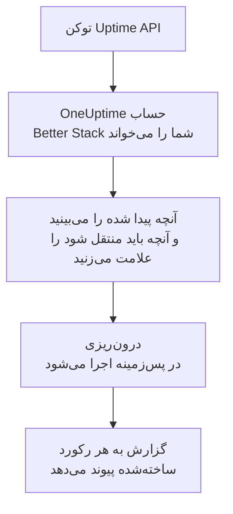

# انتقال از Better Stack

**درون‌ریزی از ابزاری دیگر** مانیتورهای Uptime، heartbeatها و صفحه‌های وضعیت Better Stack شما را در چند دقیقه به OneUptime می‌آورد. با یک توکن Uptime API از Better Stack، ‏OneUptime مانیتورها، heartbeatها، صفحه‌های وضعیت و مشترکان ایمیلی آن‌ها را می‌خواند، آنچه پیدا کرده را نشان می‌دهد و آنچه را علامت بزنید می‌سازد. در Better Stack هیچ چیزی تغییر نمی‌کند.

:::cards
- [درون‌ریزی حساب شما](#درونریزی-حساب-better-stack): یک توکن بسازید، حسابتان را بخوانید و آنچه باید منتقل شود را علامت بزنید.
- [چه چیزی منتقل می‌شود](#چه-چیزی-منتقل-میشود): هر مانیتور، heartbeat و صفحه وضعیت Better Stack در OneUptime به چه تبدیل می‌شود.
- [جابه‌جایی را کامل کنید](#جابهجایی-را-کامل-کنید): کارهایی که پس از درون‌ریزی باید انجام دهید.
:::

## چگونه کار می‌کند

- **کلید فقط یک بار استفاده می‌شود.** تا وقتی OneUptime حساب شما را می‌خواند، کلید رمزنگاری‌شده نگه داشته می‌شود و به محض پایان خواندن، چه موفق بوده باشد چه نه، حذف می‌شود. دیگر هرگز نمایش داده نمی‌شود و در هیچ لاگی نوشته نمی‌شود.
- **OneUptime فقط می‌خواند.** فقط API خود Better Stack را فراخوانی می‌کند: `incidents.betterstack.com`. وقتی Better Stack بخواهد آهسته‌تر پیش برود، صبر می‌کند و دوباره تلاش می‌کند.
- **تا درون‌ریزی را شروع نکنید چیزی ساخته نمی‌شود.** پیش‌نمایش برای هر مورد نشان می‌دهد که جدید است، از قبل در OneUptime هست (و همان‌طور که هست استفاده می‌شود)، یک درون‌ریزی قبلی آن را آورده است، یا چرا نمی‌تواند منتقل شود.
- **اجرای دوباره هرگز چیزی را دو بار نمی‌سازد.** OneUptime به یاد می‌سپارد هر درون‌ریزی بر اساس شناسه Better Stack چه چیزی آورده است. پس از افزودن مانیتور یا heartbeat در Better Stack آن را دوباره اجرا کنید تا فقط موارد جدید ساخته شوند.

## پیش از شروع

- **یک پروژه OneUptime و اجازه ساختن آنچه منتقل می‌کنید.** مالکان و مدیران پروژه می‌توانند همه چیز را منتقل کنند. نقش‌های دیگر هم می‌توانند درون‌ریزی را اجرا کنند و انواع رکوردهایی را که اجازه ساختنشان را دارند منتقل کنند. بقیه همراه با دلیل، منتقل‌نشده نمایش داده می‌شود.
- **یک توکن Uptime API از Better Stack.** از توکن Uptime تیمی استفاده کنید: این توکن مانیتورها، heartbeatها و صفحه‌های وضعیت همان تیم را می‌خواند. درون‌ریزی هرگز در Better Stack چیزی نمی‌نویسد.
- **یک روش پرداخت، در OneUptime Cloud.** مانیتورهایی که بررسی انجام می‌دهند، حتی در طرح Free بر اساس مصرف صورت‌حساب می‌شوند، پس پیش از درون‌ریزی در **تنظیمات پروژه** > **صورت‌حساب** یک روش پرداخت اضافه کنید. بدون آن، این مانیتورها منتقل‌نشده نمایش داده می‌شوند.

## درون‌ریزی حساب Better Stack

:::steps
### ساختن توکن API در Better Stack
در Better Stack به **API tokens** > **Team-based tokens** بروید و تیم خود را انتخاب کنید. زیر **Uptime API tokens** یک توکن با نام `OneUptime import` بسازید و آن را کپی کنید.

### باز کردن صفحه درون‌ریزی
در OneUptime به **تنظیمات پروژه** > **درون‌ریزی از ابزاری دیگر** بروید و **Better Stack** را انتخاب کنید.

### اتصال Better Stack
توکن را در **کلید API ‏Better Stack** جای‌گذاری کنید و **خواندن حساب Better Stack من** را انتخاب کنید. خواندن یک حساب بزرگ چند دقیقه طول می‌کشد و در این مدت می‌توانید صفحه را ترک کنید.

### علامت زدن آنچه باید منتقل شود
پیش‌نمایش آنچه پیدا شده را، برای هر نوع در یک بخش، فهرست می‌کند. هر چیزی که ساخته می‌شود از ابتدا علامت خورده است، به جز مانیتورهای متوقف‌شده، که اگر علامت بزنید به‌صورت متوقف منتقل می‌شوند، و مشترکان. زیر هر مورد، OneUptime می‌گوید چه چیزی دقیقاً همان‌طور که بود منتقل نمی‌شود. وقتی صفحه وضعیتی که علامت خورده مانیتوری را نشان دهد که علامت نزده‌اید، این را می‌گوید و **این‌ها را هم علامت بزنید** آن را علامت می‌زند. برای انتقال مشترکان، آن‌ها را علامت بزنید و سپس زیرشان تأیید کنید که پذیرفته‌اند به‌روزرسانی‌های شما را دریافت کنند و شما اجازه انتقالشان را دارید. به هیچ‌کس ایمیلی فرستاده نمی‌شود.

### شروع درون‌ریزی
**شروع درون‌ریزی** را انتخاب کنید. درون‌ریزی در پس‌زمینه اجرا می‌شود: می‌توانید صفحه را ترک کنید و گزارش همان‌جا منتظر شماست.
:::

گزارش تعداد موارد ساخته‌شده و منتقل‌نشده را می‌شمارد و هر مورد را با پیوندی به رکوردی که به آن تبدیل شده فهرست می‌کند، و خطاها را اول می‌آورد. درون‌ریزی‌های قبلی در همان صفحه زیر **درون‌ریزی‌های قبلی** فهرست شده‌اند.

## چه چیزی منتقل می‌شود

| در Better Stack | در OneUptime | چگونه |
| --- | --- | --- |
| Monitors and heartbeats | مانیتورها | هر مانیتور به مانیتوری از همان نوع با همان نشانی، بازه و مهلت پاسخ تبدیل می‌شود. هر heartbeat به یک مانیتور درخواست ورودی تبدیل می‌شود. |
| Status pages | صفحه‌های وضعیت | هر صفحه با بخش‌هایش به‌عنوان گروه و مانیتورها و heartbeatهایی که نشان می‌دهد منتقل می‌شود. موردی که دستی پیگیری می‌کنید به مانیتور دستی تبدیل می‌شود. صفحه‌ای که گذرواژه یا فهرست مجاز IP دارد به‌صورت خصوصی منتقل می‌شود. |
| Email subscribers | مشترکان صفحه وضعیت | مشترکان ایمیلی تأییدشده وقتی تأیید کنید اجازه انتقالشان را دارید منتقل می‌شوند و همان منابع را دنبال می‌کنند. به هیچ‌کس ایمیلی فرستاده نمی‌شود و هر به‌روزرسانی که از OneUptime دریافت می‌کنند پیوندی برای لغو اشتراک دارد. |

- **مانیتورهای status، expected status code، keyword و keyword absence** به مانیتور وب‌سایت تبدیل می‌شوند، یا اگر متد دیگری، سرآیند یا بدنه JSON بفرستند به مانیتور API. مانیتور status با هر پاسخ 2xx فعال است و مانیتور expected status code با کدهایی که فهرست کرده است.
- **مانیتورهای Ping و TCP** به مانیتورهای Ping و درگاه تبدیل می‌شوند. **مانیتورهای SMTP، POP و IMAP** به مانیتور درگاه روی درگاه خودشان تبدیل می‌شوند: OneUptime بررسی می‌کند که درگاه پاسخ دهد، نه گفت‌وگوی ایمیل را.
- **مانیتورهای DNS** به مانیتور DNS برای نامی که پرس‌وجو می‌کنند تبدیل می‌شوند و از همان سرور می‌پرسند.
- **heartbeatها** به مانیتور درخواست ورودی تبدیل می‌شوند که اگر در طول دوره و مهلت اضافه هیچ درخواستی نرسد از کار افتاده به حساب می‌آیند. هر کدام در OneUptime نشانی جدیدی دارد.
- **هشدارهای انقضای SSL.** مانیتوری که پیش از انقضای گواهی‌اش هشدار می‌دهد، یک مانیتور گواهی SSL هم به نام خودش می‌گیرد که به همان تعداد روز زودتر هشدار می‌دهد.

هر مانیتور، مثل مانیتوری که خودتان می‌سازید، از پراب‌های پروژه شما بررسی می‌شود. بازه‌ای که OneUptime ندارد به نزدیک‌ترین بازه موجود تبدیل می‌شود و مهلت پاسخ بیش از یک دقیقه به یک دقیقه. پیش‌نمایش می‌گوید کدام‌یک تغییر کرده است.

## چه چیزی منتقل نمی‌شود

- **تاریخچه دسترس‌پذیری، زمان‌های پاسخ و حادثه‌ها.** OneUptime از پایان درون‌ریزی بررسی را شروع می‌کند.
- **مخاطبان هشدار و یکپارچه‌سازی‌ها.** همان‌طور که در [جابه‌جایی را کامل کنید](#جابهجایی-را-کامل-کنید) آمده، در OneUptime انتخاب کنید به چه کسی اطلاع داده شود.
- **گذرواژه‌ها و سرآیندهایی که ممکن است رازی داشته باشند.** مانیتوری که وارد حساب می‌شود، یا سرآیند `Authorization`، کوکی یا توکن می‌فرستد، بدون آن منتقل می‌شود: آن را با یک [راز مانیتور](/docs/monitor/monitor-secrets) اضافه کنید.
- **مانیتورهای UDP و Playwright.** OneUptime مانیتوری ندارد که همین کار را بکند و پیش‌نمایش هر کدام را نام می‌برد.
- **مشترکانی که هرگز اشتراکشان را تأیید نکرده‌اند.** آن‌ها در Better Stack می‌مانند.
- **آنچه صفحه وضعیت جز مانیتورها، heartbeatها و موارد پیگیری‌شده دستی نشان می‌دهد.** پیش‌نمایش هر کدام را نام می‌برد.
- **دامنه و برندینگ اختصاصی یک صفحه وضعیت.** در OneUptime دامنه را در **دامنه‌های سفارشی** و لوگو را در **برندینگ** اضافه کنید.

## محدودیت‌ها

هر درون‌ریزی حداکثر ۲٬۰۰۰ رکورد می‌سازد: حداکثر ۱٬۰۰۰ مانیتور و ۵۰ صفحه وضعیت. مشترکان جزو این شمار نیستند: هر درون‌ریزی حداکثر ۵٬۰۰۰ مشترک می‌آورد. هر چیزی فراتر از یک محدودیت، منتقل‌نشده نمایش داده می‌شود. برای آوردن بقیه، درون‌ریزی را دوباره اجرا کنید.

در OneUptime Cloud، مانیتورهایی که بررسی انجام می‌دهند به روش پرداخت نیاز دارند و هر چیزی که طرح شما جایی برایش ندارد، همراه با آنچه لازم دارد، منتقل‌نشده نمایش داده می‌شود.

پیش‌نمایش یک روز نگه داشته می‌شود. فقط کسی که حساب را خوانده می‌تواند موارد را علامت بزند و درون‌ریزی را شروع کند. مالکان و مدیران پروژه پیشرفت و گزارش هر درون‌ریزی را می‌بینند.

## جابه‌جایی را کامل کنید

:::steps
### مانیتورهای خود را بررسی کنید
هر کدام را در **مانیتورها** باز کنید و نخستین نتایجش را بررسی کنید. مانیتور heartbeat نشانی جدیدی دارد: کاری را که آن را فرا می‌خواند به آن نشانی هدایت کنید.

### انتخاب کنید به چه کسی اطلاع داده شود
برای مانیتورهای خود مالک اضافه کنید یا برای حادثه‌هایی که باز می‌کنند یک سیاست آنکال از **کشیک آنکال** > **سیاست‌های آنکال** تعیین کنید تا وقتی چیزی از کار افتاد افراد درست باخبر شوند.

### نشانی صفحه وضعیت خود را به OneUptime هدایت کنید
در **صفحات وضعیت** صفحه را باز کنید، دامنه خود را در **دامنه‌های سفارشی** اضافه کنید و سپس رکورد DNS آن را تغییر دهید. پس از آن بازدیدکنندگان و مشترکان شما به صفحه جدید می‌رسند.

### خاموش کردن بررسی‌ها در Better Stack
وقتی OneUptime همان موارد را بررسی می‌کند، بررسی‌ها را در Better Stack متوقف کنید تا به کسی دو بار اطلاع داده نشود.
:::

## رفع اشکال

:::details Better Stack کلید API را نپذیرفت
بررسی کنید که کل توکن را کپی کرده‌اید و این توکن تیم از **Uptime API tokens** است، نه توکن Telemetry. سپس **تلاش دوباره** را انتخاب کنید.
:::

:::details یک مانیتور منتقل‌نشده نمایش داده می‌شود
دلیلش کنار آن آمده است: نوعی مانیتور که OneUptime ندارد، نشانی‌ای که OneUptime نمی‌تواند بخواند، یا پروژه‌ای که برای آن جا یا روش پرداخت ندارد. اگر OneUptime از قبل مانیتوری با همان نام، نوع و نشانی اجرا کند، همان مانیتور بدون تغییر استفاده می‌شود.
:::

:::details برخی موارد را نمی‌توان علامت زد
کنار هر کدام دلیلش آمده است: نامی که پروژه از قبل دارد، چیزی که یک درون‌ریزی قبلی آورده، یا رکوردی که اجازه ساختنش را ندارید یا طرح شما شامل آن نیست.
:::

## گام‌های بعدی

:::cards
- [مانیتور درخواست ورودی](/docs/monitor/incoming-request-monitor): heartbeat در OneUptime چگونه کار می‌کند.
- [نمای کلی صفحات وضعیت](/docs/status-pages/index): صفحه وضعیت چه چیزی نشان می‌دهد و چه کسی می‌تواند آن را ببیند.
- [انتقال از UptimeRobot](/docs/moving-to-oneuptime/uptimerobot): بررسی‌های خود را از UptimeRobot بیاورید.
:::
