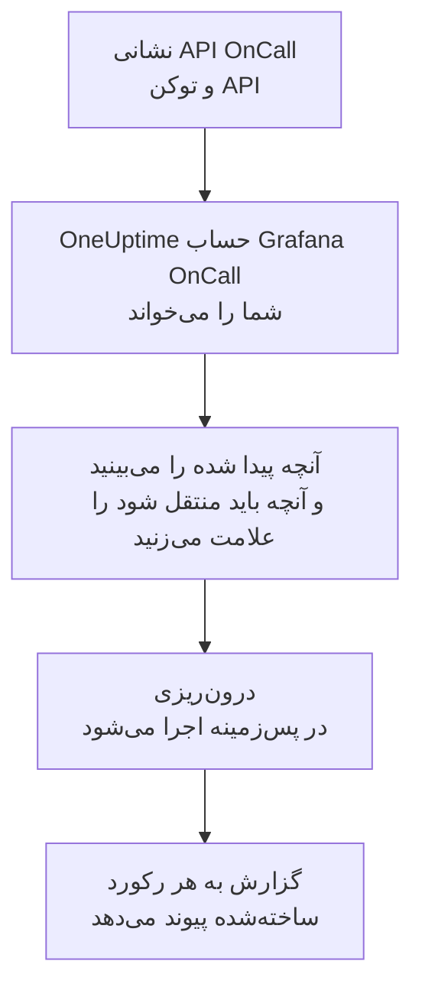

# انتقال از Grafana OnCall

Grafana Labs نسخه متن‌باز Grafana OnCall را در مارس ۲۰۲۶ بایگانی کرد و در Grafana Cloud این ابزار به‌عنوان بخشی از Grafana Cloud IRM ادامه دارد. هر جا که نسخه شما اجرا می‌شود، **درون‌ریزی از ابزاری دیگر** پیکربندی آنکال شما را در چند دقیقه به OneUptime می‌آورد. با نشانی API ‏OnCall و یک توکن API، ‏OneUptime کاربران، تیم‌ها، زمان‌بندی‌ها و زنجیره‌های تشدید شما را می‌خواند، آنچه پیدا کرده را نشان می‌دهد و آنچه را علامت بزنید می‌سازد. در Grafana OnCall هیچ چیزی تغییر نمی‌کند.

:::cards
- [درون‌ریزی حساب شما](#درونریزی-حساب-grafana-oncall): یک توکن بسازید، حسابتان را بخوانید و آنچه باید منتقل شود را علامت بزنید.
- [چه چیزی منتقل می‌شود](#چه-چیزی-منتقل-میشود): هر رکورد Grafana OnCall در OneUptime به چه تبدیل می‌شود.
- [جابه‌جایی را کامل کنید](#جابهجایی-را-کامل-کنید): کارهایی که پس از درون‌ریزی باید انجام دهید.
:::

## چگونه کار می‌کند

- **توکن فقط یک بار استفاده می‌شود.** تا وقتی OneUptime حساب شما را می‌خواند، توکن همراه با نشانی API رمزنگاری‌شده نگه داشته می‌شود و به محض پایان خواندن، چه موفق بوده باشد چه نه، حذف می‌شود. دیگر هرگز نمایش داده نمی‌شود و در هیچ لاگی نوشته نمی‌شود.
- **OneUptime فقط می‌خواند، آن هم فقط از نشانی‌ای که شما می‌دهید.** فقط نشانی API ‏OnCall را که جای‌گذاری می‌کنید فراخوانی می‌کند، حداکثر یک بار در ثانیه، که در محدوده سقف Grafana OnCall یعنی ۳۰۰ درخواست برای هر توکن در پنج دقیقه می‌ماند. وقتی Grafana OnCall بخواهد آهسته‌تر پیش برود، صبر می‌کند و دوباره تلاش می‌کند.
- **نشانی پیش از هر درخواست بررسی می‌شود.** OneUptime هرگز ماشینی را که روی آن اجرا می‌شود یا سرویس فراداده ابری را فرا نمی‌خواند و هرگز از تغییر مسیر پیروی نمی‌کند. در OneUptime Cloud، نشانی باید عمومی هم باشد و با `https://` شروع شود. OneUptime خودمیزبان می‌تواند Grafana OnCall روی شبکه خودتان را هم بخواند، مگر اینکه مدیرش این را خاموش کرده باشد، همان‌طور که در [Private Network Access](/docs/self-hosted/private-network-access) آمده است.
- **تا درون‌ریزی را شروع نکنید چیزی ساخته نمی‌شود.** پیش‌نمایش برای هر مورد نشان می‌دهد که جدید است، از قبل در OneUptime هست (و همان‌طور که هست استفاده می‌شود)، یک درون‌ریزی قبلی آن را آورده است، یا چرا نمی‌تواند منتقل شود.
- **اجرای دوباره هرگز چیزی را دو بار نمی‌سازد.** OneUptime به یاد می‌سپارد هر درون‌ریزی بر اساس شناسه Grafana OnCall چه چیزی آورده است. پس از افزودن افراد یا زمان‌بندی‌ها در Grafana OnCall آن را دوباره اجرا کنید تا فقط موارد جدید ساخته شوند.

## پیش از شروع

- **یک پروژه OneUptime و اجازه ساختن آنچه منتقل می‌کنید.** مالکان و مدیران پروژه می‌توانند همه چیز را منتقل کنند. نقش‌های دیگر هم می‌توانند درون‌ریزی را اجرا کنند و انواع رکوردهایی را که اجازه ساختنشان را دارند منتقل کنند. بقیه همراه با دلیل، منتقل‌نشده نمایش داده می‌شود.
- **یک توکن API ‏Grafana OnCall.** از توکن API ‏OnCall استفاده کنید، نه توکن حساب سرویس Grafana. درون‌ریزی هرگز در Grafana OnCall چیزی نمی‌نویسد. پس از پایان درون‌ریزی توکن را حذف کنید.
- **نشانی API ‏OnCall شما.** تنظیمات OnCall آن را کنار توکن‌های API نشان می‌دهد. در Grafana Cloud شبیه `https://oncall-prod-us-central-0.grafana.net/oncall` است. در نصب خودتان، نشانی موتور OnCall شماست.

## درون‌ریزی حساب Grafana OnCall

:::steps
### ساختن توکن API در Grafana OnCall
در Grafana، ‏**OnCall** > **Settings** را باز کنید. در Grafana Cloud، ‏**IRM** > **Settings** > **Admin & API** را باز کنید. نشانی API ‏OnCall را که آنجا نمایش داده می‌شود کپی کنید. در **API tokens** توکنی با نام `OneUptime import` بسازید و آن را کپی کنید.

### باز کردن صفحه درون‌ریزی
در OneUptime به **تنظیمات پروژه** > **درون‌ریزی از ابزاری دیگر** بروید و **Grafana OnCall** را انتخاب کنید.

### اتصال Grafana OnCall
نشانی را در **نشانی API ‏Grafana OnCall** و توکن را در **کلید API ‏Grafana OnCall** جای‌گذاری کنید و **خواندن حساب Grafana OnCall من** را انتخاب کنید. حساب بزرگ چند دقیقه طول می‌کشد و در طول خواندن می‌توانید صفحه را ترک کنید.

### علامت زدن آنچه باید منتقل شود
پیش‌نمایش آنچه پیدا شده را، برای هر نوع در یک بخش، فهرست می‌کند. هر چیزی که ساخته می‌شود از ابتدا علامت خورده است، به جز افرادی که در هیچ تیم، زمان‌بندی یا زنجیره تشدیدی نیستند. زیر هر مورد، OneUptime می‌گوید چه چیزی دقیقاً همان‌طور که بود منتقل نمی‌شود. وقتی موردی که علامت خورده از چیزی استفاده کند که علامت نزده‌اید، این را می‌گوید و **این‌ها را هم علامت بزنید** آن را علامت می‌زند.

### شروع درون‌ریزی
اگر قرار است افرادی دعوت شوند، در **دعوت افراد جدید به** تیمی را که به آن می‌پیوندند انتخاب کنید. سپس **شروع درون‌ریزی** را انتخاب کنید. درون‌ریزی در پس‌زمینه اجرا می‌شود: می‌توانید صفحه را ترک کنید و گزارش همان‌جا منتظر شماست.
:::

گزارش تعداد موارد ساخته‌شده، دعوت‌شده و منتقل‌نشده را می‌شمارد و هر مورد را با پیوندی به رکوردی که به آن تبدیل شده فهرست می‌کند، و خطاها را اول می‌آورد. درون‌ریزی‌های قبلی در همان صفحه زیر **درون‌ریزی‌های قبلی** فهرست شده‌اند.

## چه چیزی منتقل می‌شود

| در Grafana OnCall | در OneUptime | چگونه |
| --- | --- | --- |
| کاربران | اعضای پروژه | بر اساس نشانی ایمیل تطبیق داده می‌شوند. هر کسی که هنوز در پروژه نیست به تیمی که انتخاب می‌کنید دعوت می‌شود. |
| تیم‌ها | تیم‌ها | همراه با اعضایشان ساخته می‌شوند. تیمی که نامش از قبل در پروژه هست همان‌طور که هست استفاده می‌شود و اعضایش دست نمی‌خورند. |
| زمان‌بندی‌ها | زمان‌بندی‌های آنکال | هر چرخش به لایه‌ای با همان افراد، همان شروع، همان تحویل نوبت و همان ساعت‌های آنکال تبدیل می‌شود، در منطقه زمانی زمان‌بندی و متعلق به تیم زمان‌بندی. چرخشی که در لایه بالاتر است همچنان بر لایه‌های زیرین مقدم است. |
| زنجیره‌های تشدید | سیاست‌های آنکال | گام‌هایی که به افراد، یک تیم یا فرد آنکال یک زمان‌بندی اعلان می‌دهند به قواعد تشدید تبدیل می‌شوند و گام انتظار به انتظار پیش از قاعده بعدی تبدیل می‌شود. گامی که زنجیره را تکرار می‌کند به تکرارهای سیاست تبدیل می‌شود. |

چرخش‌های یک لایه که هم‌زمان آنکال‌اند، و چرخشی که چند نفر را هم‌زمان آنکال می‌کند، هر کدام به یک زمان‌بندی جداگانه OneUptime تبدیل می‌شوند، چون در زمان‌بندی OneUptime هر بار یک نفر آنکال است. هر سیاست آنکالی که آن زمان‌بندی را فرا می‌خواند، همه آن‌ها را فرا می‌خواند.

## چه چیزی منتقل نمی‌شود

- **گروه‌های هشدار و تاریخچه آن‌ها.** OneUptime با پیکربندی شما شروع می‌کند، نه با هشدارهای گذشته.
- **یکپارچه‌سازی‌ها، مسیرها و webhookهای خروجی.** به جای آن، مانیتورها و منابع هشدار خود را به سمت OneUptime بفرستید، همان‌طور که در [جابه‌جایی را کامل کنید](#جابهجایی-را-کامل-کنید) آمده است.
- **جایگزینی‌ها، شیفت‌های یک‌باره و چرخش‌هایی که تمام شده‌اند.** جایگزینی‌هایی را که هنوز لازم دارید پس از درون‌ریزی در OneUptime اضافه کنید.
- **شیفت‌هایی که از پیوند تقویم می‌آیند.** زمان‌بندی‌ای که شیفت‌هایش از یک پیوند iCal می‌آید بدون لایه منتقل می‌شود، پس لایه‌ها را در OneUptime اضافه کنید.
- **قواعد اعلان هر فرد.** هر کس پس از پذیرفتن دعوت، در **تنظیمات کاربر** خود انتخاب می‌کند چگونه فراخوانده شود.
- **گام‌هایی که در OneUptime معادل دقیقی ندارند.** گامی که به یک گروه کاربری یا کانال Slack اعلان می‌دهد، یک webhook را فرا می‌خواند، حادثه اعلام می‌کند یا هشدار را حل می‌کند کنار گذاشته می‌شود. گامی که به افراد یکی‌یکی اعلان می‌دهد همه را هم‌زمان فرا می‌خواند، گامی که فقط در زمان‌های خاص یا با تعداد مشخصی هشدار ادامه می‌یابد همیشه ادامه می‌یابد، و پیش‌نمایش می‌گوید چه چیزی تغییر می‌کند.

## محدودیت‌ها

هر درون‌ریزی حداکثر ۲٬۰۰۰ رکورد می‌سازد: حداکثر ۵۰۰ نفر، ۲۰۰ تیم، ۲۰۰ زمان‌بندی آنکال و ۲۰۰ سیاست آنکال. هر چیزی فراتر از یک محدودیت، منتقل‌نشده نمایش داده می‌شود. برای آوردن بقیه، درون‌ریزی را دوباره اجرا کنید.

در OneUptime Cloud، رکوردهایی که طرح شما شامل آن‌ها نیست، همراه با طرحی که نیاز دارند منتقل‌نشده نمایش داده می‌شوند.

پیش‌نمایش یک روز نگه داشته می‌شود. فقط کسی که حساب را خوانده می‌تواند موارد را علامت بزند و درون‌ریزی را شروع کند. مالکان و مدیران پروژه پیشرفت و گزارش هر درون‌ریزی را می‌بینند.

## جابه‌جایی را کامل کنید

:::steps
### بررسی زمان‌بندی‌های آنکال
هر زمان‌بندی را در **کشیک آنکال** > **زمان‌بندی‌های آنکال** باز کنید و بررسی کنید چه کسی اکنون آنکال است و نفر بعدی کیست.

### مطمئن شوید همه را می‌توان فرا خواند
افراد دعوت‌شده دعوت را می‌پذیرند و سپس شماره تلفن، نشانی ایمیل یا اپ موبایل را برای فراخوانده شدن اضافه می‌کنند. **کشیک آنکال** > **آمادگی** نشان می‌دهد هنوز با چه کسی نمی‌توان تماس گرفت.

### هشدارهای خود را به OneUptime بفرستید
مانیتورها و ابزارهایی را که هشدار می‌دهند به سمت OneUptime بفرستید و برای آزمایش یک بار خودتان را فرا بخوانید.

### خاموش کردن فراخوانی در Grafana OnCall
وقتی OneUptime افراد درست را فرا می‌خواند، اعلان‌ها را در Grafana OnCall خاموش کنید تا کسی دو بار فراخوانده نشود.
:::

## رفع اشکال

:::details Grafana OnCall کلید API را نپذیرفت
بررسی کنید که کل توکن را کپی کرده باشید، که توکن API ‏OnCall باشد نه توکن حساب سرویس Grafana، و که نشانی API همان باشد که کنار آن نمایش داده می‌شود. سپس **تلاش دوباره** را انتخاب کنید.
:::

:::details OneUptime نشانی API را فراخوانی نکرد
نشانی API ‏OnCall را دقیقاً همان‌طور که تنظیمات OnCall نشان می‌دهد جای‌گذاری کنید. در OneUptime Cloud باید با `https://` شروع شود و از اینترنت در دسترس باشد. OneUptime خودمیزبان می‌تواند به نشانی‌ای روی شبکه خودتان هم برسد، مگر اینکه مدیرش این را خاموش کرده باشد، اما هرگز به نشانی‌ای روی ماشینی که OneUptime روی آن اجرا می‌شود نمی‌رسد.
:::

:::details نوعی از رکوردها در پیش‌نمایش نیست
توکن نتوانست آن را بخواند و پیش‌نمایش این را در بالا می‌گوید. توکن همان چیزی را می‌خواند که سازنده‌اش اجازه دیدنش را دارد، پس توکن را به‌عنوان مدیر Grafana OnCall بسازید و حساب را دوباره بخوانید.
:::

:::details برخی موارد را نمی‌توان علامت زد
کنار هر کدام دلیلش آمده است: نامی که پروژه از قبل دارد، چیزی که یک درون‌ریزی قبلی آورده، یا رکوردی که اجازه ساختنش را ندارید یا طرح شما شامل آن نیست.
:::

## گام‌های بعدی

:::cards
- [زمان‌بندی‌های آنکال](/docs/on-call/schedules): لایه‌ها، محدودیت‌ها و تحویل نوبت.
- [قواعد تشدید](/docs/on-call/escalation-rules): سیاست‌های آنکال چگونه افراد را فرا می‌خوانند.
- [انتقال از PagerDuty](/docs/moving-to-oneuptime/pagerduty): تیمی را از PagerDuty بیاورید.
:::
