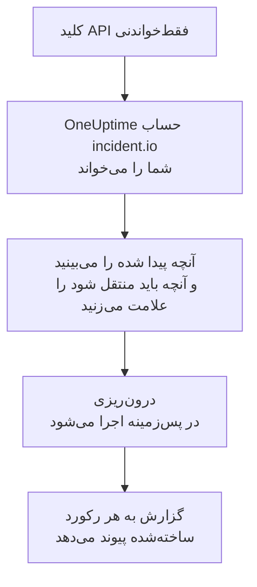

# انتقال از incident.io

**درون‌ریزی از ابزاری دیگر** پیکربندی incident.io شما را در چند دقیقه به OneUptime می‌آورد. با یک کلید API فقط‌خواندنی incident.io، OneUptime کاربران، تیم‌ها، زمان‌بندی‌ها، مسیرهای تشدید، سرویس‌ها و تنظیمات حادثه شما را می‌خواند، آنچه پیدا کرده را نشان می‌دهد و آنچه را علامت بزنید می‌سازد. در incident.io هیچ چیزی تغییر نمی‌کند.

:::cards
- [درون‌ریزی حساب شما](#درونریزی-حساب-incidentio): یک کلید بسازید، حسابتان را بخوانید و آنچه باید منتقل شود را علامت بزنید.
- [چه چیزی منتقل می‌شود](#چه-چیزی-منتقل-میشود): هر رکورد incident.io در OneUptime به چه تبدیل می‌شود.
- [جابه‌جایی را کامل کنید](#جابهجایی-را-کامل-کنید): کارهایی که پس از درون‌ریزی باید انجام دهید.
:::

## چگونه کار می‌کند

- **کلید فقط یک بار استفاده می‌شود.** تا وقتی OneUptime حساب شما را می‌خواند، کلید رمزنگاری‌شده نگه داشته می‌شود و به محض پایان خواندن، چه موفق بوده باشد چه نه، حذف می‌شود. دیگر هرگز نمایش داده نمی‌شود و در هیچ لاگی نوشته نمی‌شود.
- **OneUptime فقط می‌خواند.** فقط API خود incident.io یعنی `api.incident.io` را فراخوانی می‌کند. وقتی incident.io بخواهد آهسته‌تر پیش برود، صبر می‌کند و دوباره تلاش می‌کند.
- **تا درون‌ریزی را شروع نکنید چیزی ساخته نمی‌شود.** پیش‌نمایش برای هر مورد نشان می‌دهد که جدید است، از قبل در OneUptime هست (و همان‌طور که هست استفاده می‌شود)، یک درون‌ریزی قبلی آن را آورده است، یا چرا نمی‌تواند منتقل شود.
- **اجرای دوباره هرگز چیزی را دو بار نمی‌سازد.** OneUptime به یاد می‌سپارد هر درون‌ریزی بر اساس شناسه incident.io چه چیزی آورده است. پس از افزودن افراد یا زمان‌بندی‌ها در incident.io آن را دوباره اجرا کنید تا فقط موارد جدید ساخته شوند.

## پیش از شروع

- **یک پروژه OneUptime و اجازه ساختن آنچه منتقل می‌کنید.** مالکان و مدیران پروژه می‌توانند همه چیز را منتقل کنند. نقش‌های دیگر هم می‌توانند درون‌ریزی را اجرا کنند و انواع رکوردهایی را که اجازه ساختنشان را دارند منتقل کنند. بقیه همراه با دلیل، منتقل‌نشده نمایش داده می‌شود.
- **یک کلید API ‏incident.io که فقط می‌تواند داده‌ها را ببیند.** درون‌ریزی هرگز در incident.io چیزی نمی‌نویسد، پس کلید به هیچ مجوزی برای ساختن، ویرایش یا مدیریت نیاز ندارد.

## درون‌ریزی حساب incident.io

:::steps
### ساختن کلید API در incident.io
در incident.io به **Settings** > **API keys** بروید و **Add new** را انتخاب کنید. نام آن را `OneUptime import` بگذارید، فقط مجوزهای مشاهده داده‌ها را به آن بدهید، نه مجوز ساختن، ویرایش یا مدیریت، و کلید را کپی کنید.

### باز کردن صفحه درون‌ریزی
در OneUptime به **تنظیمات پروژه** > **درون‌ریزی از ابزاری دیگر** بروید و **incident.io** را انتخاب کنید.

### اتصال incident.io
کلید را در **کلید API ‏incident.io** جای‌گذاری کنید و **خواندن حساب incident.io من** را انتخاب کنید. حساب بزرگ چند دقیقه طول می‌کشد و در طول خواندن می‌توانید صفحه را ترک کنید.

### علامت زدن آنچه باید منتقل شود
پیش‌نمایش آنچه پیدا شده را، برای هر نوع در یک بخش، فهرست می‌کند. هر چیزی که ساخته می‌شود از ابتدا علامت خورده است، به جز افرادی که در هیچ تیم، زمان‌بندی یا مسیر تشدیدی نیستند. زیر هر مورد، OneUptime می‌گوید چه چیزی دقیقاً همان‌طور که بود منتقل نمی‌شود. وقتی موردی که علامت خورده از چیزی استفاده کند که علامت نزده‌اید، این را می‌گوید و **این‌ها را هم علامت بزنید** آن را علامت می‌زند.

### شروع درون‌ریزی
اگر قرار است افرادی دعوت شوند، در **دعوت افراد جدید به** تیمی را که به آن می‌پیوندند انتخاب کنید. سپس **شروع درون‌ریزی** را انتخاب کنید. درون‌ریزی در پس‌زمینه اجرا می‌شود: می‌توانید صفحه را ترک کنید و گزارش همان‌جا منتظر شماست.
:::

گزارش تعداد موارد ساخته‌شده، دعوت‌شده و منتقل‌نشده را می‌شمارد و هر مورد را با پیوندی به رکوردی که به آن تبدیل شده فهرست می‌کند، و خطاها را اول می‌آورد. درون‌ریزی‌های قبلی در همان صفحه زیر **درون‌ریزی‌های قبلی** فهرست شده‌اند.

## چه چیزی منتقل می‌شود

| در incident.io | در OneUptime | چگونه |
| --- | --- | --- |
| کاربران | اعضای پروژه | بر اساس نشانی ایمیل تطبیق داده می‌شوند. هر کسی که هنوز در پروژه نیست به تیمی که انتخاب می‌کنید دعوت می‌شود. کاربران غیرفعال‌شده منتقل نمی‌شوند. |
| تیم‌ها | تیم‌ها | همراه با اعضایشان ساخته می‌شوند. تیمی که نامش از قبل در پروژه هست همان‌طور که هست استفاده می‌شود و اعضایش دست نمی‌خورند. |
| زمان‌بندی‌ها | زمان‌بندی‌های آنکال | هر چرخش به لایه‌ای با همان افراد، همان شروع، همان طول نوبت و همان ساعت‌های کاری تبدیل می‌شود، در منطقه زمانی زمان‌بندی. نسخه‌ای از چرخش که اکنون در جریان است منتقل می‌شود. |
| مسیرهای تشدید | سیاست‌های آنکال | هر سطح به یک قاعده تشدید تبدیل می‌شود که پس از همان انتظار، همان زمان‌بندی‌ها، کاربران و تیم‌ها را فرا می‌خواند. تکرار به تکرارهای سیاست تبدیل می‌شود و از یک انشعاب، مسیر اول منتقل می‌شود. |
| سرویس‌های کاتالوگ | سرویس‌ها | ورودی‌های انواع کاتالوگ شما در دسته سرویس، که در کاتالوگ سرویس ساخته می‌شوند. ورودی‌های بایگانی‌شده کنار گذاشته می‌شوند. |
| شدت‌ها | شدت‌های حادثه | به ترتیب incident.io و از شدیدترین ساخته می‌شوند. شدتی که نامش از قبل در پروژه هست همان‌طور که هست استفاده می‌شود. |
| وضعیت‌ها | وضعیت‌های حادثه | وضعیت تریاژ با وضعیتی که OneUptime حادثه‌ها را در آن آغاز می‌کند تطبیق دارد و وضعیت بسته با وضعیتی که حادثه‌ها در آن برطرف می‌شوند. وضعیت‌های فعال و متوقف‌شده بین تأییدشده و برطرف‌شده ساخته می‌شوند. |
| نقش‌های حادثه | نقش‌های حادثه | نقش رهبر با فرمانده حادثه در OneUptime تطبیق دارد و نقش‌های دیگر ساخته می‌شوند. OneUptime ثبت می‌کند چه کسی هر حادثه را اعلام کرده، پس نقش گزارشگر لازم نیست. |
| فیلدهای سفارشی | فیلدهای سفارشی حادثه | فیلدهای تک‌انتخابی به فهرست کشویی، فیلدهای چندانتخابی به فهرست کشویی چندانتخابی، فیلدهای متنی و پیوندی به متن و فیلدهای عددی به عدد تبدیل می‌شوند، همراه با گزینه‌هایشان. |

چرخشی که در آن چند نفر هم‌زمان آنکال‌اند، برای هر نفر آنکال به یک زمان‌بندی OneUptime تبدیل می‌شود، چون در زمان‌بندی OneUptime هر بار یک نفر آنکال است. هر سیاست آنکالی که آن زمان‌بندی را فرا می‌خواند، همه آن‌ها را فرا می‌خواند.

## چه چیزی منتقل نمی‌شود

- **حادثه‌ها، هشدارها و تاریخچه آن‌ها.** OneUptime با پیکربندی شما شروع می‌کند، نه با حادثه‌های گذشته.
- **گردش‌کارها، صفحه‌های وضعیت، مسیرهای هشدار و یکپارچه‌سازی‌ها.** به جای آن، مانیتورها و منابع هشدار خود را به سمت OneUptime بفرستید، همان‌طور که در [جابه‌جایی را کامل کنید](#جابهجایی-را-کامل-کنید) آمده است.
- **فیلدهای سفارشی‌ای که گزینه‌هایشان از کاتالوگ می‌آید،** و وضعیت‌هایی که OneUptime برایشان وضعیتی ندارد: declined، merged، canceled و learning.
- **جایگزینی‌های زمان‌بندی و تغییراتی در یک چرخش که برای بعد برنامه‌ریزی شده‌اند.** پیش‌نمایش هر تغییر برنامه‌ریزی‌شده را نام می‌برد تا وقتش که رسید آن را در OneUptime انجام دهید.
- **گام‌های تشدیدی که در OneUptime معادل دقیقی ندارند.** گامی که در کانال Slack یا Microsoft Teams پست می‌کند کنار گذاشته می‌شود، چون در OneUptime این کار را قواعد اعلان فضای کاری انجام می‌دهند، و گامی که کار را به مسیر تشدید دیگری می‌سپارد هم همین‌طور. گامی که نفر بعدی آنکال را فرا می‌خواند به نزدیک‌ترین شکلی که OneUptime دارد منتقل می‌شود و پیش‌نمایش می‌گوید چه چیزی تغییر می‌کند.

## محدودیت‌ها

هر درون‌ریزی حداکثر ۲٬۰۰۰ رکورد می‌سازد: حداکثر ۵۰۰ نفر، ۲۰۰ تیم، ۲۰۰ زمان‌بندی آنکال، ۲۰۰ سیاست آنکال، ۵۰۰ سرویس، ۱۰۰ فیلد سفارشی حادثه و از هر کدام از شدت‌ها، وضعیت‌ها و نقش‌های حادثه ۲۵ مورد. هر چیزی فراتر از یک محدودیت، منتقل‌نشده نمایش داده می‌شود. برای آوردن بقیه، درون‌ریزی را دوباره اجرا کنید.

در OneUptime Cloud، رکوردهایی که طرح شما شامل آن‌ها نیست، همراه با طرحی که نیاز دارند منتقل‌نشده نمایش داده می‌شوند.

پیش‌نمایش یک روز نگه داشته می‌شود. فقط کسی که حساب را خوانده می‌تواند موارد را علامت بزند و درون‌ریزی را شروع کند. مالکان و مدیران پروژه پیشرفت و گزارش هر درون‌ریزی را می‌بینند.

## جابه‌جایی را کامل کنید

:::steps
### بررسی زمان‌بندی‌های آنکال
هر زمان‌بندی را در **کشیک آنکال** > **زمان‌بندی‌های آنکال** باز کنید و بررسی کنید چه کسی اکنون آنکال است و نفر بعدی کیست.

### مطمئن شوید همه را می‌توان فرا خواند
افراد دعوت‌شده دعوت را می‌پذیرند و سپس شماره تلفن، نشانی ایمیل یا اپ موبایل را برای فراخوانده شدن اضافه می‌کنند. **کشیک آنکال** > **آمادگی** نشان می‌دهد هنوز با چه کسی نمی‌توان تماس گرفت.

### هشدارهای خود را به OneUptime بفرستید
مانیتورها و ابزارهایی را که هشدار می‌دهند به سمت OneUptime بفرستید و برای آزمایش یک بار خودتان را فرا بخوانید.

### خاموش کردن فراخوانی در incident.io
وقتی OneUptime افراد درست را فرا می‌خواند، اعلان‌ها را در incident.io خاموش کنید تا کسی دو بار فراخوانده نشود.
:::

## رفع اشکال

:::details incident.io کلید API را نپذیرفت
بررسی کنید که کل کلید را کپی کرده باشید و که کلید در **Settings** > **API keys** حذف نشده باشد. سپس **تلاش دوباره** را انتخاب کنید.
:::

:::details نوعی از رکوردها در پیش‌نمایش نیست
کلید نتوانست آن را بخواند و پیش‌نمایش این را در بالا می‌گوید. به کلید اجازه مشاهده آن نوع داده را بدهید و حساب را دوباره بخوانید.
:::

:::details برخی موارد را نمی‌توان علامت زد
کنار هر کدام دلیلش آمده است: کاربر غیرفعال‌شده، نامی که پروژه از قبل دارد، چیزی که یک درون‌ریزی قبلی آورده، یا رکوردی که اجازه ساختنش را ندارید یا طرح شما شامل آن نیست.
:::

## گام‌های بعدی

:::cards
- [زمان‌بندی‌های آنکال](/docs/on-call/schedules): لایه‌ها، محدودیت‌ها و تحویل نوبت.
- [وضعیت‌ها و شدت‌های حادثه](/docs/incidents/states-and-severities): وضعیت‌ها و شدت‌هایی که حادثه‌ها از آن‌ها می‌گذرند.
- [انتقال از Opsgenie](/docs/moving-to-oneuptime/opsgenie): تیمی را از Opsgenie بیاورید.
:::
