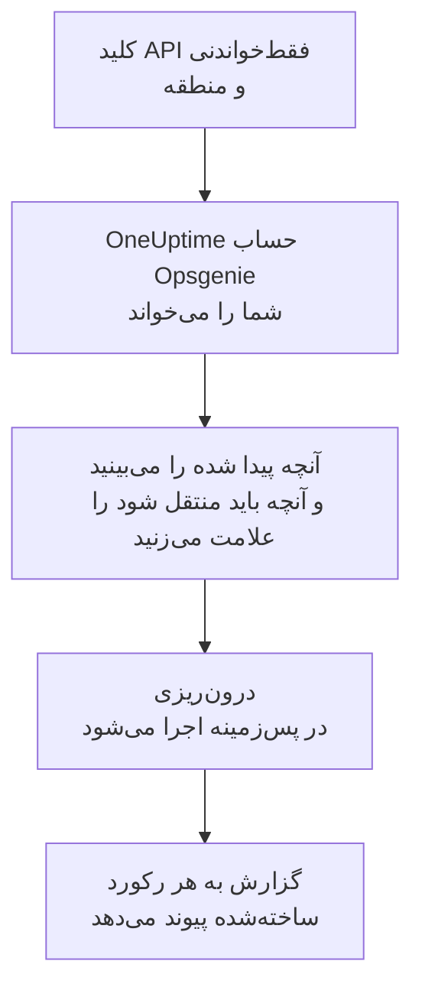

# انتقال از Opsgenie

Atlassian در حال کنار گذاشتن Opsgenie است: فروش Opsgenie از ژوئن ۲۰۲۵ متوقف شده و پشتیبانی آن در آوریل ۲۰۲۷ پایان می‌یابد. OneUptime خانه تازه‌ای برای تیم آنکال شماست و **درون‌ریزی از ابزاری دیگر** آن را در چند دقیقه منتقل می‌کند. با یک کلید API فقط‌خواندنی Opsgenie، OneUptime کاربران، تیم‌ها، زمان‌بندی‌ها، تشدیدها و سرویس‌های شما را می‌خواند، آنچه پیدا کرده را نشان می‌دهد و آنچه را علامت بزنید می‌سازد. در Opsgenie هیچ چیزی تغییر نمی‌کند.

:::cards
- [درون‌ریزی حساب شما](#درونریزی-حساب-opsgenie): یک کلید بسازید، حسابتان را بخوانید و آنچه باید منتقل شود را علامت بزنید.
- [چه چیزی منتقل می‌شود](#چه-چیزی-منتقل-میشود): هر رکورد Opsgenie در OneUptime به چه تبدیل می‌شود.
- [جابه‌جایی را کامل کنید](#جابهجایی-را-کامل-کنید): کارهایی که پس از درون‌ریزی باید انجام دهید.
:::

## چگونه کار می‌کند

- **کلید فقط یک بار استفاده می‌شود.** تا وقتی OneUptime حساب شما را می‌خواند، کلید رمزنگاری‌شده نگه داشته می‌شود و به محض پایان خواندن، چه موفق بوده باشد چه نه، حذف می‌شود. دیگر هرگز نمایش داده نمی‌شود و در هیچ لاگی نوشته نمی‌شود.
- **OneUptime فقط می‌خواند.** فقط API خود Opsgenie را فراخوانی می‌کند: `api.opsgenie.com`، یا برای حسابی در اروپا `api.eu.opsgenie.com`. وقتی Opsgenie بخواهد آهسته‌تر پیش برود، صبر می‌کند و دوباره تلاش می‌کند.
- **تا درون‌ریزی را شروع نکنید چیزی ساخته نمی‌شود.** پیش‌نمایش برای هر مورد نشان می‌دهد که جدید است، از قبل در OneUptime هست (و همان‌طور که هست استفاده می‌شود)، یک درون‌ریزی قبلی آن را آورده است، یا چرا نمی‌تواند منتقل شود.
- **اجرای دوباره هرگز چیزی را دو بار نمی‌سازد.** OneUptime به یاد می‌سپارد هر درون‌ریزی بر اساس شناسه Opsgenie چه چیزی آورده است. پس از افزودن افراد یا زمان‌بندی‌ها در Opsgenie آن را دوباره اجرا کنید تا فقط موارد جدید ساخته شوند.

## پیش از شروع

- **یک پروژه OneUptime و اجازه ساختن آنچه منتقل می‌کنید.** مالکان و مدیران پروژه می‌توانند همه چیز را منتقل کنند. نقش‌های دیگر هم می‌توانند درون‌ریزی را اجرا کنند و انواع رکوردهایی را که اجازه ساختنشان را دارند منتقل کنند. بقیه همراه با دلیل، منتقل‌نشده نمایش داده می‌شود.
- **یک کلید API ‏Opsgenie با دسترسی‌های Read و Configuration access.** دسترسی Configuration access است که به کلید اجازه می‌دهد کاربران، تیم‌ها، زمان‌بندی‌ها و تشدیدها را بخواند. درون‌ریزی هرگز در Opsgenie چیزی نمی‌نویسد.
- **منطقه Opsgenie شما.** اگر در `app.eu.opsgenie.com` وارد می‌شوید، حساب شما در اروپاست. در غیر این صورت در ایالات متحده است.

## درون‌ریزی حساب Opsgenie

:::steps
### ساختن کلید API در Opsgenie
در Opsgenie به **Settings** > **API key management** بروید و **Add new API key** را انتخاب کنید. نام آن را `OneUptime import` بگذارید، فقط **Read** و **Configuration access** را به آن بدهید و کلید را کپی کنید.

### باز کردن صفحه درون‌ریزی
در OneUptime به **تنظیمات پروژه** > **درون‌ریزی از ابزاری دیگر** بروید و **Opsgenie** را انتخاب کنید.

### اتصال Opsgenie
در **حساب Opsgenie شما کجاست؟** گزینه **ایالات متحده** یا **اروپا** را انتخاب کنید. کلید را در **کلید API ‏Opsgenie** جای‌گذاری کنید و **خواندن حساب Opsgenie من** را انتخاب کنید. حساب بزرگ چند دقیقه طول می‌کشد و در طول خواندن می‌توانید صفحه را ترک کنید.

### علامت زدن آنچه باید منتقل شود
پیش‌نمایش آنچه پیدا شده را، برای هر نوع در یک بخش، فهرست می‌کند. هر چیزی که ساخته می‌شود از ابتدا علامت خورده است، به جز زمان‌بندی‌هایی که در Opsgenie خاموش‌اند و افرادی که در هیچ تیم، زمان‌بندی یا تشدیدی نیستند. زیر هر مورد، OneUptime می‌گوید چه چیزی دقیقاً همان‌طور که بود منتقل نمی‌شود. وقتی موردی که علامت خورده از چیزی استفاده کند که علامت نزده‌اید، این را می‌گوید و **این‌ها را هم علامت بزنید** آن را علامت می‌زند.

### شروع درون‌ریزی
اگر قرار است افرادی دعوت شوند، در **دعوت افراد جدید به** تیمی را که به آن می‌پیوندند انتخاب کنید. سپس **شروع درون‌ریزی** را انتخاب کنید. درون‌ریزی در پس‌زمینه اجرا می‌شود: می‌توانید صفحه را ترک کنید و گزارش همان‌جا منتظر شماست.
:::

گزارش تعداد موارد ساخته‌شده، دعوت‌شده و منتقل‌نشده را می‌شمارد و هر مورد را با پیوندی به رکوردی که به آن تبدیل شده فهرست می‌کند، و خطاها را اول می‌آورد. درون‌ریزی‌های قبلی در همان صفحه زیر **درون‌ریزی‌های قبلی** فهرست شده‌اند.

## چه چیزی منتقل می‌شود

| در Opsgenie | در OneUptime | چگونه |
| --- | --- | --- |
| کاربران | اعضای پروژه | بر اساس نشانی ایمیل تطبیق داده می‌شوند. هر کسی که هنوز در پروژه نیست به تیمی که انتخاب می‌کنید دعوت می‌شود. کاربران مسدودشده منتقل نمی‌شوند. |
| تیم‌ها | تیم‌ها | همراه با اعضایشان ساخته می‌شوند. تیمی که نامش از قبل در پروژه هست همان‌طور که هست استفاده می‌شود و اعضایش دست نمی‌خورند. |
| زمان‌بندی‌ها | زمان‌بندی‌های آنکال | هر چرخش به لایه‌ای با همان افراد، همان شروع، همان طول نوبت و همان محدودیت زمانی تبدیل می‌شود، در منطقه زمانی زمان‌بندی و متعلق به تیم زمان‌بندی. |
| تشدیدها | سیاست‌های آنکال | هر قاعده به یک قاعده تشدید تبدیل می‌شود که همان زمان‌بندی، کاربر یا تیم را فرا می‌خواند. قاعده‌هایی با تأخیر یکسان با هم فرا می‌خوانند و انتظار پیش از قاعده تشدید بعدی، تفاوت تأخیرهاست. تکرارهای تشدید به تکرارهای سیاست تبدیل می‌شوند. |
| سرویس‌ها | سرویس‌ها | در کاتالوگ سرویس ساخته می‌شوند و مالکشان تیم خودشان است. |

زمان‌بندی‌ای که چرخش‌هایش دو نفر را هم‌زمان آنکال می‌کند، برای هر چرخش به یک زمان‌بندی OneUptime تبدیل می‌شود، چون در زمان‌بندی OneUptime هر بار یک نفر آنکال است. هر سیاست آنکالی که آن زمان‌بندی را فرا می‌خواند، همه آن‌ها را فرا می‌خواند.

## چه چیزی منتقل نمی‌شود

- **هشدارها، حادثه‌ها و تاریخچه آن‌ها.** OneUptime با پیکربندی شما شروع می‌کند، نه با هشدارهای گذشته.
- **یکپارچه‌سازی‌ها، ضربان‌ها، سیاست‌های هشدار و قواعد مسیریابی.** به جای آن، مانیتورها و منابع هشدار خود را به سمت OneUptime بفرستید، همان‌طور که در [جابه‌جایی را کامل کنید](#جابهجایی-را-کامل-کنید) آمده است.
- **جایگزینی‌های زمان‌بندی و چرخش‌هایی که تمام شده‌اند.** جایگزینی‌هایی را که هنوز لازم دارید پس از درون‌ریزی در OneUptime اضافه کنید.
- **قواعد اعلان هر فرد.** هر کس پس از پذیرفتن دعوت، در **تنظیمات کاربر** خود انتخاب می‌کند چگونه فراخوانده شود.
- **گام‌هایی که در OneUptime معادل دقیقی ندارند.** قاعده‌ای که نفر بعدی آنکال یا مدیران یک تیم را فرا می‌خواند، به نزدیک‌ترین شکلی که OneUptime دارد منتقل می‌شود و پیش‌نمایش می‌گوید چه چیزی تغییر می‌کند.

## محدودیت‌ها

هر درون‌ریزی حداکثر ۲٬۰۰۰ رکورد می‌سازد: حداکثر ۵۰۰ نفر، ۲۰۰ تیم، ۲۰۰ زمان‌بندی آنکال، ۲۰۰ سیاست آنکال و ۵۰۰ سرویس. هر چیزی فراتر از یک محدودیت، منتقل‌نشده نمایش داده می‌شود. برای آوردن بقیه، درون‌ریزی را دوباره اجرا کنید.

در OneUptime Cloud، رکوردهایی که طرح شما شامل آن‌ها نیست، همراه با طرحی که نیاز دارند منتقل‌نشده نمایش داده می‌شوند.

پیش‌نمایش یک روز نگه داشته می‌شود. فقط کسی که حساب را خوانده می‌تواند موارد را علامت بزند و درون‌ریزی را شروع کند. مالکان و مدیران پروژه پیشرفت و گزارش هر درون‌ریزی را می‌بینند.

## جابه‌جایی را کامل کنید

:::steps
### بررسی زمان‌بندی‌های آنکال
هر زمان‌بندی را در **کشیک آنکال** > **زمان‌بندی‌های آنکال** باز کنید و بررسی کنید چه کسی اکنون آنکال است و نفر بعدی کیست.

### مطمئن شوید همه را می‌توان فرا خواند
افراد دعوت‌شده دعوت را می‌پذیرند و سپس شماره تلفن، نشانی ایمیل یا اپ موبایل را برای فراخوانده شدن اضافه می‌کنند. **کشیک آنکال** > **آمادگی** نشان می‌دهد هنوز با چه کسی نمی‌توان تماس گرفت.

### هشدارهای خود را به OneUptime بفرستید
مانیتورها و ابزارهایی را که هشدار می‌دهند به سمت OneUptime بفرستید و برای آزمایش یک بار خودتان را فرا بخوانید.

### خاموش کردن فراخوانی در Opsgenie
وقتی OneUptime افراد درست را فرا می‌خواند، اعلان‌ها را در Opsgenie خاموش کنید تا کسی دو بار فراخوانده نشود.
:::

## رفع اشکال

:::details Opsgenie کلید API را نپذیرفت
بررسی کنید که کل کلید را کپی کرده باشید، که کلید از **API key management** باشد نه کلید یک یکپارچه‌سازی، که **Read** و **Configuration access** را داشته باشد، و که منطقه‌ای را که حسابتان در آن است انتخاب کرده باشید. سپس **تلاش دوباره** را انتخاب کنید.
:::

:::details نوعی از رکوردها در پیش‌نمایش نیست
کلید نتوانست آن را بخواند و پیش‌نمایش این را در بالا می‌گوید. به کلید **Configuration access** بدهید و حساب را دوباره بخوانید.
:::

:::details برخی موارد را نمی‌توان علامت زد
کنار هر کدام دلیلش آمده است: کاربر مسدودشده، نامی که پروژه از قبل دارد، چیزی که یک درون‌ریزی قبلی آورده، یا رکوردی که اجازه ساختنش را ندارید یا طرح شما شامل آن نیست.
:::

## گام‌های بعدی

:::cards
- [زمان‌بندی‌های آنکال](/docs/on-call/schedules): لایه‌ها، محدودیت‌ها و تحویل نوبت.
- [قواعد تشدید](/docs/on-call/escalation-rules): سیاست‌های آنکال چگونه افراد را فرا می‌خوانند.
- [انتقال از incident.io](/docs/moving-to-oneuptime/incident-io): تیمی را از incident.io بیاورید.
:::
