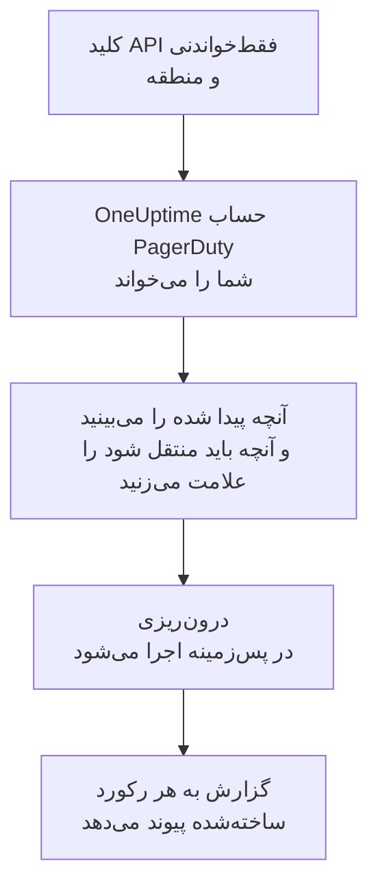

# انتقال از PagerDuty

**درون‌ریزی از ابزاری دیگر** پیکربندی PagerDuty شما را در چند دقیقه به OneUptime می‌آورد. با یک کلید API فقط‌خواندنی PagerDuty، ‏OneUptime کاربران، تیم‌ها، زمان‌بندی‌ها، سیاست‌های تشدید و سرویس‌های شما را می‌خواند، آنچه پیدا کرده را نشان می‌دهد و آنچه را علامت بزنید می‌سازد. در PagerDuty هیچ چیزی تغییر نمی‌کند.

:::cards
- [درون‌ریزی حساب شما](#درونریزی-حساب-pagerduty): یک کلید بسازید، حسابتان را بخوانید و آنچه باید منتقل شود را علامت بزنید.
- [چه چیزی منتقل می‌شود](#چه-چیزی-منتقل-میشود): هر رکورد PagerDuty در OneUptime به چه تبدیل می‌شود.
- [جابه‌جایی را کامل کنید](#جابهجایی-را-کامل-کنید): کارهایی که پس از درون‌ریزی باید انجام دهید.
:::

## چگونه کار می‌کند

- **کلید فقط یک بار استفاده می‌شود.** تا وقتی OneUptime حساب شما را می‌خواند، کلید رمزنگاری‌شده نگه داشته می‌شود و به محض پایان خواندن، چه موفق بوده باشد چه نه، حذف می‌شود. دیگر هرگز نمایش داده نمی‌شود و در هیچ لاگی نوشته نمی‌شود.
- **OneUptime فقط می‌خواند.** فقط REST API خود PagerDuty را فراخوانی می‌کند: `api.pagerduty.com`، یا برای حسابی در اروپا `api.eu.pagerduty.com`. وقتی PagerDuty بخواهد آهسته‌تر پیش برود، صبر می‌کند و دوباره تلاش می‌کند.
- **تا درون‌ریزی را شروع نکنید چیزی ساخته نمی‌شود.** پیش‌نمایش برای هر مورد نشان می‌دهد که جدید است، از قبل در OneUptime هست (و همان‌طور که هست استفاده می‌شود)، یک درون‌ریزی قبلی آن را آورده است، یا چرا نمی‌تواند منتقل شود.
- **اجرای دوباره هرگز چیزی را دو بار نمی‌سازد.** OneUptime به یاد می‌سپارد هر درون‌ریزی بر اساس شناسه PagerDuty چه چیزی آورده است. پس از افزودن افراد یا زمان‌بندی‌ها در PagerDuty آن را دوباره اجرا کنید تا فقط موارد جدید ساخته شوند.

## پیش از شروع

- **یک پروژه OneUptime و اجازه ساختن آنچه منتقل می‌کنید.** مالکان و مدیران پروژه می‌توانند همه چیز را منتقل کنند. نقش‌های دیگر هم می‌توانند درون‌ریزی را اجرا کنند و انواع رکوردهایی را که اجازه ساختنشان را دارند منتقل کنند. بقیه همراه با دلیل، منتقل‌نشده نمایش داده می‌شود.
- **یک کلید REST API فقط‌خواندنی PagerDuty.** مدیران و مالکان حساب در PagerDuty می‌توانند آن را بسازند. درون‌ریزی هرگز در PagerDuty چیزی نمی‌نویسد، پس کلید فقط به دسترسی خواندن نیاز دارد.
- **منطقه PagerDuty شما.** اگر نشانی‌ای که در آن وارد می‌شوید به `eu.pagerduty.com` ختم می‌شود، حساب شما در اروپاست. در غیر این صورت در ایالات متحده است.

## درون‌ریزی حساب PagerDuty

:::steps
### ساختن کلید API در PagerDuty
در PagerDuty به **Integrations** > **Developer Tools** > **API Access Keys** بروید و **Create New API Key** را انتخاب کنید. در توضیح آن `OneUptime import` را بنویسید، **Read-only API Key** را علامت بزنید، **Create Key** را انتخاب کنید و کلید را کپی کنید.

### باز کردن صفحه درون‌ریزی
در OneUptime به **تنظیمات پروژه** > **درون‌ریزی از ابزاری دیگر** بروید و **PagerDuty** را انتخاب کنید.

### اتصال PagerDuty
در **حساب PagerDuty شما کجاست؟** گزینه **ایالات متحده** یا **اروپا** را انتخاب کنید. کلید را در **کلید API ‏PagerDuty** جای‌گذاری کنید و **خواندن حساب PagerDuty من** را انتخاب کنید. حساب بزرگ چند دقیقه طول می‌کشد و در طول خواندن می‌توانید صفحه را ترک کنید.

### علامت زدن آنچه باید منتقل شود
پیش‌نمایش آنچه پیدا شده را، برای هر نوع در یک بخش، فهرست می‌کند. هر چیزی که ساخته می‌شود از ابتدا علامت خورده است، به جز سرویس‌هایی که در PagerDuty خاموش‌اند و افرادی که در هیچ تیم، زمان‌بندی یا سیاست تشدیدی نیستند. زیر هر مورد، OneUptime می‌گوید چه چیزی دقیقاً همان‌طور که بود منتقل نمی‌شود. وقتی موردی که علامت خورده از چیزی استفاده کند که علامت نزده‌اید، این را می‌گوید و **این‌ها را هم علامت بزنید** آن را علامت می‌زند.

### شروع درون‌ریزی
اگر قرار است افرادی دعوت شوند، در **دعوت افراد جدید به** تیمی را که به آن می‌پیوندند انتخاب کنید. سپس **شروع درون‌ریزی** را انتخاب کنید. درون‌ریزی در پس‌زمینه اجرا می‌شود: می‌توانید صفحه را ترک کنید و گزارش همان‌جا منتظر شماست.
:::

گزارش تعداد موارد ساخته‌شده، دعوت‌شده و منتقل‌نشده را می‌شمارد و هر مورد را با پیوندی به رکوردی که به آن تبدیل شده فهرست می‌کند، و خطاها را اول می‌آورد. درون‌ریزی‌های قبلی در همان صفحه زیر **درون‌ریزی‌های قبلی** فهرست شده‌اند.

## چه چیزی منتقل می‌شود

| در PagerDuty | در OneUptime | چگونه |
| --- | --- | --- |
| کاربران | اعضای پروژه | بر اساس نشانی ایمیل تطبیق داده می‌شوند. هر کسی که هنوز در پروژه نیست به تیمی که انتخاب می‌کنید دعوت می‌شود. |
| تیم‌ها | تیم‌ها | همراه با اعضایشان ساخته می‌شوند. تیمی که نامش از قبل در پروژه هست همان‌طور که هست استفاده می‌شود و اعضایش دست نمی‌خورند. |
| زمان‌بندی‌ها | زمان‌بندی‌های آنکال | هر لایه به لایه‌ای با همان افراد، همان شروع، همان طول نوبت و همان محدودیت‌ها تبدیل می‌شود، در منطقه زمانی زمان‌بندی و متعلق به تیم زمان‌بندی. لایه‌ها ترتیبشان را حفظ می‌کنند، پس لایه بالاتر همچنان بر لایه‌های زیرین مقدم است. |
| سیاست‌های تشدید | سیاست‌های آنکال | هر قاعده تشدید به یک قاعده تشدید تبدیل می‌شود که همان زمان‌بندی‌ها و کاربران را فرا می‌خواند و پس از همان تأخیر تشدید می‌کند. تکرارهای سیاست به تکرارهای سیاست آنکال تبدیل می‌شوند. |
| سرویس‌ها | سرویس‌ها | در کاتالوگ سرویس ساخته می‌شوند و مالکشان تیم خودشان است. سرویسی که در PagerDuty خاموش است در ابتدا علامت نخورده است. |

زمان‌بندی PagerDuty یک زمان‌بندی OneUptime باقی می‌ماند: لایه‌هایش همان‌طور که در PagerDuty بر هم مقدم‌اند، اینجا هم مقدم‌اند. لایه‌ای که نوبت‌هایش ساعت کامل نیستند با نوبت‌های گردشده به ساعت منتقل می‌شود و پیش‌نمایش این را می‌گوید.

## چه چیزی منتقل نمی‌شود

- **حادثه‌ها، هشدارها و تاریخچه آن‌ها.** OneUptime با پیکربندی شما شروع می‌کند، نه با حادثه‌های گذشته.
- **یکپارچه‌سازی‌ها، Event Orchestrations، ‏Incident Workflows و صفحه‌های وضعیت.** به جای آن، مانیتورها و منابع هشدار خود را به سمت OneUptime بفرستید، همان‌طور که در [جابه‌جایی را کامل کنید](#جابهجایی-را-کامل-کنید) آمده است.
- **جایگزینی‌های زمان‌بندی و لایه‌هایی که تمام شده‌اند.** جایگزینی‌هایی را که هنوز لازم دارید پس از درون‌ریزی در OneUptime اضافه کنید.
- **زمان‌بندی‌های مبتنی بر شیفت.** درون‌ریزی زمان‌بندی‌های لایه‌ای PagerDuty را می‌خواند، نه زمان‌بندی‌های جدیدتر مبتنی بر شیفت (shift-based schedules). اگر حساب شما چنین زمان‌بندی‌هایی دارد، پیش‌نمایش این را در بالا می‌گوید و قاعده تشدیدی که یکی از آن‌ها را فرا می‌خواند بدون آن منتقل می‌شود. آن‌ها را در OneUptime بسازید.
- **قواعد اعلان هر فرد.** هر کس پس از پذیرفتن دعوت، در **تنظیمات کاربر** خود انتخاب می‌کند چگونه فراخوانده شود.
- **قواعدی که در OneUptime معادل دقیقی ندارند.** قاعده تشدیدی که افرادش را به نوبت (round robin) تعیین می‌کند، در OneUptime همه را هم‌زمان فرا می‌خواند و پیش‌نمایش می‌گوید چه چیزی تغییر می‌کند.

## محدودیت‌ها

هر درون‌ریزی حداکثر ۲٬۰۰۰ رکورد می‌سازد: حداکثر ۵۰۰ نفر، ۲۰۰ تیم، ۲۰۰ زمان‌بندی آنکال، ۲۰۰ سیاست آنکال و ۵۰۰ سرویس. هر چیزی فراتر از یک محدودیت، منتقل‌نشده نمایش داده می‌شود. برای آوردن بقیه، درون‌ریزی را دوباره اجرا کنید.

در OneUptime Cloud، رکوردهایی که طرح شما شامل آن‌ها نیست، همراه با طرحی که نیاز دارند منتقل‌نشده نمایش داده می‌شوند.

پیش‌نمایش یک روز نگه داشته می‌شود. فقط کسی که حساب را خوانده می‌تواند موارد را علامت بزند و درون‌ریزی را شروع کند. مالکان و مدیران پروژه پیشرفت و گزارش هر درون‌ریزی را می‌بینند.

## جابه‌جایی را کامل کنید

:::steps
### بررسی زمان‌بندی‌های آنکال
هر زمان‌بندی را در **کشیک آنکال** > **زمان‌بندی‌های آنکال** باز کنید و بررسی کنید چه کسی اکنون آنکال است و نفر بعدی کیست.

### مطمئن شوید همه را می‌توان فرا خواند
افراد دعوت‌شده دعوت را می‌پذیرند و سپس شماره تلفن، نشانی ایمیل یا اپ موبایل را برای فراخوانده شدن اضافه می‌کنند. **کشیک آنکال** > **آمادگی** نشان می‌دهد هنوز با چه کسی نمی‌توان تماس گرفت.

### هشدارهای خود را به OneUptime بفرستید
مانیتورها و ابزارهایی را که هشدار می‌دهند به سمت OneUptime بفرستید و برای آزمایش یک بار خودتان را فرا بخوانید.

### خاموش کردن فراخوانی در PagerDuty
وقتی OneUptime افراد درست را فرا می‌خواند، اعلان‌ها را در PagerDuty خاموش کنید تا کسی دو بار فراخوانده نشود.
:::

## رفع اشکال

:::details PagerDuty کلید API را نپذیرفت
بررسی کنید که کل کلید را کپی کرده باشید، که کلید یک کلید REST API از **API Access Keys** باشد نه کلید یکپارچه‌سازی، و که منطقه‌ای را که حسابتان در آن است انتخاب کرده باشید. سپس **تلاش دوباره** را انتخاب کنید.
:::

:::details نوعی از رکوردها در پیش‌نمایش نیست
کلید نتوانست آن را بخواند و پیش‌نمایش این را در بالا می‌گوید. برخی انواع فقط در طرح‌هایی از PagerDuty هستند که آن‌ها را دارند، مثلاً تیم‌ها. حساب را با کلیدی که بتواند آن‌ها را بخواند دوباره بخوانید.
:::

:::details برخی موارد را نمی‌توان علامت زد
کنار هر کدام دلیلش آمده است: نامی که پروژه از قبل دارد، چیزی که یک درون‌ریزی قبلی آورده، یا رکوردی که اجازه ساختنش را ندارید یا طرح شما شامل آن نیست.
:::

## گام‌های بعدی

:::cards
- [زمان‌بندی‌های آنکال](/docs/on-call/schedules): لایه‌ها، محدودیت‌ها و تحویل نوبت.
- [قواعد تشدید](/docs/on-call/escalation-rules): سیاست‌های آنکال چگونه افراد را فرا می‌خوانند.
- [انتقال از Opsgenie](/docs/moving-to-oneuptime/opsgenie): تیمی را از Opsgenie بیاورید.
:::
