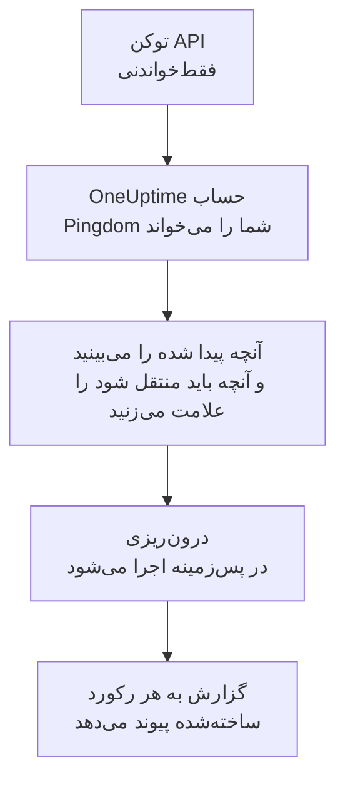

# انتقال از Pingdom

**درون‌ریزی از ابزاری دیگر** بررسی‌های دسترس‌پذیری Pingdom شما را در چند دقیقه به OneUptime می‌آورد. با یک توکن API فقط‌خواندنی Pingdom، ‏OneUptime بررسی‌های شما را می‌خواند، آنچه پیدا کرده را نشان می‌دهد و آنچه را علامت بزنید می‌سازد. در Pingdom هیچ چیزی تغییر نمی‌کند.

:::cards
- [درون‌ریزی حساب شما](#درونریزی-حساب-pingdom): یک توکن بسازید، حسابتان را بخوانید و آنچه باید منتقل شود را علامت بزنید.
- [چه چیزی منتقل می‌شود](#چه-چیزی-منتقل-میشود): هر بررسی Pingdom به کدام مانیتور OneUptime تبدیل می‌شود.
- [جابه‌جایی را کامل کنید](#جابهجایی-را-کامل-کنید): کارهایی که پس از درون‌ریزی باید انجام دهید.
:::

## چگونه کار می‌کند

- **کلید فقط یک بار استفاده می‌شود.** تا وقتی OneUptime حساب شما را می‌خواند، کلید رمزنگاری‌شده نگه داشته می‌شود و به محض پایان خواندن، چه موفق بوده باشد چه نه، حذف می‌شود. دیگر هرگز نمایش داده نمی‌شود و در هیچ لاگی نوشته نمی‌شود.
- **OneUptime فقط می‌خواند.** فقط API خود Pingdom را فراخوانی می‌کند: `api.pingdom.com`. ‏Pingdom هر درخواست را از سهمیه توکن کم می‌کند، پس OneUptime تنظیمات یک بررسی را فقط وقتی تنظیماتی داشته باشد می‌خواند، هر بار یک درخواست. وقتی Pingdom بخواهد آهسته‌تر پیش برود، صبر می‌کند و دوباره تلاش می‌کند.
- **تا درون‌ریزی را شروع نکنید چیزی ساخته نمی‌شود.** پیش‌نمایش برای هر مورد نشان می‌دهد که جدید است، از قبل در OneUptime هست (و همان‌طور که هست استفاده می‌شود)، یک درون‌ریزی قبلی آن را آورده است، یا چرا نمی‌تواند منتقل شود.
- **اجرای دوباره هرگز چیزی را دو بار نمی‌سازد.** OneUptime به یاد می‌سپارد هر درون‌ریزی بر اساس شناسه Pingdom چه چیزی آورده است. پس از افزودن بررسی در Pingdom آن را دوباره اجرا کنید تا فقط موارد جدید ساخته شوند.

## پیش از شروع

- **یک پروژه OneUptime و اجازه ساختن آنچه منتقل می‌کنید.** مالکان و مدیران پروژه می‌توانند همه چیز را منتقل کنند. نقش‌های دیگر هم می‌توانند درون‌ریزی را اجرا کنند و انواع رکوردهایی را که اجازه ساختنشان را دارند منتقل کنند. بقیه همراه با دلیل، منتقل‌نشده نمایش داده می‌شود.
- **یک توکن API ‏Pingdom با Read access.** درون‌ریزی هرگز در Pingdom چیزی نمی‌نویسد.
- **یک روش پرداخت، در OneUptime Cloud.** مانیتورهایی که بررسی انجام می‌دهند، حتی در طرح Free بر اساس مصرف صورت‌حساب می‌شوند، پس پیش از درون‌ریزی در **تنظیمات پروژه** > **صورت‌حساب** یک روش پرداخت اضافه کنید. بدون آن، این مانیتورها منتقل‌نشده نمایش داده می‌شوند.

## درون‌ریزی حساب Pingdom

:::steps
### ساختن توکن API در Pingdom
در My Pingdom، **Settings** > **Pingdom API** را باز کنید و **Add API token** را انتخاب کنید. نام آن را `OneUptime import` بگذارید، **Read access** را انتخاب کنید و توکن را کپی کنید.

### باز کردن صفحه درون‌ریزی
در OneUptime به **تنظیمات پروژه** > **درون‌ریزی از ابزاری دیگر** بروید و **Pingdom** را انتخاب کنید.

### اتصال Pingdom
توکن را در **کلید API ‏Pingdom** جای‌گذاری کنید و **خواندن حساب Pingdom من** را انتخاب کنید. خواندن یک حساب بزرگ چند دقیقه طول می‌کشد و در این مدت می‌توانید صفحه را ترک کنید.

### علامت زدن آنچه باید منتقل شود
پیش‌نمایش آنچه پیدا شده را، برای هر نوع در یک بخش، فهرست می‌کند. هر چیزی که ساخته می‌شود از ابتدا علامت خورده است، به جز بررسی‌هایی که در Pingdom متوقف شده‌اند؛ اگر آن‌ها را علامت بزنید، به‌صورت متوقف منتقل می‌شوند. زیر هر مورد، OneUptime می‌گوید چه چیزی دقیقاً همان‌طور که بود منتقل نمی‌شود.

### شروع درون‌ریزی
**شروع درون‌ریزی** را انتخاب کنید. درون‌ریزی در پس‌زمینه اجرا می‌شود: می‌توانید صفحه را ترک کنید و گزارش همان‌جا منتظر شماست.
:::

گزارش تعداد موارد ساخته‌شده و منتقل‌نشده را می‌شمارد و هر مورد را با پیوندی به رکوردی که به آن تبدیل شده فهرست می‌کند، و خطاها را اول می‌آورد. درون‌ریزی‌های قبلی در همان صفحه زیر **درون‌ریزی‌های قبلی** فهرست شده‌اند.

## چه چیزی منتقل می‌شود

| در Pingdom | در OneUptime | چگونه |
| --- | --- | --- |
| Uptime checks | مانیتورها | هر بررسی به مانیتوری از همان نوع تبدیل می‌شود، با همان نشانی، بازه و متنی که صفحه باید داشته باشد یا نباید داشته باشد. |

- **بررسی‌های HTTP** به مانیتور وب‌سایت تبدیل می‌شوند، یا اگر داده یا سرآیند بفرستند به مانیتور API.
- **بررسی‌های Ping و TCP** به مانیتورهای Ping و درگاه تبدیل می‌شوند. **بررسی‌های SMTP، POP3 و IMAP** به مانیتور درگاه روی درگاه خودشان تبدیل می‌شوند: OneUptime بررسی می‌کند که درگاه پاسخ دهد، نه گفت‌وگوی ایمیل را.
- **بررسی‌های DNS** به مانیتورهای DNS تبدیل می‌شوند که از همان سرور نام می‌پرسند.
- **بررسی‌های گواهی.** بررسی HTTP که گواهی رو به انقضا را از کار افتاده به حساب می‌آورد، یک مانیتور گواهی SSL هم به نام خودش می‌گیرد که به همان تعداد روز زودتر هشدار می‌دهد.

هر مانیتور، مثل مانیتوری که خودتان می‌سازید، از پراب‌های پروژه شما بررسی می‌شود. بازه‌ای که OneUptime ندارد به نزدیک‌ترین بازه موجود تبدیل می‌شود و مهلت پاسخ بیش از یک دقیقه به یک دقیقه. پیش‌نمایش می‌گوید کدام‌یک تغییر کرده است.

## چه چیزی منتقل نمی‌شود

- **تاریخچه دسترس‌پذیری، زمان‌های پاسخ و حادثه‌ها.** OneUptime از پایان درون‌ریزی بررسی را شروع می‌کند.
- **مخاطبان هشدار و یکپارچه‌سازی‌ها.** همان‌طور که در [جابه‌جایی را کامل کنید](#جابهجایی-را-کامل-کنید) آمده، در OneUptime انتخاب کنید به چه کسی اطلاع داده شود.
- **گذرواژه‌ها و سرآیندهایی که ممکن است رازی داشته باشند.** مانیتوری که وارد حساب می‌شود، یا سرآیند `Authorization`، کوکی یا توکن می‌فرستد، بدون آن منتقل می‌شود: آن را با یک [راز مانیتور](/docs/monitor/monitor-secrets) اضافه کنید.
- **بررسی‌های UDP، HTTP سفارشی و تراکنش.** OneUptime مانیتوری ندارد که همین کار را بکند و پیش‌نمایش هر کدام را نام می‌برد. یک [مانیتور مصنوعی](/docs/monitor/synthetic-monitor) می‌تواند صفحه‌ای را همان‌طور که بررسی تراکنش طی می‌کند طی کند.
- **نشانی‌ای که بررسی DNS انتظار دارد.** آن را در OneUptime به‌عنوان معیار اضافه کنید.
- **بازه‌های نگهداری.** پیش‌نمایش آن‌ها را می‌شمارد: آن‌ها را در OneUptime به‌عنوان تعمیر و نگهداری زمان‌بندی‌شده برنامه‌ریزی کنید.

## محدودیت‌ها

هر درون‌ریزی حداکثر ۲٬۰۰۰ رکورد می‌سازد و حداکثر ۱٬۰۰۰ مانیتور. هر چیزی فراتر از یک محدودیت، منتقل‌نشده نمایش داده می‌شود. برای آوردن بقیه، درون‌ریزی را دوباره اجرا کنید.

در OneUptime Cloud، مانیتورهایی که بررسی انجام می‌دهند به روش پرداخت نیاز دارند و هر چیزی که طرح شما جایی برایش ندارد، همراه با آنچه لازم دارد، منتقل‌نشده نمایش داده می‌شود.

پیش‌نمایش یک روز نگه داشته می‌شود. فقط کسی که حساب را خوانده می‌تواند موارد را علامت بزند و درون‌ریزی را شروع کند. مالکان و مدیران پروژه پیشرفت و گزارش هر درون‌ریزی را می‌بینند.

## جابه‌جایی را کامل کنید

:::steps
### مانیتورهای خود را بررسی کنید
هر کدام را در **مانیتورها** باز کنید و نخستین نتایجش را بررسی کنید. مانیتور heartbeat نشانی جدیدی دارد: کاری را که آن را فرا می‌خواند به آن نشانی هدایت کنید.

### انتخاب کنید به چه کسی اطلاع داده شود
برای مانیتورهای خود مالک اضافه کنید یا برای حادثه‌هایی که باز می‌کنند یک سیاست آنکال از **کشیک آنکال** > **سیاست‌های آنکال** تعیین کنید تا وقتی چیزی از کار افتاد افراد درست باخبر شوند.

### خاموش کردن بررسی‌ها در Pingdom
وقتی OneUptime همان موارد را بررسی می‌کند، بررسی‌ها را در Pingdom متوقف کنید تا به کسی دو بار اطلاع داده نشود.
:::

## رفع اشکال

:::details Pingdom کلید API را نپذیرفت
بررسی کنید که کل توکن را کپی کرده‌اید و این یک توکن API 3.1 از **Pingdom API** با **Read access** است. سپس **تلاش دوباره** را انتخاب کنید.
:::

:::details یک مانیتور منتقل‌نشده نمایش داده می‌شود
دلیلش کنار آن آمده است: نوعی مانیتور که OneUptime ندارد، نشانی‌ای که OneUptime نمی‌تواند بخواند، یا پروژه‌ای که برای آن جا یا روش پرداخت ندارد. اگر OneUptime از قبل مانیتوری با همان نام، نوع و نشانی اجرا کند، همان مانیتور بدون تغییر استفاده می‌شود.
:::

:::details برخی موارد را نمی‌توان علامت زد
کنار هر کدام دلیلش آمده است: نامی که پروژه از قبل دارد، چیزی که یک درون‌ریزی قبلی آورده، یا رکوردی که اجازه ساختنش را ندارید یا طرح شما شامل آن نیست.
:::

## گام‌های بعدی

:::cards
- [مانیتور وب‌سایت](/docs/monitor/website-monitor): مانیتور وب‌سایت چه چیزی را و چگونه بررسی می‌کند.
- [مانیتور پورت](/docs/monitor/port-monitor): مانیتور درگاه چه چیزی را و چگونه بررسی می‌کند.
- [انتقال از StatusCake](/docs/moving-to-oneuptime/statuscake): بررسی‌های خود را از StatusCake بیاورید.
:::
