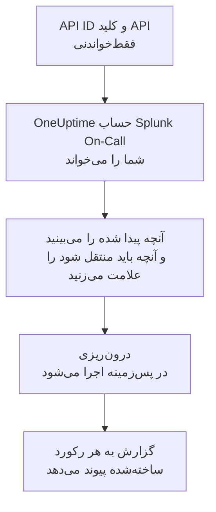

# انتقال از Splunk On-Call

**درون‌ریزی از ابزاری دیگر** پیکربندی Splunk On-Call (نام قبلی VictorOps) شما را در چند دقیقه به OneUptime می‌آورد. با API ID شما و یک کلید API فقط‌خواندنی، OneUptime کاربران، تیم‌ها، چرخش‌ها و سیاست‌های تشدید شما را می‌خواند، آنچه پیدا کرده را نشان می‌دهد و آنچه را علامت بزنید می‌سازد. در Splunk On-Call هیچ چیزی تغییر نمی‌کند.

:::cards
- [درون‌ریزی حساب شما](#درونریزی-حساب-splunk-on-call): یک کلید بسازید، حسابتان را بخوانید و آنچه باید منتقل شود را علامت بزنید.
- [چه چیزی منتقل می‌شود](#چه-چیزی-منتقل-میشود): هر رکورد Splunk On-Call در OneUptime به چه تبدیل می‌شود.
- [جابه‌جایی را کامل کنید](#جابهجایی-را-کامل-کنید): کارهایی که پس از درون‌ریزی باید انجام دهید.
:::

## چگونه کار می‌کند

- **کلید فقط یک بار استفاده می‌شود.** تا وقتی OneUptime حساب شما را می‌خواند، کلید همراه با API ID رمزنگاری‌شده نگه داشته می‌شود و به محض پایان خواندن، چه موفق بوده باشد چه نه، حذف می‌شود. دیگر هرگز نمایش داده نمی‌شود و در هیچ لاگی نوشته نمی‌شود.
- **OneUptime فقط می‌خواند.** فقط API خود Splunk On-Call یعنی `api.victorops.com` را فراخوانی می‌کند. Splunk On-Call به هر نوع درخواست حداکثر دو بار در ثانیه پاسخ می‌دهد، پس OneUptime همین سرعت را نگه می‌دارد، و وقتی Splunk On-Call بخواهد آهسته‌تر پیش برود، صبر می‌کند و دوباره تلاش می‌کند.
- **تا درون‌ریزی را شروع نکنید چیزی ساخته نمی‌شود.** پیش‌نمایش برای هر مورد نشان می‌دهد که جدید است، از قبل در OneUptime هست (و همان‌طور که هست استفاده می‌شود)، یک درون‌ریزی قبلی آن را آورده است، یا چرا نمی‌تواند منتقل شود.
- **اجرای دوباره هرگز چیزی را دو بار نمی‌سازد.** OneUptime به یاد می‌سپارد هر درون‌ریزی بر اساس شناسه Splunk On-Call چه چیزی آورده است. پس از افزودن افراد یا چرخش‌ها در Splunk On-Call آن را دوباره اجرا کنید تا فقط موارد جدید ساخته شوند.

## پیش از شروع

- **یک پروژه OneUptime و اجازه ساختن آنچه منتقل می‌کنید.** مالکان و مدیران پروژه می‌توانند همه چیز را منتقل کنند. نقش‌های دیگر هم می‌توانند درون‌ریزی را اجرا کنند و انواع رکوردهایی را که اجازه ساختنشان را دارند منتقل کنند. بقیه همراه با دلیل، منتقل‌نشده نمایش داده می‌شود.
- **API ID ‏Splunk On-Call شما و یک کلید API فقط‌خواندنی.** هر دو در Splunk On-Call در **Integrations** > **API** هستند. درون‌ریزی هرگز در Splunk On-Call چیزی نمی‌نویسد، پس یک کلید فقط‌خواندنی کافی است.

## درون‌ریزی حساب Splunk On-Call

:::steps
### ساختن کلید API در Splunk On-Call
در Splunk On-Call به **Integrations** > **API** بروید. API ID شما بالای کلیدهای API نمایش داده می‌شود. یک کلید API جدید با نام `OneUptime import` بسازید، **Read-only** را علامت بزنید و API ID و کلید را کپی کنید.

### باز کردن صفحه درون‌ریزی
در OneUptime به **تنظیمات پروژه** > **درون‌ریزی از ابزاری دیگر** بروید و **Splunk On-Call** را انتخاب کنید.

### اتصال Splunk On-Call
API ID را در **API ID ‏Splunk On-Call** و کلید را در **کلید API ‏Splunk On-Call** جای‌گذاری کنید و **خواندن حساب Splunk On-Call من** را انتخاب کنید. حساب بزرگ چند دقیقه طول می‌کشد و در طول خواندن می‌توانید صفحه را ترک کنید.

### علامت زدن آنچه باید منتقل شود
پیش‌نمایش آنچه پیدا شده را، برای هر نوع در یک بخش، فهرست می‌کند. هر چیزی که ساخته می‌شود از ابتدا علامت خورده است، به جز افرادی که در هیچ تیم، چرخش یا سیاست تشدیدی نیستند. زیر هر مورد، OneUptime می‌گوید چه چیزی دقیقاً همان‌طور که بود منتقل نمی‌شود. وقتی موردی که علامت خورده از چیزی استفاده کند که علامت نزده‌اید، این را می‌گوید و **این‌ها را هم علامت بزنید** آن را علامت می‌زند.

### شروع درون‌ریزی
اگر قرار است افرادی دعوت شوند، در **دعوت افراد جدید به** تیمی را که به آن می‌پیوندند انتخاب کنید. سپس **شروع درون‌ریزی** را انتخاب کنید. درون‌ریزی در پس‌زمینه اجرا می‌شود: می‌توانید صفحه را ترک کنید و گزارش همان‌جا منتظر شماست.
:::

گزارش تعداد موارد ساخته‌شده، دعوت‌شده و منتقل‌نشده را می‌شمارد و هر مورد را با پیوندی به رکوردی که به آن تبدیل شده فهرست می‌کند، و خطاها را اول می‌آورد. درون‌ریزی‌های قبلی در همان صفحه زیر **درون‌ریزی‌های قبلی** فهرست شده‌اند.

## چه چیزی منتقل می‌شود

| در Splunk On-Call | در OneUptime | چگونه |
| --- | --- | --- |
| کاربران | اعضای پروژه | بر اساس نشانی ایمیل تطبیق داده می‌شوند. هر کسی که هنوز در پروژه نیست به تیمی که انتخاب می‌کنید دعوت می‌شود. |
| تیم‌ها | تیم‌ها | همراه با اعضایشان ساخته می‌شوند. تیمی که نامش از قبل در پروژه هست همان‌طور که هست استفاده می‌شود و اعضایش دست نمی‌خورند. |
| چرخش‌ها | زمان‌بندی‌های آنکال | هر چرخش به زمان‌بندی‌ای متعلق به تیم خودش تبدیل می‌شود، و هر شیفت آن به لایه‌ای با همان افراد، همان شروع، همان تحویل نوبت و همان روزها و ساعت‌های آنکال. کسی که اکنون در Splunk On-Call آنکال است، در OneUptime هم آنکال است. |
| سیاست‌های تشدید | سیاست‌های آنکال | متعلق به تیم سیاست. هر گام به یک قاعده تشدید تبدیل می‌شود که همان چرخش‌ها و کاربران را فرا می‌خواند. مهلت یک گام به انتظار پیش از آن تبدیل می‌شود، و گام‌هایی که میانشان مهلتی نیست با هم فرا می‌خوانند. |

شیفت‌های یک چرخش که هم‌زمان آنکال‌اند، هر کدام به یک زمان‌بندی جداگانه OneUptime تبدیل می‌شوند، چون در زمان‌بندی OneUptime هر بار یک نفر آنکال است. هر سیاست آنکالی که آن چرخش را فرا می‌خواند، همه آن‌ها را فرا می‌خواند. زمان‌بندی منطقه زمانی نخستین شیفت چرخش را نگه می‌دارد و ساعت‌های شیفتی که در منطقه زمانی دیگری است به آن تبدیل می‌شوند.

## چه چیزی منتقل نمی‌شود

- **حادثه‌ها، هشدارها و تاریخچه آن‌ها.** OneUptime با پیکربندی شما شروع می‌کند، نه با حادثه‌های گذشته.
- **یکپارچه‌سازی‌ها، routing keys و alert rules.** به جای آن، مانیتورها و منابع هشدار خود را به سمت OneUptime بفرستید، همان‌طور که در [جابه‌جایی را کامل کنید](#جابهجایی-را-کامل-کنید) آمده است.
- **جایگزینی‌های برنامه‌ریزی‌شده.** جایگزینی‌هایی را که هنوز لازم دارید پس از درون‌ریزی در OneUptime اضافه کنید.
- **سیاست فراخوانی هر فرد.** هر کس پس از پذیرفتن دعوت، در **تنظیمات کاربر** خود انتخاب می‌کند چگونه فراخوانده شود.
- **گام‌هایی که در OneUptime معادل دقیقی ندارند.** گامی که یک webhook را فرا می‌خواند یا به سیاست تشدید دیگری می‌فرستد کنار گذاشته می‌شود، و همین‌طور گامی که به نشانی‌ای ایمیل می‌فرستد که متعلق به هیچ‌یک از افراد منتقل‌شده نیست. گامی که نفر بعدی یا قبلی آنکال را فرا می‌خواند، کسی را که اکنون آنکال است فرا می‌خواند و پیش‌نمایش می‌گوید چه چیزی تغییر می‌کند.

## محدودیت‌ها

هر درون‌ریزی حداکثر ۲٬۰۰۰ رکورد می‌سازد: حداکثر ۵۰۰ نفر، ۲۰۰ تیم، ۲۰۰ زمان‌بندی آنکال و ۲۰۰ سیاست آنکال. هر چیزی فراتر از یک محدودیت، منتقل‌نشده نمایش داده می‌شود. برای آوردن بقیه، درون‌ریزی را دوباره اجرا کنید.

در OneUptime Cloud، رکوردهایی که طرح شما شامل آن‌ها نیست، همراه با طرحی که نیاز دارند منتقل‌نشده نمایش داده می‌شوند.

پیش‌نمایش یک روز نگه داشته می‌شود. فقط کسی که حساب را خوانده می‌تواند موارد را علامت بزند و درون‌ریزی را شروع کند. مالکان و مدیران پروژه پیشرفت و گزارش هر درون‌ریزی را می‌بینند.

## جابه‌جایی را کامل کنید

:::steps
### بررسی زمان‌بندی‌های آنکال
هر زمان‌بندی را در **کشیک آنکال** > **زمان‌بندی‌های آنکال** باز کنید و بررسی کنید چه کسی اکنون آنکال است و نفر بعدی کیست.

### مطمئن شوید همه را می‌توان فرا خواند
افراد دعوت‌شده دعوت را می‌پذیرند و سپس شماره تلفن، نشانی ایمیل یا اپ موبایل را برای فراخوانده شدن اضافه می‌کنند. **کشیک آنکال** > **آمادگی** نشان می‌دهد هنوز با چه کسی نمی‌توان تماس گرفت.

### هشدارهای خود را به OneUptime بفرستید
مانیتورها و ابزارهایی را که هشدار می‌دهند به سمت OneUptime بفرستید و برای آزمایش یک بار خودتان را فرا بخوانید.

### خاموش کردن فراخوانی در Splunk On-Call
وقتی OneUptime افراد درست را فرا می‌خواند، اعلان‌ها را در Splunk On-Call خاموش کنید تا کسی دو بار فراخوانده نشود.
:::

## رفع اشکال

:::details Splunk On-Call، API ID و کلید API را نپذیرفت
بررسی کنید که API ID و کل کلید را از **Integrations** > **API** کپی کرده باشید و کلید در آنجا حذف نشده باشد. سپس **تلاش دوباره** را انتخاب کنید.
:::

:::details نوعی از رکوردها در پیش‌نمایش نیست
کلید نتوانست آن را بخواند و پیش‌نمایش این را در بالا می‌گوید. کلید را در **Integrations** > **API** بررسی کنید و حساب را دوباره بخوانید.
:::

:::details برخی موارد را نمی‌توان علامت زد
کنار هر کدام دلیلش آمده است: نامی که پروژه از قبل دارد، چیزی که یک درون‌ریزی قبلی آورده، یا رکوردی که اجازه ساختنش را ندارید یا طرح شما شامل آن نیست.
:::

## گام‌های بعدی

:::cards
- [زمان‌بندی‌های آنکال](/docs/on-call/schedules): لایه‌ها، محدودیت‌ها و تحویل نوبت.
- [قواعد تشدید](/docs/on-call/escalation-rules): سیاست‌های آنکال چگونه افراد را فرا می‌خوانند.
- [انتقال از PagerDuty](/docs/moving-to-oneuptime/pagerduty): تیمی را از PagerDuty بیاورید.
:::
