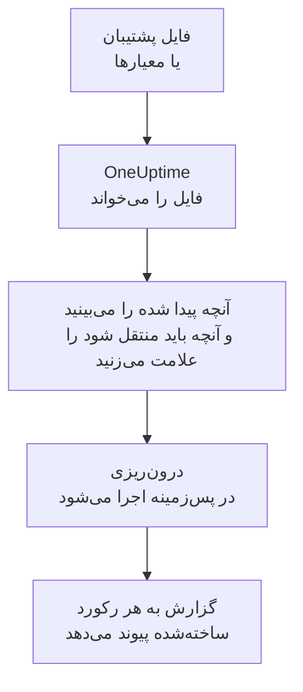

# انتقال از Uptime Kuma

‏Uptime Kuma روی ماشین‌های خودتان اجرا می‌شود، پس **درون‌ریزی از ابزاری دیگر** آن را به جای کلید از یک فایل می‌خواند: پشتیبانی که Uptime Kuma 1 خروجی می‌گیرد، یا صفحه معیارهایی که هر نسخه ارائه می‌دهد. ‏OneUptime مانیتورهای شما را از آن می‌خواند، آنچه پیدا کرده را نشان می‌دهد و آنچه را علامت بزنید می‌سازد. در Uptime Kuma هیچ چیزی تغییر نمی‌کند.

:::cards
- [درون‌ریزی مانیتورهای شما](#درونریزی-مانیتورهای-uptime-kuma): فایل را ذخیره کنید، آن را بخوانید و آنچه باید منتقل شود را علامت بزنید.
- [چه چیزی منتقل می‌شود](#چه-چیزی-منتقل-میشود): هر مانیتور Uptime Kuma در OneUptime به چه تبدیل می‌شود.
- [جابه‌جایی را کامل کنید](#جابهجایی-را-کامل-کنید): کارهایی که پس از درون‌ریزی باید انجام دهید.
:::

## چگونه کار می‌کند

- **فایل یک بار خوانده می‌شود.** OneUptime هنگام بارگذاری آن را می‌خواند تا مانیتورهای شما را پیدا کند و هرگز آن را ذخیره نمی‌کند. گذرواژه‌ها، توکن‌ها و کلیدهای push درون آن هرگز کپی نمی‌شوند.
- **OneUptime هرگز به Uptime Kuma وصل نمی‌شود.** همه چیز از فایل می‌آید. فایلی که نه پشتیبان Uptime Kuma است و نه صفحه معیارهای آن، همراه با دلیل رد می‌شود.
- **تا درون‌ریزی را شروع نکنید چیزی ساخته نمی‌شود.** پیش‌نمایش برای هر مورد نشان می‌دهد که جدید است، از قبل در OneUptime هست (و همان‌طور که هست استفاده می‌شود)، یک درون‌ریزی قبلی آن را آورده است، یا چرا نمی‌تواند منتقل شود.
- **اجرای دوباره هرگز چیزی را دو بار نمی‌سازد.** OneUptime به یاد می‌سپارد هر درون‌ریزی بر اساس شناسه Uptime Kuma چه چیزی آورده است. پس از افزودن مانیتور، فایل تازه‌تری بخوانید تا فقط موارد جدید ساخته شوند.

## پیش از شروع

- **یک پروژه OneUptime و اجازه ساختن آنچه منتقل می‌کنید.** مالکان و مدیران پروژه می‌توانند همه چیز را منتقل کنند. نقش‌های دیگر هم می‌توانند درون‌ریزی را اجرا کنند و انواع رکوردهایی را که اجازه ساختنشان را دارند منتقل کنند. بقیه همراه با دلیل، منتقل‌نشده نمایش داده می‌شود.
- **یک فایل از Uptime Kuma.** در Uptime Kuma 1، پشتیبان JSON هر مانیتور را با تنظیماتش دارد. ‏Uptime Kuma 2 پشتیبان ندارد، پس به جای آن صفحه معیارهایش را ذخیره کنید: این صفحه نام، نوع و نشانی هر مانیتور را دارد، اما نه این‌که هر چند وقت یک بار بررسی می‌شود یا دنبال چه می‌گردد.
- **یک روش پرداخت، در OneUptime Cloud.** مانیتورهایی که بررسی انجام می‌دهند، حتی در طرح Free بر اساس مصرف صورت‌حساب می‌شوند، پس پیش از درون‌ریزی در **تنظیمات پروژه** > **صورت‌حساب** یک روش پرداخت اضافه کنید. بدون آن، این مانیتورها منتقل‌نشده نمایش داده می‌شوند.

## درون‌ریزی مانیتورهای Uptime Kuma

:::steps
### ذخیره فایل در Uptime Kuma
در Uptime Kuma 1 به **Settings** > **Backup** بروید و **Export** را انتخاب کنید. در Uptime Kuma 2 در **Settings** > **API Keys** یک کلید اضافه کنید، صفحه `/metrics` را در Uptime Kuma خود باز کنید، بدون نام کاربری و با کلید به‌عنوان گذرواژه وارد شوید و صفحه را به‌صورت فایل متنی ذخیره کنید.

### باز کردن صفحه درون‌ریزی
در OneUptime به **تنظیمات پروژه** > **درون‌ریزی از ابزاری دیگر** بروید و **Uptime Kuma** را انتخاب کنید.

### خواندن فایل
زیر **فایل پشتیبان یا معیارهای Uptime Kuma**، **انتخاب فایل** را انتخاب کنید، فایل ذخیره‌شده را برگزینید و **خواندن فایل** را انتخاب کنید. ‏OneUptime بی‌درنگ آن را می‌خواند و آنچه پیدا کرده را نشان می‌دهد.

### علامت زدن آنچه باید منتقل شود
پیش‌نمایش آنچه پیدا شده را، برای هر نوع در یک بخش، فهرست می‌کند. هر چیزی که ساخته می‌شود از ابتدا علامت خورده است، به جز مانیتورهایی که در Uptime Kuma متوقف شده‌اند؛ اگر آن‌ها را علامت بزنید، به‌صورت متوقف منتقل می‌شوند. زیر هر مورد، OneUptime می‌گوید چه چیزی دقیقاً همان‌طور که بود منتقل نمی‌شود.

### شروع درون‌ریزی
**شروع درون‌ریزی** را انتخاب کنید. درون‌ریزی در پس‌زمینه اجرا می‌شود: می‌توانید صفحه را ترک کنید و گزارش همان‌جا منتظر شماست.
:::

گزارش تعداد موارد ساخته‌شده و منتقل‌نشده را می‌شمارد و هر مورد را با پیوندی به رکوردی که به آن تبدیل شده فهرست می‌کند، و خطاها را اول می‌آورد. درون‌ریزی‌های قبلی در همان صفحه زیر **درون‌ریزی‌های قبلی** فهرست شده‌اند.

## چه چیزی منتقل می‌شود

| در Uptime Kuma | در OneUptime | چگونه |
| --- | --- | --- |
| Monitors | مانیتورها | از پشتیبان، هر مانیتور به مانیتوری از همان نوع تبدیل می‌شود، با همان نشانی، بازه، مهلت پاسخ و کدهای وضعیتی که فعال به حساب می‌آیند. از صفحه معیارها، هر کدام با بررسی هر پنج دقیقه منتقل می‌شود: پس از درون‌ریزی هر کدام را بررسی کنید. |

- **مانیتورهای HTTP(S) و کلیدواژه** به مانیتور وب‌سایت تبدیل می‌شوند، یا اگر متد دیگری، سرآیند یا بدنه JSON بفرستند به مانیتور API، و کلیدواژه همان‌جا که باید باشد قرار می‌گیرد.
- **مانیتورهای پرس‌وجوی JSON** بدون پرس‌وجو به مانیتور API تبدیل می‌شوند: پرس‌وجو را در OneUptime به‌عنوان معیار اضافه کنید.
- **مانیتورهای Ping، درگاه و DNS** به مانیتورهای Ping، درگاه و DNS تبدیل می‌شوند.
- **مانیتورهای push** به مانیتور درخواست ورودی تبدیل می‌شوند که اگر در طول بازه و تلاش‌های دوباره‌اش هیچ درخواستی نرسد از کار افتاده به حساب می‌آیند. هر کدام در OneUptime نشانی جدیدی دارد.
- **مانیتورهای دستی** مانیتور دستی می‌مانند. **گروه‌ها** پوشه‌اند، پس مانیتورهایشان جداگانه منتقل می‌شوند.
- **انقضای گواهی.** مانیتوری که پیش از انقضای گواهی‌اش هشدار می‌دهد، یک مانیتور گواهی SSL هم به نام خودش می‌گیرد.

هر مانیتور، مثل مانیتوری که خودتان می‌سازید، از پراب‌های پروژه شما بررسی می‌شود. بازه‌ای که OneUptime ندارد به نزدیک‌ترین بازه موجود تبدیل می‌شود و مهلت پاسخ بیش از یک دقیقه به یک دقیقه. پیش‌نمایش می‌گوید کدام‌یک تغییر کرده است.

## چه چیزی منتقل نمی‌شود

- **تاریخچه دسترس‌پذیری، زمان‌های پاسخ و حادثه‌ها.** OneUptime از پایان درون‌ریزی بررسی را شروع می‌کند.
- **اعلان‌ها.** همان‌طور که در [جابه‌جایی را کامل کنید](#جابهجایی-را-کامل-کنید) آمده، در OneUptime انتخاب کنید به چه کسی اطلاع داده شود.
- **گذرواژه‌ها و سرآیندهایی که ممکن است رازی داشته باشند.** مانیتوری که وارد حساب می‌شود، یا سرآیند `Authorization`، کوکی یا توکن می‌فرستد، بدون آن منتقل می‌شود: آن را با یک [راز مانیتور](/docs/monitor/monitor-secrets) اضافه کنید.
- **مانیتورهای وارونه (upside down)** که وقتی بررسی‌شان شکست بخورد فعال به حساب می‌آیند. OneUptime مانیتوری ندارد که چنین کند.
- **مانیتورهای Docker، پایگاه داده، سرور بازی، MQTT و دیگر مانیتورهایی که OneUptime معادلی برایشان ندارد.** پیش‌نمایش هر کدام را نام می‌برد.
- **صفحه‌های وضعیت و نگهداری.** صفحه‌های وضعیتی را که لازم دارید در OneUptime بسازید و مانیتورهای منتقل‌شده را روی آن‌ها نشان دهید.

## محدودیت‌ها

هر درون‌ریزی حداکثر ۲٬۰۰۰ رکورد می‌سازد و حداکثر ۱٬۰۰۰ مانیتور. هر فایل حداکثر ۱۰ مگابایت می‌تواند باشد. هر چیزی فراتر از یک محدودیت، منتقل‌نشده نمایش داده می‌شود. برای آوردن بقیه، درون‌ریزی را دوباره اجرا کنید.

در OneUptime Cloud، مانیتورهایی که بررسی انجام می‌دهند به روش پرداخت نیاز دارند و هر چیزی که طرح شما جایی برایش ندارد، همراه با آنچه لازم دارد، منتقل‌نشده نمایش داده می‌شود.

پیش‌نمایش یک روز نگه داشته می‌شود. فقط کسی که فایل را خوانده می‌تواند موارد را علامت بزند و درون‌ریزی را شروع کند. مالکان و مدیران پروژه پیشرفت و گزارش هر درون‌ریزی را می‌بینند.

## جابه‌جایی را کامل کنید

:::steps
### مانیتورهای خود را بررسی کنید
هر کدام را در **مانیتورها** باز کنید و نخستین نتایجش را بررسی کنید. مانیتور heartbeat نشانی جدیدی دارد: کاری را که آن را فرا می‌خواند به آن نشانی هدایت کنید.

### انتخاب کنید به چه کسی اطلاع داده شود
برای مانیتورهای خود مالک اضافه کنید یا برای حادثه‌هایی که باز می‌کنند یک سیاست آنکال از **کشیک آنکال** > **سیاست‌های آنکال** تعیین کنید تا وقتی چیزی از کار افتاد افراد درست باخبر شوند.

### خاموش کردن بررسی‌ها در Uptime Kuma
وقتی OneUptime همان موارد را بررسی می‌کند، بررسی‌ها را در Uptime Kuma متوقف کنید تا به کسی دو بار اطلاع داده نشود.
:::

## رفع اشکال

:::details فایل رد شد
OneUptime دلیل را می‌گوید: فایلی بزرگ‌تر از ۱۰ مگابایت، فایلی که JSON معتبر نیست، یا فایلی که نه پشتیبان است و نه صفحه معیارهای Uptime Kuma. دوباره از پشتیبان خروجی بگیرید، یا `/metrics` را دوباره به‌صورت متن ساده ذخیره کنید، و آن را دوباره انتخاب کنید.
:::

:::details یک مانیتور منتقل‌نشده نمایش داده می‌شود
دلیلش کنار آن آمده است: نوعی مانیتور که OneUptime ندارد، نشانی‌ای که OneUptime نمی‌تواند بخواند، یا پروژه‌ای که برای آن جا یا روش پرداخت ندارد. اگر OneUptime از قبل مانیتوری با همان نام، نوع و نشانی اجرا کند، همان مانیتور بدون تغییر استفاده می‌شود.
:::

:::details برخی موارد را نمی‌توان علامت زد
کنار هر کدام دلیلش آمده است: نامی که پروژه از قبل دارد، چیزی که یک درون‌ریزی قبلی آورده، یا رکوردی که اجازه ساختنش را ندارید یا طرح شما شامل آن نیست.
:::

## گام‌های بعدی

:::cards
- [مانیتور وب‌سایت](/docs/monitor/website-monitor): مانیتور وب‌سایت چه چیزی را و چگونه بررسی می‌کند.
- [مانیتور درخواست ورودی](/docs/monitor/incoming-request-monitor): heartbeat در OneUptime چگونه کار می‌کند.
- [انتقال از UptimeRobot](/docs/moving-to-oneuptime/uptimerobot): بررسی‌های خود را از UptimeRobot بیاورید.
:::
