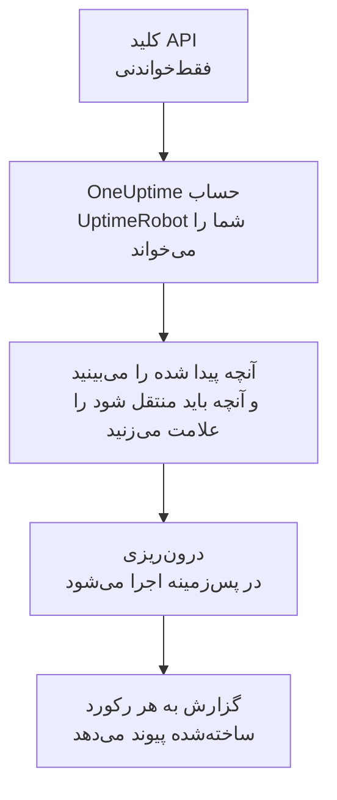

# انتقال از UptimeRobot

**درون‌ریزی از ابزاری دیگر** مانیتورها و صفحه‌های وضعیت UptimeRobot شما را در چند دقیقه به OneUptime می‌آورد. با یک کلید API فقط‌خواندنی UptimeRobot، ‏OneUptime مانیتورها و صفحه‌های وضعیت عمومی شما را می‌خواند، آنچه پیدا کرده را نشان می‌دهد و آنچه را علامت بزنید می‌سازد. در UptimeRobot هیچ چیزی تغییر نمی‌کند.

:::cards
- [درون‌ریزی حساب شما](#درونریزی-حساب-uptimerobot): یک کلید بسازید، حسابتان را بخوانید و آنچه باید منتقل شود را علامت بزنید.
- [چه چیزی منتقل می‌شود](#چه-چیزی-منتقل-میشود): هر مانیتور و صفحه وضعیت UptimeRobot در OneUptime به چه تبدیل می‌شود.
- [جابه‌جایی را کامل کنید](#جابهجایی-را-کامل-کنید): کارهایی که پس از درون‌ریزی باید انجام دهید.
:::

## چگونه کار می‌کند

- **کلید فقط یک بار استفاده می‌شود.** تا وقتی OneUptime حساب شما را می‌خواند، کلید رمزنگاری‌شده نگه داشته می‌شود و به محض پایان خواندن، چه موفق بوده باشد چه نه، حذف می‌شود. دیگر هرگز نمایش داده نمی‌شود و در هیچ لاگی نوشته نمی‌شود.
- **OneUptime فقط می‌خواند.** فقط API خود UptimeRobot را فراخوانی می‌کند: `api.uptimerobot.com`. هر شش ثانیه یک درخواست می‌فرستد، که در محدوده ده درخواست در دقیقه‌ای است که UptimeRobot به حساب Free می‌دهد، پس خواندن یک حساب بزرگ چند دقیقه طول می‌کشد. وقتی UptimeRobot بخواهد آهسته‌تر پیش برود، صبر می‌کند و دوباره تلاش می‌کند.
- **تا درون‌ریزی را شروع نکنید چیزی ساخته نمی‌شود.** پیش‌نمایش برای هر مورد نشان می‌دهد که جدید است، از قبل در OneUptime هست (و همان‌طور که هست استفاده می‌شود)، یک درون‌ریزی قبلی آن را آورده است، یا چرا نمی‌تواند منتقل شود.
- **اجرای دوباره هرگز چیزی را دو بار نمی‌سازد.** OneUptime به یاد می‌سپارد هر درون‌ریزی بر اساس شناسه UptimeRobot چه چیزی آورده است. پس از افزودن مانیتور در UptimeRobot آن را دوباره اجرا کنید تا فقط موارد جدید ساخته شوند.

## پیش از شروع

- **یک پروژه OneUptime و اجازه ساختن آنچه منتقل می‌کنید.** مالکان و مدیران پروژه می‌توانند همه چیز را منتقل کنند. نقش‌های دیگر هم می‌توانند درون‌ریزی را اجرا کنند و انواع رکوردهایی را که اجازه ساختنشان را دارند منتقل کنند. بقیه همراه با دلیل، منتقل‌نشده نمایش داده می‌شود.
- **یک کلید API ‏UptimeRobot.** ‏Read-only API key کافی است: درون‌ریزی هرگز در UptimeRobot چیزی نمی‌نویسد. ‏Main API key هم کار می‌کند، اما کلید مخصوص یک مانیتور فقط همان مانیتور را می‌خواند.
- **یک روش پرداخت، در OneUptime Cloud.** مانیتورهایی که بررسی انجام می‌دهند، حتی در طرح Free بر اساس مصرف صورت‌حساب می‌شوند، پس پیش از درون‌ریزی در **تنظیمات پروژه** > **صورت‌حساب** یک روش پرداخت اضافه کنید. بدون آن، این مانیتورها منتقل‌نشده نمایش داده می‌شوند.

## درون‌ریزی حساب UptimeRobot

:::steps
### ساختن کلید API در UptimeRobot
در UptimeRobot به **Integrations & API** > **API** بروید. یک **Read-only API key** بسازید یا کلیدی را که دارید کپی کنید.

### باز کردن صفحه درون‌ریزی
در OneUptime به **تنظیمات پروژه** > **درون‌ریزی از ابزاری دیگر** بروید و **UptimeRobot** را انتخاب کنید.

### اتصال UptimeRobot
کلید را در **کلید API ‏UptimeRobot** جای‌گذاری کنید و **خواندن حساب UptimeRobot من** را انتخاب کنید. خواندن یک حساب بزرگ چند دقیقه طول می‌کشد و در این مدت می‌توانید صفحه را ترک کنید.

### علامت زدن آنچه باید منتقل شود
پیش‌نمایش آنچه پیدا شده را، برای هر نوع در یک بخش، فهرست می‌کند. هر چیزی که ساخته می‌شود از ابتدا علامت خورده است، به جز مانیتورهایی که در UptimeRobot متوقف شده‌اند؛ اگر آن‌ها را علامت بزنید، به‌صورت متوقف منتقل می‌شوند. زیر هر مورد، OneUptime می‌گوید چه چیزی دقیقاً همان‌طور که بود منتقل نمی‌شود. وقتی صفحه وضعیتی که علامت خورده مانیتوری را نشان دهد که علامت نزده‌اید، این را می‌گوید و **این‌ها را هم علامت بزنید** آن را علامت می‌زند.

### شروع درون‌ریزی
**شروع درون‌ریزی** را انتخاب کنید. درون‌ریزی در پس‌زمینه اجرا می‌شود: می‌توانید صفحه را ترک کنید و گزارش همان‌جا منتظر شماست.
:::

گزارش تعداد موارد ساخته‌شده و منتقل‌نشده را می‌شمارد و هر مورد را با پیوندی به رکوردی که به آن تبدیل شده فهرست می‌کند، و خطاها را اول می‌آورد. درون‌ریزی‌های قبلی در همان صفحه زیر **درون‌ریزی‌های قبلی** فهرست شده‌اند.

## چه چیزی منتقل می‌شود

| در UptimeRobot | در OneUptime | چگونه |
| --- | --- | --- |
| Monitors | مانیتورها | هر مانیتور به مانیتوری از همان نوع تبدیل می‌شود، با همان نشانی، بازه و مهلت پاسخ و همان کدهای وضعیتی که فعال به حساب می‌آیند. |
| Public status pages | صفحه‌های وضعیت | هر صفحه همان مانیتورها را نشان می‌دهد: آن‌هایی که نام می‌برد، آن‌هایی که برچسب‌هایش را دارند، یا همه، با دسترس‌پذیری و نوارهای تاریخچه مثل قبل. صفحه‌ای که گذرواژه دارد به‌صورت خصوصی منتقل می‌شود. |

- **مانیتورهای HTTP(S) و کلیدواژه** به مانیتور وب‌سایت تبدیل می‌شوند، یا اگر متد دیگری، سرآیند یا بدنه JSON بفرستند به مانیتور API. مانیتور کلیدواژه مثل UptimeRobot وقتی کلیدواژه‌اش ظاهر شود یا نباشد از کار افتاده به حساب می‌آید، و آن را دقیقاً، با در نظر گرفتن حروف بزرگ، تطبیق می‌دهد.
- **مانیتورهای Ping و درگاه** به مانیتورهای Ping و درگاه تبدیل می‌شوند.
- **مانیتورهای heartbeat** به مانیتور درخواست ورودی تبدیل می‌شوند که اگر در طول بازه و مهلت اضافه هیچ درخواستی نرسد از کار افتاده به حساب می‌آیند. هر کدام در OneUptime نشانی جدیدی دارد.
- **مانیتورهای DNS و API** به مانیتورهای DNS و API تبدیل می‌شوند.
- **یادآوری انقضای SSL.** مانیتوری که پیش از انقضای گواهی‌اش هشدار می‌دهد، یک مانیتور گواهی SSL هم به نام خودش می‌گیرد که به همان تعداد روز زودتر هشدار می‌دهد.

هر مانیتور، مثل مانیتوری که خودتان می‌سازید، از پراب‌های پروژه شما بررسی می‌شود. بازه‌ای که OneUptime ندارد به نزدیک‌ترین بازه موجود تبدیل می‌شود و مهلت پاسخ بیش از یک دقیقه به یک دقیقه. پیش‌نمایش می‌گوید کدام‌یک تغییر کرده است.

## چه چیزی منتقل نمی‌شود

- **تاریخچه دسترس‌پذیری، زمان‌های پاسخ و حادثه‌ها.** OneUptime از پایان درون‌ریزی بررسی را شروع می‌کند.
- **مخاطبان هشدار و یکپارچه‌سازی‌ها.** همان‌طور که در [جابه‌جایی را کامل کنید](#جابهجایی-را-کامل-کنید) آمده، در OneUptime انتخاب کنید به چه کسی اطلاع داده شود.
- **گذرواژه‌ها و سرآیندهایی که ممکن است رازی داشته باشند.** مانیتوری که وارد حساب می‌شود، یا سرآیند `Authorization`، کوکی یا توکن می‌فرستد، بدون آن منتقل می‌شود: آن را با یک [راز مانیتور](/docs/monitor/monitor-secrets) اضافه کنید.
- **مانیتورهای UDP، مقایسه بصری و وابستگی.** OneUptime مانیتوری ندارد که همین کار را بکند و پیش‌نمایش هر کدام را نام می‌برد.
- **مانیتورهای درگاه که وقتی درگاه باز است هشدار می‌دهند.** این‌ها برعکس مانیتورهای درگاه OneUptime کار می‌کنند.
- **پاسخ‌هایی که مانیتور DNS انتظار دارد و شرط‌های مانیتور API.** آن‌ها را در OneUptime به‌عنوان معیار اضافه کنید.
- **بازه‌های نگهداری.** پیش‌نمایش آن‌ها را می‌شمارد: آن‌ها را در OneUptime به‌عنوان تعمیر و نگهداری زمان‌بندی‌شده برنامه‌ریزی کنید.
- **دامنه و برندینگ اختصاصی یک صفحه وضعیت.** در OneUptime دامنه را در **دامنه‌های سفارشی** و لوگو را در **برندینگ** اضافه کنید.

## محدودیت‌ها

هر درون‌ریزی حداکثر ۲٬۰۰۰ رکورد می‌سازد: حداکثر ۱٬۰۰۰ مانیتور و ۵۰ صفحه وضعیت. هر چیزی فراتر از یک محدودیت، منتقل‌نشده نمایش داده می‌شود. برای آوردن بقیه، درون‌ریزی را دوباره اجرا کنید.

در OneUptime Cloud، مانیتورهایی که بررسی انجام می‌دهند به روش پرداخت نیاز دارند و هر چیزی که طرح شما جایی برایش ندارد، همراه با آنچه لازم دارد، منتقل‌نشده نمایش داده می‌شود.

پیش‌نمایش یک روز نگه داشته می‌شود. فقط کسی که حساب را خوانده می‌تواند موارد را علامت بزند و درون‌ریزی را شروع کند. مالکان و مدیران پروژه پیشرفت و گزارش هر درون‌ریزی را می‌بینند.

## جابه‌جایی را کامل کنید

:::steps
### مانیتورهای خود را بررسی کنید
هر کدام را در **مانیتورها** باز کنید و نخستین نتایجش را بررسی کنید. مانیتور heartbeat نشانی جدیدی دارد: کاری را که آن را فرا می‌خواند به آن نشانی هدایت کنید.

### انتخاب کنید به چه کسی اطلاع داده شود
برای مانیتورهای خود مالک اضافه کنید یا برای حادثه‌هایی که باز می‌کنند یک سیاست آنکال از **کشیک آنکال** > **سیاست‌های آنکال** تعیین کنید تا وقتی چیزی از کار افتاد افراد درست باخبر شوند.

### نشانی صفحه وضعیت خود را به OneUptime هدایت کنید
در **صفحات وضعیت** صفحه را باز کنید، دامنه خود را در **دامنه‌های سفارشی** اضافه کنید و سپس رکورد DNS آن را تغییر دهید. پس از آن بازدیدکنندگان و مشترکان شما به صفحه جدید می‌رسند.

### خاموش کردن بررسی‌ها در UptimeRobot
وقتی OneUptime همان موارد را بررسی می‌کند، بررسی‌ها را در UptimeRobot متوقف کنید تا به کسی دو بار اطلاع داده نشود.
:::

## رفع اشکال

:::details UptimeRobot کلید API را نپذیرفت
بررسی کنید که کل کلید را کپی کرده‌اید و این کلید Read-only یا Main API key حساب از **Integrations & API** است، نه کلید مخصوص یک مانیتور. سپس **تلاش دوباره** را انتخاب کنید.
:::

:::details یک مانیتور منتقل‌نشده نمایش داده می‌شود
دلیلش کنار آن آمده است: نوعی مانیتور که OneUptime ندارد، نشانی‌ای که OneUptime نمی‌تواند بخواند، یا پروژه‌ای که برای آن جا یا روش پرداخت ندارد. اگر OneUptime از قبل مانیتوری با همان نام، نوع و نشانی اجرا کند، همان مانیتور بدون تغییر استفاده می‌شود.
:::

:::details برخی موارد را نمی‌توان علامت زد
کنار هر کدام دلیلش آمده است: نامی که پروژه از قبل دارد، چیزی که یک درون‌ریزی قبلی آورده، یا رکوردی که اجازه ساختنش را ندارید یا طرح شما شامل آن نیست.
:::

## گام‌های بعدی

:::cards
- [مانیتور وب‌سایت](/docs/monitor/website-monitor): مانیتور وب‌سایت چه چیزی را و چگونه بررسی می‌کند.
- [مانیتور درخواست ورودی](/docs/monitor/incoming-request-monitor): heartbeat در OneUptime چگونه کار می‌کند.
- [انتقال از Pingdom](/docs/moving-to-oneuptime/pingdom): بررسی‌های خود را از Pingdom بیاورید.
:::
