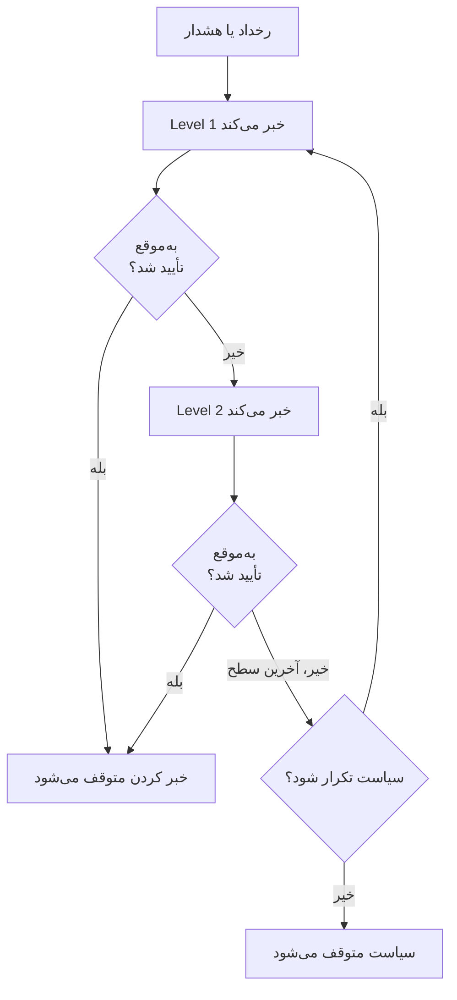

# قواعد تشدید

یک سیاست آنکال افراد را در سطح‌هایی خبر می‌کند. هر قاعده تشدید یک سطح است: چه کسی خبر شود، و پیش از خبر کردن سطح بعدی چه مدت منتظر تأیید کسی بمانیم. قواعد یک سیاست به ترتیب در صفحه **قواعد تشدید** آن فهرست می‌شوند.



:::cards
- [اول به چه کسی خبر داده می‌شود](#اول-به-چه-کسی-خبر-داده-میشود): یک سیاست با نخستین سطحش بسازید.
- [افزودن قاعده تشدید](#افزودن-قاعده-تشدید): سطح بعدی را گام به گام اضافه کنید.
- [سطح‌ها چگونه افراد را خبر می‌کنند](#سطحها-چگونه-افراد-را-خبر-میکنند): زمان‌بندی، تکرارها و اینکه هر فرد چگونه دریافت می‌کند.
- [API و Terraform](#ساختن-قواعد-با-api-یا-terraform): سیاست‌ها و قواعد را به‌صورت کد بسازید.
:::

## اول به چه کسی خبر داده می‌شود

وقتی در صفحه **سیاست‌های آنکال** یک سیاست آنکال می‌سازید، فرم **نام** آن و **اول به چه کسی خبر داده شود؟** را می‌پرسد. این پرسش از همان انتخاب‌گر **اطلاع بده** استفاده می‌کند: زمان‌بندی‌های آنکال، تیم‌ها و افراد، هر تعداد که لازم باشد. کسانی که انتخاب می‌کنید نخستین قاعده تشدید سیاست می‌شوند، یعنی **Level 1**، که پیش از خبر کردن سطح بعدی **۳۰ دقیقه** منتظر تأیید می‌ماند.

:::steps
1. به **کشیک آنکال** > **سیاست‌های آنکال** بروید و روی **ساخت سیاست آنکال** کلیک کنید.
2. یک **نام** وارد کنید.
3. زیر **اول به چه کسی خبر داده شود؟** روی **افزودن پاسخ‌دهنده** کلیک کنید و زمان‌بندی‌های آنکال، تیم‌ها و افرادی را که باید اول خبر شوند انتخاب کنید.
4. روی **ساخت سیاست آنکال** کلیک کنید. سیاست تازه سپس در صفحه **قواعد تشدید** خود باز می‌شود، جایی که می‌توانید سطح‌های بیشتری اضافه کنید.
:::

**اول به چه کسی خبر داده شود؟** اختیاری است. اگر آن را خالی بگذارید، سیاست بدون قاعده تشدید شروع می‌شود: تا وقتی قاعده‌ای اضافه نکنید به هیچ‌کس خبر نمی‌دهد، و نمای کلی آن هم همین را می‌گوید. توضیحات و برچسب‌ها زیر **فیلدهای بیشتر** هستند. این پرسش فقط از کسانی پرسیده می‌شود که می‌توانند قاعده تشدید اضافه کنند.

## افزودن قاعده تشدید

:::steps
### قواعد تشدید سیاست را باز کنید

سیاست آنکال را باز کنید، در منوی کناری آن **قواعد تشدید** را انتخاب کنید و روی **افزودن قاعده تشدید** کلیک کنید. این پنجره یک صفحه کوتاه است.

### انتخاب کنید به چه کسی اطلاع داده شود

زیر **اطلاع بده** روی **افزودن پاسخ‌دهنده** کلیک کنید، جستجو کنید و هر تعداد زمان‌بندی آنکال، تیم و فردی را که این سطح باید خبر کند انتخاب کنید. دست‌کم یکی اضافه کنید.

| پاسخ‌دهنده | وقتی سطح اجرا می‌شود چه کسی خبر می‌شود |
| --- | --- |
| یک **زمان‌بندی آنکال** | هر کسی که هنگام اجرای سطح در آن آنکال است، نه یک فرد ثابت. |
| یک **تیم** | همه اعضای تیم. |
| یک **فرد** | همان فرد، به‌طور مستقیم. |

### مدت انتظار را تعیین کنید

**تشدید پس از (به دقیقه)** مدتی است که پیش از خبر کردن سطح بعدی منتظر تأیید می‌مانیم. مقدار آغازین آن **۳۰ دقیقه** است؛ آن را به هر مقداری که برای سطح مناسب است تغییر دهید.

### اگر خواستید برای قاعده نام بگذارید

همه چیزهای دیگر زیر **فیلدهای بیشتر** هستند که تا بازش نکنید جمع‌شده می‌ماند:

- **نام**: اختیاری. قاعده‌ای که نام نگذارید، به نام سطحش نامیده می‌شود: نخستین قاعده یک سیاست **Level 1** است، دومی **Level 2**، و همین‌طور الی آخر. فیلد نام، نامی را که قاعده خواهد گرفت نشان می‌دهد.
- **توضیحات**: یادداشت‌های اختیاری، مثلاً اینکه این سطح چه کسی را و چرا خبر می‌کند.

در حالت جمع‌شده، سرتیتر **فیلدهای بیشتر** نام این دو را می‌آورد و آن‌هایی را که قاعده دارد نشان می‌دهد: یک توضیح، یا نامی که خودتان گذاشته‌اید.

### قاعده را بسازید

روی **Create Rule** کلیک کنید. قاعده زیر قواعد دیگر، به‌عنوان سطح بعدی سیاست، اضافه می‌شود.
:::

## سطح‌ها چگونه افراد را خبر می‌کنند

وقتی رخداد یا هشداری به سیاست می‌رسد، **Level 1** بی‌درنگ پاسخ‌دهندگانش را خبر می‌کند. اگر کسی در مدت انتظار آن تأیید نکند، **Level 2** خبر می‌شود، و همین‌طور تا پایین فهرست. وقتی مدت انتظار آخرین سطح بدون تأیید بگذرد، اگر **تکرار سیاست** آن (زیر قواعد) بگوید تکرار شود، سیاست از **Level 1** دوباره شروع می‌کند، به هر تعداد که اجازه می‌دهد، و در غیر این صورت متوقف می‌شود. تأیید یا برطرف کردن رخداد یا هشدار، خبر کردن را در هر سطحی متوقف می‌کند.

رخداد، هشدار یا اپیزودی که از پیش تأییدشده یا برطرف‌شده ساخته شود — یعنی پس از رخ دادن ثبت شود — هیچ‌کدام از سیاست‌هایش را اجرا نمی‌کند: کسی خبر نمی‌شود، و فید آن با نام بردن از آن‌ها همین را می‌گوید. [حادثه‌ای که از پیش تأییدشده یا برطرف‌شده اعلام می‌شود](/docs/incidents/declaring-incidents#حادثهای-که-از-پیش-تأییدشده-یا-برطرفشده-اعلام-میشود) را ببینید.

برای تکرار یک سیاست، روی **ویرایش** در کارت **تکرار سیاست** کلیک کنید، **Repeat if no one acknowledges** را روشن کنید و **Number of times to repeat** را تنظیم کنید.

### خلاصه تشدید

خلاصه بالای صفحه **قواعد تشدید** کل نردبان را نشان می‌دهد: هر سطح کی خبر می‌شود، چه کسی را خبر می‌کند و پس از آخرین سطح چه می‌شود. سطحی که نمی‌توان همه پاسخ‌دهندگانش را خبر کرد، این را روی کارتش می‌گوید؛ برای دیدن اینکه چه کسی و چرا، روی برچسب کلیک کنید.

### هر فرد چگونه دریافت می‌کند

هر فردی که یک سطح خبر می‌کند، به همان شکلی دریافت می‌کند که قواعد آنکال خودش می‌گوید: **تنظیمات کاربر** > **قواعد آنکال**، با یک زبانه برای رخدادها، اپیزودهای رخداد، هشدارها و اپیزودهای هشدار، و یک کارت برای هر شدت که نشان می‌دهد کدام روش اعلان و پس از چه مدت امتحان می‌شود. مدیر پروژه می‌تواند قواعد یک عضو را زیر **کاربران** > عضو > **قواعد آنکال** ببیند و تغییر دهد.

```mermaid title="یک سطح چه کسی را خبر می‌کند و هر فرد چگونه دریافت می‌کند"
flowchart TB
    subgraph notify["اطلاع بده"]
        direction LR
        schedule["زمان‌بندی آنکال"]
        team["تیم"]
        user["فرد"]
    end
    schedule -->|"هر کسی که آنکال است"| person["فرد خبرشده"]
    team -->|"همه اعضا"| person
    user -->|"مستقیم"| person
    person --> rules["قواعد آنکال او"]
    rules --> methods["روش‌های اعلان او"]
```

بازنویسی کاربری که برای یک فرد برقرار است، خبرهای او را به جای او برای کسی که جایش را پوشش می‌دهد می‌فرستد.

هر پیام از نوعی است که ارائه‌دهنده می‌پذیرد، پس خبر همیشه فرستاده می‌شود. هر کانال این مقدار را می‌برد:

| کانال | بلندترین پیامی که می‌برد |
| --- | --- |
| SMS | ۱٬۶۰۰ نویسه |
| تماس تلفنی | آنچه در اسکریپت تماس ۴٬۰۰۰ نویسه‌ای Twilio جا شود |
| اعلان پوش | ۴ KB، که عنوان، متن و داده‌اش حداکثر ۳ KB از آن را می‌گیرند |
| WhatsApp | ۱٬۰۲۴ نویسه |
| Telegram | ۴٬۰۹۶ نویسه |

پیام بلندتر، با عنوانی بلند یا توضیحی بلند که الگویی در آن گذاشته، کوتاه می‌شود و با یادداشتی تمام می‌شود که می‌گوید متن کامل در OneUptime است: "… (truncated — see OneUptime for the full text)". متن پیام WhatsApp یک الگوی ثابت است، پس آنجا به جای آن بلندترین مقدارها کوتاه می‌شوند و هرکدام با "…" تمام می‌شود. پیوندهای یک پیام هرگز کوتاه نمی‌شوند.

### وقتی خبری فرستاده نمی‌شود

خبری که فرستاده نشود، دلیلش را در **گزارش‌های آنکال** آن فرد (تنظیمات کاربر) می‌گوید: ردیف آن **خطا** را نشان می‌دهد و پیام وضعیتش دلیل را می‌گوید. دیگر روی **Sending** نمی‌ماند. پیام یکی از این‌ها را می‌گوید:

- موجودی پروژه نتوانست هزینه‌اش را بپردازد، و چه کسی می‌تواند موجودی اضافه کند؛
- کانال در پروژه خاموش است، و چه کسی می‌تواند روشنش کند.

مالکان پروژه یک بار درباره آن ایمیل می‌گیرند، تا وقتی موجودی شارژ شود یا کانال دوباره روشن شود.

در OneUptime Cloud هزینه هر SMS، تماس، پیام WhatsApp و Telegram از موجودی پروژه در **Project Settings > Notifications > Notification Settings** پرداخت می‌شود: هزینه دقیق آن وقتی ارائه‌دهنده پیام را می‌پذیرد از موجودی کم می‌شود، هر تعداد پیام که هم‌زمان فرستاده شود.

- اگر **شارژ خودکار** آنجا روشن باشد، پیامی که موجودی را زیر آستانه می‌بیند، اول مبلغی را که شارژ خودکار روی آن تنظیم شده اضافه می‌کند و از کارت پروژه برداشت می‌کند؛ پیام‌هایی که در همان لحظه موجودی را کم می‌بینند، یک بار از کارت برداشت می‌کنند.
- اگر آن برداشت ناموفق باشد (روش پرداختی نیست یا کارت رد شده)، شارژ خودکار یک ساعت بعد دوباره کارت را امتحان می‌کند و **تنظیمات اعلان** تا آن موقع این را در بالا می‌گوید. افزودن دستی موجودی، یا ذخیره دوباره شارژ خودکار، بی‌درنگ امتحان می‌کند.
- تا وقتی شارژ خودکار نمی‌تواند از کارت برداشت کند، خبرها با موجودی باقی‌مانده فرستاده می‌شوند.

> [!IMPORTANT]
> SMS، تماس تلفنی، WhatsApp و Telegram در پروژه تازه خاموش‌اند: در OneUptime Cloud هزینه هر پیام از موجودی پروژه پرداخت می‌شود، و نصب خودمیزبان پیش از آن به یک حساب Twilio یا یک ربات Telegram راه‌اندازی‌شده نیاز دارد. تا وقتی کانالی خاموش است، هیچ‌کس در پروژه نمی‌تواند روشی روی آن اضافه کند. فقط مالک پروژه، **Billing Admin** یا کسی که مجوز **Manage Billing** دارد می‌تواند آن را در کارت **کانال‌های اعلان** در **Project Settings > Notifications > Notification Settings** روشن کند — مدیر پروژه نمی‌تواند. به همه دیگران، هر جا کانالی خاموش است، دقیقاً گفته می‌شود چه کسی می‌تواند: بالای فهرست روش‌های خودشان روی آن کانال، در فهرست راه‌اندازی‌شان، و در پیامی که وقتی چیزی به آن کانال نیاز دارد دریافت می‌کنند.

## ویرایش، مرتب‌سازی و حذف قواعد

کارت هر قاعده **Edit rule** دارد، و یک منوی **⋯** با کارهای دیگر:

- **Edit rule** همان پنجره یک‌صفحه‌ای را باز می‌کند که با قاعده همان‌طور که هست پر شده: پاسخ‌دهندگانش، مدت انتظارش، و نام و توضیحاتش زیر **فیلدهای بیشتر**. پاسخ‌دهندگان را اضافه یا حذف کنید و روی **ذخیره تغییرات** کلیک کنید. پاک کردن نام، دوباره نام سطح را به قاعده می‌دهد.
- **Move up** و **Move down** در منوی **⋯** یک قاعده سطح آن را تغییر می‌دهند. قاعده‌ای که به نام سطحش نامیده شده، نامی متناسب با جایگاهش نگه می‌دارد: وقتی **Level 3** از **Level 2** بالاتر می‌رود، این دو نامشان را با هم عوض می‌کنند. نامی که خودتان انتخاب کرده‌اید، مثل **مدیران**، هر جا قاعده برود همان می‌ماند.
- **Delete rule** اول می‌پرسد و می‌گوید آن سطح چه کسی را خبر می‌کند. حذف یک سطح، سطح‌های زیرش را بالا می‌برد، و قواعدی که به نام سطحشان نامیده شده‌اند متناسب با آن تغییر نام می‌دهند.

## ساختن قواعد با API یا Terraform

قواعد تشدید منبع `/api/on-call-duty-policy-escalation-rule` هستند؛ افراد، تیم‌ها و زمان‌بندی‌هایی که یک قاعده خبر می‌کند منابع `/api/on-call-duty-policy-escalation-rule-user`، `-team` و `-schedule` هستند.

- قاعده‌ای که بدون `name` ساخته شود، مثل داشبورد به نام سطحش نامیده می‌شود: **Level 3** برای قاعده‌ای که سطح سوم سیاستش می‌شود. منبع قاعده تشدید Terraform همچنان نام می‌خواهد.
- `escalateAfterInMinutes` بیرون از داشبورد مقدار پیش‌فرض ندارد. قاعده‌ای که بدون آن ساخته شود منتظر نمی‌ماند: سطح بعدی به محض اجرای این سطح خبر می‌شود. آن را صریحاً تنظیم کنید — ۳۰ همان چیزی است که داشبورد پیشنهاد می‌کند.
- قاعده‌ای که با `onCallSchedules`، `teams` یا `users` (فهرست‌هایی از شناسه‌ها) در `miscDataProps` خود ساخته شود، همان پاسخ‌دهندگان را می‌گیرد؛ انتخاب‌گر **اطلاع بده** داشبورد هم آن‌ها را همین‌طور می‌فرستد. قاعده‌ای که بدون آن‌ها ساخته شود، تا وقتی از راه منابع بالا پاسخ‌دهنده اضافه نکنید کسی را خبر نمی‌کند.
- تغییر نام قواعدی که به نام سطحشان نامیده شده‌اند، وقتی رخ می‌دهد که قواعد را در داشبورد جابه‌جا یا حذف کنید. تغییر `order` از راه API یا Terraform فقط ترتیب را تغییر می‌دهد.
- ساختن یک سیاست آنکال در `/api/on-call-duty-policy` با `onCallSchedules`، `teams` یا `users` (فهرست‌هایی از شناسه‌ها) در `miscDataProps` آن، مثل داشبورد نخستین قاعده تشدیدش را به آن می‌دهد: **Level 1**، که آن‌ها را خبر می‌کند، با `escalateAfterInMinutes` برابر ۳۰. هر شناسه باید به پروژه تعلق داشته باشد و فراخوان باید اجازه ساختن قاعده تشدید داشته باشد، وگرنه سیاست ساخته نمی‌شود. سیاستی که بدون آن‌ها ساخته شود، مثل قبل هیچ قاعده‌ای ندارد؛ منبع سیاست Terraform آن‌ها را نمی‌فرستد.

```bash
curl -X POST https://oneuptime.com/api/on-call-duty-policy \
  -H "apikey: $ONEUPTIME_API_KEY" \
  -H "Content-Type: application/json" \
  -d '{
    "data": {
      "projectId": "<project-id>",
      "name": "Production on-call"
    },
    "miscDataProps": {
      "onCallSchedules": ["<schedule-id>"],
      "users": ["<user-id>"]
    }
  }'
```

## گام‌های بعدی

:::cards
- [زمان‌بندی‌های آنکال](/docs/on-call/schedules): چرخش‌هایی را که یک سطح خبر می‌کند بسازید.
- [خط زمانی زمان‌بندی‌ها](/docs/on-call/schedule-timeline): ببینید در همه زمان‌بندی‌ها چه کسی آنکال است و شکاف‌های پوشش را پیدا کنید.
- [سیاست تماس ورودی](/docs/on-call/incoming-call-policy): بگذارید تماس‌گیرندگان از راه تلفن به مهندس آنکال برسند.
:::
