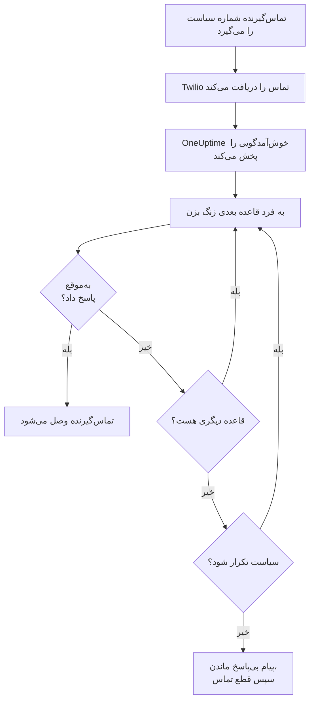
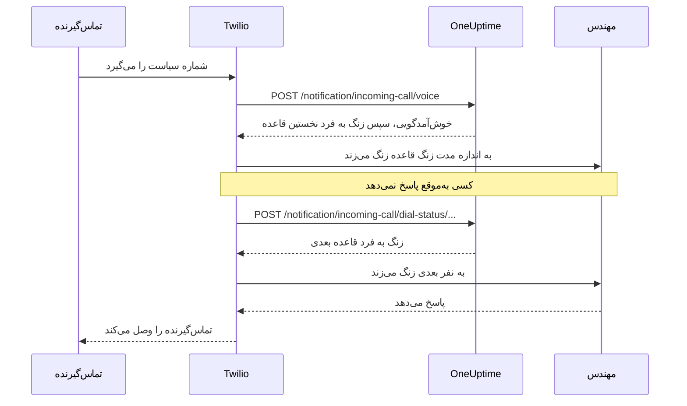

# سیاست تماس ورودی

سیاست تماس ورودی به تیم شما یک شماره تلفن می‌دهد که به هر کسی که آنکال است می‌رسد. وقتی کسی آن را می‌گیرد، OneUptime افراد قواعد تشدید سیاست را یکی پس از دیگری زنگ می‌زند تا کسی پاسخ دهد، و تماس‌گیرنده را وصل می‌کند. شماره‌ها و تماس‌ها روی حساب Twilio خود شما اجرا می‌شوند.

:::cards
- [راه‌اندازی یک سیاست](#راهاندازی-یک-سیاست): از حساب Twilio شما تا یک تماس آزمایشی، در هفت گام.
- [تماس چگونه مسیریابی می‌شود](#تماس-چگونه-مسیریابی-میشود): به چه کسی و چه مدت زنگ زده می‌شود، و تماس‌گیرنده چه می‌شنود.
- [تماس‌های از دست رفته](#تماسهای-از-دست-رفته): به چه کسی گفته می‌شود، و چگونه در یک گردش کار به آن‌ها واکنش نشان دهید.
- [عیب‌یابی](#عیبیابی): تماس‌هایی که هرگز نمی‌رسند، یا هرگز به مهندسی نمی‌رسند.
:::

## پیش از شروع

| به چه نیاز دارید | چرا |
| --- | --- |
| یک حساب Twilio، با Account SID و Auth Token آن | شماره‌ها و تماس‌های سیاست روی آن اجرا می‌شوند و Twilio هزینه‌شان را به همان حساب می‌زند. |
| طرح **Growth** در OneUptime Cloud | پروژه برای پیکربندی Twilio خودش به آن نیاز دارد. |
| اگر خودتان میزبانی می‌کنید، سروری از OneUptime که Twilio به آن دسترسی داشته باشد | Twilio هر تماس را به `https://<your host>/notification/incoming-call/voice` می‌فرستد. |
| روشن بودن **SMS** در پروژه | شماره هر مهندس با کدی که با پیامک فرستاده می‌شود تأیید می‌شود. |
| یک شماره تأییدشده برای هر مهندس | یک قاعده فقط به کسانی زنگ می‌زند که در پروژه شماره‌ای برای تماس‌های ورودی افزوده و تأیید کرده‌اند. |

## راه‌اندازی یک سیاست

:::steps
### حساب Twilio خود را اضافه کنید

به **تنظیمات پروژه** > **اعلان‌ها** > **تنظیمات اعلان** بروید. در کارت **پیکربندی Twilio** روی **Create Twilio Config** کلیک کنید و فرم را پر کنید:

- **نام** و **توضیحات**: کاربرد حساب، مثلاً «خط پشتیبانی».
- **Twilio Account SID**: از Twilio Console. با `AC` شروع می‌شود.
- **Twilio Auth Token**: از Twilio Console.
- **شماره تلفن اصلی Twilio**: شماره‌ای از همان حساب، برای پیامک‌ها و تماس‌هایی که می‌فرستد.
- **شماره‌های تلفن دوم Twilio**: اختیاری. شماره‌هایی که برای گیرندگان کشور خودشان به جای شماره اصلی می‌فرستند.
- **تنظیم به‌عنوان پیش‌فرض پروژه**: برای نخستین پیکربندی Twilio پروژه روشن است، تا پیامک‌ها و تماس‌ها به اعضای پروژه هم از راه همین حساب بروند. اگر این حساب فقط برای تماس‌های ورودی است، آن را خاموش کنید.

### سیاست را بسازید

به **کشیک آنکال** > **سیاست‌های تماس ورودی** بروید و روی **ساخت سیاست تماس ورودی** کلیک کنید. به آن یک **نام** بدهید، مثلاً «خط پشتیبانی»، و در صورت تمایل **توضیحات** و **برچسب‌ها**. سپس آن را از فهرست باز کنید.

### حساب Twilio را برگزینید

**نمای کلی** سیاست یک کارت **راه‌اندازی** با سه گام شماره‌دار نشان می‌دهد. در گام نخست روی **انتخاب** کلیک کنید، حساب را زیر **پیکربندی Twilio** برگزینید و روی **ذخیره** کلیک کنید.

### یک شماره تلفن اضافه کنید

در گام دوم روی **Add Phone Number** کلیک کنید. برای آوردن شماره‌ای که حساب Twilio شما از قبل دارد **Use Existing Phone Number** را برگزینید، یا برای گرفتن شماره‌ای تازه **Reserve New Phone Number** را. OneUptime شماره را به سوی خودش نشانه می‌رود، پس چیزی برای تنظیم در Twilio نمی‌ماند. [شماره‌های تلفن](#شمارههای-تلفن) را ببینید.

### قواعد تشدید را اضافه کنید

در گام سوم روی **مدیریت قواعد** کلیک کنید. برای هر زمان‌بندی آنکال یا فردی که باید زنگ بخورد، به همان ترتیبی که باید زنگ بخورند، یک قاعده اضافه کنید. [قواعد تشدید](#قواعد-تشدید) را ببینید.

### شماره هر مهندس را تأیید کنید

هر کسی که ممکن است یک قاعده به او زنگ بزند، شماره خودش را برای تماس‌های ورودی اضافه و تأیید می‌کند. [شماره تلفن مهندسان](#شماره-تلفن-مهندسان) را ببینید.

### با شماره تماس بگیرید

وقتی هر سه گام انجام شد، کارت به **Phone Numbers & Twilio Configuration** تبدیل می‌شود. از هر تلفنی با شماره تماس بگیرید، سپس **گزارش تماس‌ها** سیاست را باز کنید تا ببینید به چه کسی زنگ زده شد.
:::

## تماس چگونه مسیریابی می‌شود

1. Twilio تماس را به OneUptime می‌فرستد که **پیام خوش‌آمدگویی** سیاست را می‌خواند.
2. OneUptime به فردی زنگ می‌زند که نخستین قاعده تشدید نام می‌برد: همان فرد، یا هر کسی که در آن لحظه در زمان‌بندی آنکال قاعده آنکال است، با در نظر گرفتن بازنویسی‌های کاربر. تلفن او شماره سیاست را به‌عنوان تماس‌گیرنده نشان می‌دهد.
3. اگر او در **مدت زنگ** قاعده پاسخ دهد، تماس‌گیرنده وصل می‌شود و گزارش تماس ثبت می‌کند چه کسی پاسخ داد.
4. اگر نه، تماس‌گیرنده "Connecting you to the next available engineer." را می‌شنود و به فرد قاعده بعدی زنگ زده می‌شود.
5. پس از آخرین قاعده، اگر **اگر کسی پاسخ نداد سیاست تکرار شود** روشن باشد، سیاست از نخستین قاعده دوباره شروع می‌کند، به اندازه‌ای که **دفعات تکرار سیاست** می‌گوید. در غیر این صورت تماس‌گیرنده **پیام بی‌پاسخ ماندن** را می‌شنود و تماس پایان می‌یابد.

قاعده‌ای که اکنون کسی برای زنگ زدن ندارد، بدون زنگ زدن به کسی رد می‌شود: زمان‌بندی‌اش کسی را آنکال ندارد، فرد در این پروژه شماره تأییدشده‌ای برای تماس‌های ورودی ندارد، یا دیگر عضو پروژه نیست. وقتی هیچ قاعده‌ای کسی برای زنگ زدن ندارد، تماس‌گیرنده **پیام «کسی در دسترس نیست»** را می‌شنود. سیاست غیرفعال به هر تماسی با "Sorry, this service is currently disabled." پاسخ می‌دهد و قطع می‌کند.

OneUptime امضای Twilio را در هر درخواست با Auth Token پیکربندی Twilio بررسی می‌کند و درخواستی را که نتواند تأیید کند رد می‌کند.

> [!TIP]
> شماره سیاست را به‌عنوان یک مخاطب در تلفن خود ذخیره کنید، مثلاً «خط پشتیبانی»، تا وقتی تماس مسیریابی‌شده‌ای زنگ می‌زند آن را بشناسید.

## قواعد تشدید

قواعد تشدید تعیین می‌کنند وقتی کسی با شماره سیاست تماس می‌گیرد، از بالای فهرست به پایین، به چه کسی زنگ زده شود. سیاست را باز کنید، در منوی کناری آن **قواعد تشدید** را انتخاب کنید و روی **افزودن قاعده تشدید** کلیک کنید. هر قاعده یک گام کوتاه است:

- **تماس با چه کسی**: یک زمان‌بندی آنکال یا یک فرد. زمان‌بندی به هر کسی زنگ می‌زند که هنگام رسیدن تماس در آن آنکال است. افراد اعضای پروژه شما هستند.
- **مدت زنگ (به ثانیه)**: اینکه تلفن آن‌ها چه مدت زنگ بخورد تا تماس به قاعده بعدی برود. از ۲۰ ثانیه شروع می‌شود و Twilio از ۵ تا ۶۰۰ را می‌پذیرد.
- **نام** و **توضیحات** اختیاری‌اند، زیر **فیلدهای بیشتر**. قاعده بدون نام بر اساس جایگاهش در فهرست نمایش داده می‌شود: **Level 1**، **Level 2**.

قواعد از بالای فهرست به پایین فراخوانده می‌شوند، و قاعده تازه به انتهای فهرست افزوده می‌شود. برای تغییر ترتیب، قاعده‌ای را از دستگیره بالا سمت چپ آن بکشید. با صفحه‌کلید، دستگیره را در کانون قرار دهید، Space را بزنید، با کلیدهای جهت‌نما جابه‌جایش کنید و دوباره Space را بزنید.

> [!WARNING]
> **مراقب پست صوتی باشید**: **مدت زنگ** را کوتاه‌تر از زمانی نگه دارید که تلفن فرد طول می‌کشد تا تماس بی‌پاسخ را به پست صوتی بفرستد. اگر پست صوتی او زودتر پاسخ دهد، تماس‌گیرنده به آن وصل می‌شود و تماس به قاعده بعدی نمی‌رود. Twilio به هر زنگ چند ثانیه از خودش اضافه می‌کند. برای همین قاعده تازه از ۲۰ ثانیه شروع می‌شود. قواعدی که وقتی پیش‌فرض ۳۰ ثانیه بود افزوده شده‌اند، ۳۰ خود را نگه می‌دارند: اگر تماس‌هایشان به پست صوتی می‌رسد، **مدت زنگ** آن قواعد را کم کنید.

برای نمونه، سه قاعده که دو چرخش و سپس یک سرپرست را امتحان می‌کنند:

| سطح | تماس با چه کسی | مدت زنگ |
| --- | --- | --- |
| Level 1 | زمان‌بندی آنکال اصلی | ۲۰ ثانیه |
| Level 2 | زمان‌بندی آنکال دوم | ۲۰ ثانیه |
| Level 3 | سرپرست مهندسی (یک فرد) | ۲۰ ثانیه |

## شماره‌های تلفن

یک سیاست می‌تواند چند شماره داشته باشد، و هر کدام به همان قواعد زنگ می‌زنند. هر شماره به یک سیاست تعلق دارد. آن‌ها را با **Add Phone Number** در **نمای کلی** سیاست اضافه کنید:

:::tabs
@tab استفاده از شماره‌ای که دارید
1. روی **Add Phone Number**، سپس **Use Existing Phone Number** کلیک کنید. OneUptime شماره‌های حساب Twilio سیاست را فهرست می‌کند.
2. کنار شماره روی **انتخاب**، سپس **تخصیص شماره** کلیک کنید.

شماره‌ای که از قبل تماس‌هایش را جای دیگری می‌فرستد "Currently has a webhook configured" را نشان می‌دهد. تخصیص آن، تماس‌هایش را به جای آن به OneUptime می‌فرستد.
@tab رزرو یک شماره تازه
1. روی **Add Phone Number**، سپس **Reserve New Phone Number** و **جستجوی شماره‌ها** کلیک کنید.
2. یک **کشور** برگزینید. در صورت تمایل **کد منطقه (اختیاری)** را پر کنید، مثلاً ۴۱۵، یا **شامل (اختیاری)** را با رقم‌هایی که شماره باید داشته باشد. روی **جستجو** کلیک کنید: حداکثر ۱۰ شماره محلی فهرست می‌شود.
3. کنار یک شماره روی **رزرو** کلیک کنید و با **رزرو** تأیید کنید. Twilio هزینه شماره را به حساب Twilio شما می‌زند.
:::

OneUptime وب‌هوک صوتی شماره را روی `https://<your host>/notification/incoming-call/voice` تنظیم می‌کند که در نصب خودمیزبان از `HOST` و `HTTP_PROTOCOL` ساخته می‌شود. برای انتقال یک سیاست به حساب Twilio دیگری، اول شماره‌هایش را آزاد کنید: حساب فقط وقتی سیاست هیچ شماره‌ای ندارد قابل تغییر است.

برای آزاد کردن یک شماره، کنار آن روی **آزادسازی** کلیک کنید و با **شماره انتشار** تأیید کنید.

> [!CAUTION]
> آزاد کردن یک شماره آن را به Twilio برمی‌گرداند، حتی شماره‌ای که با **Use Existing Phone Number** آورده‌اید، و ممکن است دیگر آن را به دست نیاورید. حذف یک سیاست، یا پیکربندی Twilio‌ای که از آن استفاده می‌کند، شماره‌هایش را هم آزاد می‌کند.

## شماره تلفن مهندسان

یک قاعده به فرد روی شماره‌ای زنگ می‌زند که او در این پروژه برای تماس‌های ورودی تأیید کرده، و از هر کسی که شماره‌ای ندارد می‌گذرد. هر فرد شماره خودش را اضافه می‌کند:

:::steps
1. **تنظیمات کاربر** > **سیاست تماس ورودی** > **شماره‌های تلفن ورودی** را باز کنید. **سیاست تماس ورودی** بخشی از منوی کناری است که جمع‌شده شروع می‌شود.
2. در کارت **شماره‌های تلفن برای مسیریابی تماس ورودی** روی **افزودن شماره تلفن برای مسیریابی تماس ورودی** کلیک کنید و شماره را با کد کشورش وارد کنید، مثلاً `+15551234567`.
3. کد ۶ رقمی‌ای را که OneUptime از راه پیامک (SMS) به آن شماره می‌فرستد زیر **کد تأیید** وارد کنید و روی **تأیید** کلیک کنید. **Send a new code** کد دیگری می‌فرستد.
:::

هر فرد می‌تواند در هر پروژه یک شماره تأییدشده داشته باشد. برای تغییر آن، اول شماره قدیمی را حذف کنید. این شماره‌ها از شماره تلفن‌های زیر **روش‌های اعلان** که خبرهای آنکال از آن‌ها استفاده می‌کنند جدا هستند.

شماره‌های تماس ورودی با پیامک تأیید می‌شوند، پس اول باید **SMS** برای پروژه روشن باشد. مالک پروژه، **Billing Admin** یا کسی که **Manage Billing** دارد آن را در کارت **کانال‌های اعلان** در **Project Settings > Notifications > Notification Settings** روشن می‌کند.

## پیام‌های صوتی و تنظیمات سیاست

سیاست را باز کنید و در منوی کناری آن، زیر **پیشرفته**، **تنظیمات** را انتخاب کنید. **Edit Messages** در کارت **پیام‌های صوتی** آنچه تماس‌گیرندگان می‌شنوند را تغییر می‌دهد؛ **Edit Policy Settings** در کارت **تنظیمات سیاست** بقیه را.

| تنظیم | چه می‌کند | برای سیاست تازه |
| --- | --- | --- |
| **پیام خوش‌آمدگویی** | وقتی تماس پاسخ داده می‌شود، پیش از زنگ زدن به نخستین فرد، خوانده می‌شود. | "Please wait while we connect you to the on-call engineer." |
| **پیام بی‌پاسخ ماندن** | وقتی همه قواعد امتحان شده‌اند و کسی پاسخ نداده، خوانده می‌شود. | "No one is available. Please try again later." |
| **پیام «کسی در دسترس نیست»** | وقتی هیچ قاعده‌ای کسی برای زنگ زدن ندارد، خوانده می‌شود. | "We are sorry, but no on-call engineer is currently available. Please try again later or contact support." |
| **فعال** | سیاست غیرفعال همه تماس‌ها را رد می‌کند. | روشن |
| **اگر کسی پاسخ نداد سیاست تکرار شود** | پس از آخرین قاعده، از نخستین دوباره شروع می‌کند. | خاموش |
| **دفعات تکرار سیاست** | چند بار دوباره شروع شود. | ۱ |

Twilio پیام‌ها را با صدای تبدیل متن به گفتار می‌خواند، پس آن‌ها را همان‌طور بنویسید که می‌خواهید شنیده شوند.

## گزارش تماس‌ها

هر تماس در صفحه **گزارش تماس‌ها** سیاست، زیر **لاگ‌ها** در منوی کناری آن، فهرست می‌شود: **تماس‌گیرنده**، **Number Called**، **وضعیت** آن، چه کسی پاسخ داد (**پاسخ داده شده توسط**)، **مدت**، و زمان شروعش (**تاریخ شروع**). روی **View Timeline** یک تماس کلیک کنید تا **خط زمانی تماس** آن را ببینید: هر فردی که به او زنگ زده شد، روی کدام شماره، و هر تلاش چگونه پایان یافت.

| وضعیت | چه اتفاقی افتاد |
| --- | --- |
| **Initiated**، **Ringing**، **Escalated** | تماس هنوز ادامه دارد: رسیده، تلفنی زنگ می‌خورد، یا به قاعده بعدی رفته است. |
| **تکمیل‌شده** | کسی پاسخ داد و تماس‌گیرنده وصل شد. |
| **بی‌پاسخ** | همه قواعد تشدید امتحان شدند و کسی پاسخ نداد. تماس‌گیرنده **پیام بی‌پاسخ ماندن** شما را شنید. |
| **Caller Hung Up** | تماس‌گیرنده در حالی که تلفن یک مهندس زنگ می‌خورد قطع کرد. |
| **ناموفق** | به کسی نمی‌شد زنگ زد: هیچ قاعده تشدیدی کاربر آنکالی با شماره تأییدشده تماس ورودی نداشت (تماس‌گیرنده **پیام «کسی در دسترس نیست»** شما را شنید)، یا سیاست غیرفعال است. |

## تماس‌های از دست رفته

تماسی از دست رفته است که بدون رسیدن به کسی پایان یابد: وضعیتش **بی‌پاسخ**، **Caller Hung Up** یا **ناموفق** است.

### به چه کسی اطلاع داده می‌شود

وقتی تماسی از دست می‌رود، OneUptime به مالکان سیاست اطلاع می‌دهد: کاربران و اعضای تیم‌هایی که در صفحه **مالکان** سیاست افزوده شده‌اند. اگر سیاست مالکی نداشته باشد، به جای آن به مالکان پروژه اطلاع داده می‌شود.

اعلان می‌گوید چه کسی تماس گرفت، کدام شماره را گرفت، چرا کسی پاسخ نداد، و به چه کسی زنگ زده شد و هر تلاش چگونه پایان یافت. پیوندی به همان تماس در گزارش تماس‌ها دارد.

مالکان به‌طور پیش‌فرض ایمیل می‌گیرند. هر فرد می‌تواند در **تنظیمات کاربر** > **تنظیمات اعلان**، زیر **آنکال** > **سیاست‌های تماس ورودی** > **تماس از دست رفته**، کانال‌های دیگری (پیامک، تماس، پوش و بیشتر) برگزیند یا آن را خاموش کند.

### واکنش به تماس‌های از دست رفته در یک گردش کار

گزارش‌های تماس ورودی به‌عنوان راه‌اندازهای گردش کار در دسترس‌اند:

- **On Create Incoming Call Log** وقتی تماسی می‌رسد اجرا می‌شود.
- **On Update Incoming Call Log** همگام با پیشرفت تماس اجرا می‌شود. به‌روزرسانی‌ای که **Ended At** را تنظیم می‌کند پایان تماس است.

برای واکنش فقط به تماس‌های از دست رفته، مثلاً برای فرستادنشان به Slack یا Microsoft Teams یا باز کردن یک تیکت:

:::steps
1. راه‌انداز **On Update Incoming Call Log** را اضافه کنید. **Listen on** را روی **Ended At** بگذارید و فیلدهایی را که می‌خواهید به کار ببرید برگزینید، مثل **Status**، **Caller Phone Number** و **Routing Phone Number**.
2. یک گام **If / Else** اضافه کنید. **Status** راه‌انداز را با مقایسه **is not equal to** و `Completed` بررسی کنید.
3. گام‌های خود را به درگاه **Yes** وصل کنید.
:::

یک گردش کار می‌تواند گزارش‌های تماس را با **Find One** و **Find Many** بخواند، اما نمی‌تواند آن‌ها را بسازد یا تغییر دهد.

## چه کسی می‌تواند شماره تلفن اضافه و آزاد کند

شماره تلفن‌های یک سیاست از همان نقش‌های خود سیاست پیروی می‌کنند:

- **جستجوی شماره‌ها** - جستجو در Twilio برای شماره‌ای برای رزرو، یا فهرست کردن شماره‌هایی که حساب Twilio شما از قبل دارد - به مجوز خواندن سیاست‌های تماس ورودی و خواندن پیکربندی‌های تماس و پیامک نیاز دارد، چون حساب Twilio شما را از راه یکی از آن‌ها می‌خواند. **Project Owner**، **Project Admin**، **Project Member**، **Viewer**، **Settings Admin**، **Settings Member** و **Settings Viewer** هر دو را دارند. در یک نقش سفارشی، این‌ها **Read Incoming Call Policy** و **Read Call and SMS** هستند.
- **رزرو یک شماره، استفاده از شماره موجود و آزاد کردن یک شماره** به مجوز ویرایش سیاست‌های تماس ورودی نیاز دارند: **Project Owner**، **Project Admin**، **Project Member**، **Settings Admin** و **Settings Member**، یا **Edit Incoming Call Policy** در یک نقش سفارشی. این کارها شماره‌های سیاستی را که می‌توانید ویرایش کنید تغییر می‌دهند: با نقشی که به برخی برچسب‌ها محدود است، سیاست‌هایی که آن برچسب‌ها را دارند.

مسدودسازی بدون برچسب یک تیم روی یکی از این مجوزها آن را از بین می‌برد. برای هر کس دیگری، **Add Phone Number** و **آزادسازی** قفل‌شده روی صفحه می‌مانند و راهنمای آن‌ها می‌گوید به چه چیزی نیاز دارند. API درخواستشان را با جمله‌ای رد می‌کند که می‌گوید به چه چیزی نیاز است: "Looking up phone numbers needs permission to read incoming call policies and call and SMS settings." یا "Adding or releasing a phone number needs permission to edit incoming call policies." رزرو یک شماره از حساب Twilio خود شما برداشت می‌کند، نه از موجودی OneUptime شما، پس به مجوز صورت‌حساب نیازی ندارد.

## ساختن سیاست‌ها با API یا Terraform

| منبع | مسیر API |
| --- | --- |
| سیاست‌های تماس ورودی | `/api/incoming-call-policy` |
| قواعد تشدید آن‌ها | `/api/incoming-call-policy-escalation-rule` |
| شماره تلفن‌های آن‌ها، فقط خواندنی | `/api/incoming-call-policy-phone-number` |
| گزارش‌های تماس، فقط خواندنی | `/api/incoming-call-log` |

قاعده‌ای که از راه API بدون `escalateAfterSeconds` ساخته شود ۲۰ ثانیه زنگ می‌زند، و قاعده‌ای هم که Terraform بدون `escalate_after_seconds` بسازد همین‌طور.

### تنظیمات قاعده تشدید

| تنظیم | فیلد API | چه چیزی نگه می‌دارد |
| --- | --- | --- |
| تماس با چه کسی | `onCallDutyPolicyScheduleId` یا `userId` | یکی از آن‌ها، هرگز هر دو: زمان‌بندی‌ای که به فرد آنکال آن زنگ زده می‌شود، یا خود فرد. |
| مدت زنگ (به ثانیه) | `escalateAfterSeconds` | اینکه تلفن چه مدت زنگ بخورد تا تماس جلو برود (پیش‌فرض: ۲۰؛ از ۵ تا ۶۰۰). |
| نام و توضیحات | `name`، `description` | اختیاری. قاعده بدون نام بر اساس جایگاهش در فهرست به‌صورت Level 1، Level 2 و مانند آن نمایش داده می‌شود. |
| ترتیب | `order` | جای قاعده در فهرست: قواعد از بالا به پایین فراخوانده می‌شوند. قاعده تازه بدون ترتیب به انتها می‌رود. |

## عیب‌یابی

:::details تماس‌ها به OneUptime نمی‌رسند
- در Twilio Console شماره را باز کنید: **A call comes in** باید وب‌هوک `https://<your host>/notification/incoming-call/voice` با HTTP POST باشد. OneUptime آن را هنگام افزودن شماره، از `HOST` و `HTTP_PROTOCOL`، تنظیم می‌کند. اگر از آن زمان تغییر کرده‌اند، وب‌هوک را در Twilio اصلاح کنید.
- OneUptime خودمیزبان باید از اینترنت از راه https در دسترس باشد. گزارش تماس شماره در Twilio Console، و **Debugger** در Twilio، نشان می‌دهند OneUptime چه پاسخی داده است.
- پاسخ `403` یعنی امضای درخواست درست درنیامد. مطمئن شوید پیکربندی Twilio، **Twilio Auth Token** کنونی حساب را دارد، و پراکسی جلوی OneUptime میزبان و طرحی را که Twilio فراخوانده (`X-Forwarded-Host` و `X-Forwarded-Proto`) منتقل می‌کند.
:::

:::details تماس پاسخ داده می‌شود اما به کسی زنگ زده نمی‌شود
گزارش تماس **ناموفق** را نشان می‌دهد. بررسی کنید سیاست **فعال** باشد، زمان‌بندی آنکال هر قاعده همین حالا کسی را آنکال داشته باشد، و افرادی که قواعد به آن‌ها زنگ می‌زنند شماره تأییدشده‌ای زیر **تنظیمات کاربر** > **سیاست تماس ورودی** > **شماره‌های تلفن ورودی** در همین پروژه داشته باشند. قواعد فقط به اعضای پروژه زنگ می‌زنند.
:::

:::details تماس‌ها به پست صوتی می‌رسند
اگر تماس‌ها به پست صوتی یک مهندس می‌رسند، **مدت زنگ** قاعده را کمتر از زمانی بگذارید که تلفن او طول می‌کشد تا به پست صوتی برود. پاسخ پست صوتی هم پاسخ حساب می‌شود و تماس همان‌جا متوقف می‌شود.
:::

:::details شماره تازه‌ای رزرو نمی‌شود
Twilio در بسیاری از کشورها پیش از فروش شماره‌های محلی به یک regulatory bundle تأییدشده نیاز دارد، و برخی شماره‌ها به موجودی مثبت Twilio نیاز دارند. این را در Twilio Console تنظیم کنید، یا شماره را همان‌جا بگیرید و با **Use Existing Phone Number** اضافه‌اش کنید.
:::

:::details حساب Twilio سیاست قابل تغییر نیست
حساب فقط وقتی سیاست هیچ شماره تلفنی ندارد قابل تغییر است: صفحه می‌گوید "Remove all phone numbers to change". آزاد کردن شماره‌ها آن‌ها را به Twilio برمی‌گرداند، پس اول جابه‌جایی را برنامه‌ریزی کنید.
:::

:::details کد شماره یک مهندس نمی‌رسد
SMS باید برای پروژه روشن باشد. در OneUptime Cloud، پروژه‌ای که پیکربندی Twilio پیش‌فرض خودش را ندارد هزینه پیامک را از موجودی‌اش می‌پردازد که باید بیش از ۱ USD باشد. رسیدن کدها ممکن است یک دقیقه طول بکشد؛ برای فرستادن کدی دیگر روی **Send a new code** کلیک کنید، و **تنظیمات پروژه** > **اعلان‌ها** > **گزارش‌های اعلان** نشان می‌دهد چه بر سر آن آمده است.
:::

## گام‌های بعدی

:::cards
- [قواعد تشدید](/docs/on-call/escalation-rules): یک سیاست آنکال چگونه افراد را سطح به سطح خبر می‌کند.
- [زمان‌بندی‌های آنکال](/docs/on-call/schedules): چرخش‌هایی را که قواعد شما به آن‌ها زنگ می‌زنند بسازید.
- [گردش‌های کاری](/docs/workflows/index): به تماس‌های از دست رفته واکنش نشان دهید: آن‌ها را در یک کانال بفرستید یا یک تیکت باز کنید.
- [یکپارچه‌سازی پیامک و تماس صوتی Twilio](/docs/self-hosted/twilio-integration): Twilio را برای نصب خودمیزبان راه‌اندازی کنید.
:::
