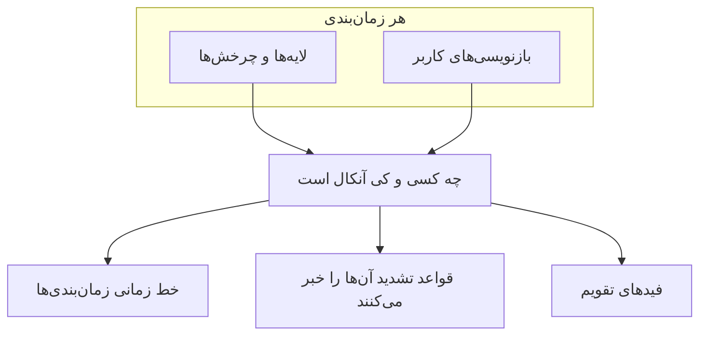

# خط زمانی زمان‌بندی‌ها

خط زمانی زمان‌بندی‌ها همه زمان‌بندی‌های آنکال پروژه شما را روی یک شبکه هفتگی یا ماهانه نشان می‌دهد: یک ردیف برای هر زمان‌بندی، یک ستون برای هر روز. بدون باز کردن تک‌تک زمان‌بندی‌ها به این پرسش پاسخ می‌دهد: «این هفته در تیم من، یا در کل سازمان، چه کسی آنکال است؟»

نوبت‌های روی خط زمانی همان‌هایی هستند که OneUptime با آن‌ها افراد را خبر می‌کند، بازنویسی‌های کاربر هم در آن‌ها حساب است: خط زمانی، قواعد تشدید و فیدهای تقویم همه آن‌ها را از یک جا می‌خوانند.

## خط زمانی را باز کنید

- **کشیک آنکال** > **خط زمانی زمان‌بندی‌ها** همه زمان‌بندی‌هایی را که می‌توانید ببینید، گروه‌بندی‌شده بر اساس تیم مالک، نشان می‌دهد. دکمه **نمای خط زمانی** در **زمان‌بندی‌های آنکال** همین صفحه را باز می‌کند.
- **تیم‌ها** > یک تیم > **زمان‌بندی‌های آنکال** فقط زمان‌بندی‌هایی را نشان می‌دهد که آن تیم مالکشان است.

یک تیم وقتی مالک یک زمان‌بندی است که در صفحه **مالکان** آن زمان‌بندی فهرست شده باشد. زمان‌بندی‌هایی که تیم مالک ندارند زیر **No owner team** گروه‌بندی می‌شوند. برای دیدن همه زمان‌بندی‌ها در یک فهرست، مرتب‌شده بر اساس نام، **Group by team** را خاموش کنید.

## شبکه را بخوانید

| روی شبکه | معنی آن |
| --- | --- |
| یک نوار | یک نوبت: چه کسی آنکال است، از کی تا کی. هر فرد در همه زمان‌بندی‌ها یک رنگ دارد. |
| نوار کم‌رنگ | نوبتی در گذشته. |
| نواری با نشان **⇄** | یک بازنویسی: کسی نوبتی را پوشش می‌دهد. خط باریک زیر آن، نام فردی را که نوبتش پوشش داده می‌شود، خط‌خورده نشان می‌دهد. |
| بلوک کهربایی هاشورخورده | شکاف پوشش: کسی آنکال نیست. هشداری که به آن زمان‌بندی تشدید شود در آن هنگام کسی را خبر نمی‌کند. |
| خط قرمز | اکنون. |
| سطر زیر نام یک زمان‌بندی | چه کسی اکنون آنکال است، یا **No one on call now**. |

برای دیدن جزئیات، نشانگر را روی هر نوار یا شکافی ببرید، یا با صفحه‌کلید به آن بروید.

زیر شبکه، **On call this week** (در نمای ماهانه **On call this month**) همه کسانی را که در این بازه آنکال هستند فهرست می‌کند. نشانگر را روی یک نام ببرید تا ببینید آن فرد چه مدت و در چند زمان‌بندی آنکال است.

## بازه و منطقه زمانی را تغییر دهید

- بین **Week** و **Month** جابه‌جا شوید، با پیکان‌ها حرکت کنید و با **Today** برگردید.
- زمان‌ها در منطقه زمانی خودتان نشان داده می‌شوند. دکمه منطقه زمانی **View timeline in timezone** را باز می‌کند که خط زمانی را در هر منطقه دیگری نشان می‌دهد بدون اینکه تغییر دهد چه کسی کی آنکال است: هر زمان‌بندی همچنان در منطقه زمانی خودش تحویل می‌دهد.
- خط زمانی ۱۸۰ روز گذشته و ۳۶۵ روز آینده را پوشش می‌دهد.

> [!NOTE]
> نوبت‌های گذشته از روی تنظیمات کنونی هر زمان‌بندی دوباره محاسبه می‌شوند، پس چرخش را همان‌طور که اکنون تنظیم شده نشان می‌دهند، که ممکن است با کسی که در آن زمان واقعاً خبر شده فرق داشته باشد. برای ساعت‌هایی که افراد واقعاً آنکال بوده‌اند، از **کشیک آنکال** > **گزارش‌ها** > **زمان آنکال کاربر** استفاده کنید.

## یک زمان‌بندی یا فرد را پیدا کنید

- **جستجو** با نام زمان‌بندی‌ها، نام تیم‌ها و افراد آنکال تطبیق می‌دهد.
- فیلتر تیم نما را به یک تیم یا به **My teams** محدود می‌کند؛ **Schedules I'm on** فقط زمان‌بندی‌هایی را نگه می‌دارد که شما بخشی از آن‌ها هستید.
- بالای شبکه، روی **with no one on call now** یا **with coverage gaps this week** (در نمای ماهانه **with coverage gaps this month**) کلیک کنید تا فقط آن زمان‌بندی‌ها را ببینید. دوباره کلیک کنید تا همه را ببینید.
- روی فردی زیر شبکه، یا یکی از نوارهای او، کلیک کنید تا همه نوبت‌هایش برجسته شوند. **Clear highlight** آن را برمی‌گرداند و **Clear filters** جستجو و فیلترها را بازنشانی می‌کند.

## چه کسی چه چیزی می‌بیند

| مربوط به | قاعده |
| --- | --- |
| مجوزها | همان مجوزها و محدودیت‌های برچسبی **زمان‌بندی‌های آنکال**، به‌علاوه مجوز خواندن لایه‌های زمان‌بندی. |
| بازنویسی‌ها | اینکه یک بازنویسی نوبت چه کسی را پوشش می‌دهد فقط به کسانی نشان داده می‌شود که می‌توانند بازنویسی‌های کاربر را بخوانند. دیگران همچنان می‌بینند چه کسی خبر می‌شود. |
| تعداد زمان‌بندی‌ها | حداکثر ۲۵۰ زمان‌بندی در هر بار، مرتب‌شده بر اساس نام. صفحه **زمان‌بندی‌های آنکال** یک تیم آن را به زمان‌بندی‌هایی که آن تیم مالکشان است محدود می‌کند. |
| طرح | در OneUptime Cloud، خط زمانی مثل زمان‌بندی‌های آنکال به طرح **Growth** نیاز دارد. |

## گام‌های بعدی

:::cards
- [زمان‌بندی‌های آنکال](/docs/on-call/schedules): تعیین کنید چه کسانی به نوبت آنکال هستند، لایه‌ها و ساعت‌های آنکال.
- [فیدهای تقویم](/docs/on-call/calendar-feeds): نوبت‌هایتان را در Google Calendar، Outlook یا تقویم Apple بگذارید.
- [قواعد تشدید](/docs/on-call/escalation-rules): تصمیم بگیرید هر سطح یک سیاست آنکال چه کسی را خبر کند.
:::
