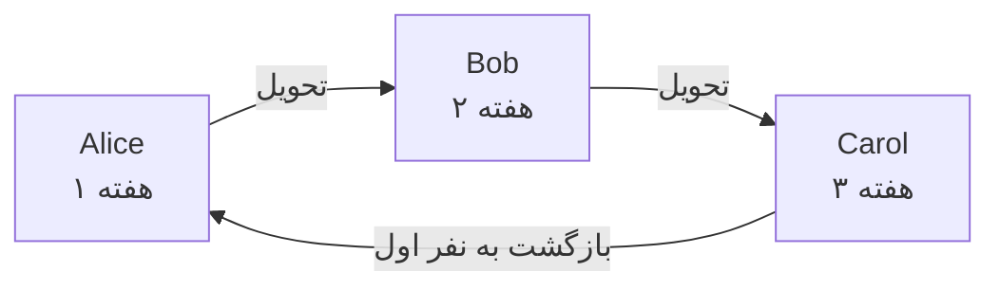
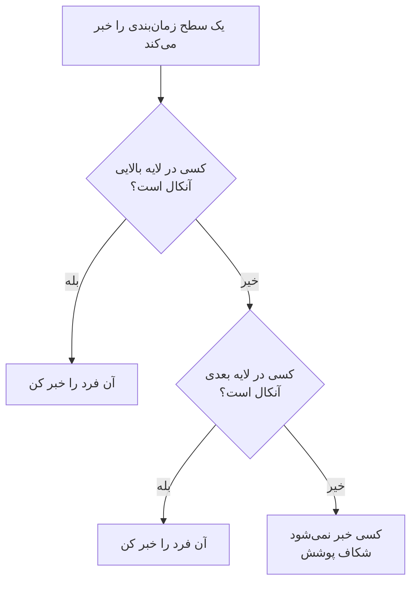

# زمان‌بندی‌های آنکال

زمان‌بندی آنکال تعیین می‌کند در هر لحظه چه کسی آنکال است. افراد در آن به نوبت آنکال می‌شوند: هرکدام مدتی آنکال است، سپس نفر بعدی جای او را می‌گیرد. یک زمان‌بندی را به قواعد تشدید یک سیاست آنکال اضافه کنید، و سیاست وقتی آن سطح اجرا می‌شود هر کسی را که در آن آنکال است خبر می‌کند.

> [!NOTE]
> در OneUptime Cloud، زمان‌بندی‌های آنکال در طرح **Growth** و بالاتر هستند. زمان‌بندی‌ای که پروژه هنوز دارد، پس از پایان دوره آزمایشی Growth یا پایین آمدن طرح، از راه قواعد تشدیدی که نامش را می‌برند همچنان افرادش را خبر می‌کند. برای همین زیر **Growth**، صفحه **زمان‌بندی‌های آنکال** یادداشت طرح را نشان می‌دهد و زمان‌بندی‌هایی را که هنوز تنظیم شده‌اند زیر آن، جایی که می‌توانید حذفشان کنید. ساختن یا تغییر یک زمان‌بندی به **Growth** نیاز دارد.

:::cards
- [چه کسانی به نوبت آنکال هستند](#چه-کسانی-به-نوبت-آنکال-هستند): یک زمان‌بندی با نخستین چرخشش بسازید.
- [لایه‌ها](#لایهها): چرخش‌ها را روی هم بگذارید، ساعت‌های آنکال را محدود کنید و پوشش پشتیبان اضافه کنید.
- [API و Terraform](#ساختن-زمانبندیها-با-api-یا-terraform): زمان‌بندی‌ها و چرخش‌هایشان را به‌صورت کد بسازید.
:::

## چه کسانی به نوبت آنکال هستند

وقتی در صفحه **زمان‌بندی‌های آنکال** یک زمان‌بندی می‌سازید، فرم **نام** آن و **چه کسانی به نوبت آنکال هستند؟** را می‌پرسد. افرادی که انتخاب می‌کنید نخستین لایه زمان‌بندی، یعنی **Layer 1**، می‌شوند که شبانه‌روزی آنکال است.

:::steps
1. به **کشیک آنکال** > **زمان‌بندی‌های آنکال** بروید و روی **ساخت زمان‌بندی آنکال** کلیک کنید.
2. یک **نام** وارد کنید.
3. زیر **چه کسانی به نوبت آنکال هستند؟** روی **افزودن کاربر** کلیک کنید و افراد را به همان ترتیبی که نوبت می‌گیرند انتخاب کنید.
4. در صورت نیاز **فیلدهای بیشتر** را باز کنید تا مدت هر نوبت، منطقه زمانی، توضیحات یا برچسب‌ها را تغییر دهید.
5. روی **ساخت زمان‌بندی آنکال** کلیک کنید. زمان‌بندی تازه سپس در صفحه **لایه‌ها** خود باز می‌شود، جایی که می‌توانید چرخش را تغییر دهید یا لایه‌های بیشتری اضافه کنید.
:::

افراد یکی‌یکی نوبت می‌گیرند، و نخستین نفر به محض ساخته شدن زمان‌بندی آنکال می‌شود:



**چه کسانی به نوبت آنکال هستند؟** اختیاری است. اگر آن را خالی بگذارید، زمان‌بندی بدون لایه شروع می‌شود: تا وقتی در صفحه **لایه‌ها** آن لایه‌ای اضافه نکنید، کسی را آنکال نمی‌کند. این پرسش فقط از کسانی پرسیده می‌شود که می‌توانند لایه اضافه کنند.

همه چیزهای دیگر زیر **فیلدهای بیشتر** هستند که تا بازش نکنید جمع‌شده می‌ماند:

| فیلد | چه می‌کند |
| --- | --- |
| **مدت هر نوبت** | **۱ روز**، **۱ هفته**، **۲ هفته** یا **۱ ماه**، و اگر تغییرش ندهید **۱ هفته**. وقتی کسی نوبت بگیرد پرسیده می‌شود. هر فرد همین مدت آنکال است، سپس نفر بعدی در همان ساعتی از روز که زمان‌بندی ساخته شد جای او را می‌گیرد. |
| **منطقه زمانی** | منطقه زمانی‌ای که زمان‌های تحویل و ساعت‌های آنکال در آن نگه داشته می‌شوند. از منطقه زمانی شما شروع می‌شود. |
| **توضیحات** | یادداشت‌هایی درباره زمان‌بندی. |
| **برچسب‌ها** | برچسب‌هایی برای پیدا کردن و گروه‌بندی زمان‌بندی. |

تا وقتی کسی نوبت می‌گیرد و چیزی زیر **فیلدهای بیشتر** تغییر نکرده، سرتیتر جمع‌شده آن می‌گوید چه خواهد شد: هر فرد یک هفته آنکال است، سپس نفر بعدی جای او را می‌گیرد.

## لایه‌ها

چرخش یک زمان‌بندی از لایه‌هایی در صفحه **لایه‌ها** آن ساخته می‌شود. لایه‌ها از بالا به پایین خوانده می‌شوند: بالاترین لایه‌ای که کسی در آن آنکال است همان است که خبر می‌کند، پس چرخش اصلی را بالا بگذارید و پوشش پشتیبان را زیر آن.



**افزودن لایه** لایه‌ای اضافه می‌کند که مثل لایه نخست شروع می‌شود: آنکال از همین حالا، هر فرد یک هفته، شبانه‌روزی. یک لایه را باز کنید تا افرادی به آن اضافه کنید، و تغییر دهید کی شروع می‌شود، هر چند وقت یک بار تحویل می‌دهد، نخستین تحویلش کی است و در چه ساعت‌هایی آنکال است:

| فیلد | چه چیزی را تنظیم می‌کند |
| --- | --- |
| **Layer name** | آنچه لایه پوشش می‌دهد، مثلاً «اصلی روزهای کاری». |
| **Rotation starts at** | تاریخ و ساعتی که چرخش لایه آغاز می‌شود. |
| **Rotate every** | هر چند وقت یک بار آنکالی به نفر بعدی لایه می‌رسد. |
| **First hand-off time** | نخستین تحویل به نفر بعدی، در لحظه شروع یا پس از آن. تحویل‌های بعدی در هر بازه چرخش انجام می‌شوند. |
| **Restrictions** | ساعت‌هایی که لایه آنکال است: **بدون محدودیت**، **زمان‌های مشخصی از روز** یا **زمان‌های مشخصی از هفته**، در منطقه زمانی زمان‌بندی. بیرون از آن‌ها لایه‌های پایین‌تر جای آن را می‌گیرند. |

برای تغییر اینکه کدام لایه اول بیاید، از **Move layer up (higher priority)** یا **Move layer down (lower priority)** در منوی یک لایه استفاده کنید.

هر فرد همه‌جا یک رنگ را نگه می‌دارد تا بتوانید با یک نگاه دنبالش کنید: در هر لایه، در زمان‌بندی نهایی و بازنویسی‌هایش، و در **خط زمانی زمان‌بندی‌ها**.

## ساختن زمان‌بندی‌ها با API یا Terraform

زمان‌بندی‌های آنکال منبع `/api/on-call-duty-policy-schedule` هستند؛ لایه‌هایشان و افراد درون آن‌ها منابع `/api/on-call-duty-schedule-layer` و `/api/on-call-duty-schedule-layer-user` هستند.

- ساختن یک زمان‌بندی با `firstLayerUsers` (فهرستی از شناسه‌های کاربر، به ترتیبی که نوبت می‌گیرند) در `miscDataProps` آن، مثل داشبورد نخستین لایه‌اش را به آن می‌دهد: **Layer 1**، آنکال از همین حالا، شبانه‌روزی. `firstLayerRotation` می‌گوید هر نوبت چه مدت طول می‌کشد، به‌صورت چرخشی مثل `{"_type": "Recurring", "value": {"intervalType": "Week", "intervalCount": 1}}`؛ بدون آن، یک هفته. هر کاربر باید عضو پروژه باشد و فراخوان باید اجازه ساختن لایه داشته باشد، وگرنه زمان‌بندی ساخته نمی‌شود.
- زمان‌بندی‌ای که بدون آن‌ها ساخته شود، مثل قبل هیچ لایه‌ای ندارد؛ منبع زمان‌بندی Terraform آن‌ها را نمی‌فرستد.
- لایه‌ای که بدون `rotation` ساخته شود، مثل همیشه هر روز تحویل می‌دهد.

```bash
curl -X POST https://oneuptime.com/api/on-call-duty-policy-schedule \
  -H "apikey: $ONEUPTIME_API_KEY" \
  -H "Content-Type: application/json" \
  -d '{
    "data": {
      "projectId": "<project-id>",
      "name": "Primary on-call",
      "timezone": "Europe/Berlin"
    },
    "miscDataProps": {
      "firstLayerUsers": ["<user-id-1>", "<user-id-2>", "<user-id-3>"],
      "firstLayerRotation": {"_type": "Recurring", "value": {"intervalType": "Week", "intervalCount": 1}}
    }
  }'
```

## گام‌های بعدی

:::cards
- [قواعد تشدید](/docs/on-call/escalation-rules): این زمان‌بندی را از یک سطح سیاست آنکال خبر کنید.
- [خط زمانی زمان‌بندی‌ها](/docs/on-call/schedule-timeline): همه زمان‌بندی‌ها را کنار هم، با شکاف‌های پوشش، ببینید.
- [فیدهای تقویم](/docs/on-call/calendar-feeds): نوبت‌ها را در Google Calendar، Outlook یا تقویم Apple بگذارید.
:::
