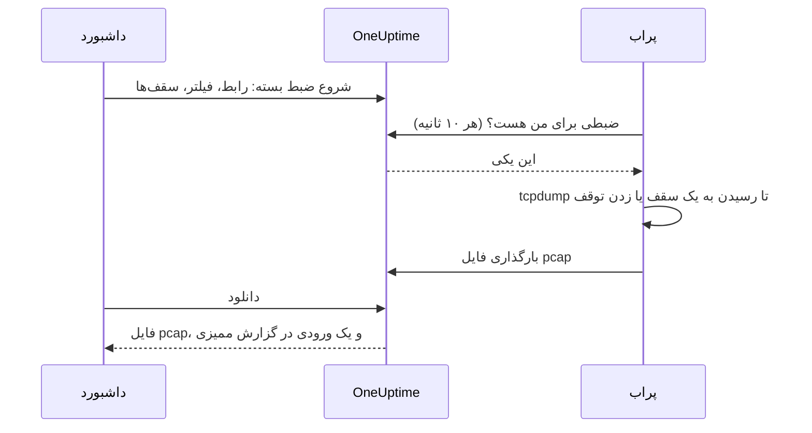

# ضبط بسته

ترافیکی را که یکی از پراب‌هایتان می‌بیند، مستقیم از داشبورد ضبط کنید و فایل را در Wireshark باز کنید. پراب از پیش در همان شبکه‌ای است که در آن عیب‌یابی می‌کنید: نه VPN باید باز کنید و نه باید به jump host وارد شوید.

ضبط روی هر پرابی خاموش است تا کسی که پراب را اجرا می‌کند آن را روشن کند، و فقط روی پراب‌های خودِ پروژهٔ شما اجرا می‌شود.

:::cards
- [چگونه کار می‌کند](#چگونه-کار-میکند): از شروع ضبط بسته تا فایلی در Wireshark.
- [روشن کردن ضبط بسته](#روشن-کردن-ضبط-بسته): آنچه کسی که پراب را اجرا می‌کند برای Docker، Docker Compose و Kubernetes تنظیم می‌کند.
- [شروع یک ضبط](#شروع-یک-ضبط): یک رابط را انتخاب کنید، ضبط را به آنچه لازم دارید محدود کنید و فایل را دانلود کنید.
- [مرجع](#مرجع): سقف‌ها، فیلترها، دسترسی‌ها، گزارش ممیزی و مدت نگهداری فایل‌ها.
- [عیب‌یابی](#عیبیابی): پیام یک ضبط ناموفق چه معنایی دارد.
:::

## چگونه کار می‌کند



1. **شروع.** کسی که اجازهٔ شروع ضبط دارد، رابط پراب، یک فیلتر و سقف‌ها را انتخاب می‌کند و روی **شروع ضبط** کلیک می‌کند. OneUptime پیش از ذخیرهٔ ضبط، فیلتر و سقف‌ها را با آنچه پراب اجازه می‌دهد می‌سنجد.
2. **برداشتن.** پراب هر ده ثانیه از OneUptime کار می‌خواهد، همان‌طور که مانیتورها را می‌خواهد. ضبط را برمی‌دارد و `tcpdump` را اجرا می‌کند.
3. **ضبط.** ضبط در نخستین سقفی که به آن برسد متوقف می‌شود: مدت، سقف بسته‌ها یا اندازهٔ فایل. **توقف** آن را زودتر تمام می‌کند و آنچه را ضبط شده نگه می‌دارد.
4. **بارگذاری.** پراب فایل pcap را بارگذاری می‌کند. OneUptime آن را به‌عنوان فایل خصوصی پروژه نگه می‌دارد.
5. **دانلود.** ضبط **تکمیل‌شده** را با دکمهٔ **دانلود** نشان می‌دهد. فایل در Wireshark، tcpdump یا هر ابزار دیگری که فایل pcap می‌خواند باز می‌شود.

## پیش از شروع

- **یکی از پراب‌های خودِ پروژه‌تان.** پراب‌های سراسری ترافیک پروژه‌های دیگر را هم جابه‌جا می‌کنند، پس هرگز ضبط نمی‌کنند. برای نصب پراب خودتان، [پراب‌های سفارشی](/docs/probe/custom-probe) را ببینید.
- **پرابی از این نسخه یا جدیدتر.** پراب‌های قدیمی‌تر گزارش نمی‌دهند روی چه چیزی می‌توانند ضبط کنند.
- **دسترسی‌های درست.** شروع و توقف ضبط به **Start Packet Capture** نیاز دارد و دانلود فایل به **Download Packet Capture**. مالکان و مدیران پروژه هر دو را دارند. [دسترسی‌ها](#دسترسیها) را ببینید.
- **یک پورت آینه‌شده، برای ترافیکی که به پراب نمی‌رسد.** پراب فقط ترافیک روی رابط‌های میزبان خودش را می‌بیند. برای ضبط ترافیک میان دستگاه‌های دیگر، پورت سوییچ آن‌ها را (با SPAN) روی یک رابط آزاد میزبان پراب آینه کنید.

## روشن کردن ضبط بسته

کسی که پراب را اجرا می‌کند، ضبط را همان جایی روشن می‌کند که پراب اجرا می‌شود: داشبورد عمداً نمی‌تواند این کار را بکند. پراب به سه چیز نیاز دارد:

| تنظیم | چرا |
| --- | --- |
| `PROBE_PACKET_CAPTURE_ENABLED=true` | ضبط را روشن می‌کند. هر مقدار دیگر، یا نبودِ مقدار، آن را خاموش نگه می‌دارد. |
| شبکهٔ میزبان | به پراب اجازه می‌دهد رابط‌های خودِ میزبان و یک پورت آینه‌شده را ببیند. بدون آن، پراب فقط شبکهٔ کانتینرش را می‌بیند. |
| قابلیت `NET_RAW` | به tcpdump اجازهٔ ضبط می‌دهد. Docker آن را به‌طور پیش‌فرض می‌دهد. استاندارد Pod Security با سطح restricted در Kubernetes آن را حذف می‌کند، پس آن را اضافه کنید. |

:::tabs
@tab Docker
```bash
docker run --name oneuptime-probe --network host \
  --cap-add NET_RAW \
  -e PROBE_KEY=<probe-key> \
  -e PROBE_ID=<probe-id> \
  -e ONEUPTIME_URL=https://oneuptime.com \
  -e PROBE_PACKET_CAPTURE_ENABLED=true \
  -d oneuptime/probe:release
```
@tab Docker Compose
```yaml
services:
  oneuptime-probe:
    image: oneuptime/probe:release
    container_name: oneuptime-probe
    network_mode: host
    cap_add:
      - NET_RAW
    environment:
      - PROBE_KEY=<probe-key>
      - PROBE_ID=<probe-id>
      - ONEUPTIME_URL=https://oneuptime.com
      - PROBE_PACKET_CAPTURE_ENABLED=true
    restart: always
```
@tab Kubernetes
```yaml
apiVersion: apps/v1
kind: Deployment
metadata:
  name: oneuptime-probe
spec:
  selector:
    matchLabels:
      app: oneuptime-probe
  template:
    metadata:
      labels:
        app: oneuptime-probe
    spec:
      hostNetwork: true
      dnsPolicy: ClusterFirstWithHostNet
      containers:
        - name: oneuptime-probe
          image: oneuptime/probe:release
          securityContext:
            capabilities:
              add: ["NET_RAW"]
          env:
            - name: PROBE_KEY
              value: "<probe-key>"
            - name: PROBE_ID
              value: "<probe-id>"
            - name: ONEUPTIME_URL
              value: "https://oneuptime.com"
            - name: PROBE_PACKET_CAPTURE_ENABLED
              value: "true"
```
:::

وقتی پراب شروع به کار می‌کند، در گزارشش می‌نویسد `Packet capture is on: captures of up to 30 minutes and 25 MB can be started on this probe from the dashboard.` ظرف یک دقیقه، صفحهٔ پراب در داشبورد **شروع ضبط بسته** را پیشنهاد می‌کند.

برای اینکه روی این پراب سقفی پایین‌تر از سقفی بگذارید که همهٔ پراب‌ها رعایت می‌کنند، یکی از این‌ها را اضافه کنید:

| متغیر | پیش‌فرض | چه می‌کند |
| --- | --- | --- |
| `PROBE_PACKET_CAPTURE_MAX_DURATION_IN_SECONDS` | `1800` | طولانی‌ترین ضبطی که این پراب اجرا می‌کند، از ۵ تا ۱۸۰۰ ثانیه. |
| `PROBE_PACKET_CAPTURE_MAX_FILE_SIZE_IN_MB` | `25` | بزرگ‌ترین فایل ضبطی که این پراب می‌سازد، از ۱ تا ۲۵ مگابایت. |

> [!NOTE]
> پراب‌هایی که همراه نصب خودمیزبان OneUptime، با Docker Compose یا Helm chart، می‌آیند پراب‌های سراسری‌اند، پس هرگز ضبط نمی‌کنند. یک پراب سفارشی در شبکه‌ای که می‌خواهید در آن ضبط کنید اجرا کنید.

## شروع یک ضبط

:::steps
### پراب یا دستگاه را باز کنید

‏**مانیتورها → تنظیمات → پراب‌ها** را باز کنید و روی پراب خود کلیک کنید: کارت **ضبط‌های بسته** آن، ضبط‌هایش را نشان می‌دهد. یا یک دستگاه شبکه را باز کنید و به صفحهٔ **Traffic** آن بروید: ضبط‌های آنجا روی پراب خودِ دستگاه اجرا می‌شوند و با فیلتری روی نشانی دستگاه شروع می‌شوند.

### روی شروع ضبط بسته کلیک کنید

فرم پیش از آنکه ضبطی را شروع کنید می‌گوید ضبط چه چیزی را در بر دارد: گذرواژه‌ها، توکن‌ها و داده‌های شخصی که از شبکه می‌گذرند، در فایل می‌مانند.

### رابط را انتخاب کنید

‏**همهٔ رابط‌ها (any)** روی همهٔ رابط‌های پراب ضبط می‌کند. وقتی ترافیک آینه‌شده را ضبط می‌کنید، رابطی را انتخاب کنید که سوییچ ترافیک را روی آن آینه می‌کند.

### انتخاب کنید کدام بسته‌ها

‏**میزبان یا شبکه**، **پورت** و **پروتکل** را پر کنید تا ضبط را محدود کنید، یا آن‌ها را خالی بگذارید تا همهٔ بسته‌ها نگه داشته شوند. فرم فیلتری را که از آن‌ها ساخته می‌شود نشان می‌دهد، مثلاً `host 10.0.0.5 and tcp port 443`. برای نوشتن فیلتر خودتان روی **به‌جای آن یک فیلتر BPF بنویسید** کلیک کنید.

### سقف‌ها را بررسی کنید

‏**فیلدهای بیشتر** شامل **مدت**، **سقف بسته‌ها** و **سقف اندازهٔ فایل (MB)** است. خلاصهٔ آن می‌گوید ضبط کی متوقف می‌شود: `پس از ۱ دقیقه، ۱۰۰٬۰۰۰ بسته یا ۱۰ مگابایت، هر کدام زودتر برسد، متوقف می‌شود.`

### روی شروع ضبط کلیک کنید

ضبط تا وقتی پراب آن را بردارد **در انتظار** را نشان می‌دهد، سپس **در حال اجرا** را همراه با میزان پیشرفتش. برای تمام کردن زودتر آن روی **توقف** کلیک کنید.
:::

وقتی ضبط **تکمیل‌شده** را نشان داد، روی **دانلود** کلیک کنید و فایل `.pcap` را در Wireshark باز کنید. ضبطی روی **همهٔ رابط‌ها (any)** یک Linux cooked capture است که Wireshark آن را مانند هر ضبط دیگری می‌خواند.

## مرجع

### سقف‌ها

| سقف | پیش‌فرض | بازه |
| --- | --- | --- |
| مدت | ۱ دقیقه | ۵ ثانیه تا ۳۰ دقیقه |
| سقف بسته‌ها | ۱۰۰٬۰۰۰ | ۱ تا ۱٬۰۰۰٬۰۰۰ |
| سقف اندازهٔ فایل | ۱۰ مگابایت | ۱ تا ۲۵ مگابایت |

- ضبط در نخستین سقفی که به آن برسد متوقف می‌شود. فایلی که به سقف اندازه‌اش برسد، پس از آخرین بستهٔ کامل بریده می‌شود، پس همیشه باز می‌شود.
- هر پراب حداکثر ۲ ضبط را هم‌زمان اجرا می‌کند.
- ضبطی که پراب ظرف ۵ دقیقه برندارد، ناموفق می‌شود و این را می‌گوید.
- پراب هر ضبط را دوباره به این سقف‌ها، و به سقف‌های پایین‌تر خودش، محدود می‌کند.

### فیلترها

فیلدهای فرم یک [فیلتر BPF](https://www.tcpdump.org/manpages/pcap-filter.7.html) می‌سازند، یعنی زبان فیلتر ضبط در tcpdump و Wireshark:

| میزبان یا شبکه | پورت | پروتکل | فیلتر |
| --- | --- | --- | --- |
| `10.0.0.5` | | هر پروتکلی | `host 10.0.0.5` |
| `10.0.0.0/24` | `443` | TCP | `net 10.0.0.0/24 and tcp port 443` |
| | `5060` | UDP | `udp port 5060` |
| | `8000-8080` | هر پروتکلی | `portrange 8000-8080` |
| `10.0.0.5` | | ICMP | `host 10.0.0.5 and (icmp or icmp6)` |

فیلتری که خودتان می‌نویسید یک خط با حداکثر ۵۰۰ نویسه است، ساخته از حروف، اعداد، فاصله و `. : / ( ) [ ] ! & | < > = + - * % ^ _`. OneUptime پیش از ذخیره آن را بررسی می‌کند و tcpdump آن را روی پراب کامپایل می‌کند. پراب آن را به‌صورت یک آرگومان به tcpdump می‌دهد، هرگز از طریق shell.

### دسترسی‌ها

| دسترسی | به کسی اجازه می‌دهد | چه کسی به‌طور پیش‌فرض دارد |
| --- | --- | --- |
| **Start Packet Capture** | ضبط‌ها را شروع و متوقف کند | Project Owner, Project Admin |
| **Download Packet Capture** | فایل‌های ضبط را دانلود کند | Project Owner, Project Admin |
| **Delete Packet Capture** | ضبط‌ها و فایل‌هایشان را حذف کند | Project Owner, Project Admin |
| **Read Packet Capture** | ضبط‌ها را ببیند: کی اجرا شدند، روی کدام پراب و با کدام فیلتر | Project Owner, Project Admin, Project Member, Viewer |

برای دادن **Start Packet Capture** یا **Download Packet Capture** به یک تیم، آن را زیر **تنظیمات → تیم‌ها** باز کنید و دسترسی را در صفحهٔ **دسترسی‌ها** آن اضافه کنید. [دسترسی‌ها](/docs/permissions/index) را ببینید.

### گزارش ممیزی و حریم خصوصی

- شروع یک ضبط در گزارش ممیزی به‌صورت **Create** از **Packet Capture** ثبت می‌شود، و حذف آن به‌صورت **Delete**. هر دانلود به‌صورت **Download** ثبت می‌شود، همراه با اینکه چه کسی کدام ضبط را دانلود کرد.
- فایل یک فایل خصوصی پروژه است. فقط دکمهٔ **دانلود**، با **Download Packet Capture**، آن را تحویل می‌دهد.
- ضبط‌ها و فایل‌هایشان ۷ روز پس از شروع حذف می‌شوند. حذف یک ضبط، فایلش را بی‌درنگ حذف می‌کند.

## عیب‌یابی

:::details «ضبط بسته روی این پراب خاموش است»
پراب بدون `PROBE_PACKET_CAPTURE_ENABLED=true` اجرا می‌شود. آن را با تنظیمات بخش [روشن کردن ضبط بسته](#روشن-کردن-ضبط-بسته) دوباره راه‌اندازی کنید.
:::

:::details "The probe is not allowed to capture packets on eth0"
tcpdump نتوانست رابط را باز کند. به کانتینر پراب قابلیت `NET_RAW` را بدهید: `--cap-add NET_RAW` در Docker، `cap_add` در Docker Compose و `securityContext.capabilities.add` در Kubernetes.
:::

:::details "The interface does not exist on the probe"
رابط از زمانی که پراب آخرین بار گزارشش کرد از بین رفته است، یا پراب بدون شبکهٔ میزبان اجرا می‌شود و فقط رابط‌های کانتینرش را می‌بیند. آن را با شبکهٔ میزبان اجرا کنید و سپس رابط را دوباره انتخاب کنید.
:::

:::details "tcpdump could not use the filter"
tcpdump نتوانست فیلتر را کامپایل کند. پیام شامل واژه‌های خودِ tcpdump است، مثلاً `syntax error`. فیلتر را با [راهنمای pcap-filter](https://www.tcpdump.org/manpages/pcap-filter.7.html) بررسی کنید.
:::

:::details "The probe did not pick up this capture within 5 minutes"
پراب قطع است، یا پس از شروع ضبط، ضبط بسته روی آن خاموش شد. **وضعیت اتصال** پراب و گزارش آن را بررسی کنید.
:::

:::details «هیچ بسته‌ای با فیلتر مطابقت نداشت.»
ضبط اجرا شد و هیچ چیز روی رابط با فیلتر مطابقت نداشت. بررسی کنید که ترافیک از این رابط می‌گذرد: ترافیک میان دستگاه‌های دیگر فقط از راه یک پورت آینه‌شده به پراب می‌رسد.
:::

:::details "This probe is already running 2 packet captures"
هر پراب ۲ ضبط را هم‌زمان اجرا می‌کند. صبر کنید تا یکی تمام شود، یا یکی را متوقف کنید، و ضبط خود را دوباره شروع کنید.
:::

## گام‌های بعدی

:::cards
- [پراب‌های سفارشی](/docs/probe/custom-probe): پرابی را در شبکه‌ای که می‌خواهید در آن ضبط کنید نصب کنید.
- [مانیتور دستگاه شبکه](/docs/monitor/network-device-monitor): دستگاه‌هایی را که ترافیکشان را ضبط می‌کنید پایش کنید.
- [دسترسی‌ها](/docs/permissions/index): به یک تیم دسترسی‌های ضبط بسته را بدهید.
:::
