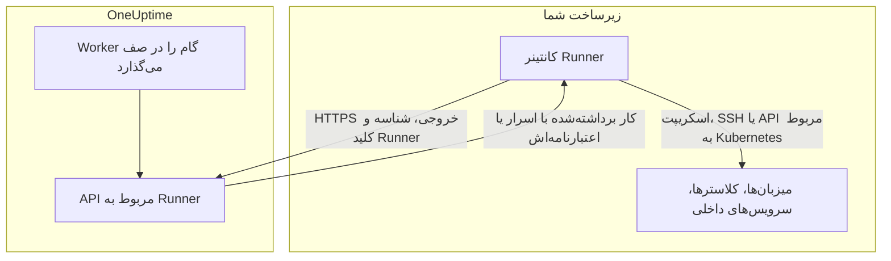
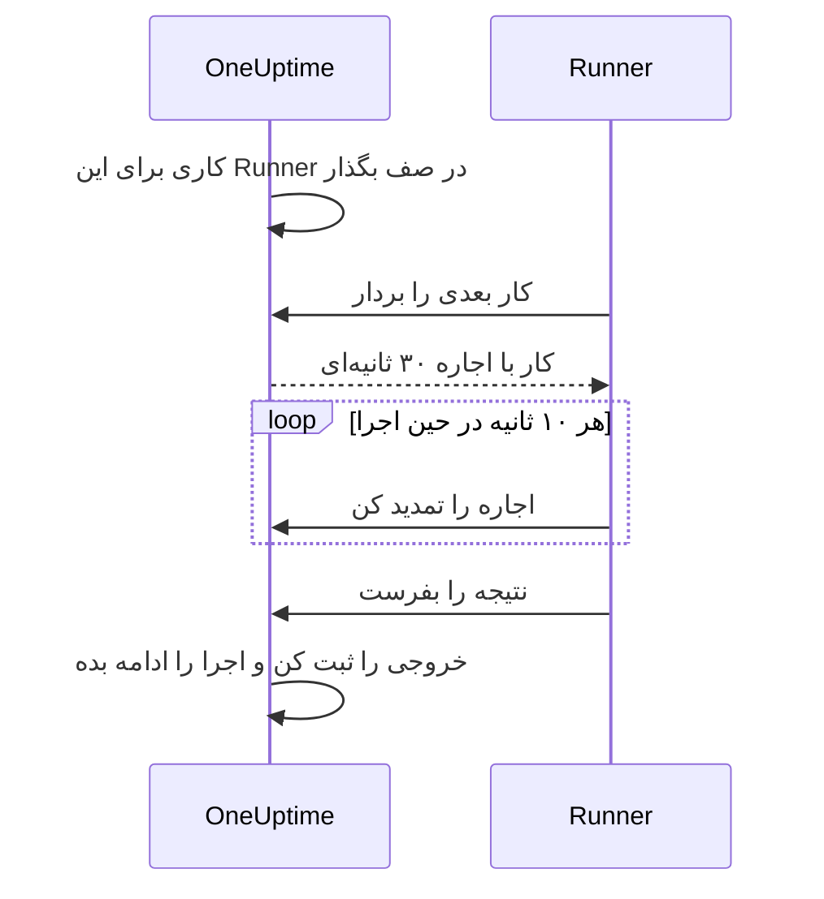

# عامل‌های رانبوک

یک **عامل رانبوک**، که در داشبورد **Runner** نام دارد، پردازه‌ای کوچک و خودمیزبان است که گام‌های JavaScript، Bash، SSH و Kubernetes رانبوک‌هایتان را **در زیرساخت خودتان** اجرا می‌کند. OneUptime Worker هرگز اسکریپت‌هایتان را اجرا نمی‌کند: آن‌ها را در صف می‌گذارد، و Runner‌ای که نویسنده گام انتخاب کرده هر کار را برمی‌دارد، اجرا می‌کند و نتیجه را بازمی‌فرستد. این صفحه برای کسانی است که Runnerها را نصب و اداره می‌کنند.

:::cards
- [نصب یک Runner](#نصب-یک-runner): از داشبورد تا یک کانتینر متصل، در پنج گام.
- [اختصاص یک گام به یک Runner](#اختصاص-یک-گام-به-یک-runner): گام را به Runner‌ای که باید اجرایش کند وصل کنید.
- [مهلت‌ها](#مهلتها): مهلت برداشتن و مهلت اجرا، و اینکه چگونه با هم کار می‌کنند.
- [متغیرهای محیطی](#متغیرهای-محیطی): آنچه کانتینر هنگام راه‌اندازی می‌خواند.
:::

## چگونه کار می‌کند



1. در OneUptime یک Runner می‌سازید. OneUptime برای آن یک شناسه و یک کلید محرمانه تولید می‌کند.
2. کانتینر Runner را روی میزبانی در زیرساخت خودتان با همان شناسه، کلید و URL مربوط به OneUptime خودتان اجرا می‌کنید.
3. Runner هر ۵ ثانیه از OneUptime کار می‌خواهد و هر ۶۰ ثانیه گزارش می‌دهد که زنده است.
4. وقتی یک گام JavaScript، Bash، SSH یا Kubernetes می‌نویسید، Runner را از یک فهرست کشویی انتخاب می‌کنید. گام به آن Runner وصل می‌شود.
5. وقتی گام اجرا می‌شود، Worker کاری را در صف می‌گذارد که `targetAgentId` آن روی همان Runner تنظیم شده است. فقط همان Runner می‌تواند آن را بردارد.
6. Runner کار را به‌صورت محلی اجرا می‌کند — `bash -c <script>` برای Bash، یک سندباکس `isolated-vm` برای JavaScript، یک اتصال SSH یا فراخوانی سرور API کلاستر با اعتبارنامه گام — نتیجه را ثبت می‌کند و بازمی‌فرستد. Worker رانبوک را با آن نتیجه ادامه می‌دهد.

Runner فقط به **HTTPS خروجی** به نمونه OneUptime شما نیاز دارد. هیچ اتصال ورودی‌ای نمی‌پذیرد.

یک Runner فقط شناسه و کلید خودش را دارد. هر چیز دیگری را همراه کاری که برمی‌دارد دریافت می‌کند: اسکریپتی با [اسرار رانبوک](/docs/runbooks/credentials#اسرار-برای-اسکریپتها) اختصاص‌یافته به آن که جایگذاری شده‌اند، یا [اعتبارنامه‌ای](/docs/runbooks/credentials) که یک گام SSH یا Kubernetes نامش را می‌برد. بنابراین هر کسی که کلید یک Runner را داشته باشد می‌تواند به‌جای آن Runner عمل کند: با کلید همان رفتاری را داشته باشید که با اعتبارنامه‌های اختصاص‌یافته به آن دارید.

## چرا اسکریپت‌ها روی Runner اجرا می‌شوند

اجرای اسکریپت‌ها روی OneUptime Worker دو مشکل داشت:

- **مرز اعتماد.** هر کسی که می‌توانست رانبوک بنویسد می‌توانست روی Worker کد اجرا کند، با دسترسی به هر چیزی که Worker به آن می‌رسید.
- **دسترس‌پذیری.** بیشتر گام‌های مفید روی زیرساخت _شما_ کار می‌کنند («این سرویس را دوباره راه‌اندازی کن»، «رکوردی را در پایگاه داده داخلی ما پیدا کن»)، نه روی زیرساخت OneUptime.

با Runnerها این گام‌ها روی میزبانی اجرا می‌شوند که شما کنترلش می‌کنید، و شما تعیین می‌کنید آن میزبان اجازه چه کاری دارد. گام‌های درخواست HTTP و AI همچنان روی Worker اجرا می‌شوند، چون به چیزی از شبکه شما نیاز ندارند.

## پیش از شروع

- **میزبانی با Docker** در زیرساخت شما که بتواند از راه HTTPS به URL مربوط به OneUptime شما و به سیستم‌هایی که گام‌هایتان رویشان کار می‌کنند برسد.
- **نقشی که Runner می‌سازد.** Project Owner، Project Admin، Project Member و Runbook Admin می‌توانند Runner بسازند. فقط Project Owner، Project Admin یا Runbook Admin می‌توانند کلید یک Runner را که دستور راه‌اندازی شامل آن است ببینند.

## نصب یک Runner

### 1. رکورد عامل را بسازید

به **رانبوک‌ها → Runnerها** بروید و یک عامل تازه بسازید. روی **ساخت Runner** کلیک کنید و دو گام را پر کنید:

| فیلد | گام | یادداشت |
| --- | --- | --- |
| **نام** | **Runner** | نامی خوانا، معمولاً اینکه کجا اجرا می‌شود و به چه چیزی می‌رسد، مثلاً `prod-eu-west-1`. هنگام نوشتن یک گام همین را انتخاب می‌کنید. |
| **توضیحات** | **Runner** | اختیاری. جمله‌ای درباره اینکه این میزبان به چه چیزی می‌رسد. |
| **برچسب‌ها** | **Runner** (زیر **فیلدهای بیشتر**) | اختیاری. |
| **رانبوک‌ها را اجرا می‌کند** | **قابلیت‌ها** | به‌طور پیش‌فرض روشن. اجازه می‌دهد این Runner گام‌های رانبوک را بردارد. |
| **اصلاح کد با هوش مصنوعی را اجرا می‌کند** | **قابلیت‌ها** | به‌طور پیش‌فرض خاموش. اجازه می‌دهد pull request‌های اصلاح کد با هوش مصنوعی باز کند؛ [Fix Tasks](/docs/ai/ai-agent) را ببینید. |
| **دستورهای رفع مشکل با هوش مصنوعی را اجرا می‌کند** | **قابلیت‌ها** | به‌طور پیش‌فرض خاموش. اجازه می‌دهد رفع خودکار مشکل با هوش مصنوعی دستورهای بررسی‌شده با سیاست را روی آن اجرا کند. روشن کردن آن برای Runner‌ای که اعتبارنامه SSH دارد به مجوز خواندن اعتبارنامه‌های رانبوک نیاز دارد؛ [Runnerهایی که دستورهای OneUptime AI را اجرا می‌کنند](/docs/runbooks/credentials#runnerهایی-که-دستورهای-oneuptime-ai-را-اجرا-میکنند) را ببینید. |

Runner تغییر قابلیت‌هایش را در heartbeat بعدی دریافت می‌کند؛ لازم نیست دوباره راه‌اندازی شود.

### 2. دستور نصب را کپی کنید

در ردیف Runner روی **نمایش دستورالعمل‌های راه‌اندازی** کلیک کنید. پنجره **راه‌اندازی Runner** یک دستور `docker run` نشان می‌دهد که شناسه و کلید این Runner از قبل در آن هست. همین دستور در صفحه خود Runner زیر **دستورالعمل‌های راه‌اندازی** هم هست.

فقط Project Owner، Project Admin یا Runbook Admin می‌توانند کلید را بخوانند. دیگران به‌جای دستور «اجازه مشاهده کلید این Runner را ندارید» را می‌بینند.

### 3. آن را روی میزبانی در زیرساخت خودتان اجرا کنید

دستور را روی میزبانی در محیط خودتان اجرا کنید که بتواند:

- از راه HTTPS به نمونه OneUptime شما برسد، و
- آنچه گام‌هایتان نیاز دارند انجام دهد، مثلاً از راه SSH به میزبان‌های دیگر برسد، سرور API یک کلاستر را فرا بخواند یا با یک پایگاه داده حرف بزند.

```bash
docker run --name oneuptime-runner --restart unless-stopped \
  -e ONEUPTIME_RUNNER_ID=<runner-id> \
  -e ONEUPTIME_RUNNER_KEY=<runner-key> \
  -e ONEUPTIME_URL=https://oneuptime.yourdomain.com \
  -d oneuptime/runner:release
```

### 4. بررسی کنید که عامل متصل است

به **رانبوک‌ها → Runnerها** برگردید. ظرف یک دقیقه پس از شروع کانتینر، **وضعیت** Runner باید **متصل** را با یک **آخرین مشاهده** تازه نشان دهد. در صفحه خود Runner، کارت **وضعیت Runner** مقدار **نسخه Runner** و **میزبان** آن را نشان می‌دهد. اگر همچنان **هرگز متصل نشده** یا **قطع‌شده** را نشان دهد، [عیب‌یابی](#عیبیابی) را ببینید.

### 5. عامل را به‌روز نگه دارید

وقتی یک عامل نسخه‌ای قدیمی‌تر از OneUptime شما را اجرا می‌کند، در صفحه‌اش کنار **نسخه Runner** آن یک نشان هشدار نمایش داده می‌شود. آن را انتخاب کنید تا روش ارتقا را ببینید: ایمیج تازه را pull کنید، کانتینر را حذف کنید، سپس دستور نصب گام ۲ را دوباره اجرا کنید. عاملی که chart عامل Kubernetes نصب کرده، به‌جای این با همان chart ارتقا می‌یابد.

```bash
docker pull oneuptime/runner:release
docker rm -f oneuptime-runner
```

## اختصاص یک گام به یک Runner

:::steps
### گامی اضافه کنید که روی یک Runner اجرا می‌شود

در صفحه **گام‌ها** در رانبوکتان یک گام JavaScript، Bash، SSH یا Kubernetes اضافه کنید.

### Runner را انتخاب کنید

فهرست کشویی **Runner** در گام همه Runnerهای پروژه را نشان می‌دهد و اینکه متصل‌اند یا نه. اگر پروژه هنوز Runner ندارد، گام همین را می‌گوید و شما را به **Runbooks › Runners** راهنمایی می‌کند.

### گام‌ها را ذخیره کنید

روی **Save Steps** کلیک کنید. وقتی اجرایی به این گام می‌رسد، Worker کاری را برای شناسه آن Runner در صف می‌گذارد، و فقط همان Runner می‌تواند آن را بردارد.
:::

Bash با `bash -c` اجرا می‌شود. JavaScript در یک سندباکس `isolated-vm` روی Runner اجرا می‌شود، بدون دسترسی به سیستم فایل یا پردازه‌ها؛ می‌تواند با `axios` APIهای HTTP عمومی را فرا بخواند، اما نشانی‌های یک شبکه خصوصی را نه. گام‌های SSH و Kubernetes از [اعتبارنامه‌ای](/docs/runbooks/credentials) استفاده می‌کنند که گام نامش را می‌برد، و آن اعتبارنامه باید به همان Runner اختصاص یافته باشد.

به بیش از یک Runner نیاز دارید؟ آن‌ها را بسازید و هر گام را به Runner درست اختصاص دهید. برای افزونگی، یک Runner اضافه اجرا کنید و گام‌هایتان را بین آن‌ها تقسیم کنید، یا یک رانبوک پشتیبان نگه دارید که گام‌هایش به Runner دیگر اشاره می‌کنند.

## یادداشت‌های عملیاتی

### مهلت‌ها

دو مهلت روی هر گامی که روی یک Runner اجرا می‌شود اعمال می‌شود:

| مهلت | پیش‌فرض | چه چیزی را کنترل می‌کند |
| --- | --- | --- |
| **Claim timeout** | ۲ دقیقه | مدتی که Worker منتظر می‌ماند تا Runner انتخاب‌شده کار را بردارد. اگر Runner به‌موقع برندارد، گام با پایان مهلت شکست می‌خورد و رانبوک ادامه می‌یابد (یا بسته به **ادامه در صورت شکست** متوقف می‌شود). |
| **Execution timeout** | ۳۰ ثانیه | مدتی که Runner پیش از متوقف کردن گام اجازه اجرا به آن می‌دهد. Bash سیگنال `SIGKILL` می‌گیرد؛ سندباکس JavaScript برچیده می‌شود. |

هر دو برای هر گام قابل تنظیم‌اند. **Runbooks › رانبوک شما › گام‌ها** را باز کنید، گام را گسترش دهید و در تنظیماتش **Execution timeout** و **Claim timeout** (بر حسب ثانیه) را تنظیم کنید. برای استفاده از پیش‌فرض، فیلد را خالی بگذارید. هر کدام از ۱ ثانیه تا ۱ ساعت را می‌پذیرد؛ مقدارهای بیرون از این بازه هنگام اجرای گام به درون بازه برده می‌شوند.

پنجره انتظار کل Worker برابر `claim timeout + execution timeout + a few seconds` است. مقدارهایی متناسب با گام انتخاب کنید.

هنگام کم کردن claim timeout دو نکته را به خاطر داشته باشید:

- Runner در هر چرخه polling کار می‌خواهد (`ONEUPTIME_RUNNER_POLL_INTERVAL_MS`، به‌طور پیش‌فرض ۵ ثانیه). claim timeout کوتاه‌تر از یک چرخه ممکن است پیش از آنکه یک Runner کاملاً سالم اصلاً کار را ببیند منقضی شود، و در این صورت گام با همان پیامی شکست می‌خورد که یک Runner آفلاین می‌دهد.
- یک Runner به‌طور پیش‌فرض در هر زمان یک کار اجرا می‌کند (`ONEUPTIME_RUNNER_CONCURRENCY`). تا وقتی یک گام طولانی آن را مشغول کرده، گام‌های دیگری که به همان Runner اشاره می‌کنند تا پایان claim timeout خودشان منتظر می‌مانند. اگر یک execution timeout را تا چند دقیقه بالا می‌برید، claim timeout گام‌هایی را که آن Runner را به اشتراک دارند هم به همان نسبت بالا ببرید، یا Runner دیگری به آن‌ها بدهید.

### اجاره و heartbeat



وقتی یک Runner کاری را برمی‌دارد، یک اجاره کوتاه (به‌طور پیش‌فرض ۳۰ ثانیه) می‌گیرد. در حین اجرای گام، Runner هر ۱۰ ثانیه اجاره را تمدید می‌کند. اگر Runner وسط یک اسکریپت از کار بیفتد یا شبکه‌اش قطع شود، اجاره منقضی می‌شود و Worker به‌جای انتظار بی‌پایان، کار را `TimedOut` علامت می‌زند.

زیرپردازه‌های Bash هنگام انقضای اجاره خودکار لغو **نمی‌شوند** (به سندباکس JavaScript هم، اگر اصلاً تمام شود، اجازه داده می‌شود تمام شود)، اما Worker دیگر منتظرشان نمی‌ماند و Runner پس از آنکه برداشت دیگری جای آن را گرفت نمی‌تواند نتیجه‌ای ثبت کند. اگر اجرای دقیقاً یک‌باره برایتان مهم است، اسکریپت‌ها را طوری طراحی کنید که اجرای دوباره‌شان امن باشد.

### اگر OneUptime Worker وسط یک گام دوباره راه‌اندازی شود

اجرای یک رانبوک از ابتدا تا انتها روی یک Worker انجام می‌شود، پس یک استقرار یا از کار افتادن می‌تواند آن را وسط یک گام قطع کند. آنچه بعد پیش می‌آید به این بستگی دارد که اجرا دوباره برداشته شود یا نه:

- **ادامه می‌یابد.** Worker‌ای که آن را برمی‌دارد کاری را که گام شما از قبل ساخته پیدا می‌کند و **دوباره به آن وصل می‌شود**. به‌جای فرستادن یک رونوشت دیگر از اسکریپت برای Runner شما، منتظر همان کار می‌ماند. اگر Runner از قبل تمام کرده باشد، نتیجه ثبت‌شده همان‌طور به کار می‌رود. یک گام در هر اجرا حداکثر یک بار برای یک Runner فرستاده می‌شود.
- **ادامه نمی‌یابد.** اگر اجرا هرگز دوباره برداشته نشود، یک پاک‌سازی پس از گذشتن آن از پنجره برداشتن و اجرای گام فعلی‌اش، آن را با پیامی که نام گام را می‌برد `Failed` علامت می‌زند. هیچ اجرایی هرگز در `Running` گیر نمی‌ماند.

تنها چیزی که این نمی‌تواند بگوید این است که اسکریپت پیش از ناپدید شدن Worker تا کجا پیش رفته بود. گامی که در میانه اجرا بود با این یادداشت که ممکن است بخشی از آن اجرا شده باشد ناموفق گزارش می‌شود: پیش از اجرای دوباره رانبوک، سامانه هدف را بررسی کنید.

### هیچ عاملی آنلاین نیست

اگر Runner انتخاب‌شده هنگام اجرای گام آفلاین باشد، کار تا گذشتن claim timeout به‌صورت `Pending` منتظر می‌ماند و سپس گام با «No runbook agent picked up this step before the wait window expired.» شکست می‌خورد. صفحه **Runnerها** جایی است که پیش از اجرای جدی یک رانبوک پوشش را بررسی می‌کنید.

### محدودیت خروجی

stdout و stderr روی هم برای هر گام به **۵۰ KB** محدودند. خروجی طولانی‌تر با یک نشانگر بریده می‌شود. اگر به لاگ کامل نیاز دارید، آن را از اسکریپت در انبار لاگ یا انبار اشیای خودتان بنویسید و URL را با `echo` چاپ کنید.

### لغو

لغو اجرای یک رانبوک، از صفحه اجرا یا از API، بی‌درنگ همه کارهای `Pending`، `Claimed` و `Running` آن را `Cancelled` علامت می‌زند. Runner‌ای که از قبل وسط یک اسکریپت است کار را تمام می‌کند، اما سرور نتیجه را نمی‌پذیرد و هیچ گام بعدی رانبوک فرستاده نمی‌شود.

### هم‌زمانی

هر Runner به‌طور پیش‌فرض در هر زمان یک کار اجرا می‌کند. برای اجازه دادن به بیشتر، `ONEUPTIME_RUNNER_CONCURRENCY` را روی کانتینر تنظیم کنید، اما به یاد داشته باشید که Runner میزبان را با هر چیز دیگری که آنجا اجرا می‌شود شریک است.

## متغیرهای محیطی

Runner هنگام راه‌اندازی این‌ها را می‌خواند:

| متغیر | الزامی | پیش‌فرض | یادداشت |
| --- | --- | --- | --- |
| `ONEUPTIME_URL` | بله | — | URL پایه نمونه OneUptime شما، مثلاً `https://oneuptime.yourdomain.com`. |
| `ONEUPTIME_RUNNER_ID` | بله | — | شناسه Runner از دستور راه‌اندازی آن. |
| `ONEUPTIME_RUNNER_KEY` | بله | — | کلید محرمانه Runner از دستور راه‌اندازی آن. |
| `ONEUPTIME_RUNNER_POLL_INTERVAL_MS` | خیر | `5000` | Runner هر چند وقت یک بار کار تازه می‌خواهد. مقدار کمتر از `1000` به پیش‌فرض برمی‌گردد. |
| `ONEUPTIME_RUNNER_HEARTBEAT_INTERVAL_MS` | خیر | `60000` | Runner هر چند وقت یک بار گزارش می‌دهد که زنده است. مقدار کمتر از `5000` به پیش‌فرض برمی‌گردد. |
| `ONEUPTIME_RUNNER_JOB_HEARTBEAT_INTERVAL_MS` | خیر | `10000` | Runner هر چند وقت یک بار اجاره کار در حال اجرا را تمدید می‌کند. مقدار کمتر از `1000` به پیش‌فرض برمی‌گردد. |
| `ONEUPTIME_RUNNER_CONCURRENCY` | خیر | `1` | بیشینه کارهای هم‌زمان روی این Runner. |
| `ONEUPTIME_RUNNER_ENABLE_RUNBOOKS` | خیر | — | آن را `false` بگذارید تا این Runner، هرچه داشبورد بگوید، برداشتن گام‌های رانبوک را متوقف کند. فقط می‌تواند قابلیت را خاموش کند. |
| `ONEUPTIME_RUNNER_ENABLE_CODE_FIXES` | خیر | — | آن را `false` بگذارید تا این Runner، هرچه داشبورد بگوید، برداشتن اصلاح‌های کد با هوش مصنوعی را متوقف کند. |
| `ONEUPTIME_RUNNER_ENABLE_AI_COMMANDS` | خیر | — | آن را `false` بگذارید تا این Runner، هرچه داشبورد بگوید، اجرای دستورهای رفع مشکل با هوش مصنوعی را متوقف کند. |

## چرخاندن کلید عامل

اگر کلیدی نشت کرد، آن را بازنشانی کنید. کلید قدیمی بی‌درنگ از کار می‌افتد.

:::steps
### کلید را بازنشانی کنید

Runner را از **رانبوک‌ها → Runnerها** باز کنید، روی **بازنشانی کلید Runner** کلیک کنید و تأیید کنید. Runner تا وقتی کلید تازه را نداشته باشد دیگر متصل نمی‌شود.

### کانتینر را با کلید تازه اجرا کنید

دستور تازه را از **دستورالعمل‌های راه‌اندازی** Runner کپی کنید، کانتینر قدیمی را حذف کنید و دستور تازه را روی همان میزبان اجرا کنید:

```bash
docker rm -f oneuptime-runner
```

### بررسی کنید که دوباره متصل می‌شود

در **رانبوک‌ها → Runnerها**، **وضعیت** Runner ظرف یک دقیقه دوباره **متصل** می‌شود.
:::

## دسترسی‌ها

مدیریت عامل‌ها در گروه مجوز موجود Runbooks است:

- `CreateRunner`، `EditRunner`، `DeleteRunner`، `ReadRunner` — مدیریت رکوردهای عامل.
- `RunbookAdmin`، `RunbookMember`، `RunbookViewer` (نقش‌ها) — `RunbookAdmin` رانبوک‌ها، قواعدشان و Runnerهایی را که روی آن‌ها اجرا می‌شوند می‌سازد و آن‌ها را اجرا می‌کند. `RunbookMember` رانبوک‌ها و اجراهایشان را باز می‌کند و اجرایشان می‌کند — یک اجرا را شروع می‌کند، گام‌هایش را کامل یا رد می‌کند و لغوش می‌کند — اما هیچ رانبوک یا Runner‌ای را نمی‌سازد، تغییر نمی‌دهد یا حذف نمی‌کند. `RunbookViewer` رانبوک‌ها و اجراهایشان را می‌خواند و چیزی اجرا نمی‌کند. `RunbookAdmin` همه مجوزهای جزئی بالا را در بر می‌گیرد.

فعال کردن یک رانبوک (و در نتیجه فرستادن گام‌هایش به Runnerها) به نقشی نیاز دارد که رانبوک اجرا می‌کند — `ProjectOwner`، `ProjectAdmin`، `ProjectMember`، `RunbookAdmin` یا `RunbookMember` — یا `CreateRunbookExecution`؛ برای کامل کردن، رد کردن یا لغو یک اجرا `EditRunbookExecution` هم پذیرفته است. یک نقش فقط رانبوک‌هایی را اجرا می‌کند که دامنه‌اش به آن‌ها می‌رسد.

کلید یک Runner را فقط Project Owner، Project Admin و Runbook Admin می‌توانند بخوانند.

## API عامل‌ها

برای کنجکاوها: Runner از این endpointها استفاده می‌کند که زیر `/runner-ingest` قرار دارند. مسیر پیش از ادغام، `/runbook-agent-ingest`، همچنان برای عامل‌هایی که هنوز دوباره مستقر نشده‌اند پاسخ داده می‌شود، تا ارتقای سرور آن‌ها را از کار نیندازد. احراز هویت با شناسه و کلید Runner در بدنه JSON (`agentId` و `agentKey`) یا در هدرهای `x-agent-id` و `x-agent-key` انجام می‌شود.

| Endpoint | هدف |
| --- | --- |
| `POST /heartbeat` | نشانه زنده بودن. زمان آخرین مشاهده، نسخه و اطلاعات میزبان Runner را به‌روز می‌کند و قابلیت‌هایی را که پروژه به آن داده برمی‌گرداند. |
| `POST /claim-next-job` | قدیمی‌ترین کار `Pending` را که شناسه این Runner را هدف گرفته به‌صورت اتمی بردار. وقتی کاری نیست `{ job: null }` برمی‌گرداند. |
| `POST /job/:jobId/heartbeat` | اجاره کار را تمدید کن. وقتی اجاره منقضی شده یا کار تمام شده 404 برمی‌گرداند. |
| `POST /job/:jobId/result` | نتیجه نهایی را ثبت کن. اگر اجاره از قبل منتقل شده باشد نادیده گرفته می‌شود. |
| `POST /disconnect` | خروج هنگام خاموش شدن عادی. |

لازم نیست آن‌ها را دستی فرا بخوانید: Runner همراه این کار را می‌کند. این‌ها اینجا مستند شده‌اند تا اگر محدودیتی دارید که عامل ما با آن جور نیست، بتوانید عامل خودتان را بسازید.

## عیب‌یابی

:::details Runner همچنان هرگز متصل نشده یا قطع‌شده را نشان می‌دهد
- لاگ‌های کانتینر را با `docker logs oneuptime-runner` برای خطاهای احراز هویت یا شبکه بررسی کنید.
- بررسی کنید که میزبان به URL مربوط به OneUptime شما می‌رسد، مثلاً با `curl`.
- بررسی کنید که شناسه و کلید بدون فاصله کپی شده‌اند و `ONEUPTIME_URL` همان نشانی‌ای است که OneUptime را با آن باز می‌کنید.

**هرگز متصل نشده** یعنی Runner هرگز گزارش نداده است. **قطع‌شده** یعنی گزارش داده، اما نه در ۵ دقیقه گذشته.
:::

:::details گام‌ها با «No runbook agent picked up this step before the wait window expired.» شکست می‌خورند
Runner گام کار را در مهلت claim timeout خود برنداشت. بررسی کنید که Runner **متصل** است، **رانبوک‌ها را اجرا می‌کند** برایش روشن است و درگیر یک گام طولانی نیست: مگر اینکه `ONEUPTIME_RUNNER_CONCURRENCY` را بالا ببرید، در هر زمان یک کار اجرا می‌کند. claim timeout کوتاه‌تر از بازه polling هم به همین شکل شکست می‌خورد.
:::

:::details گام‌ها با «The runbook agent stopped responding while this step was running.» شکست می‌خورند
Runner کار را برداشت و سپس تمدید اجاره‌اش را متوقف کرد: از کار افتاد، دوباره راه‌اندازی شد یا شبکه‌اش قطع شد. بررسی کنید که آنلاین است، سپس پیش از اجرای دوباره رانبوک، سامانه هدف را بررسی کنید.
:::

:::details Runner در لاگ «No capability is enabled» می‌نویسد
همه قابلیت‌های این Runner خاموش‌اند. در صفحه Runner در OneUptime، **رانبوک‌ها را اجرا می‌کند** را روشن کنید. Runner تغییر را در heartbeat بعدی دریافت می‌کند.
:::

## گام‌های بعدی

:::cards
- [نوشتن یک رانبوک](/docs/runbooks/authoring): گام‌هایی را بنویسید که روی Runner شما اجرا می‌شوند.
- [اعتبارنامه‌های رانبوک](/docs/runbooks/credentials): به گام‌های SSH و Kubernetes دسترسی مدیریت‌شده بدهید.
- [پیکربندی و ایمنی رانبوک](/docs/runbooks/configuration): محدودیت‌ها، دسترسی‌ها و مقاوم‌سازی.
:::
