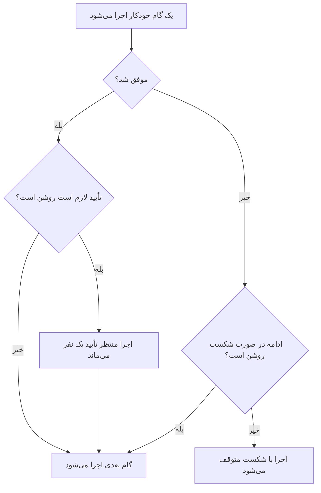

# نوشتن یک رانبوک

رانبوک را به شکل فهرستی مرتب از گام‌ها در صفحه **گام‌ها** می‌نویسید. این صفحه نشان می‌دهد چگونه یک رانبوک بسازید، هر یک از هفت نوع گام را چگونه تنظیم کنید، و شکست‌ها و تأییدها چگونه مسیر یک اجرا را تغییر می‌دهند.

:::cards
- [ساختن یک رانبوک](#ساختن-یک-رانبوک): از رانبوک خالی تا گام‌های ذخیره‌شده.
- [انواع گام](#انواع-گام): Manual، JavaScript، HTTP request، Bash، SSH، Kubernetes و AI.
- [مدیریت شکست و تأییدها](#مدیریت-شکست-و-تأییدها): وقتی گامی شکست می‌خورد یا موفق می‌شود چه پیش می‌آید.
- [یک مثال کامل](#یک-مثال-کامل): failover پایگاه داده در پنج گام.
:::

## پیش از شروع

- **نقشی که رانبوک می‌نویسد.** Project Owner، Project Admin و Runbook Admin رانبوک می‌سازند و گام‌هایش را ذخیره می‌کنند. با مجوزهای جزئی به **Create Runbook** و **Edit Runbook** نیاز دارید. [دسترسی‌ها](/docs/runbooks/configuration#دسترسیها) را ببینید.
- **یک Runner برای گام‌های JavaScript، Bash، SSH و Kubernetes.** این گام‌ها روی یک [Runner](/docs/runbooks/agents) در زیرساخت خودتان اجرا می‌شوند، هرگز روی OneUptime Worker. اول یکی نصب کنید.
- **یک اعتبارنامه برای گام‌های SSH و Kubernetes، و مجوز خواندن آن.** [اعتبارنامه‌های رانبوک](/docs/runbooks/credentials) را ببینید. گام فقط وقتی می‌تواند نام یک اعتبارنامه را ببرد که شما اجازه خواندن اعتبارنامه‌های رانبوک را داشته باشید: Project Owner، Project Admin یا **Read Runbook Credential**. Runbook Admin شامل آن نیست.
- **یک ارائه‌دهنده LLM برای گام‌های AI.** [ارائه‌دهندگان LLM](/docs/ai/llm-provider) را ببینید.

## ساختن یک رانبوک

:::steps
### رانبوک‌ها را باز کنید

**محصولات → رانبوک‌ها** را باز کنید. رانبوک‌ها در گروه **داشبوردها و خودکارسازی** هستند.

### رانبوک را بسازید

روی **ساخت رانبوک** کلیک کنید، یک **نام** و در صورت تمایل **توضیحات** درباره کاربرد رانبوک وارد کنید. زیر **فیلدهای بیشتر** کلید **فعال** قرار دارد که به‌طور پیش‌فرض روشن است، و **برچسب‌ها**. رانبوک تازه در فهرست نمایش داده می‌شود: آن را باز کنید.

### گام‌ها را اضافه کنید

به **گام‌ها** بروید. زیر **Start your runbook** نوع نخستین گام را انتخاب کنید؛ زیر آخرین گام، **Add another step** همان هفت نوع را پیشنهاد می‌کند. هر گام با **عنوان**، **توضیحات** (Markdown، که به پاسخ‌دهنده نمایش داده می‌شود) و تنظیمات نوع خودش باز می‌شود. وقتی رانبوک یک گام دارد، **افزودن گام** در بالای کارت یک گام Manual اضافه می‌کند.

### گام‌ها را مرتب کنید

گام‌ها **به ترتیب** اجرا می‌شوند. برای تغییر ترتیب، گام را از دستگیره سمت چپ سرتیترش بکشید؛ با صفحه‌کلید، روی دستگیره فوکوس کنید، Space را بزنید، گام را با کلیدهای جهت‌نما جابه‌جا کنید و دوباره Space را بزنید.

### گام‌ها را ذخیره کنید

روی **Save Steps** کلیک کنید. تا آن موقع ویرایشگر **تغییرات ذخیره‌نشده** را نشان می‌دهد. پس از ذخیره، **ذخیره شد** را می‌بینید و رانبوک آماده [اجرا](/docs/runbooks/running) است.
:::

## ساختار یک گام

هر گام این فیلدها را دارد:

| فیلد | هدف |
| --- | --- |
| **عنوان** | برچسبی کوتاه که در فهرست گام‌ها و در هر اجرا نمایش داده می‌شود. |
| **توضیحات** | زمینه اختیاری برای پاسخ‌دهنده، به Markdown. در یک گام Manual همان دستورالعملی است که فرد می‌خواند. |
| **ادامه در صورت شکست** | فقط گام‌های خودکار. وقتی روشن باشد، گامی که شکست می‌خورد اجرا را متوقف نمی‌کند: گام بعدی به هر حال اجرا می‌شود. |
| **تأیید لازم است** | فقط گام‌های خودکار. وقتی روشن باشد، رانبوک پس از این گام متوقف می‌شود و پیش از اجرای گام بعدی منتظر تأیید یک نفر می‌ماند. نام کلید **پیش از اجرای گام بعدی تأیید لازم است** است. |
| تنظیمات ویژه نوع | اسکریپت، URL، Runner، اعتبارنامه یا پرامپت. [انواع گام](#انواع-گام) را ببینید. |

## انواع گام

| نوع | کجا اجرا می‌شود | به چه نیاز دارد |
| --- | --- | --- |
| [Manual](#manual) | یک نفر | هیچ |
| [JavaScript](#javascript) | یک Runner | یک Runner |
| [HTTP request](#http-request) | OneUptime Worker | هیچ |
| [Bash](#bash) | یک Runner | یک Runner |
| [SSH](#ssh) | یک Runner | یک Runner و یک اعتبارنامه SSH |
| [Kubernetes](#kubernetes) | یک Runner | یک Runner و یک اعتبارنامه Kubernetes |
| [AI](#ai) | OneUptime Worker | یک ارائه‌دهنده LLM |

### Manual

یک آیتم چک‌لیست برای یک نفر. اجرا وقتی به گام Manual می‌رسد متوقف می‌شود و در `WaitingForManualStep` (**در انتظار شما**) می‌ماند تا کسی روی **Mark complete** یا **رد شدن** کلیک کند. اجرایی که منتظر یک نفر است هرگز منقضی نمی‌شود.

از آن برای کارهایی استفاده کنید که فقط انسان می‌تواند بررسی یا انجام دهد: «در داشبورد متعادل‌کننده بار تأیید کنید که ترافیک به منطقه ثانویه منتقل شده است.»

### JavaScript

قطعه‌ای JavaScript که در یک سندباکس `isolated-vm` روی یک [عامل رانبوک](/docs/runbooks/agents) در زیرساخت خودتان اجرا می‌شود، نه روی OneUptime Worker.

| فیلد | چه می‌کند | پیش‌فرض |
| --- | --- | --- |
| **Runner** | Runner‌ای که گام را اجرا می‌کند. فقط همین Runner می‌تواند کار را بردارد. | — |
| **Script** | JavaScript‌ای که باید اجرا شود. برای ثبت یک مقدار آن را با `return` برگردانید؛ هر خط `console.log` هم ثبت می‌شود. خطای پرتاب‌شده باعث شکست گام می‌شود. | — |
| **Execution timeout** | مدتی که Runner پیش از برچیدن سندباکس اجازه اجرا به قطعه می‌دهد. | ۳۰ ثانیه |
| **Claim timeout** | مدتی که Worker منتظر می‌ماند تا Runner کار را بردارد. | ۲ دقیقه |

```javascript
const start = Date.now();
// ... your logic ...
console.log("replica lag checked");
return { durationMs: Date.now() - start };
```

سندباکس ۱۲۸ MB حافظه دارد و به سیستم فایل یا پردازه‌ها دسترسی ندارد. می‌تواند با `axios` درخواست HTTP بفرستد، اما فقط به نشانی‌های عمومی: درخواست به یک شبکه خصوصی، به میزبان خود Runner یا به یک endpoint فراداده ابری رد می‌شود. برای رسیدن به سرویسی در شبکه خودتان از یک گام [Bash](#bash) با `curl` استفاده کنید.

### HTTP request

یک فراخوانی HTTP خروجی که OneUptime Worker انجام می‌دهد. به Runner نیازی نیست.

| فیلد | چه می‌کند | پیش‌فرض |
| --- | --- | --- |
| **Method** | `GET`، `POST`، `PUT`، `PATCH`، `DELETE` یا `HEAD`. | `GET` |
| **URL** | endpoint‌ای که باید فراخوانده شود. | خالی |
| **Headers (JSON)** | یک شیء JSON، مثلاً `{ "Authorization": "Bearer ..." }`. هدرهایی که JSON معتبر نیستند باعث شکست گام می‌شوند. | هیچ |
| **Body** | اگر به‌صورت JSON تجزیه شود به‌صورت JSON فرستاده می‌شود و در غیر این صورت به‌صورت متن. | هیچ |
| **Request timeout** | مدت انتظار برای پاسخ endpoint پیش از شکست گام. | ۳۰ ثانیه |

گام با پاسخ `2xx` یا `3xx` موفق می‌شود و با هر پاسخ دیگری با خطای `HTTP <status>` شکست می‌خورد. تغییر مسیرها دنبال نمی‌شوند. وضعیت، هدرها و بدنه پاسخ تا ۵۰ KB ثبت می‌شوند.

> [!NOTE]
> Worker هرگز نشانی‌های loopback یا link-local، مثل endpoint فراداده ابری، را فرا نمی‌خواند. در OneUptime Cloud فقط نشانی‌های عمومی را فرا می‌خواند. یک OneUptime خودمیزبان به شبکه‌های خصوصی هم می‌رسد، مگر اینکه `DATA_SOURCE_BLOCK_PRIVATE_ADDRESSES` برابر `true` باشد. برای فراخواندن سرویسی در شبکه خودتان از OneUptime Cloud، از یک گام [Bash](#bash) با `curl` استفاده کنید.

به کار می‌آید برای: باز کردن یک حادثه در PagerDuty، ارسال به یک وب‌هوک Slack، فراخواندن API ارائه‌دهنده ابری یا API عمومی خودتان.

### Bash

یک اسکریپت bash که با `bash -c <script>` روی یک [عامل رانبوک](/docs/runbooks/agents) در زیرساخت خودتان اجرا می‌شود. Bash هرگز روی OneUptime Worker اجرا نمی‌شود.

| فیلد | چه می‌کند | پیش‌فرض |
| --- | --- | --- |
| **Runner** | Runner‌ای که گام را اجرا می‌کند. فقط همین Runner می‌تواند کار را بردارد. | — |
| **اسکریپت Bash** | اسکریپت. خروجی (stdout و stderr) تا ۵۰ KB ثبت می‌شود و کد خروج غیرصفر باعث شکست گام می‌شود. | — |
| **Execution timeout** | مدتی که Runner پیش از کشتن اسکریپت با `SIGKILL` اجازه اجرا به آن می‌دهد. برای گام‌هایی که به‌حق چند دقیقه طول می‌کشند آن را بالا ببرید. | ۳۰ ثانیه |
| **Claim timeout** | مدتی که Worker منتظر می‌ماند تا Runner کار را بردارد. | ۲ دقیقه |

اسکریپت در کانتینر Runner اجرا می‌شود، با ابزارهایی که ایمیج آن همراه دارد، مانند `curl`، `wget` و کلاینت `ssh`، و با دسترسی شبکه میزبانی که روی آن اجرا می‌شود. برای نمونه، بررسی سرویسی که فقط از شبکه شما در دسترس است:

```bash
set -euo pipefail
HTTP_CODE=$(curl -s -o /tmp/resp.txt -w "%{http_code}" "http://payments.internal:8080/health")
echo "HTTP $HTTP_CODE"
cat /tmp/resp.txt
if [[ "$HTTP_CODE" != "200" ]]; then
  echo "Health check failed"
  exit 1
fi
```

اگر Runner انتخاب‌شده هنگام رسیدن اجرا به این گام آفلاین باشد، گام تا **Claim timeout** (به‌طور پیش‌فرض ۲ دقیقه) منتظر می‌ماند و سپس با پایان مهلت شکست می‌خورد. پیش از تکیه بر یک گام Bash، در **رانبوک‌ها → Runnerها** یک عامل اضافه کنید.

> [!TIP]
> گذرواژه‌ها و توکن‌ها را بیرون از اسکریپت نگه دارید. آن‌ها را به‌عنوان راز رانبوک ذخیره کنید و در یک اسکریپت Bash یا JavaScript بنویسید `{{runbookSecrets.NAME}}`: Runner اسکریپت را با مقدار جایگذاری‌شده دریافت می‌کند. [اسرار برای اسکریپت‌ها](/docs/runbooks/credentials#اسرار-برای-اسکریپتها) را ببینید.

### SSH

یک دستور را روی میزبانی اجرا کنید که Runner از راه SSH به آن می‌رسد. برخلاف `ssh host cmd` در یک گام Bash، دسترسی یک [اعتبارنامه](/docs/runbooks/credentials) مدیریت‌شده است، نه کلیدی خصوصی روی دیسک Runner: در حالت سکون رمزگذاری‌شده، به Runnerهای مشخص اختصاص‌یافته و هرگز دوباره از API خواندنی نیست.

| فیلد | چه می‌کند |
| --- | --- |
| **Runner** | Runner‌ای که اتصال را باز می‌کند. باید از راه شبکه به میزبان برسد. |
| **Credential** | یک اعتبارنامه SSH با میزبان، پورت، کاربر و کلید یا رمز عبور. باید به Runner انتخابی شما اختصاص یافته باشد، وگرنه گام به‌جای اجرا با دسترسی نادرست شکست می‌خورد. |
| **Command** | روی میزبان راه دور با کاربر اعتبارنامه اجرا می‌شود. خروجی تا ۵۰ KB ثبت می‌شود و کد خروج غیرصفر باعث شکست گام می‌شود. |
| **Execution timeout** | اتصال، احراز هویت و اجرای دستور را با هم در بر می‌گیرد، تا دستوری که گیر کرده نتواند گام را باز نگه دارد. پیش‌فرض ۳۰ ثانیه. |
| **Claim timeout** | مدتی که Worker منتظر می‌ماند تا Runner کار را بردارد. پیش‌فرض ۲ دقیقه. |

### Kubernetes

یک بار کاری را در یک کلاستر دوباره راه‌اندازی یا مقیاس‌دهی کنید. اقدام‌ها عمداً مجموعه‌ای بسته‌اند: گامی که بتواند اشیای دلخواه را تغییر دهد یک shell مدیر کلاستر می‌شد، و این نوع گام وجود دارد تا رفع مشکل‌های رایج آن‌قدر امن باشند که برای رفع خودکار مشکل به کار روند.

| فیلد | چه می‌کند |
| --- | --- |
| **Runner** | Runner‌ای که سرور API کلاستر را فرا می‌خواند. باید به آن برسد. |
| **Credential** | یک اعتبارنامه Kubernetes: URL سرور API، توکن یک حساب سرویس و CA کلاستر. آن حساب سرویس را به نقشی متصل کنید که فقط آنچه رانبوک‌هایتان نیاز دارند را مجاز کند. |
| **اقدام** | **Restart workload** قالب پاد را وصله می‌کند تا کنترلر پادها را دوباره بسازد، همان‌طور که `kubectl rollout restart` می‌کند. **Scale workload** تعداد رپلیکاها را تنظیم می‌کند. |
| **Workload kind** | **Deployment**، **StatefulSet** یا **DaemonSet**. |
| **Namespace** و **Workload name** | بار کاری‌ای که باید روی آن اقدام شود. |
| **رونوشت‌ها** | فقط هنگام مقیاس‌دهی. صفر مجاز است: خالی کردن یک بار کاری رفع مشکلی مشروع است. DaemonSet روی هر نود یک پاد اجرا می‌کند و قابل مقیاس‌دهی نیست؛ به‌جایش آن را دوباره راه‌اندازی کنید. |
| **Execution timeout** | مدتی که Runner منتظر می‌ماند تا سرور API تغییر را بپذیرد. پیش‌فرض ۳۰ ثانیه. |
| **Claim timeout** | مدتی که Worker منتظر می‌ماند تا Runner کار را بردارد. پیش‌فرض ۲ دقیقه. |

اگر سرور API تغییر را رد کند، پیام خود آن روی گام نمایش داده می‌شود، پس خطای مجوز به شما می‌گوید کدام اتصال نقش را باید گسترش دهید.

### AI

در میانه اجرا از هوش مصنوعی بخواهید چیزی را تحلیل یا خلاصه کند یا درباره‌اش تصمیم بگیرد. پاسخ، خروجی گام روی اجرا می‌شود. گام‌های AI روی OneUptime Worker اجرا می‌شوند؛ به Runner نیازی نیست.

| فیلد | چه می‌کند |
| --- | --- |
| **Prompt** | آنچه هوش مصنوعی باید انجام دهد. برای نمونه: «خروجی گام‌های پیشین را بررسی کن و بگو ادامه رفع مشکل امن است یا نه.» |
| **LLM provider** | اختیاری. **Project default** از ارائه‌دهنده پیش‌فرض پروژه استفاده می‌کند. وقتی گام به مدل خاصی نیاز دارد، مثلاً مدلی خودمیزبان برای داده‌ای که نباید از شبکه‌تان خارج شود، یک ارائه‌دهنده را ثابت کنید. [ارائه‌دهندگان LLM](/docs/ai/llm-provider) را ببینید. |
| **Include previous step context** | وقتی روشن باشد، هوش مصنوعی همه‌چیز درباره گام‌هایی را که پیش از این گام اجرا شده‌اند می‌بیند: عنوان، نوع، وضعیت، خروجی و پیام‌های خطا. از خروجی هر گام تا ۴٬۰۰۰ نویسه به آن داده می‌شود. |
| **Include trigger context** | وقتی روشن باشد، هوش مصنوعی می‌بیند چه چیزی اجرا را شروع کرده است: حادثه، هشدار یا رویداد تعمیر و نگهداری زمان‌بندی‌شده مرتبط (توضیحات، شدت، وضعیت فعلی، مانیتورهای آسیب‌دیده، علت ریشه‌ای، خط زمانی وضعیت و یادداشت‌های عمومی)، یا کسی که رانبوک را دستی اجرا کرده است. |

یک گام AI را با **تأیید لازم است** ترکیب کنید تا انسان در چرخه بماند: هوش مصنوعی تحلیل می‌کند، یک نفر پاسخ را می‌خواند و تأیید می‌کند، و تنها پس از آن گام بعدی (رفع مشکل) اجرا می‌شود.

**آنچه هوش مصنوعی هرگز نمی‌بیند.** پاسخ یک گام AI به‌عنوان خروجی گام روی اجرا ذخیره می‌شود، و اجراها را هر کسی که مجوز خواندن رانبوک دارد می‌تواند بخواند، که مخاطبی گسترده‌تر از مخاطبان حادثه است. به همین دلیل زمینه محرک **یادداشت‌های داخلی خصوصی** و **پیام‌های کانال Slack و Microsoft Teams** را کنار می‌گذارد. خروجی گام‌های پیشین برای یافتن اسرار (توکن‌ها، کلیدها، اعتبارنامه‌ها) بررسی می‌شود و این موارد پیش از ارسال به مدل پوشانده می‌شوند. تصویرهای جاسازی‌شده و داده‌های رمزگذاری‌شده طولانی، مانند اسکرین‌شاتی که در توضیحات یک حادثه چسبانده شده، نیز کنار گذاشته می‌شوند و یادداشتی کوتاه جایشان را می‌گیرد.

گام‌های AI مانند هر قابلیت دیگر هوش مصنوعی اندازه‌گیری و صورت‌حساب می‌شوند. گام با پیامی که دلیلش را می‌گوید شکست می‌خورد اگر پرامپتی نداشته باشد، قابلیت‌های هوش مصنوعی برای پروژه خاموش باشند، هیچ ارائه‌دهنده LLM در دسترس نباشد، یا ارائه‌دهنده ثابت‌شده دیگر برای پروژه در دسترس نباشد. اگر بقیه رانبوک باید همچنان اجرا شود، **ادامه در صورت شکست** را روشن کنید.

## مدیریت شکست و تأییدها



به‌طور پیش‌فرض گامی که شکست می‌خورد اجرا را متوقف می‌کند و اجرا را با خطای همان گام به‌عنوان دلیل، `Failed` علامت می‌زند. با روشن بودن **ادامه در صورت شکست**، شکست ثبت می‌شود و گام بعدی اجرا می‌شود، که برای رانبوک‌هایی از نوع «این سه کار را امتحان کن، بعد خبر بده» مناسب است. **تأیید لازم است** پس از موفقیت یک گام اعمال می‌شود: اجرا روی آن گام منتظر می‌ماند تا کسی روی **Approve & continue** یا **رد شدن** کلیک کند.

## ذخیره و ویرایش

تغییرات گام‌ها وقتی اعمال می‌شوند که روی **Save Steps** کلیک کنید. هر اجرا از تصویر لحظه‌ای‌ای کار می‌کند که هنگام شروعش گرفته شده، پس اجراهای در جریان گام‌هایی را که با آن‌ها شروع کرده‌اند نگه می‌دارند و ویرایش هرگز تاریخچه اجراهای گذشته را بازنویسی نمی‌کند.

## یک مثال کامل

رانبوکی برای «DB primary unreachable»:

| # | نوع | چه می‌کند |
| --- | --- | --- |
| 1 | JavaScript | میزبان primary فعلی را از سرویس پیکربندی‌تان بگیرید و ثبتش کنید. |
| 2 | Manual | «تأیید کنید که تأخیر همتاسازی روی secondary کمتر از ۵ ثانیه است.» |
| 3 | HTTP request | `POST` به API هماهنگ‌کننده failover شما. |
| 4 | Manual | «بررسی کنید که نوشتن‌ها اکنون به primary تازه می‌روند.» |
| 5 | HTTP request | `POST` یک پیام رفع وضعیت به یک وب‌هوک Slack. |

پاسخ‌دهنده اجرای گام ۱ را می‌بیند، گام ۲ را تیک می‌زند، اجرای گام ۳ را می‌بیند، گام ۴ را تیک می‌زند، و اجرا با گام ۵ تمام می‌شود. خروجی هر گام برای پس‌کاوی ثبت می‌شود.

## گام‌های بعدی

:::cards
- [اجرای یک رانبوک](/docs/runbooks/running): یک اجرا را شروع کنید و گام‌هایش را کامل، تأیید یا رد کنید.
- [قواعد رانبوک](/docs/runbooks/rules): این رانبوک را خودکار روی حادثه‌های جور شروع کنید.
- [عامل‌های رانبوک](/docs/runbooks/agents): Runner‌ای را که گام‌های اسکریپتی‌تان نیاز دارند نصب کنید.
- [اعتبارنامه‌های رانبوک](/docs/runbooks/credentials): به گام‌های SSH و Kubernetes دسترسی مدیریت‌شده بدهید.
:::
