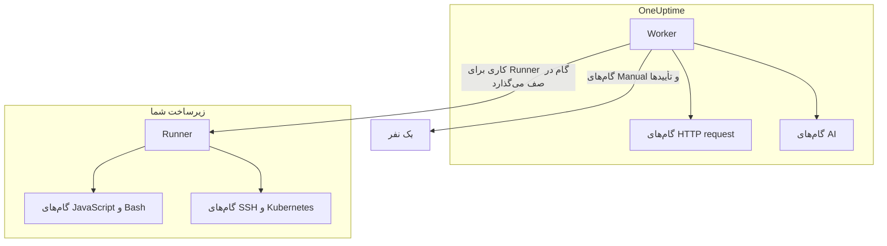

# پیکربندی و ایمنی رانبوک

این مرجعی برای گردانندگان و بازبینان امنیتی است: هر نوع گام کجا اجرا می‌شود، چه محدودیت‌ها و مهلت‌هایی بر یک گام اعمال می‌شود، چه کسی چه کاری می‌تواند بکند، و رانبوک‌ها چگونه مقاوم‌سازی شده‌اند.

:::cards
- [هر نوع گام کجا اجرا می‌شود](#هر-نوع-گام-کجا-اجرا-میشود): Worker، یک Runner یا یک نفر.
- [سقف خروجی و مهلت‌ها](#سقف-خروجی-و-مهلتها): هر محدودیتی که بر یک گام اعمال می‌شود.
- [دسترسی‌ها](#دسترسیها): مجوزهای جزئی، سه نقش رانبوک، و اینکه یک نقش به کدام رانبوک‌ها می‌رسد.
- [یادداشت‌های مقاوم‌سازی](#یادداشتهای-مقاومسازی): سندباکس، دسترسی شبکه و احراز هویت Runner.
:::

## هر نوع گام کجا اجرا می‌شود

| نوع گام | کجا اجرا می‌شود | چگونه |
| --- | --- | --- |
| Manual | یک نفر | اجرا منتظر می‌ماند تا کسی گام را کامل یا رد کند. |
| JavaScript | یک Runner | در یک سندباکس `isolated-vm`. |
| HTTP request | OneUptime Worker | یک فراخوانی HTTP خروجی. |
| Bash | یک Runner | `bash -c <script>`. |
| SSH | یک Runner | یک اتصال SSH با یک [اعتبارنامه](/docs/runbooks/credentials). |
| Kubernetes | یک Runner | فراخوانی سرور API کلاستر با یک اعتبارنامه. |
| AI | OneUptime Worker | فراخوانی ارائه‌دهنده LLM پروژه. |

## گام‌های Runner چگونه فرستاده می‌شوند

گام‌های JavaScript، Bash، SSH و Kubernetes **هرگز روی OneUptime Worker اجرا نمی‌شوند**. آن‌ها به‌صورت کار برای یک [عامل رانبوک](/docs/runbooks/agents) مشخص فرستاده می‌شوند: پردازه‌ای کوچک که روی میزبانی در زیرساخت خودتان نصب می‌کنید.

مدل فرستادن:

1. نویسنده گام رانبوک هنگام نوشتن گام یک Runner را از فهرست کشویی انتخاب می‌کند.
2. وقتی گام اجرا می‌شود، Worker یک ردیف در `RunnerJob` درج می‌کند که `targetAgentId` آن روی شناسه همان Runner و وضعیتش `Pending` است.
3. همان Runner (و فقط همان) کار را به‌صورت اتمی برمی‌دارد، آن را به‌صورت محلی اجرا می‌کند — Bash با `bash -c <script>`، JavaScript در یک سندباکس `isolated-vm`، SSH و Kubernetes با اعتبارنامه گام — و نتیجه را بازمی‌فرستد.
4. Worker رانبوک را با آن نتیجه ادامه می‌دهد.

دیگر پرچم محیطی `RUNBOOK_BASH_ENABLED` وجود ندارد. اینکه این گام‌ها در یک استقرار کار کنند یا نه، کاملاً به این بستگی دارد که پروژه یک Runner متصل با **رانبوک‌ها را اجرا می‌کند** روشن داشته باشد.

## سقف خروجی و مهلت‌ها

| محدودیت | مقدار | بر چه چیزی اعمال می‌شود |
| --- | --- | --- |
| خروجی هر گام | **۵۰ KB**. خروجی طولانی‌تر با یک نشانگر بریده می‌شود. | هر گام خودکار |
| مهلت اجرا | به‌طور پیش‌فرض **۳۰ ثانیه** | گام‌های JavaScript، Bash، SSH و Kubernetes |
| مهلت درخواست | به‌طور پیش‌فرض **۳۰ ثانیه** | گام‌های HTTP request |
| مهلت برداشتن | به‌طور پیش‌فرض **۲ دقیقه**: مدتی که Worker پیش از ناموفق کردن کار منتظر می‌ماند تا Runner انتخاب‌شده آن را بردارد | گام‌های JavaScript، Bash، SSH و Kubernetes |
| بازه مهلت | **۱ ثانیه تا ۱ ساعت** | هر مهلت |
| انتظار برای یک نفر | بدون محدودیت | گام‌های Manual و تأییدها |

مهلت‌ها را برای هر گام در صفحه **گام‌ها** در رانبوک تنظیم کنید؛ برای نگه داشتن پیش‌فرض، فیلد را خالی بگذارید. مقداری بیرون از بازه هنگام اجرای گام به درون بازه برده می‌شود، تا پیکربندی‌ای که اشتباه تایپ شده نه بتواند مهلت را از کار بیندازد و نه یک جایگاه Worker را بی‌پایان اشغال کند.

## دسترسی‌ها

مجوزهای رانبوک در گروه مجوز `Runbook` هستند:

- `CreateRunbook`، `EditRunbook`، `DeleteRunbook`، `ReadRunbook` — مدیریت قالب‌های رانبوک.
- `CreateRunbookExecution`، `EditRunbookExecution`، `DeleteRunbookExecution`، `ReadRunbookExecution` — شروع، تیک زدن، حذف و خواندن اجراها.
- `CreateRunbookRule`، `EditRunbookRule`، `DeleteRunbookRule`، `ReadRunbookRule` — مدیریت قواعد فعال‌سازی خودکار.
- `CreateRunner`، `EditRunner`، `DeleteRunner`، `ReadRunner` — مدیریت Runnerهایی که گام‌ها را در زیرساخت خودتان اجرا می‌کنند. (پیش از تغییر نام به Runner، این‌ها `*RunbookAgent` نام داشتند؛ واگذاری‌های موجود منتقل شده‌اند، پس لازم نیست چیزی دوباره واگذار شود.)
- `RunbookAdmin`، `RunbookMember`، `RunbookViewer` (نقش‌ها) — `RunbookAdmin` رانبوک‌ها، قواعدشان و Runnerهایی را که روی آن‌ها اجرا می‌شوند می‌سازد و آن‌ها را اجرا می‌کند. `RunbookMember` رانبوک‌ها و اجراهایشان را باز می‌کند و اجرایشان می‌کند — یک اجرا را شروع می‌کند، گام‌هایش را کامل یا رد می‌کند و لغوش می‌کند — اما هیچ رانبوک یا Runner‌ای را نمی‌سازد، تغییر نمی‌دهد یا حذف نمی‌کند. `RunbookViewer` رانبوک‌ها و اجراهایشان را می‌خواند و چیزی اجرا نمی‌کند. `RunbookAdmin` همه مجوزهای جزئی بالا را در بر می‌گیرد.

یک نقش رانبوک‌هایی را اجرا می‌کند که دامنه‌اش به آن‌ها می‌رسد. واگذاری `RunbookMember`، `RunbookAdmin` یا `ProjectMember` که به برخی برچسب‌ها محدود شده، اجراهای رانبوک‌هایی را که آن برچسب‌ها را دارند شروع می‌کند و پیش می‌برد، واگذاری محدود به **Owned** اجراهای رانبوک‌هایی را که تیمش مالک آن‌هاست، و مسدودسازی یک برچسب برای یک تیم آن رانبوک‌ها را از دسترسش خارج می‌کند. `CreateRunbookExecution` و `EditRunbookExecution` درباره اجراها هستند که برچسبی ندارند، پس به هر رانبوکی در پروژه می‌رسند. تأیید یک پیشنهاد رفع مشکل که یک رانبوک را شروع می‌کند هم به همین شکل بررسی می‌شود.

اعتبارنامه‌ها و اسرار بیرون از `RunbookAdmin` هستند. مدیریت آن‌ها به `ProjectOwner` یا `ProjectAdmin`، یا مجوزهای `CreateRunbookCredential`، `EditRunbookCredential`، `DeleteRunbookCredential`، `ReadRunbookCredential` و `CreateRunbookSecret`، `EditRunbookSecret`، `DeleteRunbookSecret`، `ReadRunbookSecret` نیاز دارد. [اعتبارنامه‌های رانبوک](/docs/runbooks/credentials) را ببینید.

قواعد مالکیت و قواعد برچسب زیر **رانبوک‌ها → تنظیمات** هم بیرون از `RunbookAdmin` هستند. مدیریت آن‌ها به `ProjectOwner` یا `ProjectAdmin`، یا مجوزهای `CreateRunbookOwnerRule` و `CreateRunbookLabelRule` و همتاهای ویرایش، حذف و خواندن آن‌ها نیاز دارد.

برای اینکه نقش‌ها و مجوزهای جزئی چگونه با هم ترکیب می‌شوند، [کاربران، تیم‌ها و دسترسی‌ها](/docs/permissions/index) را ببینید.

## صف و worker

اجراهای رانبوک روی صف BullMQ به نام `Runbook` اجرا می‌شوند. هر پردازه Worker هم‌زمان تا ۲۵ اجرا را پیش می‌برد؛ این عدد در کد ثابت است و با یک متغیر محیطی تنظیم نمی‌شود.

وقتی یک گام دستی از راه API تیک زده می‌شود، اجرا دوباره در صف قرار می‌گیرد تا از گام بعدی ادامه یابد. به‌صورت `Scheduled` منتظر می‌ماند تا یک Worker دوباره آن را بردارد، و اجرایی که در صف است هرگز به خاطر انتظار ناموفق نمی‌شود.

## یادداشت‌های مقاوم‌سازی

- **JavaScript، Bash، SSH و Kubernetes** روی میزبان Runner‌ای اجرا می‌شوند که شما کنترلش می‌کنید، نه روی OneUptime Worker. JavaScript در یک ایزوله `isolated-vm` جداگانه با ۱۲۸ MB حافظه و بدون دسترسی به سیستم فایل یا پردازه‌های Runner اجرا می‌شود؛ می‌تواند با `axios` درخواست HTTP بفرستد، اما درخواست‌ها به شبکه‌های خصوصی و نشانی‌های loopback و link-local رد می‌شوند. Bash با `bash -c` اجرا می‌شود و مهلتش روی Runner اعمال می‌شود.
- **گام‌های HTTP** از یک اعتبارسنج وضعیت آسان‌گیر استفاده می‌کنند، پس پاسخ 4xx یا 5xx به‌جای پرتاب شدن به‌صورت استثنا، به‌عنوان گامی ناموفق ثبت می‌شود و خروجی ثبت‌شده همان چیزی را نشان می‌دهد که سمت مقابل واقعاً برگردانده است. تغییر مسیرها دنبال نمی‌شوند. Worker هرگز نشانی‌های loopback یا link-local، مانند endpoint فراداده ابری، را فرا نمی‌خواند؛ در OneUptime Cloud نشانی‌های شبکه خصوصی را هم رد می‌کند و یک OneUptime خودمیزبان آن‌ها را با `DATA_SOURCE_BLOCK_PRIVATE_ADDRESSES=true` رد می‌کند.
- **گام‌های AI** هرگز یادداشت‌های خصوصی حادثه یا پیام‌های Slack و Microsoft Teams را نمی‌بینند، و خروجی گام‌های پیشین پیش از رسیدن به مدل برای یافتن اسرار بررسی و پوشانده می‌شود. تصویرهای جاسازی‌شده و داده‌های رمزگذاری‌شده طولانی از پرامپت کنار گذاشته می‌شوند. [AI](/docs/runbooks/authoring#ai) را ببینید.
- **احراز هویت Runner** با شناسه و کلید محرمانه‌ای انجام می‌شود که به‌صورت متغیرهای محیطی روی کانتینر Runner تنظیم شده‌اند. در سمت سرور، هویت معتبر Runner از ردیف پایگاه داده‌ای می‌آید که با شناسه و کلید ارائه‌شده جور است: یک کلاینت حتی با کلیدی لورفته هم نمی‌تواند خود را جای Runner دیگری جا بزند.
- **اعتبارنامه‌ها و اسرار** در حالت سکون رمزگذاری می‌شوند، API هرگز آن‌ها را برنمی‌گرداند، و فقط به Runnerهایی که به آن‌ها اختصاص یافته‌اند، وقتی آن‌ها گامی را برمی‌دارند، تحویل داده می‌شوند.

## جدول‌های پایگاه داده

| جدول | چه چیزی در آن است |
| --- | --- |
| `Runbook` | قالب: نام، slug، توضیحات، `isEnabled`، برچسب‌ها و گام‌ها به‌صورت JSON. |
| `RunbookExecution` | یک ردیف برای هر اجرا، با کلیدهای خارجی nullable به نام‌های `incidentId`، `alertId` و `scheduledMaintenanceId` و یک آرایه JSON به نام `stepExecutions` که گام‌ها و وضعیت هر گام را منجمد نگه می‌دارد. |
| `RunbookRule` | قواعد فعال‌سازی خودکار، با یک تمایزدهنده `triggerEntityType` (Incident، Alert، ScheduledMaintenance)، یک رابطه چند به چند با رانبوک‌هایی که باید شروع شوند، و آنچه با آن جور می‌شوند: یک ستون JSON به نام `criteria` (شرط‌ها) به‌علاوه پیوندهای چند به چند به مانیتورها، شدت‌های حادثه، شدت‌های هشدار، برچسب‌ها و برچسب‌های مانیتور، و الگوهای عنوان، توضیحات، نام مانیتور و توضیحات مانیتور. |
| `Runner` | یک ردیف برای هر Runner نصب‌شده: نام، کلید محرمانه، `lastAlive`، `connectionStatus`، اطلاعات میزبان و قابلیت‌ها. |
| `RunnerJob` | یک ردیف برای هر گامی که به یک Runner فرستاده شده: `targetAgentId` (Runner‌ای که نویسنده گام انتخاب کرده)، نوع گام، اسکریپت یا محموله، وضعیت (`Pending` → `Claimed` → `Running` → `Succeeded`، `Failed`، `TimedOut` یا `Cancelled`)، مهلت برداشتن، اجاره، خروجی و کد خروج. |
| `RunbookCredential` | اعتبارنامه‌های SSH و Kubernetes، با فیلدهای محرمانه رمزگذاری‌شده، و Runnerهایی که به آن‌ها اختصاص یافته‌اند. |
| `RunbookSecret` | اسرار رانبوک، رمزگذاری‌شده، و Runnerهایی که اجازه دریافتشان را دارند. |

## نکته‌های عملیاتی

- **مطمئن شوید Runner‌ای که روی یک گام انتخاب می‌کنید سالم است.** اگر به افزونگی نیاز دارید، یک Runner دوم اجرا کنید و گام‌هایتان را بین آن‌ها تقسیم کنید، یا یک رانبوک پشتیبان نگه دارید که Runner دیگر را هدف می‌گیرد.
- **URL ثبت کنید، نه داده حجیم.** اگر گامی بیش از چند KB خروجی تولید می‌کند، آن را در فضای ذخیره‌سازی اشیا یا پشته لاگ خودتان بنویسید و URL را برگردانید.
- **ایدمپوتنسی مهم است.** اگر Worker وسط گام دوباره راه‌اندازی شود و اجرا ادامه یابد، یک گام HTTP request یا AI دوباره اجرا می‌شود. گامی روی یک Runner در هر اجرا حداکثر یک بار فرستاده می‌شود، اما ممکن است اسکریپت پیش از یک شکست بخشی از کارش را انجام داده باشد و شما رانبوک را دوباره اجرا کنید. گام‌ها را طوری طراحی کنید که تکرارشان امن باشد.

## گام‌های بعدی

:::cards
- [عامل‌های رانبوک](/docs/runbooks/agents): نصب، اداره و عیب‌یابی Runnerها.
- [اعتبارنامه‌های رانبوک](/docs/runbooks/credentials): دسترسی مدیریت‌شده SSH و Kubernetes، و اسرار برای اسکریپت‌ها.
- [کاربران، تیم‌ها و دسترسی‌ها](/docs/permissions/index): نقش‌ها، برچسب‌ها و تیم‌ها چگونه تعیین می‌کنند چه کسی چه چیزی را اجرا می‌کند.
:::
