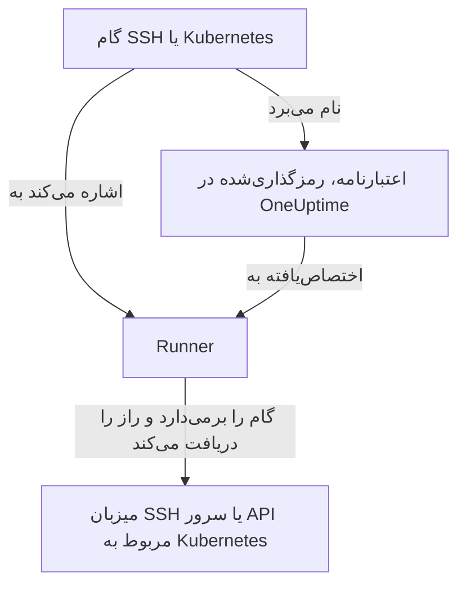

# اعتبارنامه‌های رانبوک

اعتبارنامه راهی است که یک رانبوک به چیزی می‌رسد که میزبان خود Runner **نیست**: سروری از راه SSH، یا یک کلاستر Kubernetes. بدون آن، «سرویس را دوباره راه‌اندازی کن» یعنی نوشتن یک اسکریپت shell و گذاشتن دستی یک کلید یا kubeconfig روی میزبان Runner، جایی که بیرون از کنترل OneUptime روی دیسک می‌ماند. اعتبارنامه همان دسترسی است، اما به‌صورت یک شیء مدیریت‌شده: در حالت سکون رمزگذاری‌شده، به Runnerهای مشخص اختصاص‌یافته و با نام از یک گام ارجاع‌شده.

آن‌ها را در **رانبوک‌ها → Runnerها → اعتبارنامه‌ها** مدیریت کنید.

:::cards
- [ساختن یک اعتبارنامه](#ساختن-یک-اعتبارنامه): دسترسی آن و Runnerهایی که اجازه استفاده از آن را دارند.
- [کمترین سطح دسترسی در سمت مقابل](#کمترین-سطح-دسترسی-در-سمت-مقابل): محدود کنید کلید یا توکن چه کاری می‌تواند بکند.
- [اسرار برای اسکریپت‌ها](#اسرار-برای-اسکریپتها): به یک اسکریپت Bash یا JavaScript یک رمز عبور یا توکن بدهید.
:::

## اعتبارنامه چگونه به کار می‌رود



یک گام SSH یا Kubernetes نام یک اعتبارنامه و یک Runner را می‌برد. وقتی آن Runner گام را برمی‌دارد، OneUptime بررسی می‌کند که اعتبارنامه به آن اختصاص یافته باشد، راز را رمزگشایی می‌کند و آن را فقط در پاسخ به همان برداشت تحویل می‌دهد. راز هرگز روی کار ذخیره نمی‌شود و هرگز از API خواندنی نیست.

## پیش از شروع

- **نقشی که اعتبارنامه‌ها را مدیریت می‌کند.** Project Owner و Project Admin، یا هر کسی با مجوز **Create Runbook Credential**. نقش Runbook Admin شامل آن نیست. اختصاص یک اعتبارنامه SSH به Runner‌ای که دستورهای OneUptime AI را اجرا می‌کند به **Read Runbook Credential** هم نیاز دارد؛ [Runnerهایی که دستورهای OneUptime AI را اجرا می‌کنند](#runnerهایی-که-دستورهای-oneuptime-ai-را-اجرا-میکنند) را ببینید.
- **طرحی که آن‌ها را شامل شود.** در OneUptime Cloud، اعتبارنامه‌های رانبوک به طرح **Growth** یا بالاتر نیاز دارند.
- **یک [Runner](/docs/runbooks/agents)** که از راه شبکه به میزبان یا سرور API کلاستر برسد.

## ساختن یک اعتبارنامه

:::steps
### اعتبارنامه‌ها را باز کنید

**رانبوک‌ها → Runnerها → اعتبارنامه‌ها** را باز کنید و روی **ساخت Runbook Credential** کلیک کنید.

### نام بگذارید و نوعش را انتخاب کنید

در گام **Credential** یک **نام** وارد کنید، مثلاً `prod-cluster`، یک **توضیحات** اختیاری و **نوع**: **SSH** یا **Kubernetes**. نوع بعداً قابل تغییر نیست؛ به‌جای آن یک اعتبارنامه تازه بسازید.

### دسترسی را وارد کنید

:::tabs
@tab SSH
زیر **میزبان SSH**، **نام میزبان**، **پورت** (اگر خالی باشد ۲۲) و **نام کاربری** را وارد کنید. زیر **احراز هویت SSH**، یک **Private Key (PEM)** را همراه با **Private Key Passphrase** آن، اگر دارد، بچسبانید یا برای میزبانی بدون دسترسی با کلید یک **رمز عبور** وارد کنید. هر جا انتخاب دارید، کلید بهترین گزینه است.
@tab Kubernetes
زیر **Kubernetes**، **API Server URL** را وارد کنید، مثلاً `https://10.0.0.1:6443`، همراه با **Service Account Token** و **CA Certificate (PEM)**، تا Runner بتواند سرور API را راستی‌آزمایی کند. CA را فقط وقتی خالی بگذارید که سرور API گواهی‌ای ارائه کند که Runner از قبل به آن اعتماد دارد.
:::

### آن را به Runnerها اختصاص دهید

در گام **Runnerها**، Runnerهایی را که اجازه استفاده از اعتبارنامه را دارند انتخاب کنید، سپس روی **ساخت Runbook Credential** کلیک کنید. اعتبارنامه‌ای که به هیچ Runner‌ای اختصاص نیافته قابل استفاده در هیچ گامی نیست.

### آن را در یک گام به کار ببرید

در یک [گام SSH یا Kubernetes](/docs/runbooks/authoring#انواع-گام) یکی از آن Runnerها را انتخاب کنید، سپس اعتبارنامه را زیر **Credential** انتخاب کنید. یک گام فقط اعتبارنامه‌های هم‌نوع خودش را پیشنهاد می‌کند، و ذخیره گامی که نام یک اعتبارنامه را می‌برد به مجوز خواندن اعتبارنامه‌های رانبوک نیاز دارد.
:::

## چه چیزی ذخیره می‌شود

| نوع | فیلدها |
| --- | --- |
| SSH | نام میزبان، پورت (پیش‌فرض ۲۲)، نام کاربری، و یا یک کلید خصوصی PEM (با عبارت عبور اختیاری) یا یک رمز عبور. |
| Kubernetes | URL سرور API، توکن یک حساب سرویس و گواهی CA کلاستر. |

## مقدارهای محرمانه فقط‌نوشتنی‌اند

کلیدهای خصوصی، عبارت‌های عبور، رمزهای عبور و توکن‌های حساب سرویس در حالت سکون رمزگذاری می‌شوند و API **هرگز آن‌ها را برنمی‌گرداند**: نه به داشبورد، نه به یک گردش کاری و نه در یک خروجی. جدول می‌تواند نشان دهد یک اعتبارنامه *چیست*، بی‌آنکه هرگز نشان دهد چه در خود دارد.

پس برای یک مقدار محرمانه «نمایش» وجود ندارد، فقط «جایگزینی»: وارد کردن دوباره مقدار همان راه چرخاندن آن است. اگر مقدار اصلی را گم کرده‌اید، روی سامانه هدف کلید تازه‌ای صادر کنید و اعتبارنامه را به‌روز کنید.

## اختصاص یک اعتبارنامه به Runnerها

یک اعتبارنامه فقط از سوی Runnerهایی قابل استفاده است که به آن‌ها اختصاصش می‌دهید، و گام باید به یکی از آن‌ها اشاره کند. اگر گامی نام اعتبارنامه‌ای را ببرد که به Runner آن اختصاص نیافته، **گام به‌جای اجرا شکست می‌خورد**: Runner‌ای که بی‌صدا کاری نمی‌کند دقیقاً شبیه Runner‌ای است که کارش را درست انجام داده است.

اختصاص همان مرز دسترسی است، پس آن را محدود نگه دارید: Runner‌ای که فقط یک کلاستر را دوباره راه‌اندازی می‌کند به کلید SSH میزبان‌های پایگاه داده شما نیاز ندارد.

### Runnerهایی که دستورهای OneUptime AI را اجرا می‌کنند

روی Runner‌ای که **دستورهای رفع مشکل با هوش مصنوعی را اجرا می‌کند** در آن روشن است، OneUptime AI برای دستورهایی که آنجا اجرا می‌کند از میان اعتبارنامه‌های SSH اختصاص‌یافته به آن Runner انتخاب می‌کند. بنابراین یک اعتبارنامه SSH فقط از راه کسی که اجازه خواندن اعتبارنامه‌های رانبوک را دارد (**Read Runbook Credential**، یا یک Project Owner یا Project Admin) به چنین Runner‌ای می‌رسد، هر کدام که اول ذخیره شود:

- **اختصاص اعتبارنامه.** ساختن یک اعتبارنامه SSH با چنین Runner‌ای، یا افزودن چنین Runner‌ای به یک اعتبارنامه، به آن مجوز نیاز دارد. بدون آن، ذخیره رد می‌شود و نام Runner آورده می‌شود: اعتبارنامه را به Runnerهایی اختصاص دهید که دستورهای رفع مشکل با هوش مصنوعی را اجرا نمی‌کنند، یا از کسی که مجوز را دارد بخواهید آن را اختصاص دهد.
- **روشن کردن کلید.** روشن کردن **دستورهای رفع مشکل با هوش مصنوعی را اجرا می‌کند** برای Runner‌ای که اعتبارنامه SSH دارد به همان مجوز نیاز دارد.

حذف Runnerها از یک اعتبارنامه، ذخیره یک اعتبارنامه با همان Runnerهایی که از قبل دارد، و اعتبارنامه‌های Kubernetes به چیزی بیشتر نیاز ندارند: دستورهای kubectl مربوط به OneUptime AI با اعتبارنامه‌ای اجرا می‌شوند که به کلاسترشان بسته شده است. اختصاص اعتبارنامه‌ها و روشن کردن کلید از سوی کسی که این مجوز را ندارد در هر پروژه یکی‌یکی ذخیره می‌شوند، تا این دو نتوانند با هم از بررسی‌هایشان بگذرند؛ ذخیره‌ای که در حین ذخیره دیگری برسد منتظر آن می‌ماند و اگر بیش از حد طول بکشد با *Try again in a moment* رد می‌شود. دوباره ذخیره کنید.

گام یک گردش کاری به‌عنوان Project Admin عمل می‌کند، اما مجوز خواندن اعتبارنامه‌های رانبوکِ یک Project Admin را قرض نمی‌گیرد: یک گام فقط وقتی آن را دارد که کسی که آخرین بار گام‌های گردش کاری را ذخیره کرده آن را داشته باشد. [گام‌های گردش کاری چه کاری می‌توانند بکنند](/docs/workflows/configuration#گامهای-گردش-کاری-چه-کاری-میتوانند-بکنند) را ببینید.

## کمترین سطح دسترسی در سمت مقابل

OneUptime نمی‌تواند محدود کند که اعتبارنامه شما روی سامانه هدف اجازه چه کاری دارد: این کار سامانه هدف است، و ارزش انجام دادن دارد:

- **SSH** — کلید را به رمز عبور ترجیح دهید، به کاربر فقط دستورهایی را که نیاز دارد بدهید (هر جا عملی است، یک دستور اجباری یا یک shell محدود)، و کلید شخصی یک مدیر را دوباره به کار نبرید.
- **Kubernetes** — حساب سرویس را به یک Role متصل کنید که `patch` را دقیقاً روی همان بارهای کاری‌ای که رانبوک‌هایتان به آن‌ها دست می‌زنند، و دقیقاً در همان namespaceهایی که در آن‌ها اجرا می‌شوند، مجاز کند. **Restart workload** خود بار کاری را وصله می‌کند و **Scale workload** زیرمنبع `scale` آن را: بیش از این لازم نیست.

برای نمونه، یک حساب سرویس که می‌تواند یک Deployment را دوباره راه‌اندازی و مقیاس‌دهی کند و هیچ کار دیگری نه:

```yaml title="oneuptime-runbooks-rbac.yaml"
apiVersion: v1
kind: ServiceAccount
metadata:
  name: oneuptime-runbooks
  namespace: checkout
---
apiVersion: rbac.authorization.k8s.io/v1
kind: Role
metadata:
  name: oneuptime-runbooks
  namespace: checkout
rules:
  # Restart workload: patches the Deployment's pod template.
  - apiGroups: ["apps"]
    resources: ["deployments"]
    resourceNames: ["checkout-api"]
    verbs: ["patch"]
  # Scale workload: patches the Deployment's scale subresource.
  - apiGroups: ["apps"]
    resources: ["deployments/scale"]
    resourceNames: ["checkout-api"]
    verbs: ["patch"]
---
apiVersion: rbac.authorization.k8s.io/v1
kind: RoleBinding
metadata:
  name: oneuptime-runbooks
  namespace: checkout
subjects:
  - kind: ServiceAccount
    name: oneuptime-runbooks
    namespace: checkout
roleRef:
  apiGroup: rbac.authorization.k8s.io
  kind: Role
  name: oneuptime-runbooks
```

برای یک StatefulSet یا DaemonSet به‌جای آن از `statefulsets` یا `daemonsets` استفاده کنید. DaemonSet قابل مقیاس‌دهی نیست، پس به قاعده `scale` نیازی ندارد.

## اسرار برای اسکریپت‌ها

گام‌های Bash و JavaScript فیلد **Credential** ندارند. برای دادن یک رمز عبور، توکن یا کلید API به یک اسکریپت بدون نوشتن آن در رانبوک، آن را به‌عنوان یک **راز رانبوک** ذخیره کنید. اسرار در **رانبوک‌ها → تنظیمات → اسرار** از سوی Project Owner و Project Admin یا با مجوز **Create Runbook Secret** مدیریت می‌شوند.

:::steps
### راز را بسازید

روی **ساخت Runbook Secret** کلیک کنید. در گام **راز** یک **نام** (حروف، اعداد، خط تیره و زیرخط)، یک **توضیحات** اختیاری و **مقدار راز** را وارد کنید. در گام **دسترسی**، Runnerها را زیر **عامل‌های رانبوکی که به این راز دسترسی دارند** انتخاب کنید.

### آن را در یک اسکریپت به کار ببرید

هر جا مقدار باید قرار بگیرد بنویسید `{{runbookSecrets.NAME}}`:

```bash
curl -s -X POST \
  -H "Authorization: Bearer {{runbookSecrets.CDN_API_TOKEN}}" \
  "https://api.cdn.example.com/v1/purge"
```

وقتی Runner‌ای که راز به آن اختصاص یافته گام را برمی‌دارد، اسکریپت را با مقدار جایگذاری‌شده دریافت می‌کند.
:::

مانند فیلدهای محرمانه یک اعتبارنامه، مقدار یک راز در حالت سکون رمزگذاری می‌شود و API هرگز آن را برنمی‌گرداند: **به‌روزرسانی مقدار راز** آن را جایگزین می‌کند. در OneUptime Cloud، اسرار رانبوک هم به طرح **Growth** یا بالاتر نیاز دارند.

| | اعتبارنامه | راز رانبوک |
| --- | --- | --- |
| استفاده‌کننده | گام‌های SSH و Kubernetes | اسکریپت‌های Bash و JavaScript |
| محتوا | یک میزبان و کلیدش، یا URL و توکن یک کلاستر | هر مقدار تکی |
| محل مدیریت | **رانبوک‌ها → Runnerها → اعتبارنامه‌ها** | **رانبوک‌ها → تنظیمات → اسرار** |
| رسیدن به Runner | در پاسخ به برداشت گامی که نامش را می‌برد | جایگذاری‌شده در اسکریپت گامی که برمی‌دارد |
| خواندنی دوباره از API | فقط فیلدهای غیرمحرمانه‌اش | مقدارش هرگز |

## چه کسی آن‌ها را می‌بیند

ساختن، ویرایش و حذف اعتبارنامه‌ها به مجوزهای اعتبارنامه رانبوک (یا Project Owner/Admin) نیاز دارد. خواندن یک اعتبارنامه فقط فیلدهای غیرمحرمانه‌اش را نشان می‌دهد.

توجه کنید که **کلید عامل** یک Runner هم‌ارز اعتبارنامه‌های اختصاص‌یافته به آن Runner است: هر چیزی که کلید را داشته باشد می‌تواند به‌عنوان آن Runner کار بردارد و اعتبارنامه دریافت کند. به همین دلیل کلیدهای عامل را فقط Project Owner، Project Admin و Runbook Admin می‌توانند بخوانند: با آن‌ها همان رفتاری را داشته باشید که با خود اعتبارنامه‌ها دارید.

## گام‌های بعدی

:::cards
- [نوشتن یک رانبوک](/docs/runbooks/authoring): گام‌های SSH و Kubernetes را بنویسید که از یک اعتبارنامه استفاده می‌کنند.
- [عامل‌های رانبوک](/docs/runbooks/agents): Runner‌ای را نصب کنید که اعتبارنامه به آن اختصاص می‌یابد.
- [پیکربندی و ایمنی رانبوک](/docs/runbooks/configuration): دسترسی‌ها و مقاوم‌سازی برای کل پشته رانبوک.
:::
