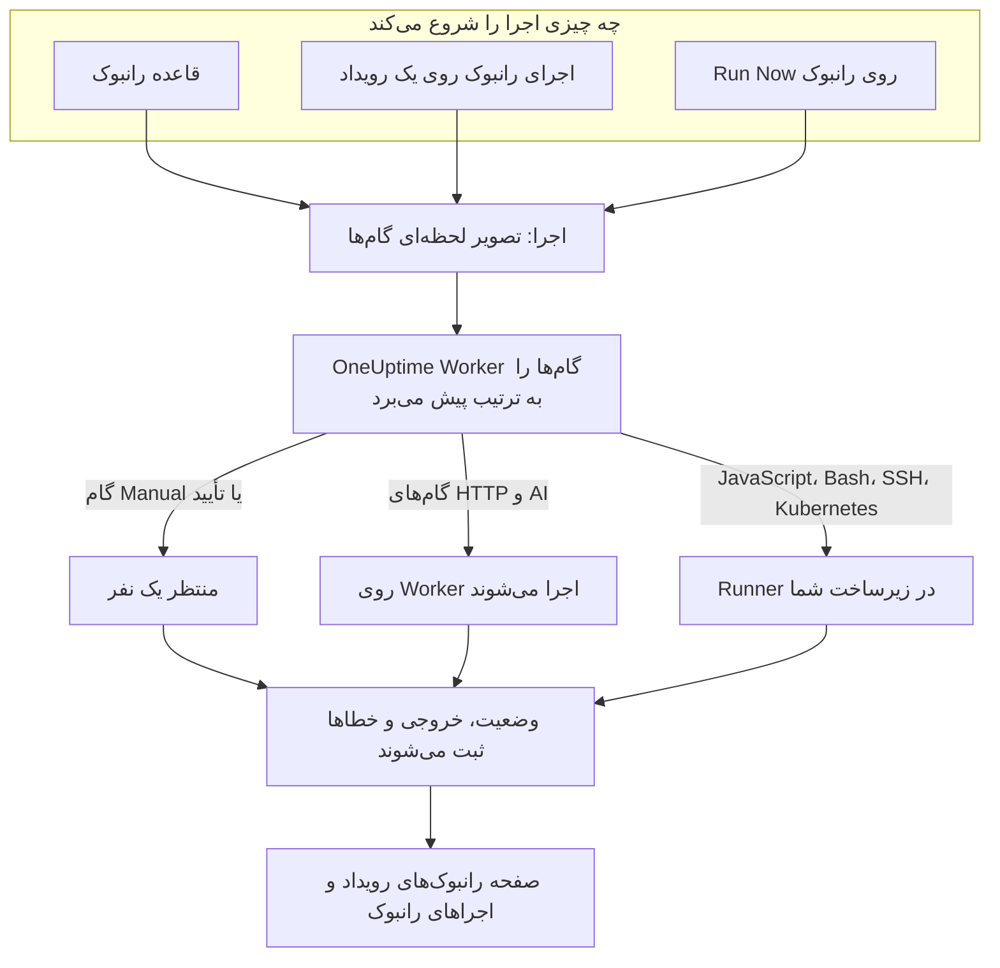

# نمای کلی رانبوک‌ها

رانبوک یک رویه پاسخ قابل استفاده دوباره است: فهرستی مرتب از گام‌های دستی و خودکار که آن را روی یک حادثه، یک هشدار یا یک رویداد تعمیر و نگهداری زمان‌بندی‌شده اجرا می‌کنید. رانبوک گفت‌وگوی «حالا چه کنیم؟» را به چک‌لیستی تبدیل می‌کند که هر کسی در آنکال می‌تواند ساعت ۳ بامداد دنبالش کند، و اسکریپت‌ها، فراخوانی‌های API و تأییدها از پیش نوشته شده‌اند. رانبوک‌ها برای مهندسان آنکال که به حادثه‌ها پاسخ می‌دهند و برای تیم‌های پلتفرمی است که این پاسخ را خودکار می‌کنند.

:::cards
- [نوشتن یک رانبوک](/docs/runbooks/authoring): یک رانبوک بسازید و گام‌هایش را بنویسید.
- [قواعد رانبوک](/docs/runbooks/rules): رانبوک‌ها را روی حادثه‌ها، هشدارها و رویدادهای نگهداری تازه شروع کنید.
- [اجرای یک رانبوک](/docs/runbooks/running): یک اجرا را شروع کنید، گام‌هایش را کامل و تأیید کنید، یا لغوش کنید.
- [عامل‌های رانبوک](/docs/runbooks/agents): یک Runner نصب کنید که اسکریپت‌هایتان را در زیرساخت خودتان اجرا می‌کند.
:::

## رانبوک چگونه اجرا می‌شود



هر اجرای رانبوک یک **اجرا** است. وقتی شروع می‌شود، گام‌های رانبوک روی آن کپی می‌شوند و OneUptime آن‌ها را به ترتیب پیش می‌برد. یک گام Manual، یا گامی که به تأیید نیاز دارد، اجرا را تا وقتی کسی اقدام کند متوقف می‌کند.

گام‌های HTTP و AI روی OneUptime Worker اجرا می‌شوند. گام‌های JavaScript، Bash، SSH و Kubernetes روی یک [Runner](/docs/runbooks/agents) اجرا می‌شوند که آن را در زیرساخت خودتان نصب می‌کنید، پس اسکریپت‌هایتان هرگز روی سرورهای OneUptime اجرا نمی‌شوند. وضعیت، خروجی و پیام خطای هر گام روی اجرا ثبت می‌شود و اجرا کنار همان حادثه، هشدار یا رویدادی می‌ماند که برایش اجرا شده است.

## مفاهیم کلیدی

| مفهوم | معنا |
| --- | --- |
| **رانبوک** | قالب. رویه‌ای نام‌دار و قابل استفاده دوباره با فهرستی مرتب از گام‌ها و کلید **اجرای این رانبوک**. |
| **گام** | یک آیتم در رانبوک. نوعی دارد (Manual، JavaScript، HTTP request، Bash، SSH، Kubernetes یا AI)، یک عنوان، یک توضیح و تنظیمات ویژه نوعش. |
| **قاعده رانبوک** | قاعده‌ای که یک یا چند رانبوک را خودکار به حادثه‌ها، هشدارها یا رویدادهای تعمیر و نگهداری زمان‌بندی‌شده‌ای وصل می‌کند که با شرط‌هایش جور باشند: مانیتورها، شدت، برچسب‌ها، برچسب‌های مانیتور، عنوان یا توضیحات آن‌ها. |
| **اجرا** | یک بار اجرای رانبوک. وقتی ساخته می‌شود که قاعده‌ای فعال شود، کسی روی یک رویداد **اجرای رانبوک** را بزند، یا کسی روی خود رانبوک **Run Now** را بزند. تصویر لحظه‌ای گام‌ها و وضعیت و خروجی هر گام را نگه می‌دارد. |
| **تصویر لحظه‌ای** | رونوشت منجمد گام‌های رانبوک که روی هر اجرا قرار دارد. می‌توانید بعداً رانبوک را ویرایش کنید بی‌آنکه تاریخچه اجراهای گذشته بازنویسی شود. |
| **Runner** | عاملی کوچک که روی میزبانی در زیرساخت خودتان اجرا می‌کنید. گام‌های JavaScript، Bash، SSH و Kubernetes را که نامش را می‌برند اجرا می‌کند. به آن عامل رانبوک هم می‌گویند. |
| **اعتبارنامه** | دسترسی مدیریت‌شده SSH یا Kubernetes که گام‌های SSH و Kubernetes از آن استفاده می‌کنند. رمزگذاری‌شده در حالت سکون و فقط به Runnerهایی داده می‌شود که به آن‌ها اختصاصش می‌دهید. |
| **راز** | یک مقدار تکی، مثلاً یک توکن API، که یک اسکریپت Bash یا JavaScript آن را به شکل `{{runbookSecrets.NAME}}` به کار می‌برد. رمزگذاری‌شده در حالت سکون و فقط به Runnerهایی داده می‌شود که به آن‌ها اختصاصش می‌دهید. |

## انواع گام

برای هر گام نوع مناسب را انتخاب کنید. [نوشتن یک رانبوک](/docs/runbooks/authoring) تنظیمات هر نوع را شرح می‌دهد.

| نوع گام | کجا اجرا می‌شود | وقتی از آن استفاده کنید که… | مثال |
| --- | --- | --- | --- |
| **Manual** | یک نفر | انسانی باید چیزی را بررسی کند، قضاوت کند یا جایی اقدام کند که OneUptime نمی‌تواند. | «تأیید کنید که ترافیک به منطقه ثانویه منتقل شده است.» |
| **JavaScript** | یک Runner | به محاسبه‌ای کوچک و محدود در یک سندباکس نیاز دارید. | تأخیر رپلیکا را حساب کنید و تصمیم بگیرید که ادامه دهید یا نه. |
| **HTTP request** | OneUptime Worker | یک API موجود را فرا می‌خوانید: ارائه‌دهنده ابری، PagerDuty، وب‌هوک Slack، سرویس خودتان. | `POST` به هماهنگ‌کننده failover شما. |
| **Bash** | یک Runner | به دستورهای shell روی زیرساخت خودتان نیاز دارید. | اجرای `kubectl rollout restart` یا یک اسکریپت بازیابی. |
| **SSH** | یک Runner | باید یک دستور را روی یک میزبان راه دور با یک اعتبارنامه SSH مدیریت‌شده اجرا کنید. | راه‌اندازی دوباره یک سرویس روی یک وب‌سرور. |
| **Kubernetes** | یک Runner | باید یک Deployment، StatefulSet یا DaemonSet را دوباره راه‌اندازی یا مقیاس‌دهی کنید. | راه‌اندازی دوباره `checkout-api` در `production`. |
| **AI** | OneUptime Worker | در میانه اجرا تحلیل، خلاصه یا قضاوتی از ارائه‌دهنده LLM پروژه‌تان می‌خواهید. | «تشخیص‌های بالا را بررسی کن. آیا failover امن است؟» |

یک رانبوک می‌تواند همه این‌ها را با هم داشته باشد. قدرت رانبوک‌ها در درهم‌تنیدن بررسی‌های انسانی با خودکارسازی و تحلیل هوش مصنوعی است.

## چه چیزی اجرا را شروع می‌کند

| چگونه | کجا | اجرا به چه چیزی وصل می‌شود |
| --- | --- | --- |
| یک قاعده رانبوک | **حوادث**، **هشدارها** یا **تعمیر و نگهداری زمان‌بندی‌شده** → **قواعد** → **قواعد رانبوک** | حادثه، هشدار یا رویداد تازه |
| **اجرای رانبوک** | صفحه **رانبوک‌ها** در یک حادثه، هشدار یا رویداد تعمیر و نگهداری زمان‌بندی‌شده | همان رویداد |
| **Run Now** | صفحه **نمای کلی** رانبوک | هیچ‌چیز: یک اجرای موردی |
| یک قاعده رفع خودکار مشکل | [AI SRE](/docs/ai/ai-sre) را ببینید | حادثه یا هشدار |

رانبوکی که کلید **اجرای این رانبوک** آن در صفحه **تنظیمات** خاموش است، با هیچ‌کدام از این‌ها شروع نمی‌شود. اجراهایی که از قبل شروع شده‌اند ادامه می‌یابند.

## رانبوک‌ها کجای داشبورد هستند

رانبوک‌ها زیر **محصولات** و در گروه **داشبوردها و خودکارسازی** قرار دارند.

| صفحه | آنجا چه می‌کنید |
| --- | --- |
| **محصولات → رانبوک‌ها** | رانبوک‌ها را مرور کنید، بسازید و باز کنید. |
| صفحه **گام‌ها** در یک رانبوک | گام‌هایش را بنویسید و مرتب کنید، سپس **Save Steps** را انتخاب کنید. |
| **نمای کلی** یک رانبوک | آخرین اجرا و نتایج را ببینید و روی **Run Now** کلیک کنید. |
| صفحه **اجراها** در یک رانبوک | همه اجراهای این رانبوک، با پالایش بر اساس وضعیت یا تاریخ شروع. |
| **مالکان** یک رانبوک | افراد و تیم‌های مسئول آن را اضافه کنید. |
| **تنظیمات** یک رانبوک | **اجرای این رانبوک** را بدون حذف رانبوک خاموش کنید. |
| **رانبوک‌ها → اجراها** | همه اجراهای همه رانبوک‌های پروژه. |
| **رانبوک‌ها → Runnerها** و **رانبوک‌ها → Runnerها → اعتبارنامه‌ها** | [Runnerها](/docs/runbooks/agents) را نصب کنید و [اعتبارنامه‌ها](/docs/runbooks/credentials) را مدیریت کنید. |
| **رانبوک‌ها → تنظیمات** | [اسرار](/docs/runbooks/credentials#اسرار-برای-اسکریپتها) اسکریپت‌ها را مدیریت کنید، و نیز **قواعد مالکیت** و **قواعد برچسب** که به رانبوک‌های تازه مالک و برچسب اضافه می‌کنند. |
| **حوادث / هشدارها / تعمیر و نگهداری زمان‌بندی‌شده → قواعد → قواعد رانبوک** | قواعدی را بسازید که رانبوک‌ها را خودکار شروع می‌کنند. |
| یک حادثه، هشدار یا رویداد نگهداری → **رانبوک‌ها** | اجراهای وصل‌شده به آن را ببینید و برای شروع یک اجرای تازه روی **اجرای رانبوک** کلیک کنید. |

## یک مثال کامل

فرض کنید هر حادثه‌ای که «db-primary» در عنوانش دارد باید یک رانبوک failover پایگاه داده با پنج گام را شروع کند.

:::steps
### رانبوک را بسازید

در **رانبوک‌ها** روی **ساخت رانبوک** کلیک کنید و نامش را «DB primary failover» بگذارید. آن را باز کنید، به **گام‌ها** بروید، این گام‌ها را اضافه کنید و سپس روی **Save Steps** کلیک کنید:

| # | نوع | عنوان |
| --- | --- | --- |
| 1 | JavaScript | ثبت تأخیر رپلیکا پیش از failover |
| 2 | Manual | تأیید سلامت رپلیکا در داشبورد DBA |
| 3 | HTTP request | `POST` به هماهنگ‌کننده failover |
| 4 | Manual | بررسی اینکه نوشتن‌ها به primary تازه می‌روند |
| 5 | HTTP request | ارسال پیام رفع وضعیت به `#db-incidents` در Slack |

### یک قاعده اضافه کنید

در **حوادث → قواعد → قواعد رانبوک** قاعده‌ای با یک شرط و رانبوکی که باید شروع شود بسازید:

```text
Conditions:  Incident Title starts with db-primary
Runbooks:    [DB primary failover]
```

### بگذارید اجرا شود

یک مانیتور حادثه `INC-4821 · db-primary connection timeout` را باز می‌کند. قاعده جور درمی‌آید و یک اجرا شروع می‌شود:

- گام ۱ (JavaScript) روی همان Runner که برایش انتخاب کرده‌اید اجرا می‌شود. مقدار بازگشتی‌اش، مثلاً `{ lagMs: 412 }`، ثبت می‌شود.
- گام ۲ (Manual) اجرا را متوقف می‌کند و اجرا **در انتظار شما** را نشان می‌دهد. فرد آنکال داشبورد را بررسی می‌کند و روی **Mark complete** کلیک می‌کند.
- گام ۳ (HTTP request) اجرا می‌شود و پاسخ `POST` ثبت می‌شود.
- گام ۴ (Manual) اجرا را دوباره متوقف می‌کند تا کسی آن را کامل کند.
- گام ۵ (HTTP request) اجرا می‌شود و اجرا **تکمیل‌شده** می‌شود.

### مرورش کنید

اجرا در صفحه **رانبوک‌ها** که متعلق به حادثه است می‌ماند. وقتی پس‌کاوی را می‌نویسید، خروجی، خطاها و زمان‌بندی هر گام با یک کلیک در دسترس است.
:::

## کاربردهای رایج

- **failover پایگاه داده**: وضعیت را با JavaScript ثبت کنید، از DBA آنکال بخواهید سلامت رپلیکا را تأیید کند (Manual)، هماهنگ‌کننده را فرا بخوانید (HTTP request)، DNS را تأیید کنید (Manual)، پیام رفع وضعیت را بفرستید (HTTP request).
- **پاک‌سازی کش**: یک درخواست HTTP و سپس یک گام Manual «تأیید کنید که نرخ برخورد کش در حال بهبود است».
- **حادثه‌ای که مشتریان را تحت تأثیر قرار می‌دهد**: Manual «یک به‌روزرسانی در صفحه وضعیت منتشر کنید»، یک درخواست HTTP برای خبر دادن به تیم پشتیبانی، JavaScript برای گرفتن فهرست حساب‌های آسیب‌دیده.
- **بررسی پیش از تعمیر و نگهداری زمان‌بندی‌شده**: از متریک‌ها تصویر لحظه‌ای بگیرید، بازه تغییر را با ذی‌نفعان تأیید کنید (Manual)، حالت نگهداری را روی متعادل‌کننده بار روشن کنید (HTTP request).
- **اول تشخیص، بعد اصلاح**: یک گام Bash اطلاعات تشخیصی را جمع می‌کند، یک گام AI با **تأیید لازم است** آن را می‌خواند و اصلاحی پیشنهاد می‌کند، و یک گام Kubernetes فقط پس از تأیید یک نفر بار کاری را دوباره راه‌اندازی می‌کند.
- **نظافت همیشگی**: قاعده‌ای بدون شرط که در هر حادثه وضعیت سیستم را برای پس‌کاوی ثبت می‌کند.

## رانبوک‌ها چگونه با بقیه OneUptime جفت می‌شوند

- **مانیتورها** حادثه‌ها و هشدارها را باز می‌کنند و **قواعد رانبوک** آن‌ها را به اجراهای رانبوک تبدیل می‌کنند: تشخیص، فعال‌سازی، پاسخ، ثبت.
- **[سیاست‌های آنکال](/docs/on-call/schedules)** تعیین می‌کنند چه کسی خبر شود. رانبوک‌ها تعیین می‌کنند آن فرد پس از بیدار شدن چه کند.
- **[اتصال‌های فضای کاری](/docs/workspace-connections/slack)** مانند Slack و Microsoft Teams مقصدهای طبیعی گام‌های درخواست HTTP هستند که به‌روزرسانی منتشر می‌کنند.
- **[صفحه‌های وضعیت](/docs/status-pages/index)** اغلب به‌عنوان یک گام Manual در رانبوکی رو به مشتری به‌روز می‌شوند.

## گام‌های بعدی

:::cards
- [نوشتن یک رانبوک](/docs/runbooks/authoring): نخستین رانبوک و گام‌هایش را بسازید.
- [عامل‌های رانبوک](/docs/runbooks/agents): پیش از نوشتن گام JavaScript، Bash، SSH یا Kubernetes یک Runner نصب کنید.
- [قواعد رانبوک](/docs/runbooks/rules): وقتی حادثه‌ها ساخته می‌شوند رانبوک‌ها را خودکار شروع کنید.
- [پیکربندی و ایمنی رانبوک](/docs/runbooks/configuration): محدودیت‌ها، مهلت‌ها، دسترسی‌ها و مقاوم‌سازی.
:::
