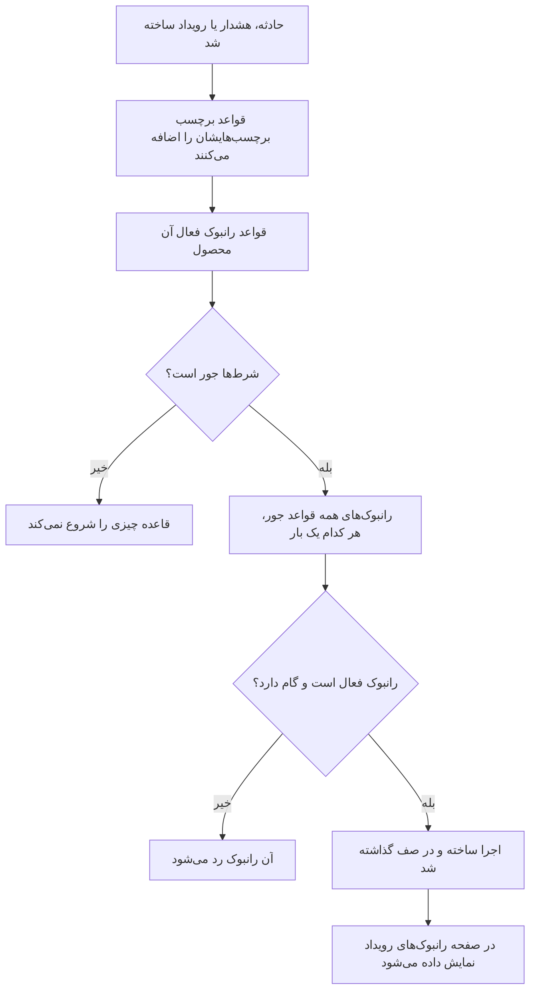

# قواعد رانبوک

قواعد رانبوک وقتی یک **حادثه**، یک **هشدار** یا یک **رویداد تعمیر و نگهداری زمان‌بندی‌شده** ساخته می‌شود رانبوک‌ها را خودکار شروع می‌کنند، تا کسی مجبور نباشد وسط یک قطعی اجرای آن‌ها را به خاطر بسپارد. هر محصول در منوی **قواعد** خودش صفحه قواعد خودش را دارد:

- حوادث → قواعد → **قواعد رانبوک**
- هشدارها → قواعد → **قواعد رانبوک**
- تعمیر و نگهداری زمان‌بندی‌شده → قواعد → **قواعد رانبوک**

هر سه صفحه همان نوع قاعده را ویرایش می‌کنند و فقط قواعد همان محصول را نشان می‌دهند.

:::cards
- [ساختن یک قاعده رانبوک](#ساختن-یک-قاعده-رانبوک): چهار گام: یک نام، شرط‌ها و رانبوک‌هایی که باید شروع شوند.
- [شرط‌ها](#شرطها): هر معیار و عملگری که یک قاعده می‌تواند به کار ببرد.
- [منطق تطبیق](#منطق-تطبیق): چند قاعده، شرط‌های مانیتور و قواعد برچسب.
- [نمونه‌ها](#نمونهها): سه قاعده برای کپی کردن.
:::

## قاعده چگونه رانبوک را شروع می‌کند



وقتی قاعده‌ای فعال می‌شود، برای هر رانبوکی که نام می‌برد:

1. رانبوک بارگذاری می‌شود.
2. گام‌هایش به‌صورت یک **تصویر لحظه‌ای** روی یک اجرای تازه رانبوک کپی می‌شوند.
3. اجرا در صف worker رانبوک گذاشته می‌شود.
4. اجرا به موجودیت منبع وصل می‌شود: در صفحه **رانبوک‌ها** در حادثه، هشدار یا رویداد تعمیر و نگهداری زمان‌بندی‌شده و در فهرست **اجراها** در رانبوک نمایش داده می‌شود.

همه اجراها را، چه قاعده‌ای شروعشان کرده باشد چه نه، در **رانبوک‌ها → اجراها** می‌بینید، با پالایش بر اساس وضعیت، رانبوک یا تاریخ شروع.

## پیش از شروع

- **رانبوکی که بتواند اجرا شود.** باید دست‌کم یک گام داشته باشد و **اجرای این رانبوک** در صفحه **تنظیمات** آن روشن باشد. [نوشتن یک رانبوک](/docs/runbooks/authoring) را ببینید.
- **مجوز مدیریت قواعد.** Project Owner، Project Admin و Runbook Admin قواعد رانبوک می‌سازند، و هر کسی هم که مجوز **Create Runbook Rule** دارد.

## ساختن یک قاعده رانبوک

:::steps
### قواعد رانبوک را باز کنید

در **حوادث**، **هشدارها** یا **تعمیر و نگهداری زمان‌بندی‌شده**، **قواعد → قواعد رانبوک** را باز کنید و روی **ساخت Runbook Rule** کلیک کنید.

### به قاعده نام بدهید

در **اطلاعات پایه** یک **نام** وارد کنید، مثلاً «شروع failover پایگاه داده برای حادثه‌های پایگاه داده»، و در صورت تمایل **توضیحات**.

### شرط اضافه کنید

در **معیار تطبیق** روی **افزودن شرط** کلیک کنید، یک معیار و یک عملگر انتخاب کنید و مقدار را وارد یا انتخاب کنید. در صورت نیاز شرط‌های بیشتری اضافه کنید و **تطبیق با همه** یا **تطبیق با هر یک** را انتخاب کنید. برای شروع رانبوک‌ها روی هر رویداد تازه از این نوع، هیچ شرطی اضافه نکنید.

### رانبوک‌ها را انتخاب کنید

در **رانبوک‌ها** یک یا چند **رانبوک‌هایی که باید شروع شوند** انتخاب کنید و روی **ساخت Runbook Rule** کلیک کنید. قاعده به‌محض ساخته شدن فعال است و با وضعیت **فعال** در فهرست نمایش داده می‌شود.
:::

## ساختار یک قاعده

| فیلد | هدف |
| --- | --- |
| **نام** | برچسبی کوتاه و خوانا برای قاعده. |
| **توضیحات** | زمینه اختیاری برای هم‌تیمی‌ها. |
| **فعال** | برای قاعده تازه روشن است. برای متوقف کردن قاعده بدون حذف آن، در فرم ویرایش قاعده خاموشش کنید. |
| **شرط‌ها** | آنچه قاعده با آن جور می‌شود، در گام **معیار تطبیق**. برای جور شدن با هر رویداد از نوع خودش خالی‌اش بگذارید. |
| **رانبوک‌هایی که باید شروع شوند** | یک یا چند رانبوک که وقتی قاعده فعال می‌شود شروع می‌شوند. |

## شرط‌ها

هر شرط یک چیز از حادثه، هشدار یا رویداد تعمیر و نگهداری زمان‌بندی‌شده را با مقداری که شما می‌دهید مقایسه می‌کند. قاعده رانبوک همان معیارهای قواعد دیگر آن محصول را پیشنهاد می‌کند: یک قاعده رانبوک برای حادثه‌ها روی همان چیزهایی جور می‌شود که یک قاعده حریم خصوصی یا آنکال برای حادثه‌ها.

| معیار | چه چیزی را بررسی می‌کند |
| --- | --- |
| **مانیتورها** | مانیتورهایی که حادثه یا رویداد تعمیر و نگهداری زمان‌بندی‌شده بر آن‌ها اثر می‌گذارد، یا مانیتوری که هشدار را ایجاد کرده است. |
| **شدت‌های حادثه** / **شدت‌های هشدار** | شدت حادثه یا هشدار. رویدادهای تعمیر و نگهداری زمان‌بندی‌شده شدت ندارند، پس قواعدشان آن را پیشنهاد نمی‌کنند. |
| **برچسب‌های حادثه** / **برچسب‌های هشدار** / **برچسب‌های رویداد** | برچسب‌های خود حادثه، هشدار یا رویداد، از جمله آن‌هایی که قواعد برچسب هنگام ساخت اضافه کرده‌اند. |
| **برچسب‌های مانیتور** | برچسب‌های مانیتورهای آن. برای اجرای یک رانبوک فقط در یک محیط، به مانیتورهایتان برچسب `production` یا `staging` بزنید. |
| **عنوان حادثه** / **عنوان هشدار** / **عنوان رویداد** | عنوان آن. |
| **توضیحات حادثه** / **توضیحات هشدار** | توضیحات آن (برای رویدادها نام معیار **توضیحات رویداد** است). |
| **نام مانیتور** / **توضیحات مانیتور** | نام یا توضیحات مانیتورهای آن. |

برای هر شرط یک عملگر انتخاب کنید:

- یک معیار فهرستی — **مانیتورها**، شدت‌ها و برچسب‌ها — برای مقدارهای انتخاب‌شده از **یکی از این‌ها را دارد**، **همه این‌ها را دارد** یا **هیچ‌یک از این‌ها را ندارد** استفاده می‌کند.
- یک معیار متنی از **شامل است** (شرط تازه با آن شروع می‌شود)، **شامل نیست**، **مساوی است با**، **مساوی نیست با**، **شروع می‌شود با**، **پایان می‌یابد با**، یا **با الگو مطابقت دارد** / **با الگو مطابقت ندارد** برای یک عبارت باقاعده بدون حساسیت به بزرگی و کوچکی حروف یا یک نویسه عام `*` استفاده می‌کند. مقایسه‌های متنی به بزرگی و کوچکی حروف حساس نیستند.

با دو شرط یا بیشتر، **تطبیق با همه** (هر شرط باید درست باشد) یا **تطبیق با هر یک** (دست‌کم یکی باید درست باشد) را انتخاب کنید.

## منطق تطبیق

- قاعده‌ای بدون شرط روی هر رویداد از نوع خودش اعمال می‌شود (یک قاعده سراسری «همیشه اجرا کن»).
- چند قاعده می‌توانند با یک رویداد جور شوند. هر تطبیق فعال می‌شود و اجتماع رانبوک‌هایشان اجرا می‌شود: هر رانبوک اجرای خودش را می‌گیرد، و رانبوکی که دو قاعده جور نامش را می‌برند یک بار اجرا می‌شود.
- شرط‌های مانیتور یک مانیتور در هر بار بررسی می‌شوند. با **تطبیق با همه**، «**نام مانیتور** شامل `api` است» و «**برچسب‌های مانیتور** یکی از _Production_ را دارد» به یک مانیتور نیاز دارند که هر دو را برآورده کند، نه یک مانیتور برای هر کدام.
- قواعد رانبوک پس از قواعد برچسب اجرا می‌شوند، پس برچسبی که یک قاعده برچسب روی حادثه، هشدار یا رویداد تازه می‌گذارد می‌تواند یک رانبوک را شروع کند.
- حادثه یا هشداری که از همان ابتدا برطرف‌شده ساخته شود هیچ رانبوکی را شروع نمی‌کند: پیش از ثبت شدن تمام شده بود. [حادثه‌ای که از پیش تأییدشده یا برطرف‌شده اعلام می‌شود](/docs/incidents/declaring-incidents#حادثهای-که-از-پیش-تأییدشده-یا-برطرفشده-اعلام-میشود) را ببینید.
- شرطی روی شدت محصولی دیگر — مثلاً **شدت‌های هشدار** در یک قاعده حادثه — هرگز درست نمی‌شود، پس API از ذخیره آن خودداری می‌کند.
- قواعد یک بار، هنگام ساخته شدن رویداد، ارزیابی می‌شوند. ویرایش بعدی عنوان، شدت یا برچسب‌های یک حادثه قواعد را دوباره فعال نمی‌کند.

## نمونه‌ها

### failover پایگاه داده برای حادثه‌های پایگاه داده

```text
Name:        Start DB failover for DB incidents
Trigger:     Incident
Conditions:  Incident Title matches pattern (?:^|\b)(db|database|postgres|mysql|mongo)
Runbooks:    [DB failover playbook, Notify DBA team]
```

این هر بار که حادثه‌ای با «db»، «database»، «postgres» و مانند آن در عنوانش ساخته شود، دو اجرای رانبوک می‌سازد.

### فقط برای حادثه‌های بحرانی محیط production

```text
Name:        Flush the CDN cache for critical production incidents
Trigger:     Incident
Conditions:  Match all
             Monitor Labels has any of Production
             Incident Severities has any of Critical
Runbooks:    [Flush CDN cache]
```

روی یک حادثه بحرانی در مانیتوری با برچسب _Production_ اجرا می‌شود، و روی هیچ چیز در staging.

### قاعده نظافتی که همیشه اجرا می‌شود

```text
Name:        Always-run pre-flight check
Trigger:     Incident
Conditions:  (none)
Runbooks:    [Capture pre-incident state]
```

روی هر حادثه فعال می‌شود: برای ثبت تصویرهای لحظه‌ای از وضعیت سیستم، متریک‌ها و مانند آن برای پس‌کاوی به کار می‌آید.

## رانبوک‌های غیرفعال

اگر قاعده‌ای نام رانبوکی را ببرد که خاموش است (**اجرای این رانبوک** در صفحه **تنظیمات** رانبوک خاموش است، `isEnabled = false`)، قاعده همچنان جور می‌شود اما اجرای رانبوک رد می‌شود. برای ادامه، کلید را دوباره روشن کنید. رانبوکی که گامی ندارد هم به همین شکل رد می‌شود.

## آزمودن یک قاعده

پیش از اعتماد به یک قاعده در production، یک حادثه آزمایشی (یا هشدار آزمایشی) بسازید که شرط‌های قاعده را برآورده کند و بررسی کنید که رانبوک‌های مورد انتظار در صفحه **رانبوک‌ها** در آن رویداد نمایش داده می‌شوند.

> [!NOTE]
> قواعد رانبوک فقط روی رویدادهای تازه عمل می‌کنند. برخلاف قواعد برچسب و مالکیت، نمی‌توان آن‌ها را [روی رکوردهای موجود اجرا کرد](/docs/configuration/run-rules-now): این کار رانبوک‌ها را برای حادثه‌هایی شروع می‌کرد که از قبل تمام شده‌اند.

## عیب‌یابی

:::details قاعده جور شد، اما هیچ رانبوکی اجرا نشد
به این ترتیب بررسی کنید:

- قاعده **فعال** است.
- هر رانبوک **اجرای این رانبوک** را در صفحه **تنظیمات** خود روشن دارد و دست‌کم یک گام ذخیره‌شده دارد.
- حادثه یا هشدار از همان ابتدا برطرف‌شده ساخته نشده است.
- اجرای رانبوک فقط در حال انتظار نیست: آن را از صفحه **رانبوک‌ها** در رویداد باز کنید. یک گام Manual یا یک تأیید **در انتظار شما** را نشان می‌دهد.
:::

:::details قاعده هرگز جور نمی‌شود
قواعد رویداد را همان‌طور که ساخته شده می‌بینند، با برچسب‌هایی که قواعد برچسب در همان لحظه اضافه کرده‌اند. برچسب، شدت یا عنوانی که بعداً تغییر کند دیده نمی‌شود. با چند شرط، **تطبیق با همه** را در برابر **تطبیق با هر یک** بررسی کنید و به یاد داشته باشید که همه شرط‌های مانیتور باید درباره یک مانیتور صدق کنند.
:::

:::details API قاعده را با «can only be used by» رد می‌کند
یک معیار شدت به یک محصول تعلق دارد. **شدت‌های هشدار** در یک قاعده حادثه، یا **شدت‌های حادثه** در یک قاعده هشدار، هرگز نمی‌توانند جور شوند، پس قاعده با پیامی مانند «Alert Severities can only be used by alert runbook rules.» رد می‌شود. آن شرط را حذف کنید. داشبورد فقط معیارهای خود هر محصول را پیشنهاد می‌کند.
:::

## گام‌های بعدی

:::cards
- [اجرای یک رانبوک](/docs/runbooks/running): وقتی قاعده‌ای اجرایی را شروع می‌کند پاسخ‌دهندگان چه می‌بینند.
- [نوشتن یک رانبوک](/docs/runbooks/authoring): رانبوک‌هایی را بنویسید که قواعدتان شروع می‌کنند.
- [اعلام یک حادثه](/docs/incidents/declaring-incidents): حادثه‌ها چگونه ساخته می‌شوند و قواعد چه زمانی آن‌ها را می‌بینند.
:::
