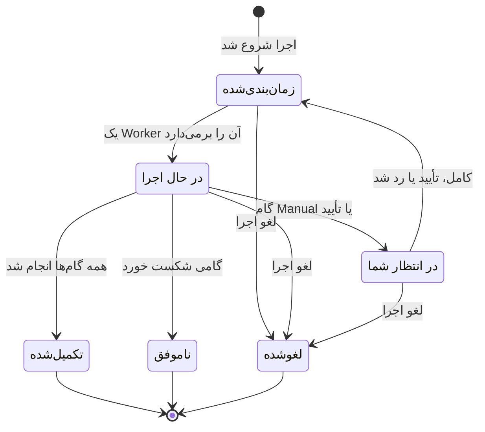

# اجرای یک رانبوک

هر بار اجرای یک رانبوک یک **اجرا** است: تصویر لحظه‌ای گام‌های رانبوک که به ترتیب پیش برده می‌شود و وضعیت و خروجی هر گام روی آن ثبت می‌شود. این صفحه برای کسانی است که پاسخ می‌دهند، اجراها را شروع می‌کنند و پیش می‌برند: اجرا چگونه شروع می‌شود، صفحه اجرا چه نشان می‌دهد، و گام‌ها را چگونه کامل، تأیید، رد و لغو کنید.

:::cards
- [شروع یک اجرا](#شروع-یک-اجرا): از یک حادثه، هشدار یا رویداد، یا از خود رانبوک.
- [نمای اجرا](#نمای-اجرا): هر گام در حین اجرا چه نشان می‌دهد.
- [کامل کردن، تأیید و رد کردن گام‌ها](#کامل-کردن-تأیید-و-رد-کردن-گامها): کدام گام چه زمانی تصمیم را می‌پذیرد.
- [عیب‌یابی](#عیبیابی): اجراهایی که شروع یا تمام نمی‌شوند.
:::

## اجرا چگونه پیش می‌رود

اجرای تازه **زمان‌بندی‌شده** است تا یک Worker آن را بردارد و **در حال اجرا** علامتش بزند. روی یک گام Manual، یا پس از گامی که به تأیید نیاز دارد، به‌صورت **در انتظار شما** متوقف می‌شود و به‌محض اینکه کسی اقدام کند به صف برمی‌گردد. اجرایی که منتظر یک نفر است هرگز منقضی نمی‌شود. اجرا به‌صورت **تکمیل‌شده**، **ناموفق** یا **لغوشده** پایان می‌یابد.

## شروع یک اجرا

اجرای رانبوک به سه شکل ساخته می‌شود:

1. **خودکار با یک قاعده**: یک [قاعده رانبوک](/docs/runbooks/rules) وقتی حادثه، هشدار یا رویداد تعمیر و نگهداری زمان‌بندی‌شده‌ای جور ساخته شود آن را شروع می‌کند. یک قاعده رفع خودکار مشکل هم می‌تواند آن را شروع کند؛ [AI SRE](/docs/ai/ai-sre) را ببینید.
2. **دستی از یک رویداد**: روی یک حادثه، هشدار یا رویداد تعمیر و نگهداری زمان‌بندی‌شده روی **اجرای رانبوک** کلیک کنید. اجرا به آن رویداد وصل می‌شود.
3. **دستی از صفحه رانبوک**: در صفحه **نمای کلی** یک رانبوک روی **Run Now** کلیک کنید. این اجرا به هیچ حادثه، هشدار یا رویداد تعمیر و نگهداری زمان‌بندی‌شده‌ای وصل نمی‌شود.

برای شروع دستی:

:::tabs
@tab از یک رویداد
1. حادثه، هشدار یا رویداد تعمیر و نگهداری زمان‌بندی‌شده را باز کنید و در آن به صفحه **رانبوک‌ها** بروید.
2. روی **اجرای رانبوک** کلیک کنید. پنجره **اجرای یک رانبوک** رانبوک‌های فعال پروژه را فهرست می‌کند.
3. کنار رانبوک روی **Run** کلیک کنید. اجرا در فهرست رویداد نمایش داده می‌شود: برای باز کردنش روی **مشاهده** کلیک کنید.
@tab از رانبوک
1. رانبوک را از **رانبوک‌ها** باز کنید.
2. در **نمای کلی** آن روی **Run Now** کلیک کنید.
3. صفحه اجرا باز می‌شود.
:::

شروع یک اجرا به Project Owner، Project Admin، Project Member، Runbook Admin یا Runbook Member، یا مجوز **Create Runbook Execution** نیاز دارد. Runbook Viewer و Viewer دکمه **Run Now** را قفل‌شده و همراه با دلیل می‌بینند. [دسترسی‌ها](/docs/runbooks/configuration#دسترسیها) را ببینید.

## نمای اجرا

یک اجرا را باز کنید تا چک‌لیستش را ببینید. بالای صفحه **وضعیت** اجرا، **Progress** آن (گام‌های انجام‌شده از کل گام‌ها)، **شروع شد** (زمان شروع) و **فعال‌شده توسط** (چه چیزی آن را شروع کرده) نمایش داده می‌شود. هر گام نشان می‌دهد:

- **نشان وضعیت** — در انتظار، در حال اجرا، در انتظار شما، انجام شد، نادیده‌گرفته‌شده، ناموفق یا لغوشده.
- **عنوان و توضیحات** — هنگام شروع اجرا از رانبوک کپی شده‌اند.
- **Output** (جمع‌شدنی) — stdout، مقدارهای بازگشتی، پاسخ‌های HTTP یا پاسخ هوش مصنوعی.
- **پیام خطا**، اگر گام شکست خورده باشد.
- روی گامی که اجرا منتظرش است: **Mark complete** (یک گام Manual) یا **Approve & continue** (گامی با **تأیید لازم است**) و **رد شدن**.
- تا وقتی اجرا متوقف است، **رد شدن** روی گام‌های خودکار بعدی که به تأیید نیاز ندارند.

تا وقتی اجرا در جریان است، صفحه هر ۳۰ ثانیه خودش تازه می‌شود. برای دیدن آخرین وضعیت در همان لحظه روی **تازه‌سازی** کلیک کنید.

## کامل کردن، تأیید و رد کردن گام‌ها

فقط گامی که اجرا منتظرش است می‌تواند کامل، تأیید یا رد شود تا اجرا ادامه یابد. یک گام Manual یا گامی با **تأیید لازم است** پیش از رسیدن اجرا به آن قابل تیک زدن یا رد کردن نیست: کارش متوقف کردن اجراست، پس فقط وقتی تصمیم را می‌پذیرد که اجرا آنجا باشد (برای تأیید: وقتی گام اجرا شده و خروجی‌اش را می‌بینید).

تا وقتی اجرا متوقف است، می‌توانید یک گام خودکار بعدی را هم که به تأیید نیاز ندارد رد کنید تا هنگام ادامه اجرا اجرا نشود. اجرا همچنان روی گامی که منتظر شماست متوقف می‌ماند. تا وقتی گام‌ها در حال اجرا هستند نمی‌توانید چیزی را رد کنید: صبر کنید تا اجرا متوقف شود، یا لغوش کنید. هر گام ثبت می‌کند چه کسی آن را کامل یا رد کرده است.

| گام | کامل یا تأیید کردن | رد کردن |
| --- | --- | --- |
| گامی که اجرا منتظرش است | بله | بله |
| یک گام خودکار بعدی بدون **تأیید لازم است** | خیر | بله، تا وقتی اجرا متوقف است |
| یک گام Manual بعدی، یا گامی با **تأیید لازم است** | خیر | خیر |
| هر گامی در حالی که گام‌ها در حال اجرا هستند | خیر | خیر |

کامل کردن، تأیید، رد کردن و لغو همان نقش‌های شروع یک اجرا را لازم دارند، یا مجوز **Edit Runbook Execution** را.

## درهم‌آمیختن گام‌های دستی و خودکار

روند کلاسیک:

| # | گام | چه پیش می‌آید |
| --- | --- | --- |
| 1 | Bash: ثبت وضعیت سیستم | به‌محض شروع اجرا روی Runner خودش اجرا می‌شود. |
| 2 | Manual: «با بنر صفحه وضعیت به مشتریان اطلاع دهید.» | اجرا متوقف می‌شود تا کسی روی **Mark complete** کلیک کند. |
| 3 | HTTP request: خبر کردن DBA از راه PagerDuty | روی Worker اجرا می‌شود. |
| 4 | Manual: «تأیید کنید که پایگاه داده ثانویه اکنون اصلی است.» | اجرا دوباره متوقف می‌شود. |
| 5 | HTTP request: ارسال پیام رفع وضعیت به یک وب‌هوک Slack | اجرا می‌شود و اجرا **تکمیل‌شده** می‌شود. |

گام‌های ۲ و ۴ اجرا را متوقف می‌کنند تا کسی تیکشان بزند. گام‌های ۱، ۳ و ۵ خودکار اجرا می‌شوند. کل اجرا یک اجرا، یک خط زمانی و یک منبع حقیقت است.

## لغو یک اجرا

در صفحه اجرا روی **لغو اجرا** کلیک کنید. وضعیت `Cancelled` می‌شود و هیچ گام بعدی شروع نمی‌شود. گامی که از قبل در حال اجراست قطع نمی‌شود، اما نتیجه‌اش ثبت نمی‌شود: گام `Cancelled` می‌ماند. کارهایی که هنوز منتظر یک Runner هستند لغو می‌شوند؛ Runner‌ای که از قبل اسکریپتی را اجرا می‌کند آن را تمام می‌کند، اما نتیجه پذیرفته نمی‌شود.

## محدودیت‌های خروجی

خروجی هر گام به **۵۰ KB** محدود است تا اسکریپتی افسارگسیخته پایگاه داده را باد نکند. خروجی طولانی‌تر با یک نشانگر بریده می‌شود. اگر به خروجی‌های بزرگ‌تر نیاز دارید، آن‌ها را از اسکریپت در فضای ذخیره‌سازی اشیا یا یک سامانه لاگ بنویسید و URL را در خروجی بگذارید.

## اجرای دوباره یک رانبوک

اجرا رکوردی یک‌باره و تغییرناپذیر است. برای اجرای دوباره، روی یک اجرای پایان‌یافته روی **اجرای دوباره**، یا روی رانبوک روی **Run Now** کلیک کنید. هر دو یک اجرای تازه از گام‌های فعلی رانبوک می‌سازند که به هیچ رویدادی وصل نیست. برای اجرای دوباره روی یک حادثه، از **اجرای رانبوک** در صفحه **رانبوک‌ها** در خود آن حادثه استفاده کنید. اجرای اصلی برای رد حسابرسی بدون تغییر می‌ماند.

## یافتن اجراهای گذشته

| کجا | چه نشان می‌دهد |
| --- | --- |
| صفحه **اجراها** در یک رانبوک | همه اجراهای آن رانبوک، با پالایش وضعیت و تاریخ شروع و یک ستون **فعال‌شده توسط**. |
| **رانبوک‌ها → اجراها** | همه اجراهای همه رانبوک‌های پروژه. |
| صفحه **رانبوک‌ها** در یک حادثه، هشدار یا رویداد | اجراهای وصل‌شده به آن. نمای کلی رویداد هم به‌محض وجود اجرا آن‌ها را نشان می‌دهد. |

## عیب‌یابی

:::details Run Now قفل است
نقش شما رانبوک‌ها را می‌خواند اما اجرایشان نمی‌کند: دکمه می‌گوید «شما اجازهٔ شروع اجرای رانبوک‌ها در این پروژه را ندارید.» نقش Runbook Member یا مجوز **Create Runbook Execution** را درخواست کنید.
:::

:::details شروع یک اجرا با «Runbook is disabled» یا «Runbook has no steps to run» شکست می‌خورد
کلید **اجرای این رانبوک** رانبوک در صفحه **تنظیمات** آن خاموش است، یا هیچ گام ذخیره‌شده‌ای ندارد. کلید را روشن کنید، یا گام اضافه کنید، و روی **Save Steps** کلیک کنید.
:::

:::details گامی شکست خورد چون Runner یا اعتبارنامه ندارد
پیام برای نمونه این است: «Bash step is missing a Runner. Pick one under Runbooks → Runners.» گام بدون **Runner** ذخیره شده، یا یک گام SSH یا Kubernetes بدون **Credential**. صفحه **گام‌ها** در رانبوک را باز کنید، آنچه گام کم دارد را انتخاب کنید، روی **Save Steps** کلیک کنید و رانبوک را دوباره اجرا کنید.
:::

:::details گامی شکست خورد چون هیچ عامل رانبوکی آن را برنداشت
پیام این است: «No runbook agent picked up this step before the wait window expired.» Runner گام کار را در مهلت claim timeout خود برنداشت. در **رانبوک‌ها → Runnerها** بررسی کنید که Runner **متصل** باشد و **رانبوک‌ها را اجرا می‌کند** روشن باشد. [عامل‌های رانبوک](/docs/runbooks/agents#عیبیابی) را ببینید.
:::

:::details اجرا ساعت‌هاست منتظر است
اجرایی که منتظر یک نفر است هرگز منقضی نمی‌شود. آن را باز کنید و روی گامی که **در انتظار شما** را نشان می‌دهد اقدام کنید، یا روی **لغو اجرا** کلیک کنید.
:::

:::details گامی می‌گوید ممکن است بخشی از آن اجرا شده باشد
OneUptime Worker‌ای که گام را اجرا می‌کرد دوباره راه‌اندازی شد یا از پاسخ دادن بازماند، و اجرا به‌جای گیر کردن، ناموفق علامت خورد. پیش از اجرای دوباره رانبوک، سامانه هدف را بررسی کنید.
:::

## گام‌های بعدی

:::cards
- [نوشتن یک رانبوک](/docs/runbooks/authoring): جایی که یک نفر باید تصمیم بگیرد گام‌های Manual و تأیید اضافه کنید.
- [قواعد رانبوک](/docs/runbooks/rules): اجراها را روی حادثه‌های تازه خودکار شروع کنید.
- [عامل‌های رانبوک](/docs/runbooks/agents): Runnerهایی را که گام‌هایتان نیاز دارند آنلاین نگه دارید.
:::
