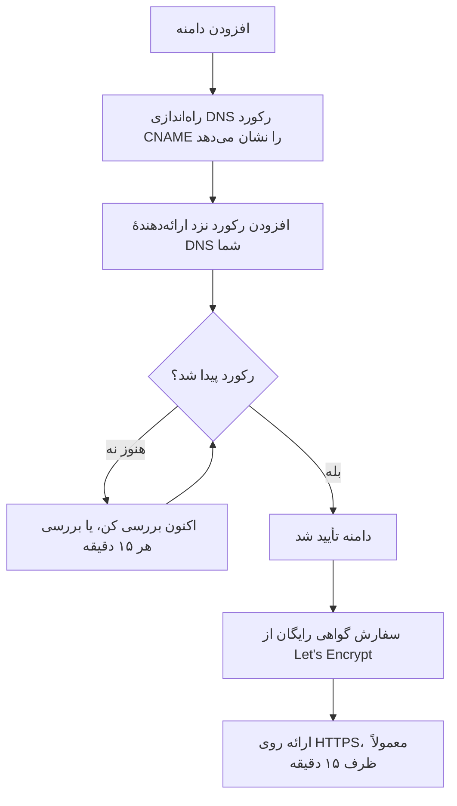

# برندینگ و دامنه‌های صفحه وضعیت

صفحه وضعیت شما تنها نمایی از OneUptime است که مشتریانتان به آن نگاه می‌کنند، پس باید شبیه خودتان باشد و روی دامنهٔ خودتان، مثل `status.yourcompany.com`، قرار گیرد. این صفحه صفحهٔ **برندینگ** را کارت به کارت مرور می‌کند، سپس صفحه را به دامنهٔ شما می‌برد: دامنه را اضافه کنید، یک رکورد DNS اضافه کنید، و گواهی SSL رایگان خودش در پی می‌آید.

:::cards
- [صفحهٔ برندینگ](#صفحهٔ-برندینگ): لوگو، عنوان، فاوآیکن، پیوندها، پاورقی، رنگ‌ها و زبان‌ها.
- [HTML، CSS و JavaScript سفارشی](#html-css-و-javascript-سفارشی): هر چیزی که کنترل‌های داخلی پوشش نمی‌دهند.
- [دامنه‌های سفارشی](#دامنههای-سفارشی): نام میزبان خودتان، با یک گواهی رایگان.
- [ستون وضعیت](#خواندن-ستون-وضعیت-دامنه): هر دامنه در مسیر رسیدن به HTTPS کجاست.
:::

## هر کنترل برندینگ کجاست

یک صفحه وضعیت را باز کنید: بخش **برندینگ** منوی کناری آن سه گزینه دارد:

| صفحه | آنچه آنجا تنظیم می‌کنید |
| ---- | ------------------ |
| **برندینگ** | لوگو و تصویر جلد، عنوان و توضیحات صفحه، فاوآیکن، پیوندهای سربرگ، توضیحات صفحهٔ نمای کلی، سطر حق نشر و پیوندهای پاورقی. بسته‌شده زیر **تنظیمات بیشتر**: رنگ‌های نمودار تاریخچه، زبان‌ها و نمایه‌سازی موتورهای جستجو. |
| **دامنه‌های سفارشی** | دامنهٔ خودتان، رکورد DNS آن و گواهی SSL رایگانش. |
| **HTML، CSS و JavaScript** | HTML سربرگ، HTML پاورقی، CSS سفارشی، JavaScript سفارشی. |

سه چیز که شبیه برندینگ به نظر می‌رسند به‌جای آن در **صفحات وضعیت → صفحهٔ شما → پیشرفته → تنظیمات پیشرفته** (`{id}/settings`) هستند، چون تعیین می‌کنند صفحه چه چیزی نشان دهد، نه اینکه چه شکلی داشته باشد: درصد کلی زمان کارکرد، اینکه کدام وضعیت‌های مانیتور به ضرر زمان کارکرد شمرده شوند، و سطر «Powered by OneUptime». هر سه، سطرهای کارت **آنچه صفحه وضعیت شما نشان می‌دهد** در آنجا هستند.

برندینگ پیش‌تر میان نماهای جداگانهٔ **برندینگ پایه**، **سربرگ**، **پاورقی**، **صفحهٔ نمای کلی** و **زبان‌ها** تقسیم شده بود. نشانی‌های قدیمی آن‌ها (`{id}/header-style`، `{id}/footer-style`، `{id}/overview-page-branding` و `{id}/languages`) اکنون صفحهٔ **برندینگ** را باز می‌کنند، پس نشانک‌ها و پیوندهای قدیمی همچنان کار می‌کنند.

## صفحهٔ برندینگ

**صفحات وضعیت → صفحهٔ شما → برندینگ → برندینگ** (`{id}/branding`). هر کارت جداگانه ذخیره می‌شود. پس از لوگو، عنوان و فاوآیکن، کارت‌ها صفحه وضعیت شما را از بالا به پایین دنبال می‌کنند: پیوندهای سربرگ، متن بالای نمای کلی، سپس پاورقی. آنچه کمتر کسی تغییرش می‌دهد، در پایین زیر **تنظیمات بیشتر** بسته شده است.

### لوگو و تصویر جلد

نخستین کارت، **لوگو و تصویر جلد**، دکمهٔ **Edit Images** دارد که دو گام را باز می‌کند:

| گام | فیلدها |
| ---- | ------ |
| **لوگو** | بارگذاری لوگو (متن راهنما `Upload logo`) و **Logo Alt Text** (متن راهنما `Logo of My Company`). اگر متن جایگزین را خالی بگذارید، عنوان صفحه وضعیت به‌جای آن به کار می‌رود. |
| **تصویر جلد** | **جلد**، یک بارگذاری (متن راهنما `Upload cover image`) برای بنر پهن پشت سربرگ، و **Cover Image Alt Text**. اگر تصویر جلد فقط تزئینی است، متن جایگزین را خالی بگذارید. |

لوگو، تصویر جلد و فاوآیکن فایل‌هایی‌اند که در پروژهٔ خود صفحه وضعیت بارگذاری شده‌اند، و این موضوع هر بار که یکی از آن‌ها ذخیره شود بررسی می‌شود؛ چه از داشبورد، چه از API، Terraform یا یک گردش‌کار. فایلی که در پروژهٔ دیگری بارگذاری شده با همان پیامی رد می‌شود که فایلی که دیگر وجود ندارد می‌گیرد: «The logo's file could not be found. Upload the logo again.»، «The cover image's file could not be found. Upload the cover image again.» یا «The favicon's file could not be found. Upload the favicon again.» بارگذاری دوبارهٔ تصویر از همین صفحه مشکل را برطرف می‌کند.

صفحه وضعیت شما فقط تصاویر پروژهٔ خودش را نشان می‌دهد؛ تصویری را که نمی‌تواند نشان دهد کنار می‌گذارد، گویی صفحه تصویری نداشته است. داشبورد، API و Terraform هم تصاویر صفحه را همین‌طور می‌خوانند: تصویری از پروژهٔ دیگر به‌صورت «بدون تصویر» برمی‌گردد. ایمیل‌هایی که صفحه می‌فرستد (به مشترکان، و به کاربران خصوصی دربارهٔ ورودشان) لوگوی آن را همین‌طور نشان می‌دهند: لوگویی که صفحه نمی‌تواند نشان دهد از آن‌ها هم کنار گذاشته می‌شود، به‌جای اینکه به‌صورت تصویری شکسته نشان داده شود.

### عنوان، توضیحات و فاوآیکن

- **عنوان و توضیحات**: کارت یادآوری می‌کند که این برای SEO هم به کار می‌رود. **ویرایش**، **عنوان صفحه** (متن راهنما `Please enter page title here.`) و **توضیحات صفحه** را باز می‌کند. موتورهای جستجو و پیش‌نمایش پیوندها این‌ها را نشان می‌دهند، پس آن‌ها را برای مشتری بنویسید، نه برای تیمتان.
- **Favicon**: **Edit Favicon** بارگذاری **Favicon** را باز می‌کند: نماد کوچکی که در زبانهٔ مرورگر دیده می‌شود.

### پیوندهای سربرگ

جدول **پیوندهای سربرگ** پیوندهای سربرگ صفحه وضعیت را در خود دارد، مثل وب‌سایت، مستندات یا پورتال پشتیبانی شما. هر پیوند یک **عنوان** و یک **پیوند** (یک URL، با متن راهنمای `https://link.com`) دارد، و ترتیبشان را با کشیدن عوض می‌کنید. وقتی هیچ پیوندی نیست، جدول می‌گوید **هیچ پیوند سربرگ وضعیتی برای این صفحه وضعیت نیست**، و زیر آن **ساخت پیوند سربرگ صفحه وضعیت** قرار دارد.

### توضیحات صفحهٔ نمای کلی

**توضیحات صفحه نمای کلی** نخستین چیزی است که در نمای کلی صفحه وضعیت دیده می‌شود، بالای اعلامیه‌ها، وضعیت کلی و منابع شما. **ویرایش توضیحات** یک فیلد markdown باز می‌کند. از آن برای یک جملهٔ زمینه‌ساز استفاده کنید: این صفحه چه چیزی را پوشش می‌دهد و برای پشتیبانی کجا باید رفت. تصویری که در آن بگذارید به همهٔ بازدیدکنندگان صفحه نشان داده می‌شود.

### پاورقی

- **اطلاعات حق نشر**: **Edit Copyright** یک فیلد، **اطلاعات حق نشر**، را با متن راهنمای `Acme, Inc.` باز می‌کند.
- **پیوندهای پاورقی**: همان جفت **عنوان** و **پیوند** که پیوندهای سربرگ دارند، با ترتیبی که با کشیدن تعیین می‌شود. وقتی هیچ پیوندی نیست، می‌گوید «هیچ پیوند پاورقی وضعیتی برای این صفحه وضعیت نیست.»

پیوندهای سربرگ برای پیمایش‌اند؛ پیوندهای پاورقی برای جزئیات حقوقی، مثل اطلاعات قانونی، حریم خصوصی و شرایط استفاده.

### تنظیمات بیشتر

آخرین بخش صفحه زیر **تنظیمات بیشتر** بسته شده است، چون کمتر کسی آنچه را در آن است تغییر می‌دهد. وقتی بسته است، سربرگ آن نام چهار بخشش را می‌برد (**رنگ پیش‌فرض میله**، **قوانین رنگ نوار**، **زبان‌ها** و **نمایه‌سازی موتورهای جستجو**) و هر کدام را که با تنظیمات آغازین یک صفحه وضعیت تازه فرق دارد نشان می‌دهد: رنگ پیش‌فرض میله‌ای جز سبزی که هر صفحه با آن شروع می‌شود، هر قانون رنگ میله، زبان پیش‌فرضی جز انگلیسی، فهرست کوتاه‌تری از زبان‌ها، یا نمایه‌سازی موتورهای جستجوی خاموش. برای باز کردنش روی آن کلیک کنید: یک کارت است، با چهار بخش زیر هم، هر کدام با عنوان و دکمهٔ خودش، که با خط‌های جداکننده از هم جدا شده‌اند.

**رنگ‌های نمودار تاریخچه.** این‌ها تنها کنترل‌های رنگ داخلی در یک صفحه وضعیت‌اند.

- **رنگ پیش‌فرض میله نمودار تاریخچه**: **Edit Default Bar Color** انتخابگر **رنگ پیش‌فرض میله** را باز می‌کند. هر صفحه وضعیت تازه با سبز شروع می‌شود. وقتی قوانین رنگ میله دارید، این رنگِ روزی هم هست که هیچ قانونی با آن منطبق نشود. روزی که صفحه داده‌ای برایش ندارد همیشه خاکستری کشیده می‌شود.
- **Rules for Bar Colors of History Chart**: جدولی مرتب از قانون‌ها که ترتیبشان را با کشیدن تعیین می‌کنید. هر قانون **وقتی درصد زمان کارکرد بزرگ‌تر یا مساوی است با** و **آنگاه از این رنگ میله استفاده کن** را دارد؛ ستون‌های جدول `When Uptime Percent >=` و `Then, Bar Color is` را نشان می‌دهند. رنگ قانون تازه از پیش انتخاب شده است، رنگی که قانون‌های دیگر هنوز به کار نبرده‌اند؛ به‌جای آن رنگی را که می‌خواهید انتخاب کنید. ترتیب مهم است، پس قانون‌ها را به همان ترتیبی بچینید که می‌خواهید ارزیابی شوند. وقتی هیچ قانونی نیست، میلهٔ هر روز رنگ پایین‌ترین وضعیت مانیتور در آن روز را می‌گیرد.

اینکه نمودار چند روز را پوشش دهد اینجا تنظیم نمی‌شود. آن **تاریخچه زمان کارکرد** در کارت **آنچه صفحه وضعیت شما نشان می‌دهد** در **پیشرفته → تنظیمات پیشرفته** است، از ۱ تا ۹۰ روز. اینکه کدام وضعیت‌های مانیتور قطع به حساب آیند، **قطعی به حساب می‌آید** در همان سطر آن کارت است.

**زبان‌ها.** بخش **زبان‌ها** تعویض‌کنندهٔ زبانی را تنظیم می‌کند که بازدیدکنندگان در پاورقی صفحه می‌بینند. **ویرایش زبان‌ها** دو فیلد را باز می‌کند:

| فیلد | چه می‌کند |
| ----- | ------------ |
| **زبان پیش‌فرض** | زبانی که بازدیدکنندگانِ بار اول می‌بینند، انتخاب‌شده از فهرستی که نام هر زبان را به خود آن زبان و به انگلیسی می‌آورد (`Deutsch (German)`). پیش‌فرض آن انگلیسی است، و بازدیدکنندگان همیشه می‌توانند از پاورقی آن را عوض کنند. |
| **زبان‌های فعال** | یک انتخاب چندگانه با متن راهنمای `All languages`. اگر خالی بماند، همهٔ زبان‌های پشتیبانی‌شده پیشنهاد می‌شوند؛ اگر چند زبان انتخاب کنید، پاورقی فقط همان‌ها را فهرست می‌کند. |

OneUptime با هفده زبان عرضه می‌شود: انگلیسی، آلمانی، فرانسوی، اسپانیایی، ایتالیایی، پرتغالی، هلندی، دانمارکی، نروژی، سوئدی، روسی، ژاپنی، کره‌ای، چینی (ساده‌شده)، چینی (سنتی)، هندی و فارسی.

**نمایه‌سازی موتورهای جستجو.** یک کلید، **اجازه دادن به موتورهای جستجو برای نمایه‌سازی این صفحه وضعیت**، تعیین می‌کند که Google، Bing و دیگر موتورهای جستجو بتوانند صفحه را فهرست کنند یا نه. به‌طور پیش‌فرض روشن است. دکمهٔ **ویرایش** ندارد: کلید همان لحظه که تغییرش دهید ذخیره می‌شود. اگر خاموشش کنید، صفحه با `noindex, nofollow` (یک متاتگ robots و یک سربرگ `X-Robots-Tag`) ارائه می‌شود؛ هر کسی که پیوند را داشته باشد همچنان می‌تواند آن را باز کند. ممکن است چند هفته طول بکشد تا موتورهای جستجو صفحه‌ای را که پیش‌تر نمایه کرده‌اند کنار بگذارند.

> [!TIP]
> تا وقتی یک صفحه فقط داخلی است یا هنوز در حال راه‌اندازی است، **اجازه دادن به موتورهای جستجو برای نمایه‌سازی این صفحه وضعیت** را خاموش نگه دارید، تا صفحهٔ نیمه‌کاره‌ای برای نام تجاری شما در نتایج جستجو بالا نیاید.

## درصد زمان کارکرد و وضعیت‌های قطعی

هر دو در سطر **تاریخچه زمان کارکرد** کارت **آنچه صفحه وضعیت شما نشان می‌دهد** در **صفحات وضعیت → صفحهٔ شما → پیشرفته → تنظیمات پیشرفته** (`{id}/settings`) هستند. دکمهٔ **ویرایش** ندارند: هر کدام همان لحظه که تغییرش دهید ذخیره می‌شود.

- **نمایش درصد کلی زمان کارکرد**: یک کلید، به‌طور پیش‌فرض خاموش. تا وقتی روشن است، **دقت** در کنار آن تعیین می‌کند درصد چند رقم اعشار نشان دهد: `99%`، `99.9%`، `99.99%` (پیش‌فرض) یا `99.999%`. در OneUptime Cloud، روشن کردن درصد به پلن **Scale** نیاز دارد؛ دقت آن در همهٔ پلن‌ها قابل تغییر است.
- **قطعی به حساب می‌آید**: وضعیت‌های مانیتور، به‌صورت نشان‌های رنگی، که زمانشان در این صفحه به ضرر زمان کارکرد شمرده می‌شود. اینجاست که تصمیم می‌گیرید، مثلاً، وضعیت «دچار افت» به ضرر زمان کارکرد شمرده شود یا نه. دست‌کم یک وضعیت انتخاب‌شده می‌ماند.

این‌ها پیش‌تر دو کارت جداگانه بودند، **درصد کلی زمان کارکرد** و **وضعیت‌های مانیتور در حالت قطعی**، هر کدام پشت یک دکمهٔ **ویرایش**. برای بقیهٔ کارت، [برگزیدن آنچه روی صفحه نشان داده می‌شود](/docs/status-pages/index#برگزیدن-آنچه-روی-صفحه-نشان-داده-میشود) را ببینید.

## HTML، CSS و JavaScript سفارشی

**صفحات وضعیت → صفحهٔ شما → برندینگ → HTML، CSS و JavaScript** (`{id}/custom-code`) چهار کارت دارد که هر کدام جداگانه ویرایش و در یک ستون از صفحه وضعیت ذخیره می‌شود:

| کارت | ستون | چه چیزی در آن است |
| ---- | ------ | ------------- |
| **HTML سربرگ** | `headerHTML` | HTML افزوده‌شده به سربرگ صفحه (متن راهنما `Insert Custom HTML here.`). |
| **HTML پاورقی** | `footerHTML` | HTML افزوده‌شده به پاورقی صفحه. |
| **CSS سفارشی** | `customCSS` | سبک‌های کل صفحه (متن راهنما `Insert Custom CSS here.`). |
| **JavaScript سفارشی** | `customJavaScript` | اسکریپتی که صفحه اجرا می‌کند (متن راهنما `Insert Custom JavaScript here.`). |

> [!IMPORTANT]
> HTML، CSS و JavaScript سفارشی فقط روی یک دامنهٔ سفارشی تأییدشده ارائه می‌شوند. روی نشانی پیش‌فرض `/status-page/:id` خاموش‌اند، چون آن نشانی همان origin ای را دارد که کاربرانِ واردشده به OneUptime از آن استفاده می‌کنند.

در OneUptime Cloud، افزودن یا تغییر هر یک از این‌ها به پلن **Growth** نیاز دارد. خالی کردن هر کدام در همهٔ پلن‌ها ممکن است، پس کد سفارشی‌ای که در دورهٔ آزمایشی اضافه شده همیشه قابل حذف است.

**انتخابگر پوسته وجود ندارد.** صفحه‌های وضعیت OneUptime هیچ تنظیمی برای پوسته یا رنگ برند ندارند: تنها کنترل‌های رنگ داخلی در هر جایی **رنگ پیش‌فرض میله** و قوانین رنگ میله‌های نمودار تاریخچه‌اند، زیر **تنظیمات بیشتر** در صفحهٔ **برندینگ**. فونت‌ها، رنگ‌های پس‌زمینه، رنگ‌های تأکیدی و تغییرات چیدمان همه از راه **CSS سفارشی** انجام می‌شوند. اگر دنبال فیلدی به نام «رنگ برند» بوده‌اید، پاسخ این است: چنین فیلدی نیست، و راهش همین کادر است.

> [!WARNING]
> JavaScript سفارشی در مرورگر بازدیدکنندگان شما اجرا می‌شود، روی صفحه‌ای که مردم درست وقتی بازش می‌کنند که فکر می‌کنند چیزی خراب شده است. آن را کوچک نگه دارید، هر چه را بارگذاری می‌کند تا جای ممکن خودتان میزبانی کنید، و پیش از تکیه بر آن آزمایشش کنید.

## دامنه‌های سفارشی

به‌طور پیش‌فرض، یک صفحه وضعیت از طریق نشانی پیش‌نمایشی که در صفحهٔ **نمای کلی** آن آمده در دسترس است. برای بردن آن به نام میزبان خودتان، به **صفحات وضعیت → صفحهٔ شما → برندینگ → دامنه‌های سفارشی** (`{id}/domains`) بروید.

کارت **دامنه‌های سفارشی** می‌گوید چه باید کرد: رکورد CNAME هر دامنه را به رکورد CNAME صفحه وضعیتِ نصب خود اشاره دهید، و OneUptime گواهی SSL دامنه را صادر و برایتان تمدید می‌کند. وقتی هنوز چیزی راه‌اندازی نشده، جدول می‌گوید **هیچ دامنه سفارشی‌ای یافت نشد**، و زیر آن **ساخت دامنه صفحه وضعیت** قرار دارد. جدول دو ستون دارد، **دامنه** و **وضعیت**، و فیلترهایی برای **دامنه**، **CNAME معتبر** و **SSL تأمین شد**.

بردن صفحه به دامنهٔ شما سه گام دارد، و فقط دو گام اول با شماست:

1. **دامنه را اضافه کنید**: یک زیردامنه و یکی از دامنه‌های تأییدشدهٔ شما.
2. **رکورد CNAME آن را اضافه کنید**، نزد ارائه‌دهندهٔ DNS خود. گفتگوی **راه‌اندازی DNS** به محض افزودن دامنه رکورد را نشان می‌دهد.
3. **گواهی SSL رایگان خودکار صادر می‌شود**، به محض اینکه رکورد پیدا شود. دکمه‌ای برای فشار دادن وجود ندارد.



### پیش از شروع

- **دامنهٔ اصلی باید تأییدشده باشد.** فهرست کشویی **دامنه** فقط دامنه‌هایی را نشان می‌دهد که زیر **تنظیمات پروژه → دامنه‌ها** تأیید شده‌اند، جایی که مالکیت یک دامنه را با یک رکورد TXT ثابت می‌کنید. پیوند **افزودن دامنه** کنار فیلد، آن صفحه را در زبانه‌ای تازه باز می‌کند.
- **نصب شما به یک رکورد CNAME صفحه وضعیت نیاز دارد.** OneUptime Cloud یکی دارد. در یک نصب خودمیزبان، آن را روی نام میزبانی تنظیم کنید که به سرور OneUptime شما اشاره می‌کند (یک رکورد A)، و مطمئن شوید سرور روی پورت ۸۰ پاسخ می‌دهد، جایی که Let's Encrypt آن را بررسی می‌کند. بدون آن، کارت و گفتگوی **راه‌اندازی DNS** به‌جای نشان دادن رکورد می‌گویند «Custom Domains not enabled for this OneUptime installation».

:::tabs
@tab Docker Compose
```ini title="config.env"
STATUS_PAGE_CNAME_RECORD=oneuptime.yourcompany.com
```
@tab Kubernetes
```yaml title="values.yaml"
statusPage:
  cnameRecord: oneuptime.yourcompany.com
```
:::

### افزودن یک دامنه

:::steps
#### باز کردن ساخت دامنه صفحه وضعیت

در **دامنه‌های سفارشی**، روی **ساخت دامنه صفحه وضعیت** کلیک کنید. گفتگو یک‌صفحه‌ای است.

#### وارد کردن زیردامنه

در **زیردامنه** (متن راهنما `status (leave blank for root)`) فقط برچسب را وارد کنید، مثل `status`، نه کل نام میزبان. برای استفاده از دامنهٔ ریشه (apex)، آن را خالی بگذارید یا `@` وارد کنید.

#### انتخاب دامنه

در **دامنه** (متن راهنما `Select domain`)، یکی از دامنه‌های تأییدشدهٔ خود را انتخاب کنید. دامنه‌ای که تأیید نکرده‌اید فهرست نمی‌شود، چون رد می‌شد.

#### نگه داشتن گواهی رایگان، یا بارگذاری گواهی خودتان

**فیلدهای بیشتر** بسته است و سربرگ آن می‌گوید دامنه از کدام گواهی استفاده خواهد کرد: «ما برای این دامنه یک گواهی SSL رایگان صادر می‌کنیم و آن را به‌طور خودکار تمدید می‌کنیم.» فقط برای استفاده از گواهی خودتان آن را باز کنید: **بارگذاری گواهی سفارشی** را روشن کنید، سپس **گواهی** و **کلید خصوصی گواهی** را در قالب PEM بچسبانید. آن‌وقت هر دو الزامی‌اند.

#### ساخت دامنه

روی **ساخت دامنه صفحه وضعیت** کلیک کنید. گفتگو بسته می‌شود و **راه‌اندازی DNS** دامنهٔ تازه، با رکوردی که باید اضافه کنید، باز می‌شود.
:::

نام کامل یک دامنه هنگام افزودن آن ثابت می‌شود، پس **ویرایش** فقط گواهی آن را تغییر می‌دهد. برای استفاده از زیردامنهٔ دیگری، آن دامنه را اضافه و دامنهٔ قدیمی را حذف کنید.

### راه‌اندازی DNS و تأیید

گفتگوی **راه‌اندازی DNS** رکوردی را که باید نزد ارائه‌دهندهٔ DNS خود اضافه کنید نشان می‌دهد، هر فیلد در یک سطر و هر کدام با یک دکمهٔ کپی:

| فیلد | چه وارد کنید |
| ----- | ------------- |
| **نوع** | `CNAME` |
| **نام** | دامنهٔ کاملی که اضافه کرده‌اید، برای نمونه `status.yourcompany.com` |
| **مقدار** | رکورد CNAME صفحه وضعیتِ نصب شما |

> [!NOTE]
> برای دامنهٔ ریشه، یعنی دامنه‌ای بدون زیردامنه، گفتگو یادداشتی اضافه می‌کند: بسیاری از ارائه‌دهندگان DNS در آنجا رکورد CNAME را مجاز نمی‌دانند. به‌جای آن از رکورد ALIAS، ANAME یا CNAME flattening ارائه‌دهندهٔ خود با همان مقدار استفاده کنید.

OneUptime هر ۱۵ دقیقه همهٔ دامنه‌های تأییدنشده را بررسی می‌کند و دامنهٔ شما را به محض زنده شدن رکوردش تأیید می‌کند، چه برگردید چه نه. برای بررسی فوری، روی **اکنون بررسی کن** کلیک کنید:

- **رکورد هنوز پیدا نشده است.** گفتگو باز می‌ماند و می‌گوید به دنبال کدام رکورد گشته است. ممکن است مدتی طول بکشد تا یک رکورد DNS تازه دیده شود: بعداً دوباره روی **اکنون بررسی کن** کلیک کنید، یا کار را به بررسی ۱۵ دقیقه‌ای بسپارید.
- **رکورد پیدا شد.** گفتگو می‌گوید «رکورد CNAME شما تأیید شد.» و اینکه در ادامه چه بر سر گواهی می‌آید. گواهی رایگان در همان لحظه سفارش داده می‌شود.

تا وقتی یک دامنه تأیید نشده و گواهی‌اش آماده نیست، سطر آن یک اقدام **راه‌اندازی DNS** دارد که همان گفتگو را باز می‌کند. در دامنهٔ تأییدشده‌ای که سفارش گواهی‌اش پیوسته شکست می‌خورد، یا گواهی‌اش منقضی شده، **اکنون بررسی کن** در آنجا دوباره سفارش می‌دهد و نشان می‌دهد چرا سفارش قبلی شکست خورد. این کار برای هر دامنه حداکثر هر ۱۵ دقیقه یک بار سفارش می‌دهد؛ در این فاصله OneUptime خودش به تلاش ادامه می‌دهد.

### گواهی‌های SSL

هر دامنهٔ سفارشی یک گواهی رایگان از Let's Encrypt می‌گیرد که خودکار صادر و تمدید می‌شود. لازم نیست روی چیزی کلیک کنید:

- **اکنون بررسی کن** به محض پیدا شدن رکورد، گواهی را سفارش می‌دهد. سپس گفتگو می‌گوید گواهی معمولاً ظرف ۱۵ دقیقه فعال می‌شود.
- وقتی بررسی ۱۵ دقیقه‌ای دامنه‌ای را تأیید کند، در همان بررسی گواهی دامنه را هم سفارش می‌دهد.
- تمدید خودکار است، مدت‌ها پیش از انقضای گواهی. اگر DNS شما هنگام تمدید یک گواهی لحظه‌ای پاسخ ندهد، گواهی همچنان ارائه می‌شود و در تلاشی بعدی تمدید می‌شود. بررسی ناموفق DNS هرگز گواهی‌ای را که هنوز معتبر است حذف نمی‌کند.

گواهی تازه ظرف ۱۵ دقیقه پس از صدور ارائه می‌شود، چون گواهی‌ها با همین فاصله روی سرورهایی که به دامنهٔ شما پاسخ می‌دهند نوشته می‌شوند. ستون وضعیت می‌گوید _معمولاً_ ظرف ۱۵ دقیقه: وقتی دامنه‌های زیادی هم‌زمان منتظرند، چندتا چندتا به آن‌ها رسیدگی می‌شود.

همهٔ گواهی‌های OneUptime از یک حساب مشترک Let's Encrypt سفارش داده می‌شوند، و Let's Encrypt محدود می‌کند که یک حساب در زمانی کوتاه چند سفارش تازه بدهد، و سفارش یک دامنه چند بار بتواند شکست بخورد. OneUptime همهٔ سفارش‌هایش را (دامنه‌های تازه، **اکنون بررسی کن**، صدورهای دوباره و تمدیدها) روی هم در این حدود نگه می‌دارد، و تمدیدها همیشه اولویت دارند، تا هجوم دامنه‌های تازه هرگز تمدیدهایی را که دامنه‌های موجود را آنلاین نگه می‌دارند معطل نکند.

اگر سفارشی شکست بخورد، ستون وضعیت دامنه همین را می‌گوید و دلیلش را در سطر زیر می‌آورد، و **اکنون بررسی کن** در **راه‌اندازی DNS** هم آن را نشان می‌دهد. OneUptime خودش به تلاش ادامه می‌دهد و پس از هر شکستِ پیاپی کمی بیشتر صبر می‌کند، تا دامنه‌ای که سفارشش پیوسته شکست می‌خورد سفارش‌هایی را که دامنه‌های دیگر لازم دارند تمام نکند. علت‌های رایج یک رکورد CAA روی دامنهٔ شماست که `letsencrypt.org` را مجاز نمی‌داند و، در نصب خودمیزبان، سروری که Let's Encrypt نمی‌تواند روی پورت ۸۰ به آن برسد؛ در نصب خودمیزبان، لاگ‌های worker جزئیات را دارند. پس از رفع علت، برای سفارش فوری دوباره روی **اکنون بررسی کن** کلیک کنید. این کار برای هر دامنه حداکثر هر ۱۵ دقیقه یک سفارش می‌دهد؛ کلیکی در این فاصله نشان می‌دهد سفارش قبلی چه شد.

اگر زیر **فیلدهای بیشتر** گواهی خودتان را بارگذاری کرده باشید، OneUptime ظرف ۱۵ دقیقه پس از ذخیره، به‌جای گواهی رایگان همان را ارائه می‌کند. پیش از انقضایش، با ویرایش دامنه جایگزین آن را بارگذاری کنید.

### صدور دوبارهٔ گواهی

تمدید خودکار حالت معمول را پوشش می‌دهد، اما گاهی همین حالا یک گواهی کاملاً تازه می‌خواهید: کلید خصوصی‌ای که ترجیح می‌دهید نگهش ندارید، گواهی‌ای که اسکنر خودتان از آن راضی نیست، یا دامنه‌ای که در سطح بالادستی تغییر کرده است. وقتی برای دامنه‌ای گواهی رایگان سفارش داده شد، سطر آن اقدام **Reissue SSL** را نشان می‌دهد.

گفتگوی آن، **Reissue SSL Certificate for this Status Page**، از Let's Encrypt برای دامنه یک گواهی تازه می‌خواهد و گواهی در حال ارائه را با آن جایگزین می‌کند. در این میان صفحه وضعیت شما با گواهی موجود آنلاین می‌ماند، و گواهی تازه ظرف ۱۵ دقیقه ارائه می‌شود. برای سفارش آن روی **Reissue SSL Certificate** کلیک کنید.

> [!NOTE]
> هر دامنه فقط هر ۲۴ ساعت یک بار می‌تواند دوباره صادر شود. Let's Encrypt محدود می‌کند که یک دامنه چند وقت یک بار صادر شود، و همهٔ گواهی‌های OneUptime از یک حساب مشترک سفارش داده می‌شوند، از جمله تمدیدهای خودکاری که صفحه‌های بقیه را آنلاین نگه می‌دارند. درون این بازه، گفتگو به‌جای سفارش دادن می‌گوید چقدر زمان مانده است. اگر در همان لحظه گواهی‌ای برای دامنه در حال سفارش باشد، یا سفارش‌های Let's Encrypt نصب فعلاً تمام شده باشد، گفتگو همین را می‌گوید، چیزی سفارش داده نمی‌شود و آن فشار دکمه صدور دوبارهٔ شما به حساب نمی‌آید.

این اقدام روی دامنه‌ای که از گواهی بارگذاری‌شدهٔ شما استفاده می‌کند ظاهر نمی‌شود: گواهی Let's Encrypt‌ای برای صدور دوباره وجود ندارد، پس به‌جای آن با ویرایش دامنه گواهی تازه‌ای بارگذاری کنید. پیش از سفارش نخستین گواهی دامنه هم ظاهر نمی‌شود؛ آن سفارش خودبه‌خود پس از تأیید رکورد CNAME انجام می‌شود.

همین دکمه، با همان محدودیت ۲۴ ساعته، روی دامنه‌های سفارشی داشبورد در **داشبوردها → داشبورد شما → برندینگ → دامنه‌های سفارشی** هم هست، که درست مثل دامنه‌های سفارشی صفحه وضعیت کار می‌کنند: [اشتراک‌گذاری و داشبوردهای عمومی](/docs/dashboards/sharing#دامنههای-سفارشی) را ببینید.

### خواندن ستون وضعیت دامنه

ستون **وضعیت** در یکی از هفت حالت می‌گوید هر دامنه در مسیر رسیدن به HTTPS کجاست. وقتی سفارشی شکست خورده باشد، دلیل آن در سطر زیر آمده است.

| آنچه ستون وضعیت می‌گوید | معنای آن |
| --------------------------- | ------------- |
| در انتظار DNS: رکورد CNAME را اضافه کنید. | رکورد CNAME هنوز پیدا نشده است. برای دیدن رکورد **راه‌اندازی DNS** را باز کنید، آن را نزد ارائه‌دهندهٔ DNS خود اضافه کنید، سپس روی **اکنون بررسی کن** کلیک کنید یا منتظر بررسی ۱۵ دقیقه‌ای بمانید. |
| در حال صدور گواهی رایگان، معمولاً ظرف ۱۵ دقیقه. | رکورد تأیید شده است و گواهی در حال سفارش یا نوشته شدن است. کاری لازم نیست. |
| هنوز نتوانسته‌ایم گواهی رایگان صادر کنیم. به تلاش ادامه می‌دهیم. | رکورد تأیید شده، اما سفارش گواهی آن به دلیلی که در سطر زیر آمده شکست خورده است. علت را رفع کنید، سپس **راه‌اندازی DNS** را باز کنید و برای سفارش فوری روی **اکنون بررسی کن** کلیک کنید. |
| گواهی منقضی شده است. برای تمدید آن به تلاش ادامه می‌دهیم. | گواهی دامنه منقضی شده، چون تمدیدهایش شکست خورده‌اند. برای تمدید فوری و دیدن علت، **راه‌اندازی DNS** را باز کنید و روی **اکنون بررسی کن** کلیک کنید. |
| گواهی صادر شد و به‌طور خودکار تمدید می‌شود. | تمام. دامنه گواهی خود را روی HTTPS ارائه می‌کند و OneUptime آن را تمدید می‌کند. |
| گواهی صادر شده است، اما تمدید آن ناموفق بود. به تلاش ادامه می‌دهیم. | دامنه همچنان گواهی معتبری ارائه می‌کند، اما آخرین تمدید آن به دلیلی که در سطر زیر آمده شکست خورده است. OneUptime مدت‌ها پیش از انقضای گواهی دوباره تلاش می‌کند. |
| از گواهی بارگذاری‌شده شما استفاده می‌کند. | رکورد تأیید شده و دامنه با گواهی‌ای که بارگذاری کرده‌اید ارائه می‌شود. |

:::details دامنه مدت‌ها پس از افزودن رکورد روی «در انتظار DNS» می‌ماند
بررسی کنید که نام رکورد، دامنهٔ کامل باشد، مثل `status.yourcompany.com`، و مقدار آن دقیقاً با رکورد CNAME نصب شما یکی باشد. در دامنهٔ ریشه، از رکورد ALIAS، ANAME یا CNAME مسطح‌شده استفاده کنید. سپس در **راه‌اندازی DNS** روی **اکنون بررسی کن** کلیک کنید.
:::

:::details ستون وضعیت می‌گوید نتوانسته گواهی رایگان صادر کند
به دنبال رکورد CAA‌ای روی دامنهٔ خود بگردید که `letsencrypt.org` را کنار گذاشته باشد، و در نصب خودمیزبان بررسی کنید که سرور شما روی پورت ۸۰ پاسخ دهد. علت را رفع کنید، سپس برای سفارش دوباره در **راه‌اندازی DNS** روی **اکنون بررسی کن** کلیک کنید.
:::

### چه کسی می‌تواند بررسی کند و دوباره صادر کند

**اکنون بررسی کن**، سفارش گواهی یک دامنه و **Reissue SSL** دامنه را تغییر می‌دهند، پس به مجوز ویرایش آن نیاز دارند: **Edit Status Page Domain**، یا نقشی که آن را دربر دارد (Project Owner، Project Admin، Project Member، Status Page Admin یا Status Page Member).

کسی که فقط می‌تواند دامنه را بخواند، مثل یک Viewer یا Status Page Viewer، همچنان ستون **وضعیت** و رکوردی را که باید در **راه‌اندازی DNS** اضافه شود می‌بیند. برای او **اکنون بررسی کن** و **Reissue SSL** قفل‌اند و می‌گویند به کدام مجوز نیاز دارد. OneUptime در هر حال بررسی همهٔ دامنه‌ها و سفارش گواهی‌شان را خودش ادامه می‌دهد.

همین دربارهٔ کلیدهای API هم صدق می‌کند. کلیدی که فقط می‌تواند دامنه‌های صفحه وضعیت را بخواند نمی‌تواند `verify-cname`، `order-ssl` یا `reissue-ssl` را روی `/status-page-domain` فراخوانی کند. اگر لازم است، **Read Status Page Domain** و **Edit Status Page Domain** را به آن بدهید.

## Powered by OneUptime

سطر «Powered by OneUptime» یک تنظیم برندینگ نیست. آخرین کلید کارت **آنچه صفحه وضعیت شما نشان می‌دهد** در **صفحات وضعیت → صفحهٔ شما → پیشرفته → تنظیمات پیشرفته** (`{id}/settings`) است: **نمایش نشان «Powered By OneUptime»**، که به‌طور پیش‌فرض روشن است. برای پنهان کردن این سطر خاموشش کنید؛ بی‌درنگ ذخیره می‌شود. در OneUptime Cloud، پنهان کردن آن به پلن **Scale** نیاز دارد.

## گام‌های بعدی

:::cards
- [نمای کلی صفحات وضعیت](/docs/status-pages/index): صفحه چه چیزی نشان می‌دهد، و چه کسی می‌تواند آن را ببیند.
- [منابع و گروه‌های صفحه وضعیت](/docs/status-pages/resources-and-groups): انتخاب کنید بازدیدکنندگان واقعاً چه چیزی روی صفحه می‌بینند.
- [مشترکان و اطلاعیه‌ها](/docs/status-pages/subscribers): ایمیل‌هایی که لوگوی شما را دارند و به دامنهٔ شما پیوند می‌دهند.
- [API عمومی](/docs/status-pages/public-api): صفحه را به‌صورت JSON بخوانید، روی دامنهٔ خودتان هم.
:::
