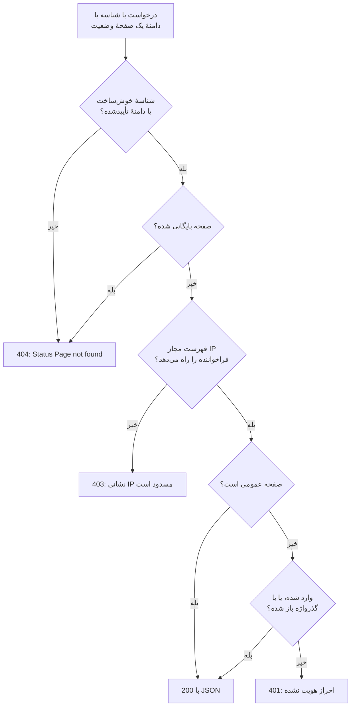

# API عمومی

هر صفحهٔ وضعیت به مجموعهٔ کوچکی از نقطه‌های پایانی JSON فقط‌خواندنی پاسخ می‌دهد: نمای کلی، زمان کارکرد، حادثه‌ها، اپیزودها، رویدادهای نگهداری زمان‌بندی‌شده و اطلاعیه‌هایش. این‌ها همان نقطه‌های پایانی‌ای هستند که خود صفحهٔ وضعیت بارگذاری می‌کند، پس دقیقاً همان چیزی را برمی‌گردانند که بازدیدکننده می‌بیند، و صفحهٔ عمومی به کلید API نیازی ندارد. از آن‌ها برای نمایش وضعیت در برنامهٔ خودتان، یک چت‌بات یا یک نمایشگر دیواری استفاده کنید.

:::cards
- [نقطه‌های پایانی](#نقطههای-پایانی): برای هر چیزی که صفحه نشان می‌دهد یک نقطهٔ پایانی.
- [خواندن نمای کلی](#خواندن-نمای-کلی): کل صفحه در یک درخواست، با curl، Node.js و Python.
- [زمان کارکرد برای یک بازهٔ تاریخ](#زمان-کارکرد-برای-یک-بازهٔ-تاریخ): زمان کارکرد هر منبع و گروه، تا ۹۰ روز.
- [خطاها](#خطاها): معنای هر کد وضعیت.
:::

## یک درخواست چگونه پاسخ می‌گیرد

هر درخواست، صفحهٔ وضعیت را با شناسه‌اش یا با یکی از دامنه‌های سفارشی‌اش نام می‌برد. OneUptime صفحه را پیدا می‌کند، همان قواعد دسترسی را که بازدیدکننده با آن روبه‌رو می‌شود اعمال می‌کند و با JSON پاسخ می‌دهد.



صفحهٔ خصوصی فقط به مرورگری پاسخ می‌دهد که وارد آن شده یا آن را با گذرواژه‌اش باز کرده باشد: API همان نشستی را می‌خواند که صفحه می‌خواند. برای اسکریپت، از یک صفحهٔ عمومی استفاده کنید. [محدود کردن اینکه چه کسی صفحه را می‌بیند](/docs/status-pages/index#محدود-کردن-اینکه-چه-کسی-صفحه-را-میبیند) را ببینید.

شناسه‌ای که خوش‌ساخت است ولی به هیچ صفحهٔ وضعیتی تعلق ندارد، همان مسیر صفحهٔ خصوصی را می‌پیماید و پاسخ `401` می‌گیرد. اگر یک صفحهٔ عمومی `401` برگرداند، شناسه را بررسی کنید.

## پیش از شروع

- **شناسهٔ صفحهٔ وضعیت.** صفحه را در داشبورد باز کنید (**صفحات وضعیت → همه صفحات وضعیت**، سپس همان صفحه). کارت **جزئیات صفحه وضعیت** در **نمای کلی** آن، **شناسه صفحه وضعیت** را نشان می‌دهد.
- **نشانی پایه.** همهٔ نقطه‌های پایانی زیر در مسیر `/status-page-api` قرار دارند:

| جایی که صفحه اجرا می‌شود | نشانی پایه |
| ------------------- | -------- |
| OneUptime Cloud | `https://oneuptime.com/status-page-api` |
| OneUptime با میزبانی شخصی | `https://<your-oneuptime-host>/status-page-api` |
| یک دامنهٔ سفارشی صفحه | `https://status.example.com/status-page-api` |

هر جا در مسیرهای زیر `{statusPageIdOrDomain}` آمده، می‌توانید شناسهٔ صفحه یا یکی از دامنه‌های سفارشی تأییدشده‌اش را بفرستید، مانند `status.example.com`. نقطهٔ پایانی زمان کارکرد فقط شناسه را می‌پذیرد.

## نقطه‌های پایانی

| نقطهٔ پایانی | متدها | چه برمی‌گرداند |
| -------- | ------- | ------- |
| `/overview/{statusPageIdOrDomain}` | `GET`، `POST` | هر آنچه نمای کلی نشان می‌دهد: وضعیت کلی، منابع و گروه‌ها، حادثه‌ها و اپیزودهای فعال، نگهداری زمان‌بندی‌شده، اطلاعیه‌های جاری و داده‌های پشت نوارهای زمان کارکرد. |
| `/uptime/{statusPageId}` | `POST` | درصد زمان کارکرد هر منبع و هر گروه، برای یک بازهٔ تاریخ. |
| `/incidents/{statusPageIdOrDomain}` | `GET`، `POST` | حادثه‌هایی که صفحه فهرست می‌کند، با یادداشت‌های عمومی و تغییرات وضعیتشان. |
| `/incidents/{statusPageIdOrDomain}/{incidentId}` | `POST` | یک حادثه. |
| `/episodes/{statusPageIdOrDomain}` | `POST` | اپیزودهای حادثه که صفحه فهرست می‌کند. |
| `/episodes/{statusPageIdOrDomain}/{episodeId}` | `POST` | یک اپیزود. |
| `/scheduled-maintenance-events/{statusPageIdOrDomain}` | `GET`، `POST` | رویدادهای نگهداری زمان‌بندی‌شده که صفحه فهرست می‌کند، با یادداشت‌های عمومی و تغییرات وضعیتشان. |
| `/scheduled-maintenance-events/{statusPageIdOrDomain}/{scheduledMaintenanceId}` | `POST` | یک رویداد نگهداری زمان‌بندی‌شده. |
| `/announcements/{statusPageIdOrDomain}` | `GET`، `POST` | اطلاعیه‌هایی که صفحه فهرست می‌کند. |
| `/announcements/{statusPageIdOrDomain}/{announcementId}` | `POST` | یک اطلاعیه. |

نقطه‌های پایانی از تنظیمات خود صفحه در کارت **آنچه صفحه وضعیت شما نشان می‌دهد** پیروی می‌کنند ([برگزیدن آنچه روی صفحه نشان داده می‌شود](/docs/status-pages/index#برگزیدن-آنچه-روی-صفحه-نشان-داده-میشود) را ببینید):

- فهرستی که خاموش است، نقطهٔ پایانی خود را رد می‌کند، برای نمونه با `Incidents are not enabled on this status page.`
- هر فهرست تا جایی به عقب برمی‌گردد که تنظیم **نمایش … روز گذشته** آن می‌گوید (به‌طور پیش‌فرض ۱۴). فهرست حادثه‌ها افزون بر این، هر حادثه‌ای را که هنوز حل نشده دربر می‌گیرد، و فهرست نگهداری زمان‌بندی‌شده هر رویدادی را که هنوز در پیش است یا در جریان است.
- با شناسه، یک حادثه، اپیزود، رویداد یا اطلاعیه هر اندازه هم قدیمی باشد برگردانده می‌شود، پس پیوند به یک مورد قدیمی‌تر همچنان کار می‌کند. موردی که صفحه اصلاً نشانش نمی‌دهد، مانند حادثه‌ای روی مانیتوری که در صفحه نیست، به‌صورت فهرستی خالی برمی‌گردد، و یک اپیزود به‌صورت `404`.

**یک صفحه کدام حادثه‌ها را برمی‌گرداند.** نقطهٔ پایانی حادثه‌ها، حادثه‌های مانیتورهای صفحه را برمی‌گرداند، منهای آن‌هایی که به صفحات وضعیت دیگر محدود شده‌اند، و اگر صفحه فقط حادثه‌های محدودشده به خودش را نشان دهد، منهای هر حادثه‌ای که به این صفحه محدود نشده است ([یک صفحه وضعیت برای هر مخاطب](/docs/status-pages/one-status-page-per-audience) را ببینید). اینکه یک حادثه به کدام صفحه‌ها محدود شده، هرگز بخشی از پاسخ نیست.

## خواندن نمای کلی

نمای کلی یک درخواست برای کل صفحه است. همان داده‌ای است که صفحهٔ وضعیت ترسیم می‌کند، و حداکثر ۱۵ ثانیه قدمت دارد.

:::tabs
@tab curl
```bash
curl https://oneuptime.com/status-page-api/overview/YOUR_STATUS_PAGE_ID
```
@tab Node.js
```javascript title="status.mjs"
// Node.js 18 or later: fetch is built in. Run with `node status.mjs`.
const statusPageId = "YOUR_STATUS_PAGE_ID";

const response = await fetch(
  `https://oneuptime.com/status-page-api/overview/${statusPageId}`,
);
const body = await response.json();

if (!response.ok) {
  throw new Error(`${response.status}: ${body.error}`);
}

console.log(body.overallStatus?.name); // "Operational"
```
@tab Python
```python title="status.py"
# Python 3, standard library only. Run with `python3 status.py`.
import json
import urllib.request

STATUS_PAGE_ID = "YOUR_STATUS_PAGE_ID"
url = f"https://oneuptime.com/status-page-api/overview/{STATUS_PAGE_ID}"

with urllib.request.urlopen(url, timeout=10) as response:
    overview = json.load(response)

print((overview.get("overallStatus") or {}).get("name"))  # Operational
```
:::

وضعیت کلی، بدترین وضعیت فعلی میان مانیتورها و گروه‌های مانیتور صفحه است، یعنی همانی که بالاترین اولویت را دارد. یک وضعیت مانیتور این شکلی است:

```json
{
  "_id": "cc80b385-4190-42a3-ae8b-9b391e90d79f",
  "name": "Operational",
  "color": { "_type": "Color", "value": "#2ab57d" },
  "isOperationalState": true,
  "priority": 1
}
```

### آنچه نمای کلی برمی‌گرداند

| کلید | آنچه در خود دارد |
| --- | ------------- |
| `overallStatus` | وضعیت کلی صفحه، یک وضعیت مانیتور مانند بالا، یا `null` وقتی صفحه چیزی ندارد. |
| `statusPage` | تنظیمات عمومی صفحه: عنوان، توضیح، برندینگ و آنچه نشان می‌دهد. |
| `statusPageResources` | هر منبع: نام نمایشی، توضیح، گروه، مانیتور یا گروه مانیتور، و گزینه‌های نمایش آن. |
| `resourceGroups` | گروه‌ها، با `parentStatusPageGroupId` برای گروه‌های تودرتو. |
| `monitorStatuses` | همهٔ وضعیت‌های مانیتور پروژه، از کمترین اولویت تا بیشترین. |
| `monitorGroupCurrentStatuses`، `monitorsInGroup` | وضعیت فعلی هر گروه مانیتور در صفحه، و مانیتورهای درون آن. |
| `monitorStatusTimelines`، `uptimeDailyAggregate`، `monitorGroupMergedDowntime`، `statusPageHistoryChartBarColorRules` | داده‌هایی که نوارهای زمان کارکرد از آن‌ها ترسیم می‌شوند، و قواعد رنگ نوارهای صفحه. |
| `activeIncidents`، `incidentPublicNotes`، `incidentStateTimelines`، `incidentStates` | حادثه‌های حل‌نشده‌ای که صفحه نشان می‌دهد، یادداشت‌های عمومی و تغییرات وضعیتشان، و وضعیت‌های حادثهٔ پروژه. |
| `timelineIncidents` | حادثه‌های درون بازهٔ نوارهای زمان کارکرد، از جمله حل‌شده‌ها، برای راهنمای نوارها. |
| `activeEpisodes`، `episodePublicNotes`، `episodeStateTimelines` | همین‌ها برای اپیزودهای حادثه. |
| `scheduledMaintenanceEvents`، `scheduledMaintenanceEventsPublicNotes`، `scheduledMaintenanceStateTimelines`، `scheduledMaintenanceStates` | رویدادهای نگهداری زمان‌بندی‌شده که هنوز در پیش‌اند یا در جریان‌اند، یادداشت‌های عمومی و تغییرات وضعیتشان. |
| `activeAnnouncements` | اطلاعیه‌هایی که اکنون نمایش داده می‌شوند: آغازشده و پایان‌نیافته. |

## زمان کارکرد برای یک بازهٔ تاریخ

`POST /uptime/{statusPageId}` زمان کارکرد هر منبع و گروه صفحه را میان دو تاریخ برمی‌گرداند. هر دو تاریخ اختیاری‌اند:

| فیلد | پیش‌فرض | توضیح |
| ----- | ------- | ----- |
| `startDate` | ۱۴ روز پیش | تاریخ و زمانی با قالب ISO 8601. |
| `endDate` | اکنون | نباید پیش از `startDate` باشد. بازه حداکثر ۹۰ روز را پوشش می‌دهد. |

:::tabs
@tab curl
```bash
curl -X POST https://oneuptime.com/status-page-api/uptime/YOUR_STATUS_PAGE_ID \
  -H "Content-Type: application/json" \
  -d '{"startDate": "2026-09-01T00:00:00Z", "endDate": "2026-09-30T23:59:59Z"}'
```
@tab Node.js
```javascript title="uptime.mjs"
// Node.js 18 or later. Run with `node uptime.mjs`.
const statusPageId = "YOUR_STATUS_PAGE_ID";

const response = await fetch(
  `https://oneuptime.com/status-page-api/uptime/${statusPageId}`,
  {
    method: "POST",
    headers: { "Content-Type": "application/json" },
    body: JSON.stringify({
      startDate: "2026-09-01T00:00:00Z",
      endDate: "2026-09-30T23:59:59Z",
    }),
  },
);
const uptime = await response.json();

for (const group of uptime.groupUptimes) {
  console.log(group.statusPageGroupName, group.uptimePercent);
}
```
@tab Python
```python title="uptime.py"
# Python 3, standard library only. Run with `python3 uptime.py`.
import json
import urllib.request

STATUS_PAGE_ID = "YOUR_STATUS_PAGE_ID"

request = urllib.request.Request(
    f"https://oneuptime.com/status-page-api/uptime/{STATUS_PAGE_ID}",
    data=json.dumps(
        {"startDate": "2026-09-01T00:00:00Z", "endDate": "2026-09-30T23:59:59Z"}
    ).encode(),
    headers={"Content-Type": "application/json"},
    method="POST",
)

with urllib.request.urlopen(request, timeout=10) as response:
    uptime = json.load(response)

for group in uptime["groupUptimes"]:
    print(group["statusPageGroupName"], group["uptimePercent"])
```
:::

پاسخ:

```json
{
  "statusPageResourceUptimes": [
    {
      "statusPageResourceId": {
        "_type": "ObjectID",
        "value": "cfffa3c3-fdf3-4cd7-9585-d6d408a14663"
      },
      "uptimePercent": 99.98,
      "statusPageResourceName": "Checkout API",
      "currentStatus": {
        "_id": "cc80b385-4190-42a3-ae8b-9b391e90d79f",
        "name": "Operational",
        "color": { "_type": "Color", "value": "#2ab57d" },
        "isOperationalState": true,
        "priority": 1
      }
    }
  ],
  "groupUptimes": [
    {
      "statusPageGroupId": {
        "_type": "ObjectID",
        "value": "df7632c4-c5c0-453c-88bf-9ee3d68d45f2"
      },
      "parentStatusPageGroupId": null,
      "uptimePercent": 99.98,
      "statusPageResourceUptimes": [
        {
          "statusPageResourceId": {
            "_type": "ObjectID",
            "value": "8175534f-aa77-456c-ad5b-b8e7b85876aa"
          },
          "uptimePercent": 99.98,
          "statusPageResourceName": "Web app",
          "currentStatus": {
            "_id": "cc80b385-4190-42a3-ae8b-9b391e90d79f",
            "name": "Operational",
            "color": { "_type": "Color", "value": "#2ab57d" },
            "isOperationalState": true,
            "priority": 1
          }
        }
      ],
      "statusPageGroupName": "Web",
      "currentStatus": {
        "_id": "cc80b385-4190-42a3-ae8b-9b391e90d79f",
        "name": "Operational",
        "color": { "_type": "Color", "value": "#2ab57d" },
        "isOperationalState": true,
        "priority": 1
      }
    }
  ],
  "startDate": "2026-09-01T00:00:00.000Z",
  "endDate": "2026-09-30T23:59:59.000Z"
}
```

| کلید | آنچه در خود دارد |
| --- | ------------- |
| `statusPageResourceUptimes` | منابعی که در هیچ گروهی نیستند، همان‌هایی که بازدیدکنندگان بالای صفحه می‌بینند. |
| `groupUptimes` | یک ورودی برای هر گروه. `uptimePercent` و `currentStatus` یک گروه همهٔ منابع زیر آن را، از جمله گروه‌های تودرتو، پوشش می‌دهند؛ `statusPageResourceUptimes` آن فقط منابعی را فهرست می‌کند که مستقیم در آن گروه‌اند. درخت را با `parentStatusPageGroupId` از نو بسازید. |
| `uptimePercent` | با دقت خود منبع یا گروه گرد شده است. `null` وقتی منبع یا گروه درصد زمان کارکرد را نشان نمی‌دهد. |
| `currentStatus` | `null` وقتی منبع یا گروه وضعیت فعلی‌اش را نشان نمی‌دهد. |

زمانی قطعی به شمار می‌آید که وضعیت مانیتورش یکی از وضعیت‌های **قطعی به حساب می‌آید** صفحه باشد.

## حادثه‌ها، اپیزودها، نگهداری و اطلاعیه‌ها

نقطه‌های پایانی فهرستی افزون بر `POST` به `GET` هم پاسخ می‌دهند؛ نقطه‌های پایانی تک‌مورد و نقطه‌های پایانی اپیزود به `POST` پاسخ می‌دهند.

:::tabs
@tab curl
```bash
# The incidents the page lists
curl https://oneuptime.com/status-page-api/incidents/YOUR_STATUS_PAGE_ID

# One scheduled maintenance event
curl -X POST https://oneuptime.com/status-page-api/scheduled-maintenance-events/YOUR_STATUS_PAGE_ID/EVENT_ID
```
@tab Node.js
```javascript title="incidents.mjs"
// Node.js 18 or later. Run with `node incidents.mjs`.
const statusPageId = "YOUR_STATUS_PAGE_ID";

const response = await fetch(
  `https://oneuptime.com/status-page-api/incidents/${statusPageId}`,
);
const { incidents } = await response.json();

for (const incident of incidents) {
  console.log(incident.title, incident.currentIncidentState?.name);
}
```
@tab Python
```python title="incidents.py"
# Python 3, standard library only. Run with `python3 incidents.py`.
import json
import urllib.request

STATUS_PAGE_ID = "YOUR_STATUS_PAGE_ID"
url = f"https://oneuptime.com/status-page-api/incidents/{STATUS_PAGE_ID}"

with urllib.request.urlopen(url, timeout=10) as response:
    incidents = json.load(response)["incidents"]

for incident in incidents:
    print(incident["title"], (incident.get("currentIncidentState") or {}).get("name"))
```
:::

| نقطهٔ پایانی | کلیدهای پاسخ |
| -------- | -------------------- |
| حادثه‌ها | `incidents`، `incidentPublicNotes`، `incidentStateTimelines`، `incidentStates`، `statusPageResources`، `monitorsInGroup` |
| اپیزودها | `episodes`، `episodePublicNotes`، `episodeStateTimelines`، `incidentStates`، `statusPageResources`، `monitorsInGroup` |
| رویدادهای نگهداری زمان‌بندی‌شده | `scheduledMaintenanceEvents`، `scheduledMaintenanceEventsPublicNotes`، `scheduledMaintenanceStateTimelines`، `scheduledMaintenanceStates`، `statusPageResources`، `monitorsInGroup` |
| اطلاعیه‌ها | `announcements`، `statusPageResources`، `monitorsInGroup` |

درخواست تک‌مورد با همان کلیدها پاسخ می‌دهد که همان یک رکورد را در خود دارند.

## خطاها

خطا با یک کد وضعیت و یک بدنهٔ JSON که علت را می‌گوید پاسخ می‌دهد:

```json
{ "error": "You can only get uptime for 90 days. Please select a date range within 90 days." }
```

| وضعیت | چه زمانی |
| ------ | ---- |
| `400` | درخواست چیزی را می‌خواهد که صفحه نشان نمی‌دهد، مانند فهرستی که خاموش است، یا بازهٔ زمان کارکرد بیش از ۹۰ روز است یا پیش از آغازش پایان می‌یابد. |
| `401` | صفحه خصوصی است و درخواست نه نشست واردشده‌ای برای آن دارد و نه گذرواژه‌اش را. شناسهٔ خوش‌ساختی که به هیچ صفحهٔ وضعیتی تعلق ندارد هم پاسخ `401` می‌گیرد. |
| `403` | فهرست مجاز IP صفحه نشانی فراخواننده را دربر ندارد. |
| `404` | شناسه خوش‌ساخت نیست، هیچ دامنهٔ سفارشی تأییدشده‌ای جور نیست، یا صفحه بایگانی شده است. اپیزودی که صفحه نشانش نمی‌دهد هم پاسخ `404` می‌گیرد. |

## راه‌های دیگر خواندن یک صفحهٔ وضعیت

- **RSS.** هر صفحهٔ وضعیت `/rss` را ارائه می‌کند، خوراکی از حادثه‌ها، اطلاعیه‌ها و رویدادهای نگهداری زمان‌بندی‌شده‌اش. [نشان تعبیه‌شدنی و خوراک RSS](/docs/status-pages/index#نشان-تعبیهشدنی-و-خوراک-rss) را ببینید.
- **llms.txt.** هر صفحهٔ وضعیت در کنار `/rss`، فایل `/llms.txt` را هم ارائه می‌کند که عامل‌های هوش مصنوعی را به خوراک RSS و JSON نمای کلی راهنمایی می‌کند.
- **MCP.** عامل‌های هوش مصنوعی می‌توانند صفحه را از راه سرور MCP در OneUptime به نشانی `https://oneuptime.com/mcp` و بدون کلید API بخوانند، با فرستادن شناسه یا دامنهٔ صفحه به‌عنوان `statusPageIdOrDomain`. این قابلیت به‌طور پیش‌فرض روشن است؛ آن را با **فعال کردن سرور MCP** در **هوش مصنوعی → MCP** در منوی کناری صفحه خاموش کنید. [سرور MCP](/docs/ai/mcp-server) را ببینید.
- **REST API.** برای ساختن یا تغییر صفحات وضعیت، منابع، مشترکان و اطلاعیه‌ها، از [API در OneUptime](/docs/api-reference/api-reference) با یک کلید API استفاده کنید.

## گام‌های بعدی

:::cards
- [نمای کلی صفحات وضعیت](/docs/status-pages/index): یک صفحهٔ وضعیت چه نشان می‌دهد، و چه کسی می‌تواند آن را ببیند.
- [منابع و گروه‌های صفحه وضعیت](/docs/status-pages/resources-and-groups): منابع و گروه‌هایی که این نقطه‌های پایانی برمی‌گردانند.
- [یک صفحه وضعیت برای هر مخاطب](/docs/status-pages/one-status-page-per-audience): چرا یک صفحه حادثه‌ای را فهرست می‌کند که صفحه‌ای دیگر فهرست نمی‌کند.
- [برندینگ و دامنه‌های صفحه وضعیت](/docs/status-pages/branding-and-domains): صفحه، و این نقطه‌های پایانی، را روی دامنهٔ خودتان ارائه کنید.
:::
