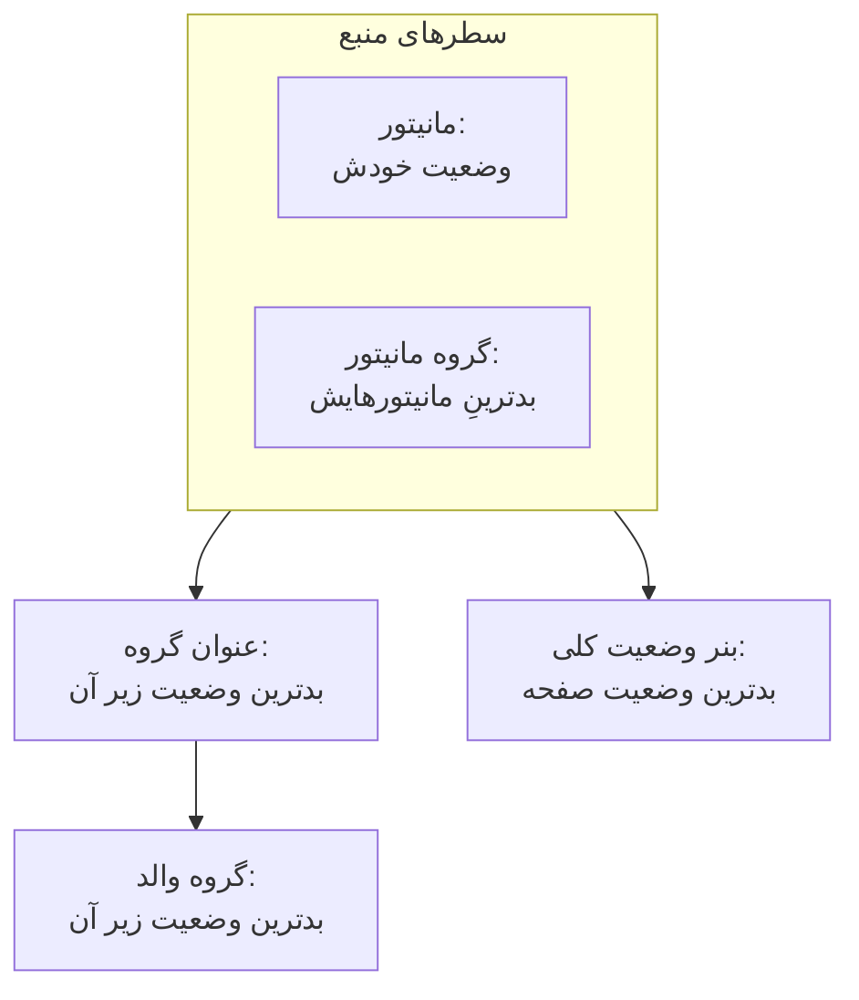

# منابع و گروه‌های صفحه وضعیت

منبع یک سطر از صفحه وضعیت شماست: یک مانیتور یا یک گروه مانیتور، با نامی که مشتریانتان می‌فهمند، وضعیت فعلی آن و، اگر بخواهید، زمان کارکرد و تاریخچه‌اش. گروه‌ها بخش‌هایی‌اند که منابع را در خود جا می‌دهند، تا صفحه‌ای با چهل مانیتور به‌جای یک فهرست بی‌پایان، به‌صورت «API»، «وب‌اپ» و «خط لوله داده» خوانده شود. هر دو را در یک نما می‌سازید: یک صفحه وضعیت را باز کنید و در منوی کناری آن **منابع** را انتخاب کنید.

:::cards
- [افزودن یک مانیتور](#افزودن-یک-مانیتور): یک مانیتور را با نامی که بازدیدکنندگان می‌خوانند روی صفحه بگذارید.
- [گروه‌ها](#گروهها): صفحه را به بخش‌ها تقسیم کنید و بخش‌ها را تودرتو کنید.
- [قوانین مانیتور](#افزودن-خودکار-مانیتورها-با-قوانین-مانیتور): بگذارید یک قانون هر مانیتور منطبق را برایتان اضافه کند.
- [وارد کردن گروه‌ها از CSV](#وارد-کردن-گروهها-از-csv): یک سلسله‌مراتب عمیق را یک‌جا بسازید.
:::

بازدیدکنندگان از روی همین سطرها قضاوت می‌کنند که «مشکل از من است یا از آن‌ها؟»، پس آن‌ها را همان‌طور نام‌گذاری کنید که مشتریان دربارهٔ محصول شما حرف می‌زنند: **Checkout API**، نه `prod-checkout-lb-healthcheck-us-east-1`.

## وضعیت چگونه تا بالای صفحه می‌رسد

هر سطر وضعیت فعلی مانیتور خود را نشان می‌دهد. هر سطح بالاتر از آن، بدترین وضعیتِ همهٔ چیزهای زیر خود را نشان می‌دهد؛ بدترین وضعیت همانی است که در وضعیت‌های مانیتورِ پروژهٔ شما بالاترین اولویت را دارد.

یک منبع چیزی بیش از رنگ سطر خود را تعیین می‌کند:

- **مانیتورهای بایگانی‌شده نشان داده نمی‌شوند.** مانیتوری که بایگانی شده دیگر بررسی نمی‌شود، پس آخرین وضعیتش منجمد می‌ماند؛ صفحه به‌جای اینکه آن وضعیت منجمد را زنده جلوه دهد، سطرش را کنار می‌گذارد (و آن را از وضعیت گروه مانیتور هم بیرون نگه می‌دارد). سطر حفظ می‌شود، پس خارج کردن مانیتور از بایگانی آن را بی‌درنگ برمی‌گرداند.
- **منابع تعیین می‌کنند صفحه کدام حادثه‌ها را نشان دهد.** یک حادثه وقتی اینجا ظاهر می‌شود، و مشترکان صفحه وقتی از آن باخبر می‌شوند، که یکی از مانیتورهای حادثه، مستقیم یا از طریق یک گروه مانیتور، منبعی روی صفحه باشد. همان مانیتور را روی چند صفحه بگذارید تا حادثه‌هایش به همهٔ آن‌ها برسد، مگر اینکه یک حادثه به برخی از آن صفحه‌ها محدود شده باشد. [یک صفحه وضعیت برای هر مخاطب](/docs/status-pages/one-status-page-per-audience) را ببینید.
- **سطر گروه مانیتور نمایندهٔ همهٔ مانیتورهای آن است، برای مشترکان هم.** در صفحه‌ای که به مشترکان اجازه می‌دهد منابع را برگزینند، کسی که مشترک یک گروه مانیتور می‌شود از حادثه‌ها، رویدادهای نگهداری زمان‌بندی‌شده و اعلامیه‌های هر مانیتورِ آن گروه باخبر می‌شود، گویی آن مانیتور را خودش برگزیده است. [مشترکان و اطلاعیه‌ها](/docs/status-pages/subscribers#اجازه-دادن-به-مشترکان-برای-برگزیدن-منابع-و-نوع-رویداد) را ببینید.

## نمای منابع

این گزینه در پروژه‌هایی که گروه‌های مانیتور در آن‌ها روشن است **منابع** نام دارد، و در بقیه **مانیتورها**؛ هر دو یک نما هستند. گروه‌ها پیش‌تر صفحهٔ جداگانهٔ خودشان را داشتند، و نشانی قدیمی `/groups` اکنون همین نما را باز می‌کند.

این نما دو بخش دارد:

| بخش | چه چیزی در آن است |
| ---- | ------------- |
| **پیمایشگر گروه‌ها** (سمت چپ) | همهٔ گروه‌های صفحه، به‌صورت درخت، با کادر **Search groups...** بالای آن و یک شمارش زیر آن، مثل `3 groups · 12 resources`. فهرست بلند با دکمهٔ **Show N more of M** تمام می‌شود. |
| **Top of page** | نخستین سطر پیمایشگر: منابعی که در هیچ گروهی نیستند و بازدیدکنندگان آن‌ها را پیش از همه، بالای همهٔ گروه‌ها، می‌بینند. در صفحه‌ای بدون گروه، عنوان پنل سمت راست به‌جای آن **All resources** است. |
| **پنل منابع** (سمت راست) | منابع گروه انتخاب‌شده. سربرگ آن **Edit Group**، دکمهٔ اصلی **افزودن مانیتور** و منوی **More actions** را دارد. |
| سربرگ کارت | **New Group**، و یک منوی سه‌نقطه با **Import groups from CSV** و **تازه‌سازی**. |

**حالت‌های خالی می‌گویند چه باید کرد.** گروه خالی **No monitors here yet** را همراه **افزودن مانیتور**، **Add Multiple** و، فقط تا وقتی صفحه هیچ گروهی ندارد، **Create a Group** نشان می‌دهد. جستجویی که با هیچ چیز منطبق نشود **No resources match your search** را نشان می‌دهد.

## افزودن یک مانیتور

:::steps
### انتخاب جای سطر

در پیمایشگر گروه‌ها، گروهی را که منبع به آن تعلق دارد انتخاب کنید، یا برای سطری بدون گروه، **Top of page** را.

### کلیک روی افزودن مانیتور

گفتگوی **Add a monitor to {group}** باز می‌شود. یک‌صفحه‌ای است.

### انتخاب مانیتور

آن را در **مانیتور** (با متن راهنمای **انتخاب مانیتور**) انتخاب کنید. **نام نمایشی**، یعنی متنی که بازدیدکنندگان می‌خوانند، با نام مانیتور پر می‌شود و وقتی مانیتور دیگری انتخاب کنید همراه آن عوض می‌شود، تا وقتی که نامی از خودتان تایپ کنید. این نام جدا از نام خود مانیتور ذخیره می‌شود، پس تغییر آن در اینجا چیزی را در پایش تغییر نمی‌دهد.

### تنظیم گزینه‌های نمایش، اگر بخواهید

**فیلدهای بیشتر** بسته است. **توضیحات** (markdown اختیاری که زیر سطر نشان داده می‌شود و برای جمله‌ای که توضیح دهد سرویس واقعاً چه می‌کند مناسب است؛ تصویری که در آن بگذارید به همهٔ بازدیدکنندگان نشان داده می‌شود) و [گزینه‌های نمایش](#گزینههای-نمایش-یک-منبع) در آن هستند. اگر بسته‌اش بگذارید، منبع مقادیر پیش‌فرض آن‌ها را می‌گیرد.

### ذخیرهٔ منبع

روی **افزودن مانیتور** کلیک کنید. سطر در گروه، و روی صفحه وضعیت، ظاهر می‌شود.
:::

در گروه شبکه‌ای، گفتگو بالای **فیلدهای بیشتر** سطر و ستونی را هم که مانیتور در آن قرار می‌گیرد می‌پرسد؛ [چیدمان فهرستی در برابر چیدمان شبکه‌ای](#چیدمان-فهرستی-در-برابر-چیدمان-شبکهای) را ببینید.

> [!TIP]
> برای نشان دادن چند بررسی به‌صورت یک سطر، یک گروه مانیتور اضافه کنید. وقتی کلید **گروه‌های مانیتور** روشن باشد (**تنظیمات پروژه** > **پیشرفته** > **پرچم‌های قابلیت**، که به محض تغییر ذخیره می‌شود)، پیوندی زیر فهرست کشویی **Add a Monitor Group instead.** را نشان می‌دهد. روی آن کلیک کنید تا **مانیتور** به **گروه مانیتور** (**انتخاب گروه مانیتور**) تبدیل شود؛ **Add a Monitor instead.** آن را برمی‌گرداند.

### افزودن چند مانیتور با هم

**Add Multiple** (و همچنین **Add multiple monitors** در منوی **More actions**) گفتگوی **Add Multiple Monitors** را باز می‌کند. این هم یک‌صفحه‌ای است: یک انتخاب چندگانهٔ **مانیتورها**، سپس همان **فیلدهای بیشتر** بسته، که گزینه‌های نمایش آن روی همهٔ مانیتورهایی که انتخاب می‌کنید اعمال می‌شود. هر منبع نام نمایشی و توضیحات خود را از مانیتورش می‌گیرد، و **Add Monitors** همه را اضافه می‌کند. این سریع‌ترین راه برای پر کردن یک صفحهٔ تازه است.

انتخاب چندگانه یک زبانهٔ **برچسب‌ها** دارد: روی یک برچسب کلیک کنید تا همهٔ مانیتورهایی که آن را دارند یک‌جا انتخاب شوند.

### افزودن دوباره با برچسب بی‌خطر است

صفحه وضعیت هر مانیتور را یک بار فهرست می‌کند. افزودن idempotent است، پس انتخاب دوبارهٔ همان برچسب پس از برچسب زدن چند مانیتور تازه فقط مانیتورهای تازه را اضافه می‌کند: مانیتورهایی که از قبل روی صفحه‌اند دقیقاً همان‌طور که هستند می‌مانند، با هر نام نمایشی و گزینه‌ای که به آن‌ها داده‌اید.

خلاصهٔ پایان افزودن گروهی همین را می‌گوید: مانیتورهای افزوده‌شده زیر **افزوده شد** فهرست می‌شوند و آن‌هایی که از قبل بودند زیر **Already Added**. هیچ‌کدام به‌عنوان شکست گزارش نمی‌شود و برای آن‌ها چیزی نوشته نمی‌شود.

همین قاعده در هر جای دیگری که منبعی ساخته می‌شود برقرار است. افزودن مانیتوری که از قبل روی صفحه است از فرم افزودن تکی، یا نشانه رفتن یک منبع موجود به آن از فرم ویرایش، با پیام *«This monitor is already added to this status page»* رد می‌شود؛ حتی وقتی منبع موجود در گروه دیگری باشد، چون بازدیدکننده باز هم آن مانیتور را دو بار می‌بیند. برای نشان دادن یک مانیتور در گروهی دیگر، منبعی را که از قبل دارد حذف کنید و آن را همان‌جا که می‌خواهید اضافه کنید.

## گزینه‌های نمایش یک منبع

بخش **فیلدهای بیشتر** در فرم افزودن تکی و در گفتگوی گروهی یکسان است. در هر دو بسته شروع می‌شود، و در **ویرایش منبع** هم، که سربرگ بسته‌اش نشان می‌دهد چه چیزی در آن روی پیش‌فرض نیست. همه‌چیز اینجا برای هر منبع جداست: دو سطر در یک گروه می‌توانند تنظیمات متفاوتی داشته باشند.

| فیلد | پیش‌فرض | چه می‌کند |
| ----- | ------- | ------------ |
| **راهنمای شناور** (`displayTooltip`) | خالی | به‌صورت راهنمای شناور کنار منبع در صفحه وضعیت شما نشان داده می‌شود. از آن برای دامنه استفاده کنید: «مشتریان US و EU». |
| **نمایش وضعیت فعلی منبع** (`showCurrentStatus`) | روشن | وضعیت زنده را کنار سطر نشان می‌دهد، مثل عملیاتی، دچار افت یا آفلاین. |
| **نمایش ٪ زمان کارکرد** (`showUptimePercent`) | خاموش | درصد زمان کارکرد را کنار منبع نشان می‌دهد. |
| **انتخاب دقت زمان کارکرد** (`uptimePercentPrecision`) | یک رقم اعشار | وقتی **نمایش ٪ زمان کارکرد** روشن باشد ظاهر می‌شود و آن‌وقت الزامی است. |
| **نمایش نمودار تاریخچه وضعیت** (`showStatusHistoryChart`) | روشن | میله‌های روزبه‌روز تاریخچهٔ زمان کارکرد منبع را نشان می‌دهد. |

**نام نمایشی** (`displayName`) و **توضیحات** (`displayDescription`) هم فقط برای نمایش‌اند: هرگز خود مانیتور را تغییر نمی‌دهند.

## درصدهای زمان کارکرد و نمودارهای تاریخچه

**نمایش ٪ زمان کارکرد** و **نمایش نمودار تاریخچه وضعیت** هر دو یک تنظیم سراسری صفحه را می‌خوانند: اینکه چند روز را پوشش دهند. این تنظیم **تاریخچه زمان کارکرد** در کارت **آنچه صفحه وضعیت شما نشان می‌دهد** در **صفحات وضعیت → صفحهٔ شما → پیشرفته → تنظیمات پیشرفته** است. ۱ تا ۹۰ روز را می‌پذیرد و پیش‌فرض آن ۹۰ است. پس کلیدها را برای هر منبع روشن کنید، سپس پنجره را یک بار برای کل صفحه تنظیم کنید.

**دقت یک انتخاب سلیقه‌ای است.** **انتخاب دقت زمان کارکرد** گزینه‌های `99% (No Decimal)`، `99.9% (One Decimal)`، `99.99% (Two Decimal)` و `99.999% (Three Decimal)` را دارد. اعشار بیشتر دقیق به نظر می‌رسد و بحث بر سر رقم سوم را دامن می‌زند؛ اگر SLA سه‌نُه منتشر می‌کنید، با همان هماهنگ باشید و نه بیشتر.

گروه‌ها نسخه‌های خودشان از این کلیدها را دارند (پایین‌تر را ببینید)، پس یک گروه می‌تواند درصدی تجمیعی نشان دهد در حالی که مانیتورهای درونش ساکت می‌مانند، یا برعکس.

رنگ میله‌های نمودار تاریخچه زیر **تنظیمات بیشتر** در صفحهٔ **برندینگ** تنظیم می‌شود، و اینکه کدام وضعیت‌های مانیتور «قطع» به حساب می‌آیند در **قطعی به حساب می‌آید**، در کارت **آنچه صفحه وضعیت شما نشان می‌دهد** در **تنظیمات پیشرفته**؛ هر دو در [برندینگ و دامنه‌های صفحه وضعیت](/docs/status-pages/branding-and-domains) آمده‌اند.

## گروه‌ها

بیشتر گروه‌ها فقط به یک نام نیاز دارند.

:::steps
### کلیک روی New Group

**Create New Status Page Group** باز می‌شود: دو فیلد، سپس دو بخش بسته.

### نام‌گذاری گروه

**نام گروه** را تایپ کنید: عنوان بخشی که بازدیدکنندگان می‌بینند.

### تودرتو کردن آن، اگر درون گروه دیگری جای می‌گیرد

یک **Parent Group** انتخاب کنید، یا آن را روی **No parent group (top level)** بگذارید. **Add a sub group** در منوهای یک گروه این را برایتان پر می‌کند.

### ساخت گروه

روی **Create Status Page Group** کلیک کنید. گروه در پیمایشگر ظاهر می‌شود، آماده برای مانیتورها.
:::

دو فیلد **نام گروه** (`name`) و **Parent Group** (`parentStatusPageGroupId`) هستند. دو بخش بسته همه‌چیز دیگر را در خود دارند:

- **چیدمان**: سربرگ بسته‌اش **List** یا **Grid** را نشان می‌دهد. **حالت نمایش** و محورهای یک شبکه را در خود دارد ([چیدمان فهرستی در برابر چیدمان شبکه‌ای](#چیدمان-فهرستی-در-برابر-چیدمان-شبکهای) را ببینید) و در یک گروه شبکه‌ای خودبه‌خود باز می‌شود.
- **فیلدهای بیشتر**: نسخه‌های سطح گروهِ گزینه‌های منبع:
  - **توضیحات گروه** (`description`): markdown اختیاری که زیر عنوان نشان داده می‌شود. تصویری که در آن بگذارید به همهٔ بازدیدکنندگان نشان داده می‌شود.
  - **به‌صورت پیش‌فرض در صفحه وضعیت باز باشد** (`isExpandedByDefault`): به‌طور پیش‌فرض روشن است؛ تعیین می‌کند بخش برای بازدیدکنندگان باز شروع شود یا بسته.
  - **نمایش وضعیت فعلی گروه** (`showCurrentStatus`): به‌طور پیش‌فرض روشن. وضعیتی را کنار عنوان گروه نشان می‌دهد.
  - **نمایش ٪ زمان کارکرد** (`showUptimePercent`): به‌طور پیش‌فرض خاموش، و وقتی روشن شود همراه **انتخاب دقت زمان کارکرد**.

برای تغییر یک گروه، از **Edit Group** در سربرگ پنل، یا **Edit group** در منوی سطرِ پیمایشگر استفاده کنید: **Edit Status Page Group** با دکمهٔ **ذخیره تغییرات** باز می‌شود. سربرگ پنل برای تنظیماتی که روشن‌اند نشان‌هایی (chip) نشان می‌دهد (**Grid**، **Collapsed by default**، **Uptime %**)، تا بدون باز کردن فرم ببینید یک گروه چگونه تنظیم شده است.

### مدیریت یک گروه

| کجا | اقدام‌ها |
| ----- | ------- |
| منوی سطر پیمایشگر | **Edit group**، **Move up**، **Move down**، **نمایش شناسه**، **Delete group** |
| منوی **More actions** پنل | **Edit this group**، **Add a sub group**، **Move group up**، **Move group down**، **Show group ID**، **تازه‌سازی**، **Delete this group** |

گروهی که بدون نام ذخیره شود به‌صورت **Untitled group** نشان داده می‌شود، که نشانهٔ خوبی است که می‌خواستید چیزی تایپ کنید.

## تودرتو کردن گروه‌ها

گروه‌ها تودرتو می‌شوند: **Parent Group** را روی گروه فرزند تنظیم کنید، یا در پیمایشگر از **Add a sub group inside this group** استفاده کنید. متن راهنمای فرم شکلی را که برایش ساخته شده توصیف می‌کند (چیزی مثل واحدهای سازمانی › منطقه › بازار)، و هر سطح وضعیت و زمان کارکرد تجمیعیِ همهٔ چیزهای زیر خود را نشان می‌دهد.

وقتی گروهی فرزند دارد، پنل منابع ردیفی از نشان‌های **Sub groups** نشان می‌دهد که مستقیم به هر فرزند پیوند می‌دهند، تا بدون بازگشت به پیمایشگر در سلسله‌مراتب حرکت کنید.

تودرتو کردن در صفحه‌های بزرگ ارزشش را نشان می‌دهد: یک ارائه‌دهندهٔ میزبانی با منطقه‌هایی درون محصولات، یا یک خرده‌فروش با بازارهایی درون واحدهای تجاری. در صفحه‌ای با دوازده مانیتور، یک سطح تخت خواناتر است.

## چیدمان فهرستی در برابر چیدمان شبکه‌ای

بخش **چیدمان** در فرم گروه، **حالت نمایش** (`viewMode`) گروه را تنظیم می‌کند، که شکل نمایش گروه در صفحه وضعیت را تغییر می‌دهد.

| اگر می‌خواهید… | انتخاب کنید |
| --------------- | ---- |
| فهرست عمودی ساده‌ای از سرویس‌ها نشان دهید، در هر سطر یکی | **List** (پیش‌فرض) |
| یک سرویس را در چند منطقه یا مستأجر به‌صورت ماتریس نشان دهید | **Grid** |

**Grid** را انتخاب کنید تا چهار فیلد دیگر ظاهر شود:

| فیلد | چه وارد کنید |
| ----- | ------------- |
| **برچسب محور سطر** | نام بُعد سطرها، با متن راهنمای `Service`. |
| **مقادیر محور سطر** | سطرها، که یکی‌یکی با **Add Row** اضافه می‌شوند (متن راهنما `e.g. Auth`). |
| **برچسب محور ستون** | بُعد ستون‌ها، با متن راهنمای `Region`. |
| **مقادیر محور ستون** | ستون‌ها، که با **Add Column** اضافه می‌شوند (متن راهنما `e.g. US-East`). |

هر مانیتور در یک گروه شبکه‌ای در یک خانه قرار می‌گیرد، پس **افزودن مانیتور** و گفتگوی گروهی، سطر و ستون را هم همراه مانیتور می‌پرسند و برچسب‌های محور خود شما را به کار می‌برند.

> [!IMPORTANT]
> پیش از افزودن مانیتورها، محورها را تنظیم کنید. گروه شبکه‌ای بدون سطر یا ستون اعلانی نشان می‌دهد که هنوز جایی برای گذاشتن مانیتور نیست، با دکمهٔ **Set up the grid** که فرم گروه را روی بخش **چیدمان** آن باز می‌کند، و دکمهٔ **افزودن مانیتور** آن تا وقتی این کار را نکنید کنار گذاشته می‌شود.

## ترتیب آنچه بازدیدکنندگان می‌بینند

ترتیب را خودتان تعیین می‌کنید، نه الفبا:

| چه چیزی | چگونه ترتیبش را عوض کنید |
| ---- | ----------------- |
| منابع درون یک گروه | یک سطر را بکشید. پنل همین را می‌گوید: **Drag a row to change the order visitors see**. |
| گروه‌ها نسبت به هم | **Move up** / **Move down** در منوی سطر پیمایشگر، یا **Move group up** / **Move group down** در **More actions**. |
| منابع بدون گروه | این‌ها در **Top of page** هستند و همیشه بالای همهٔ گروه‌ها نشان داده می‌شوند، پس آن یک چیزی را که همه اول بررسی می‌کنند آنجا بگذارید. |

**دو حالت که کشیدن خاموش است.** جستجو با کادر **Search in {group}...** تغییر ترتیب را خاموش می‌کند (پنل می‌گوید `N of M shown · drag to reorder is off while filtering`)، پس اول جستجو را پاک کنید. و گروه‌های شبکه‌ای هرگز با کشیدن مرتب نمی‌شوند، چون جای یک مانیتور از سطر و ستونش می‌آید.

سرویسی را که بیشتر از همه دربارهٔ آن می‌پرسند در بالا بگذارید. بازدیدکنندگانی که هنگام قطعی به صفحه می‌آیند معمولاً پس از نخستین صفحه‌نمایش دیگر نمی‌خوانند.

## افزودن خودکار مانیتورها با قوانین مانیتور

یک قانون مانیتور مانیتورها را برایتان به صفحه اضافه می‌کند: مانیتورها را یک بار توصیف کنید، و هر مانیتوری که منطبق باشد در گروهی که انتخاب کرده‌اید قرار می‌گیرد. قانون‌ها زیر **منابع → Monitor Rules**، کنار نمای منابع، هستند.

:::steps
### باز کردن Monitor Rules

صفحه وضعیت را باز کنید، در بخش **منابع** منوی کناری آن **Monitor Rules** را انتخاب کنید و روی **ساخت Status Page Monitor Rule** کلیک کنید.

### نام‌گذاری قانون

در **اطلاعات پایه**، یک **نام** وارد کنید. **فعال** به‌طور پیش‌فرض روشن است.

### تعیین مانیتورهایی که منطبق می‌شوند

در **معیار تطبیق**، دست‌کم یکی از **برچسب‌های مانیتور** (مانیتوری که هر یک از آن‌ها را داشته باشد منطبق است)، **نام مانیتور** و **توضیحات مانیتور** را پر کنید. یک مانیتور باید هر معیاری را که پر می‌کنید برآورده کند. دو الگو یک عبارت باقاعدهٔ غیرحساس به بزرگی و کوچکی حروف (`^api-.*`) یا یک وایلدکارت `*` (`*checkout*`) می‌پذیرند؛ `.*` با همهٔ مانیتورها منطبق است.

### انتخاب گروه

در **گروه**، **Add Monitors To Group** را انتخاب کنید، یا برای افزودن مانیتورها بدون گروه آن را خالی بگذارید. همان گزینه‌های نمایشِ یک منبع در ادامه می‌آیند؛ در یک قانون، **نمایش ٪ زمان کارکرد** روشن شروع می‌شود.

### ذخیرهٔ قانون

قانون بی‌درنگ روی همهٔ مانیتورهای موجود اجرا می‌شود، و فهرست، گروهی را که قانون مانیتورها را به آن اضافه می‌کند زیر **Adds Monitors To** نشان می‌دهد.
:::

پس از آن، هر وقت مانیتوری ساخته شود یا برچسب‌ها، نام یا توضیحاتش تغییر کند، قانون برای آن مانیتور دوباره اجرا می‌شود. یک قانون فقط منابعی را برمی‌دارد که خودش اضافه کرده است: خاموش کردن یا حذف آن، آن‌ها را از صفحه برمی‌دارد، و به مانیتوری که دستی اضافه کرده‌اید هرگز دست نمی‌زند. مانیتوری که از قبل روی صفحه است هرگز دو بار اضافه نمی‌شود.

## وارد کردن گروه‌ها از CSV

ساختن یک سلسله‌مراتب عمیق با دست خسته‌کننده است. **Import groups from CSV**، در منوی سه‌نقطهٔ سربرگ کارت، گفتگوی **Import Groups from CSV** را باز می‌کند.

:::steps
### دریافت قالب

برای گرفتن `status-page-groups-template.csv` روی **Download CSV Template** کلیک کنید.

### پر کردن آن

برای هر گروه یک سطر. فقط `name` الزامی است؛ ستون‌ها در ادامه فهرست شده‌اند.

### بارگذاری و پیش‌نمایش

روی **Choose CSV File** کلیک کنید، فایل خود را انتخاب کنید، سپس روی **Preview Import** کلیک کنید تا پیش از نوشته شدن هر چیزی ببینید چه ساخته خواهد شد.

### وارد کردن

وارد کردن را اجرا کنید. جدول **Import results** هر سطر را با دلیلش به‌صورت **ساخته‌شده**، **ناموفق** یا **نادیده‌گرفته‌شده** فهرست می‌کند، تا هیچ سطر نادرستی بی‌صدا ناپدید نشود.
:::

| ستون | چه چیزی را تنظیم می‌کند |
| ------ | ------------ |
| `name` | نام گروه. الزامی. |
| `parentName` | نام گروهی که این گروه درون آن قرار می‌گیرد. |
| `description` | توضیحات گروه. |
| `isExpandedByDefault` | اینکه بخش برای بازدیدکنندگان باز شروع شود یا نه. |
| `showCurrentStatus` | اینکه وضعیتی کنار عنوان گروه نشان داده شود یا نه. |
| `showUptimePercent` | اینکه درصد زمان کارکرد کنار گروه نشان داده شود یا نه. |
| `uptimePercentPrecision` | آن درصد چند رقم اعشار داشته باشد. |
| `viewMode` | `List` یا `Grid`. |
| `rowAxisLabel` | نام بُعد سطرها، برای گروه شبکه‌ای. |
| `rowAxisValues` | مقادیر سطرها، برای گروه شبکه‌ای. |
| `columnAxisLabel` | نام بُعد ستون‌ها، برای گروه شبکه‌ای. |
| `columnAxisValues` | مقادیر ستون‌ها، برای گروه شبکه‌ای. |

وارد کردن، گروه می‌سازد نه منبع: پس از آن مانیتورها را با **افزودن مانیتور**، **Add Multiple** یا یک قانون مانیتور اضافه کنید.

## رفع اشکال

:::details «This monitor is already added to this status page»
یک صفحه هر مانیتور را یک بار فهرست می‌کند، حتی در گروه‌های مختلف. مانیتور از قبل یک منبع دارد، شاید در گروهی دیگر یا افزوده‌شده با یک قانون مانیتور. آن را در پیمایشگر جستجو کنید، آن منبع را حذف کنید و مانیتور را همان‌جا که می‌خواهید اضافه کنید.
:::

:::details مانیتوری که اضافه کردم در صفحه وضعیت نشان داده نمی‌شود
بررسی کنید که مانیتور بایگانی نشده باشد: سطر مانیتور بایگانی‌شده تا وقتی آن را از بایگانی خارج کنید کنار گذاشته می‌شود. گروه را هم بررسی کنید: گروهی که تنظیم شده بسته شروع شود (**به‌صورت پیش‌فرض در صفحه وضعیت باز باشد** خاموش) سطرهایش را تا وقتی بازدیدکننده‌ای بازش کند پنهان می‌کند.
:::

:::details در یک گروه شبکه‌ای دکمهٔ افزودن مانیتور نیست
شبکه هنوز سطر یا ستونی ندارد. روی **Set up the grid** کلیک کنید، مقادیر محور را در بخش **چیدمان** اضافه کنید، و **افزودن مانیتور** برمی‌گردد.
:::

:::details نمی‌توانم سطرها را بکشم
کادر **Search in {group}...** را خالی کنید: تا وقتی پنل فیلتر شده است، تغییر ترتیب خاموش است. گروه‌های شبکه‌ای هرگز با کشیدن مرتب نمی‌شوند.
:::

## گام‌های بعدی

:::cards
- [برندینگ و دامنه‌های صفحه وضعیت](/docs/status-pages/branding-and-domains): لوگو، فاوآیکن، رنگ‌های نمودار تاریخچه و دامنهٔ خودتان.
- [مشترکان و اطلاعیه‌ها](/docs/status-pages/subscribers): وقتی این منابع تغییر می‌کنند به چه کسی خبر داده می‌شود.
- [یک صفحه وضعیت برای هر مخاطب](/docs/status-pages/one-status-page-per-audience): یک مانیتور روی چند صفحه، و حادثه‌ای که فقط به برخی از آن‌ها می‌رسد.
- [API عمومی](/docs/status-pages/public-api): منابع، گروه‌ها و زمان کارکرد را به‌صورت JSON بخوانید.
:::
