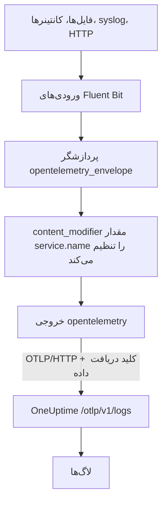

# Fluent Bit

[Fluent Bit](https://docs.fluentbit.io/manual) یک عامل سبک است که لاگ‌ها را از فایل‌ها، systemd، کانتینرها، syslog، HTTP و بسیاری منبع دیگر جمع‌آوری می‌کند. [خروجی OpenTelemetry](https://docs.fluentbit.io/manual/pipeline/outputs/opentelemetry) آن، هر آنچه جمع می‌کند را به نقطهٔ پایانی OpenTelemetry (OTLP) در OneUptime می‌فرستد و لاگ‌ها در **محصولات → لاگ‌ها** قابل جستجو می‌شوند.

:::cards
- [پیکربندی Fluent Bit](#پیکربندی-fluent-bit): خروجی OpenTelemetry را اضافه کنید و برای سرویس‌تان نام بگذارید.
- [نمونهٔ کامل](#نمونهٔ-کامل): یک فایل پیکربندی کامل برای شروع.
- [OneUptime با میزبانی شخصی](#oneuptime-با-میزبانی-شخصی): Fluent Bit را به سمت نمونهٔ خودتان بفرستید.
:::

## چگونه کار می‌کند



Fluent Bit هر رکورد را در یک پاکت OpenTelemetry می‌پیچد تا بتواند attributeهای منبع مانند `service.name` را با خود ببرد. سپس خروجی OpenTelemetry رکوردها را با کلید دریافت داده‌تان در سرآیند `x-oneuptime-token` به OneUptime می‌فرستد. OneUptime آن‌ها را زیر سرویسی که `service.name` نام می‌برد ثبت می‌کند و نخستین باری که داده‌ای برسد آن سرویس را می‌سازد.

## پیش از شروع

- **نصب Fluent Bit**: [راهنمای نصب](https://docs.fluentbit.io/manual/installation/getting-started-with-fluent-bit) را ببینید. پیکربندی این صفحه از قالب YAML در Fluent Bit و پردازشگر `opentelemetry_envelope` استفاده می‌کند، پس از یک نسخهٔ به‌روز استفاده کنید.
- **یک پروژهٔ OneUptime.** در OneUptime Cloud هزینهٔ تله‌متری بر پایهٔ هر گیگابایت دریافت‌شده محاسبه می‌شود ([قیمت‌ها](https://oneuptime.com/pricing) را ببینید)، و پروژه‌ای که روی پلن Free است پیش از ارسال تله‌متری به یک روش پرداخت نیاز دارد.
- **یک کلید دریافت دادهٔ تله‌متری.** اگر ندارید:

:::steps
### کلیدهای دریافت داده را باز کنید

به **محصولات → تنظیمات پروژه** بروید، در منوی کناری **تله‌متری و APM** را باز کنید و **کلیدهای دریافت داده** را برگزینید.


### یک کلید بسازید

روی **ساخت کلید دریافت داده** کلیک کنید. در پنجره، نام کلید از پیش پر شده و **سرور** انتخاب شده است، یعنی همان نوع کلیدی که برنامه‌ها و Collectorها با آن داده می‌فرستند؛ پس برای ساختن کلید روی **ساخت کلید دریافت داده** کلیک کنید، یا پیش از آن نامش را تغییر دهید.

### کلید محرمانه را کپی کنید

کلید تازه در صفحهٔ خودش باز می‌شود. **کلید محرمانه** آن را کپی کنید: این همان `YOUR_TELEMETRY_INGESTION_TOKEN` در پیکربندی زیر است.


:::

## پیکربندی Fluent Bit

Fluent Bit پیکربندی YAML خود را از فایلی مانند `/etc/fluent-bit/fluent-bit.yaml` می‌خواند.

:::steps
### خروجی OpenTelemetry را اضافه کنید

یک خروجی `opentelemetry` اضافه کنید که به OneUptime بفرستد. اگر می‌خواهید رکوردها را به‌صورت محلی ببینید، هنگام آزمایش خروجی `stdout` را نگه دارید:

```yaml title="fluent-bit.yaml"
pipeline:
  outputs:
    - name: stdout
      match: "*"
    - name: opentelemetry
      match: "*"
      host: "oneuptime.com"
      port: 443
      metrics_uri: "/otlp/v1/metrics"
      logs_uri: "/otlp/v1/logs"
      traces_uri: "/otlp/v1/traces"
      tls: On
      header:
        - x-oneuptime-token YOUR_TELEMETRY_INGESTION_TOKEN
```

### لاگ‌ها را در یک پاکت OpenTelemetry بپیچید و برای سرویس نام بگذارید

به هر ورودی پردازشگر `opentelemetry_envelope` را اضافه کنید و پس از آن یک `content_modifier` بگذارید که `service.name` را تنظیم کند. به‌جای `YOUR_SERVICE_NAME` نامی را بنویسید که لاگ‌ها باید در OneUptime با آن نمایش داده شوند:

```yaml title="fluent-bit.yaml"
pipeline:
  inputs:
    - name: tail # or any other input
      path: /var/log/my-app/*.log

      processors:
        logs:
          - name: opentelemetry_envelope

          - name: content_modifier
            context: otel_resource_attributes
            action: upsert
            key: service.name
            value: YOUR_SERVICE_NAME
```

### Fluent Bit را دوباره راه‌اندازی کنید

سرویس Fluent Bit را دوباره راه‌اندازی کنید، یا آن را با `fluent-bit -c /etc/fluent-bit/fluent-bit.yaml` اجرا کنید. در چند ثانیه لاگ‌ها در **محصولات → لاگ‌ها** نمایش داده می‌شوند و سرویس در **محصولات → سرویس‌ها** فهرست می‌شود.
:::

## نمونهٔ کامل

این پیکربندی لاگ‌ها را از راه HTTP روی درگاه `8888` می‌گیرد و به OneUptime می‌فرستد:

```yaml title="fluent-bit.yaml"
service:
  flush: 1
  log_level: info

pipeline:
  inputs:
    - name: http
      listen: 0.0.0.0
      port: 8888

      processors:
        logs:
          - name: opentelemetry_envelope

          - name: content_modifier
            context: otel_resource_attributes
            action: upsert
            key: service.name
            value: YOUR_SERVICE_NAME

  outputs:
    - name: stdout
      match: "*"
    - name: opentelemetry
      match: "*"
      host: "oneuptime.com"
      port: 443
      metrics_uri: "/otlp/v1/metrics"
      logs_uri: "/otlp/v1/logs"
      traces_uri: "/otlp/v1/traces"
      tls: On
      header:
        - x-oneuptime-token YOUR_TELEMETRY_INGESTION_TOKEN
```

به‌جای ورودی `http` ورودی‌هایی را بگذارید که لازم دارید، مانند `tail` برای فایل‌های لاگ یا `systemd` برای ژورنال، و دو پردازشگر را روی هرکدام نگه دارید.

## OneUptime با میزبانی شخصی

`host` را روی میزبان نمونهٔ OneUptime خود تنظیم کنید. اگر آن را با HTTP ساده به‌جای HTTPS ارائه می‌کنید، `port` را هم روی درگاهی که به آن گوش می‌دهد بگذارید (معمولاً `80`) و `tls` را حذف کنید:

```yaml title="fluent-bit.yaml"
pipeline:
  outputs:
    - name: stdout
      match: "*"
    - name: opentelemetry
      match: "*"
      host: "your-oneuptime-instance.com"
      port: 80
      metrics_uri: "/otlp/v1/metrics"
      logs_uri: "/otlp/v1/logs"
      traces_uri: "/otlp/v1/traces"
      header:
        - x-oneuptime-token YOUR_TELEMETRY_INGESTION_TOKEN
```

## عیب‌یابی

:::details Fluent Bit از خروجی OpenTelemetry خطای `401` ثبت می‌کند
کلید دریافت داده وجود ندارد، ناشناخته است یا منقضی شده است. خط `header` را بررسی کنید: نخست `x-oneuptime-token`، سپس یک فاصله، و بعد **کلید محرمانه** آن کلید.
:::

:::details Fluent Bit خطای `402` یا `422` ثبت می‌کند
`402`: در OneUptime Cloud، پروژه روی پلن Free است و روش پرداخت ندارد. یکی در **تنظیمات پروژه → صورت‌حساب و فاکتورها → صورت‌حساب** اضافه کنید. `422`: کلید غیرفعال است، یا کلید مرورگر است. **فعال** را در تنظیمات کلید دوباره روشن کنید، یا یک کلید **سرور** بسازید.
:::

:::details لاگ‌ها زیر سرویسی نامنتظر می‌رسند
سرویس از `service.name` می‌آید. بررسی کنید هر ورودی پردازشگر `opentelemetry_envelope` را داشته باشد و پس از آن `content_modifier` که آن را تنظیم می‌کند.
:::

:::details چیزی نمی‌رسد و Fluent Bit خطای اتصال ثبت می‌کند
بررسی کنید که برای یک نقطهٔ پایانی HTTPS مقدارهای `tls: On` و `port: 443` تنظیم شده باشند، و میزبانی که Fluent Bit را اجرا می‌کند بتواند روی آن درگاه به میزبان OneUptime شما برسد.
:::

اگر پرسشی دارید یا برای پیکربندی به کمک نیاز دارید، به support@oneuptime.com ایمیل بزنید.

## گام‌های بعدی

:::cards
- [خط‌های لوله لاگ](/docs/telemetry/log-pipelines): لاگ‌هایی را که Fluent Bit می‌فرستد تجزیه و غنی کنید.
- [نحو جستجو](/docs/telemetry/search-syntax): لاگ‌ها را در کاوشگر لاگ پیدا کنید.
- [OpenTelemetry](/docs/telemetry/open-telemetry): نقطه‌های پایانی، کلیدها و محدودیت‌ها برای همهٔ تله‌متری.
- [Fluentd](/docs/telemetry/fluentd): به‌جای آن از Fluentd استفاده کنید.
:::
