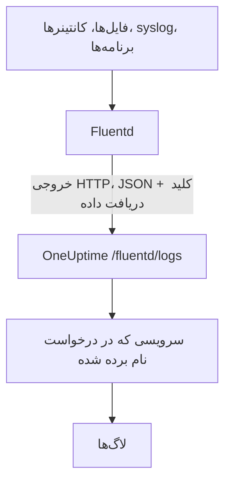

# Fluentd

[Fluentd](https://www.fluentd.org/) لاگ‌ها را از فایل‌ها، کانتینرها، syslog، برنامه‌ها و [بسیاری منبع دیگر](https://www.fluentd.org/datasources) جمع‌آوری می‌کند. [خروجی HTTP](https://docs.fluentd.org/output/http) داخلی آن، لاگ‌ها را به نقطهٔ پایانی Fluentd در OneUptime می‌فرستد و آن‌ها در **محصولات → لاگ‌ها** قابل جستجو می‌شوند.

:::cards
- [پیکربندی Fluentd](#پیکربندی-fluentd): یک خروجی HTTP اضافه کنید که به OneUptime اشاره کند.
- [رکوردها چگونه خوانده می‌شوند](#رکوردها-چگونه-خوانده-میشوند): کدام فیلدها به پیام، شدت و attributeها تبدیل می‌شوند.
- [OneUptime با میزبانی شخصی](#oneuptime-با-میزبانی-شخصی): Fluentd را به سمت نمونهٔ خودتان بفرستید.
:::

## چگونه کار می‌کند



Fluentd رکوردها را به‌صورت دسته‌های JSON می‌فرستد، با کلید دریافت داده‌تان در سرآیند `x-oneuptime-token` و نام سرویس در `x-oneuptime-service-name`. OneUptime هر رکورد را به یک لاگ از آن سرویس تبدیل می‌کند و نخستین باری که داده‌ای برسد سرویس را می‌سازد.

## پیش از شروع

- **نصب Fluentd**: [راهنمای نصب](https://docs.fluentd.org/installation) را ببینید.
- **یک پروژهٔ OneUptime.** در OneUptime Cloud هزینهٔ تله‌متری بر پایهٔ هر گیگابایت دریافت‌شده محاسبه می‌شود ([قیمت‌ها](https://oneuptime.com/pricing) را ببینید)، و پروژه‌ای که روی پلن Free است پیش از ارسال تله‌متری به یک روش پرداخت نیاز دارد.
- **یک کلید دریافت دادهٔ تله‌متری.** اگر ندارید:

:::steps
### کلیدهای دریافت داده را باز کنید

به **محصولات → تنظیمات پروژه** بروید، در منوی کناری **تله‌متری و APM** را باز کنید و **کلیدهای دریافت داده** را برگزینید.


### یک کلید بسازید

روی **ساخت کلید دریافت داده** کلیک کنید. در پنجره، نام کلید از پیش پر شده و **سرور** انتخاب شده است، یعنی همان نوع کلیدی که برنامه‌ها و Collectorها با آن داده می‌فرستند؛ پس برای ساختن کلید روی **ساخت کلید دریافت داده** کلیک کنید، یا پیش از آن نامش را تغییر دهید.

### کلید محرمانه را کپی کنید

کلید تازه در صفحهٔ خودش باز می‌شود. **کلید محرمانه** آن را کپی کنید: این همان `YOUR_SERVICE_TOKEN` در پیکربندی زیر است.


:::

## پیکربندی Fluentd

فایل پیکربندی Fluentd معمولاً `/etc/fluent/fluentd.conf` است، یا برای بستهٔ قدیمی‌تر td-agent، `/etc/td-agent/td-agent.conf`.

:::steps
### یک خروجی HTTP اضافه کنید

یک بخش `<match>` اضافه کنید که رکوردها را به OneUptime بفرستد. به‌جای `YOUR_SERVICE_TOKEN` کلید دریافت داده‌تان را بنویسید، و به‌جای `YOUR_SERVICE_NAME` نامی را که لاگ‌ها باید با آن نمایش داده شوند؛ هر نامی که بخواهید:

```text title="fluentd.conf"
# Match all patterns
<match **>
  @type http

  endpoint https://oneuptime.com/fluentd/logs
  open_timeout 2

  headers {"x-oneuptime-token":"YOUR_SERVICE_TOKEN", "x-oneuptime-service-name":"YOUR_SERVICE_NAME"}

  content_type application/json
  json_array true

  <format>
    @type json
  </format>
  <buffer>
    flush_interval 10s
  </buffer>
</match>
```

`json_array true` هر بار تخلیهٔ بافر را به‌صورت یک آرایهٔ JSON می‌فرستد، و `flush_interval 10s` هر ۱۰ ثانیه یک دسته می‌فرستد.

### Fluentd را دوباره راه‌اندازی کنید

سرویس Fluentd را دوباره راه‌اندازی کنید تا خروجی تازه را بارگذاری کند.

### بررسی کنید لاگ‌ها می‌رسند

چند ثانیه پس از تخلیهٔ بعدی، لاگ‌ها در **محصولات → لاگ‌ها** نمایش داده می‌شوند. سرویس در **محصولات → سرویس‌ها** فهرست می‌شود؛ اگر هنوز وجود نداشته باشد، OneUptime آن را می‌سازد.
:::

## نمونهٔ کامل

این پیکربندی رکوردها را با پروتکل forward در Fluentd روی درگاه `24224` می‌گیرد و همه را به OneUptime می‌فرستد:

```text title="fluentd.conf"
####
## Source descriptions:
##

## built-in TCP input
## @see https://docs.fluentd.org/input/forward
<source>
  @type forward
  port 24224
  bind 0.0.0.0
</source>

<match **>
  @type http

  endpoint https://oneuptime.com/fluentd/logs
  open_timeout 2

  headers {"x-oneuptime-token":"YOUR_SERVICE_TOKEN", "x-oneuptime-service-name":"YOUR_SERVICE_NAME"}

  content_type application/json
  json_array true

  <format>
    @type json
  </format>
  <buffer>
    flush_interval 10s
  </buffer>
</match>
```

برای فرستادن منبع‌های گوناگون به‌عنوان سرویس‌های گوناگون، برای هر تگ یک بخش `<match>` به کار ببرید که هرکدام `x-oneuptime-service-name` خودش را داشته باشد.

## رکوردها چگونه خوانده می‌شوند

OneUptime این فیلدها را از هر رکورد می‌خواند:

| فیلد لاگ | از نخستین فیلد موجود در رکورد از میان | توضیح |
| --- | --- | --- |
| بدنه | `message`، `log`، `msg`، `body`، `text` | خط لاگ. رکوردی که هیچ‌کدام از این‌ها را نداشته باشد، به‌طور کامل و به‌صورت JSON ذخیره می‌شود. |
| شدت | `level`، `severity`، `loglevel`، `log_level`، `priority`، `severityText`، `severity_text` | نام‌هایی مانند `trace`، `debug`، `info`، `notice`، `warn`، `error`، `critical` و `fatal`، با حروف بزرگ یا کوچک. هر مقدار دیگری به‌صورت `Unspecified` ذخیره می‌شود. |
| شناسهٔ ترِیس | `trace_id`، `traceId`، `traceid` | لاگ را به ترِیس خودش پیوند می‌دهد. |
| شناسهٔ span | `span_id`، `spanId`، `spanid` | لاگ را به span خودش پیوند می‌دهد. |
| سرویس | سرآیند `x-oneuptime-service-name` | وقتی سرآیند تنظیم نشده باشد، `Fluentd`. |
| زمان | — | زمانی که OneUptime رکورد را دریافت می‌کند. |

هر فیلد دیگر به attributeی با نام `fluentd.` و پس از آن نام فیلد تبدیل می‌شود که می‌توانید بر پایهٔ آن جستجو و فیلتر کنید: فیلد `container_name` در کاوشگر لاگ‌ها `@fluentd.container_name` است. یک شیء تودرتو با نقطه تخت می‌شود، مانند `fluentd.kubernetes.pod_name`، و یک فهرست به‌صورت JSON ذخیره می‌شود.

لاگ‌های Fluentd هم مثل هر لاگ دیگری از [خط‌های لوله لاگ](/docs/telemetry/log-pipelines)، فیلترهای حذف و قواعد پاک‌سازی شما می‌گذرند.

## OneUptime با میزبانی شخصی

در `endpoint` به‌جای `https://oneuptime.com` نشانی نمونهٔ OneUptime خود را بنویسید: `http(s)://YOUR_ONEUPTIME_HOST/fluentd/logs`.

## عیب‌یابی

:::details Fluentd از خروجی HTTP خطای `401` ثبت می‌کند
کلید دریافت داده وجود ندارد، ناشناخته است یا منقضی شده است. مقدار `x-oneuptime-token` را در `headers` بررسی کنید.
:::

:::details Fluentd خطای `402` یا `422` ثبت می‌کند
`402`: در OneUptime Cloud، پروژه روی پلن Free است و روش پرداخت ندارد. یکی در **تنظیمات پروژه → صورت‌حساب و فاکتورها → صورت‌حساب** اضافه کنید. `422`: کلید غیرفعال است، یا کلید مرورگر است. **فعال** را در تنظیمات کلید دوباره روشن کنید، یا یک کلید **سرور** بسازید.
:::

:::details لاگ‌ها زیر سرویس `Fluentd` می‌رسند
سرآیند `x-oneuptime-service-name` وجود ندارد. آن را در هر بخش `<match>` به `headers` اضافه کنید.
:::

:::details بدنهٔ لاگ کل رکورد را به‌صورت JSON نشان می‌دهد
OneUptime بدنه را از نخستین فیلد موجود در رکورد از میان `message`، `log`، `msg`، `body` یا `text` برمی‌دارد، و اگر هیچ‌کدام نباشد کل رکورد را ذخیره می‌کند. نام فیلدی را که خط لاگ شما را دارد به یکی از این‌ها تغییر دهید، برای نمونه با فیلتر `record_transformer` در Fluentd.
:::

اگر پرسشی دارید یا برای پیکربندی به کمک نیاز دارید، به support@oneuptime.com ایمیل بزنید.

## گام‌های بعدی

:::cards
- [خط‌های لوله لاگ](/docs/telemetry/log-pipelines): لاگ‌هایی را که Fluentd می‌فرستد تجزیه و غنی کنید.
- [نحو جستجو](/docs/telemetry/search-syntax): لاگ‌ها را در کاوشگر لاگ پیدا کنید.
- [Fluent Bit](/docs/telemetry/fluentbit): عاملی سبک‌تر که از راه OpenTelemetry می‌فرستد.
- [مانیتور لاگ‌ها](/docs/monitor/logs-monitor): وقتی لاگ‌های منطبق پیدا شدند هشدار بدهید.
:::
