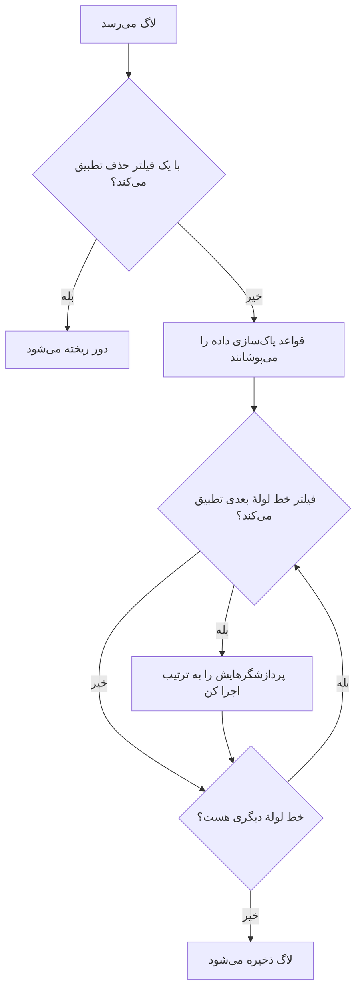

# خط‌های لوله لاگ

خط‌های لوله لاگ، لاگ‌ها را هنگام دریافت در OneUptime و پیش از ذخیره شدن دگرگون می‌کنند. هر خط لوله یک **فیلتر** دارد که تعیین می‌کند روی کدام لاگ‌ها اعمال شود، و فهرستی مرتب از **پردازشگرها** که هرکدام آن لاگ‌ها را تغییر می‌دهند: بیرون کشیدن فیلدها از پیام، اصلاح شدت، تغییر نام یک ویژگی، یا برچسب زدن یک دسته به لاگ.

خط‌های لوله در **لاگ‌ها → تنظیمات → خطوط لوله** قرار دارند.

:::cards
- [یک خط لوله چگونه اجرا می‌شود](#یک-خط-لوله-چگونه-اجرا-میشود): جای خط‌های لوله در دریافت داده، و ترتیب اجرای آن‌ها.
- [ساخت خط لوله](#ساخت-خط-لوله): چند لاگ را برگزینید و به آن‌ها پردازشگر بیفزایید.
- [Key=Value Parser](#keyvalue-parser): خط‌های فایروال و logfmt را به ویژگی تبدیل کنید.
- [نمونه: فایروال Sophos XGS](#نمونه-فایروال-sophos-xgs): syslog فایروال را از ابتدا تا انتها تجزیه کنید.
:::

## یک خط لوله چگونه اجرا می‌شود

خط‌های لوله روی هر لاگی که OneUptime دریافت می‌کند اجرا می‌شوند — لاگ‌های OpenTelemetry، syslog و Fluentd به یک اندازه — پس از فیلترهای حذف و قواعد پاک‌سازی، و پیش از ذخیره شدن لاگ:



- **خط‌های لوله به ترتیب اجرا می‌شوند** — به ترتیب فهرست، که با کشیدن سطرها آن را تغییر می‌دهید. یک خط لوله فقط به لاگ‌هایی دست می‌زند که فیلترش با آن‌ها تطبیق کند، و هر خط لوله‌ای که فیلترش تطبیق کند اجرا می‌شود، نه فقط نخستین.
- **پردازشگرها هم به ترتیب اجرا می‌شوند**، و هرکدام خروجی پردازشگر پیشین را می‌بیند، پس تجزیه‌گر باید پیش از پردازشگری بیاید که فیلدهای استخراج‌شدهٔ آن را می‌خواند. فیلتر یک خط لولهٔ بعدی هم تغییرات خط‌های لولهٔ پیشین را می‌بیند.
- **پردازش هنگام دریافت داده انجام می‌شود.** تغییر یک خط لوله روی لاگ‌هایی اثر می‌گذارد که پس از آن، ظرف حدود یک دقیقه، می‌رسند؛ لاگ‌هایی که پیش‌تر ذخیره شده‌اند دوباره پردازش نمی‌شوند.
- **پردازشگر هرگز لاگی را دور نمی‌ریزد یا خالی نمی‌کند.** خطی که تجزیه‌گر نتواند بخواند بی‌تغییر عبور می‌کند. برای دور ریختن لاگ‌ها از **لاگ‌ها → تنظیمات → فیلترهای حذف** استفاده کنید.
- **فقط خط‌های لوله و پردازشگرهای فعال اجرا می‌شوند.** یکی را در صفحهٔ خودش خاموش کنید تا بی‌آنکه تنظیماتش از دست برود متوقف شود.

## انواع پردازشگر

| پردازشگر | چه می‌کند |
| --- | --- |
| Grok Parser | با یک الگوی نام‌دار، فیلدها را از خطی با شکل ثابت (مانند یک خط دسترسی nginx) بیرون می‌کشد. |
| Key=Value Parser | خطی از جفت‌های `key=value` (Sophos XGS، Fortinet، logfmt) را با هر ترتیبی به ویژگی‌ها تقسیم می‌کند. |
| Severity Remapper | سطح خامی مانند `warn` را از یک ویژگی به شدت استاندارد لاگ نگاشت می‌کند. |
| Attribute Remapper | نام یک ویژگی را تغییر می‌دهد یا آن را کپی می‌کند، برای نمونه `src_ip` به `source_ip`. |
| Category Processor | وقتی لاگی با یک فیلتر تطبیق کند، نام یک دسته را به آن برچسب می‌زند، برای نمونه «Payment Error». |

## پیش از شروع

- لاگ‌هایی که به OneUptime می‌رسند — از راه [OpenTelemetry](/docs/telemetry/open-telemetry)، [syslog](/docs/telemetry/syslog)، [Fluentd](/docs/telemetry/fluentd) یا یک probe.
- مجوز تغییر خط‌های لوله. مالکان و مدیران پروژه آن را دارند؛ دیگران به مجوزهای **Create Log Pipeline** و **Create Log Pipeline Processor** نیاز دارند.

## ساخت خط لوله

:::steps
### خط لوله را بسازید

به **لاگ‌ها → تنظیمات → خطوط لوله** بروید و روی **ساخت خط لوله لاگ** کلیک کنید. یک **نام** به آن بدهید، مانند *تجزیهٔ لاگ‌های فایروال*، و آن را بسازید. صفحهٔ خط لوله باز می‌شود.

### برگزینید روی کدام لاگ‌ها اعمال شود

در **شرط‌های فیلتر** روی **ویرایش** کلیک کنید و شرط‌هایی روی **شدت**، **بدنه لاگ**، **شناسه سرویس** یا یک ویژگی سفارشی بیفزایید. آن‌ها را با **همه شرط‌ها** یا **هر یک از شرط‌ها** به هم بپیوندید، سپس روی **ذخیره تغییرات** کلیک کنید. خط لوله‌ای که شرطی ندارد روی همهٔ لاگ‌ها اعمال می‌شود.

### پردازشگر بیفزایید

در **پردازشگرها** روی **افزودن پردازشگر** کلیک کنید، یک **نام پردازشگر** وارد کنید، یک **نوع پردازشگر** برگزینید و تنظیماتش را پر کنید. تجزیه‌گرهای Grok و Key=Value یک آزمایشگر دارند: یک خط نمونه بچسبانید تا ببینید چه چیزی استخراج می‌کنند. روی **ساخت پردازشگر** کلیک کنید.

### آن‌ها را مرتب کنید

پردازشگرها را بکشید تا ترتیب اجرایشان را تغییر دهید، و خط‌های لوله را هم به همین شکل در فهرست **خطوط لوله** بکشید. لاگ‌های تازه ظرف حدود یک دقیقه پردازش می‌شوند.
:::

### شرط‌های فیلتر

هر شرط یک فیلد را با یک مقدار مقایسه می‌کند. پشت سازنده، فیلتر یک پرس‌وجو است، مانند `severityText = 'Error' AND body LIKE 'timeout'`، که **Preview query** آن را نشان می‌دهد.

| عملگر | در پرس‌وجو | یادداشت‌ها |
| --- | --- | --- |
| برابر است با | `=` | دقیق و حساس به بزرگی و کوچکی حروف. |
| برابر نیست با | `!=` | دقیق و حساس به بزرگی و کوچکی حروف. |
| دربر دارد | `LIKE` | بزرگی و کوچکی حروف را نادیده می‌گیرد. `%` در مقدار یک جانشین است. |
| یکی از این‌هاست | `IN` | فهرستی از مقادیر دقیق که با ویرگول جدا شده‌اند. |

مقادیر شدت `Fatal`، `Error`، `Warning`، `Information`، `Debug`، `Trace` و `Unspecified` هستند — پس `severityText = 'Error'` تطبیق می‌کند و `'ERROR'` هرگز تطبیق نمی‌کند. یک ویژگی سفارشی به شکل `attributes.<key>` نوشته می‌شود، برای نمونه `attributes.networkDevice.name = 'hq-firewall'`.

## Key=Value Parser

فایروال‌ها و دیگر دستگاه‌های شبکه هر رویداد را به‌صورت یک خط از جفت‌های `key=value` ثبت می‌کنند. اینکه یک خط چه فیلدهایی دارد، و به چه ترتیبی، به رویداد بستگی دارد، پس یک الگوی grok به‌تنهایی نمی‌تواند آن‌ها را توصیف کند. Key=Value Parser به الگو نیازی ندارد: خط را پیمایش می‌کند و هر جفتی را که پیدا کند، با هر ترتیبی، به یک ویژگی لاگ تبدیل می‌کند. وقتی ویژگی شدند می‌توانید رویشان جستجو و فیلتر کنید، آن‌ها را در یک [مانیتور لاگ](/docs/monitor/logs-monitor) به کار ببرید، و با [هشدار به تفکیک گروه](/docs/monitor/logs-monitor#هشدار-به-تفکیک-گروه-group-by) برای هر تونل، رابط یا کاربر یک بار هشدار بگیرید.

### پیکربندی

| تنظیم | پیش‌فرض | توضیح |
| --- | --- | --- |
| Source Field | `body` | فیلدی که تجزیه می‌شود: `body` برای پیام لاگ، یا یک ویژگی مانند `attributes.raw_line`. |
| Target Prefix | هیچ | فضای نامی برای کلیدهای استخراج‌شده. `sophos` کلید `con_name` را به‌صورت `sophos.con_name` ذخیره می‌کند. یک جداکننده افزوده می‌شود، مگر اینکه پیشوند از قبل به `.`، `_`، `-` یا `:` ختم شود. |
| Pair Delimiter | هر فاصلهٔ سفید | آنچه یک جفت را از جفت بعدی جدا می‌کند. برای Sophos، Fortinet و logfmt خالی بگذارید؛ برای قالب‌های دیگر `,`، `;` یا `\|` را تنظیم کنید. |
| Key-Value Delimiter | `=` | آنچه کلید را از مقدارش جدا می‌کند، برای نمونه `:` برای `status:up`. |
| بازنویسی در صورت تعارض | خاموش | آیا یک کلید می‌تواند جای ویژگی‌ای را که لاگ از قبل دارد بگیرد. به‌طور پیش‌فرض خاموش است: کلیدها از خود خط می‌آیند، وگرنه یک خط می‌توانست ویژگی‌هایی را که هنگام دریافت تنظیم شده‌اند، مانند دستگاهی که از آن آمده، بازنویسی کند. |

دو جداکننده باید متفاوت باشند، نباید یکدیگر را دربر داشته باشند، و نمی‌توانند گیومه یا بک‌اسلش داشته باشند؛ هرکدام حداکثر ۸ نویسه است. فرم پردازشگر پیش از ذخیره این را بررسی می‌کند، و آزمایشگرش، **Test With a Sample Line**، دقیقاً ویژگی‌هایی را که یک خط نمونه پدید می‌آورد نشان می‌دهد.

### قواعد تجزیه

- **مقادیر داخل گیومه** فاصله‌ها و جداکننده‌هایشان را نگه می‌دارند: `message="IPSec Connection HQ-Branch1 terminated"` یک مقدار است. گیومهٔ دوتایی و تکی هر دو کار می‌کنند، و `\"` درون یک مقدار یک گیومهٔ تحت‌اللفظی است. گیومه‌ای که هرگز بسته نشود — خطی که با محدودیت اندازهٔ syslog بریده شده — تا پایان خط ادامه می‌یابد.
- **مقادیر بدون گیومه** تا جداکنندهٔ جفت بعدی ادامه می‌یابند، پس `url=https://example.com/?a=b` نشانهٔ `=` خود را نگه می‌دارد.
- **مقادیر خالی** (`key=` و `key=""`) به‌صورت رشتهٔ خالی ذخیره می‌شوند.
- **مقادیر همیشه متن هستند.** `latency=11` به‌صورت `"11"` ذخیره می‌شود، همانند یک گرفتهٔ grok بدون نوع.
- **کلیدها** با یک حرف یا زیرخط آغاز می‌شوند و حرف، رقم و `. _ - @` دارند. متن پیش از نخستین جفت، مانند سرآیند syslog در RFC 3164، و واژه‌های پراکندهٔ بدون جداکننده نادیده گرفته می‌شوند. اولویت syslog که به نخستین کلید چسبیده باشد (`<30>device_name="SFW"`) حذف و کلید نگه داشته می‌شود.
- **کلید تکراری نخستین مقدارش را نگه می‌دارد**؛ مقدارهای بعدی نادیده گرفته می‌شوند.
- **محدودیت‌ها:** خطی بلندتر از ۳۲ KiB تجزیه نمی‌شود، از یک خط حداکثر ۱۰۰ جفت برداشته می‌شود، کلیدهای بلندتر از ۲۵۶ نویسه نادیده گرفته می‌شوند، و مقادیر بلندتر از ۴٬۰۹۶ نویسه کوتاه می‌شوند.

### نمونه: فایروال Sophos XGS

وقتی یک فایروال Sophos XGS لاگ syslog را به یک [probe](/docs/monitor/network-device-monitor) می‌فرستد، هر پیام به‌عنوان لاگ دستگاه شبکه ذخیره می‌شود و پیام syslog بدنهٔ آن است. برای تجزیهٔ آن:

:::steps
#### یک خط لوله برای فایروال بسازید

به **لاگ‌ها → تنظیمات → خطوط لوله** بروید و یک خط لوله بسازید. فیلتری به آن بدهید که با لاگ‌های فایروال تطبیق کند، برای نمونه ویژگی سفارشی `networkDevice.name` برابر است با `hq-firewall` (`attributes.networkDevice.name = 'hq-firewall'`)، یا **بدنه لاگ** دربر دارد `log_component=` تا با همهٔ خط‌های Sophos تطبیق کند.

#### تجزیه‌گر را بیفزایید

خط لوله را باز کنید و روی **افزودن پردازشگر** کلیک کنید. **Key=Value Parser** را برگزینید، **Source Field** را روی `body` نگه دارید، و **Target Prefix** را روی `sophos` بگذارید (اختیاری است، اما فیلدهای فایروال را کنار هم نگه می‌دارد).

#### بیازمایید و ذخیره کنید

یک خط از فایروال را در **Test With a Sample Line** بچسبانید تا نتیجه را بررسی کنید، سپس روی **ساخت پردازشگر** کلیک کنید.
:::

یک رویداد IPsec از Sophos:

```text
device_name="SFW" timestamp="2024-05-02T11:03:12+0200" device_model="XGS2100" device_serial_id="X1234" log_id="010101600001" log_type="Event" log_component="IPSec" log_subtype="System" severity="Information" con_name="HQ-Branch1" src_ip="10.171.4.117" dst_ip="10.171.4.118" status="Terminated" message="IPSec Connection HQ-Branch1 between 10.171.4.117 and 10.171.4.118 for Child HQ-Branch1 terminated."
```

به این ویژگی‌ها (در میان دیگر ویژگی‌ها) تبدیل می‌شود:

| ویژگی | مقدار |
| --- | --- |
| `sophos.log_component` | `IPSec` |
| `sophos.con_name` | `HQ-Branch1` |
| `sophos.status` | `Terminated` |
| `sophos.src_ip` | `10.171.4.117` |
| `sophos.message` | `IPSec Connection HQ-Branch1 between 10.171.4.117 and 10.171.4.118 for Child HQ-Branch1 terminated.` |

یک خط SLA در SD-WAN مجموعهٔ دیگری از فیلدها را با ترتیب دیگری دارد، و همان پردازشگر از پس آن برمی‌آید:

```text
log_id=158825619025 log_type="SD-WAN" log_component="SLA" profile_name="Branch-Internet" gw_name="WAN2" latency=11 jitter=2 packet_loss=0 gw_status="up" sla_status="SLA met"
```

نتیجه `sophos.gw_name = WAN2`، `sophos.latency = 11`، `sophos.packet_loss = 0`، `sophos.gw_status = up` و `sophos.sla_status = SLA met` است. نسخه‌های قدیمی‌تر SFOS قالبی قدیمی را ثبت می‌کنند (`device="SFW" date=2017-01-31 time=18:02:03 timezone="IST" ... connectionname="Tunnel A"`)؛ این قالب هم به همین شکل تجزیه می‌شود، با این تفاوت که نام تونل به‌جای `con_name` در `connectionname` است.

برای تبدیل این خط‌های SLA به متریک‌های تأخیر، لرزش و از دست رفتن بسته برای هر دروازه، نمونهٔ [قواعد ضبط لاگ](/docs/telemetry/log-recording-rules) را ببینید.

### نمونه: Fortinet FortiGate

لاگ‌های FortiGate همین سبک را دارند:

```text
date=2024-01-01 time=10:00:00 devname="FG100" logid="0100032001" type="event" subtype="vpn" level="notice" action="tunnel-down" vpntunnel="HQ-to-Branch2" msg="IPsec tunnel down"
```

با تنظیمات پیش‌فرض و پیشوند `fortigate` نتیجه `fortigate.devname = FG100`، `fortigate.subtype = vpn`، `fortigate.action = tunnel-down`، `fortigate.vpntunnel = HQ-to-Branch2` و `fortigate.time = 10:00:00` است — دونقطه‌های یک مقدار زمان بخشی از مقدارند، نه جداکننده.

### برای هر تونل یک بار هشدار بگیرید

با تجزیهٔ فیلدها، یک [مانیتور لاگ‌ها](/docs/monitor/logs-monitor) می‌تواند خرابی‌ها را بشمارد و برای هر تونل هشداری جداگانه بدهد: روی `sophos.log_component` = `IPSec` با بدنه‌ای که `terminated` را دربر دارد فیلتر کنید و بر اساس `sophos.con_name` گروه‌بندی کنید. [هشدار به تفکیک گروه](/docs/monitor/logs-monitor#هشدار-به-تفکیک-گروه-group-by) را ببینید.

## Grok Parser

فیلدهای ساختاریافته را از خطی با شکل ثابت بیرون می‌کشد. الگوی grok یک عبارت باقاعده با ارجاع‌های نام‌دار است: `%{IPV4:client_ip}` یعنی «با یک نشانی IPv4 تطبیق کن و آن را به‌صورت `client_ip` ذخیره کن». الگو لازم نیست با کل خط تطبیق کند، و خطی که تطبیق نکند بی‌تغییر می‌ماند.

| تنظیم | پیش‌فرض | توضیح |
| --- | --- | --- |
| **Source Field** | `body` | فیلدی که تجزیه می‌شود، همانند Key=Value Parser. |
| **Target Prefix** | هیچ | فضای نامی برای فیلدهای استخراج‌شده، که به همان شکل افزوده می‌شود. |
| **Grok Pattern** | — | الگو. فرم الگوهای نام‌دار موجود را فهرست می‌کند. |

یک گرفته به‌صورت متن ذخیره می‌شود مگر اینکه به آن نوع بدهید: `%{NUMBER:status:int}` آن را به‌صورت عدد ذخیره می‌کند. نوع‌ها `int`، `long`، `float`، `double`، `boolean` و `string` هستند. پیش از ذخیره، الگو را در **Test Your Pattern** روی یک خط نمونه بیازمایید.

| بدنهٔ لاگ | الگو | ویژگی‌های افزوده‌شده |
| --- | --- | --- |
| `10.0.1.5 - GET /health 200` | `%{IPV4:client_ip} - %{WORD:method} %{NOTSPACE:path} %{NUMBER:status:int}` | client_ip, method, path, status |

وقتی خط از جفت‌های `key=value` با ترتیب متغیر ساخته شده، به‌جای آن از Key=Value Parser استفاده کنید.

## Severity Remapper

یک مقدار خام را از یک ویژگی می‌خواند و آن را به یک شدت استاندارد نگاشت می‌کند. **ویژگی مبدأ** را روی ویژگی‌ای بگذارید که سطح را نگه می‌دارد (به‌طور پیش‌فرض `level`)، سپس **نگاشت‌ها** را بیفزایید: هرکدام مقداری را که برنامهٔ شما می‌فرستد، مانند `warn`، با یک شدت، مانند Warning، جفت می‌کند. تطبیق بزرگی و کوچکی حروف را نادیده می‌گیرد. مقداری که نگاشتی ندارد شدت لاگ را همان‌طور که بود رها می‌کند.

## Attribute Remapper

مقدار یک ویژگی (**کلید مبدأ**) را به ویژگی دیگری (**کلید هدف**) منتقل می‌کند، برای نمونه `src_ip` به `source_ip`.

| تنظیم | پیش‌فرض | اثر |
| --- | --- | --- |
| **نگه داشتن مبدأ** | خاموش | خاموش نام ویژگی را تغییر می‌دهد: کلید مبدأ حذف می‌شود. روشن آن را کپی می‌کند و کلید مبدأ را نگه می‌دارد. |
| **بازنویسی در صورت تعارض** | روشن | روشن، اگر هدف از قبل وجود داشته باشد، جای آن را می‌گیرد. خاموش هدف را دست‌نخورده می‌گذارد و نگاشت را رد می‌کند. |

## Category Processor

فهرستی از قواعد را به ترتیب ارزیابی می‌کند و نام نخستین قاعده‌ای را که فیلترش تطبیق کند در یک ویژگی هدف ذخیره می‌کند، تا بتوانید همهٔ لاگ‌های «Payment Error» را یکجا جستجو کنید. **ویژگی هدف** را تنظیم کنید (به‌طور پیش‌فرض `category`)، سپس **قواعد دسته** را بیفزایید: یک **Category name** و شرط‌های زیر **When logs match**. نخستین قاعدهٔ تطبیق‌کننده برنده است؛ لاگی که با هیچ‌کدام تطبیق نکند بی‌تغییر می‌ماند.

## گام‌های بعدی

:::cards
- [مانیتور لاگ‌ها](/docs/monitor/logs-monitor): روی ویژگی‌هایی که خط‌های لوله‌تان استخراج می‌کنند هشدار بگیرید.
- [قواعد ضبط لاگ](/docs/telemetry/log-recording-rules): فیلدهای تجزیه‌شدهٔ لاگ را به متریک تبدیل کنید.
- [Syslog](/docs/telemetry/syslog): syslog فایروال‌ها و سرورها را به OneUptime بفرستید.
- [نحو جستجو](/docs/telemetry/search-syntax): در کاوشگر لاگ‌ها روی ویژگی‌های تازه جستجو کنید.
:::
