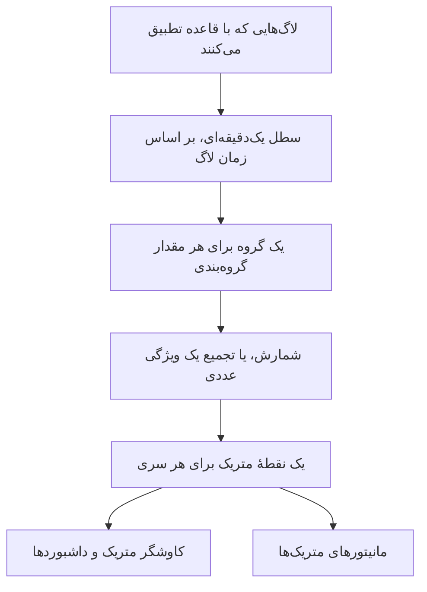
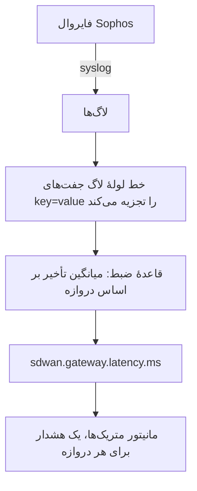

# قواعد ضبط لاگ

یک **Log Recording Rule** لاگ‌ها را به متریک تبدیل می‌کند. هر دقیقه لاگ‌هایی را که با فیلترش تطبیق می‌کنند برمی‌دارد و برای هر دقیقه یک عدد در انبارهٔ متریک می‌نویسد: شمار لاگ‌های تطبیق‌کننده، یا جمع، میانگین، کمینه، بیشینه یا یک صدک از یک ویژگی عددی که آن لاگ‌ها دارند. نتیجه را با حداکثر پنج ویژگی لاگ تفکیک کنید تا برای هر مقدار یک سری داشته باشید — یکی برای هر دروازه، هر میزبان، هر مشتری.

:::cards
- [یک قاعده چگونه کار می‌کند](#یک-قاعده-چگونه-کار-میکند): سطل‌ها، زمان‌بندی، جبران عقب‌ماندگی و شکاف‌ها.
- [ساخت یک قاعده](#ساخت-یک-قاعده): فیلدهای ویرایشگر قاعده.
- [نمونه: تأخیر دروازهٔ SD-WAN](#نمونه-تأخیر-دروازهٔ-sd-wan-از-یک-فایروال-sophos): از syslog فایروال تا هشدار برای هر دروازه.
- [مجوزها](#مجوزها): چه کسی می‌تواند قواعد را بسازد، تغییر دهد و بخواند.
:::

## نمای کلی

خروجی یک متریک معمولی است. آن را در **کاوشگر متریک** و روی داشبوردها رسم کنید، و با یک مانیتور **متریک‌ها** روی آن هشدار بگیرید — از جمله هشدار برای هر سری با **گروه‌بندی بر اساس**.

وقتی عددی که برایتان مهم است فقط در لاگ‌هایتان وجود دارد از قاعدهٔ ضبط لاگ استفاده کنید: خلاصه‌های SLA یک فایروال، کار دسته‌ای‌ای که مدت اجرایش را لاگ می‌کند، اندازهٔ پاسخ‌ها در یک لاگ دسترسی، یا صرفاً اینکه یک سرویس هر دقیقه چند لاگ خطا می‌نویسد.

قواعد ضبط لاگ در **لاگ‌ها → تنظیمات → قواعد ضبط** قرار دارند. همتاهای آن‌ها برای متریک‌ها و spanها در **متریک‌ها → تنظیمات → قواعد ضبط** و **ترِیس‌ها → تنظیمات → قواعد ضبط** هستند.

## یک قاعده چگونه کار می‌کند



- **یک نقطه در هر دقیقه، برای هر سری.** لاگ‌ها بر اساس زمانشان در سطل‌های ۱ دقیقه‌ای گروه‌بندی می‌شوند. هر سطل برای هر ترکیب متمایز از مقادیر ویژگی‌های گروه‌بندی یک نقطه تولید می‌کند.
- **۳۰ ثانیه پس از پایان دقیقه محاسبه می‌شود.** این انتظار کوتاه اجازه می‌دهد لاگ‌هایی که کمی دیر می‌رسند همچنان در دقیقهٔ خودشان قرار بگیرند. لاگی که دیرتر از آن برسد شمرده نمی‌شود.
- **نه شکاف، نه شمارش دوباره.** هر قاعده آخرین دقیقه‌ای را که نوشته به یاد می‌آورد (که در فهرست قواعد به‌صورت **Computed Until** نشان داده می‌شود). پس از راه‌اندازی دوبارهٔ کارگر یا هر توقف دیگری، دقیقه‌های از دست رفته را تا ۶۰ دقیقه به عقب جبران می‌کند، و هرگز یک دقیقه را دو بار نمی‌نویسد.
- **شمارش بدون گروه‌بندی هرگز شکاف ندارد.** دقیقه‌ای که هیچ لاگ تطبیق‌کننده‌ای ندارد به‌صورت `0` نوشته می‌شود. هر قاعدهٔ دیگری برای دقیقه‌ای که چیزی برای تجمیع ندارد چیزی نمی‌نویسد، پس نمودارها و مانیتورها به‌جای یک صفر ساختگی «بدون داده» می‌بینند.
- **مانند هر متریک مشتق دیگری نوشته می‌شود.** نقطه‌ها داده‌های Gauge هستند که به نام **نام متریک خروجی** قاعده نام‌گذاری شده‌اند، ویژگی‌های گروه‌بندی و `oneuptime.derived.log_rule_id` (شناسهٔ قاعده) را دارند، و از همان دورهٔ نگهداری نقطه‌های قواعد ضبط متریک و ترِیس پیروی می‌کنند: ۱۵ روز.

تغییر تعریف یک قاعده از دقیقهٔ بعدی‌ای که می‌نویسد اعمال می‌شود؛ نقطه‌هایی که پیش‌تر نوشته شده‌اند بازنویسی نمی‌شوند. خاموش کردن یک قاعده آن را متوقف می‌کند؛ با روشن کردن دوباره، دقیقه‌هایی را که در زمان خاموشی از دست داده تا همان ۶۰ دقیقه جبران می‌کند.

## ساخت یک قاعده

:::steps
### قواعد ضبط را باز کنید

به **لاگ‌ها → تنظیمات → قواعد ضبط** بروید و **ساخت Log Recording Rule** را برگزینید.

### برای قاعده نام بگذارید

یک **نام** بنویسید. **نام متریک خروجی** زیر آن هم‌زمان با نوشتن شما از نام ساخته می‌شود؛ برای نوشتن نام دلخواه، **ویرایش** را کنار آن برگزینید.

### لاگ‌ها و آنچه محاسبه می‌شود را برگزینید

در **Which Logs**، قاعده را با سرویس‌های تله‌متری، شدت‌ها، متن بدنه و فیلترهای ویژگی محدود کنید. یک **تجمیع** برگزینید، و برای هر چیزی جز شمارش، **Numeric Attribute** ای را که باید تجمیع شود.

### نتیجه را تفکیک و ذخیره کنید

در صورت تمایل ویژگی‌های **گروه‌بندی بر اساس** و یک **Unit** بیفزایید. خط پایین ویرایشگر را بررسی کنید، سپس ذخیره کنید. ظرف چند دقیقه فهرست قواعد یک زمان **Computed Until** نشان می‌دهد.
:::

| فیلد | چه می‌کند |
| --- | --- |
| نام | آنچه قاعده محاسبه می‌کند، برای نمونه *SD-WAN gateway latency*. |
| نام متریک خروجی | متریکی که قاعده می‌نویسد. از نام ساخته می‌شود — *SD-WAN gateway latency* متریک `sd_wan_gateway_latency` را می‌نویسد — مگر اینکه **ویرایش** را برگزینید و نام خودتان را بنویسید. باید در میان قواعد ضبط پروژه یکتا باشد. |
| Which Logs | فیلترهای اختیاری، همه با AND: سرویس‌های تله‌متری، شدت‌ها، متنی که بدنه دربر دارد، و فیلترهای ویژگی (ویژگی‌ای برابر با یک مقدار). |
| تجمیع | `Count of logs`، یا تجمیعی از یک ویژگی عددی (پایین‌تر را ببینید). |
| Numeric Attribute | برای هر تجمیعی جز شمارش: ویژگی‌ای که مقادیرش تجمیع می‌شوند، برای نمونه `latency`. |
| گروه‌بندی بر اساس | اختیاری: حداکثر ۵ کلید ویژگی. برای هر ترکیب متمایز از مقادیرشان یک سری. |
| Unit | اختیاری: واحد متریک خروجی، برای نمونه `ms`. هر جا متریک رسم شود نشان داده می‌شود. |
| توضیحات | زیر **فیلدهای بیشتر**: قاعده برای چیست. |
| فعال | زیر **فیلدهای بیشتر**: به‌طور پیش‌فرض روشن. فقط قواعد فعال محاسبه می‌شوند. |

خط پایین ویرایشگر می‌گوید قاعده چه چیزی خواهد نوشت، برای نمونه `avg(latency) by gw_name, profile_name`.

یک قاعده می‌تواند حداکثر روی ۱۰ ویژگی و ۱۰۰ سرویس تله‌متری فیلتر کند.

### تجمیع‌ها

| تجمیع | نقطهٔ هر دقیقه |
| --- | --- |
| Count of logs | شمار لاگ‌هایی که با فیلتر تطبیق کردند. |
| میانگین | میانگین مقادیر ویژگی عددی. |
| جمع | حاصل جمع مقادیر ویژگی. |
| کمینه | کوچک‌ترین مقدار. |
| بیشینه | بزرگ‌ترین مقدار. |
| p50 (median) | مقدار میانه. |
| p75 | صدک ۷۵. |
| p90 | صدک ۹۰. |
| p95 | صدک ۹۵. |
| p99 | صدک ۹۹. |

### ویژگی‌های عددی

مقدار ویژگی عددی باید یک عدد ساده باشد. می‌تواند به‌صورت عدد برسد (`latency=11` که به‌صورت عدد تجزیه شده) یا به‌صورت متن (`"11"`، `"11.5"`، `"1e3"`). لاگی که مقدارش غایب است یا عدد نیست — `"11ms"`، `"n/a"`، یک رشتهٔ خالی — **نادیده گرفته می‌شود**. هرگز به‌صورت `0` شمرده نمی‌شود، پس یک لاگ بدشکل نمی‌تواند میانگین را پایین بکشد.

### کلیدهای ویژگی

کلیدهای فیلتر ویژگی، مانند فیلترهای کاوشگر لاگ، با هر بزرگی و کوچکی حروف تطبیق می‌کنند. ویژگی عددی و کلیدهای گروه‌بندی باید دقیقاً همان‌طور نوشته شوند که لاگ‌هایتان آن‌ها را دارند — از جمله هر پیشوندی که یک خط لوله لاگ می‌افزاید. فیلدهای کلید کلیدهایی را که لاگ‌های پروژه‌تان دارند پیشنهاد می‌دهند، پس به‌جای نوشتن دستی کلید، از فهرست برگزینید.

کلیدها می‌توانند حرف، رقم و `. _ : / -` داشته باشند.

### گروه‌بندی، و سقف سری‌ها

هر کلید گروه‌بندی شمار سری‌هایی را که یک قاعده می‌نویسد چند برابر می‌کند، پس بر اساس ویژگی‌هایی گروه‌بندی کنید که چیزی را که می‌خواهید جداگانه ببینید یا جداگانه برایش هشدار بگیرید شناسایی می‌کنند — یک دروازه، یک میزبان، یک مشتری — نه بر اساس ویژگی‌هایی که در هر لاگ متفاوت‌اند، مانند شناسهٔ درخواست یا نشانی IP کلاینت.

یک قاعده در هر دقیقه حداکثر ۱٬۰۰۰ سری می‌نویسد. فراتر از آن، سری‌هایی که بیشترین لاگ تطبیق‌کننده را دارند نگه داشته و بقیهٔ آن دقیقه کنار گذاشته می‌شوند. لاگی که یکی از ویژگی‌های گروه‌بندی را ندارد همچنان شمرده می‌شود؛ سری آن بدون آن ویژگی نوشته می‌شود.

## نمونه: تأخیر دروازهٔ SD-WAN از یک فایروال Sophos

یک فایروال Sophos XGS که ثبت لاگ SD-WAN در آن روشن است، هر چند دقیقه یک خلاصهٔ SLA برای هر پروفایل SD-WAN و دروازه می‌فرستد:

```text
log_type="SD-WAN" log_component="SLA" profile_name="Branch-Internet" gw_name="WAN2" latency=11 jitter=2 packet_loss=0 gw_status="up" sla_status="SLA met"
```

این نمونه آن خلاصه‌ها را به متریک تأخیر برای هر دروازه تبدیل می‌کند، و وقتی تأخیر یک دروازه بالا بماند هشدار می‌دهد.



:::steps
### لاگ‌ها را با فیلدهایشان به‌صورت ویژگی وارد کنید

1. syslog فایروال را به OneUptime بفرستید — [Syslog](/docs/telemetry/syslog) را ببینید.
2. در **لاگ‌ها → تنظیمات → خطوط لوله**، خط لوله‌ای با پردازشگری بیفزایید که جفت‌های `key=value` بدنه را به ویژگی‌های لاگ تجزیه کند، تا هر خلاصه `log_type`، `log_component`، `profile_name`، `gw_name`، `latency`، `jitter` و `packet_loss` را به‌صورت ویژگی داشته باشد. [Key=Value Parser](/docs/telemetry/log-pipelines#keyvalue-parser) همین کار را می‌کند.
3. کاوشگر **لاگ‌ها** را باز کنید و نام ویژگی‌ها را روی یک لاگ SLA بررسی کنید. اگر خط لوله‌تان پیشوندی می‌افزاید، در ادامه از نام‌های پیشونددار استفاده کنید.

### قاعدهٔ ضبط را بسازید

در **لاگ‌ها → تنظیمات → قواعد ضبط** یک قاعده بسازید:

- **نام:** SD-WAN gateway latency
- **نام متریک خروجی:** **ویرایش** را برگزینید و `sdwan.gateway.latency.ms` را بنویسید
- **Which Logs:** فیلترهای ویژگی `log_type` = `SD-WAN` و `log_component` = `SLA`
- **تجمیع:** میانگین، **Numeric Attribute:** `latency`
- **گروه‌بندی بر اساس:** `gw_name` و `profile_name`
- **Unit:** `ms`

از راه API، MCP یا Terraform، **تعریف** همین قاعده چنین است:

```json
{
  "filter": {
    "attributeFilters": [
      { "key": "log_type", "value": "SD-WAN" },
      { "key": "log_component", "value": "SLA" }
    ]
  },
  "aggregationType": "Avg",
  "valueAttribute": "latency",
  "groupByAttributes": ["gw_name", "profile_name"],
  "unit": "ms"
}
```

برای دو سنجش دیگر SLA، همین کار را با `jitter` (`sdwan.gateway.jitter.ms`، واحد `ms`) و `packet_loss` (`sdwan.gateway.packet_loss.percent`، واحد `%`) تکرار کنید. یک قاعدهٔ **Count of logs** که روی `gw_status` = `down` فیلتر و بر اساس `gw_name` گروه‌بندی شده باشد، گزارش‌های از کار افتادن دروازه را برای هر دروازه می‌شمارد.

ظرف چند دقیقه فهرست قواعد یک زمان **Computed Until** نشان می‌دهد، و `sdwan.gateway.latency.ms` در کاوشگر متریک ظاهر می‌شود: آن را برگزینید، بر اساس `gw_name` گروه‌بندی کنید، و برای هر دروازه یک خط تأخیر دارید.

### وقتی تأخیر یک دروازه بالا می‌ماند هشدار بگیرید

یک مانیتور **متریک‌ها** بسازید ([مانیتور متریک‌ها](/docs/monitor/metrics-monitor) را ببینید):

1. **پرس‌وجوی متریک:** `sdwan.gateway.latency.ms`، تجمیع **میانگین**، **گروه‌بندی بر اساس** `gw_name` و `profile_name`.
2. **پنجرهٔ زمانی غلتان:** Past 15 Minutes. فایروال هر چند دقیقه گزارش می‌دهد، پس پنجره برای هر دروازه چند نقطه دارد.
3. **راهبرد تجمیع:** **All Values** — هر نقطه در پنجره باید از آستانه بگذرد، پس یک خلاصهٔ کند کسی را فرا نمی‌خواند. برای هشدار روی میانگین بالا، به‌جای آن از **میانگین** استفاده کنید.
4. **معیارها:** Metric value **Greater Than** `150` یک هشدار باز می‌کند.
5. در صورت تمایل مقادیر گروه‌بندی را در عنوان هشدار به کار ببرید، برای نمونه `SD-WAN latency high on {{gw_name}} ({{profile_name}})`.

با تنظیم گروه‌بندی، هر دروازه سری خودش است: کند شدن WAN2 فقط برای WAN2 هشدار باز می‌کند، و وقتی WAN2 بهبود یابد خودبه‌خود برطرف می‌شود — [هشدار برای هر سری](/docs/monitor/metrics-monitor) را ببینید.
:::

## نکته‌ها

- **زمان‌ها از لاگ‌ها می‌آیند.** هر لاگ در دقیقهٔ زمان خودش قرار می‌گیرد. دستگاهی که ساعتش بیش از اندکی خطا دارد لاگ‌هایش را در دقیقهٔ نادرست، یا کاملاً بیرون از پنجره، قرار می‌دهد.
- **بدون پرکردن گذشته.** یک قاعدهٔ تازه از دقیقهٔ پیش از نخستین اجرایش شروع می‌کند؛ لاگ‌های قدیمی‌تر محاسبه نمی‌شوند.
- **حذف یک قاعده** آن را متوقف می‌کند. نقطه‌هایی که پیش‌تر نوشته تا زمان انقضا باقی می‌مانند.
- **قواعد ضبط با دید کامل پروژه بر لاگ‌ها اجرا می‌شوند.** هر کسی که بتواند متریک خروجی را بخواند، اعدادی را می‌بیند که از هر لاگی که با فیلتر قاعده تطبیق کند محاسبه شده‌اند، پس ساخت و ویرایش قواعد ضبط لاگ به مالکان و مدیران پروژه و مجوزهای **Create / Edit Log Recording Rule** محدود است.

## مجوزها

| مجوز | اجازه می‌دهد |
| --- | --- |
| Create Log Recording Rule | ساخت قواعد. |
| Edit Log Recording Rule | تغییر قواعد، و خاموش کردن آن‌ها. |
| Delete Log Recording Rule | حذف قواعد. |
| Read Log Recording Rule | دیدن قواعد و آنچه محاسبه می‌کنند. |

مالکان و مدیران پروژه همهٔ این کارها را می‌توانند انجام دهند. اعضای پروژه، بینندگان و نقش‌های تله‌متری می‌توانند قواعد را بخوانند.

## گام‌های بعدی

:::cards
- [مانیتور متریک‌ها](/docs/monitor/metrics-monitor): روی متریک‌هایی که قواعدتان می‌نویسند هشدار بگیرید.
- [خط‌های لوله لاگ](/docs/telemetry/log-pipelines): ویژگی‌هایی را که یک قاعده تجمیع می‌کند استخراج کنید.
- [Syslog](/docs/telemetry/syslog): لاگ‌های فایروال و سرور را به OneUptime بفرستید.
:::
